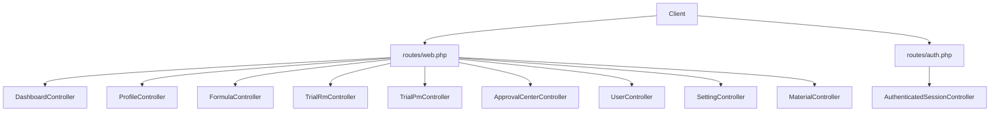
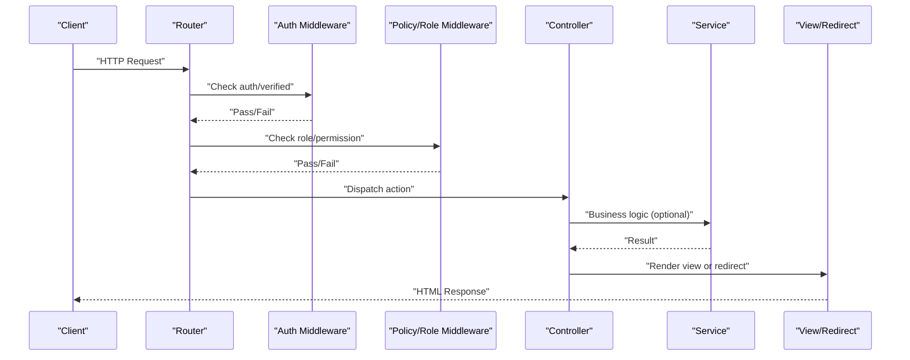
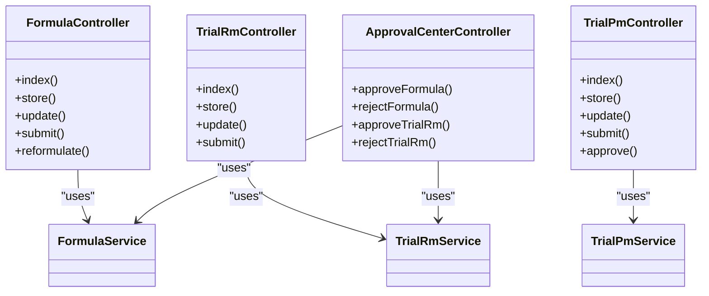

# API Reference

<cite>
**Referenced Files in This Document**
- [web.php](file://routes/web.php)
- [auth.php](file://routes/auth.php)
- [AuthenticatedSessionController.php](file://app/Http/Controllers/Auth/AuthenticatedSessionController.php)
- [DashboardController.php](file://app/Http/Controllers/DashboardController.php)
- [ProfileController.php](file://app/Http/Controllers/ProfileController.php)
- [FormulaController.php](file://app/Http/Controllers/FormulaController.php)
- [TrialRmController.php](file://app/Http/Controllers/TrialRmController.php)
- [TrialPmController.php](file://app/Http/Controllers/TrialPmController.php)
- [ApprovalCenterController.php](file://app/Http/Controllers/ApprovalCenterController.php)
- [UserController.php](file://app/Http/Controllers/UserController.php)
- [SettingController.php](file://app/Http/Controllers/SettingController.php)
- [MaterialController.php](file://app/Http/Controllers/MaterialController.php)
</cite>

## Table of Contents
1. Introduction
2. Project Structure
3. Core Components
4. Architecture Overview
5. Detailed Component Analysis
6. Dependency Analysis
7. Performance Considerations
8. Troubleshooting Guide
9. Conclusion

## Introduction
This document provides a comprehensive API reference for the web application endpoints implemented in this Laravel project. It covers HTTP methods, URL patterns, request parameters, response behavior, authentication and authorization requirements, form submissions, file uploads, approval workflows, error handling, and practical client integration guidance. The application is primarily a server-rendered web app using session-based authentication; however, all endpoints can be consumed by clients that manage sessions or cookies appropriately.

## Project Structure
The application exposes routes grouped under middleware for authentication, verification, role-based access control, and policy checks. Controllers implement CRUD operations, custom actions (submit, approve), and file upload handling. Routes are defined in:
- routes/web.php: main application routes
- routes/auth.php: authentication-related routes

**Diagram sources**
- [web.php:23-91](file://routes/web.php#L23-L91)
- [auth.php:14-59](file://routes/auth.php#L14-L59)

**Section sources**
- [web.php:23-91](file://routes/web.php#L23-L91)
- [auth.php:14-59](file://routes/auth.php#L14-L59)

## Core Components
- Authentication and session management via controllers and route groups.
- Resource controllers for Formulas, Trial RM, Trial PM, Materials, Suppliers, Users, and Settings.
- Approval Center controller for multi-stage approvals.
- Policy and role-based middleware protecting routes.

Key behaviors:
- Most routes require an authenticated user and specific roles or permissions.
- Many endpoints return HTML views with redirects and flash messages; validation errors are returned to the previous page.
- File uploads are handled via multipart/form-data and stored on the public disk.

**Section sources**
- [web.php:23-91](file://routes/web.php#L23-L91)
- [auth.php:14-59](file://routes/auth.php#L14-L59)
- [AuthenticatedSessionController.php:25-46](file://app/Http/Controllers/Auth/AuthenticatedSessionController.php#L25-L46)
- [ProfileController.php:27-49](file://app/Http/Controllers/ProfileController.php#L27-L49)
- [FormulaController.php:72-94](file://app/Http/Controllers/FormulаController.php#L72-L94)
- [TrialRmController.php:71-97](file://app/Http/Controllers/TrialRmController.php#L71-L97)
- [TrialPmController.php:55-109](file://app/Http/Controllers/TrialPmController.php#L55-L109)
- [ApprovalCenterController.php:66-105](file://app/Http/Controllers/ApprovalCenterController.php#L66-L105)
- [UserController.php:34-59](file://app/Http/Controllers/UserController.php#L34-L59)
- [SettingController.php:20-58](file://app/Http/Controllers/SettingController.php#L20-L58)
- [MaterialController.php:21-40](file://app/Http/Controllers/MaterialController.php#L21-L40)

## Architecture Overview
The application uses a layered approach:
- Routes define URLs and map to controller actions.
- Controllers validate input, enforce policies/roles, and delegate business logic to services where applicable.
- Models represent domain entities and relationships.
- Views render HTML responses; many endpoints redirect after successful mutations.

[No sources needed since this diagram shows conceptual workflow, not actual code structure]

## Detailed Component Analysis

### Authentication Endpoints
All authentication routes are protected by guest or auth middleware as appropriate.

- POST /login
  - Purpose: Authenticate user and start session.
  - Body: email, password (form-encoded).
  - Success: Redirect to dashboard.
  - Errors: Validation errors returned to login page.
  - Notes: Session regenerated on success.

- POST /logout
  - Purpose: Invalidate session and log out.
  - Method: POST (CSRF required).
  - Success: Redirect to home.

- GET /register, POST /register
  - Purpose: Create new account.
  - Body: name, email, password, password_confirmation.
  - Success: Redirect to login or dashboard depending on flow.

- GET /forgot-password, POST /forgot-password
  - Purpose: Send password reset link.
  - Body: email.
  - Success: Redirect with status message.

- GET /reset-password/{token}, POST /reset-password
  - Purpose: Set new password.
  - Body: token, email, password, password_confirmation.
  - Success: Redirect to login.

- GET /verify-email, GET /verify-email/{id}/{hash}
  - Purpose: Verify email address.
  - Rate limit: Throttled at verify endpoint.

- POST /email/verification-notification
  - Purpose: Resend verification email.
  - Rate limit: Throttled.

- GET /confirm-password, POST /confirm-password
  - Purpose: Re-confirm password for sensitive actions.

- PUT /password
  - Purpose: Update current password.
  - Requires auth.

Security notes:
- All auth routes use CSRF protection.
- Email verification endpoints are throttled.

**Section sources**
- [auth.php:14-59](file://routes/auth.php#L14-L59)
- [AuthenticatedSessionController.php:25-46](file://app/Http/Controllers/Auth/AuthenticatedSessionController.php#L25-L46)

### Dashboard
- GET /dashboard
  - Purpose: Display dashboard with stats and recent activity.
  - Auth: Required and verified.
  - Response: HTML view.

**Section sources**
- [web.php:26](file://routes/web.php#L26)
- [DashboardController.php:14-103](file://app/Http/Controllers/DashboardController.php#L14-L103)

### Profile Management
- GET /profile
  - Purpose: Edit profile form.
  - Auth: Required.
  - Response: HTML view.

- PATCH /profile
  - Purpose: Update profile information and optional signature upload.
  - Body: name, email, signature (image).
  - Validation: Signature must be image and within size limits.
  - Success: Redirect to profile edit with status.

- DELETE /profile
  - Purpose: Delete account.
  - Body: password confirmation.
  - Success: Redirect to home.

**Section sources**
- [web.php:29-31](file://routes/web.php#L29-L31)
- [ProfileController.php:27-49](file://app/Http/Controllers/ProfileController.php#L27-L49)
- [ProfileController.php:54-70](file://app/Http/Controllers/ProfileController.php#L54-L70)

### Formulas (RM)
Resource routes under /formulas with additional custom actions.

- GET /formulas
  - Query params: search, status, stage.
  - Response: Paginated list view.

- GET /formulas/create
  - Response: Create form view.

- POST /formulas
  - Body: name, development_stage, materials[] (material_id, supplier_id, percentage).
  - Validation: Array fields and numeric percentages.
  - Success: Redirect to show with success message.

- GET /formulas/{formula}
  - Response: Detail view with related data.

- GET /formulas/{formula}/edit
  - Response: Edit form view.

- PATCH /formulas/{formula}
  - Body: same as create.
  - Success: Redirect to show.

- DELETE /formulas/{formula}
  - Success: Redirect to index.

- POST /formulas/{formula}/submit
  - Purpose: Submit formula for approval.
  - Success: Redirect to show.

- POST /formulas/{formula}/reformulate
  - Purpose: Create a new version based on existing formula.
  - Success: Redirect to edit of new version.

Notes:
- All routes require auth and permission can:formula.view.
- Policies enforced in controller methods.

**Section sources**
- [web.php:34-40](file://routes/web.php#L34-L40)
- [FormulaController.php:20-53](file://app/Http/Controllers/FormulаController.php#L20-L53)
- [FormulaController.php:72-94](file://app/Http/Controllers/FormulаController.php#L72-L94)
- [FormulaController.php:99-106](file://app/Http/Controllers/FormulаController.php#L99-L106)
- [FormulaController.php:127-149](file://app/Http/Controllers/FormulаController.php#L127-L149)
- [FormulaController.php:154-163](file://app/Http/Controllers/FormulаController.php#L154-L163)
- [FormulaController.php:168-181](file://app/Http/Controllers/FormulаController.php#L168-L181)
- [FormulaController.php:186-199](file://app/Http/Controllers/FormulаController.php#L186-L199)

### Trial RM
Resource routes under /trial-rms with submit action.

- GET /trial-rms
  - Query params: search, decision.
  - Response: Paginated list view.

- GET /trial-rms/create
  - Response: Create form view.

- POST /trial-rms
  - Body: formula_id, sample_identity, process_steps, decision, verifications[] (parameter_name, target_value, actual_value, status, notes).
  - Validation: Arrays and enums.
  - Success: Redirect to show.

- GET /trial-rms/{trialRm}
  - Response: Detail view.

- GET /trial-rms/{trialRm}/edit
  - Response: Edit form view.

- PATCH /trial-rms/{trialRm}
  - Body: same as create except formula_id not included.
  - Success: Redirect to show.

- DELETE /trial-rms/{trialRm}
  - Success: Redirect to index.

- POST /trial-rms/{trialRm}/submit
  - Purpose: Submit trial RM for approval.
  - Success: Redirect to show.

Notes:
- All routes require auth and permission can:trial_rm.view.

**Section sources**
- [web.php:43-48](file://routes/web.php#L43-L48)
- [TrialRmController.php:19-41](file://app/Http/Controllers/TrialRmController.php#L19-L41)
- [TrialRmController.php:71-97](file://app/Http/Controllers/TrialRmController.php#L71-L97)
- [TrialRmController.php:102-109](file://app/Http/Controllers/TrialRmController.php#L102-L109)
- [TrialRmController.php:130-155](file://app/Http/Controllers/TrialRmController.php#L130-L155)
- [TrialRmController.php:160-169](file://app/Http/Controllers/TrialRmController.php#L160-L169)
- [TrialRmController.php:174-187](file://app/Http/Controllers/TrialRmController.php#L174-L187)

### Trial PM
Resource routes under /trial-pms with submit and approve actions, plus print.

- GET /trial-pms
  - Query params: search, status.
  - Response: Paginated list view.

- GET /trial-pms/create
  - Response: Create form view.

- POST /trial-pms
  - Body: proposal_number, packaging_material, supplier, product_use, product_trial, trial_sample_quantity, old_supplier, difference_with_existing, specifications[], executions[], discussion_rows[], uploaded_photos[], risk_analysis.
  - Uploads: uploaded_photos[] images (jpeg,png,jpg,gif, max 5MB each).
  - Validation: Arrays and enums.
  - Success: Redirect to show.

- GET /trial-pms/{trialPm}
  - Response: Detail view.

- GET /trial-pms/{trialPm}/print
  - Purpose: Print-friendly view.
  - Response: HTML print view.

- GET /trial-pms/{trialPm}/edit
  - Response: Edit form view.

- PATCH /trial-pms/{trialPm}
  - Body: same as create.
  - Uploads: appended to existing photos if provided.
  - Success: Redirect to show.

- DELETE /trial-pms/{trialPm}
  - Success: Redirect to index.

- POST /trial-pms/{trialPm}/submit
  - Purpose: Submit for department review.
  - Success: Redirect to show.

- POST /trial-pms/{trialPm}/approve
  - Purpose: Department approval/rejection.
  - Body: department (rd,qc,production,engineering), is_approved (boolean), notes.
  - Success: Redirect to show with status message.

Notes:
- All routes require auth and permission can:trial_pm.view.

**Section sources**
- [web.php:51-62](file://routes/web.php#L51-L62)
- [TrialPmController.php:18-40](file://app/Http/Controllers/TrialPmController.php#L18-L40)
- [TrialPmController.php:55-109](file://app/Http/Controllers/TrialPmController.php#L55-L109)
- [TrialPmController.php:114-121](file://app/Http/Controllers/TrialPmController.php#L114-L121)
- [TrialPmController.php:126-133](file://app/Http/Controllers/TrialPmController.php#L126-L133)
- [TrialPmController.php:148-202](file://app/Http/Controllers/TrialPmController.php#L148-L202)
- [TrialPmController.php:207-216](file://app/Http/Controllers/TrialPmController.php#L207-L216)
- [TrialPmController.php:221-234](file://app/Http/Controllers/TrialPmController.php#L221-L234)
- [TrialPmController.php:239-265](file://app/Http/Controllers/TrialPmController.php#L239-L265)

### Approval Center
Endpoints for managers to approve or reject items.

- GET /approval-center
  - Purpose: View pending items based on role.
  - Auth: Required with approval_center.access permission.
  - Response: HTML view.

- POST /approval-center/formulas/{formula}/approve
  - Purpose: Approve formula (Tahap 1 or Tahap 2 depending on role).
  - Success: Redirect to approval center with success message.

- POST /approval-center/formulas/{formula}/reject
  - Purpose: Reject formula.
  - Body: rejection_notes (string, max 1000).
  - Success: Redirect to approval center.

- POST /approval-center/trial-rms/{trialRm}/approve
  - Purpose: Approve trial RM (Tahap 1 or Tahap 2 depending on role).
  - Success: Redirect to approval center.

- POST /approval-center/trial-rms/{trialRm}/reject
  - Purpose: Reject trial RM.
  - Body: rejection_notes (string, max 1000).
  - Success: Redirect to approval center.

Notes:
- All routes require auth and approval_center.access permission.

**Section sources**
- [web.php:65-79](file://routes/web.php#L65-L79)
- [ApprovalCenterController.php:23-61](file://app/Http/Controllers/ApprovalCenterController.php#L23-L61)
- [ApprovalCenterController.php:66-105](file://app/Http/Controllers/ApprovalCenterController.php#L66-L105)
- [ApprovalCenterController.php:110-149](file://app/Http/Controllers/ApprovalCenterController.php#L110-L149)

### User Management (Superadmin only)
Resource routes under /users.

- GET /users, GET /users/create, POST /users
  - Create user with name, email, password, password_confirmation, role.
  - Role assigned upon creation.

- GET /users/{user}/edit, PATCH /users/{user}
  - Update user details and optionally password; sync role.

- DELETE /users/{user}
  - Delete user (cannot delete self).

Notes:
- Protected by role:Superadmin middleware.

**Section sources**
- [web.php:82](file://routes/web.php#L82)
- [UserController.php:34-59](file://app/Http/Controllers/UserController.php#L34-L59)
- [UserController.php:71-101](file://app/Http/Controllers/UserController.php#L71-L101)
- [UserController.php:103-119](file://app/Http/Controllers/UserController.php#L103-L119)

### System Settings (Superadmin only)
- GET /settings
  - Purpose: Settings page.
  - Response: HTML view.

- PUT /settings
  - Purpose: Update system identity settings and logos.
  - Body: app_name, company_name, app_logo (image), app_favicon (image).
  - Success: Redirect back with success message.

Notes:
- Protected by role:Superadmin middleware.

**Section sources**
- [web.php:85-86](file://routes/web.php#L85-L86)
- [SettingController.php:20-58](file://app/Http/Controllers/SettingController.php#L20-L58)

### Data Masters
Materials and Suppliers resources.

- Materials (/materials)
  - CRUD: name, type, unit, description.
  - Protected by role:Superadmin|Staff R&D.

- Suppliers (/suppliers)
  - CRUD: standard fields (as per resource controller).
  - Protected by role:Superadmin|Staff R&D.

**Section sources**
- [web.php:89-90](file://routes/web.php#L89-L90)
- [MaterialController.php:21-40](file://app/Http/Controllers/MaterialController.php#L21-L40)
- [MaterialController.php:47-66](file://app/Http/Controllers/MaterialController.php#L47-L66)

## Dependency Analysis
High-level dependencies between controllers and services/models:

**Diagram sources**
- [FormulaController.php:15](file://app/Http/Controllers/FormulаController.php#L15)
- [TrialRmController.php:14](file://app/Http/Controllers/TrialRmController.php#L14)
- [TrialPmController.php:13](file://app/Http/Controllers/TrialPmController.php#L13)
- [ApprovalCenterController.php:15-18](file://app/Http/Controllers/ApprovalCenterController.php#L15-L18)

**Section sources**
- [FormulaController.php:15](file://app/Http/Controllers/FormulаController.php#L15)
- [TrialRmController.php:14](file://app/Http/Controllers/TrialRmController.php#L14)
- [TrialPmController.php:13](file://app/Http/Controllers/TrialPmController.php#L13)
- [ApprovalCenterController.php:15-18](file://app/Http/Controllers/ApprovalCenterController.php#L15-L18)

## Performance Considerations
- Pagination is used in list endpoints (e.g., formulas, trials, users, materials) to limit payload sizes.
- Eager loading is applied in detail endpoints to reduce N+1 queries.
- File uploads are validated and stored on the public disk; ensure storage symlink is configured.
- Throttling is applied to email verification endpoints to prevent abuse.

[No sources needed since this section provides general guidance]

## Troubleshooting Guide
Common issues and resolutions:
- 403 Forbidden: Indicates missing role or permission. Check route middleware and user roles/permissions.
- Validation errors: Returned as form errors with input repopulation. Inspect request payloads and field constraints.
- File upload failures: Ensure storage disk configuration and maximum upload size in server settings.
- CSRF errors: Ensure forms include CSRF tokens when submitting state-changing requests.
- Rate limiting: Email verification endpoints are throttled; wait before retrying.

**Section sources**
- [auth.php:43-48](file://routes/auth.php#L43-L48)
- [ProfileController.php:37-44](file://app/Http/Controllers/ProfileController.php#L37-L44)
- [TrialPmController.php:85-98](file://app/Http/Controllers/TrialPmController.php#L85-L98)
- [SettingController.php:26-31](file://app/Http/Controllers/SettingController.php#L26-L31)

## Conclusion
This API reference documents the web endpoints, their parameters, authentication and authorization requirements, and response behaviors. The application follows a conventional MVC pattern with clear separation of concerns, robust validation, and role-based access control. Clients should handle session cookies and CSRF tokens appropriately when integrating with these endpoints.