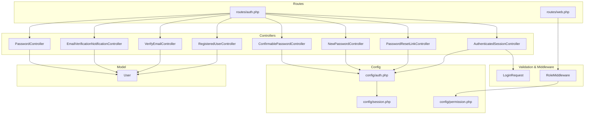
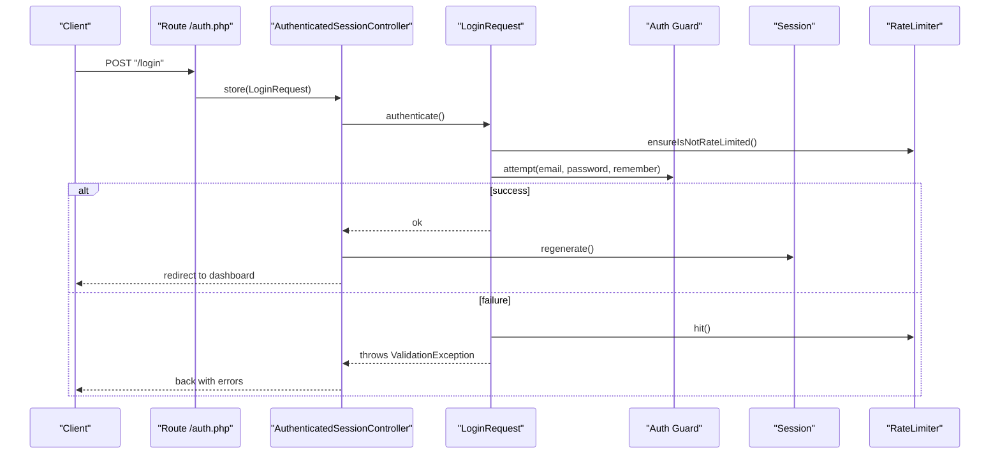
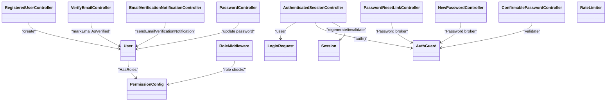

# Authentication API

<cite>
**Referenced Files in This Document**
- [routes/auth.php](file://routes/auth.php)
- [routes/web.php](file://routes/web.php)
- [app/Http/Controllers/Auth/AuthenticatedSessionController.php](file://app/Http/Controllers/Auth/AuthenticatedSessionController.php)
- [app/Http/Controllers/Auth/RegisteredUserController.php](file://app/Http/Controllers/Auth/RegisteredUserController.php)
- [app/Http/Controllers/Auth/NewPasswordController.php](file://app/Http/Controllers/Auth/NewPasswordController.php)
- [app/Http/Controllers/Auth/PasswordResetLinkController.php](file://app/Http/Controllers/Auth/PasswordResetLinkController.php)
- [app/Http/Controllers/Auth/VerifyEmailController.php](file://app/Http/Controllers/Auth/VerifyEmailController.php)
- [app/Http/Controllers/Auth/EmailVerificationNotificationController.php](file://app/Http/Controllers/Auth/EmailVerificationNotificationController.php)
- [app/Http/Controllers/Auth/ConfirmablePasswordController.php](file://app/Http/Controllers/Auth/ConfirmablePasswordController.php)
- [app/Http/Controllers/Auth/PasswordController.php](file://app/Http/Controllers/Auth/PasswordController.php)
- [app/Http/Requests/Auth/LoginRequest.php](file://app/Http/Requests/Auth/LoginRequest.php)
- [app/Http/Middleware/RoleMiddleware.php](file://app/Http/Middleware/RoleMiddleware.php)
- [config/auth.php](file://config/auth.php)
- [config/session.php](file://config/session.php)
- [config/permission.php](file://config/permission.php)
- [app/Models/User.php](file://app/Models/User.php)
</cite>

## Table of Contents
1. Introduction
2. Project Structure
3. Core Components
4. Architecture Overview
5. Detailed Component Analysis
6. Dependency Analysis
7. Performance Considerations
8. Troubleshooting Guide
9. Conclusion

## Introduction
This document provides comprehensive API documentation for the authentication endpoints implemented in this Laravel application. It covers login, logout, user registration, password reset (request and update), email verification, password confirmation, and password update. It also documents session management, token handling, middleware requirements, role-based access control integration, security considerations, and client-side flow examples.

The application uses session-based authentication with CSRF protection and integrates Spatie Permission for roles and permissions. Email verification is supported via signed URLs and throttling.

## Project Structure
Authentication routes are grouped under guest and auth middleware, with additional protected routes requiring verified email and role checks. Controllers implement standard web flows returning redirects and views; there are no JSON APIs for these endpoints.

**Diagram sources**
- [routes/auth.php:1-60](file://routes/auth.php#L1-L60)
- [routes/web.php:23-91](file://routes/web.php#L23-L91)
- [app/Http/Controllers/Auth/AuthenticatedSessionController.php:1-48](file://app/Http/Controllers/Auth/AuthenticatedSessionController.php#L1-L48)
- [app/Http/Controllers/Auth/RegisteredUserController.php:1-52](file://app/Http/Controllers/Auth/RegisteredUserController.php#L1-L52)
- [app/Http/Controllers/Auth/PasswordResetLinkController.php:1-46](file://app/Http/Controllers/Auth/PasswordResetLinkController.php#L1-L46)
- [app/Http/Controllers/Auth/NewPasswordController.php:1-64](file://app/Http/Controllers/Auth/NewPasswordController.php#L1-L64)
- [app/Http/Controllers/Auth/VerifyEmailController.php:1-28](file://app/Http/Controllers/Auth/VerifyEmailController.php#L1-L28)
- [app/Http/Controllers/Auth/EmailVerificationNotificationController.php:1-25](file://app/Http/Controllers/Auth/EmailVerificationNotificationController.php#L1-L25)
- [app/Http/Controllers/Auth/ConfirmablePasswordController.php:1-41](file://app/Http/Controllers/Auth/ConfirmablePasswordController.php#L1-L41)
- [app/Http/Controllers/Auth/PasswordController.php:1-30](file://app/Http/Controllers/Auth/PasswordController.php#L1-L30)
- [app/Http/Requests/Auth/LoginRequest.php:1-87](file://app/Http/Requests/Auth/LoginRequest.php#L1-L87)
- [app/Http/Middleware/RoleMiddleware.php:1-35](file://app/Http/Middleware/RoleMiddleware.php#L1-L35)
- [config/auth.php:1-118](file://config/auth.php#L1-L118)
- [config/session.php:1-234](file://config/session.php#L1-L234)
- [config/permission.php:1-220](file://config/permission.php#L1-L220)
- [app/Models/User.php:1-50](file://app/Models/User.php#L1-L50)

**Section sources**
- [routes/auth.php:1-60](file://routes/auth.php#L1-L60)
- [routes/web.php:23-91](file://routes/web.php#L23-L91)

## Core Components
- AuthenticatedSessionController: Handles login form display, credential authentication, session regeneration, and logout.
- RegisteredUserController: Handles registration form display and user creation with validation and hashing.
- PasswordResetLinkController: Handles requesting a password reset link.
- NewPasswordController: Handles resetting password using a token.
- VerifyEmailController: Marks email as verified via signed URL.
- EmailVerificationNotificationController: Resends verification email.
- ConfirmablePasswordController: Confirms current password for sensitive actions.
- PasswordController: Updates authenticated user’s password.
- LoginRequest: Validates login input and enforces rate limiting.
- RoleMiddleware: Enforces role-based access on protected routes.
- User model: Integrates Spatie Roles and Notifiable traits.

Key behaviors:
- Session-based authentication with CSRF protection.
- Throttled login attempts and verification endpoints.
- Signed URL verification for email verification.
- Role-based route protection via middleware.

**Section sources**
- [app/Http/Controllers/Auth/AuthenticatedSessionController.php:1-48](file://app/Http/Controllers/Auth/AuthenticatedSessionController.php#L1-L48)
- [app/Http/Controllers/Auth/RegisteredUserController.php:1-52](file://app/Http/Controllers/Auth/RegisteredUserController.php#L1-L52)
- [app/Http/Controllers/Auth/PasswordResetLinkController.php:1-46](file://app/Http/Controllers/Auth/PasswordResetLinkController.php#L1-L46)
- [app/Http/Controllers/Auth/NewPasswordController.php:1-64](file://app/Http/Controllers/Auth/NewPasswordController.php#L1-L64)
- [app/Http/Controllers/Auth/VerifyEmailController.php:1-28](file://app/Http/Controllers/Auth/VerifyEmailController.php#L1-L28)
- [app/Http/Controllers/Auth/EmailVerificationNotificationController.php:1-25](file://app/Http/Controllers/Auth/EmailVerificationNotificationController.php#L1-L25)
- [app/Http/Controllers/Auth/ConfirmablePasswordController.php:1-41](file://app/Http/Controllers/Auth/ConfirmablePasswordController.php#L1-L41)
- [app/Http/Controllers/Auth/PasswordController.php:1-30](file://app/Http/Controllers/Auth/PasswordController.php#L1-L30)
- [app/Http/Requests/Auth/LoginRequest.php:1-87](file://app/Http/Requests/Auth/LoginRequest.php#L1-L87)
- [app/Http/Middleware/RoleMiddleware.php:1-35](file://app/Http/Middleware/RoleMiddleware.php#L1-L35)
- [app/Models/User.php:1-50](file://app/Models/User.php#L1-L50)

## Architecture Overview
The authentication system follows a layered architecture:
- Routes define HTTP endpoints and apply middleware groups (guest, auth, verified, throttle, signed).
- Controllers orchestrate request handling, delegating to services like Auth, Password broker, and RateLimiter.
- Validation requests enforce input rules and rate limiting.
- Config files define guards, providers, session storage, and permission behavior.
- The User model integrates roles and notifications.

**Diagram sources**
- [routes/auth.php:20-24](file://routes/auth.php#L20-L24)
- [app/Http/Controllers/Auth/AuthenticatedSessionController.php:25-32](file://app/Http/Controllers/Auth/AuthenticatedSessionController.php#L25-L32)
- [app/Http/Requests/Auth/LoginRequest.php:41-54](file://app/Http/Requests/Auth/LoginRequest.php#L41-L54)
- [config/auth.php:40-45](file://config/auth.php#L40-L45)

## Detailed Component Analysis

### Endpoints Reference
All endpoints return HTML responses (redirects or views) and rely on server-side sessions. There are no JSON tokens returned by these endpoints.

- Registration
  - GET /register
    - Purpose: Display registration form.
    - Access: Guest only.
    - Response: HTML view.
  - POST /register
    - Purpose: Create user account and log in.
    - Body fields: name (string, required), email (string, lowercase, unique), password (string, confirmed).
    - Response: Redirect to dashboard on success; back with validation errors on failure.

- Login
  - GET /login
    - Purpose: Display login form.
    - Access: Guest only.
    - Response: HTML view.
  - POST /login
    - Purpose: Authenticate user credentials.
    - Body fields: email (string, email), password (string), remember (boolean optional).
    - Behavior: Rate-limited per email+IP; regenerates session on success.
    - Response: Redirect to intended destination or dashboard on success; back with error messages on failure.

- Logout
  - POST /logout
    - Purpose: Destroy session and invalidate CSRF token.
    - Access: Authenticated users.
    - Response: Redirect to home page.

- Password Reset Flow
  - GET /forgot-password
    - Purpose: Display forgot password form.
    - Access: Guest only.
    - Response: HTML view.
  - POST /forgot-password
    - Purpose: Send password reset link to provided email.
    - Body fields: email (required, valid email).
    - Response: Back with status message or validation errors.
  - GET /reset-password/{token}
    - Purpose: Display new password form with token context.
    - Access: Guest only.
    - Response: HTML view.
  - POST /reset-password
    - Purpose: Reset password using token.
    - Body fields: token (required), email (required, email), password (required, confirmed).
    - Response: Redirect to login with status on success; back with errors on failure.

- Email Verification
  - GET /verify-email
    - Purpose: Prompt to verify email if not verified.
    - Access: Authenticated users.
    - Response: Redirect to dashboard if already verified; otherwise show verification prompt view.
  - GET /verify-email/{id}/{hash}
    - Purpose: Mark email as verified via signed URL.
    - Access: Authenticated users.
    - Middleware: signed, throttle(6/min).
    - Response: Redirect to dashboard with verified flag.
  - POST /email/verification-notification
    - Purpose: Resend verification email.
    - Access: Authenticated users.
    - Middleware: throttle(6/min).
    - Response: Back with status indicating link sent.

- Password Confirmation
  - GET /confirm-password
    - Purpose: Re-confirm password for sensitive operations.
    - Access: Authenticated users.
    - Response: HTML view.
  - POST /confirm-password
    - Purpose: Validate current password and set confirmation timestamp.
    - Body fields: password (current password).
    - Response: Redirect to intended destination or back with error.

- Update Password
  - PUT /password
    - Purpose: Update authenticated user’s password.
    - Access: Authenticated users.
    - Body fields: current_password (must match current), password (required, confirmed).
    - Response: Back with status on success; validation errors on failure.

Notes:
- All POST endpoints require CSRF token in cookies/sessions.
- No bearer tokens are issued; authentication state is maintained via session cookies.

**Section sources**
- [routes/auth.php:14-59](file://routes/auth.php#L14-L59)
- [app/Http/Controllers/Auth/RegisteredUserController.php:31-50](file://app/Http/Controllers/Auth/RegisteredUserController.php#L31-L50)
- [app/Http/Controllers/Auth/AuthenticatedSessionController.php:25-46](file://app/Http/Controllers/Auth/AuthenticatedSessionController.php#L25-L46)
- [app/Http/Controllers/Auth/PasswordResetLinkController.php:27-44](file://app/Http/Controllers/Auth/PasswordResetLinkController.php#L27-L44)
- [app/Http/Controllers/Auth/NewPasswordController.php:32-62](file://app/Http/Controllers/Auth/NewPasswordController.php#L32-L62)
- [app/Http/Controllers/Auth/VerifyEmailController.php:15-26](file://app/Http/Controllers/Auth/VerifyEmailController.php#L15-L26)
- [app/Http/Controllers/Auth/EmailVerificationNotificationController.php:14-23](file://app/Http/Controllers/Auth/EmailVerificationNotificationController.php#L14-L23)
- [app/Http/Controllers/Auth/ConfirmablePasswordController.php:25-39](file://app/Http/Controllers/Auth/ConfirmablePasswordController.php#L25-L39)
- [app/Http/Controllers/Auth/PasswordController.php:16-28](file://app/Http/Controllers/Auth/PasswordController.php#L16-L28)
- [app/Http/Requests/Auth/LoginRequest.php:28-54](file://app/Http/Requests/Auth/LoginRequest.php#L28-L54)

### Request/Response Schemas
- Registration POST /register
  - Input: { name: string, email: string, password: string, password_confirmation: string }
  - Output: Redirect to dashboard or back with validation errors.

- Login POST /login
  - Input: { email: string, password: string, remember?: boolean }
  - Output: Redirect to intended or dashboard; back with error messages on failure.

- Logout POST /logout
  - Input: None (CSRF required)
  - Output: Redirect to home.

- Forgot Password POST /forgot-password
  - Input: { email: string }
  - Output: Back with status or validation errors.

- Reset Password POST /reset-password
  - Input: { token: string, email: string, password: string, password_confirmation: string }
  - Output: Redirect to login with status or back with errors.

- Resend Verification POST /email/verification-notification
  - Input: None (CSRF required)
  - Output: Back with status indicating link sent.

- Confirm Password POST /confirm-password
  - Input: { password: string }
  - Output: Redirect to intended or back with error.

- Update Password PUT /password
  - Input: { current_password: string, password: string, password_confirmation: string }
  - Output: Back with status or validation errors.

Note: Responses are HTML redirects or views; there are no JSON payloads for these endpoints.

**Section sources**
- [app/Http/Controllers/Auth/RegisteredUserController.php:33-37](file://app/Http/Controllers/Auth/RegisteredUserController.php#L33-L37)
- [app/Http/Requests/Auth/LoginRequest.php:28-34](file://app/Http/Requests/Auth/LoginRequest.php#L28-L34)
- [app/Http/Controllers/Auth/PasswordResetLinkController.php:29-31](file://app/Http/Controllers/Auth/PasswordResetLinkController.php#L29-L31)
- [app/Http/Controllers/Auth/NewPasswordController.php:34-38](file://app/Http/Controllers/Auth/NewPasswordController.php#L34-L38)
- [app/Http/Controllers/Auth/ConfirmablePasswordController.php:25-39](file://app/Http/Controllers/Auth/ConfirmablePasswordController.php#L25-L39)
- [app/Http/Controllers/Auth/PasswordController.php:18-21](file://app/Http/Controllers/Auth/PasswordController.php#L18-L21)

### Authentication Token Handling and Session Management
- Tokens:
  - Password reset tokens are stored in the password_reset_tokens table and managed by the Password broker.
  - Email verification uses signed URLs validated by the framework’s signed route middleware.
  - No bearer tokens are issued by these endpoints.

- Sessions:
  - Default guard uses session driver with database storage.
  - Session lifetime, cookie attributes, and serialization are configurable.
  - On successful login, the session is regenerated to prevent fixation.
  - On logout, the session is invalidated and CSRF token is regenerated.

Security considerations:
- Ensure SESSION_SECURE_COOKIE is enabled in production.
- Use HTTPS-only cookies and appropriate SameSite settings.
- Keep APP_KEY secure to protect session encryption.
- Leverage throttling on login and verification endpoints.

**Section sources**
- [config/auth.php:40-45](file://config/auth.php#L40-L45)
- [config/auth.php:95-102](file://config/auth.php#L95-L102)
- [config/session.php:21-37](file://config/session.php#L21-37)
- [config/session.php:130-202](file://config/session.php#L130-L202)
- [config/session.php:231](file://config/session.php#L231)
- [app/Http/Controllers/Auth/AuthenticatedSessionController.php:25-46](file://app/Http/Controllers/Auth/AuthenticatedSessionController.php#L25-L46)

### Middleware Requirements and Role-Based Access Control
- Route-level middleware:
  - guest: Restricts registration/login/reset endpoints to unauthenticated users.
  - auth: Requires authentication for verification, confirm password, password update, and logout.
  - verified: Ensures email is verified for protected routes.
  - signed: Validates signed URLs for email verification.
  - throttle: Limits repeated requests on verification endpoints.
  - role: Custom middleware enforcing role checks.

- Role-based access:
  - RoleMiddleware checks if the authenticated user has any of the specified roles.
  - If unauthorized, redirects to dashboard with an error message.
  - Integration with Spatie Permission package via User model’s HasRoles trait.

Usage examples:
- Protected resource routes use can:permission-name middleware.
- Admin-only routes use role:Superadmin or role:Superadmin|Staff R&D.

**Section sources**
- [routes/auth.php:14-59](file://routes/auth.php#L14-L59)
- [routes/web.php:23-91](file://routes/web.php#L23-L91)
- [app/Http/Middleware/RoleMiddleware.php:16-33](file://app/Http/Middleware/RoleMiddleware.php#L16-L33)
- [app/Models/User.php:12-19](file://app/Models/User.php#L12-19)
- [config/permission.php:196-218](file://config/permission.php#L196-L218)

### Client-Side Authentication Flows
General guidance:
- Use form submissions with CSRF tokens included in cookies.
- Handle redirects after successful operations; do not expect JSON responses from these endpoints.
- For SPA integrations, consider building a thin API layer that returns JSON while preserving session cookies.

Example flows:
- Login:
  - Submit POST /login with email and password.
  - On success, browser receives a Set-Cookie header for the session; subsequent requests include the cookie automatically.
  - On failure, the response includes validation errors in the HTML; parse accordingly or wrap with an API proxy.

- Registration:
  - Submit POST /register with name, email, and password.
  - On success, redirect to dashboard; on failure, handle validation errors.

- Password Reset:
  - Submit POST /forgot-password with email.
  - Open the link received via email to GET /reset-password/{token}.
  - Submit POST /reset-password with token, email, and new password.

- Email Verification:
  - Click the verification link (GET /verify-email/{id}/{hash}).
  - If needed, resend via POST /email/verification-notification.

- Logout:
  - Submit POST /logout to destroy session.

Error handling:
- Always check for validation errors and flash messages.
- Respect throttle limits; inform users when locked out temporarily.

[No sources needed since this section provides general guidance]

## Dependency Analysis

**Diagram sources**
- [app/Http/Controllers/Auth/AuthenticatedSessionController.php:25-46](file://app/Http/Controllers/Auth/AuthenticatedSessionController.php#L25-L46)
- [app/Http/Controllers/Auth/RegisteredUserController.php:39-49](file://app/Http/Controllers/Auth/RegisteredUserController.php#L39-L49)
- [app/Http/Controllers/Auth/PasswordResetLinkController.php:36-43](file://app/Http/Controllers/Auth/PasswordResetLinkController.php#L36-L43)
- [app/Http/Controllers/Auth/NewPasswordController.php:43-53](file://app/Http/Controllers/Auth/NewPasswordController.php#L43-L53)
- [app/Http/Controllers/Auth/VerifyEmailController.php:15-26](file://app/Http/Controllers/Auth/VerifyEmailController.php#L15-L26)
- [app/Http/Controllers/Auth/EmailVerificationNotificationController.php:14-23](file://app/Http/Controllers/Auth/EmailVerificationNotificationController.php#L14-L23)
- [app/Http/Controllers/Auth/ConfirmablePasswordController.php:25-39](file://app/Http/Controllers/Auth/ConfirmablePasswordController.php#L25-L39)
- [app/Http/Controllers/Auth/PasswordController.php:16-28](file://app/Http/Controllers/Auth/PasswordController.php#L16-L28)
- [app/Http/Requests/Auth/LoginRequest.php:41-54](file://app/Http/Requests/Auth/LoginRequest.php#L41-L54)
- [app/Http/Middleware/RoleMiddleware.php:16-33](file://app/Http/Middleware/RoleMiddleware.php#L16-L33)
- [app/Models/User.php:12-19](file://app/Models/User.php#L12-19)
- [config/auth.php:40-45](file://config/auth.php#L40-L45)
- [config/permission.php:196-218](file://config/permission.php#L196-L218)

**Section sources**
- [routes/auth.php:14-59](file://routes/auth.php#L14-L59)
- [routes/web.php:23-91](file://routes/web.php#L23-L91)
- [app/Http/Controllers/Auth/AuthenticatedSessionController.php:25-46](file://app/Http/Controllers/Auth/AuthenticatedSessionController.php#L25-L46)
- [app/Http/Controllers/Auth/RegisteredUserController.php:39-49](file://app/Http/Controllers/Auth/RegisteredUserController.php#L39-L49)
- [app/Http/Controllers/Auth/PasswordResetLinkController.php:36-43](file://app/Http/Controllers/Auth/PasswordResetLinkController.php#L36-L43)
- [app/Http/Controllers/Auth/NewPasswordController.php:43-53](file://app/Http/Controllers/Auth/NewPasswordController.php#L43-L53)
- [app/Http/Controllers/Auth/VerifyEmailController.php:15-26](file://app/Http/Controllers/Auth/VerifyEmailController.php#L15-L26)
- [app/Http/Controllers/Auth/EmailVerificationNotificationController.php:14-23](file://app/Http/Controllers/Auth/EmailVerificationNotificationController.php#L14-L23)
- [app/Http/Controllers/Auth/ConfirmablePasswordController.php:25-39](file://app/Http/Controllers/Auth/ConfirmablePasswordController.php#L25-L39)
- [app/Http/Controllers/Auth/PasswordController.php:16-28](file://app/Http/Controllers/Auth/PasswordController.php#L16-L28)
- [app/Http/Requests/Auth/LoginRequest.php:41-54](file://app/Http/Requests/Auth/LoginRequest.php#L41-L54)
- [app/Http/Middleware/RoleMiddleware.php:16-33](file://app/Http/Middleware/RoleMiddleware.php#L16-L33)
- [app/Models/User.php:12-19](file://app/Models/User.php#L12-19)
- [config/auth.php:40-45](file://config/auth.php#L40-L45)
- [config/permission.php:196-218](file://config/permission.php#L196-L218)

## Performance Considerations
- Throttling:
  - Login endpoint uses rate limiting keyed by normalized email and IP address.
  - Email verification endpoints are throttled to prevent abuse.

- Session storage:
  - Database-backed sessions scale better than file-based in multi-node deployments.
  - Configure appropriate session lifetime and cleanup policies.

- Password reset:
  - Short-lived tokens and throttling reduce risk of brute-force attacks.

- Permissions caching:
  - Spatie Permission caches roles/permissions; adjust cache expiration based on update frequency.

[No sources needed since this section provides general guidance]

## Troubleshooting Guide
Common issues and resolutions:
- Invalid credentials:
  - Login fails with generic error due to rate limiting; wait for cooldown period.
  - Check email format and password strength.

- Throttle exceeded:
  - Too many attempts within time window; retry after indicated seconds.

- Email verification failures:
  - Ensure signed URL is intact and not expired.
  - Resend notification if necessary.

- Session problems:
  - Verify session driver configuration and database connectivity.
  - Ensure cookies are enabled and not blocked by SameSite/Secure settings.

- Role access denied:
  - Confirm user has required roles assigned.
  - Review RoleMiddleware logic and route definitions.

**Section sources**
- [app/Http/Requests/Auth/LoginRequest.php:61-77](file://app/Http/Requests/Auth/LoginRequest.php#L61-L77)
- [routes/auth.php:42-48](file://routes/auth.php#L42-L48)
- [config/session.php:21-37](file://config/session.php#L21-37)
- [app/Http/Middleware/RoleMiddleware.php:16-33](file://app/Http/Middleware/RoleMiddleware.php#L16-L33)

## Conclusion
This authentication system provides robust, session-based web authentication with strong security practices including CSRF protection, rate limiting, signed verification URLs, and role-based access control. While it does not expose JSON APIs, it can be adapted for API clients through a thin wrapper that preserves session cookies and returns structured responses. Proper configuration of sessions, cookies, and permissions ensures secure and scalable operation across environments.

[No sources needed since this section summarizes without analyzing specific files]