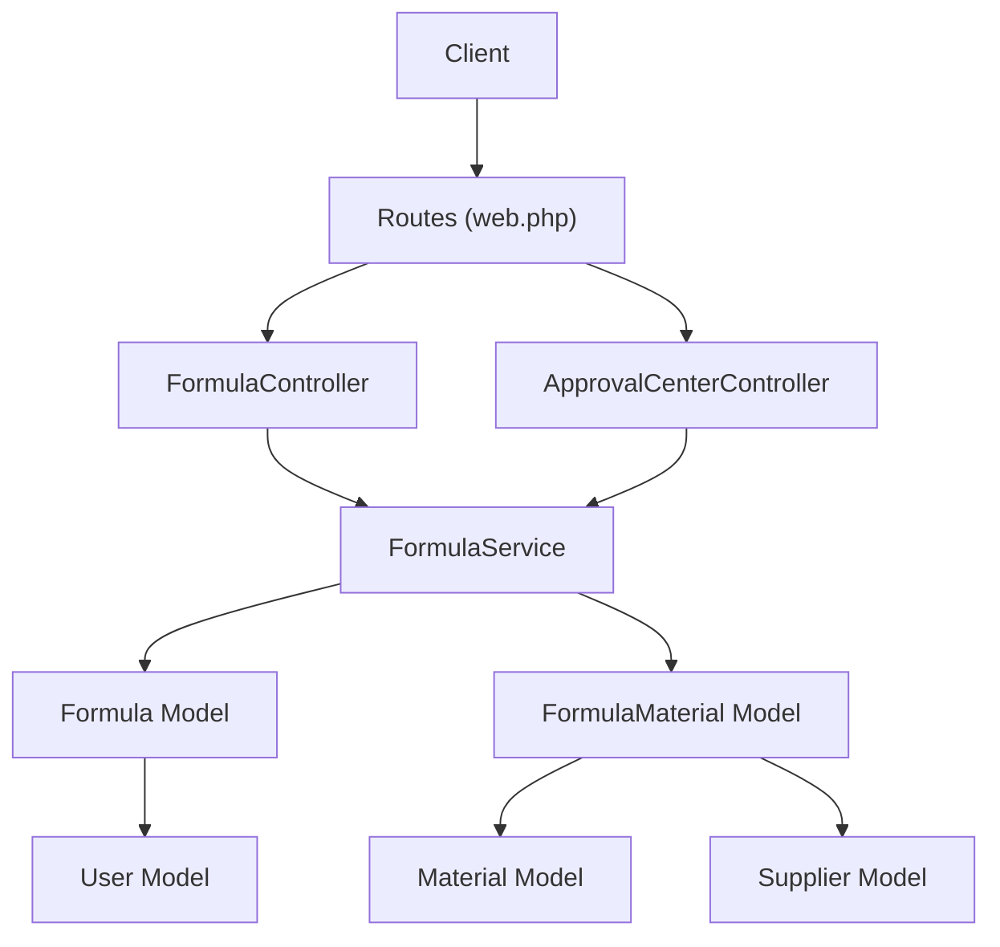
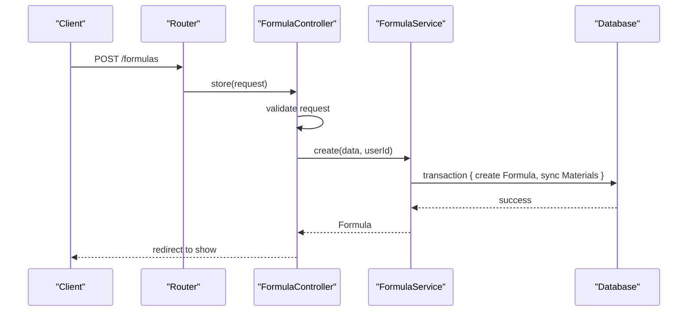
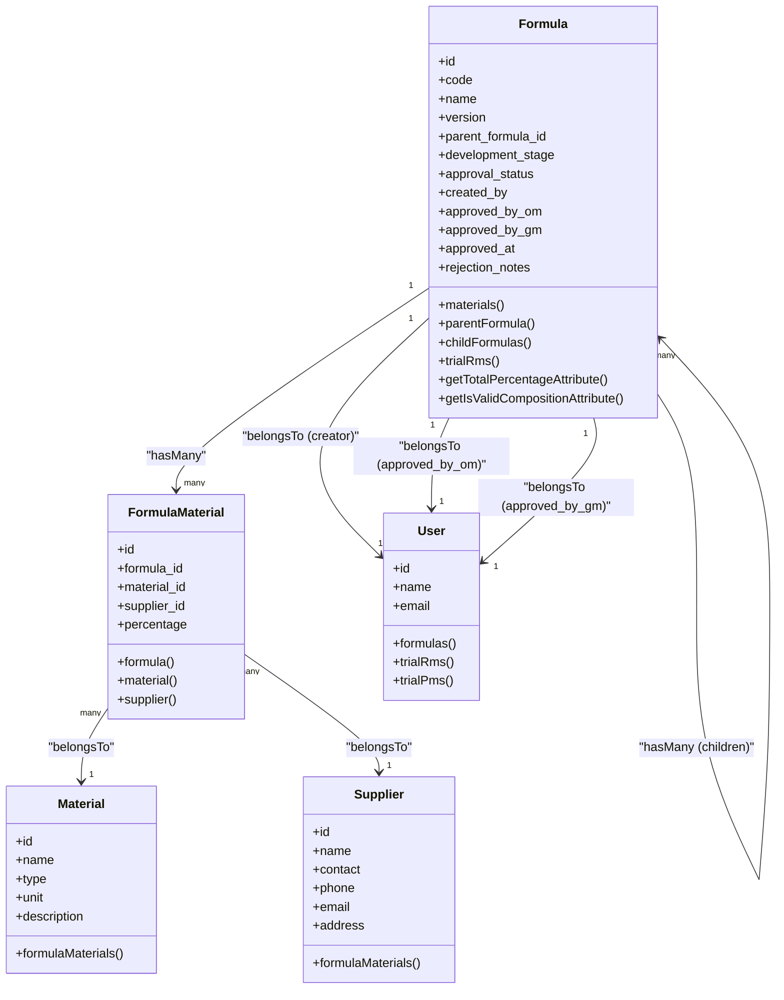
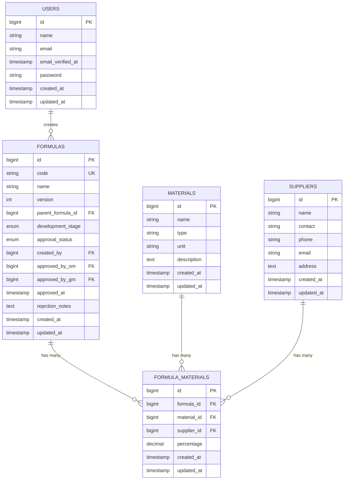
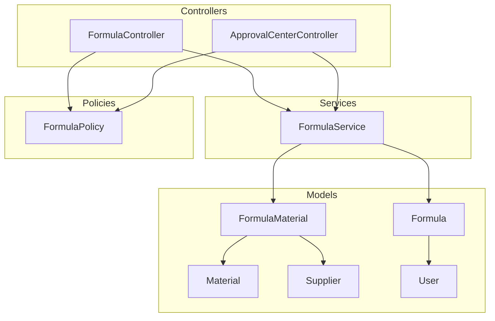

# Formula Management API

<cite>
**Referenced Files in This Document**
- [web.php](file://routes/web.php)
- [FormulaController.php](file://app/Http/Controllers/FormulaController.php)
- [ApprovalCenterController.php](file://app/Http/Controllers/ApprovalCenterController.php)
- [FormulaService.php](file://app/Services/FormulaService.php)
- [Formula.php](file://app/Models/Formula.php)
- [FormulaMaterial.php](file://app/Models/FormulaMaterial.php)
- [Material.php](file://app/Models/Material.php)
- [Supplier.php](file://app/Models/Supplier.php)
- [User.php](file://app/Models/User.php)
- [FormulaPolicy.php](file://app/Policies/FormulasPolicy.php)
- [2026_07_01_092832_create_formulas_table.php](file://database/migrations/2026_07_01_092832_create_formulas_table.php)
- [2026_07_01_092840_create_formula_materials_table.php](file://database/migrations/2026_07_01_092840_create_formula_materials_table.php)
- [2026_07_01_092816_create_materials_table.php](file://database/migrations/2026_07_01_092816_create_materials_table.php)
- [2026_07_01_092825_create_suppliers_table.php](file://database/migrations/2026_07_01_092825_create_suppliers_table.php)
- [ProfileController.php](file://app/Http/Controllers/ProfileController.php)
- [SettingController.php](file://app/Http/Controllers/SettingController.php)
</cite>

## Table of Contents
1. Introduction
2. Project Structure
3. Core Components
4. Architecture Overview
5. Detailed Component Analysis
6. Dependency Analysis
7. Performance Considerations
8. Troubleshooting Guide
9. Conclusion

## Introduction
This document provides detailed API documentation for formula management endpoints, including CRUD operations for formulas, material composition management, version control (reformulation), and approval workflow submissions. It also covers validation rules, error responses, and examples of complex operations such as updating material compositions and tracking versions.

The application is a Laravel web application with resourceful routes and custom actions for submission and reformulation. Authorization is enforced via policies and role-based permissions. Approval workflows are handled through an Approval Center with two-stage approvals.

## Project Structure
Key components related to formula management:
- Routes define RESTful resources and custom actions for formulas.
- Controllers handle HTTP requests and delegate business logic to services.
- Services encapsulate domain logic, including composition validation, versioning, and approval transitions.
- Models represent database entities and relationships.
- Policies enforce authorization rules.
- Migrations define the schema for formulas, materials, and suppliers.

**Diagram sources**
- [web.php:33-40](file://routes/web.php#L33-L40)
- [FormulaController.php:13-200](file://app/Http/Controllers/FormulaController.php#L13-L200)
- [ApprovalCenterController.php:13-150](file://app/Http/Controllers/ApprovalCenterController.php#L13-L150)
- [FormulaService.php:10-228](file://app/Services/FormulaService.php#L10-L228)
- [Formula.php:9-88](file://app/Models/Formula.php#L9-L88)
- [FormulaMaterial.php:7-35](file://app/Models/FormulaMaterial.php#L7-L35)
- [Material.php:9-32](file://app/Models/Material.php#L9-L32)
- [Supplier.php:9-33](file://app/Models/Supplier.php#L9-L33)
- [User.php:16-49](file://app/Models/User.php#L16-L49)

**Section sources**
- [web.php:33-40](file://routes/web.php#L33-L40)
- [FormulaController.php:13-200](file://app/Http/Controllers/FormulaController.php#L13-L200)
- [ApprovalCenterController.php:13-150](file://app/Http/Controllers/ApprovalCenterController.php#L13-L150)
- [FormulaService.php:10-228](file://app/Services/FormulaService.php#L10-L228)
- [Formula.php:9-88](file://app/Models/Formula.php#L9-L88)
- [FormulaMaterial.php:7-35](file://app/Models/FormulaMaterial.php#L7-L35)
- [Material.php:9-32](file://app/Models/Material.php#L9-L32)
- [Supplier.php:9-33](file://app/Models/Supplier.php#L9-L33)
- [User.php:16-49](file://app/Models/User.php#L16-L49)

## Core Components
- FormulaController: Handles listing, creating, showing, editing, updating, deleting formulas; custom submit and reformulate actions.
- ApprovalCenterController: Manages two-stage approvals and rejections for formulas.
- FormulaService: Implements core business logic including code generation, composition validation, sync of materials, approval transitions, rejection, and reformulation.
- Models: Formula, FormulaMaterial, Material, Supplier, User define data structures and relationships.
- Policies: FormulaPolicy enforces authorization rules for view, create, edit, submit, reformulate, delete.

**Section sources**
- [FormulaController.php:13-200](file://app/Http/Controllers/FormulaController.php#L13-L200)
- [ApprovalCenterController.php:13-150](file://app/Http/Controllers/ApprovalCenterController.php#L13-L150)
- [FormulaService.php:10-228](file://app/Services/FormulaService.php#L10-L228)
- [Formula.php:9-88](file://app/Models/Formula.php#L9-L88)
- [FormulaMaterial.php:7-35](file://app/Models/FormulaMaterial.php#L7-L35)
- [Material.php:9-32](file://app/Models/Material.php#L9-L32)
- [Supplier.php:9-33](file://app/Models/Supplier.php#L9-L33)
- [User.php:16-49](file://app/Models/User.php#L16-L49)
- [FormulaPolicy.php:8-85](file://app/Policies/FormulasPolicy.php#L8-L85)

## Architecture Overview
The API follows a layered architecture:
- Routing layer maps HTTP requests to controller methods.
- Controller layer validates input and delegates to service layer.
- Service layer performs business logic, transactions, and state transitions.
- Model layer persists data and manages relationships.
- Policy layer enforces access control.

**Diagram sources**
- [web.php:33-40](file://routes/web.php#L33-L40)
- [FormulaController.php:71-94](file://app/Http/Controllers/FormulaController.php#L71-L94)
- [FormulaService.php:35-53](file://app/Services/FormulaService.php#L35-L53)

## Detailed Component Analysis

### Endpoints and Operations

#### List Formulas
- Method: GET
- Path: /formulas
- Description: Lists formulas with optional search, status, and stage filters. Returns paginated results.
- Query Parameters:
  - search: string (filters by code or name)
  - status: enum (Draft, Pending Tahap 1, Pending Tahap 2, Approved, Rejected)
  - stage: enum (Draf, Pra-Trial, Optimalisasi, Final)
- Response: HTML view with paginated formulas and summary counts.

**Section sources**
- [web.php:33-40](file://routes/web.php#L33-L40)
- [FormulaController.php:20-53](file://app/Http/Controllers/FormulaController.php#L20-L53)

#### Create Formula
- Method: GET
- Path: /formulas/create
- Description: Renders form to create a new formula. Requires permission to create.
- Response: HTML view with materials, suppliers, and stages.

**Section sources**
- [FormulaController.php:58-67](file://app/Http/Controllers/FormulaController.php#L58-L67)

#### Store Formula
- Method: POST
- Path: /formulas
- Request Body:
  - name: string, required, max 255
  - development_stage: enum ["Draf", "Pra-Trial", "Optimalisasi", "Final"], required
  - materials: array of objects
    - material_id: integer, required, exists in materials table
    - supplier_id: integer, nullable, exists in suppliers table
    - percentage: numeric, required, min 0.01, max 100
- Validation Rules:
  - name required and string
  - development_stage required and in allowed values
  - materials.*.material_id required and exists
  - materials.*.supplier_id nullable and exists
  - materials.*.percentage required, numeric, between 0.01 and 100
- Business Logic:
  - Generates unique code FRM-YYYYMM-XXX
  - Creates formula with version 1 and status Draft
  - Syncs materials within a transaction
  - Validates total composition does not exceed 100%
- Response: Redirect to show page with success message.
- Errors:
  - Validation errors returned with input preserved
  - Composition validation errors if total > 100%

**Section sources**
- [web.php:33-40](file://routes/web.php#L33-L40)
- [FormulaController.php:71-94](file://app/Http/Controllers/FormulaController.php#L71-L94)
- [FormulaService.php:35-53](file://app/Services/FormulaService.php#L35-L53)
- [FormulaService.php:195-209](file://app/Services/FormulaService.php#L195-L209)

#### Show Formula
- Method: GET
- Path: /formulas/{formula}
- Description: Displays formula details with loaded relationships (materials, creator, managers, parent/child formulas, trials, activities).
- Response: HTML view with comprehensive formula information.

**Section sources**
- [FormulaController.php:99-106](file://app/Http/Controllers/FormulaController.php#L99-L106)

#### Edit Formula
- Method: GET
- Path: /formulas/{formula}/edit
- Description: Renders edit form. Requires authorization to edit (creator and status Draft/Rejected).
- Response: HTML view with current formula data, materials, suppliers, and stages.

**Section sources**
- [FormulaController.php:111-122](file://app/Http/Controllers/FormulaController.php#L111-L122)
- [FormulaPolicy.php:38-47](file://app/Policies/FormulasPolicy.php#L38-L47)

#### Update Formula
- Method: PUT/PATCH
- Path: /formulas/{formula}
- Request Body: Same as Store
- Validation Rules: Same as Store
- Business Logic:
  - Updates name and development_stage
  - Syncs materials within a transaction
  - Validates composition
- Response: Redirect to show page with success message.
- Errors:
  - Validation errors returned with input preserved
  - Composition validation errors if total > 100%

**Section sources**
- [FormulaController.php:127-149](file://app/Http/Controllers/FormulaController.php#L127-L149)
- [FormulaService.php:58-72](file://app/Services/FormulaService.php#L58-L72)
- [FormulaService.php:195-209](file://app/Services/FormulaService.php#L195-L209)

#### Delete Formula
- Method: DELETE
- Path: /formulas/{formula}
- Description: Deletes formula. Requires authorization (creator, status Draft, and delete permission).
- Response: Redirect to index with success message.

**Section sources**
- [FormulaController.php:154-163](file://app/Http/Controllers/FormulaController.php#L154-L163)
- [FormulaPolicy.php:79-84](file://app/Policies/FormulasPolicy.php#L79-L84)

#### Submit for Approval
- Method: POST
- Path: /formulas/{formula}/submit
- Description: Submits formula for approval. Only creators can submit when status is Draft or Rejected.
- Business Logic:
  - Validates status allows submission
  - Ensures total composition equals 100%
  - Ensures at least one material exists
  - Updates status to Pending Tahap 1
- Response: Redirect to show page with success message.
- Errors:
  - Status validation errors
  - Composition validation errors
  - Materials validation errors

**Section sources**
- [web.php:35-37](file://routes/web.php#L35-L37)
- [FormulaController.php:168-181](file://app/Http/Controllers/FormulaController.php#L168-L181)
- [FormulaService.php:77-98](file://app/Services/FormulaService.php#L77-L98)

#### Reformulate (Create New Version)
- Method: POST
- Path: /formulas/{formula}/reformulate
- Description: Creates a new version from an approved formula. Copies materials as starting point.
- Business Logic:
  - Validates formula is Approved
  - Calculates next version number
  - Creates new formula with same name, incremented version, Draft status
  - Copies all materials from previous version
- Response: Redirect to edit page of new formula with success message.
- Errors:
  - Status validation errors

**Section sources**
- [web.php:38-40](file://routes/web.php#L38-L40)
- [FormulaController.php:186-199](file://app/Http/Controllers/FormulaController.php#L186-L199)
- [FormulaService.php:155-190](file://app/Services/FormulaService.php#L155-L190)

### Approval Workflow Endpoints

#### Approve Formula (Two-Stage)
- Method: POST
- Path: /approval-center/formulas/{formula}/approve
- Description: Allows Operational Manager to approve Stage 1 and General Manager to approve Stage 2.
- Business Logic:
  - Stage 1: Updates status to Pending Tahap 2, records approver
  - Stage 2: Updates status to Approved, records approver and timestamp
- Response: Redirect to approval center with success message.
- Errors:
  - Status validation errors

**Section sources**
- [web.php:68-70](file://routes/web.php#L68-L70)
- [ApprovalCenterController.php:66-85](file://app/Http/Controllers/ApprovalCenterController.php#L66-L85)
- [FormulaService.php:103-133](file://app/Services/FormulaService.php#L103-L133)

#### Reject Formula
- Method: POST
- Path: /approval-center/formulas/{formula}/reject
- Request Body:
  - rejection_notes: string, required, max 1000 characters
- Description: Rejects formula during approval process.
- Business Logic:
  - Validates status is in approval queue
  - Updates status to Rejected and stores notes
- Response: Redirect to approval center with success message.
- Errors:
  - Status validation errors

**Section sources**
- [web.php:71-73](file://routes/web.php#L71-L73)
- [ApprovalCenterController.php:90-105](file://app/Http/Controllers/ApprovalCenterController.php#L90-L105)
- [FormulaService.php:138-150](file://app/Services/FormulaService.php#L138-L150)

### Data Models and Relationships

**Diagram sources**
- [Formula.php:9-88](file://app/Models/Formula.php#L9-L88)
- [FormulaMaterial.php:7-35](file://app/Models/FormulaMaterial.php#L7-L35)
- [Material.php:9-32](file://app/Models/Material.php#L9-L32)
- [Supplier.php:9-33](file://app/Models/Supplier.php#L9-L33)
- [User.php:16-49](file://app/Models/User.php#L16-L49)

### Database Schema

**Diagram sources**
- [2026_07_01_092832_create_formulas_table.php:14-28](file://database/migrations/2026_07_01_092832_create_formulas_table.php#L14-L28)
- [2026_07_01_092840_create_formula_materials_table.php:14-21](file://database/migrations/2026_07_01_092840_create_formula_materials_table.php#L14-L21)
- [2026_07_01_092816_create_materials_table.php:14-21](file://database/migrations/2026_07_01_092816_create_materials_table.php#L14-L21)
- [2026_07_01_092825_create_suppliers_table.php:14-22](file://database/migrations/2026_07_01_092825_create_suppliers_table.php#L14-L22)

### File Upload Handling
While formula management endpoints do not directly handle file uploads, the application includes file upload functionality in other controllers:
- ProfileController handles signature uploads
- SettingController handles logo, favicon, and paraf document uploads

File uploads are stored using Laravel's storage system with public disk configuration.

**Section sources**
- [ProfileController.php:35-47](file://app/Http/Controllers/ProfileController.php#L35-L47)
- [SettingController.php:39-67](file://app/Http/Controllers/SettingController.php#L39-L67)

## Dependency Analysis

**Diagram sources**
- [FormulaController.php:13-200](file://app/Http/Controllers/FormulaController.php#L13-L200)
- [ApprovalCenterController.php:13-150](file://app/Http/Controllers/ApprovalCenterController.php#L13-L150)
- [FormulaService.php:10-228](file://app/Services/FormulaService.php#L10-L228)
- [Formula.php:9-88](file://app/Models/Formula.php#L9-L88)
- [FormulaMaterial.php:7-35](file://app/Models/FormulaMaterial.php#L7-L35)
- [Material.php:9-32](file://app/Models/Material.php#L9-L32)
- [Supplier.php:9-33](file://app/Models/Supplier.php#L9-L33)
- [User.php:16-49](file://app/Models/User.php#L16-L49)
- [FormulaPolicy.php:8-85](file://app/Policies/FormulasPolicy.php#L8-L85)

**Section sources**
- [FormulaController.php:13-200](file://app/Http/Controllers/FormulaController.php#L13-L200)
- [ApprovalCenterController.php:13-150](file://app/Http/Controllers/ApprovalCenterController.php#L13-L150)
- [FormulaService.php:10-228](file://app/Services/FormulaService.php#L10-L228)
- [FormulaPolicy.php:8-85](file://app/Policies/FormulasPolicy.php#L8-L85)

## Performance Considerations
- Use eager loading for relationships to avoid N+1 queries when displaying formula details
- Implement pagination for list endpoints to handle large datasets
- Consider caching frequently accessed data like materials and suppliers lists
- Use database transactions for atomic operations involving multiple writes
- Validate inputs early to prevent unnecessary database operations
- Monitor query performance for composition calculations on large material sets

## Troubleshooting Guide

### Common Validation Errors
- **Invalid material_id**: Ensure the material exists in the materials table
- **Invalid supplier_id**: Ensure the supplier exists in the suppliers table  
- **Percentage out of range**: Percentage must be between 0.01 and 100
- **Total composition exceeds 100%**: Sum of all material percentages cannot exceed 100%
- **Status not allowed**: Certain operations only work with specific approval statuses

### Authorization Issues
- **403 Forbidden**: Check user permissions and policy rules
- **Cannot edit**: Only creators can edit formulas in Draft or Rejected status
- **Cannot submit**: Only creators can submit formulas for approval
- **Cannot reformulate**: Only approved formulas can be reformulated

### Approval Workflow Issues
- **Invalid approval stage**: Ensure formula is in correct status for approval action
- **Missing requirements**: Composition must equal exactly 100% before submission
- **No materials**: At least one material must be present before submission

**Section sources**
- [FormulaController.php:71-94](file://app/Http/Controllers/FormulaController.php#L71-L94)
- [FormulaController.php:127-149](file://app/Http/Controllers/FormulaController.php#L127-L149)
- [FormulaController.php:168-181](file://app/Http/Controllers/FormulaController.php#L168-L181)
- [FormulaService.php:77-98](file://app/Services/FormulaService.php#L77-L98)
- [FormulaService.php:155-190](file://app/Services/FormulaService.php#L155-L190)
- [FormulaPolicy.php:38-84](file://app/Policies/FormulasPolicy.php#L38-L84)

## Conclusion
The Formula Management API provides comprehensive functionality for managing product formulas with robust validation, version control, and approval workflows. The architecture separates concerns effectively with clear boundaries between routing, controllers, services, and models. Authorization is properly enforced through policies, and the approval workflow supports multi-stage approvals with proper state management.

Key strengths include:
- Comprehensive validation and business rule enforcement
- Clear separation of concerns with service layer abstraction
- Robust version control through reformulation capabilities
- Two-stage approval workflow with proper authorization
- Well-defined data models with appropriate relationships

For future enhancements, consider adding audit trails for formula changes, implementing bulk operations, and adding more sophisticated search and filtering capabilities.