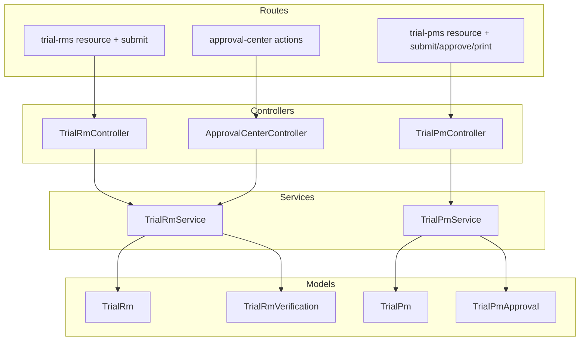
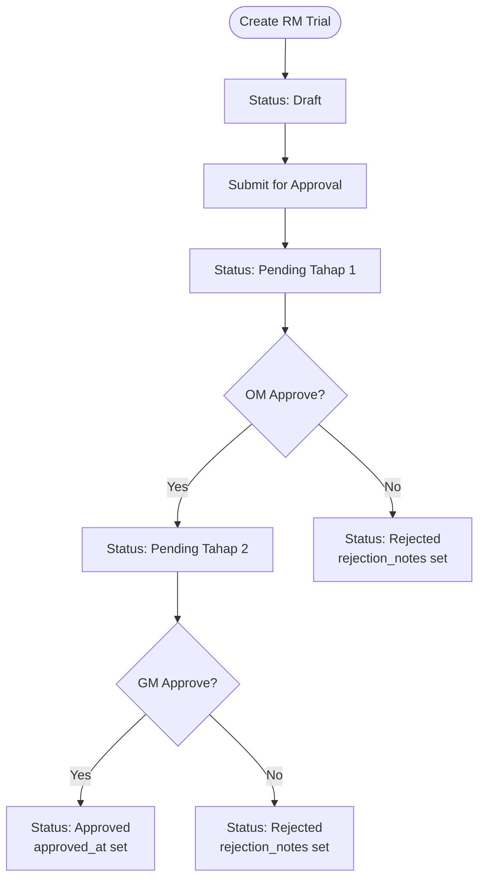
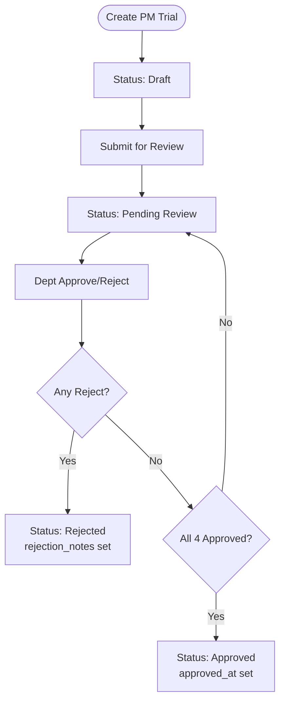
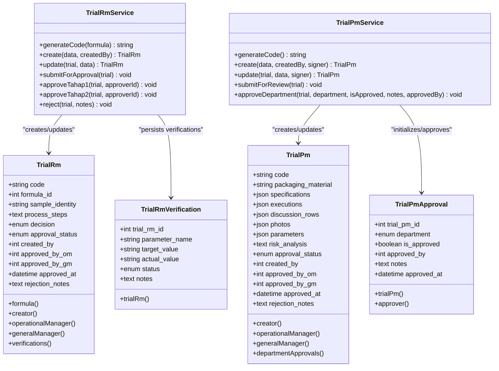

# Trial Management API

<cite>
**Referenced Files in This Document**
- [web.php](file://routes/web.php)
- [TrialRmController.php](file://app/Http/Controllers/TrialRmController.php)
- [TrialPmController.php](file://app/Http/Controllers/TrialPmController.php)
- [ApprovalCenterController.php](file://app/Http/Controllers/ApprovalCenterController.php)
- [TrialRmService.php](file://app/Services/TrialRmService.php)
- [TrialPmService.php](file://app/Services/TrialPmService.php)
- [TrialRm.php](file://app/Models/TrialRm.php)
- [TrialPm.php](file://app/Models/TrialPm.php)
- [TrialRmVerification.php](file://app/Models/TrialRmVerification.php)
- [TrialPmApproval.php](file://app/Models/TrialPmApproval.php)
- [2026_07_01_092849_create_trial_rms_table.php](file://database/migrations/2026_07_01_092849_create_trial_rms_table.php)
- [2026_07_01_092857_create_trial_rm_verifications_table.php](file://database/migrations/2026_07_01_092857_create_trial_rm_verifications_table.php)
- [2026_07_01_092905_create_trial_pms_table.php](file://database/migrations/2026_07_01_092905_create_trial_pms_table.php)
- [2026_07_01_092919_create_trial_pm_approvals_table.php](file://database/migrations/2026_07_01_092919_create_trial_pm_approvals_table.php)
- [TrialRmPolicy.php](file://app/Policies/TrialRmPolicy.php)
</cite>

## Table of Contents
1. Introduction
2. Project Structure
3. Core Components
4. Architecture Overview
5. Detailed Component Analysis
6. Dependency Analysis
7. Performance Considerations
8. Troubleshooting Guide
9. Conclusion

## Introduction
This document provides comprehensive API documentation for trial management endpoints covering both Raw Material (RM) and Packaging Material (PM) trials. It details trial creation, parameter verification, approval workflows, status management, and data schemas including approval requests, rejection reasons, and photo/document uploads. The complete lifecycle from creation to final approval or rejection is documented with diagrams and references to the source code.

## Project Structure
The trial management feature is implemented using a layered architecture:
- Controllers handle HTTP routes, authorization, validation, and orchestration.
- Services encapsulate business logic, state transitions, and persistence.
- Models define entities, relationships, casts, and activity logging.
- Policies enforce access control based on roles and ownership.
- Migrations define database schema and constraints.
- Routes wire controllers to URL paths and middleware.



**Diagram sources**
- [web.php:42-62](file://routes/web.php#L42-L62)
- [TrialRmController.php:12-188](file://app/Http/Controllers/TrialRmController.php#L12-L188)
- [TrialPmController.php:11-266](file://app/Http/Controllers/TrialPmController.php#L11-L266)
- [ApprovalCenterController.php:13-150](file://app/Http/Controllers/ApprovalCenterController.php#L13-L150)
- [TrialRmService.php:11-201](file://app/Services/TrialRmService.php#L11-L201)
- [TrialPmService.php:11-210](file://app/Services/TrialPmService.php#L11-L210)
- [TrialRm.php:9-63](file://app/Models/TrialRm.php#L9-L63)
- [TrialRmVerification.php:7-23](file://app/Models/TrialRmVerification.php#L7-L23)
- [TrialPm.php:9-81](file://app/Models/TrialPm.php#L9-L81)
- [TrialPmApproval.php:7-49](file://app/Models/TrialPmApproval.php#L7-L49)

**Section sources**
- [web.php:42-62](file://routes/web.php#L42-L62)

## Core Components
- Trial RM
  - Controller: CRUD, submit for approval, view, edit, delete.
  - Service: Code generation, create/update, submit for approval, two-stage approvals, reject, verifications persistence.
  - Model: Fields, relations, activity log options.
  - Verification model: Parameter name, target/actual values, status, notes.
- Trial PM
  - Controller: CRUD, submit for review, department approve, print.
  - Service: Code generation, create/update with execution paraf enrichment, submit for review, department approvals, auto-finalize when all departments approve.
  - Model: JSON fields for specifications/executions/photos, relations, helper for full department approval.
  - Approval model: Per-department approval records with approver and notes.

Key responsibilities:
- Authorization via policies and gates.
- Validation at controller layer.
- Business rules and state transitions in services.
- Persistence and relationships in models.
- File upload handling for photos in PM trials.

**Section sources**
- [TrialRmController.php:12-188](file://app/Http/Controllers/TrialRmController.php#L12-L188)
- [TrialPmController.php:11-266](file://app/Http/Controllers/TrialPmController.php#L11-L266)
- [ApprovalCenterController.php:13-150](file://app/Http/Controllers/ApprovalCenterController.php#L13-L150)
- [TrialRmService.php:11-201](file://app/Services/TrialRmService.php#L11-L201)
- [TrialPmService.php:11-210](file://app/Services/TrialPmService.php#L11-L210)
- [TrialRm.php:9-63](file://app/Models/TrialRm.php#L9-L63)
- [TrialRmVerification.php:7-23](file://app/Models/TrialRmVerification.php#L7-L23)
- [TrialPm.php:9-81](file://app/Models/TrialPm.php#L9-L81)
- [TrialPmApproval.php:7-49](file://app/Models/TrialPmApproval.php#L7-L49)

## Architecture Overview
End-to-end flows for RM and PM trials:

```mermaid
sequenceDiagram
participant Client as "Client"
participant Route as "Routes"
participant Ctrl as "Controller"
participant Policy as "Policy/Gate"
participant Service as "Service"
participant DB as "Database"
Note over Client,DB : RM Trial Lifecycle
Client->>Route : POST /trial-rms
Route->>Ctrl : store()
Ctrl->>Policy : authorize('create')
Ctrl->>Service : create(data, userId)
Service->>DB : create trial + verifications
DB-->>Service : persisted
Service-->>Ctrl : TrialRm
Ctrl-->>Client : Redirect to show
Client->>Route : POST /trial-rms/{id}/submit
Route->>Ctrl : submit()
Ctrl->>Policy : authorize('submit')
Ctrl->>Service : submitForApproval(trial)
Service->>DB : update status Pending Tahap 1
DB-->>Service : ok
Service-->>Ctrl : done
Ctrl-->>Client : Redirect to show
Note over Client,DB : PM Trial Lifecycle
Client->>Route : POST /trial-pms
Route->>Ctrl : store()
Ctrl->>Policy : authorize('create')
Ctrl->>Service : create(data, userId, signer)
Service->>DB : create trial + dept approvals
DB-->>Service : persisted
Service-->>Ctrl : TrialPm
Ctrl-->>Client : Redirect to show
Client->>Route : POST /trial-pms/{id}/submit
Route->>Ctrl : submit()
Ctrl->>Policy : authorize('submit')
Ctrl->>Service : submitForReview(trial)
Service->>DB : update status Pending Review
DB-->>Service : ok
Service-->>Ctrl : done
Ctrl-->>Client : Redirect to show
Client->>Route : POST /trial-pms/{id}/approve
Route->>Ctrl : approve()
Ctrl->>Policy : authorize('approve')
Ctrl->>Service : approveDepartment(trial, dept, isApproved, notes, userId)
Service->>DB : update approval record; if rejected -> Rejected; if 4 approved -> Approved
DB-->>Service : ok
Service-->>Ctrl : done
Ctrl-->>Client : Redirect to show
```

**Diagram sources**
- [web.php:42-62](file://routes/web.php#L42-L62)
- [TrialRmController.php:71-187](file://app/Http/Controllers/TrialRmController.php#L71-L187)
- [TrialPmController.php:55-265](file://app/Http/Controllers/TrialPmController.php#L55-L265)
- [ApprovalCenterController.php:110-149](file://app/Http/Controllers/ApprovalCenterController.php#L110-L149)
- [TrialRmService.php:55-177](file://app/Services/TrialRmService.php#L55-L177)
- [TrialPmService.php:36-209](file://app/Services/TrialPmService.php#L36-L209)

## Detailed Component Analysis

### Raw Material (RM) Trials

#### Endpoints
- GET /trial-rms
  - Purpose: List trials with search and decision filter.
  - Query params: search, decision.
  - Response: Paginated list of trials.
- GET /trial-rms/create
  - Purpose: Show form to create a new RM trial.
- POST /trial-rms
  - Purpose: Create a new RM trial.
  - Body: See RM Trial Data Schema below.
  - Response: Redirect to show page.
- GET /trial-rms/{trialRm}
  - Purpose: View trial details.
- GET /trial-rms/{trialRm}/edit
  - Purpose: Edit draft/rejected trial.
- PATCH /trial-rms/{trialRm}
  - Purpose: Update trial fields and verifications.
- DELETE /trial-rms/{trialRm}
  - Purpose: Delete draft trial.
- POST /trial-rms/{trialRm}/submit
  - Purpose: Submit for approval (Draft/Rejected -> Pending Tahap 1).

Authorization and validation are enforced by policies and request validation.

**Section sources**
- [web.php:42-48](file://routes/web.php#L42-L48)
- [TrialRmController.php:19-187](file://app/Http/Controllers/TrialRmController.php#L19-L187)
- [TrialRmPolicy.php:10-63](file://app/Policies/TrialRmPolicy.php#L10-L63)

#### RM Trial Data Schema
- Root object
  - formula_id: integer, required, must exist in formulas table.
  - sample_identity: string, max 255, required.
  - process_steps: text, required.
  - decision: enum ["Lulus","Reformulasi"], nullable.
  - verifications: array of objects, optional but required before submit.
    - parameter_name: string, max 255, required per item.
    - target_value: string, max 255, required per item.
    - actual_value: string, max 255, nullable per item.
    - status: enum ["Pass","Fail","Warning"], required per item.
    - notes: string, max 1000, nullable per item.
- Server-managed fields
  - code: string, unique, generated (TRM-YYYYMM-XXX-A).
  - approval_status: enum ["Draft","Pending Tahap 1","Pending Tahap 2","Approved","Rejected"].
  - created_by: integer (user id).
  - approved_by_om: integer (nullable).
  - approved_by_gm: integer (nullable).
  - approved_at: timestamp (nullable).
  - rejection_notes: text (nullable).

Validation rules are defined in the controller’s store/update methods.

**Section sources**
- [TrialRmController.php:71-155](file://app/Http/Controllers/TrialRmController.php#L71-L155)
- [TrialRmService.php:55-105](file://app/Services/TrialRmService.php#L55-L105)
- [2026_07_01_092849_create_trial_rms_table.php:14-28](file://database/migrations/2026_07_01_092849_create_trial_rms_table.php#L14-L28)
- [2026_07_01_092857_create_trial_rm_verifications_table.php:14-23](file://database/migrations/2026_07_01_092857_create_trial_rm_verifications_table.php#L14-L23)

#### RM Approval Workflow
- Submit: Draft/Rejected -> Pending Tahap 1. Requires at least one verification entry.
- Approve Stage 1 (Operational Manager): Pending Tahap 1 -> Pending Tahap 2.
- Approve Stage 2 (General Manager): Pending Tahap 2 -> Approved.
- Reject: From Pending Tahap 1 or Pending Tahap 2 -> Rejected with rejection_notes.



**Diagram sources**
- [TrialRmService.php:110-177](file://app/Services/TrialRmService.php#L110-L177)
- [ApprovalCenterController.php:110-149](file://app/Http/Controllers/ApprovalCenterController.php#L110-L149)

**Section sources**
- [TrialRmService.php:110-177](file://app/Services/TrialRmService.php#L110-L177)
- [ApprovalCenterController.php:110-149](file://app/Http/Controllers/ApprovalCenterController.php#L110-L149)

### Packaging Material (PM) Trials

#### Endpoints
- GET /trial-pms
  - Purpose: List trials with search and status filter.
  - Query params: search, status.
- GET /trial-pms/create
  - Purpose: Show form to create a new PM trial.
- POST /trial-pms
  - Purpose: Create a new PM trial with optional photo uploads.
  - Body: See PM Trial Data Schema below.
  - Response: Redirect to show page.
- GET /trial-pms/{trialPm}
  - Purpose: View trial details.
- GET /trial-pms/{trialPm}/print
  - Purpose: Print view for official form layout.
- GET /trial-pms/{trialPm}/edit
  - Purpose: Edit draft trial.
- PATCH /trial-pms/{trialPm}
  - Purpose: Update trial fields and append photos.
- DELETE /trial-pms/{trialPm}
  - Purpose: Delete draft trial.
- POST /trial-pms/{trialPm}/submit
  - Purpose: Submit for review (Draft -> Pending Review).
- POST /trial-pms/{trialPm}/approve
  - Purpose: Department approval/rejection (Pending Review only).
  - Body: department, is_approved, notes.

File uploads:
- uploaded_photos: array of images (jpeg,png,jpg,gif), max 5MB each.
- Stored under public disk path trial-pm-photos and saved as URLs in photos array.

**Section sources**
- [web.php:50-62](file://routes/web.php#L50-L62)
- [TrialPmController.php:18-265](file://app/Http/Controllers/TrialPmController.php#L18-L265)

#### PM Trial Data Schema
- Root object
  - proposal_number: string, max 255, nullable.
  - packaging_material: string, max 255, required.
  - supplier: string, max 255, required.
  - product_use: string, max 255, required.
  - product_trial: string, max 255, required.
  - trial_sample_quantity: string, max 255, required.
  - old_supplier: string, max 255, nullable.
  - difference_with_existing: text, nullable.
  - specifications: array of strings, min 1, required.
  - executions: array of objects, optional.
    - machine: string, max 255, required per item.
    - setting: string, max 255, required per item.
    - actual: string, max 255, required per item.
    - start_time: string, max 100, nullable per item.
    - end_time: string, max 100, nullable per item.
    - reject: string, max 100, nullable per item.
    - good: string, max 100, nullable per item.
    - paraf_prod: boolean, nullable per item.
    - paraf_eng: boolean, nullable per item.
    - paraf_qc: boolean, nullable per item.
  - discussion_rows: array of objects, optional.
    - evaluation: string, required per item.
    - risk_analysis: string, required per item.
    - recommendation: string, required per item.
  - uploaded_photos: array of image files, optional.
  - risk_analysis: text, nullable.
- Server-managed fields
  - code: string, unique, generated (TPM-YYYYMM-XXX).
  - photos: array of URLs, server-managed.
  - parameters: JSON, nullable.
  - approval_status: enum ["Draft","Pending Review","Approved","Rejected"].
  - created_by: integer (user id).
  - approved_by_om: integer (nullable).
  - approved_by_gm: integer (nullable).
  - approved_at: timestamp (nullable).
  - rejection_notes: text (nullable).

Execution paraf enrichment:
- When checkboxes are checked, metadata fields are added: signed_by, signed_at, signed_name, signature (from admin settings). If unchecked, these fields are removed.

**Section sources**
- [TrialPmController.php:55-202](file://app/Http/Controllers/TrialPmController.php#L55-L202)
- [TrialPmService.php:36-149](file://app/Services/TrialPmService.php#L36-L149)
- [2026_07_01_092905_create_trial_pms_table.php:14-28](file://database/migrations/2026_07_01_092905_create_trial_pms_table.php#L14-L28)

#### PM Approval Workflow
- Submit: Draft -> Pending Review.
- Department approval: For each department (rd, qc, production, engineering), an approval record is updated.
  - If any department rejects: Status becomes Rejected with rejection_notes.
  - If all four departments approve: Status becomes Approved and approved_at is set.



**Diagram sources**
- [TrialPmService.php:154-209](file://app/Services/TrialPmService.php#L154-L209)
- [TrialPmApproval.php:7-49](file://app/Models/TrialPmApproval.php#L7-L49)

**Section sources**
- [TrialPmService.php:154-209](file://app/Services/TrialPmService.php#L154-L209)
- [TrialPmApproval.php:7-49](file://app/Models/TrialPmApproval.php#L7-L49)

### Approval Center (RM)
- GET /approval-center
  - Purpose: Dashboard for pending approvals based on user role.
- POST /approval-center/trial-rms/{trialRm}/approve
  - Purpose: Approve RM trial (Tahap 1 or Tahap 2 depending on role).
- POST /approval-center/trial-rms/{trialRm}/reject
  - Purpose: Reject RM trial with rejection_notes.

Roles:
- Operational Manager: Approves Tahap 1.
- General Manager: Approves Tahap 2.

**Section sources**
- [web.php:64-79](file://routes/web.php#L64-L79)
- [ApprovalCenterController.php:23-149](file://app/Http/Controllers/ApprovalCenterController.php#L23-L149)
- [TrialRmService.php:130-177](file://app/Services/TrialRmService.php#L130-L177)

## Dependency Analysis



**Diagram sources**
- [TrialRm.php:9-63](file://app/Models/TrialRm.php#L9-L63)
- [TrialRmVerification.php:7-23](file://app/Models/TrialRmVerification.php#L7-L23)
- [TrialPm.php:9-81](file://app/Models/TrialPm.php#L9-L81)
- [TrialPmApproval.php:7-49](file://app/Models/TrialPmApproval.php#L7-L49)
- [TrialRmService.php:11-201](file://app/Services/TrialRmService.php#L11-L201)
- [TrialPmService.php:11-210](file://app/Services/TrialPmService.php#L11-L210)

**Section sources**
- [TrialRm.php:9-63](file://app/Models/TrialRm.php#L9-L63)
- [TrialRmVerification.php:7-23](file://app/Models/TrialRmVerification.php#L7-L23)
- [TrialPm.php:9-81](file://app/Models/TrialPm.php#L9-L81)
- [TrialPmApproval.php:7-49](file://app/Models/TrialPmApproval.php#L7-L49)
- [TrialRmService.php:11-201](file://app/Services/TrialRmService.php#L11-L201)
- [TrialPmService.php:11-210](file://app/Services/TrialPmService.php#L11-L210)

## Performance Considerations
- Use eager loading where needed to avoid N+1 queries (e.g., load creator, department approvals, activities).
- Pagination is applied for listing endpoints to limit payload size.
- Database transactions ensure consistency during multi-record writes (e.g., creating trial and initial approvals).
- Avoid excessive file uploads; enforce size limits and validate MIME types.

[No sources needed since this section provides general guidance]

## Troubleshooting Guide
Common issues and resolutions:
- Validation errors on create/update: Check required fields and enums. Errors are returned with input preserved.
- Submit not allowed: Ensure trial status is Draft or Rejected for RM; Draft for PM.
- Missing verifications for RM: At least one verification entry is required before submission.
- Department approval blocked: Only allowed when status is Pending Review for PM.
- Photo upload failures: Validate file type and size; ensure storage disk is configured.

**Section sources**
- [TrialRmController.php:71-155](file://app/Http/Controllers/TrialRmController.php#L71-L155)
- [TrialPmController.php:55-202](file://app/Http/Controllers/TrialPmController.php#L55-L202)
- [TrialRmService.php:110-177](file://app/Services/TrialRmService.php#L110-L177)
- [TrialPmService.php:154-209](file://app/Services/TrialPmService.php#L154-L209)

## Conclusion
The trial management system provides robust APIs for managing RM and PM trials with clear separation of concerns across controllers, services, models, and policies. RM trials follow a two-stage approval workflow, while PM trials use a four-department parallel approval process that auto-completes upon unanimous approval. Comprehensive validation, authorization, and auditability ensure reliable operations and traceability throughout the lifecycle.

[No sources needed since this section summarizes without analyzing specific files]