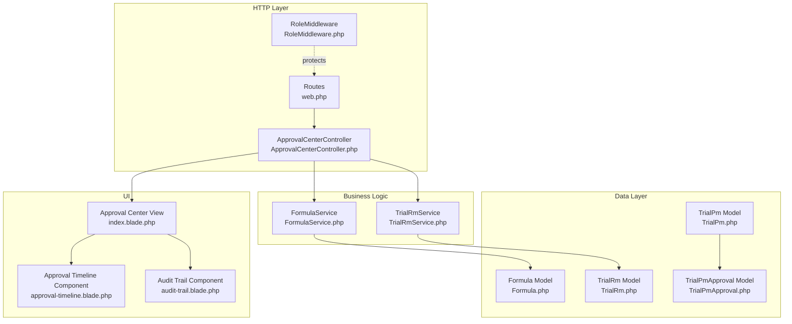
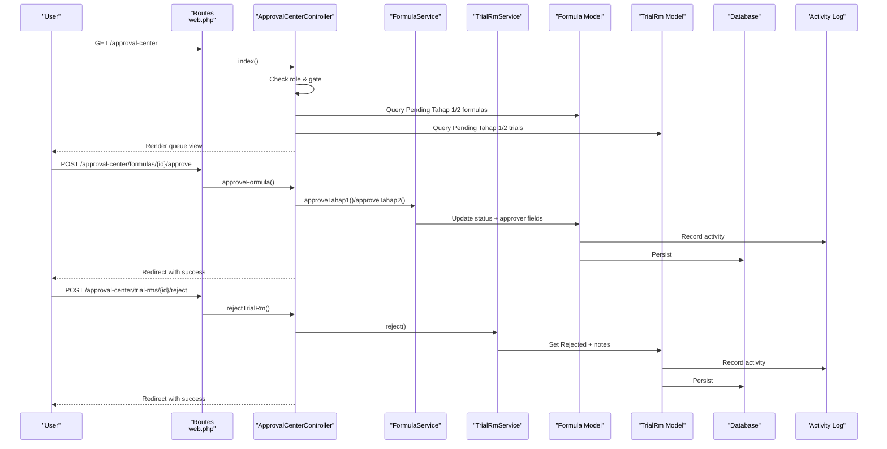
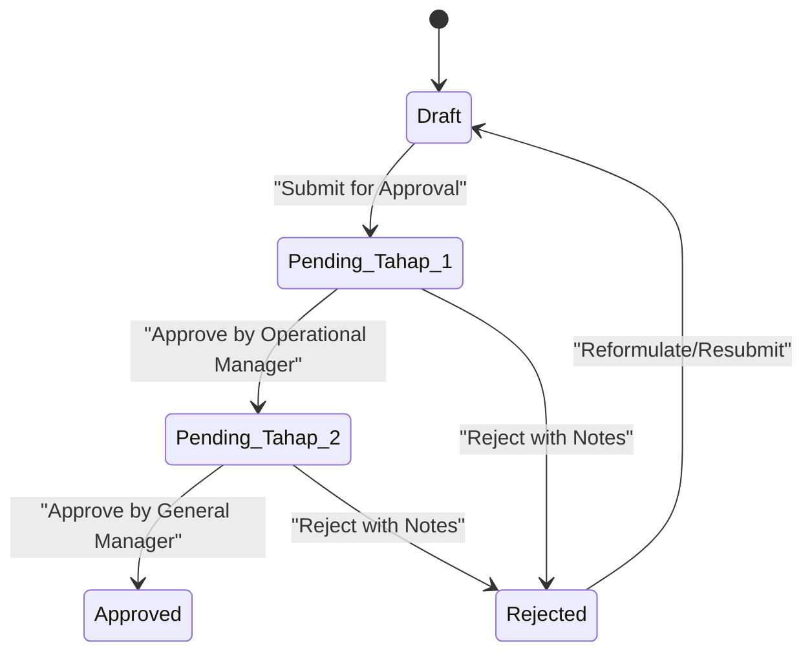
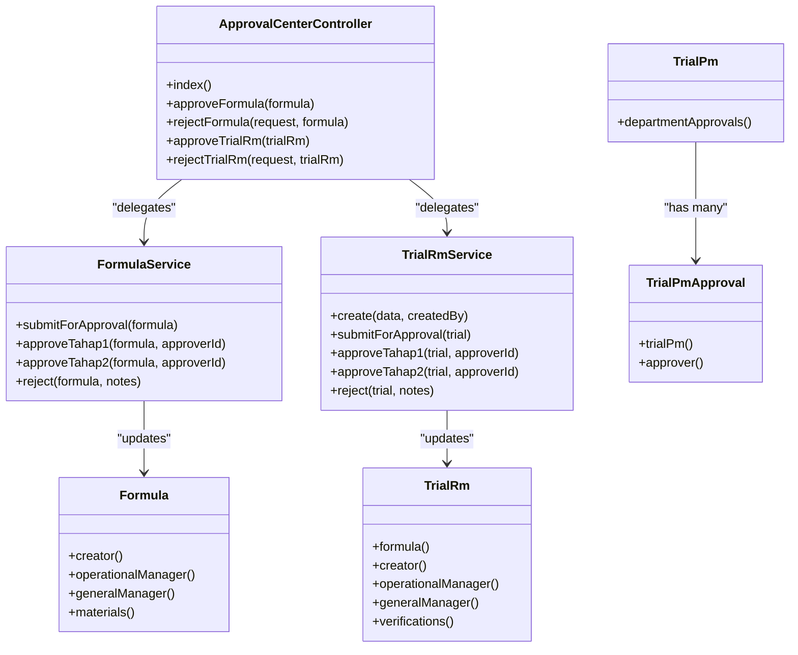

# Approval Center

<cite>
**Referenced Files in This Document**
- [ApprovalCenterController.php](file://app/Http/Controllers/ApprovalCenterController.php)
- [index.blade.php](file://resources/views/approval-center/index.blade.php)
- [web.php](file://routes/web.php)
- [RoleMiddleware.php](file://app/Http/Middleware/RoleMiddleware.php)
- [FormulaService.php](file://app/Services/FormulaService.php)
- [TrialRmService.php](file://app/Services/TrialRmService.php)
- [Formula.php](file://app/Models/Formula.php)
- [TrialRm.php](file://app/Models/TrialRm.php)
- [TrialPm.php](file://app/Models/TrialPm.php)
- [TrialPmApproval.php](file://app/Models/TrialPmApproval.php)
- [approval-timeline.blade.php](file://resources/views/components/approval-timeline.blade.php)
- [audit-trail.blade.php](file://resources/views/components/audit-trail.blade.php)
</cite>

## Table of Contents
1. [Introduction](#introduction)
2. [Project Structure](#project-structure)
3. [Core Components](#core-components)
4. [Architecture Overview](#architecture-overview)
5. [Detailed Component Analysis](#detailed-component-analysis)
6. [Dependency Analysis](#dependency-analysis)
7. [Performance Considerations](#performance-considerations)
8. [Troubleshooting Guide](#troubleshooting-guide)
9. [Conclusion](#conclusion)
10. [Appendices](#appendices)

## Introduction
The Approval Center is a centralized dashboard for managing pending approvals across Formula submissions and Trial RM records. It provides:
- A unified queue view filtered by the current user’s approval level (Operational Manager for Stage 1, General Manager for Stage 2).
- Inline approve/reject actions with mandatory rejection notes.
- Integration with activity logging for audit trails.
- Role-based access control to ensure only authorized approvers can act on items.

This document explains the workflow states, UI components, backend processing logic, integration points, and practical usage patterns for handling approvals, viewing timelines, and managing queues.

## Project Structure
The Approval Center spans controllers, services, models, routes, middleware, and Blade views:
- Controller orchestrates authorization and delegates state transitions to services.
- Services enforce business rules and update model fields atomically.
- Models implement activity logging and relationships for auditable history.
- Routes protect endpoints with policy checks and role middleware.
- Views render the queue, inline rejection forms, and informational panels.

**Diagram sources**
- [web.php:64-79](file://routes/web.php#L64-L79)
- [ApprovalCenterController.php:1-151](file://app/Http/Controllers/ApprovalCenterController.php#L1-L151)
- [FormulaService.php:1-228](file://app/Services/FormulaService.php#L1-L228)
- [TrialRmService.php:1-202](file://app/Services/TrialRmService.php#L1-L202)
- [Formula.php:1-89](file://app/Models/Formula.php#L1-L89)
- [TrialRm.php:1-64](file://app/Models/TrialRm.php#L1-L64)
- [TrialPm.php:1-82](file://app/Models/TrialPm.php#L1-L82)
- [TrialPmApproval.php:1-50](file://app/Models/TrialPmApproval.php#L1-L50)
- [index.blade.php:1-234](file://resources/views/approval-center/index.blade.php#L1-L234)
- [approval-timeline.blade.php:1-109](file://resources/views/components/approval-timeline.blade.php#L1-L109)
- [audit-trail.blade.php:1-46](file://resources/views/components/audit-trail.blade.php#L1-L46)

**Section sources**
- [web.php:64-79](file://routes/web.php#L64-L79)
- [ApprovalCenterController.php:1-151](file://app/Http/Controllers/ApprovalCenterController.php#L1-L151)
- [index.blade.php:1-234](file://resources/views/approval-center/index.blade.php#L1-L234)

## Core Components
- ApprovalCenterController: Central entry point for listing and acting on approvals. Enforces role-based visibility and delegates to services.
- FormulaService: Encapsulates Formula lifecycle including submission, two-stage approvals, rejections, and reformulation.
- TrialRmService: Encapsulates Trial RM lifecycle including creation, submission, two-stage approvals, rejections, and verification persistence.
- Models (Formula, TrialRm, TrialPm, TrialPmApproval): Provide data structures, relationships, and activity logging configuration.
- Views and Components: Render the queue, inline rejection forms, timeline visualization, and audit trail summaries.

Key responsibilities:
- Authorization: Gate checks and role-based filtering in controller and policies.
- State transitions: Controlled via service methods that validate preconditions and persist changes.
- Auditability: Activity log configured per model to capture relevant field changes.

**Section sources**
- [ApprovalCenterController.php:1-151](file://app/Http/Controllers/ApprovalCenterController.php#L1-L151)
- [FormulaService.php:74-150](file://app/Services/FormulaService.php#L74-L150)
- [TrialRmService.php:110-177](file://app/Services/TrialRmService.php#L110-L177)
- [Formula.php:31-36](file://app/Models/Formula.php#L31-L36)
- [TrialRm.php:31-36](file://app/Models/TrialRm.php#L31-L36)
- [TrialPm.php:46-51](file://app/Models/TrialPm.php#L46-L51)
- [index.blade.php:1-234](file://resources/views/approval-center/index.blade.php#L1-L234)

## Architecture Overview
The Approval Center follows a layered architecture:
- HTTP layer exposes protected routes and invokes controller actions.
- Controller validates roles and delegates to domain services.
- Services enforce business rules and perform atomic updates.
- Models record activity logs and expose relationships for UI rendering.
- Views present queues, inline actions, timelines, and audit trails.

**Diagram sources**
- [web.php:64-79](file://routes/web.php#L64-L79)
- [ApprovalCenterController.php:23-149](file://app/Http/Controllers/ApprovalCenterController.php#L23-L149)
- [FormulaService.php:103-150](file://app/Services/FormulaService.php#L103-L150)
- [TrialRmService.php:130-177](file://app/Services/TrialRmService.php#L130-L177)
- [Formula.php:31-36](file://app/Models/Formula.php#L31-L36)
- [TrialRm.php:31-36](file://app/Models/TrialRm.php#L31-L36)

## Detailed Component Analysis

### ApprovalCenterController
Responsibilities:
- List pending items based on user role (Stage 1 vs Stage 2).
- Approve or reject Formulas and Trial RMs through services.
- Return user-friendly messages and handle validation errors.

Authorization:
- Uses a gate check for approval center access.
- Filters queues by approval_status matching the user’s role.

Actions:
- index(): Loads pending Formulas and Trial RMs for the current stage.
- approveFormula(): Delegates to FormulaService for Stage 1 or Stage 2.
- rejectFormula(): Validates rejection notes and persists via FormulaService.
- approveTrialRm(): Delegates to TrialRmService for Stage 1 or Stage 2.
- rejectTrialRm(): Validates rejection notes and persists via TrialRmService.

**Section sources**
- [ApprovalCenterController.php:23-149](file://app/Http/Controllers/ApprovalCenterController.php#L23-L149)

### FormulaService
Key workflows:
- submitForApproval(): Ensures composition validity and minimum materials before moving to Pending Tahap 1.
- approveTahap1(): Transitions from Pending Tahap 1 to Pending Tahap 2 and records Operational Manager approver.
- approveTahap2(): Finalizes approval to Approved and records General Manager approver and timestamp.
- reject(): Moves item to Rejected and stores rejection notes.

Validation highlights:
- Status guards prevent out-of-order transitions.
- Composition constraints enforced prior to submission.

**Section sources**
- [FormulaService.php:74-150](file://app/Services/FormulaService.php#L74-L150)

### TrialRmService
Key workflows:
- create(): Requires an Approved Formula; initializes Draft status and verifications.
- submitForApproval(): Requires at least one verification parameter before entering Pending Tahap 1.
- approveTahap1(): Advances to Pending Tahap 2 and records Operational Manager approver.
- approveTahap2(): Finalizes approval to Approved and records General Manager approver and timestamp.
- reject(): Moves item to Rejected and stores rejection notes.

**Section sources**
- [TrialRmService.php:55-177](file://app/Services/TrialRmService.php#L55-L177)

### Models and Activity Logging
- Formula: Logs code, name, version, development_stage, approval_status changes.
- TrialRm: Logs code, sample_identity, decision, approval_status changes.
- TrialPm: Logs code, packaging_material, approval_status changes.
- TrialPmApproval: Tracks department-level approvals with approver and timestamps.

Relationships:
- Creator, operational manager, general manager associations enable UI display of who acted when.

**Section sources**
- [Formula.php:31-36](file://app/Models/Formula.php#L31-L36)
- [TrialRm.php:31-36](file://app/Models/TrialRm.php#L31-L36)
- [TrialPm.php:46-51](file://app/Models/TrialPm.php#L46-L51)
- [TrialPmApproval.php:1-50](file://app/Models/TrialPmApproval.php#L1-L50)

### User Interface Components
- Approval Center Queue View:
  - Tabs for Formulasi RM and Catatan Trial RM.
  - Inline approve/reject actions with collapsible rejection note forms.
  - Success/error flash messages and empty-state placeholders.
- Approval Timeline Component:
  - Visual stepper showing completed/current/pending stages with user/date info.
- Audit Trail Component:
  - Renders recent activity entries with actor and timestamp, highlighting key field changes.

**Section sources**
- [index.blade.php:1-234](file://resources/views/approval-center/index.blade.php#L1-L234)
- [approval-timeline.blade.php:1-109](file://resources/views/components/approval-timeline.blade.php#L1-L109)
- [audit-trail.blade.php:1-46](file://resources/views/components/audit-trail.blade.php#L1-L46)

### Workflow States
Two-stage approval flow applies to both Formula and Trial RM:
- Draft → Pending Tahap 1 (Operational Manager)
- Pending Tahap 1 → Pending Tahap 2 (General Manager)
- Pending Tahap 2 → Approved (Final)
- Any pending stage → Rejected (requires notes)

[No sources needed since this diagram shows conceptual workflow, not actual code structure]

### Practical Examples

#### Handling Approvals
- As Operational Manager:
  - Open Approval Center, select “Formulasi RM” or “Catatan Trial RM”.
  - Click “Setujui” to advance to Stage 2.
- As General Manager:
  - Open Approval Center, select the appropriate tab.
  - Click “Setujui” to finalize approval.

#### Viewing Approval Timelines
- Use the approval timeline component to visualize step-by-step progress, approver names, and timestamps.

#### Managing Approval Queues
- The queue automatically filters items based on your role and current stage.
- Empty-state messages indicate no pending items.

[No sources needed since this section provides general guidance]

## Dependency Analysis
- Controller depends on services for business logic and on models for querying.
- Services depend on models for persistence and rely on activity logging traits.
- Views depend on controller-provided data and reusable components.
- Routes enforce policy checks and role middleware for secure access.

**Diagram sources**
- [ApprovalCenterController.php:1-151](file://app/Http/Controllers/ApprovalCenterController.php#L1-L151)
- [FormulaService.php:1-228](file://app/Services/FormulaService.php#L1-L228)
- [TrialRmService.php:1-202](file://app/Services/TrialRmService.php#L1-L202)
- [Formula.php:1-89](file://app/Models/Formula.php#L1-L89)
- [TrialRm.php:1-64](file://app/Models/TrialRm.php#L1-L64)
- [TrialPm.php:1-82](file://app/Models/TrialPm.php#L1-L82)
- [TrialPmApproval.php:1-50](file://app/Models/TrialPmApproval.php#L1-L50)

**Section sources**
- [web.php:64-79](file://routes/web.php#L64-L79)
- [RoleMiddleware.php:1-35](file://app/Http/Middleware/RoleMiddleware.php#L1-L35)

## Performance Considerations
- Eager loading: Controllers use eager loading for creator relationships to reduce N+1 queries when rendering lists.
- Atomic updates: Services wrap multi-field updates within transactions where applicable to maintain consistency.
- Minimal logging scope: Activity logging is constrained to specific fields to avoid excessive storage overhead.

[No sources needed since this section provides general guidance]

## Troubleshooting Guide
Common issues and resolutions:
- Access denied to Approval Center:
  - Ensure the user has the required permission for approval_center.access.
  - Verify route protection and middleware are applied correctly.
- Validation errors during approval:
  - Confirm the item is in the expected status for the requested action.
  - For Formula submission, ensure composition totals to 100% and at least one material exists.
  - For Trial RM submission, ensure at least one verification parameter is provided.
- Missing rejection notes:
  - Rejection requires a non-empty note; the UI enforces this client-side and server-side.

**Section sources**
- [ApprovalCenterController.php:23-149](file://app/Http/Controllers/ApprovalCenterController.php#L23-L149)
- [FormulaService.php:74-150](file://app/Services/FormulaService.php#L74-L150)
- [TrialRmService.php:110-177](file://app/Services/TrialRmService.php#L110-L177)

## Conclusion
The Approval Center provides a robust, auditable, and role-aware system for managing approvals across Formulas and Trial RMs. Its clear separation of concerns, strict state transitions, and integrated activity logging support compliance and operational efficiency. The UI offers intuitive controls for approving or rejecting items, while components like the timeline and audit trail enhance transparency and traceability.

[No sources needed since this section summarizes without analyzing specific files]

## Appendices

### API Endpoints Summary
- GET /approval-center: Lists pending approvals based on user role.
- POST /approval-center/formulas/{id}/approve: Approves a Formula (Stage 1 or Stage 2).
- POST /approval-center/formulas/{id}/reject: Rejects a Formula with notes.
- POST /approval-center/trial-rms/{id}/approve: Approves a Trial RM (Stage 1 or Stage 2).
- POST /approval-center/trial-rms/{id}/reject: Rejects a Trial RM with notes.

All endpoints are protected by policy checks and require authentication.

**Section sources**
- [web.php:64-79](file://routes/web.php#L64-L79)