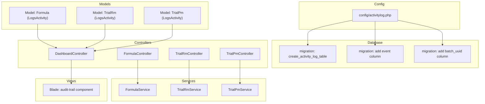
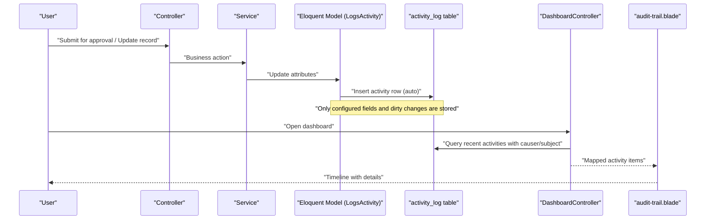
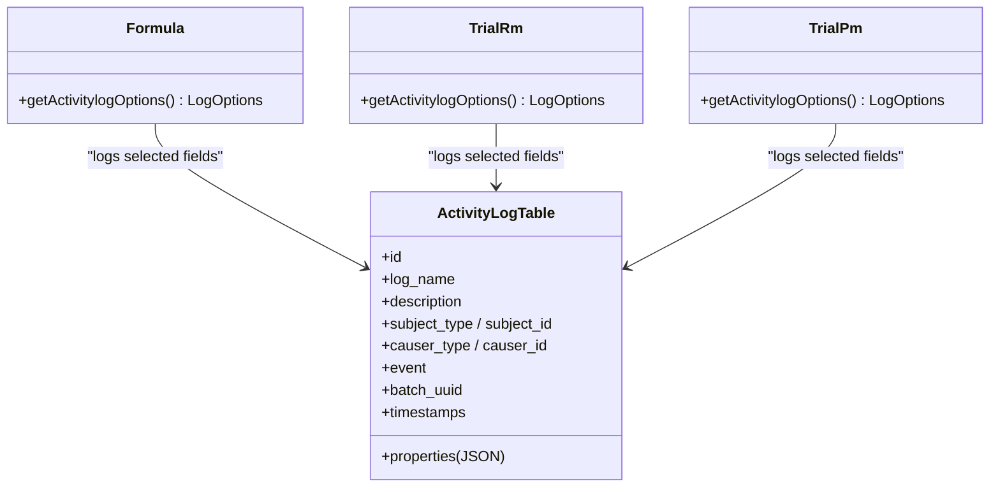
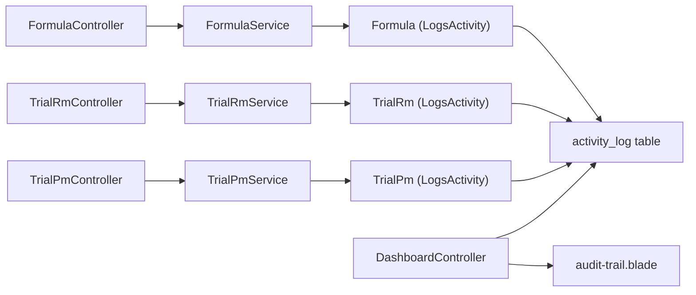

# Audit Trail & Compliance

<cite>
**Referenced Files in This Document**
- [activitylog.php](file://config/activitylog.php)
- [2026_07_01_092416_create_activity_log_table.php](file://database/migrations/2026_07_01_092416_create_activity_log_table.php)
- [2026_07_01_092417_add_event_column_to_activity_log_table.php](file://database/migrations/2026_07_01_092417_add_event_column_to_activity_log_table.php)
- [2026_07_01_092418_add_batch_uuid_column_to_activity_log_table.php](file://database/migrations/2026_07_01_092418_add_batch_uuid_column_to_activity_log_table.php)
- [audit-trail.blade.php](file://resources/views/components/audit-trail.blade.php)
- [DashboardController.php](file://app/Http/Controllers/DashboardController.php)
- [Formula.php](file://app/Models/Formula.php)
- [TrialRm.php](file://app/Models/TrialRm.php)
- [TrialPm.php](file://app/Models/TrialPm.php)
- [FormulaService.php](file://app/Services/FormulaService.php)
- [TrialRmService.php](file://app/Services/TrialRmService.php)
- [TrialPmService.php](file://app/Services/TrialPmService.php)
- [FormulaController.php](file://app/Http/Controllers/FormulaController.php)
- [TrialRmController.php](file://app/Http/Controllers/TrialRmController.php)
- [TrialPmController.php](file://app/Http/Controllers/TrialPmController.php)
</cite>

## Table of Contents
1. Introduction
2. Project Structure
3. Core Components
4. Architecture Overview
5. Detailed Component Analysis
6. Dependency Analysis
7. Performance Considerations
8. Troubleshooting Guide
9. Conclusion
10. Appendices

## Introduction
This document explains the Audit Trail and Compliance system built on top of the Spatie Activity Log package. It covers how activities are logged across modules, the audit data structure, query patterns for retrieving historical changes, visualization components, filtering capabilities, export strategies, compliance reporting approaches, retention policies, and performance considerations for large datasets.

## Project Structure
The audit trail is implemented using:
- Configuration for the activity logger
- Database migrations to create and extend the activity log table
- Eloquent models that use the LogsActivity trait with selective field logging
- Controllers and services performing business operations that trigger automatic logging
- A Blade component to visualize recent activities
- A dashboard controller that aggregates recent activity entries

**Diagram sources**
- [activitylog.php:1-53](file://config/activitylog.php#L1-L53)
- [2026_07_01_092416_create_activity_log_table.php:1-27](file://database/migrations/2026_07_01_092416_create_activity_log_table.php#L1-L27)
- [2026_07_01_092417_add_event_column_to_activity_log_table.php:1-22](file://database/migrations/2026_07_01_092417_add_event_column_to_activity_log_table.php#L1-L22)
- [2026_07_01_092418_add_batch_uuid_column_to_activity_log_table.php:1-22](file://database/migrations/2026_07_01_092418_add_batch_uuid_column_to_activity_log_table.php#L1-L22)
- [Formula.php:1-89](file://app/Models/Formula.php#L1-L89)
- [TrialRm.php:1-64](file://app/Models/TrialRm.php#L1-L64)
- [TrialPm.php:1-82](file://app/Models/TrialPm.php#L1-L82)
- [DashboardController.php:1-149](file://app/Http/Controllers/DashboardController.php#L1-L149)
- [FormulaController.php:1-201](file://app/Http/Controllers/FormulaController.php#L1-L201)
- [TrialRmController.php:1-189](file://app/Http/Controllers/TrialRmController.php#L1-L189)
- [TrialPmController.php:1-267](file://app/Http/Controllers/TrialPmController.php#L1-L267)
- [FormulaService.php:1-228](file://app/Services/FormulaService.php#L1-L228)
- [TrialRmService.php:1-202](file://app/Services/TrialRmService.php#L1-L202)
- [TrialPmService.php:1-204](file://app/Services/TrialPmService.php#L1-L204)
- [audit-trail.blade.php:1-46](file://resources/views/components/audit-trail.blade.php#L1-L46)

**Section sources**
- [activitylog.php:1-53](file://config/activitylog.php#L1-L53)
- [2026_07_01_092416_create_activity_log_table.php:1-27](file://database/migrations/2026_07_01_092416_create_activity_log_table.php#L1-L27)
- [2026_07_01_092417_add_event_column_to_activity_log_table.php:1-22](file://database/migrations/2026_07_01_092417_add_event_column_to_activity_log_table.php#L1-L22)
- [2026_07_01_092418_add_batch_uuid_column_to_activity_log_table.php:1-22](file://database/migrations/2026_07_01_092418_add_batch_uuid_column_to_activity_log_table.php#L1-L22)
- [Formula.php:1-89](file://app/Models/Formula.php#L1-L89)
- [TrialRm.php:1-64](file://app/Models/TrialRm.php#L1-L64)
- [TrialPm.php:1-82](file://app/Models/TrialPm.php#L1-L82)
- [DashboardController.php:1-149](file://app/Http/Controllers/DashboardController.php#L1-L149)
- [audit-trail.blade.php:1-46](file://resources/views/components/audit-trail.blade.php#L1-L46)

## Core Components
- Activity Logger configuration: toggles logging, retention days, default log name, auth driver, soft-deleted subject behavior, model class, table name, and database connection.
- Database schema: base activity_log table with morphs for subject/causer, JSON properties, timestamps, plus custom columns for event and batch UUID.
- Models with LogsActivity:
  - Formula: logs only selected fields and dirty changes.
  - TrialRm: logs only selected fields and dirty changes.
  - TrialPm: logs only selected fields and dirty changes.
- Dashboard aggregation: queries recent activities with causer and subject relationships and maps them into a unified list.
- Visualization component: renders a timeline with event-based coloring, user attribution, relative time, and key attribute changes.

Key implementation references:
- Configuration and retention policy
- Schema definitions for activity_log
- Model-level logging options
- Controller/service-driven updates that trigger automatic logging
- UI rendering of audit trails

**Section sources**
- [activitylog.php:1-53](file://config/activitylog.php#L1-L53)
- [2026_07_01_092416_create_activity_log_table.php:1-27](file://database/migrations/2026_07_01_092416_create_activity_log_table.php#L1-L27)
- [2026_07_01_092417_add_event_column_to_activity_log_table.php:1-22](file://database/migrations/2026_07_01_092417_add_event_column_to_activity_log_table.php#L1-L22)
- [2026_07_01_092418_add_batch_uuid_column_to_activity_log_table.php:1-22](file://database/migrations/2026_07_01_092418_add_batch_uuid_column_to_activity_log_table.php#L1-L22)
- [Formula.php:1-89](file://app/Models/Formula.php#L1-L89)
- [TrialRm.php:1-64](file://app/Models/TrialRm.php#L1-L64)
- [TrialPm.php:1-82](file://app/Models/TrialPm.php#L1-L82)
- [DashboardController.php:48-78](file://app/Http/Controllers/DashboardController.php#L48-L78)
- [audit-trail.blade.php:1-46](file://resources/views/components/audit-trail.blade.php#L1-L46)

## Architecture Overview
The system uses automatic model-level logging via the LogsActivity trait. Business logic in services performs state transitions (e.g., approval stages), which update model attributes and automatically generate audit records. The dashboard aggregates these records and displays them through a reusable Blade component.

**Diagram sources**
- [DashboardController.php:48-78](file://app/Http/Controllers/DashboardController.php#L48-L78)
- [Formula.php:31-36](file://app/Models/Formula.php#L31-L36)
- [TrialRm.php:31-36](file://app/Models/TrialRm.php#L31-L36)
- [TrialPm.php:46-51](file://app/Models/TrialPm.php#L46-L51)
- [audit-trail.blade.php:1-46](file://resources/views/components/audit-trail.blade.php#L1-L46)

## Detailed Component Analysis

### Data Model and Logging Options
Each audited model implements LogsActivity and defines which fields to track and whether to store only dirty changes. This minimizes storage and improves clarity.

**Diagram sources**
- [Formula.php:31-36](file://app/Models/Formula.php#L31-L36)
- [TrialRm.php:31-36](file://app/Models/TrialRm.php#L31-L36)
- [TrialPm.php:46-51](file://app/Models/TrialPm.php#L46-L51)
- [2026_07_01_092416_create_activity_log_table.php:11-20](file://database/migrations/2026_07_01_092416_create_activity_log_table.php#L11-L20)
- [2026_07_01_092417_add_event_column_to_activity_log_table.php:11-13](file://database/migrations/2026_07_01_092417_add_event_column_to_activity_log_table.php#L11-L13)
- [2026_07_01_092418_add_batch_uuid_column_to_activity_log_table.php:11-12](file://database/migrations/2026_07_01_092418_add_batch_uuid_column_to_activity_log_table.php#L11-L12)

**Section sources**
- [Formula.php:1-89](file://app/Models/Formula.php#L1-L89)
- [TrialRm.php:1-64](file://app/Models/TrialRm.php#L1-L64)
- [TrialPm.php:1-82](file://app/Models/TrialPm.php#L1-L82)
- [2026_07_01_092416_create_activity_log_table.php:1-27](file://database/migrations/2026_07_01_092416_create_activity_log_table.php#L1-L27)
- [2026_07_01_092417_add_event_column_to_activity_log_table.php:1-22](file://database/migrations/2026_07_01_092417_add_event_column_to_activity_log_table.php#L1-L22)
- [2026_07_01_092418_add_batch_uuid_column_to_activity_log_table.php:1-22](file://database/migrations/2026_07_01_092418_add_batch_uuid_column_to_activity_log_table.php#L1-L22)

### Activity Logging Across Modules
- Formulas: creation, updates, submission, approvals, rejections, and reformulation all change tracked fields such as code, name, version, development_stage, and approval_status.
- Trial RM: creation, updates, decision changes, and approval status transitions are captured.
- Trial PM: creation, updates, and departmental approvals/rejections are captured.

These actions occur within service methods invoked by controllers; the underlying model updates trigger automatic logging due to the LogsActivity trait.

**Section sources**
- [FormulaService.php:35-190](file://app/Services/FormulaService.php#L35-L190)
- [TrialRmService.php:55-177](file://app/Services/TrialRmService.php#L55-L177)
- [TrialPmService.php:36-202](file://app/Services/TrialPmService.php#L36-L202)
- [FormulaController.php:72-200](file://app/Http/Controllers/FormulaController.php#L72-L200)
- [TrialRmController.php:71-188](file://app/Http/Controllers/TrialRmController.php#L71-L188)
- [TrialPmController.php:55-266](file://app/Http/Controllers/TrialPmController.php#L55-L266)

### Audit Data Structure
The activity_log table stores:
- Identifier and naming: id, log_name, description
- Subject and causer polymorphic relations: subject_type, subject_id, causer_type, causer_id
- Change payload: properties (JSON) containing attributes and old/new values when applicable
- Event type: event (custom column added)
- Batch grouping: batch_uuid (custom column added)
- Timestamps: created_at, updated_at

Indexes:
- Index on log_name for efficient filtering by log group.

**Section sources**
- [2026_07_01_092416_create_activity_log_table.php:11-20](file://database/migrations/2026_07_01_092416_create_activity_log_table.php#L11-L20)
- [2026_07_01_092417_add_event_column_to_activity_log_table.php:11-13](file://database/migrations/2026_07_01_092417_add_event_column_to_activity_log_table.php#L11-L13)
- [2026_07_01_092418_add_batch_uuid_column_to_activity_log_table.php:11-12](file://database/migrations/2026_07_01_092418_add_batch_uuid_column_to_activity_log_table.php#L11-L12)

### Query Patterns for Historical Changes
- Recent activity feed: load latest entries with related causer and subject, then map to a normalized shape including module, code/name, event, status, causer, timestamp, and route.
- Per-entity history: load activities.causer on entity show pages to render detailed timelines.

Example references:
- Dashboard aggregation and mapping
- Entity show pages loading activities

**Section sources**
- [DashboardController.php:48-78](file://app/Http/Controllers/DashboardController.php#L48-L78)
- [FormulaController.php:99-106](file://app/Http/Controllers/FormulaController.php#L99-L106)
- [TrialRmController.php:102-109](file://app/Http/Controllers/TrialRmController.php#L102-L109)
- [TrialPmController.php:114-121](file://app/Http/Controllers/TrialPmController.php#L114-L121)

### Audit Trail Visualization and Filtering
- Timeline component:
  - Color-coded dots based on event type (created/deleted/other).
  - Displays description, author, relative time.
  - Optionally shows key attribute changes from properties.attributes filtered to specific fields.
- Filtering:
  - Dashboard lists recent activities without explicit filters.
  - For deeper analysis, filter by log_name, event, subject_type, or date range at the query layer.

Export:
- Export can be implemented by querying the activity_log table with filters and writing rows to CSV/Excel. Use pagination for large datasets and consider background jobs for heavy exports.

**Section sources**
- [audit-trail.blade.php:1-46](file://resources/views/components/audit-trail.blade.php#L1-L46)
- [DashboardController.php:48-78](file://app/Http/Controllers/DashboardController.php#L48-L78)

### Practical Examples

#### Implementing Custom Activity Logging
- Add LogsActivity to a new model and define getActivitylogOptions to specify fields and dirty-only logging.
- Ensure the causer is resolved by the configured auth driver so the current user is recorded.
- Trigger logging by updating model attributes within transactions.

References:
- Model logging options pattern
- Auth driver configuration

**Section sources**
- [Formula.php:31-36](file://app/Models/Formula.php#L31-L36)
- [TrialRm.php:31-36](file://app/Models/TrialRm.php#L31-L36)
- [TrialPm.php:46-51](file://app/Models/TrialPm.php#L46-L51)
- [activitylog.php:22-26](file://config/activitylog.php#L22-L26)

#### Generating Compliance Reports
- Build a report generator that:
  - Filters activity_log by date range, log_name, event, and subject_type.
  - Joins or loads causer and subject to include human-readable names and identifiers.
  - Aggregates counts by status transitions and users.
  - Exports to CSV/Excel with headers like timestamp, actor, subject, event, changed fields, and values.
- Schedule periodic reports via queued jobs for regulatory submissions.

[No sources needed since this section provides general guidance]

#### Analyzing Audit Data for Regulatory Requirements
- Identify critical events (e.g., approval_status transitions) and compute:
  - Time-to-approve per stage
  - Rejection reasons frequency
  - Actor workload and approval rates
- Use indexes on log_name and timestamps to optimize queries.

[No sources needed since this section provides general guidance]

### Retention Policies
- Configurable retention: delete_records_older_than_days controls cleanup of old records.
- Default is set to one year; adjust via configuration to meet compliance requirements.

**Section sources**
- [activitylog.php:10-14](file://config/activitylog.php#L10-L14)

## Dependency Analysis
The following diagram shows dependencies between controllers, services, models, and the activity log infrastructure.

**Diagram sources**
- [FormulaController.php:1-201](file://app/Http/Controllers/FormulaController.php#L1-L201)
- [TrialRmController.php:1-189](file://app/Http/Controllers/TrialRmController.php#L1-L189)
- [TrialPmController.php:1-267](file://app/Http/Controllers/TrialPmController.php#L1-L267)
- [FormulaService.php:1-228](file://app/Services/FormulaService.php#L1-L228)
- [TrialRmService.php:1-202](file://app/Services/TrialRmService.php#L1-L202)
- [TrialPmService.php:1-204](file://app/Services/TrialPmService.php#L1-L204)
- [Formula.php:1-89](file://app/Models/Formula.php#L1-L89)
- [TrialRm.php:1-64](file://app/Models/TrialRm.php#L1-L64)
- [TrialPm.php:1-82](file://app/Models/TrialPm.php#L1-L82)
- [DashboardController.php:1-149](file://app/Http/Controllers/DashboardController.php#L1-L149)
- [audit-trail.blade.php:1-46](file://resources/views/components/audit-trail.blade.php#L1-L46)

**Section sources**
- [FormulaController.php:1-201](file://app/Http/Controllers/FormulaController.php#L1-L201)
- [TrialRmController.php:1-189](file://app/Http/Controllers/TrialRmController.php#L1-L189)
- [TrialPmController.php:1-267](file://app/Http/Controllers/TrialPmController.php#L1-L267)
- [FormulaService.php:1-228](file://app/Services/FormulaService.php#L1-L228)
- [TrialRmService.php:1-202](file://app/Services/TrialRmService.php#L1-L202)
- [TrialPmService.php:1-204](file://app/Services/TrialPmService.php#L1-L204)
- [Formula.php:1-89](file://app/Models/Formula.php#L1-L89)
- [TrialRm.php:1-64](file://app/Models/TrialRm.php#L1-L64)
- [TrialPm.php:1-82](file://app/Models/TrialPm.php#L1-L82)
- [DashboardController.php:1-149](file://app/Http/Controllers/DashboardController.php#L1-L149)
- [audit-trail.blade.php:1-46](file://resources/views/components/audit-trail.blade.php#L1-L46)

## Performance Considerations
- Selective logging: Only log necessary fields and dirty changes to reduce payload size.
- Indexes: Ensure indexes on frequently filtered columns (log_name, timestamps). Consider adding indexes on event and subject_type if used heavily in queries.
- Pagination and limits: Always paginate or limit results when listing activities.
- Eager loading: Load causer and subject only when needed to avoid N+1 issues.
- Background processing: Offload heavy exports and analytics to queues.
- Retention: Configure retention to prevent unbounded growth.

[No sources needed since this section provides general guidance]

## Troubleshooting Guide
- Activities not appearing:
  - Verify the model uses LogsActivity and has correct getActivitylogOptions.
  - Confirm the activity logger is enabled and the correct table/connection is configured.
  - Check that the auth driver resolves the current user as causer.
- Missing event or batch info:
  - Ensure migrations for event and batch_uuid have been run.
- Slow dashboard queries:
  - Limit the number of recent activities loaded.
  - Add appropriate indexes and avoid unnecessary eager loads.

**Section sources**
- [activitylog.php:1-53](file://config/activitylog.php#L1-L53)
- [2026_07_01_092416_create_activity_log_table.php:1-27](file://database/migrations/2026_07_01_092416_create_activity_log_table.php#L1-L27)
- [2026_07_01_092417_add_event_column_to_activity_log_table.php:1-22](file://database/migrations/2026_07_01_092417_add_event_column_to_activity_log_table.php#L1-L22)
- [2026_07_01_092418_add_batch_uuid_column_to_activity_log_table.php:1-22](file://database/migrations/2026_07_01_092418_add_batch_uuid_column_to_activity_log_table.php#L1-L22)
- [Formula.php:31-36](file://app/Models/Formula.php#L31-L36)
- [TrialRm.php:31-36](file://app/Models/TrialRm.php#L31-L36)
- [TrialPm.php:46-51](file://app/Models/TrialPm.php#L46-L51)
- [DashboardController.php:48-78](file://app/Http/Controllers/DashboardController.php#L48-L78)

## Conclusion
The audit trail leverages Spatie Activity Log with model-level tracking to capture meaningful changes across formulas and trials. The design focuses on minimal, relevant data capture, clear visualization, and extensibility for compliance reporting. With proper indexing, retention, and background processing, the system remains performant and compliant even as audit volumes grow.

## Appendices

### API-like Query Patterns for Audits
- List recent activities:
  - Order by created_at desc, limit to N, eager load causer and subject.
- Filter by module:
  - Filter by subject_type or log_name.
- Filter by event:
  - Filter by event column.
- Filter by date range:
  - Filter by created_at between dates.
- Export:
  - Query with filters, stream rows to CSV/Excel, optionally queue the job.

[No sources needed since this section provides general guidance]