# Authentication & Authorization

<cite>
**Referenced Files in This Document**
- [RoleMiddleware.php](file://app/Http/Middleware/RoleMiddleware.php)
- [permission.php](file://config/permission.php)
- [2026_07_01_092410_create_permission_tables.php](file://database/migrations/2026_07_01_092410_create_permission_tables.php)
- [RolePermissionSeeder.php](file://database/seeders/RolePermissionSeeder.php)
- [User.php](file://app/Models/User.php)
- [RegisteredUserController.php](file://app/Http/Controllers/Auth/RegisteredUserController.php)
- [AuthenticatedSessionController.php](file://app/Http/Controllers/Auth/AuthenticatedSessionController.php)
- [PasswordResetLinkController.php](file://app/Http/Controllers/Auth/PasswordResetLinkController.php)
- [NewPasswordController.php](file://app/Http/Controllers/Auth/NewPasswordController.php)
- [EmailVerificationPromptController.php](file://app/Http/Controllers/Auth/EmailVerificationPromptController.php)
- [VerifyEmailController.php](file://app/Http/Controllers/Auth/VerifyEmailController.php)
- [EmailVerificationNotificationController.php](file://app/Http/Controllers/Auth/EmailVerificationNotificationController.php)
- [ConfirmablePasswordController.php](file://app/Http/Controllers/Auth/ConfirmablePasswordController.php)
- [FormulaPolicy.php](file://app/Policies/FormulaPolicy.php)
- [TrialPmPolicy.php](file://app/Policies/TrialPmPolicy.php)
</cite>

## Table of Contents
1. Introduction
2. Project Structure
3. Core Components
4. Architecture Overview
5. Detailed Component Analysis
6. Dependency Analysis
7. Performance Considerations
8. Troubleshooting Guide
9. Conclusion

## Introduction
This document explains the authentication and authorization system implemented in the application. It covers:
- Role-based access control (RBAC) using Spatie Permission
- User registration, login, password management, and email verification flows
- Three-tier role hierarchy with specific permissions
- Custom middleware for route protection
- Policy-based authorization patterns
- Security considerations, session management, password reset, and audit logging integration points

## Project Structure
The authentication and authorization features are organized across controllers, middleware, models, policies, configuration, migrations, and seeders:
- Controllers handle user-facing flows (registration, login, password reset, email verification)
- Middleware enforces role-based access at the HTTP layer
- Policies enforce resource-level permissions
- The User model integrates roles and permissions via a trait
- Configuration defines Spatie Permission behavior and table names
- Migrations create RBAC tables
- Seeders initialize roles and permissions

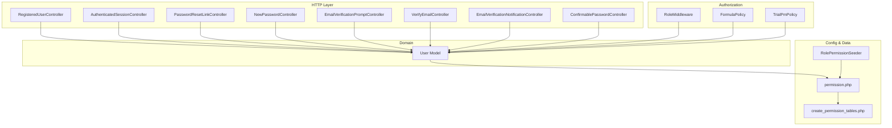

**Diagram sources**
- [RoleMiddleware.php:1-35](file://app/Http/Middleware/RoleMiddleware.php#L1-L35)
- [FormulaPolicy.php:1-86](file://app/Policies/FormulaPolicy.php#L1-L86)
- [TrialPmPolicy.php:1-57](file://app/Policies/TrialPmPolicy.php#L1-L57)
- [User.php:1-50](file://app/Models/User.php#L1-L50)
- [permission.php:1-220](file://config/permission.php#L1-L220)
- [2026_07_01_092410_create_permission_tables.php:1-138](file://database/migrations/2026_07_01_092410_create_permission_tables.php#L1-L138)
- [RolePermissionSeeder.php:1-112](file://database/seeders/RolePermissionSeeder.php#L1-L112)
- [RegisteredUserController.php:1-52](file://app/Http/Controllers/Auth/RegisteredUserController.php#L1-L52)
- [AuthenticatedSessionController.php:1-48](file://app/Http/Controllers/Auth/AuthenticatedSessionController.php#L1-L48)
- [PasswordResetLinkController.php:1-46](file://app/Http/Controllers/Auth/PasswordResetLinkController.php#L1-L46)
- [NewPasswordController.php:1-64](file://app/Http/Controllers/Auth/NewPasswordController.php#L1-L64)
- [EmailVerificationPromptController.php:1-22](file://app/Http/Controllers/Auth/EmailVerificationPromptController.php#L1-L22)
- [VerifyEmailController.php:1-28](file://app/Http/Controllers/Auth/VerifyEmailController.php#L1-L28)
- [EmailVerificationNotificationController.php:1-25](file://app/Http/Controllers/Auth/EmailVerificationNotificationController.php#L1-L25)
- [ConfirmablePasswordController.php:1-41](file://app/Http/Controllers/Auth/ConfirmablePasswordController.php#L1-L41)

**Section sources**
- [RoleMiddleware.php:1-35](file://app/Http/Middleware/RoleMiddleware.php#L1-L35)
- [User.php:1-50](file://app/Models/User.php#L1-L50)
- [permission.php:1-220](file://config/permission.php#L1-L220)
- [2026_07_01_092410_create_permission_tables.php:1-138](file://database/migrations/2026_07_01_092410_create_permission_tables.php#L1-L138)
- [RolePermissionSeeder.php:1-112](file://database/seeders/RolePermissionSeeder.php#L1-L112)
- [RegisteredUserController.php:1-52](file://app/Http/Controllers/Auth/RegisteredUserController.php#L1-L52)
- [AuthenticatedSessionController.php:1-48](file://app/Http/Controllers/Auth/AuthenticatedSessionController.php#L1-L48)
- [PasswordResetLinkController.php:1-46](file://app/Http/Controllers/Auth/PasswordResetLinkController.php#L1-L46)
- [NewPasswordController.php:1-64](file://app/Http/Controllers/Auth/NewPasswordController.php#L1-L64)
- [EmailVerificationPromptController.php:1-22](file://app/Http/Controllers/Auth/EmailVerificationPromptController.php#L1-L22)
- [VerifyEmailController.php:1-28](file://app/Http/Controllers/Auth/VerifyEmailController.php#L1-L28)
- [EmailVerificationNotificationController.php:1-25](file://app/Http/Controllers/Auth/EmailVerificationNotificationController.php#L1-L25)
- [ConfirmablePasswordController.php:1-41](file://app/Http/Controllers/Auth/ConfirmablePasswordController.php#L1-L41)
- [FormulaPolicy.php:1-86](file://app/Policies/FormulaPolicy.php#L1-L86)
- [TrialPmPolicy.php:1-57](file://app/Policies/TrialPmPolicy.php#L1-L57)

## Core Components
- User model integrates roles and permissions through the HasRoles trait and standard Laravel authentication features.
- Spatie Permission is configured to use default models and table names; caching is enabled by default.
- RBAC tables are created via migration and populated by a seeder that defines roles and their permissions.
- Route-level protection uses a custom RoleMiddleware that checks if an authenticated user has any of the required roles.
- Resource-level protection uses policies that check permissions and business rules (e.g., creator-only edits).

Key implementation highlights:
- Roles and permissions are seeded with clear naming conventions (e.g., formula.view, trial_pm.approve_tahap1).
- Policies encapsulate both permission checks and domain-specific constraints (e.g., approval status checks).
- Email verification and password reset flows follow Laravel’s built-in mechanisms.

**Section sources**
- [User.php:1-50](file://app/Models/User.php#L1-L50)
- [permission.php:1-220](file://config/permission.php#L1-L220)
- [2026_07_01_092410_create_permission_tables.php:1-138](file://database/migrations/2026_07_01_092410_create_permission_tables.php#L1-L138)
- [RolePermissionSeeder.php:1-112](file://database/seeders/RolePermissionSeeder.php#L1-L112)
- [RoleMiddleware.php:1-35](file://app/Http/Middleware/RoleMiddleware.php#L1-L35)
- [FormulaPolicy.php:1-86](file://app/Policies/FormulaPolicy.php#L1-L86)
- [TrialPmPolicy.php:1-57](file://app/Policies/TrialPmPolicy.php#L1-L57)

## Architecture Overview
The system combines middleware-based route protection and policy-based resource authorization on top of Laravel’s authentication stack.

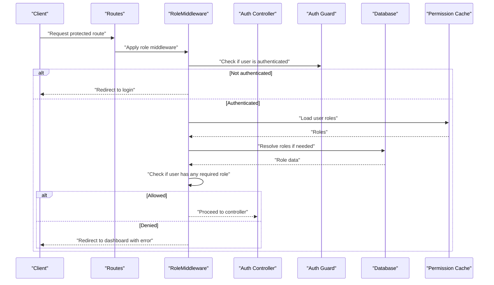

**Diagram sources**
- [RoleMiddleware.php:1-35](file://app/Http/Middleware/RoleMiddleware.php#L1-L35)
- [User.php:1-50](file://app/Models/User.php#L1-L50)
- [permission.php:1-220](file://config/permission.php#L1-L220)

## Detailed Component Analysis

### Role-Based Access Control (Spatie Permission)
- Models and tables:
  - Uses default Spatie models for roles and permissions.
  - Migration creates roles, permissions, and pivot tables for model_has_roles, model_has_permissions, and role_has_permissions.
- Caching:
  - Permissions are cached by default for performance; cache key and store are configurable.
- Seeding:
  - Seeder initializes core permissions and assigns them to roles.

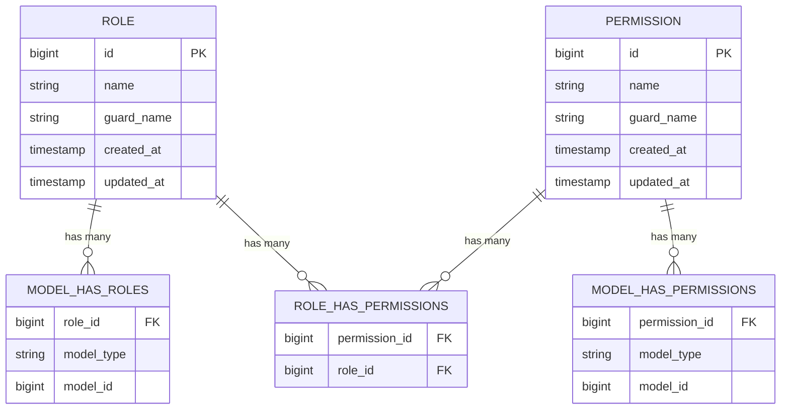

**Diagram sources**
- [2026_07_01_092410_create_permission_tables.php:1-138](file://database/migrations/2026_07_01_092410_create_permission_tables.php#L1-L138)
- [permission.php:1-220](file://config/permission.php#L1-L220)

**Section sources**
- [permission.php:1-220](file://config/permission.php#L1-L220)
- [2026_07_01_092410_create_permission_tables.php:1-138](file://database/migrations/2026_07_01_092410_create_permission_tables.php#L1-L138)
- [RolePermissionSeeder.php:1-112](file://database/seeders/RolePermissionSeeder.php#L1-L112)

### User Model Integration
- Integrates HasRoles trait for RBAC.
- Uses Notifiable for email notifications (verification, password reset).
- Casts ensure proper datetime handling for email_verified_at and secure hashing for passwords.

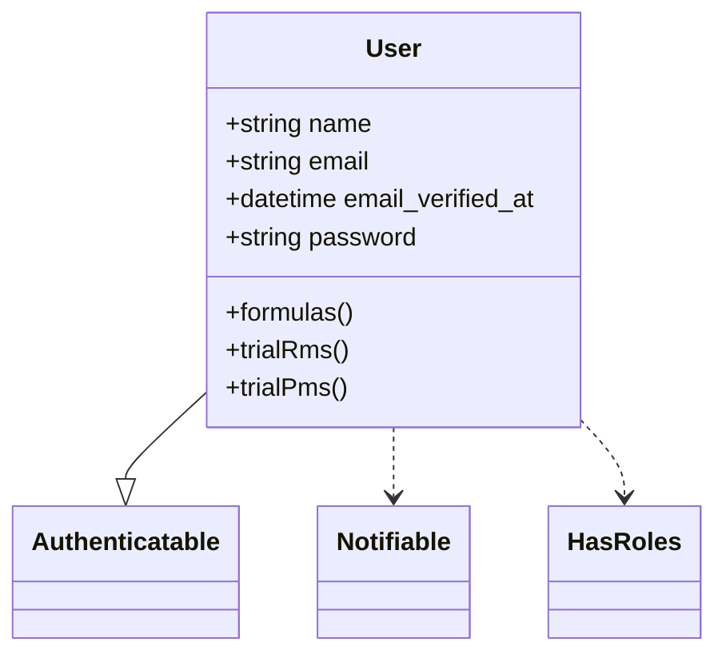

**Diagram sources**
- [User.php:1-50](file://app/Models/User.php#L1-L50)

**Section sources**
- [User.php:1-50](file://app/Models/User.php#L1-L50)

### Registration Flow
- Validates input (name, email, password confirmation).
- Creates user with hashed password.
- Fires Registered event.
- Logs in the user and redirects to dashboard.

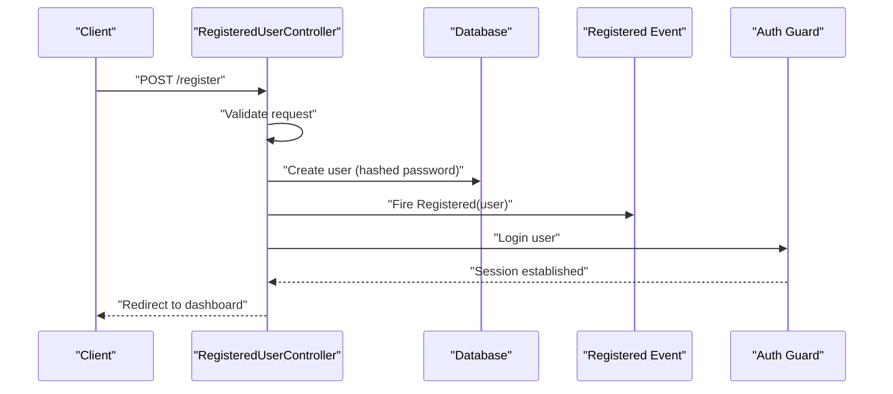

**Diagram sources**
- [RegisteredUserController.php:1-52](file://app/Http/Controllers/Auth/RegisteredUserController.php#L1-L52)

**Section sources**
- [RegisteredUserController.php:1-52](file://app/Http/Controllers/Auth/RegisteredUserController.php#L1-L52)

### Login and Logout Flow
- Login validates credentials via a dedicated request object, authenticates the user, regenerates the session, and redirects intended.
- Logout invalidates the session and regenerates CSRF token.

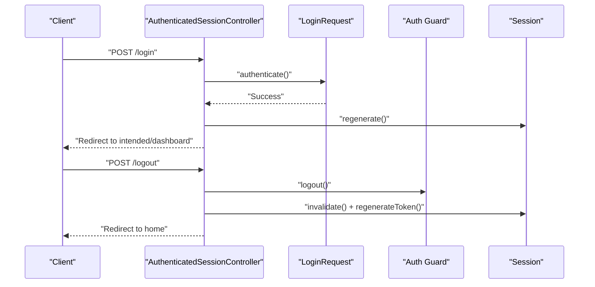

**Diagram sources**
- [AuthenticatedSessionController.php:1-48](file://app/Http/Controllers/Auth/AuthenticatedSessionController.php#L1-L48)

**Section sources**
- [AuthenticatedSessionController.php:1-48](file://app/Http/Controllers/Auth/AuthenticatedSessionController.php#L1-L48)

### Password Reset Flow
- Requesting a reset link validates email and sends a reset token via mail.
- Resetting the password validates token, email, and new password, then updates the user record and fires a PasswordReset event.

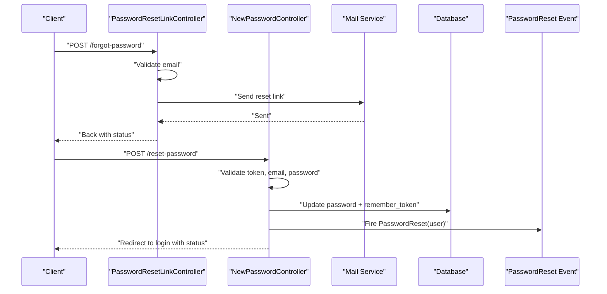

**Diagram sources**
- [PasswordResetLinkController.php:1-46](file://app/Http/Controllers/Auth/PasswordResetLinkController.php#L1-L46)
- [NewPasswordController.php:1-64](file://app/Http/Controllers/Auth/NewPasswordController.php#L1-L64)

**Section sources**
- [PasswordResetLinkController.php:1-46](file://app/Http/Controllers/Auth/PasswordResetLinkController.php#L1-L46)
- [NewPasswordController.php:1-64](file://app/Http/Controllers/Auth/NewPasswordController.php#L1-L64)

### Email Verification Flow
- Prompt controller shows verification page or redirects if already verified.
- Resend notification controller sends a new verification email.
- Verify controller marks email as verified and fires Verified event.

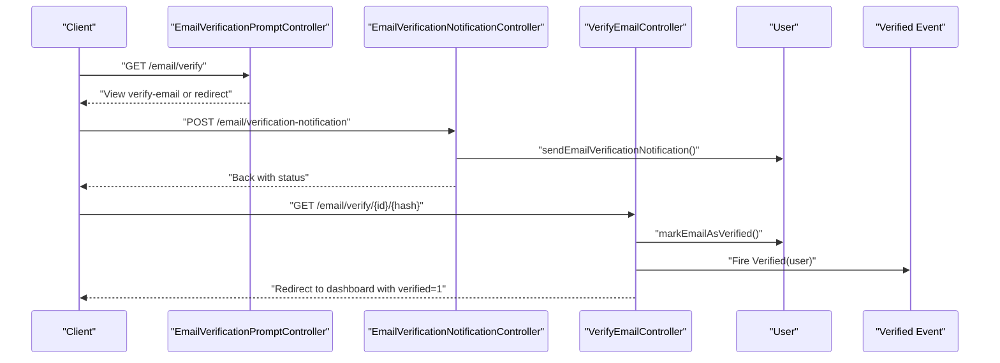

**Diagram sources**
- [EmailVerificationPromptController.php:1-22](file://app/Http/Controllers/Auth/EmailVerificationPromptController.php#L1-L22)
- [EmailVerificationNotificationController.php:1-25](file://app/Http/Controllers/Auth/EmailVerificationNotificationController.php#L1-L25)
- [VerifyEmailController.php:1-28](file://app/Http/Controllers/Auth/VerifyEmailController.php#L1-L28)

**Section sources**
- [EmailVerificationPromptController.php:1-22](file://app/Http/Controllers/Auth/EmailVerificationPromptController.php#L1-L22)
- [EmailVerificationNotificationController.php:1-25](file://app/Http/Controllers/Auth/EmailVerificationNotificationController.php#L1-L25)
- [VerifyEmailController.php:1-28](file://app/Http/Controllers/Auth/VerifyEmailController.php#L1-L28)

### Confirm Sensitive Action Password
- Requires re-entering password before performing sensitive actions.
- Stores confirmation timestamp in session.

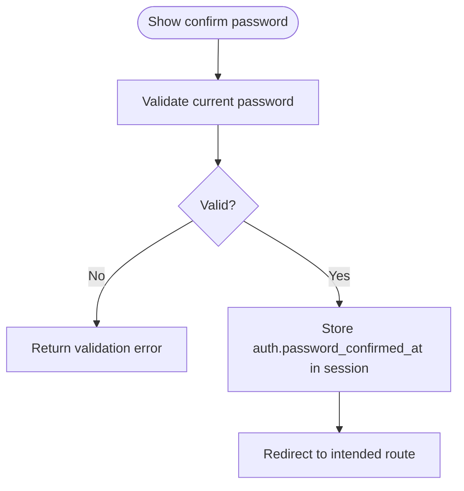

**Diagram sources**
- [ConfirmablePasswordController.php:1-41](file://app/Http/Controllers/Auth/ConfirmablePasswordController.php#L1-L41)

**Section sources**
- [ConfirmablePasswordController.php:1-41](file://app/Http/Controllers/Auth/ConfirmablePasswordController.php#L1-L41)

### Role Hierarchy and Permissions
- Roles defined in the seeder:
  - Staff R&D
  - Operational Manager
  - General Manager
  - Superadmin (created but not assigned explicit permissions in the seeder)
- Permissions include CRUD and approval actions for formulas, trial RM, and trial PM, plus approval center access.
- Example assignments:
  - Staff R&D can create/view/edit items and perform department approvals.
  - Operational Manager can view and approve stage 1.
  - General Manager can view and approve stage 2.

Practical guidance:
- To add a new role, create it in the seeder and assign necessary permissions.
- To add a new permission, define it in the seeder and assign it to relevant roles.
- Protect routes using the RoleMiddleware with one or more roles.

**Section sources**
- [RolePermissionSeeder.php:1-112](file://database/seeders/RolePermissionSeeder.php#L1-L112)

### Custom RoleMiddleware
- Ensures the user is authenticated.
- Checks if the user has any of the specified roles.
- Redirects unauthorized users to the dashboard with an error message.

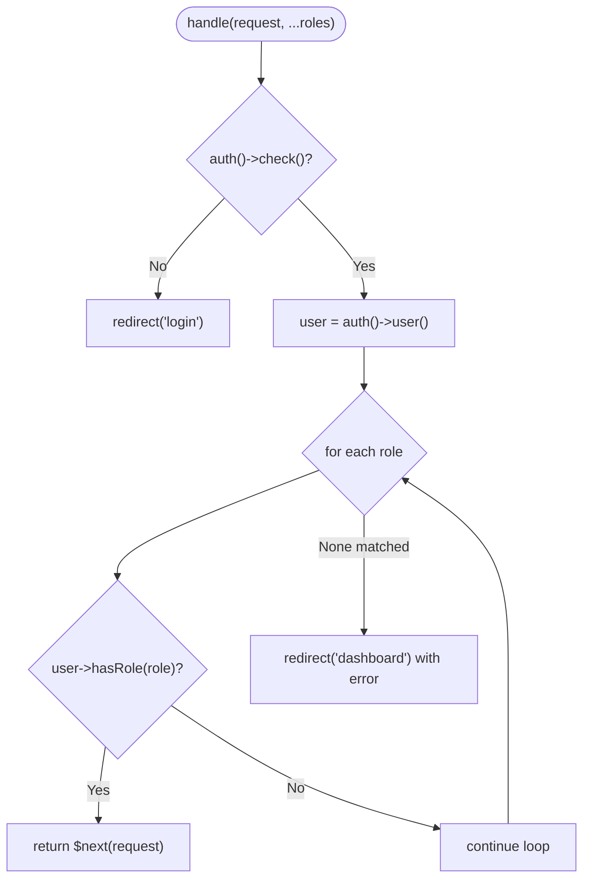

**Diagram sources**
- [RoleMiddleware.php:1-35](file://app/Http/Middleware/RoleMiddleware.php#L1-L35)

**Section sources**
- [RoleMiddleware.php:1-35](file://app/Http/Middleware/RoleMiddleware.php#L1-L35)

### Policy-Based Authorization Patterns
- FormulaPolicy:
  - viewAny/view: require formula.view permission.
  - edit/update: require formula.edit and ownership with Draft/Rejected status.
  - submit: allow creator to submit when Draft/Rejected and has edit permission.
  - reformulate: allow creation from Approved state.
  - delete: allow creator only when Draft and has delete permission.
- TrialPmPolicy:
  - viewAny/view: require trial_pm.view.
  - edit/update/delete: require ownership, Draft status, and appropriate permissions.
  - submit: allow creator when Draft and has edit permission.
  - approve: allow department approval when Pending Review and has department_approve permission.

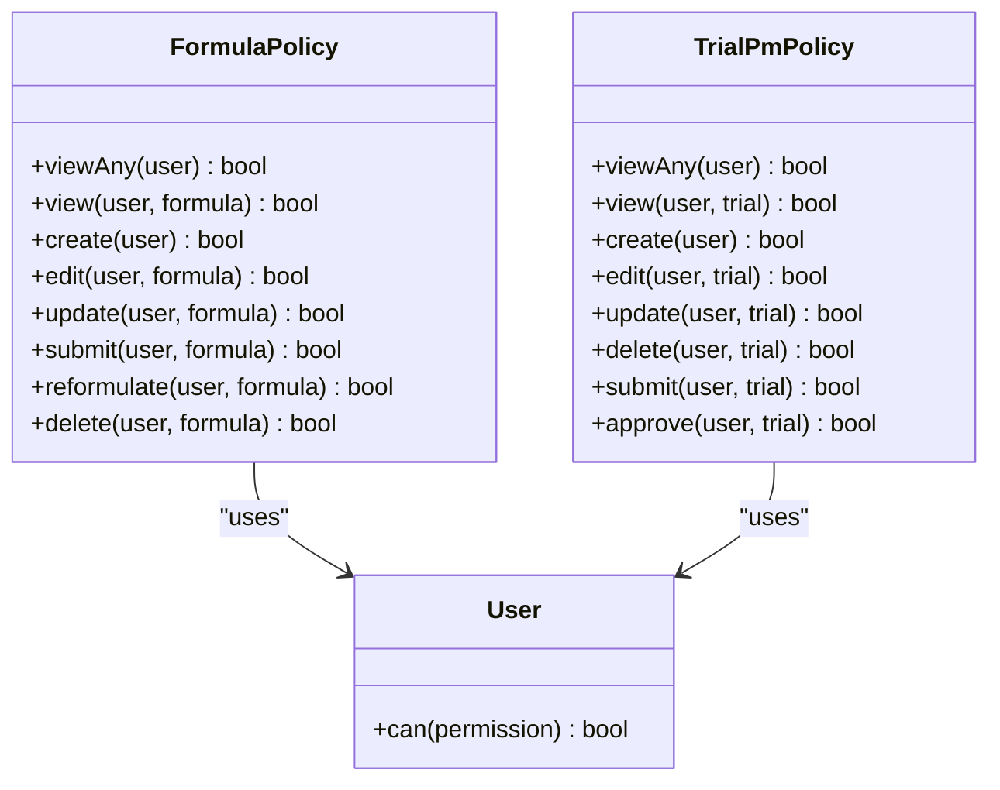

**Diagram sources**
- [FormulaPolicy.php:1-86](file://app/Policies/FormulaPolicy.php#L1-L86)
- [TrialPmPolicy.php:1-57](file://app/Policies/TrialPmPolicy.php#L1-L57)

**Section sources**
- [FormulaPolicy.php:1-86](file://app/Policies/FormulaPolicy.php#L1-L86)
- [TrialPmPolicy.php:1-57](file://app/Policies/TrialPmPolicy.php#L1-L57)

### Practical Examples

- Implementing a new role:
  - Add the role in the seeder and assign permissions accordingly.
  - Reference: [RolePermissionSeeder.php:1-112](file://database/seeders/RolePermissionSeeder.php#L1-L112)

- Adding a new permission:
  - Define the permission name in the seeder and attach it to relevant roles.
  - Reference: [RolePermissionSeeder.php:1-112](file://database/seeders/RolePermissionSeeder.php#L1-L112)

- Protecting routes with RoleMiddleware:
  - Apply middleware with one or more roles to restrict access.
  - Reference: [RoleMiddleware.php:1-35](file://app/Http/Middleware/RoleMiddleware.php#L1-L35)

- Using policies in controllers:
  - Use authorize() calls corresponding to policy methods (e.g., create, edit, submit, approve).
  - Reference: [FormulaPolicy.php:1-86](file://app/Policies/FormulaPolicy.php#L1-L86), [TrialPmPolicy.php:1-57](file://app/Policies/TrialPmPolicy.php#L1-L57)

**Section sources**
- [RolePermissionSeeder.php:1-112](file://database/seeders/RolePermissionSeeder.php#L1-L112)
- [RoleMiddleware.php:1-35](file://app/Http/Middleware/RoleMiddleware.php#L1-L35)
- [FormulaPolicy.php:1-86](file://app/Policies/FormulaPolicy.php#L1-L86)
- [TrialPmPolicy.php:1-57](file://app/Policies/TrialPmPolicy.php#L1-L57)

## Dependency Analysis
- User depends on Spatie Permission traits for role/permission checks.
- RoleMiddleware depends on the authenticated user and role resolution.
- Policies depend on permission checks and domain state (ownership, approval_status).
- Seeder depends on Spatie models to create roles and permissions.
- Config controls table names and caching behavior.

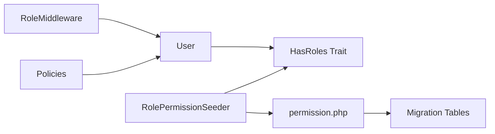

**Diagram sources**
- [User.php:1-50](file://app/Models/User.php#L1-L50)
- [RoleMiddleware.php:1-35](file://app/Http/Middleware/RoleMiddleware.php#L1-L35)
- [FormulaPolicy.php:1-86](file://app/Policies/FormulaPolicy.php#L1-L86)
- [TrialPmPolicy.php:1-57](file://app/Policies/TrialPmPolicy.php#L1-L57)
- [RolePermissionSeeder.php:1-112](file://database/seeders/RolePermissionSeeder.php#L1-L112)
- [permission.php:1-220](file://config/permission.php#L1-L220)
- [2026_07_01_092410_create_permission_tables.php:1-138](file://database/migrations/2026_07_01_092410_create_permission_tables.php#L1-L138)

**Section sources**
- [User.php:1-50](file://app/Models/User.php#L1-L50)
- [RoleMiddleware.php:1-35](file://app/Http/Middleware/RoleMiddleware.php#L1-L35)
- [FormulaPolicy.php:1-86](file://app/Policies/FormulaPolicy.php#L1-L86)
- [TrialPmPolicy.php:1-57](file://app/Policies/TrialPmPolicy.php#L1-L57)
- [RolePermissionSeeder.php:1-112](file://database/seeders/RolePermissionSeeder.php#L1-L112)
- [permission.php:1-220](file://config/permission.php#L1-L220)
- [2026_07_01_092410_create_permission_tables.php:1-138](file://database/migrations/2026_07_01_092410_create_permission_tables.php#L1-L138)

## Performance Considerations
- Permission caching:
  - Enabled by default with a 24-hour expiration; consider adjusting cache store and key if needed.
- Database queries:
  - Minimize repeated role/permission checks by leveraging caching.
- Middleware overhead:
  - Keep role lists minimal per route to reduce iteration cost.

[No sources needed since this section provides general guidance]

## Troubleshooting Guide
- Unauthorized access despite having a role:
  - Ensure the user is assigned the correct role and the route uses RoleMiddleware with matching role names.
  - Reference: [RoleMiddleware.php:1-35](file://app/Http/Middleware/RoleMiddleware.php#L1-L35)
- Permission not found errors:
  - Verify permissions exist in the database via the seeder and that they are assigned to roles.
  - Reference: [RolePermissionSeeder.php:1-112](file://database/seeders/RolePermissionSeeder.php#L1-L112)
- Email verification issues:
  - Confirm mail configuration and that verification notifications are sent.
  - Reference: [EmailVerificationNotificationController.php:1-25](file://app/Http/Controllers/Auth/EmailVerificationNotificationController.php#L1-L25)
- Password reset failures:
  - Check token validity and email match; ensure mail delivery and token expiration settings.
  - Reference: [PasswordResetLinkController.php:1-46](file://app/Http/Controllers/Auth/PasswordResetLinkController.php#L1-L46), [NewPasswordController.php:1-64](file://app/Http/Controllers/Auth/NewPasswordController.php#L1-L64)

**Section sources**
- [RoleMiddleware.php:1-35](file://app/Http/Middleware/RoleMiddleware.php#L1-L35)
- [RolePermissionSeeder.php:1-112](file://database/seeders/RolePermissionSeeder.php#L1-L112)
- [EmailVerificationNotificationController.php:1-25](file://app/Http/Controllers/Auth/EmailVerificationNotificationController.php#L1-L25)
- [PasswordResetLinkController.php:1-46](file://app/Http/Controllers/Auth/PasswordResetLinkController.php#L1-L46)
- [NewPasswordController.php:1-64](file://app/Http/Controllers/Auth/NewPasswordController.php#L1-L64)

## Conclusion
The application implements a robust authentication and authorization system combining:
- Spatie Permission for RBAC with well-defined roles and granular permissions
- Custom middleware for route-level protection
- Policies for resource-level authorization with business rule enforcement
- Standard Laravel flows for registration, login, password reset, and email verification
- Clear separation of concerns and extensibility for adding new roles, permissions, and protections

[No sources needed since this section summarizes without analyzing specific files]