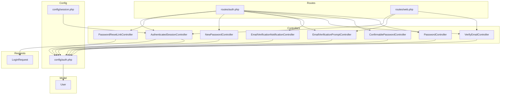
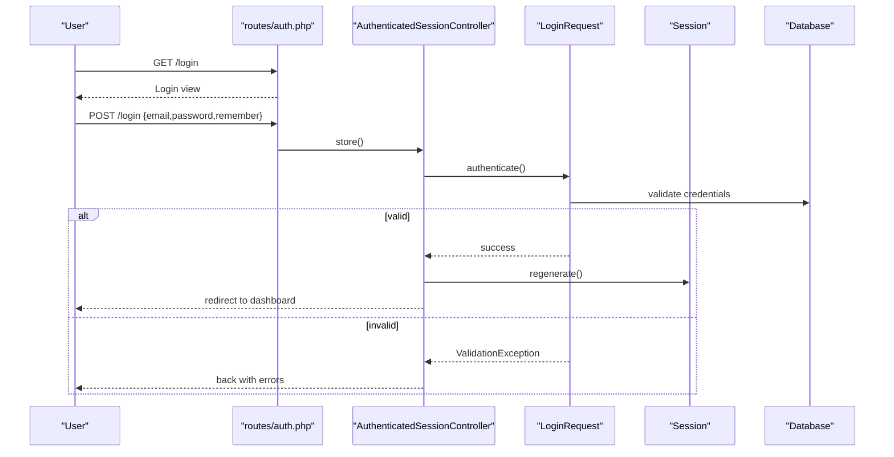
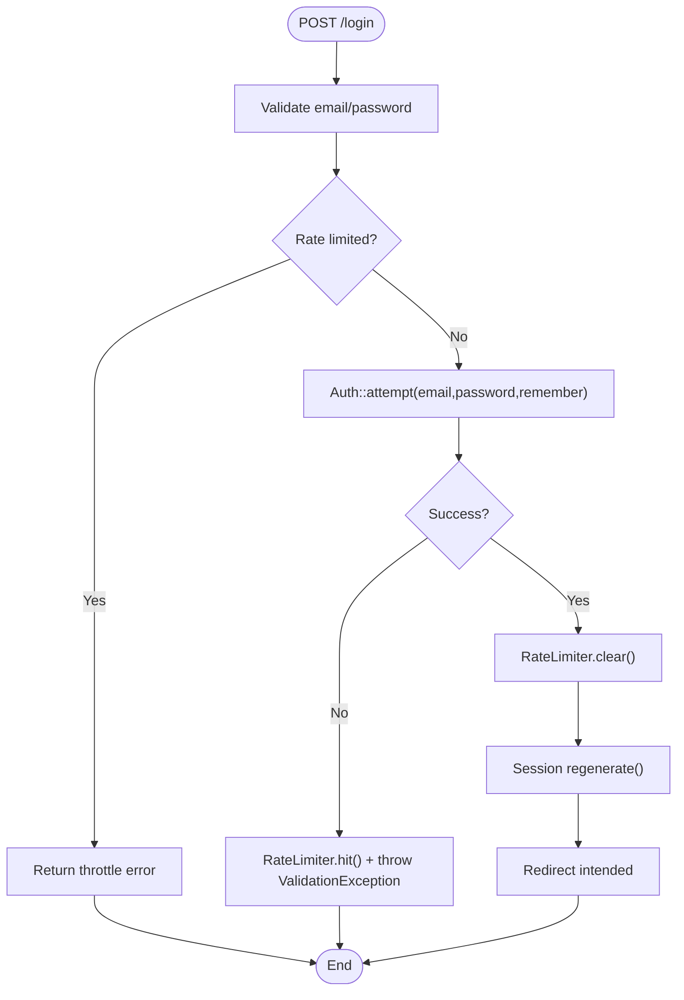
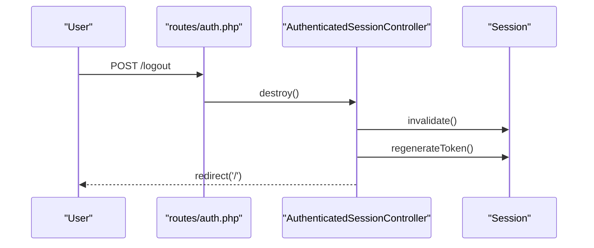
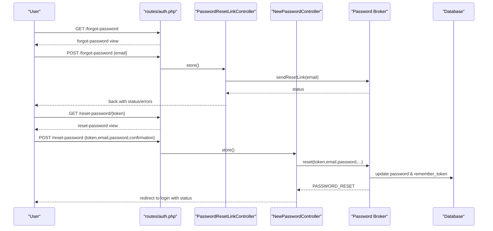
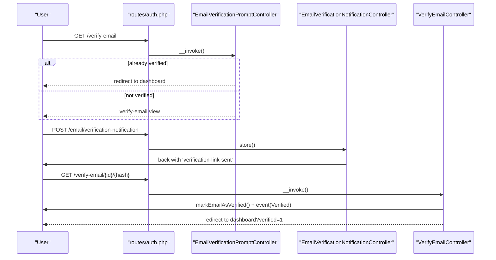
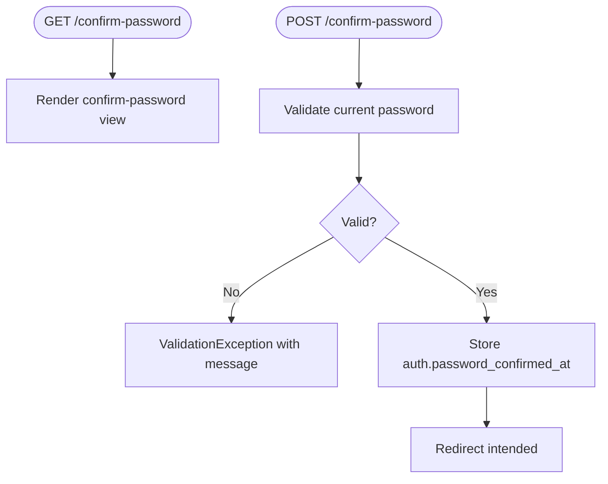
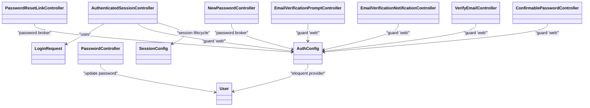

# Authentication Flows

<cite>
**Referenced Files in This Document**
- [AuthenticatedSessionController.php](file://app/Http/Controllers/Auth/AuthenticatedSessionController.php)
- [LoginRequest.php](file://app/Http/Requests/Auth/LoginRequest.php)
- [PasswordResetLinkController.php](file://app/Http/Controllers/Auth/PasswordResetLinkController.php)
- [NewPasswordController.php](file://app/Http/Controllers/Auth/NewPasswordController.php)
- [EmailVerificationNotificationController.php](file://app/Http/Controllers/Auth/EmailVerificationNotificationController.php)
- [EmailVerificationPromptController.php](file://app/Http/Controllers/Auth/EmailVerificationPromptController.php)
- [VerifyEmailController.php](file://app/Http/Controllers/Auth/VerifyEmailController.php)
- [ConfirmablePasswordController.php](file://app/Http/Controllers/Auth/ConfirmablePasswordController.php)
- [PasswordController.php](file://app/Http/Controllers/Auth/PasswordController.php)
- [auth.php](file://routes/auth.php)
- [web.php](file://routes/web.php)
- [auth.php](file://config/auth.php)
- [session.php](file://config/session.php)
- [User.php](file://app/Models/User.php)
- [RoleMiddleware.php](file://app/Http/Middleware/RoleMiddleware.php)
</cite>

## Table of Contents
1. Introduction
2. Project Structure
3. Core Components
4. Architecture Overview
5. Detailed Component Analysis
6. Dependency Analysis
7. Performance Considerations
8. Troubleshooting Guide
9. Conclusion

## Introduction
This document explains the authentication flows and user session management implemented in the application. It covers login/logout, password reset, email verification, password confirmation, session configuration, remember me behavior, security best practices, and how to extend or customize authentication logic. It also addresses session storage, CSRF protection, and integration points for external providers.

## Project Structure
Authentication is organized around dedicated controllers, a custom login request with rate limiting, route groups for guest and authenticated users, and framework configuration for guards, password brokers, and sessions.

**Diagram sources**
- [auth.php:1-60](file://routes/auth.php#L1-L60)
- [web.php:23-91](file://routes/web.php#L23-L91)
- [AuthenticatedSessionController.php:12-47](file://app/Http/Controllers/Auth/AuthenticatedSessionController.php#L12-L47)
- [PasswordResetLinkController.php:12-45](file://app/Http/Controllers/Auth/PasswordResetLinkController.php#L12-L45)
- [NewPasswordController.php:17-63](file://app/Http/Controllers/Auth/NewPasswordController.php#L17-L63)
- [EmailVerificationPromptController.php:10-21](file://app/Http/Controllers/Auth/EmailVerificationPromptController.php#L10-L21)
- [EmailVerificationNotificationController.php:9-24](file://app/Http/Controllers/Auth/EmailVerificationNotificationController.php#L9-L24)
- [VerifyEmailController.php:10-27](file://app/Http/Controllers/Auth/VerifyEmailController.php#L10-L27)
- [ConfirmablePasswordController.php:12-40](file://app/Http/Controllers/Auth/ConfirmablePasswordController.php#L12-L40)
- [PasswordController.php:11-29](file://app/Http/Controllers/Auth/PasswordController.php#L11-L29)
- [LoginRequest.php:13-86](file://app/Http/Requests/Auth/LoginRequest.php#L13-L86)
- [auth.php:1-118](file://config/auth.php#L1-L118)
- [session.php:1-234](file://config/session.php#L1-L234)
- [User.php:1-50](file://app/Models/User.php#L1-L50)

**Section sources**
- [auth.php:1-60](file://routes/auth.php#L1-L60)
- [web.php:23-91](file://routes/web.php#L23-L91)

## Core Components
- Login flow: Guest-only routes render the login form; submission validates via a custom request that enforces rate limiting and attempts authentication with optional remember me. On success, the session is regenerated and the user is redirected.
- Logout flow: Authenticated-only route logs out the web guard, invalidates the session, regenerates the CSRF token, and redirects to home.
- Password reset: Two-step process—request link by email and set new password using a signed token. The broker stores tokens and enforces expiration and throttling.
- Email verification: Prompt controller shows verification page if not verified; notification controller resends verification email; verify controller marks email as verified and fires an event.
- Password confirmation: For sensitive actions, the system re-validates the current password and records confirmation time in the session.
- Password update: Requires current password and enforces default password rules.
- Session configuration: Database driver, lifetime, cookie attributes, serialization strategy, and SameSite settings are configured.
- User model: Uses Eloquent provider, casts email_verified_at and password, and integrates with role/permission traits.

**Section sources**
- [AuthenticatedSessionController.php:12-47](file://app/Http/Controllers/Auth/AuthenticatedSessionController.php#L12-L47)
- [LoginRequest.php:13-86](file://app/Http/Requests/Auth/LoginRequest.php#L13-L86)
- [PasswordResetLinkController.php:12-45](file://app/Http/Controllers/Auth/PasswordResetLinkController.php#L12-L45)
- [NewPasswordController.php:17-63](file://app/Http/Controllers/Auth/NewPasswordController.php#L17-L63)
- [EmailVerificationPromptController.php:10-21](file://app/Http/Controllers/Auth/EmailVerificationPromptController.php#L10-L21)
- [EmailVerificationNotificationController.php:9-24](file://app/Http/Controllers/Auth/EmailVerificationNotificationController.php#L9-L24)
- [VerifyEmailController.php:10-27](file://app/Http/Controllers/Auth/VerifyEmailController.php#L10-L27)
- [ConfirmablePasswordController.php:12-40](file://app/Http/Controllers/Auth/ConfirmablePasswordController.php#L12-L40)
- [PasswordController.php:11-29](file://app/Http/Controllers/Auth/PasswordController.php#L11-L29)
- [auth.php:1-118](file://config/auth.php#L1-L118)
- [session.php:1-234](file://config/session.php#L1-L234)
- [User.php:1-50](file://app/Models/User.php#L1-L50)

## Architecture Overview
The authentication architecture follows Laravel’s standard patterns:
- Guards define the authentication driver (session-based).
- Providers map to the Eloquent user model.
- Password broker manages reset tokens and throttling.
- Routes group middleware for guest vs authenticated access.
- Session configuration controls persistence and cookie security.

**Diagram sources**
- [auth.php:14-36](file://routes/auth.php#L14-L36)
- [AuthenticatedSessionController.php:22-32](file://app/Http/Controllers/Auth/AuthenticatedSessionController.php#L22-L32)
- [LoginRequest.php:41-54](file://app/Http/Requests/Auth/LoginRequest.php#L41-L54)

## Detailed Component Analysis

### Login Flow
- Guest-only route renders login view.
- Submission uses a FormRequest that:
  - Validates email/password.
  - Enforces rate limiting keyed by normalized email and IP.
  - Attempts authentication with optional remember me.
  - Clears rate limit on success.
- Controller regenerates session and redirects intended destination.

**Diagram sources**
- [auth.php:20-23](file://routes/auth.php#L20-L23)
- [AuthenticatedSessionController.php:25-32](file://app/Http/Controllers/Auth/AuthenticatedSessionController.php#L25-L32)
- [LoginRequest.php:28-54](file://app/Http/Requests/Auth/LoginRequest.php#L28-L54)

**Section sources**
- [auth.php:20-23](file://routes/auth.php#L20-L23)
- [AuthenticatedSessionController.php:22-32](file://app/Http/Controllers/Auth/AuthenticatedSessionController.php#L22-L32)
- [LoginRequest.php:28-54](file://app/Http/Requests/Auth/LoginRequest.php#L28-L54)

### Logout Flow
- Authenticated-only route calls logout on the web guard.
- Invalidates session and regenerates CSRF token.
- Redirects to home.

**Diagram sources**
- [auth.php:57-58](file://routes/auth.php#L57-L58)
- [AuthenticatedSessionController.php:37-46](file://app/Http/Controllers/Auth/AuthenticatedSessionController.php#L37-L46)

**Section sources**
- [auth.php:57-58](file://routes/auth.php#L57-L58)
- [AuthenticatedSessionController.php:37-46](file://app/Http/Controllers/Auth/AuthenticatedSessionController.php#L37-L46)

### Password Reset Flow
- Request link: Validates email and sends reset link via the password broker.
- Set new password: Validates token, email, and password; resets password and refreshes remember token; emits a password reset event.

**Diagram sources**
- [auth.php:25-35](file://routes/auth.php#L25-L35)
- [PasswordResetLinkController.php:27-44](file://app/Http/Controllers/Auth/PasswordResetLinkController.php#L27-L44)
- [NewPasswordController.php:32-62](file://app/Http/Controllers/Auth/NewPasswordController.php#L32-L62)
- [auth.php:95-102](file://config/auth.php#L95-L102)

**Section sources**
- [auth.php:25-35](file://routes/auth.php#L25-L35)
- [PasswordResetLinkController.php:27-44](file://app/Http/Controllers/Auth/PasswordResetLinkController.php#L27-L44)
- [NewPasswordController.php:32-62](file://app/Http/Controllers/Auth/NewPasswordController.php#L32-L62)
- [auth.php:95-102](file://config/auth.php#L95-L102)

### Email Verification Workflow
- Prompt: If not verified, show verification notice; otherwise redirect to intended.
- Resend: Sends a new verification notification and returns a “link sent” status.
- Verify: Marks email as verified, fires Verified event, and redirects with a verified flag.

**Diagram sources**
- [auth.php:38-48](file://routes/auth.php#L38-L48)
- [EmailVerificationPromptController.php:15-20](file://app/Http/Controllers/Auth/EmailVerificationPromptController.php#L15-L20)
- [EmailVerificationNotificationController.php:14-23](file://app/Http/Controllers/Auth/EmailVerificationNotificationController.php#L14-L23)
- [VerifyEmailController.php:15-26](file://app/Http/Controllers/Auth/VerifyEmailController.php#L15-L26)

**Section sources**
- [auth.php:38-48](file://routes/auth.php#L38-L48)
- [EmailVerificationPromptController.php:15-20](file://app/Http/Controllers/Auth/EmailVerificationPromptController.php#L15-L20)
- [EmailVerificationNotificationController.php:14-23](file://app/Http/Controllers/Auth/EmailVerificationNotificationController.php#L14-L23)
- [VerifyEmailController.php:15-26](file://app/Http/Controllers/Auth/VerifyEmailController.php#L15-L26)

### Password Confirmation Mechanism
- Shows a confirmation view for sensitive operations.
- Re-validates current password against the authenticated user.
- Stores confirmation timestamp in session and redirects intended.

**Diagram sources**
- [auth.php:50-53](file://routes/auth.php#L50-L53)
- [ConfirmablePasswordController.php:25-39](file://app/Http/Controllers/Auth/ConfirmablePasswordController.php#L25-L39)

**Section sources**
- [auth.php:50-53](file://routes/auth.php#L50-L53)
- [ConfirmablePasswordController.php:25-39](file://app/Http/Controllers/Auth/ConfirmablePasswordController.php#L25-L39)

### Password Update
- Requires current password and enforces default password policy with confirmation.
- Updates hashed password and returns a status.

**Section sources**
- [auth.php:55-55](file://routes/auth.php#L55-L55)
- [PasswordController.php:16-28](file://app/Http/Controllers/Auth/PasswordController.php#L16-L28)

### Session Configuration and Remember Me
- Driver: database by default; supports file, cookie, redis, memcached, dynamodb, array.
- Lifetime and close behavior configurable.
- Cookie attributes: secure, http_only, same_site, partitioned.
- Serialization: JSON by default for safety.
- Remember me: handled via the remember parameter during login attempt.

Key configuration areas:
- Guard and provider setup for session-based authentication.
- Password broker table, expiry, and throttle settings.
- Password confirmation timeout.

**Section sources**
- [session.php:21-231](file://config/session.php#L21-L231)
- [auth.php:18-74](file://config/auth.php#L18-L74)
- [auth.php:95-116](file://config/auth.php#L95-L116)
- [LoginRequest.php:45-45](file://app/Http/Requests/Auth/LoginRequest.php#L45-L45)

### Security Best Practices Observed
- Rate limiting on login attempts keyed by normalized email and IP.
- Session regeneration after successful login and logout.
- CSRF token regeneration on logout.
- Password confirmation for sensitive actions.
- Secure session cookie defaults (http_only, same_site).
- JSON session serialization to avoid PHP object injection risks.

**Section sources**
- [LoginRequest.php:61-85](file://app/Http/Requests/Auth/LoginRequest.php#L61-L85)
- [AuthenticatedSessionController.php:29-43](file://app/Http/Controllers/Auth/AuthenticatedSessionController.php#L29-L43)
- [ConfirmablePasswordController.php:25-39](file://app/Http/Controllers/Auth/ConfirmablePasswordController.php#L25-L39)
- [session.php:172-202](file://config/session.php#L172-L202)
- [session.php:230-231](file://config/session.php#L230-L231)

### Custom Authentication Logic and Failure Handling
- Extend LoginRequest to add custom checks before or after Auth::attempt.
- Use ValidationException to return consistent error messages.
- Leverage events like Lockout for auditing or notifications.

Example extension points:
- Add additional fields to validation rules.
- Introduce account lockout policies beyond rate limiting.
- Log failed attempts with contextual data.

**Section sources**
- [LoginRequest.php:28-54](file://app/Http/Requests/Auth/LoginRequest.php#L28-L54)

### Integrating External Authentication Providers
- Configure additional guards and providers in the auth configuration.
- Implement custom user providers or use socialite packages.
- Map external identities to local user records and manage sessions accordingly.

Configuration anchors:
- Guards and providers sections.
- Default guard and password broker.

**Section sources**
- [auth.php:18-74](file://config/auth.php#L18-L74)

### Role-Based Access Control Integration
- A custom middleware checks roles and redirects unauthorized users.
- Routes can enforce roles via middleware parameters.

**Section sources**
- [RoleMiddleware.php:16-33](file://app/Http/Middleware/RoleMiddleware.php#L16-L33)
- [web.php:82-90](file://routes/web.php#L82-L90)

## Dependency Analysis
The following diagram maps key dependencies among controllers, requests, configuration, and the user model.

**Diagram sources**
- [AuthenticatedSessionController.php:12-47](file://app/Http/Controllers/Auth/AuthenticatedSessionController.php#L12-L47)
- [LoginRequest.php:13-86](file://app/Http/Requests/Auth/LoginRequest.php#L13-L86)
- [PasswordResetLinkController.php:12-45](file://app/Http/Controllers/Auth/PasswordResetLinkController.php#L12-L45)
- [NewPasswordController.php:17-63](file://app/Http/Controllers/Auth/NewPasswordController.php#L17-L63)
- [EmailVerificationPromptController.php:10-21](file://app/Http/Controllers/Auth/EmailVerificationPromptController.php#L10-L21)
- [EmailVerificationNotificationController.php:9-24](file://app/Http/Controllers/Auth/EmailVerificationNotificationController.php#L9-L24)
- [VerifyEmailController.php:10-27](file://app/Http/Controllers/Auth/VerifyEmailController.php#L10-L27)
- [ConfirmablePasswordController.php:12-40](file://app/Http/Controllers/Auth/ConfirmablePasswordController.php#L12-L40)
- [PasswordController.php:11-29](file://app/Http/Controllers/Auth/PasswordController.php#L11-L29)
- [auth.php:1-118](file://config/auth.php#L1-L118)
- [session.php:1-234](file://config/session.php#L1-L234)
- [User.php:1-50](file://app/Models/User.php#L1-L50)

**Section sources**
- [auth.php:1-60](file://routes/auth.php#L1-L60)
- [web.php:23-91](file://routes/web.php#L23-L91)

## Performance Considerations
- Prefer database or Redis session drivers for scalability.
- Keep session lifetime reasonable and consider expire_on_close for sensitive apps.
- Use JSON serialization to reduce overhead and improve safety.
- Ensure password reset throttling and email sending are queued in production to avoid blocking requests.

[No sources needed since this section provides general guidance]

## Troubleshooting Guide
Common issues and resolutions:
- Login rate limiting: If users see throttle messages, adjust limits or whitelist IPs. Check the throttle key generation and ensure correct IP resolution behind proxies.
- Session not persisting: Verify session driver, connection, and table existence. Ensure SESSION_DRIVER and related environment variables are set correctly.
- Password reset links not working: Confirm password_reset_tokens table exists, token expiry is appropriate, and mail is configured.
- Email verification loops: Ensure email_verified_at is cast to datetime and verification routes are protected by signed/throttled middleware.
- CSRF failures after logout: Confirm session regeneration and token regeneration occur on logout.

**Section sources**
- [LoginRequest.php:61-85](file://app/Http/Requests/Auth/LoginRequest.php#L61-L85)
- [session.php:21-90](file://config/session.php#L21-L90)
- [auth.php:95-102](file://config/auth.php#L95-L102)
- [VerifyEmailController.php:15-26](file://app/Http/Controllers/Auth/VerifyEmailController.php#L15-L26)
- [AuthenticatedSessionController.php:37-46](file://app/Http/Controllers/Auth/AuthenticatedSessionController.php#L37-L46)

## Conclusion
The application implements robust authentication flows using Laravel’s built-in features: session-based guards, password brokering, email verification, and password confirmation. Security is reinforced through rate limiting, session regeneration, CSRF token handling, and secure session cookies. Extensibility is straightforward via custom requests, middleware, and configuration changes for guards and providers.