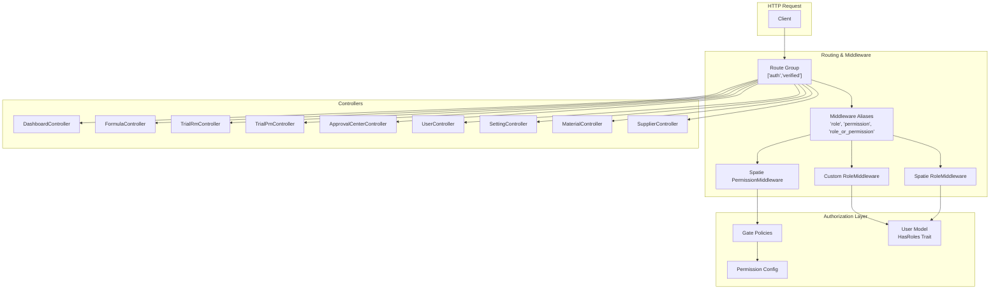
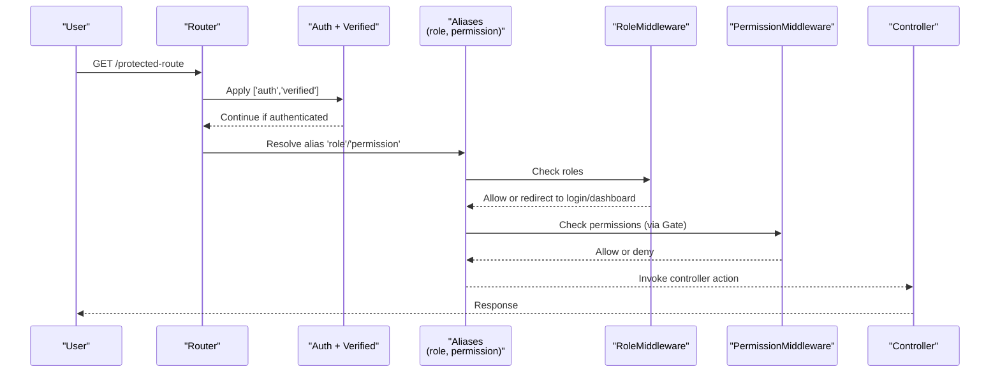
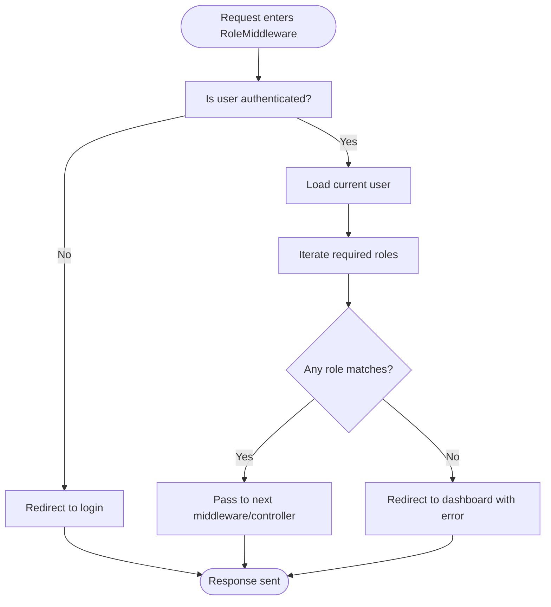
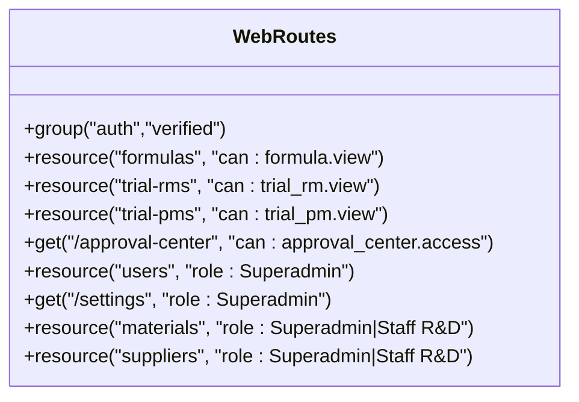
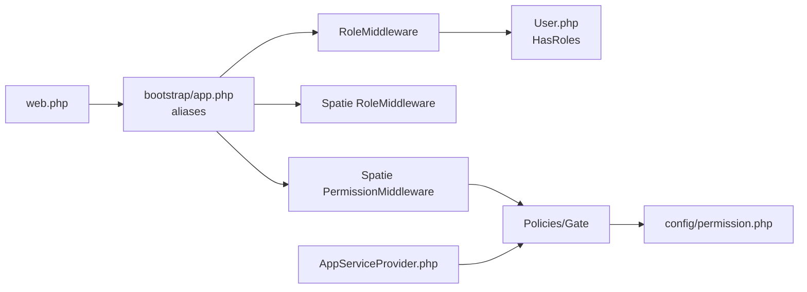

# Authentication Middleware

<cite>
**Referenced Files in This Document**
- [RoleMiddleware.php](file://app/Http/Middleware/RoleMiddleware.php)
- [app.php](file://bootstrap/app.php)
- [web.php](file://routes/web.php)
- [auth.php](file://config/auth.php)
- [permission.php](file://config/permission.php)
- [User.php](file://app/Models/User.php)
- [AppServiceProvider.php](file://app/Providers/AppServiceProvider.php)
- [FormulaPolicy.php](file://app/Policies/Formul aPolicy.php)
- [AuthenticationTest.php](file://tests/Feature/Auth/AuthenticationTest.php)
</cite>

## Table of Contents
1. [Introduction](#introduction)
2. [Project Structure](#project-structure)
3. [Core Components](#core-components)
4. [Architecture Overview](#architecture-overview)
5. [Detailed Component Analysis](#detailed-component-analysis)
6. [Dependency Analysis](#dependency-analysis)
7. [Performance Considerations](#performance-considerations)
8. [Troubleshooting Guide](#troubleshooting-guide)
9. [Conclusion](#conclusion)
10. [Appendices](#appendices)

## Introduction
This document explains the authentication and authorization middleware implementation in the application, focusing on:
- The custom RoleMiddleware for route protection
- Middleware registration in bootstrap configuration
- Route-level authorization patterns using roles and permissions
- How to protect routes with roles and permissions
- Implementing conditional middleware logic
- Handling unauthorized access scenarios
- Creating custom middleware, chaining multiple middleware, and testing middleware functionality
- Performance considerations and error handling strategies

The project uses Laravel’s built-in authentication and Spatie Permission package for role-based and permission-based access control.

## Project Structure
Key files involved in authentication and authorization:
- Custom middleware: app/Http/Middleware/RoleMiddleware.php
- Global middleware aliases: bootstrap/app.php
- Route definitions (role and permission usage): routes/web.php
- Auth configuration: config/auth.php
- Permission configuration: config/permission.php
- User model with roles trait: app/Models/User.php
- Policy registration and global gate rules: app/Providers/AppServiceProvider.php
- Example policy: app/Policies/FormulaPolicy.php
- Feature tests for auth flows: tests/Feature/Auth/AuthenticationTest.php

**Diagram sources**
- [app.php:14-20](file://bootstrap/app.php#L14-L20)
- [web.php:23-91](file://routes/web.php#L23-L91)
- [RoleMiddleware.php:9-34](file://app/Http/Middleware/RoleMiddleware.php#L9-L34)
- [User.php:12-19](file://app/Models/User.php#L12-L19)
- [AppServiceProvider.php:33-43](file://app/Providers/AppServiceProvider.php#L33-L43)
- [permission.php:196-218](file://config/permission.php#L196-L218)

**Section sources**
- [app.php:14-20](file://bootstrap/app.php#L14-L20)
- [web.php:23-91](file://routes/web.php#L23-L91)
- [RoleMiddleware.php:9-34](file://app/Http/Middleware/RoleMiddleware.php#L9-L34)
- [User.php:12-19](file://app/Models/User.php#L12-L19)
- [AppServiceProvider.php:33-43](file://app/Providers/AppServiceProvider.php#L33-L43)
- [permission.php:196-218](file://config/permission.php#L196-L218)

## Core Components
- Custom RoleMiddleware: Validates that the user is authenticated and has at least one of the specified roles; otherwise redirects to login or dashboard with an error message.
- Middleware aliases: Registers Spatie’s role, permission, and combined role-or-permission middleware under convenient names.
- Route-level authorization: Uses both role and permission middleware across resources and specific endpoints.
- User model integration: Uses HasRoles trait to provide role and permission checks.
- Policies and gates: Register policies and apply a global rule granting Superadmin full access.

**Section sources**
- [RoleMiddleware.php:9-34](file://app/Http/Middleware/RoleMiddleware.php#L9-L34)
- [app.php:14-20](file://bootstrap/app.php#L14-L20)
- [web.php:23-91](file://routes/web.php#L23-L91)
- [User.php:12-19](file://app/Models/User.php#L12-L19)
- [AppServiceProvider.php:33-43](file://app/Providers/AppServiceProvider.php#L33-L43)

## Architecture Overview
The request lifecycle for protected routes:
- Routes are grouped under auth and verified middleware.
- Additional role and permission middleware are applied per resource or endpoint.
- RoleMiddleware enforces role checks before controller execution.
- Spatie’s permission middleware enforces permission checks via policies/gates.
- Unauthorized users are redirected to login or dashboard with feedback.

**Diagram sources**
- [web.php:23-91](file://routes/web.php#L23-L91)
- [app.php:14-20](file://bootstrap/app.php#L14-L20)
- [RoleMiddleware.php:16-33](file://app/Http/Middleware/RoleMiddleware.php#L16-L33)

## Detailed Component Analysis

### Custom RoleMiddleware
Responsibilities:
- Ensure the user is authenticated.
- Validate that the user holds at least one of the provided roles.
- Redirect unauthenticated users to login.
- Redirect unauthorized users to dashboard with an error message.

**Diagram sources**
- [RoleMiddleware.php:16-33](file://app/Http/Middleware/RoleMiddleware.php#L16-L33)

**Section sources**
- [RoleMiddleware.php:9-34](file://app/Http/Middleware/RoleMiddleware.php#L9-L34)

### Middleware Registration in Bootstrap
Global aliases:
- role => Spatie RoleMiddleware
- permission => Spatie PermissionMiddleware
- role_or_permission => Spatie RoleOrPermissionMiddleware

These aliases enable concise usage in routes like 'role:Superadmin' and 'can:formula.view'.

**Section sources**
- [app.php:14-20](file://bootstrap/app.php#L14-L20)

### Route-Level Authorization Patterns
Examples from web routes:
- Resource-level permission: formulas use 'can:formula.view'
- Role-only access: users resource uses 'role:Superadmin'
- Multiple roles: materials/suppliers use 'role:Superadmin|Staff R&D'
- Approval center endpoints gated by 'can:approval_center.access'

**Diagram sources**
- [web.php:23-91](file://routes/web.php#L23-L91)

**Section sources**
- [web.php:23-91](file://routes/web.php#L23-L91)

### User Model and Roles Integration
The User model includes the HasRoles trait, enabling methods like hasRole() and can().

**Section sources**
- [User.php:12-19](file://app/Models/User.php#L12-L19)

### Policies and Gates
- Policies are registered for domain models (e.g., Formula).
- A global gate rule grants Superadmin all permission checks.
- Policies enforce fine-grained logic based on roles and permissions.

**Section sources**
- [AppServiceProvider.php:33-43](file://app/Providers/AppServiceProvider.php#L33-L43)
- [FormulaPolicy.php:13-84](file://app/Policies/FormulaPolicy.php#L13-L84)

### Practical Examples

#### Protecting Routes with Roles and Permissions
- Use 'role:Superadmin' for admin-only routes.
- Use 'can:formula.view' for permission-based access.
- Combine multiple roles with '|' syntax (e.g., 'role:Superadmin|Staff R&D').

**Section sources**
- [web.php:33-91](file://routes/web.php#L33-L91)

#### Implementing Conditional Middleware Logic
- Extend RoleMiddleware to support additional conditions (e.g., account status, IP allowlist).
- Return early with appropriate redirects or responses when conditions fail.

[No sources needed since this section provides general guidance]

#### Handling Unauthorized Access Scenarios
- Unauthenticated requests are redirected to login.
- Authenticated but unauthorized requests are redirected to dashboard with an error message.

**Section sources**
- [RoleMiddleware.php:18-33](file://app/Http/Middleware/RoleMiddleware.php#L18-L33)

#### Creating Custom Middleware
- Create a new class under app/Http/Middleware with a handle(Request $request, Closure $next, ...$args) method.
- Register it in bootstrap/app.php via alias or add it to the global stack.

[No sources needed since this section provides general guidance]

#### Chaining Multiple Middleware
- Apply multiple middleware on a route group or individual routes (e.g., 'auth', 'verified', 'role', 'can').
- Order matters: place authentication first, then role/permission checks.

**Section sources**
- [web.php:23-91](file://routes/web.php#L23-L91)
- [app.php:14-20](file://bootstrap/app.php#L14-L20)

#### Testing Middleware Functionality
- Use feature tests to assert redirects for unauthenticated and unauthorized users.
- Assert successful access for users with correct roles/permissions.

**Section sources**
- [AuthenticationTest.php:13-53](file://tests/Feature/Auth/AuthenticationTest.php#L13-L53)

## Dependency Analysis
Relationships between components:
- Routes depend on middleware aliases defined in bootstrap/app.php.
- RoleMiddleware depends on the User model’s HasRoles trait.
- Permission checks rely on Spatie Permission configuration and policies/gates.
- AppServiceProvider registers policies and applies a global gate rule.

**Diagram sources**
- [web.php:23-91](file://routes/web.php#L23-L91)
- [app.php:14-20](file://bootstrap/app.php#L14-L20)
- [RoleMiddleware.php:16-33](file://app/Http/Middleware/RoleMiddleware.php#L16-L33)
- [User.php:12-19](file://app/Models/User.php#L12-L19)
- [AppServiceProvider.php:33-43](file://app/Providers/AppServiceProvider.php#L33-L43)
- [permission.php:196-218](file://config/permission.php#L196-L218)

**Section sources**
- [web.php:23-91](file://routes/web.php#L23-L91)
- [app.php:14-20](file://bootstrap/app.php#L14-L20)
- [RoleMiddleware.php:16-33](file://app/Http/Middleware/RoleMiddleware.php#L16-L33)
- [User.php:12-19](file://app/Models/User.php#L12-L19)
- [AppServiceProvider.php:33-43](file://app/Providers/AppServiceProvider.php#L33-L43)
- [permission.php:196-218](file://config/permission.php#L196-L218)

## Performance Considerations
- Permission caching: Spatie caches permissions for performance; ensure cache store and expiration are configured appropriately.
- Avoid excessive role checks: Prefer grouping routes and applying middleware at the group level where possible.
- Keep middleware lightweight: Perform only necessary checks in middleware; delegate complex logic to policies/services.
- Monitor database queries: Ensure roles/permissions tables are properly indexed and cached.

**Section sources**
- [permission.php:196-218](file://config/permission.php#L196-L218)

## Troubleshooting Guide
Common issues and resolutions:
- Redirect loop after login: Verify that the intended route exists and is accessible with the user’s roles/permissions.
- Unauthorized redirect to dashboard: Confirm the user has the required roles or permissions; check route middleware assignments.
- Missing alias errors: Ensure middleware aliases are correctly registered in bootstrap/app.php.
- Policy not invoked: Confirm policies are registered in AppServiceProvider and that the 'can:' middleware is used correctly.

**Section sources**
- [app.php:14-20](file://bootstrap/app.php#L14-L20)
- [web.php:23-91](file://routes/web.php#L23-L91)
- [AppServiceProvider.php:33-43](file://app/Providers/AppServiceProvider.php#L33-L43)

## Conclusion
The application implements a robust authentication and authorization system combining Laravel’s built-in features with Spatie Permission. RoleMiddleware provides flexible role-based protection, while policies and gates enable granular permission checks. Proper middleware registration and route-level configurations ensure secure access control. Following the best practices outlined here will help maintain performance and reliability.

## Appendices

### Configuration References
- Authentication guard/provider setup: config/auth.php
- Permission package settings and caching: config/permission.php

**Section sources**
- [auth.php:18-74](file://config/auth.php#L18-L74)
- [permission.php:196-218](file://config/permission.php#L196-L218)