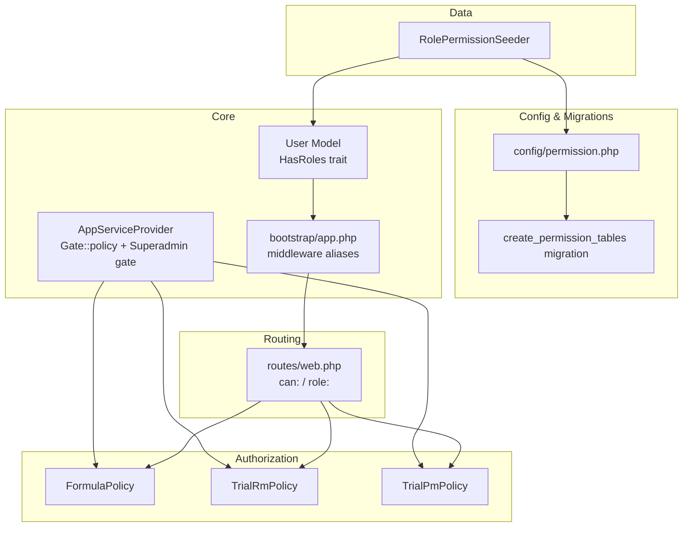
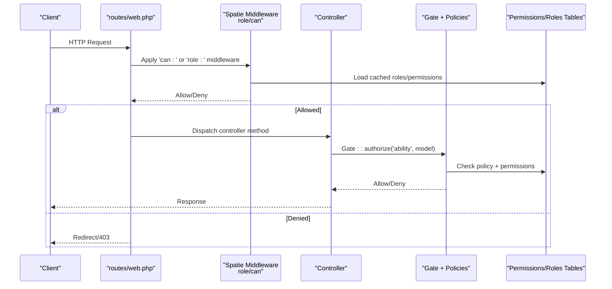
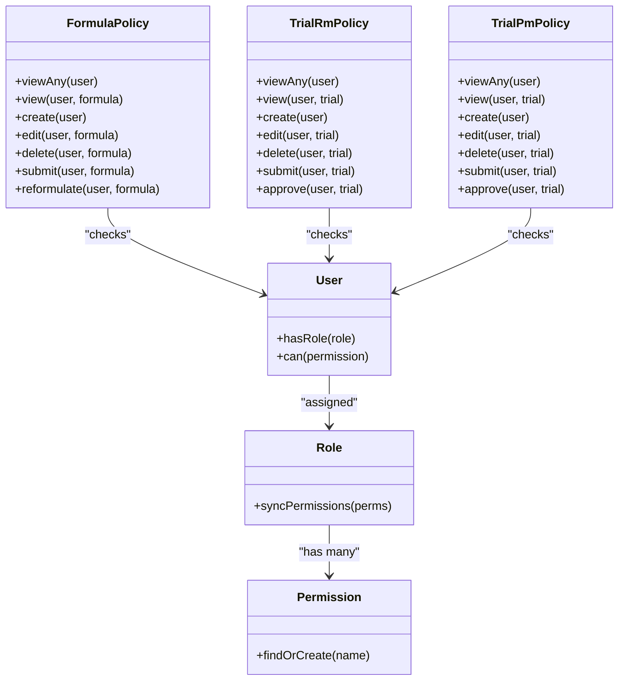
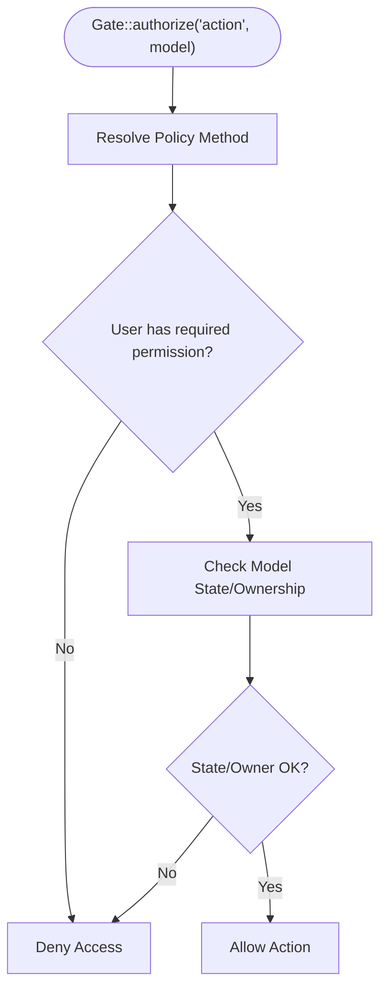
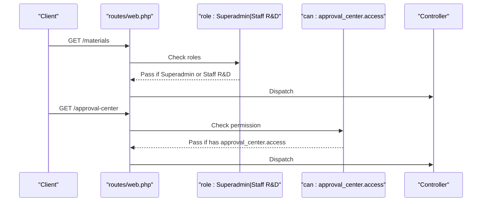
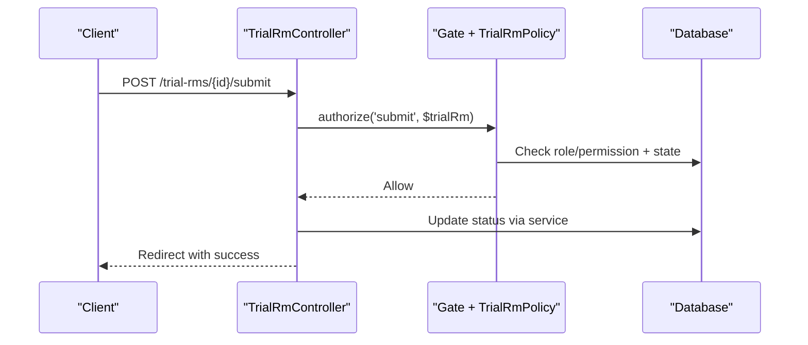
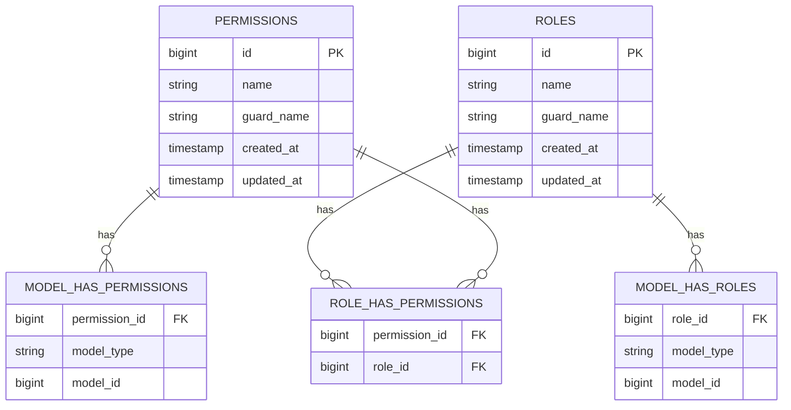
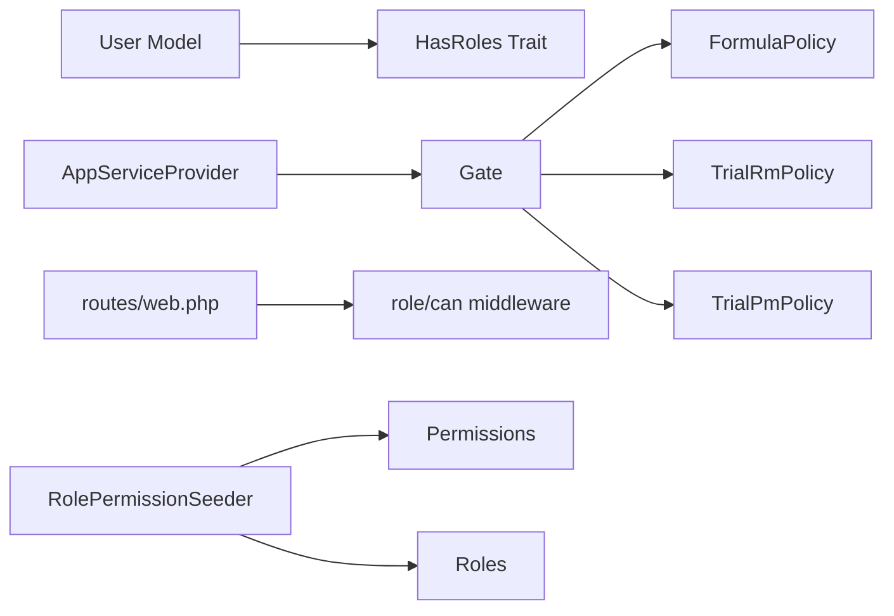

# Role & Permission System

<cite>
**Referenced Files in This Document**
- [config/permission.php](file://config/permission.php)
- [database/migrations/2026_07_01_092410_create_permission_tables.php](file://database/migrations/2026_07_01_092410_create_permission_tables.php)
- [app/Models/User.php](file://app/Models/User.php)
- [bootstrap/app.php](file://bootstrap/app.php)
- [routes/web.php](file://routes/web.php)
- [app/Providers/AppServiceProvider.php](file://app/Providers/AppServiceProvider.php)
- [app/Policies/FormulasPolicy.php](file://app/Policies/FormulaPolicy.php)
- [app/Policies/TrialRmPolicy.php](file://app/Policies/TrialRmPolicy.php)
- [app/Policies/TrialPmPolicy.php](file://app/Policies/TrialPmPolicy.php)
- [database/seeders/RolePermissionSeeder.php](file://database/seeders/RolePermissionSeeder.php)
- [app/Http/Controllers/TrialRmController.php](file://app/Http/Controllers/TrialRmController.php)
- [app/Http/Controllers/TrialPmController.php](file://app/Http/Controllers/TrialPmController.php)
</cite>

## Table of Contents
1. Introduction
2. Project Structure
3. Core Components
4. Architecture Overview
5. Detailed Component Analysis
6. Dependency Analysis
7. Performance Considerations
8. Troubleshooting Guide
9. Conclusion

## Introduction
This document explains the role-based access control (RBAC) system implemented with Spatie Laravel Permission. It covers:
- The three-tier role hierarchy and Superadmin
- Permissions, roles, and their assignments
- Policy-based authorization patterns for resources
- Middleware usage for route protection
- Practical examples for extending roles and permissions
- Caching behavior, performance tuning, and debugging strategies

The system enforces both coarse-grained access (roles on routes) and fine-grained access (policies per resource action).

## Project Structure
Key RBAC-related files are organized as follows:
- Configuration and migrations define tables and caching behavior
- User model integrates Spatie traits
- Bootstrap registers middleware aliases
- Routes protect endpoints using can and role middleware
- Policies encapsulate business rules for each resource
- Seeders initialize roles and permissions
- Controllers enforce policies via Gate::authorize

**Diagram sources**
- [config/permission.php:1-220](file://config/permission.php#L1-L220)
- [database/migrations/2026_07_01_092410_create_permission_tables.php:1-138](file://database/migrations/2026_07_01_092410_create_permission_tables.php#L1-L138)
- [app/Models/User.php:1-50](file://app/Models/User.php#L1-L50)
- [bootstrap/app.php:14-20](file://bootstrap/app.php#L14-L20)
- [app/Providers/AppServiceProvider.php:33-43](file://app/Providers/AppServiceProvider.php#L33-L43)
- [routes/web.php:23-91](file://routes/web.php#L23-L91)
- [database/seeders/RolePermissionSeeder.php:1-112](file://database/seeders/RolePermissionSeeder.php#L1-L112)

**Section sources**
- [config/permission.php:1-220](file://config/permission.php#L1-L220)
- [database/migrations/2026_07_01_092410_create_permission_tables.php:1-138](file://database/migrations/2026_07_01_092410_create_permission_tables.php#L1-L138)
- [app/Models/User.php:1-50](file://app/Models/User.php#L1-L50)
- [bootstrap/app.php:14-20](file://bootstrap/app.php#L14-L20)
- [routes/web.php:23-91](file://routes/web.php#L23-L91)
- [app/Providers/AppServiceProvider.php:33-43](file://app/Providers/AppServiceProvider.php#L33-L43)
- [database/seeders/RolePermissionSeeder.php:1-112](file://database/seeders/RolePermissionSeeder.php#L1-L112)

## Core Components
- User model includes HasRoles to enable role and permission checks.
- Spatie middleware aliases are registered for role and permission checks at the router level.
- AppServiceProvider registers policies for Formula, TrialRm, and TrialPm, and grants Superadmin implicit access to all abilities.
- Seeders create permissions and assign them to roles.
- Routes use can: and role: middleware to protect endpoints.

Practical highlights:
- Role-based route protection: e.g., user management and settings require Superadmin; materials/suppliers allow Superadmin or Staff R&D.
- Permission-based route protection: e.g., approval center requires approval_center.access.
- Policy-based authorization: controllers call Gate::authorize with policy methods like viewAny, create, edit, delete, submit, approve.

**Section sources**
- [app/Models/User.php:12-19](file://app/Models/User.php#L12-L19)
- [bootstrap/app.php:14-20](file://bootstrap/app.php#L14-L20)
- [app/Providers/AppServiceProvider.php:33-43](file://app/Providers/AppServiceProvider.php#L33-L43)
- [routes/web.php:34-91](file://routes/web.php#L34-L91)
- [database/seeders/RolePermissionSeeder.php:15-110](file://database/seeders/RolePermissionSeeder.php#L15-L110)

## Architecture Overview
End-to-end request flow with authorization:

**Diagram sources**
- [routes/web.php:34-91](file://routes/web.php#L34-L91)
- [bootstrap/app.php:14-20](file://bootstrap/app.php#L14-L20)
- [app/Providers/AppServiceProvider.php:33-43](file://app/Providers/AppServiceProvider.php#L33-L43)
- [database/migrations/2026_07_01_092410_create_permission_tables.php:26-115](file://database/migrations/2026_07_01_092410_create_permission_tables.php#L26-L115)

## Detailed Component Analysis

### Roles and Permissions Hierarchy
- Roles created by seeder:
  - Superadmin
  - Staff R&D
  - Operational Manager
  - General Manager
- Key permissions include CRUD and approval actions for formulas, trial RM, trial PM, plus an approval center access permission.
- Assignments:
  - Staff R&D: create/view/edit for formulas and trials; department_approve for trial PM; view for approvals.
  - Operational Manager: view and approve_tahap1 for formulas and trials; approval_center.access.
  - General Manager: view and approve_tahap2 for formulas and trials; approval_center.access.
  - Superadmin: implicitly granted all abilities via Gate::before.

**Diagram sources**
- [app/Models/User.php:12-19](file://app/Models/User.php#L12-L19)
- [database/seeders/RolePermissionSeeder.php:65-110](file://database/seeders/RolePermissionSeeder.php#L65-L110)
- [app/Policies/FormulaPolicy.php:13-84](file://app/Policies/FormulaPolicy.php#L13-L84)
- [app/Policies/TrialRmPolicy.php:10-63](file://app/Policies/TrialRmPolicy.php#L10-L63)
- [app/Policies/TrialPmPolicy.php:10-56](file://app/Policies/TrialPmPolicy.php#L10-L56)

**Section sources**
- [database/seeders/RolePermissionSeeder.php:15-110](file://database/seeders/RolePermissionSeeder.php#L15-L110)
- [app/Providers/AppServiceProvider.php:40-43](file://app/Providers/AppServiceProvider.php#L40-L43)

### Policy-Based Authorization Patterns
- Resource policies encapsulate business rules such as ownership, state transitions, and required permissions.
- Examples:
  - FormulaPolicy: restricts edit/delete to creator and specific statuses; allows reformulation from Approved.
  - TrialRmPolicy: approves based on stage and role checks.
  - TrialPmPolicy: allows department approvals when status is Pending Review and user has department_approve permission.

**Diagram sources**
- [app/Policies/FormulaPolicy.php:38-84](file://app/Policies/FormulaPolicy.php#L38-L84)
- [app/Policies/TrialRmPolicy.php:25-63](file://app/Policies/TrialRmPolicy.php#L25-L63)
- [app/Policies/TrialPmPolicy.php:25-56](file://app/Policies/TrialPmPolicy.php#L25-L56)

**Section sources**
- [app/Policies/FormulaPolicy.php:13-84](file://app/Policies/FormulaPolicy.php#L13-L84)
- [app/Policies/TrialRmPolicy.php:10-63](file://app/Policies/TrialRmPolicy.php#L10-L63)
- [app/Policies/TrialPmPolicy.php:10-56](file://app/Policies/TrialPmPolicy.php#L10-L56)

### Middleware Implementation
- Global middleware aliases register Spatie’s role and permission middlewares.
- Route-level protection uses:
  - can:permission to check a specific permission
  - role:RoleName or role:RoleA|RoleB to check one or more roles
- Example protections:
  - Approval Center requires approval_center.access
  - Users and Settings require Superadmin
  - Materials and Suppliers allow Superadmin or Staff R&D

**Diagram sources**
- [bootstrap/app.php:14-20](file://bootstrap/app.php#L14-L20)
- [routes/web.php:65-91](file://routes/web.php#L65-L91)

**Section sources**
- [bootstrap/app.php:14-20](file://bootstrap/app.php#L14-L20)
- [routes/web.php:65-91](file://routes/web.php#L65-L91)

### Controller Enforcement Examples
- Controllers explicitly authorize actions using Gate::authorize before performing operations.
- Examples:
  - TrialRmController: authorizes viewAny, create, show, edit, update, delete, submit.
  - TrialPmController: authorizes viewAny, create, show, print, edit, update, delete, submit, approve.

**Diagram sources**
- [app/Http/Controllers/TrialRmController.php:174-187](file://app/Http/Controllers/TrialRmController.php#L174-L187)
- [app/Policies/TrialRmPolicy.php:44-63](file://app/Policies/TrialRmPolicy.php#L44-L63)

**Section sources**
- [app/Http/Controllers/TrialRmController.php:19-187](file://app/Http/Controllers/TrialRmController.php#L19-L187)
- [app/Http/Controllers/TrialPmController.php:18-266](file://app/Http/Controllers/TrialPmController.php#L18-L266)

### Database Schema for RBAC
- Tables created by migration:
  - permissions, roles
  - model_has_permissions, model_has_roles
  - role_has_permissions
- Unique constraints ensure consistent names per guard.

**Diagram sources**
- [database/migrations/2026_07_01_092410_create_permission_tables.php:26-115](file://database/migrations/2026_07_01_092410_create_permission_tables.php#L26-L115)

## Dependency Analysis
- User depends on HasRoles trait for role/permission APIs.
- AppServiceProvider binds policies to models and sets a global Superadmin override.
- Routes depend on middleware aliases to enforce role/permission checks.
- Seeders depend on Spatie models to create and sync permissions and roles.

**Diagram sources**
- [app/Models/User.php:12-19](file://app/Models/User.php#L12-L19)
- [app/Providers/AppServiceProvider.php:33-43](file://app/Providers/AppServiceProvider.php#L33-L43)
- [routes/web.php:34-91](file://routes/web.php#L34-L91)
- [database/seeders/RolePermissionSeeder.php:15-110](file://database/seeders/RolePermissionSeeder.php#L15-L110)

**Section sources**
- [app/Models/User.php:12-19](file://app/Models/User.php#L12-L19)
- [app/Providers/AppServiceProvider.php:33-43](file://app/Providers/AppServiceProvider.php#L33-L43)
- [routes/web.php:34-91](file://routes/web.php#L34-L91)
- [database/seeders/RolePermissionSeeder.php:15-110](file://database/seeders/RolePermissionSeeder.php#L15-L110)

## Performance Considerations
- Caching configuration:
  - Expiration time defaults to 24 hours.
  - Cache key and store are configurable.
  - Migration clears cache after creating tables.
- Best practices:
  - Use findOrCreate in seeders to avoid redundant writes.
  - Keep permission names stable to minimize cache invalidation.
  - Prefer route-level can:/role: checks for coarse gates; use policies for fine-grained logic.
  - Avoid frequent role/permission updates in hot paths; batch changes and flush cache once.

Operational tips:
- After updating roles/permissions, clear the permission cache to reflect changes immediately during development.
- In production, rely on default expiration unless you need immediate propagation.

**Section sources**
- [config/permission.php:196-218](file://config/permission.php#L196-L218)
- [database/migrations/2026_07_01_092410_create_permission_tables.php:117-120](file://database/migrations/2026_07_01_092410_create_permission_tables.php#L117-L120)
- [database/seeders/RolePermissionSeeder.php:16-17](file://database/seeders/RolePermissionSeeder.php#L16-L17)

## Troubleshooting Guide
Common issues and resolutions:
- Changes not taking effect:
  - Clear permission cache after seeding or programmatic updates.
  - Ensure config is cleared if permission config was changed.
- Unexpected 403/redirects:
  - Verify route middleware (can:/role:) matches intended roles/permissions.
  - Confirm policies return true only when conditions are met (ownership, status).
- Superadmin not bypassing:
  - Ensure Gate::before returns true for Superadmin and that it is registered in boot.
- Missing middleware alias:
  - Confirm bootstrap/app.php registers role and permission aliases.

Quick checks:
- Run the role/permission seeder and verify counts.
- Test a known role against protected routes and policy-gated controller actions.

**Section sources**
- [database/seeders/RolePermissionSeeder.php:16-17](file://database/seeders/RolePermissionSeeder.php#L16-L17)
- [app/Providers/AppServiceProvider.php:40-43](file://app/Providers/AppServiceProvider.php#L40-L43)
- [bootstrap/app.php:14-20](file://bootstrap/app.php#L14-L20)

## Conclusion
The application implements a robust RBAC system combining:
- Spatie Permission for roles, permissions, and caching
- Route-level middleware for coarse access control
- Policies for fine-grained, state-aware authorization
- Seeders for deterministic setup of roles and permissions

This layered approach ensures maintainable security while supporting complex workflows such as multi-stage approvals and departmental reviews.