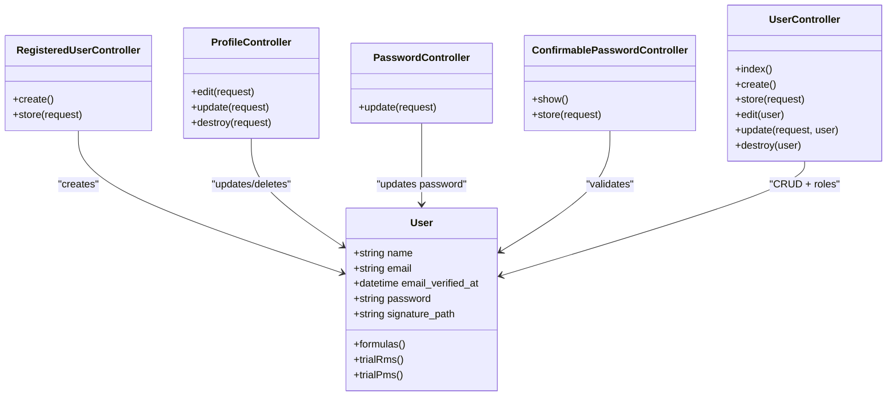
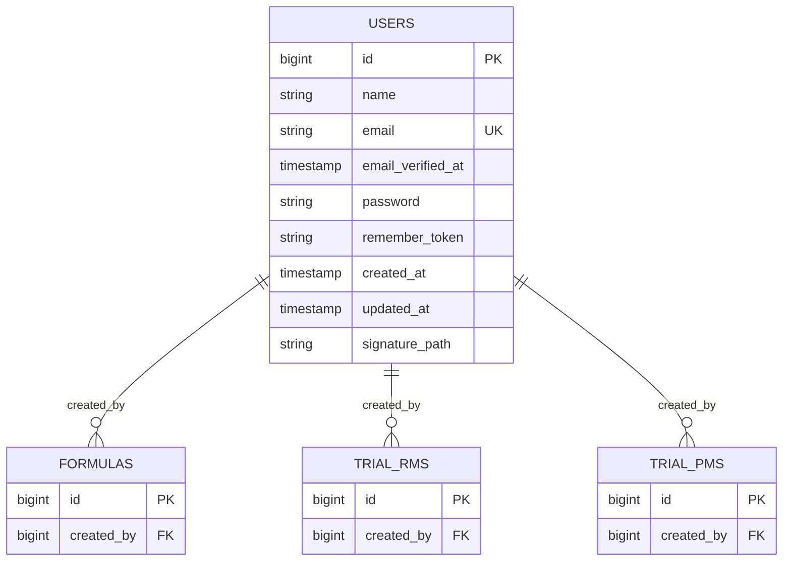
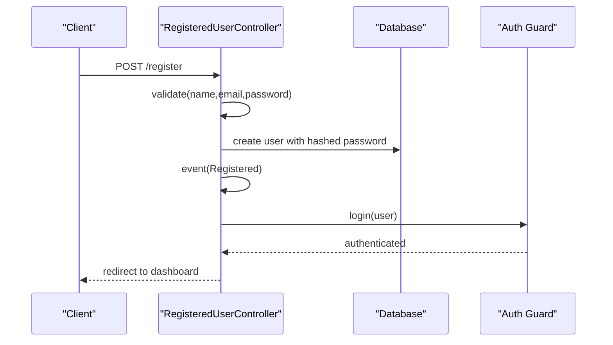
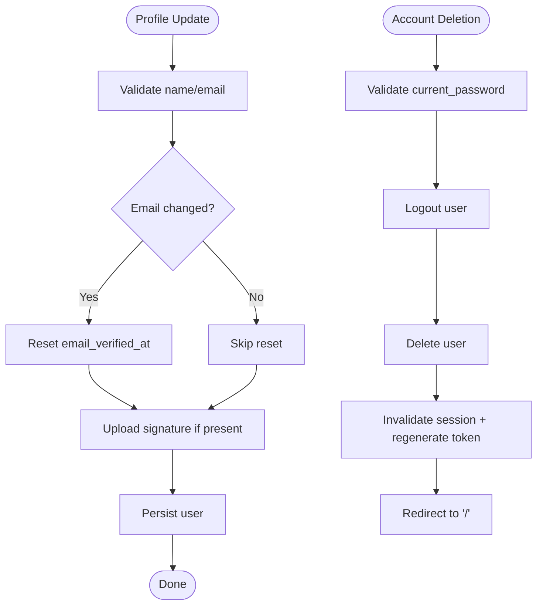
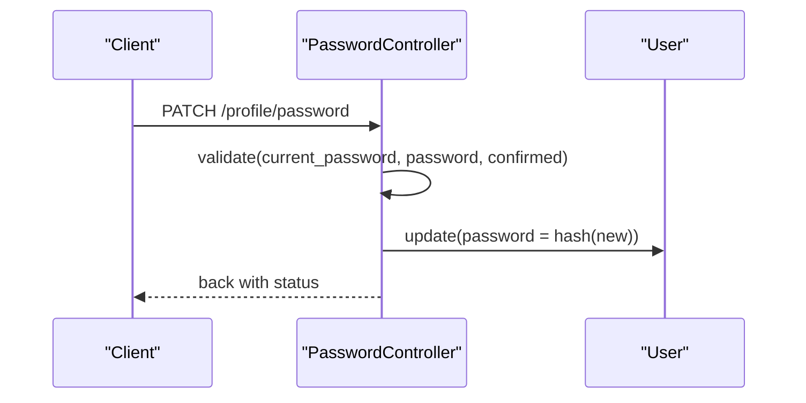
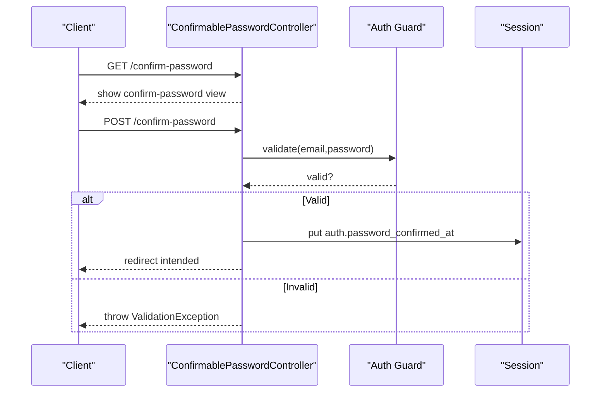
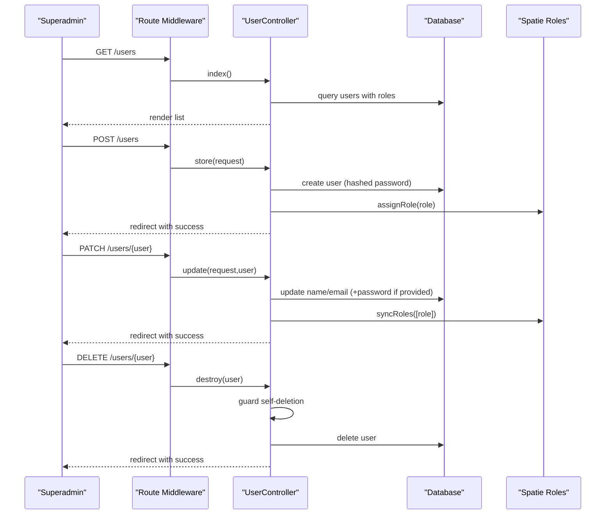
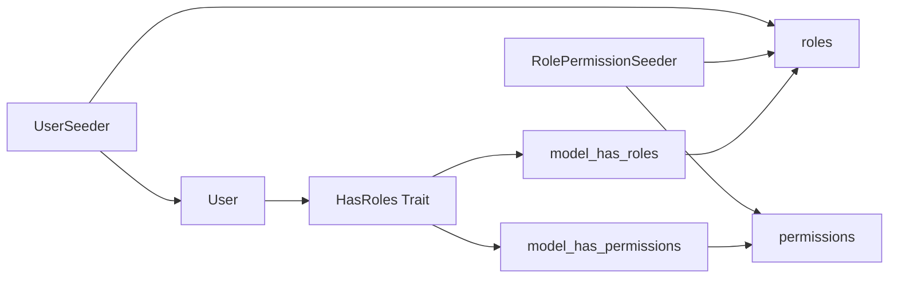
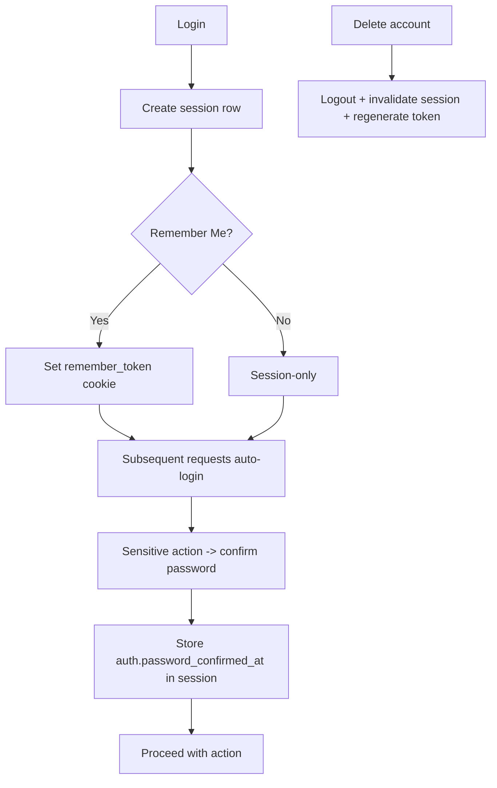
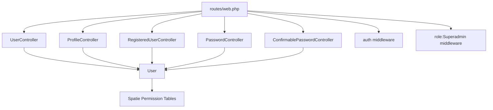

# User Management

<cite>
**Referenced Files in This Document**
- [User.php](file://app/Models/User.php)
- [UserController.php](file://app/Http/Controllers/UserController.php)
- [ProfileController.php](file://app/Http/Controllers/ProfileController.php)
- [PasswordController.php](file://app/Http/Controllers/Auth/PasswordController.php)
- [RegisteredUserController.php](file://app/Http/Controllers/Auth/RegisteredUserController.php)
- [ConfirmablePasswordController.php](file://app/Http/Controllers/Auth/ConfirmablePasswordController.php)
- [ProfileUpdateRequest.php](file://app/Http/Requests/ProfileUpdateRequest.php)
- [web.php](file://routes/web.php)
- [0001_01_01_000000_create_users_table.php](file://database/migrations/0001_01_01_000000_create_users_table.php)
- [2026_07_01_092410_create_permission_tables.php](file://database/migrations/2026_07_01_092410_create_permission_tables.php)
- [permission.php](file://config/permission.php)
- [activitylog.php](file://config/activitylog.php)
- [UserFactory.php](file://database/factories/UserFactory.php)
- [UserSeeder.php](file://database/seeders/UserSeeder.php)
- [RolePermissionSeeder.php](file://database/seeders/RolePermissionSeeder.php)
</cite>

## Table of Contents
1. [Introduction](#introduction)
2. [Project Structure](#project-structure)
3. [Core Components](#core-components)
4. [Architecture Overview](#architecture-overview)
5. [Detailed Component Analysis](#detailed-component-analysis)
6. [Dependency Analysis](#dependency-analysis)
7. [Performance Considerations](#performance-considerations)
8. [Troubleshooting Guide](#troubleshooting-guide)
9. [Conclusion](#conclusion)
10. [Appendices](#appendices)

## Introduction
This document explains the user management system implemented in the application. It covers the User model with Spatie Permission traits, registration and profile management, password hashing and security measures, relationships to formulas and trials, CRUD operations for users, profile updates, password changes, account deletion, session handling, remember me functionality, and integration points for audit logging. Practical examples are provided through code snippet paths to guide implementation.

## Project Structure
The user management system spans models, controllers, requests, routes, migrations, configuration, factories, and seeders:
- Model: User with roles and relationships
- Controllers: Registration, profile, password, and admin user management
- Requests: Profile update validation
- Routes: Authenticated routes and role-gated endpoints
- Migrations: Users table, sessions, permissions tables
- Configuration: Permissions and activity log settings
- Factories and Seeders: Test data and initial roles/users

```mermaid
graph TB
subgraph "Auth & Profiles"
REG["RegisteredUserController"]
PASS["PasswordController"]
CONFIRM["ConfirmablePasswordController"]
PROF["ProfileController"]
end
subgraph "Admin"
UCTRL["UserController"]
end
subgraph "Model"
USER["User (HasRoles)"]
end
subgraph "DB"
USERS["users"]
SESSIONS["sessions"]
ROLES["roles"]
PERMS["permissions"]
MODEL_ROLES["model_has_roles"]
MODEL_PERMS["model_has_permissions"]
end
subgraph "Config"
PERMCFG["permission.php"]
ACTCFG["activitylog.php"]
end
REG --> USER
PASS --> USER
CONFIRM --> USER
PROF --> USER
UCTRL --> USER
USER --> USERS
USER --> ROLES
USER --> PERMS
USER --> MODEL_ROLES
USER --> MODEL_PERMS
REG -.-> ROUTES["routes/web.php"]
PASS -.-> ROUTES
CONFIRM -.-> ROUTES
PROF -.-> ROUTES
UCTRL -.-> ROUTES
PERMCFG -.-> USER
ACTCFG -.|optional audit| USER
```

**Diagram sources**
- [RegisteredUserController.php:1-52](file://app/Http/Controllers/Auth/RegisteredUserController.php#L1-L52)
- [PasswordController.php:1-30](file://app/Http/Controllers/Auth/PasswordController.php#L1-L30)
- [ConfirmablePasswordController.php:1-41](file://app/Http/Controllers/Auth/ConfirmablePasswordController.php#L1-L41)
- [ProfileController.php:1-72](file://app/Http/Controllers/ProfileController.php#L1-L72)
- [UserController.php:1-121](file://app/Http/Controllers/UserController.php#L1-L121)
- [User.php:1-50](file://app/Models/User.php#L1-L50)
- [web.php:1-94](file://routes/web.php#L1-L94)
- [0001_01_01_000000_create_users_table.php:1-50](file://database/migrations/0001_01_01_000000_create_users_table.php#L1-L50)
- [2026_07_01_092410_create_permission_tables.php:1-138](file://database/migrations/2026_07_01_092410_create_permission_tables.php#L1-L138)
- [permission.php:1-220](file://config/permission.php#L1-L220)
- [activitylog.php:1-53](file://config/activitylog.php#L1-L53)

**Section sources**
- [web.php:1-94](file://routes/web.php#L1-L94)
- [0001_01_01_000000_create_users_table.php:1-50](file://database/migrations/0001_01_01_000000_create_users_table.php#L1-L50)
- [2026_07_01_092410_create_permission_tables.php:1-138](file://database/migrations/2026_07_01_092410_create_permission_tables.php#L1-L138)
- [permission.php:1-220](file://config/permission.php#L1-L220)
- [activitylog.php:1-53](file://config/activitylog.php#L1-L53)

## Core Components
- User model: Uses HasRoles trait, casts password as hashed, exposes relationships to formulas and trials, and includes a signature path attribute.
- Registration controller: Validates input, hashes password, creates user, fires Registered event, logs in user, redirects to dashboard.
- Profile controller: Updates name/email, resets email verification on change, handles signature upload, supports account deletion with current password confirmation.
- Password controller: Enforces current_password check and new password rules, updates hashed password.
- Confirmable password controller: Re-validates password for sensitive actions and stores confirmation timestamp in session.
- Admin user controller: Role-gated (Superadmin), full CRUD for users including role assignment/syncing and safe deletion guard.
- Validation request: Profile update rules with unique email ignoring current user.
- Routes: Grouped under auth middleware; resource routes for users protected by Superadmin role.

**Section sources**
- [User.php:1-50](file://app/Models/User.php#L1-L50)
- [RegisteredUserController.php:1-52](file://app/Http/Controllers/Auth/RegisteredUserController.php#L1-L52)
- [ProfileController.php:1-72](file://app/Http/Controllers/ProfileController.php#L1-L72)
- [PasswordController.php:1-30](file://app/Http/Controllers/Auth/PasswordController.php#L1-L30)
- [ConfirmablePasswordController.php:1-41](file://app/Http/Controllers/Auth/ConfirmablePasswordController.php#L1-L41)
- [UserController.php:1-121](file://app/Http/Controllers/UserController.php#L1-L121)
- [ProfileUpdateRequest.php:1-32](file://app/Http/Requests/ProfileUpdateRequest.php#L1-L32)
- [web.php:1-94](file://routes/web.php#L1-L94)

## Architecture Overview
The system follows standard Laravel patterns:
- Controllers handle HTTP requests and orchestrate business logic.
- Eloquent model encapsulates attributes, casts, and relationships.
- Spatie Permission provides RBAC via roles and permissions.
- Database schema includes users, sessions, and permission tables.
- Optional audit logging is configured via activitylog package.



**Diagram sources**
- [User.php:1-50](file://app/Models/User.php#L1-L50)
- [RegisteredUserController.php:1-52](file://app/Http/Controllers/Auth/RegisteredUserController.php#L1-L52)
- [ProfileController.php:1-72](file://app/Http/Controllers/ProfileController.php#L1-L72)
- [PasswordController.php:1-30](file://app/Http/Controllers/Auth/PasswordController.php#L1-L30)
- [ConfirmablePasswordController.php:1-41](file://app/Http/Controllers/Auth/ConfirmablePasswordController.php#L1-L41)
- [UserController.php:1-121](file://app/Http/Controllers/UserController.php#L1-L121)

## Detailed Component Analysis

### User Model and Relationships
- Traits and notifications: HasFactory, Notifiable, HasRoles.
- Fillable and hidden attributes: name, email, password, signature_path fillable; password and remember_token hidden.
- Casts: email_verified_at as datetime, password as hashed.
- Relationships:
  - formulas(): one-to-many via created_by
  - trialRms(): one-to-many via created_by
  - trialPms(): one-to-many via created_by



**Diagram sources**
- [User.php:1-50](file://app/Models/User.php#L1-L50)
- [0001_01_01_000000_create_users_table.php:1-50](file://database/migrations/0001_01_01_000000_create_users_table.php#L1-L50)

**Section sources**
- [User.php:1-50](file://app/Models/User.php#L1-L50)

### Registration Flow
- Validates name, email uniqueness, and password confirmation using default password rules.
- Creates user with hashed password and sets email verified at now.
- Fires Registered event and logs in the user, then redirects to dashboard.



**Diagram sources**
- [RegisteredUserController.php:1-52](file://app/Http/Controllers/Auth/RegisteredUserController.php#L1-L52)
- [web.php:1-94](file://routes/web.php#L1-L94)

**Section sources**
- [RegisteredUserController.php:1-52](file://app/Http/Controllers/Auth/RegisteredUserController.php#L1-L52)

### Profile Update and Account Deletion
- Edit: Returns current user profile view.
- Update: Fills validated attributes, resets email_verified_at if email changed, uploads signature file to storage, persists changes.
- Destroy: Requires current password, logs out, deletes user, invalidates session, regenerates CSRF token, redirects home.



**Diagram sources**
- [ProfileController.php:1-72](file://app/Http/Controllers/ProfileController.php#L1-L72)
- [ProfileUpdateRequest.php:1-32](file://app/Http/Requests/ProfileUpdateRequest.php#L1-L32)

**Section sources**
- [ProfileController.php:1-72](file://app/Http/Controllers/ProfileController.php#L1-L72)
- [ProfileUpdateRequest.php:1-32](file://app/Http/Requests/ProfileUpdateRequest.php#L1-L32)

### Password Change
- Validates current_password and new password with defaults and confirmation.
- Updates user password with Hash::make.



**Diagram sources**
- [PasswordController.php:1-30](file://app/Http/Controllers/Auth/PasswordController.php#L1-L30)

**Section sources**
- [PasswordController.php:1-30](file://app/Http/Controllers/Auth/PasswordController.php#L1-L30)

### Confirm Password for Sensitive Actions
- Displays confirm-password view.
- Validates current password against web guard; on success, stores confirmation timestamp in session and redirects intended route.



**Diagram sources**
- [ConfirmablePasswordController.php:1-41](file://app/Http/Controllers/Auth/ConfirmablePasswordController.php#L1-L41)

**Section sources**
- [ConfirmablePasswordController.php:1-41](file://app/Http/Controllers/Auth/ConfirmablePasswordController.php#L1-L41)

### Admin User Management (CRUD)
- Index: Lists users with roles, paginated; requires Superadmin.
- Create: Loads roles; requires Superadmin.
- Store: Validates inputs, creates user with hashed password, assigns role.
- Edit: Loads roles and user; requires Superadmin.
- Update: Validates inputs, updates name/email, optionally updates password, syncs single role.
- Destroy: Prevents self-deletion, deletes user, shows success message.



**Diagram sources**
- [UserController.php:1-121](file://app/Http/Controllers/UserController.php#L1-L121)
- [web.php:1-94](file://routes/web.php#L1-L94)

**Section sources**
- [UserController.php:1-121](file://app/Http/Controllers/UserController.php#L1-L121)
- [web.php:1-94](file://routes/web.php#L1-L94)

### Roles and Permissions Integration
- User model uses HasRoles trait.
- Permission tables created via migration; config defines models and table names.
- Seeders create roles and permissions and assign them to users.



**Diagram sources**
- [User.php:1-50](file://app/Models/User.php#L1-L50)
- [2026_07_01_092410_create_permission_tables.php:1-138](file://database/migrations/2026_07_01_092410_create_permission_tables.php#L1-L138)
- [permission.php:1-220](file://config/permission.php#L1-L220)
- [RolePermissionSeeder.php:1-112](file://database/seeders/RolePermissionSeeder.php#L1-L112)
- [UserSeeder.php:1-74](file://database/seeders/UserSeeder.php#L1-L74)

**Section sources**
- [User.php:1-50](file://app/Models/User.php#L1-L50)
- [2026_07_01_092410_create_permission_tables.php:1-138](file://database/migrations/2026_07_01_092410_create_permission_tables.php#L1-L138)
- [permission.php:1-220](file://config/permission.php#L1-L220)
- [RolePermissionSeeder.php:1-112](file://database/seeders/RolePermissionSeeder.php#L1-L112)
- [UserSeeder.php:1-74](file://database/seeders/UserSeeder.php#L1-L74)

### Session Handling and Remember Me
- Sessions table created with user_id foreign key and last_activity index.
- Confirmable password flow stores confirmation timestamp in session.
- Account deletion invalidates session and regenerates CSRF token.



**Diagram sources**
- [0001_01_01_000000_create_users_table.php:1-50](file://database/migrations/0001_01_01_000000_create_users_table.php#L1-L50)
- [ConfirmablePasswordController.php:1-41](file://app/Http/Controllers/Auth/ConfirmablePasswordController.php#L1-L41)
- [ProfileController.php:1-72](file://app/Http/Controllers/ProfileController.php#L1-L72)

**Section sources**
- [0001_01_01_000000_create_users_table.php:1-50](file://database/migrations/0001_01_01_000000_create_users_table.php#L1-L50)
- [ConfirmablePasswordController.php:1-41](file://app/Http/Controllers/Auth/ConfirmablePasswordController.php#L1-L41)
- [ProfileController.php:1-72](file://app/Http/Controllers/ProfileController.php#L1-L72)

### Audit Logging Integration Points
- Activity log configuration exists and can be enabled/disabled via config.
- To integrate user-related audits, add the Spatie ActivityLog trait to the User model and configure the default_auth_driver if needed.
- Ensure migrations for activity_log table exist and are run.

Practical steps (paths only):
- Add activity log trait to User model: [User.php:1-50](file://app/Models/User.php#L1-L50)
- Configure default auth driver in activity log config: [activitylog.php:1-53](file://config/activitylog.php#L1-L53)
- Ensure activity log migration exists and is applied: [2026_07_01_092416_create_activity_log_table.php](file://database/migrations/2026_07_01_092416_create_activity_log_table.php)

**Section sources**
- [activitylog.php:1-53](file://config/activitylog.php#L1-L53)
- [User.php:1-50](file://app/Models/User.php#L1-L50)

## Dependency Analysis
- Controllers depend on User model and Spatie Permission models for role checks and assignments.
- Routes enforce authentication, email verification, and role-based access.
- Migrations define core tables for users, sessions, and permissions.
- Config files control behavior for permissions caching and activity logging.



**Diagram sources**
- [web.php:1-94](file://routes/web.php#L1-L94)
- [UserController.php:1-121](file://app/Http/Controllers/UserController.php#L1-L121)
- [ProfileController.php:1-72](file://app/Http/Controllers/ProfileController.php#L1-L72)
- [RegisteredUserController.php:1-52](file://app/Http/Controllers/Auth/RegisteredUserController.php#L1-L52)
- [PasswordController.php:1-30](file://app/Http/Controllers/Auth/PasswordController.php#L1-L30)
- [ConfirmablePasswordController.php:1-41](file://app/Http/Controllers/Auth/ConfirmablePasswordController.php#L1-L41)
- [User.php:1-50](file://app/Models/User.php#L1-L50)
- [2026_07_01_092410_create_permission_tables.php:1-138](file://database/migrations/2026_07_01_092410_create_permission_tables.php#L1-L138)

**Section sources**
- [web.php:1-94](file://routes/web.php#L1-L94)
- [User.php:1-50](file://app/Models/User.php#L1-L50)
- [2026_07_01_092410_create_permission_tables.php:1-138](file://database/migrations/2026_07_01_092410_create_permission_tables.php#L1-L138)

## Performance Considerations
- Use eager loading when listing users with roles to avoid N+1 queries.
- Leverage pagination for large user lists.
- Cache permissions via Spatie’s built-in cache; clear cache after seeding or role/permission changes.
- Avoid unnecessary re-hashing of passwords; only update when explicitly provided.

[No sources needed since this section provides general guidance]

## Troubleshooting Guide
- Role not found during creation/update: Ensure roles exist in database; run RolePermissionSeeder.
- Unique email errors: Verify email uniqueness rules and existing records.
- Self-deletion blocked: The system prevents deleting the current user; use another admin account.
- Signature upload issues: Check storage link and allowed MIME types.
- Session invalidation after deletion: Expected behavior; ensure client clears cookies appropriately.

**Section sources**
- [UserController.php:1-121](file://app/Http/Controllers/UserController.php#L1-L121)
- [ProfileController.php:1-72](file://app/Http/Controllers/ProfileController.php#L1-L72)
- [RolePermissionSeeder.php:1-112](file://database/seeders/RolePermissionSeeder.php#L1-L112)

## Conclusion
The user management system integrates robust authentication, role-based access control, secure password handling, and comprehensive profile management. It provides admin-level CRUD for users, enforces safety constraints, and offers optional audit logging hooks. The design leverages Laravel conventions and Spatie packages for scalability and maintainability.

[No sources needed since this section summarizes without analyzing specific files]

## Appendices

### Practical Examples (Code Snippet Paths)
- Create a user programmatically with hashed password and set email verified:
  - [RegisteredUserController.php:31-50](file://app/Http/Controllers/Auth/RegisteredUserController.php#L31-L50)
- Assign a role to a user:
  - [UserController.php:54-54](file://app/Http/Controllers/UserController.php#L54-L54)
- Sync a single role for a user:
  - [UserController.php:96-96](file://app/Http/Controllers/UserController.php#L96-L96)
- Update profile with signature upload:
  - [ProfileController.php:36-46](file://app/Http/Controllers/ProfileController.php#L36-L46)
- Change password securely:
  - [PasswordController.php:16-28](file://app/Http/Controllers/Auth/PasswordController.php#L16-L28)
- Custom validation rule example (email uniqueness ignoring current user):
  - [ProfileUpdateRequest.php:17-30](file://app/Http/Requests/ProfileUpdateRequest.php#L17-L30)
- Factory usage for testing:
  - [UserFactory.php:25-44](file://database/factories/UserFactory.php#L25-L44)
- Seed initial users and roles:
  - [UserSeeder.php:14-72](file://database/seeders/UserSeeder.php#L14-L72)
  - [RolePermissionSeeder.php:14-110](file://database/seeders/RolePermissionSeeder.php#L14-L110)

**Section sources**
- [RegisteredUserController.php:31-50](file://app/Http/Controllers/Auth/RegisteredUserController.php#L31-L50)
- [UserController.php:54-54](file://app/Http/Controllers/UserController.php#L54-L54)
- [UserController.php:96-96](file://app/Http/Controllers/UserController.php#L96-L96)
- [ProfileController.php:36-46](file://app/Http/Controllers/ProfileController.php#L36-L46)
- [PasswordController.php:16-28](file://app/Http/Controllers/Auth/PasswordController.php#L16-L28)
- [ProfileUpdateRequest.php:17-30](file://app/Http/Requests/ProfileUpdateRequest.php#L17-L30)
- [UserFactory.php:25-44](file://database/factories/UserFactory.php#L25-L44)
- [UserSeeder.php:14-72](file://database/seeders/UserSeeder.php#L14-L72)
- [RolePermissionSeeder.php:14-110](file://database/seeders/RolePermissionSeeder.php#L14-L110)