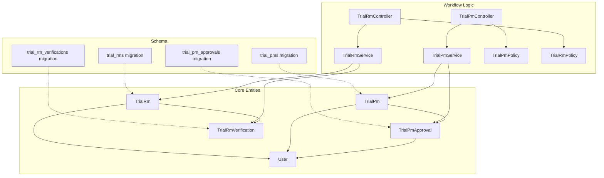
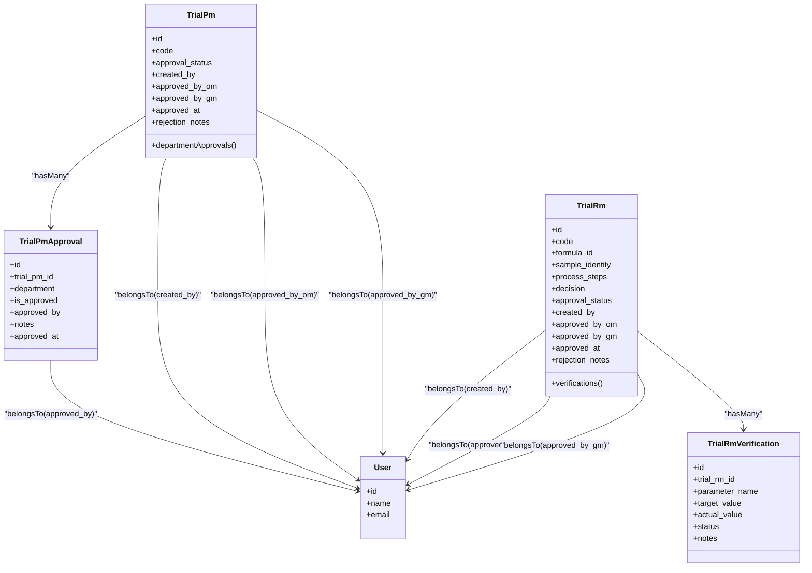
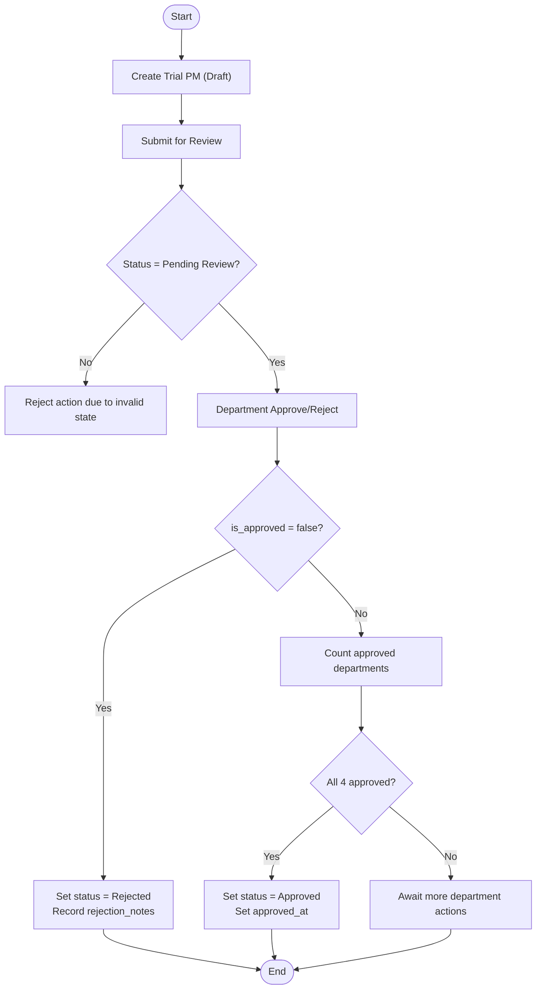
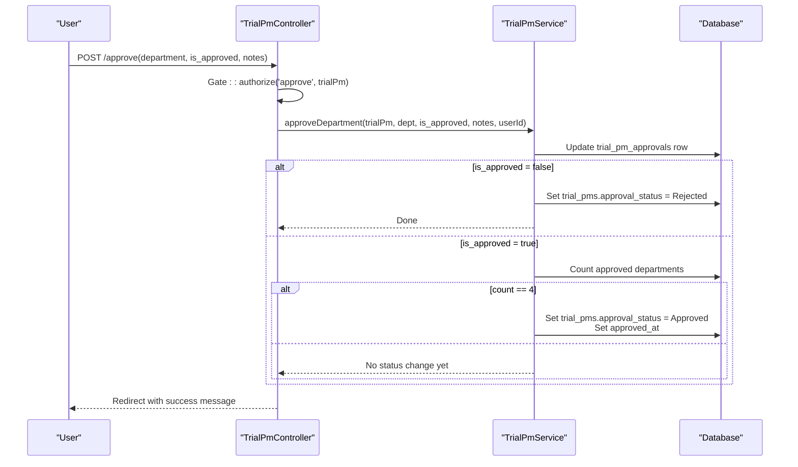
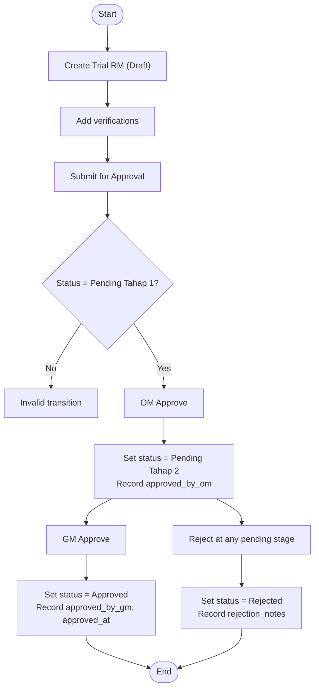
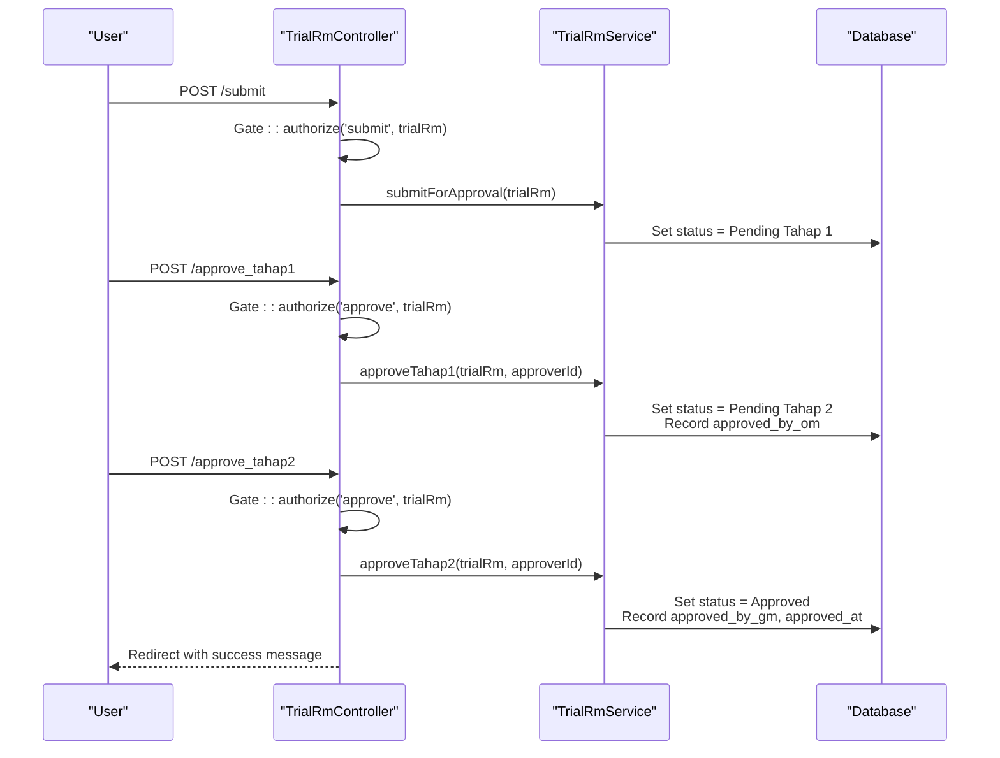
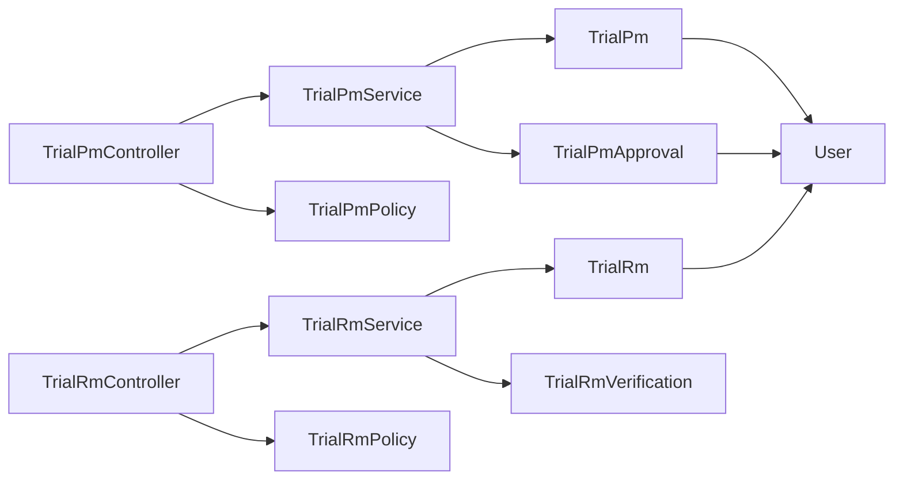

# Approval Workflow Schema

<cite>
**Referenced Files in This Document**
- [TrialPm.php](file://app/Models/TrialPm.php)
- [TrialPmApproval.php](file://app/Models/TrialPmApproval.php)
- [TrialRm.php](file://app/Models/TrialRm.php)
- [TrialRmVerification.php](file://app/Models/TrialRmVerification.php)
- [User.php](file://app/Models/User.php)
- [2026_07_01_092905_create_trial_pms_table.php](file://database/migrations/2026_07_01_092905_create_trial_pms_table.php)
- [2026_07_01_092919_create_trial_pm_approvals_table.php](file://database/migrations/2026_07_01_092919_create_trial_pm_approvals_table.php)
- [2026_07_01_092849_create_trial_rms_table.php](file://database/migrations/2026_07_01_092849_create_trial_rms_table.php)
- [2026_07_01_092857_create_trial_rm_verifications_table.php](file://database/migrations/2026_07_01_092857_create_trial_rm_verifications_table.php)
- [TrialPmController.php](file://app/Http/Controllers/TrialPmController.php)
- [TrialRmController.php](file://app/Http/Controllers/TrialRmController.php)
- [TrialPmService.php](file://app/Services/TrialPmService.php)
- [TrialRmService.php](file://app/Services/TrialRmService.php)
- [TrialPmPolicy.php](file://app/Policies/TrialPmPolicy.php)
- [TrialRmPolicy.php](file://app/Policies/TrialRmPolicy.php)
</cite>

## Table of Contents
1. Introduction
2. Project Structure
3. Core Components
4. Architecture Overview
5. Detailed Component Analysis
6. Dependency Analysis
7. Performance Considerations
8. Troubleshooting Guide
9. Conclusion

## Introduction
This document provides comprehensive data model documentation for the approval workflow entities centered on TrialPmApproval and TrialRmVerification, along with their parent trial entities (TrialPm and TrialRm). It explains:
- The multi-level approval process schema
- Field definitions for approval states, timestamps, and audit information
- Relationship patterns between trial entities and their corresponding approval records
- State machine implementation via database constraints and status tracking fields
- Query patterns for approval history retrieval and workflow progression analysis

The goal is to make the system understandable for both technical and non-technical readers while remaining grounded in the actual codebase.

## Project Structure
The approval workflow spans models, migrations, services, controllers, and policies:
- Models define entities and relationships
- Migrations define tables, constraints, and indexes
- Services implement state transitions and business rules
- Controllers orchestrate requests and delegate to services
- Policies enforce authorization based on roles and record state

**Diagram sources**
- [TrialPm.php:1-82](file://app/Models/TrialPm.php#L1-L82)
- [TrialPmApproval.php:1-50](file://app/Models/TrialPmApproval.php#L1-L50)
- [TrialRm.php:1-64](file://app/Models/TrialRm.php#L1-L64)
- [TrialRmVerification.php:1-24](file://app/Models/TrialRmVerification.php#L1-L24)
- [User.php:1-50](file://app/Models/User.php#L1-L50)
- [TrialPmService.php:1-211](file://app/Services/TrialPmService.php#L1-L211)
- [TrialRmService.php:1-202](file://app/Services/TrialRmService.php#L1-L202)
- [TrialPmController.php:1-267](file://app/Http/Controllers/TrialPmController.php#L1-L267)
- [TrialRmController.php:1-189](file://app/Http/Controllers/TrialRmController.php#L1-L189)
- [TrialPmPolicy.php:1-57](file://app/Policies/TrialPmPolicy.php#L1-L57)
- [TrialRmPolicy.php:1-64](file://app/Policies/TrialRmPolicy.php#L1-L64)
- [2026_07_01_092905_create_trial_pms_table.php:1-39](file://database/migrations/2026_07_01_092905_create_trial_pms_table.php#L1-L39)
- [2026_07_01_092919_create_trial_pm_approvals_table.php:1-37](file://database/migrations/2026_07_01_092919_create_trial_pm_approvals_table.php#L1-L37)
- [2026_07_01_092849_create_trial_rms_table.php:1-39](file://database/migrations/2026_07_01_092849_create_trial_rms_table.php#L1-L39)
- [2026_07_01_092857_create_trial_rm_verifications_table.php:1-34](file://database/migrations/2026_07_01_092857_create_trial_rm_verifications_table.php#L1-L34)

**Section sources**
- [TrialPm.php:1-82](file://app/Models/TrialPm.php#L1-L82)
- [TrialPmApproval.php:1-50](file://app/Models/TrialPmApproval.php#L1-L50)
- [TrialRm.php:1-64](file://app/Models/TrialRm.php#L1-L64)
- [TrialRmVerification.php:1-24](file://app/Models/TrialRmVerification.php#L1-L24)
- [User.php:1-50](file://app/Models/User.php#L1-L50)
- [TrialPmService.php:1-211](file://app/Services/TrialPmService.php#L1-L211)
- [TrialRmService.php:1-202](file://app/Services/TrialRmService.php#L1-L202)
- [TrialPmController.php:1-267](file://app/Http/Controllers/TrialPmController.php#L1-L267)
- [TrialRmController.php:1-189](file://app/Http/Controllers/TrialRmController.php#L1-L189)
- [TrialPmPolicy.php:1-57](file://app/Policies/TrialPmPolicy.php#L1-L57)
- [TrialRmPolicy.php:1-64](file://app/Policies/TrialRmPolicy.php#L1-L64)
- [2026_07_01_092905_create_trial_pms_table.php:1-39](file://database/migrations/2026_07_01_092905_create_trial_pms_table.php#L1-L39)
- [2026_07_01_092919_create_trial_pm_approvals_table.php:1-37](file://database/migrations/2026_07_01_092919_create_trial_pm_approvals_table.php#L1-L37)
- [2026_07_01_092849_create_trial_rms_table.php:1-39](file://database/migrations/2026_07_01_092849_create_trial_rms_table.php#L1-L39)
- [2026_07_01_092857_create_trial_rm_verifications_table.php:1-34](file://database/migrations/2026_07_01_092857_create_trial_rm_verifications_table.php#L1-L34)

## Core Components
This section summarizes the core entities and their responsibilities in the approval workflow.

- TrialPm
  - Represents a packaging material trial request.
  - Tracks overall approval_status and top-level approvals by Operational Manager and General Manager.
  - Maintains created_by, approved_by_om, approved_by_gm, approved_at, and rejection_notes.
  - Has many department approvals through TrialPmApproval.

- TrialPmApproval
  - Captures per-department approval decisions for a TrialPm.
  - Enforces one approval per department per trial via unique constraint.
  - Records approver identity and timestamp.

- TrialRm
  - Represents a raw material trial linked to an approved Formula.
  - Multi-stage approval: Pending Tahap 1 (Operational Manager), then Pending Tahap 2 (General Manager).
  - Stores decision, approval_status, and audit fields similar to TrialPm.

- TrialRmVerification
  - Stores parameter verification results for a TrialRm (e.g., color, pH, viscosity).
  - Includes target vs actual values and Pass/Fail/Warning status.

- User
  - Acts as creator and approver across trials.
  - Provides role-based access control integration used by policies.

**Section sources**
- [TrialPm.php:1-82](file://app/Models/TrialPm.php#L1-L82)
- [TrialPmApproval.php:1-50](file://app/Models/TrialPmApproval.php#L1-L50)
- [TrialRm.php:1-64](file://app/Models/TrialRm.php#L1-L64)
- [TrialRmVerification.php:1-24](file://app/Models/TrialRmVerification.php#L1-L24)
- [User.php:1-50](file://app/Models/User.php#L1-L50)

## Architecture Overview
The approval workflows are implemented using Eloquent models, service-layer logic, controller endpoints, and policy-based authorization. Database constraints enforce key invariants such as uniqueness of department approvals and referential integrity.

**Diagram sources**
- [TrialPm.php:1-82](file://app/Models/TrialPm.php#L1-L82)
- [TrialPmApproval.php:1-50](file://app/Models/TrialPmApproval.php#L1-L50)
- [TrialRm.php:1-64](file://app/Models/TrialRm.php#L1-L64)
- [TrialRmVerification.php:1-24](file://app/Models/TrialRmVerification.php#L1-L24)
- [User.php:1-50](file://app/Models/User.php#L1-L50)

## Detailed Component Analysis

### TrialPm Approval Workflow
- Purpose: Coordinate multi-department review before final approval.
- Key states: Draft → Pending Review → Approved or Rejected.
- Department approvals: RD, QC, Production, Engineering; each can approve once per trial.
- Automatic transitions:
  - Any single department rejection sets status to Rejected immediately.
  - When all four departments approve, status becomes Approved and approved_at is recorded.

**Diagram sources**
- [TrialPmService.php:154-209](file://app/Services/TrialPmService.php#L154-L209)
- [2026_07_01_092919_create_trial_pm_approvals_table.php:14-26](file://database/migrations/2026_07_01_092919_create_trial_pm_approvals_table.php#L14-L26)
- [2026_07_01_092905_create_trial_pms_table.php:14-27](file://database/migrations/2026_07_01_092905_create_trial_pms_table.php#L14-L27)

**Section sources**
- [TrialPmService.php:154-209](file://app/Services/TrialPmService.php#L154-L209)
- [TrialPmController.php:221-265](file://app/Http/Controllers/TrialPmController.php#L221-L265)
- [TrialPmPolicy.php:44-55](file://app/Policies/TrialPmPolicy.php#L44-L55)
- [2026_07_01_092919_create_trial_pm_approvals_table.php:14-26](file://database/migrations/2026_07_01_092919_create_trial_pm_approvals_table.php#L14-L26)
- [2026_07_01_092905_create_trial_pms_table.php:14-27](file://database/migrations/2026_07_01_092905_create_trial_pms_table.php#L14-L27)

#### Data Model: TrialPm and TrialPmApproval
- Fields and types:
  - trial_pms: id, code (unique), specifications (JSON/text), parameters (JSON), risk_analysis (text), approval_status (enum), created_by (FK), approved_by_om (FK), approved_by_gm (FK), approved_at (timestamp), rejection_notes (text), timestamps.
  - trial_pm_approvals: id, trial_pm_id (FK), department (enum: rd, qc, production, engineering), is_approved (boolean), approved_by (FK), notes (text), approved_at (timestamp), timestamps; unique(trial_pm_id, department).
- Relationships:
  - TrialPm hasMany TrialPmApproval.
  - TrialPm belongsTo User (creator, OM, GM).
  - TrialPmApproval belongsTo User (approver).

**Section sources**
- [TrialPm.php:13-44](file://app/Models/TrialPm.php#L13-L44)
- [TrialPmApproval.php:9-21](file://app/Models/TrialPmApproval.php#L9-L21)
- [2026_07_01_092905_create_trial_pms_table.php:14-27](file://database/migrations/2026_07_01_092905_create_trial_pms_table.php#L14-L27)
- [2026_07_01_092919_create_trial_pm_approvals_table.php:14-26](file://database/migrations/2026_07_01_092919_create_trial_pm_approvals_table.php#L14-L26)

#### Sequence: Department Approval Action

**Diagram sources**
- [TrialPmController.php:239-265](file://app/Http/Controllers/TrialPmController.php#L239-L265)
- [TrialPmService.php:168-209](file://app/Services/TrialPmService.php#L168-L209)

### TrialRm Verification and Two-Stage Approval
- Purpose: Validate raw material trials against standard parameters and progress through two managerial stages.
- Key states: Draft → Pending Tahap 1 → Pending Tahap 2 → Approved or Rejected.
- Verifications: Each TrialRm has multiple TrialRmVerification entries capturing parameter name, target value, actual value, and status (Pass/Fail/Warning).
- Transitions:
  - SubmitForApproval requires at least one verification entry.
  - ApproveTahap1 moves to Pending Tahap 2 and records approved_by_om.
  - ApproveTahap2 moves to Approved and records approved_by_gm and approved_at.
  - Reject sets status to Rejected and stores rejection_notes.

**Diagram sources**
- [TrialRmService.php:110-177](file://app/Services/TrialRmService.php#L110-L177)
- [2026_07_01_092849_create_trial_rms_table.php:14-27](file://database/migrations/2026_07_01_092849_create_trial_rms_table.php#L14-L27)
- [2026_07_01_092857_create_trial_rm_verifications_table.php:14-22](file://database/migrations/2026_07_01_092857_create_trial_rm_verifications_table.php#L14-L22)

**Section sources**
- [TrialRmService.php:110-177](file://app/Services/TrialRmService.php#L110-L177)
- [TrialRmController.php:174-187](file://app/Http/Controllers/TrialRmController.php#L174-L187)
- [TrialRmPolicy.php:51-62](file://app/Policies/TrialRmPolicy.php#L51-L62)
- [2026_07_01_092849_create_trial_rms_table.php:14-27](file://database/migrations/2026_07_01_092849_create_trial_rms_table.php#L14-L27)
- [2026_07_01_092857_create_trial_rm_verifications_table.php:14-22](file://database/migrations/2026_07_01_092857_create_trial_rm_verifications_table.php#L14-L22)

#### Data Model: TrialRm and TrialRmVerification
- Fields and types:
  - trial_rms: id, code (unique), formula_id (FK), sample_identity (string), process_steps (text), decision (enum nullable), approval_status (enum), created_by (FK), approved_by_om (FK), approved_by_gm (FK), approved_at (timestamp), rejection_notes (text), timestamps.
  - trial_rm_verifications: id, trial_rm_id (FK), parameter_name (string), target_value (string), actual_value (string), status (enum: Pass/Fail/Warning), notes (text), timestamps.
- Relationships:
  - TrialRm hasMany TrialRmVerification.
  - TrialRm belongsTo User (creator, OM, GM).

**Section sources**
- [TrialRm.php:13-29](file://app/Models/TrialRm.php#L13-L29)
- [TrialRmVerification.php:9-16](file://app/Models/TrialRmVerification.php#L9-L16)
- [2026_07_01_092849_create_trial_rms_table.php:14-27](file://database/migrations/2026_07_01_092849_create_trial_rms_table.php#L14-L27)
- [2026_07_01_092857_create_trial_rm_verifications_table.php:14-22](file://database/migrations/2026_07_01_092857_create_trial_rm_verifications_table.php#L14-L22)

#### Sequence: Two-Stage Approval

**Diagram sources**
- [TrialRmController.php:174-187](file://app/Http/Controllers/TrialRmController.php#L174-L187)
- [TrialRmService.php:110-160](file://app/Services/TrialRmService.php#L110-L160)
- [TrialRmPolicy.php:51-62](file://app/Policies/TrialRmPolicy.php#L51-L62)

## Dependency Analysis
- Model-to-model dependencies:
  - TrialPm depends on TrialPmApproval and User.
  - TrialRm depends on TrialRmVerification and User.
- Service-to-model dependencies:
  - TrialPmService orchestrates creation, submission, and department approvals.
  - TrialRmService orchestrates creation, submission, and two-stage approvals.
- Controller-to-service/policy dependencies:
  - Controllers authorize via policies and delegate to services.
- Migration-to-model alignment:
  - Enum constraints and foreign keys ensure referential integrity and valid states.

**Diagram sources**
- [TrialPmController.php:1-267](file://app/Http/Controllers/TrialPmController.php#L1-L267)
- [TrialRmController.php:1-189](file://app/Http/Controllers/TrialRmController.php#L1-L189)
- [TrialPmService.php:1-211](file://app/Services/TrialPmService.php#L1-L211)
- [TrialRmService.php:1-202](file://app/Services/TrialRmService.php#L1-L202)
- [TrialPmPolicy.php:1-57](file://app/Policies/TrialPmPolicy.php#L1-L57)
- [TrialRmPolicy.php:1-64](file://app/Policies/TrialRmPolicy.php#L1-L64)

**Section sources**
- [TrialPmController.php:1-267](file://app/Http/Controllers/TrialPmController.php#L1-L267)
- [TrialRmController.php:1-189](file://app/Http/Controllers/TrialRmController.php#L1-L189)
- [TrialPmService.php:1-211](file://app/Services/TrialPmService.php#L1-L211)
- [TrialRmService.php:1-202](file://app/Services/TrialRmService.php#L1-L202)
- [TrialPmPolicy.php:1-57](file://app/Policies/TrialPmPolicy.php#L1-L57)
- [TrialRmPolicy.php:1-64](file://app/Policies/TrialRmPolicy.php#L1-L64)

## Performance Considerations
- Use eager loading for related data when listing or displaying trials to avoid N+1 queries:
  - Load creator, approvers, and department approvals together.
- Indexing recommendations:
  - Foreign keys (trial_pm_id, trial_rm_id, created_by, approved_by_om, approved_by_gm) should be indexed by default via foreignId constraints.
  - Consider additional indexes on approval_status and code for frequent filtering/search.
- Avoid heavy computations in hot paths:
  - Counting approved departments can be optimized with a dedicated query or cached attribute if needed.

[No sources needed since this section provides general guidance]

## Troubleshooting Guide
Common issues and resolutions:
- Invalid state transitions:
  - Ensure the current approval_status matches expected state before calling service methods.
  - Check policy gates to confirm user permissions for the requested action.
- Missing required data:
  - For TrialRm submission, verify that at least one verification record exists.
  - For TrialPm department approval, ensure the department exists and has not already been approved/rejected.
- Unique constraint violations:
  - Prevent duplicate department approvals by checking existing records before creating new ones.
- Auditability:
  - Inspect activity logs and timestamps (approved_at, created_at, updated_at) to trace changes.

**Section sources**
- [TrialPmService.php:154-209](file://app/Services/TrialPmService.php#L154-L209)
- [TrialRmService.php:110-177](file://app/Services/TrialRmService.php#L110-L177)
- [2026_07_01_092919_create_trial_pm_approvals_table.php:24-26](file://database/migrations/2026_07_01_092919_create_trial_pm_approvals_table.php#L24-L26)

## Conclusion
The approval workflow schema integrates robust state management, clear relationship patterns, and strong database constraints to ensure data integrity and auditability. TrialPm uses a parallel multi-department approval model with automatic finalization upon full approval or immediate rejection upon any denial. TrialRm follows a sequential two-stage managerial approval process supported by detailed parameter verifications. Together, these designs provide a scalable foundation for managing complex R&D trial workflows.

[No sources needed since this section summarizes without analyzing specific files]