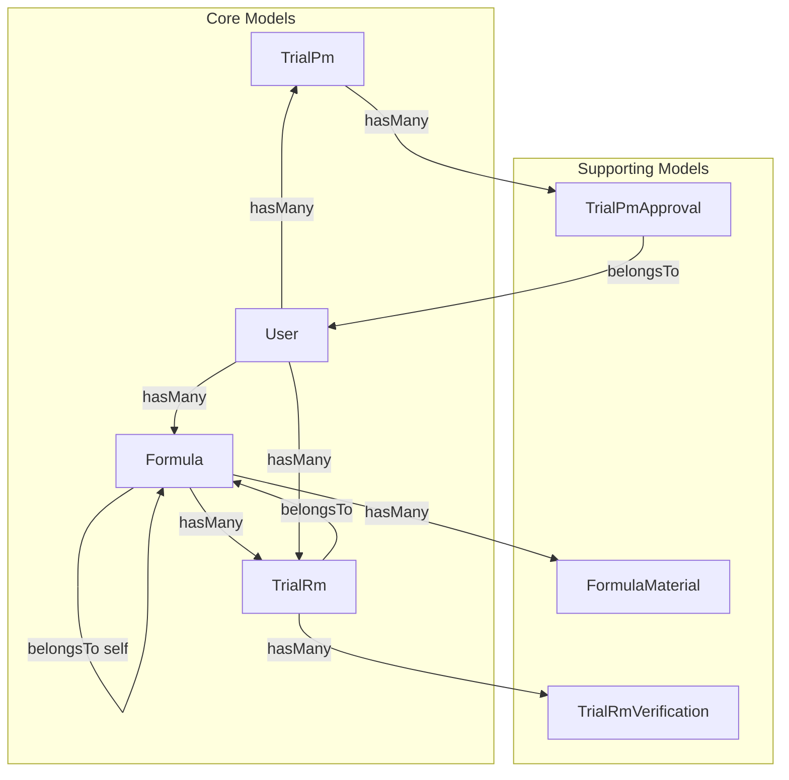
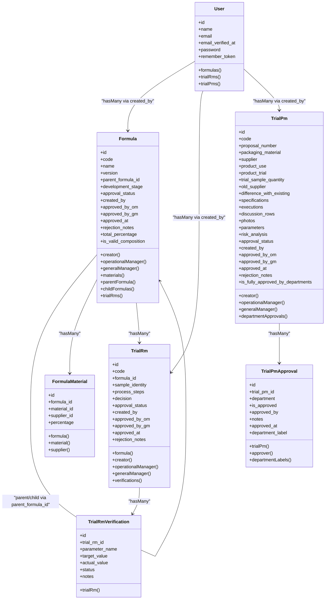

# Core Business Entities

<cite>
**Referenced Files in This Document**
- [Formula.php](file://app/Models/Formula.php)
- [TrialRm.php](file://app/Models/TrialRm.php)
- [TrialPm.php](file://app/Models/TrialPm.php)
- [User.php](file://app/Models/User.php)
- [FormulaMaterial.php](file://app/Models/FormulaMaterial.php)
- [TrialRmVerification.php](file://app/Models/TrialRmVerification.php)
- [TrialPmApproval.php](file://app/Models/TrialPmApproval.php)
- [2026_07_01_092832_create_formulas_table.php](file://database/migrations/2026_07_01_092832_create_formulas_table.php)
- [2026_07_01_092840_create_formula_materials_table.php](file://database/migrations/2026_07_01_092840_create_formula_materials_table.php)
- [2026_07_01_092849_create_trial_rms_table.php](file://database/migrations/2026_07_01_092849_create_trial_rms_table.php)
- [2026_07_01_092857_create_trial_rm_verifications_table.php](file://database/migrations/2026_07_01_092857_create_trial_rm_verifications_table.php)
- [2026_07_01_092905_create_trial_pms_table.php](file://database/migrations/2026_07_01_092905_create_trial_pms_table.php)
- [2026_07_01_092919_create_trial_pm_approvals_table.php](file://database/migrations/2026_07_01_092919_create_trial_pm_approvals_table.php)
- [2026_07_02_042035_update_trial_pms_table_for_new_specification_and_executions.php](file://database/migrations/2026_07_02_042035_update_trial_pms_table_for_new_specification_and_executions.php)
- [0001_01_01_000000_create_users_table.php](file://database/migrations/0001_01_01_000000_create_users_table.php)
</cite>

## Table of Contents
1. Introduction
2. Project Structure
3. Core Components
4. Architecture Overview
5. Detailed Component Analysis
6. Dependency Analysis
7. Performance Considerations
8. Troubleshooting Guide
9. Conclusion

## Introduction
This document provides comprehensive data model documentation for the core business entities: Formula, TrialRm, TrialPm, and User. It details entity relationships, field definitions, data types, Eloquent ORM patterns, primary and foreign keys, validation rules, and business constraints. It also explains parent-child versioning for formulas and approval workflows across trials, with sample data structures, relationship queries, and performance considerations for complex joins.

## Project Structure
The core domain is implemented using Laravel Eloquent models and database migrations. The main entities are:
- Formula: Represents a product formula with versioning and approvals.
- TrialRm: Raw material trial linked to a Formula.
- TrialPm: Packaging material trial with multi-department approvals.
- User: System user who creates and approves records.



**Diagram sources**
- [Formula.php](file://app/Models/Formula.php)
- [TrialRm.php](file://app/Models/TrialRm.php)
- [TrialPm.php](file://app/Models/TrialPm.php)
- [User.php](file://app/Models/User.php)
- [FormulaMaterial.php](file://app/Models/FormulaMaterial.php)
- [TrialRmVerification.php](file://app/Models/TrialRmVerification.php)
- [TrialPmApproval.php](file://app/Models/TrialPmApproval.php)

**Section sources**
- [Formula.php](file://app/Models/Formula.php)
- [TrialRm.php](file://app/Models/TrialRm.php)
- [TrialPm.php](file://app/Models/TrialPm.php)
- [User.php](file://app/Models/User.php)

## Core Components
This section summarizes each core entity’s fields, types, keys, and key behaviors as defined by migrations and models.

- User
  - Primary key: id (auto-increment integer)
  - Fields: name (string), email (unique string), email_verified_at (timestamp nullable), password (hashed), remember_token (string nullable), timestamps
  - Relationships: hasMany Formulas, TrialRms, TrialPms via created_by
  - Notes: Uses HasRoles trait; signature_path added via migration

- Formula
  - Primary key: id
  - Fields: code (unique string), name (string), version (integer default 1), parent_formula_id (nullable FK to formulas), development_stage (enum: Draf, Pra-Trial, Optimalisasi, Final), approval_status (enum: Draft, Pending Tahap 1, Pending Tahap 2, Approved, Rejected), created_by (FK users), approved_by_om (nullable FK users), approved_by_gm (nullable FK users), approved_at (timestamp nullable), rejection_notes (text nullable), timestamps
  - Relationships: belongsTo User (creator, OM, GM), hasMany FormulaMaterial, belongsTo Formula (parent), hasMany Formula (children), hasMany TrialRm
  - Helpers: total_percentage computed from materials sum(percentage); is_valid_composition true when total equals 100

- TrialRm
  - Primary key: id
  - Fields: code (unique string), formula_id (FK formulas), sample_identity (string), process_steps (text), decision (enum: Lulus, Reformulasi nullable), approval_status (enum: Draft, Pending Tahap 1, Pending Tahap 2, Approved, Rejected), created_by (FK users), approved_by_om (nullable FK users), approved_by_gm (nullable FK users), approved_at (timestamp nullable), rejection_notes (text nullable), timestamps
  - Relationships: belongsTo Formula, belongsTo User (creator, OM, GM), hasMany TrialRmVerification

- TrialPm
  - Primary key: id
  - Fields: code (unique string), proposal_number (string nullable), packaging_material (string), supplier (string default ''), product_use (string default ''), product_trial (string default ''), trial_sample_quantity (string default ''), old_supplier (string nullable), difference_with_existing (text nullable), specifications (json array), executions (json array), discussion_rows (json array), photos (json array), parameters (json array), risk_analysis (text nullable), approval_status (enum: Draft, Pending Review, Approved, Rejected), created_by (FK users), approved_by_om (nullable FK users), approved_by_gm (nullable FK users), approved_at (timestamp nullable), rejection_notes (text nullable), timestamps
  - Relationships: belongsTo User (creator, OM, GM), hasMany TrialPmApproval
  - Helper: is_fully_approved_by_departments true when all four departments have approved

- Supporting Models
  - FormulaMaterial: formula_id (FK formulas), material_id (FK materials), supplier_id (FK suppliers), percentage (decimal 5,2)
  - TrialRmVerification: trial_rm_id (FK trial_rms), parameter_name (string), target_value (string), actual_value (string), status (enum: Pass, Fail, Warning), notes (text nullable)
  - TrialPmApproval: trial_pm_id (FK trial_pms), department (enum: rd, qc, production, engineering), is_approved (boolean default false), approved_by (nullable FK users), notes (text nullable), approved_at (timestamp nullable), unique constraint on (trial_pm_id, department)

**Section sources**
- [0001_01_01_000000_create_users_table.php](file://database/migrations/0001_01_01_000000_create_users_table.php)
- [2026_07_01_092832_create_formulas_table.php](file://database/migrations/2026_07_01_092832_create_formulas_table.php)
- [2026_07_01_092840_create_formula_materials_table.php](file://database/migrations/2026_07_01_092840_create_formula_materials_table.php)
- [2026_07_01_092849_create_trial_rms_table.php](file://database/migrations/2026_07_01_092849_create_trial_rms_table.php)
- [2026_07_01_092857_create_trial_rm_verifications_table.php](file://database/migrations/2026_07_01_092857_create_trial_rm_verifications_table.php)
- [2026_07_01_092905_create_trial_pms_table.php](file://database/migrations/2026_07_01_092905_create_trial_pms_table.php)
- [2026_07_01_092919_create_trial_pm_approvals_table.php](file://database/migrations/2026_07_01_092919_create_trial_pm_approvals_table.php)
- [2026_07_02_042035_update_trial_pms_table_for_new_specification_and_executions.php](file://database/migrations/2026_07_02_042035_update_trial_pms_table_for_new_specification_and_executions.php)
- [Formula.php](file://app/Models/Formula.php)
- [TrialRm.php](file://app/Models/TrialRm.php)
- [TrialPm.php](file://app/Models/TrialPm.php)
- [User.php](file://app/Models/User.php)
- [FormulaMaterial.php](file://app/Models/FormulaMaterial.php)
- [TrialRmVerification.php](file://app/Models/TrialRmVerification.php)
- [TrialPmApproval.php](file://app/Models/TrialPmApproval.php)

## Architecture Overview
The data architecture centers around Formula as the root of R&D artifacts, with child Trials for raw materials (TrialRm) and packaging materials (TrialPm). Users create and approve records. Approval workflows differ between TrialRm (two-stage) and TrialPm (multi-department).

```mermaid
erDiagram
USERS {
bigint id PK
string name
string email UK
timestamp email_verified_at
string password
string remember_token
timestamp created_at
timestamp updated_at
}
FORMULAS {
bigint id PK
string code UK
string name
int version
bigint parent_formula_id FK
enum development_stage
enum approval_status
bigint created_by FK
bigint approved_by_om FK
bigint approved_by_gm FK
timestamp approved_at
text rejection_notes
timestamp created_at
timestamp updated_at
}
TRIAL_RMS {
bigint id PK
string code UK
bigint formula_id FK
string sample_identity
text process_steps
enum decision
enum approval_status
bigint created_by FK
bigint approved_by_om FK
bigint approved_by_gm FK
timestamp approved_at
text rejection_notes
timestamp created_at
timestamp updated_at
}
TRIAL_RM_VERIFICATIONS {
bigint id PK
bigint trial_rm_id FK
string parameter_name
string target_value
string actual_value
enum status
text notes
timestamp created_at
timestamp updated_at
}
TRIAL_PMS {
bigint id PK
string code UK
string proposal_number
string packaging_material
json specifications
json executions
json discussion_rows
json photos
json parameters
text risk_analysis
enum approval_status
bigint created_by FK
bigint approved_by_om FK
bigint approved_by_gm FK
timestamp approved_at
text rejection_notes
timestamp created_at
timestamp updated_at
}
TRIAL_PM_APPROVALS {
bigint id PK
bigint trial_pm_id FK
enum department
boolean is_approved
bigint approved_by FK
text notes
timestamp approved_at
timestamp created_at
timestamp updated_at
unique idx_trial_dept(trial_pm_id, department)
}
FORMULA_MATERIALS {
bigint id PK
bigint formula_id FK
bigint material_id FK
bigint supplier_id FK
decimal percentage
timestamp created_at
timestamp updated_at
}
USERS ||--o{ FORMULAS : "created_by"
USERS ||--o{ TRIAL_RMS : "created_by"
USERS ||--o{ TRIAL_PMS : "created_by"
FORMULAS ||--o{ TRIAL_RMS : "formula_id"
FORMULAS ||--o{ FORMULA_MATERIALS : "formula_id"
FORMULAS ||--o{ FORMULAS : "parent_formula_id"
TRIAL_RMS ||--o{ TRIAL_RM_VERIFICATIONS : "trial_rm_id"
TRIAL_PMS ||--o{ TRIAL_PM_APPROVALS : "trial_pm_id"
```

**Diagram sources**
- [0001_01_01_000000_create_users_table.php](file://database/migrations/0001_01_01_000000_create_users_table.php)
- [2026_07_01_092832_create_formulas_table.php](file://database/migrations/2026_07_01_092832_create_formulas_table.php)
- [2026_07_01_092840_create_formula_materials_table.php](file://database/migrations/2026_07_01_092840_create_formula_materials_table.php)
- [2026_07_01_092849_create_trial_rms_table.php](file://database/migrations/2026_07_01_092849_create_trial_rms_table.php)
- [2026_07_01_092857_create_trial_rm_verifications_table.php](file://database/migrations/2026_07_01_092857_create_trial_rm_verifications_table.php)
- [2026_07_01_092905_create_trial_pms_table.php](file://database/migrations/2026_07_01_092905_create_trial_pms_table.php)
- [2026_07_01_092919_create_trial_pm_approvals_table.php](file://database/migrations/2026_07_01_092919_create_trial_pm_approvals_table.php)
- [2026_07_02_042035_update_trial_pms_table_for_new_specification_and_executions.php](file://database/migrations/2026_07_02_042035_update_trial_pms_table_for_new_specification_and_executions.php)

## Detailed Component Analysis

### Formula Model
- Purpose: Central artifact representing a product formula with versioning and two-stage approvals.
- Key fields:
  - code: unique identifier
  - name: human-readable title
  - version: integer version counter
  - parent_formula_id: self-referencing FK for reformulation lineage
  - development_stage: enum controlling lifecycle
  - approval_status: enum for workflow state
  - created_by, approved_by_om, approved_by_gm: user references
  - approved_at, rejection_notes: audit/approval metadata
- Relationships:
  - creator(): belongsTo User via created_by
  - operationalManager(), generalManager(): belongsTo User via approval fields
  - materials(): hasMany FormulaMaterial
  - parentFormula(): belongsTo Formula (self)
  - childFormulas(): hasMany Formula (self)
  - trialRms(): hasMany TrialRm
- Computed attributes:
  - total_percentage: sum of related FormulaMaterial.percentage
  - is_valid_composition: true if total_percentage equals 100
- Validation and constraints:
  - code must be unique at DB level
  - approval_status and development_stage constrained by enums
  - Foreign keys enforce referential integrity with cascade or set null policies

Sample data structure (JSON-like):
- {
  "id": 1,
  "code": "FRM-202607-001",
  "name": "Shampoo Base A",
  "version": 2,
  "parent_formula_id": null,
  "development_stage": "Optimalisasi",
  "approval_status": "Pending Tahap 1",
  "created_by": 5,
  "approved_by_om": null,
  "approved_by_gm": null,
  "approved_at": null,
  "rejection_notes": null
}

Relationship queries:
- Get latest version: Formula::where('parent_formula_id', $parentId)->latest('version')->first()
- List children: $formula->childFormulas()->get()
- Sum composition: $formula->total_percentage
- Valid composition: $formula->is_valid_composition

Performance considerations:
- Use eager loading for creator, materials, and childFormulas to avoid N+1 queries
- Indexes recommended on code, parent_formula_id, approval_status, created_by

**Section sources**
- [Formula.php](file://app/Models/Formula.php)
- [2026_07_01_092832_create_formulas_table.php](file://database/migrations/2026_07_01_092832_create_formulas_table.php)

### TrialRm Model
- Purpose: Captures raw material trials associated with a Formula, including verification results and approvals.
- Key fields:
  - code: unique identifier
  - formula_id: links to Formula
  - sample_identity, process_steps: descriptive info
  - decision: outcome (Lulus or Reformulasi)
  - approval_status: workflow state
  - created_by, approved_by_om, approved_by_gm: user references
  - approved_at, rejection_notes: audit/approval metadata
- Relationships:
  - formula(): belongsTo Formula
  - creator(), operationalManager(), generalManager(): belongsTo User
  - verifications(): hasMany TrialRmVerification
- Validation and constraints:
  - code unique
  - decision and approval_status enums
  - Foreign keys ensure linkage to Formula and Users

Sample data structure:
- {
  "id": 10,
  "code": "TRM-202607-001-A",
  "formula_id": 1,
  "sample_identity": "Batch RM-001",
  "process_steps": "Mix at 60C for 30 min",
  "decision": "Lulus",
  "approval_status": "Approved",
  "created_by": 5,
  "approved_by_om": 6,
  "approved_by_gm": 7,
  "approved_at": "2026-07-10T14:00:00Z",
  "rejection_notes": null
}

Relationship queries:
- Get verifications: $trialRm->verifications()->get()
- Approver chain: $trialRm->operationalManager, $trialRm->generalManager

Performance considerations:
- Eager load formula and verifications
- Consider indexing formula_id, approval_status

**Section sources**
- [TrialRm.php](file://app/Models/TrialRm.php)
- [2026_07_01_092849_create_trial_rms_table.php](file://database/migrations/2026_07_01_092849_create_trial_rms_table.php)
- [2026_07_01_092857_create_trial_rm_verifications_table.php](file://database/migrations/2026_07_01_092857_create_trial_rm_verifications_table.php)

### TrialPm Model
- Purpose: Captures packaging material trials with multi-department approvals and rich JSON payloads for specifications, executions, discussions, photos, and parameters.
- Key fields:
  - code: unique identifier
  - proposal_number, packaging_material, supplier, product_use, product_trial, trial_sample_quantity, old_supplier, difference_with_existing: contextual metadata
  - specifications, executions, discussion_rows, photos, parameters: JSON arrays
  - risk_analysis: free-text risk assessment
  - approval_status: workflow state
  - created_by, approved_by_om, approved_by_gm: user references
  - approved_at, rejection_notes: audit/approval metadata
- Relationships:
  - creator(), operationalManager(), generalManager(): belongsTo User
  - departmentApprovals(): hasMany TrialPmApproval
- Computed attributes:
  - is_fully_approved_by_departments: true when all four departments (rd, qc, production, engineering) have approved
- Validation and constraints:
  - code unique
  - approval_status enum
  - Unique constraint on (trial_pm_id, department) in approvals table ensures one approval per department per trial

Sample data structure:
- {
  "id": 20,
  "code": "TPM-202607-001",
  "proposal_number": "PR-2026-0042",
  "packaging_material": "PET Bottle 500ml",
  "supplier": "PackCo",
  "product_use": "Shampoo",
  "product_trial": "Shampoo Base A",
  "trial_sample_quantity": "500 units",
  "old_supplier": "OldPack Inc.",
  "difference_with_existing": "Improved seal strength",
  "specifications": [{"tensile_strength": "12 MPa"}],
  "executions": [{"speed": "120 rpm", "temp": "80 C"}],
  "discussion_rows": [{"topic": "Seal Integrity", "conclusion": "Pass"}],
  "photos": ["https://storage/signatures/photo1.jpg"],
  "parameters": {"pressure": "1.2 bar"},
  "risk_analysis": "Low risk due to validated supplier",
  "approval_status": "Approved",
  "created_by": 5,
  "approved_by_om": 6,
  "approved_by_gm": 7,
  "approved_at": "2026-07-12T10:00:00Z",
  "rejection_notes": null
}

Relationship queries:
- Check full approval: $trialPm->is_fully_approved_by_departments
- Department approvals: $trialPm->departmentApprovals()->get()

Performance considerations:
- Eager load departmentApprovals and approvers
- Avoid heavy JSON parsing in loops; cache computed flags where appropriate

**Section sources**
- [TrialPm.php](file://app/Models/TrialPm.php)
- [2026_07_01_092905_create_trial_pms_table.php](file://database/migrations/2026_07_01_092905_create_trial_pms_table.php)
- [2026_07_01_092919_create_trial_pm_approvals_table.php](file://database/migrations/2026_07_01_092919_create_trial_pm_approvals_table.php)
- [2026_07_02_042035_update_trial_pms_table_for_new_specification_and_executions.php](file://database/migrations/2026_07_02_042035_update_trial_pms_table_for_new_specification_and_executions.php)

### User Model
- Purpose: Authenticatable user with roles and relationships to business entities.
- Key fields:
  - name, email (unique), email_verified_at, password (hashed), remember_token, timestamps
  - signature_path added via migration
- Relationships:
  - formulas(): hasMany Formula via created_by
  - trialRms(): hasMany TrialRm via created_by
  - trialPms(): hasMany TrialPm via created_by
- Additional traits:
  - HasRoles for RBAC integration

Sample data structure:
- {
  "id": 5,
  "name": "Jane Doe",
  "email": "jane@example.com",
  "email_verified_at": "2026-07-01T08:00:00Z",
  "password": "$2y$...",
  "remember_token": null,
  "signature_path": "signatures/jane.png"
}

Relationship queries:
- Created formulas: $user->formulas()->get()
- Created trials: $user->trialRms()->get(), $user->trialPms()->get()

Performance considerations:
- Eager load related collections when listing user history

**Section sources**
- [User.php](file://app/Models/User.php)
- [0001_01_01_000000_create_users_table.php](file://database/migrations/0001_01_01_000000_create_users_table.php)

### Supporting Models

#### FormulaMaterial
- Purpose: Many-to-many bridge between Formula and Material with Supplier and percentage composition.
- Key fields:
  - formula_id (FK formulas), material_id (FK materials), supplier_id (FK suppliers), percentage (decimal 5,2)
- Relationships:
  - formula(): belongsTo Formula
  - material(): belongsTo Material
  - supplier(): belongsTo Supplier
- Validation and constraints:
  - percentage cast to decimal(5,2)
  - Foreign keys enforce referential integrity

Sample data structure:
- {
  "id": 100,
  "formula_id": 1,
  "material_id": 12,
  "supplier_id": 3,
  "percentage": 35.50
}

Relationship queries:
- Total percentage: $formula->materials()->sum('percentage')
- Composition list: $formula->materials()->with(['material','supplier'])->get()

Performance considerations:
- Eager load material and supplier to avoid N+1
- Consider index on formula_id

**Section sources**
- [FormulaMaterial.php](file://app/Models/FormulaMaterial.php)
- [2026_07_01_092840_create_formula_materials_table.php](file://database/migrations/2026_07_01_092840_create_formula_materials_table.php)

#### TrialRmVerification
- Purpose: Stores pass/fail/warning checks for specific parameters during raw material trials.
- Key fields:
  - trial_rm_id (FK trial_rms), parameter_name, target_value, actual_value, status (enum: Pass, Fail, Warning), notes (text nullable)
- Relationships:
  - trialRm(): belongsTo TrialRm

Sample data structure:
- {
  "id": 200,
  "trial_rm_id": 10,
  "parameter_name": "pH",
  "target_value": "6.5",
  "actual_value": "6.4",
  "status": "Pass",
  "notes": "Within tolerance"
}

Relationship queries:
- All verifications: $trialRm->verifications()->get()
- Failures: $trialRm->verifications()->where('status','Fail')->get()

Performance considerations:
- Eager load when displaying trial detail pages

**Section sources**
- [TrialRmVerification.php](file://app/Models/TrialRmVerification.php)
- [2026_07_01_092857_create_trial_rm_verifications_table.php](file://database/migrations/2026_07_01_092857_create_trial_rm_verifications_table.php)

#### TrialPmApproval
- Purpose: Tracks per-department approvals for packaging material trials.
- Key fields:
  - trial_pm_id (FK trial_pms), department (enum: rd, qc, production, engineering), is_approved (boolean default false), approved_by (nullable FK users), notes (text nullable), approved_at (timestamp nullable)
  - Unique constraint on (trial_pm_id, department)
- Relationships:
  - trialPm(): belongsTo TrialPm
  - approver(): belongsTo User
- Helpers:
  - departmentLabels(): maps department codes to labels
  - department_label accessor returns label or fallback

Sample data structure:
- {
  "id": 300,
  "trial_pm_id": 20,
  "department": "qc",
  "is_approved": true,
  "approved_by": 8,
  "notes": "All tests passed",
  "approved_at": "2026-07-11T16:00:00Z"
}

Relationship queries:
- Full approval check: $trialPm->is_fully_approved_by_departments
- Approver details: $approval->approver()->first()

Performance considerations:
- Eager load approver when rendering approval lists
- Ensure unique constraint prevents duplicate approvals per department

**Section sources**
- [TrialPmApproval.php](file://app/Models/TrialPmApproval.php)
- [2026_07_01_092919_create_trial_pm_approvals_table.php](file://database/migrations/2026_07_01_092919_create_trial_pm_approvals_table.php)

## Dependency Analysis
The following diagram shows model-level dependencies and relationships:



**Diagram sources**
- [Formula.php](file://app/Models/Formula.php)
- [TrialRm.php](file://app/Models/TrialRm.php)
- [TrialPm.php](file://app/Models/TrialPm.php)
- [User.php](file://app/Models/User.php)
- [FormulaMaterial.php](file://app/Models/FormulaMaterial.php)
- [TrialRmVerification.php](file://app/Models/TrialRmVerification.php)
- [TrialPmApproval.php](file://app/Models/TrialPmApproval.php)

**Section sources**
- [Formula.php](file://app/Models/Formula.php)
- [TrialRm.php](file://app/Models/TrialRm.php)
- [TrialPm.php](file://app/Models/TrialPm.php)
- [User.php](file://app/Models/User.php)
- [FormulaMaterial.php](file://app/Models/FormulaMaterial.php)
- [TrialRmVerification.php](file://app/Models/TrialRmVerification.php)
- [TrialPmApproval.php](file://app/Models/TrialPmApproval.php)

## Performance Considerations
- Eager Loading: Always eager load related entities (e.g., creator, materials, verifications, departmentApprovals) to prevent N+1 query problems.
- Indexing: Add indexes on frequently filtered columns such as code, parent_formula_id, formula_id, trial_rm_id, trial_pm_id, approval_status, and created_by.
- JSON Fields: For TrialPm JSON fields, use database-level JSON functions where possible and avoid heavy PHP-side parsing in tight loops.
- Aggregations: Compute totals like total_percentage and fully-approved flags via helper methods but consider caching or denormalization for high-traffic read paths.
- Transactions: When creating a Formula and its materials or updating approval statuses, wrap operations in transactions to maintain consistency.

[No sources needed since this section provides general guidance]

## Troubleshooting Guide
Common issues and resolutions:
- Duplicate code errors: Ensure uniqueness constraints are respected when generating codes for Formula, TrialRm, and TrialPm.
- Missing approvals: Verify unique constraint on (trial_pm_id, department) prevents duplicate approvals; handle exceptions gracefully.
- Invalid composition: If total_percentage != 100, block submission or warn users; validate before persisting.
- Null approval references: approved_by_om and approved_by_gm may be null until approval; guard against null accessors.
- JSON casting: Confirm that specifications, executions, discussion_rows, photos, and parameters are valid JSON arrays; migrations include conversion logic for legacy data.

**Section sources**
- [2026_07_01_092832_create_formulas_table.php](file://database/migrations/2026_07_01_092832_create_formulas_table.php)
- [2026_07_01_092849_create_trial_rms_table.php](file://database/migrations/2026_07_01_092849_create_trial_rms_table.php)
- [2026_07_01_092905_create_trial_pms_table.php](file://database/migrations/2026_07_01_092905_create_trial_pms_table.php)
- [2026_07_01_092919_create_trial_pm_approvals_table.php](file://database/migrations/2026_07_01_092919_create_trial_pm_approvals_table.php)
- [2026_07_02_042035_update_trial_pms_table_for_new_specification_and_executions.php](file://database/migrations/2026_07_02_042035_update_trial_pms_table_for_new_specification_and_executions.php)

## Conclusion
The data model centers on Formula as the root of R&D artifacts, with TrialRm and TrialPm capturing downstream testing and approvals. Users drive creation and approvals, while supporting models capture detailed compositions and verifications. Clear relationships, enums, and constraints support robust workflows, versioning, and auditability. Proper use of eager loading, indexing, and transactional writes will ensure scalability and reliability.

[No sources needed since this section summarizes without analyzing specific files]