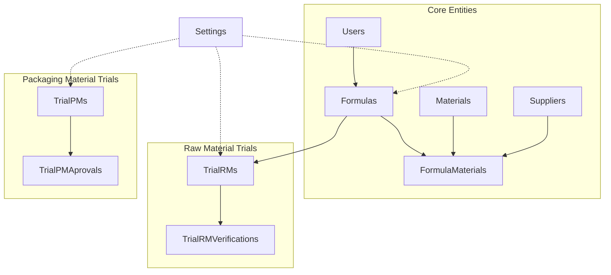
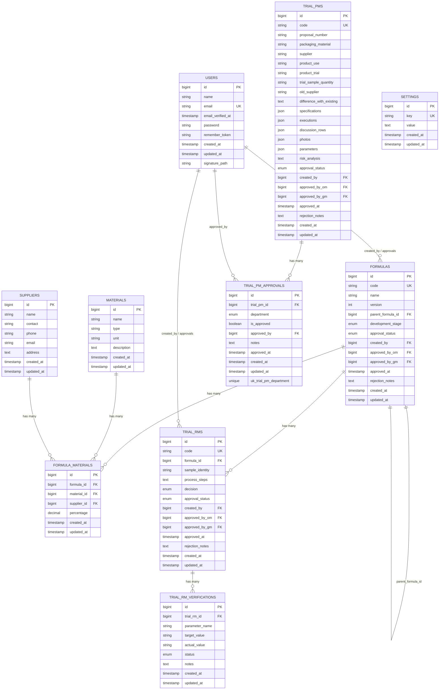
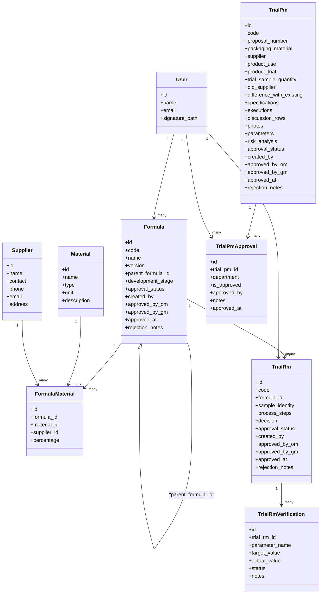
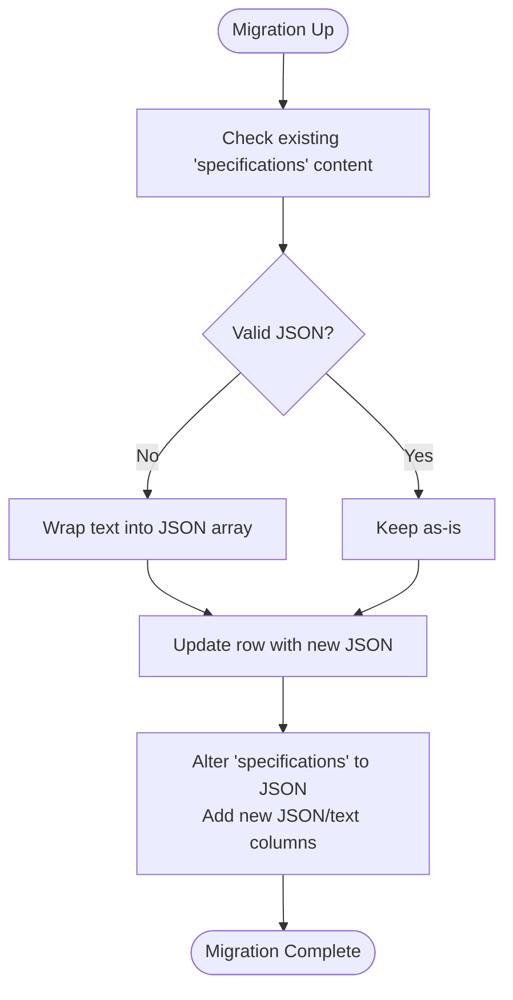
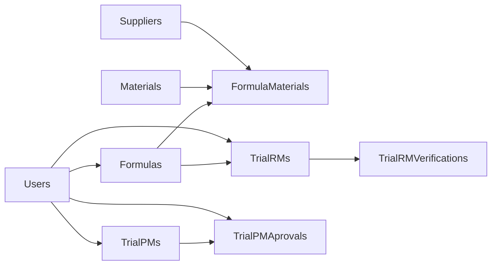

# Database Schema Design

<cite>
**Referenced Files in This Document**
- [0001_01_01_000000_create_users_table.php](file://database/migrations/0001_01_01_000000_create_users_table.php)
- [2026_07_01_092816_create_materials_table.php](file://database/migrations/2026_07_01_092816_create_materials_table.php)
- [2026_07_01_092825_create_suppliers_table.php](file://database/migrations/2026_07_01_092825_create_suppliers_table.php)
- [2026_07_01_092832_create_formulas_table.php](file://database/migrations/2026_07_01_092832_create_formulas_table.php)
- [2026_07_01_092840_create_formula_materials_table.php](file://database/migrations/2026_07_01_092840_create_formula_materials_table.php)
- [2026_07_01_092849_create_trial_rms_table.php](file://database/migrations/2026_07_01_092849_create_trial_rms_table.php)
- [2026_07_01_092857_create_trial_rm_verifications_table.php](file://database/migrations/2026_07_01_092857_create_trial_rm_verifications_table.php)
- [2026_07_01_092905_create_trial_pms_table.php](file://database/migrations/2026_07_01_092905_create_trial_pms_table.php)
- [2026_07_01_092919_create_trial_pm_approvals_table.php](file://database/migrations/2026_07_01_092919_create_trial_pm_approvals_table.php)
- [2026_07_02_000000_create_settings_table.php](file://database/migrations/2026_07_02_000000_create_settings_table.php)
- [2026_07_02_042035_update_trial_pms_table_for_new_specification_and_executions.php](file://database/migrations/2026_07_02_042035_update_trial_pms_table_for_new_specification_and_executions.php)
- [2026_07_02_044109_add_signature_path_to_users_table.php](file://database/migrations/2026_07_02_044109_add_signature_path_to_users_table.php)
- [Formula.php](file://app/Models/Formula.php)
- [TrialRm.php](file://app/Models/TrialRm.php)
- [TrialPm.php](file://app/Models/TrialPm.php)
</cite>

## Table of Contents
1. [Introduction](#introduction)
2. [Project Structure](#project-structure)
3. [Core Components](#core-components)
4. [Architecture Overview](#architecture-overview)
5. [Detailed Component Analysis](#detailed-component-analysis)
6. [Dependency Analysis](#dependency-analysis)
7. [Performance Considerations](#performance-considerations)
8. [Troubleshooting Guide](#troubleshooting-guide)
9. [Conclusion](#conclusion)
10. [Appendices](#appendices)

## Introduction
This document provides a comprehensive database schema design for the R&D Management application. It details entity relationships, field definitions, data types, constraints, and validation rules implemented at the database level. It also explains Eloquent relationships, indexing strategies, query optimization techniques, and migration approaches used to evolve the schema safely.

## Project Structure
The database schema is defined through Laravel migrations and accessed via Eloquent models. Core entities include Users, Materials, Suppliers, Formulas, FormulaMaterials, TrialRMs, TrialRMVerifications, TrialPMs, TrialPMAprovals, and Settings. The schema supports:
- Formula versioning and approval workflows
- Raw material composition tracking with supplier linkage
- Two trial tracks: RM (raw materials) and PM (packaging materials)
- Multi-department approvals for packaging trials
- System settings as key-value pairs

**Diagram sources**
- [0001_01_01_000000_create_users_table.php:14-22](file://database/migrations/0001_01_01_000000_create_users_table.php#L14-L22)
- [2026_07_01_092832_create_formulas_table.php:14-28](file://database/migrations/2026_07_01_092832_create_formulas_table.php#L14-L28)
- [2026_07_01_092840_create_formula_materials_table.php:14-21](file://database/migrations/2026_07_01_092840_create_formula_materials_table.php#L14-L21)
- [2026_07_01_092816_create_materials_table.php:14-21](file://database/migrations/2026_07_01_092816_create_materials_table.php#L14-L21)
- [2026_07_01_092825_create_suppliers_table.php:14-22](file://database/migrations/2026_07_01_092825_create_suppliers_table.php#L14-L22)
- [2026_07_01_092849_create_trial_rms_table.php:14-28](file://database/migrations/2026_07_01_092849_create_trial_rms_table.php#L14-L28)
- [2026_07_01_092857_create_trial_rm_verifications_table.php:14-23](file://database/migrations/2026_07_01_092857_create_trial_rm_verifications_table.php#L14-L23)
- [2026_07_01_092905_create_trial_pms_table.php:14-28](file://database/migrations/2026_07_01_092905_create_trial_pms_table.php#L14-L28)
- [2026_07_01_092919_create_trial_pm_approvals_table.php:14-26](file://database/migrations/2026_07_01_092919_create_trial_pm_approvals_table.php#L14-L26)
- [2026_07_02_000000_create_settings_table.php:14-19](file://database/migrations/2026_07_02_000000_create_settings_table.php#L14-L19)

**Section sources**
- [0001_01_01_000000_create_users_table.php:14-22](file://database/migrations/0001_01_01_000000_create_users_table.php#L14-L22)
- [2026_07_01_092832_create_formulas_table.php:14-28](file://database/migrations/2026_07_01_092832_create_formulas_table.php#L14-L28)
- [2026_07_01_092840_create_formula_materials_table.php:14-21](file://database/migrations/2026_07_01_092840_create_formula_materials_table.php#L14-L21)
- [2026_07_01_092816_create_materials_table.php:14-21](file://database/migrations/2026_07_01_092816_create_materials_table.php#L14-L21)
- [2026_07_01_092825_create_suppliers_table.php:14-22](file://database/migrations/2026_07_01_092825_create_suppliers_table.php#L14-L22)
- [2026_07_01_092849_create_trial_rms_table.php:14-28](file://database/migrations/2026_07_01_092849_create_trial_rms_table.php#L14-L28)
- [2026_07_01_092857_create_trial_rm_verifications_table.php:14-23](file://database/migrations/2026_07_01_092857_create_trial_rm_verifications_table.php#L14-L23)
- [2026_07_01_092905_create_trial_pms_table.php:14-28](file://database/migrations/2026_07_01_092905_create_trial_pms_table.php#L14-L28)
- [2026_07_01_092919_create_trial_pm_approvals_table.php:14-26](file://database/migrations/2026_07_01_092919_create_trial_pm_approvals_table.php#L14-L26)
- [2026_07_02_000000_create_settings_table.php:14-19](file://database/migrations/2026_07_02_000000_create_settings_table.php#L14-L19)

## Core Components
This section summarizes each table’s purpose, fields, keys, constraints, and validation rules.

- users
  - Purpose: Authentication and audit ownership/approval references.
  - Primary Key: id
  - Unique Constraints: email
  - Indexes: last_activity on sessions; user_id index on sessions
  - Notable Fields: signature_path (nullable), timestamps
  - Validation Rules: email uniqueness enforced at DB level

- password_reset_tokens
  - Purpose: Password reset tokens
  - Primary Key: email
  - Fields: token, created_at

- sessions
  - Purpose: Session storage
  - Primary Key: id
  - Indexes: user_id, last_activity
  - Foreign Keys: user_id -> users.id

- materials
  - Purpose: Master list of raw materials
  - Primary Key: id
  - Fields: name, type (nullable), unit (default 'kg'), description (nullable), timestamps

- suppliers
  - Purpose: Supplier master data
  - Primary Key: id
  - Fields: name, contact (nullable), phone (nullable), email (nullable), address (nullable), timestamps

- formulas
  - Purpose: Product formulations with versioning and approval workflow
  - Primary Key: id
  - Unique Constraints: code
  - Foreign Keys: parent_formula_id -> formulas.id (set null on delete), created_by -> users.id (cascade), approved_by_om -> users.id (set null), approved_by_gm -> users.id (set null)
  - Enums: development_stage, approval_status
  - Timestamps: approved_at (nullable)
  - Validation Rules: unique code; foreign key integrity; enum values constrained by DB

- formula_materials
  - Purpose: Many-to-many mapping between formulas and materials with supplier and percentage
  - Primary Key: id
  - Foreign Keys: formula_id -> formulas.id (cascade), material_id -> materials.id (cascade), supplier_id -> suppliers.id (cascade)
  - Numeric Constraint: percentage decimal(5,2)
  - Note: No explicit composite unique constraint; consider adding one if needed

- trial_rms
  - Purpose: Raw material trial records linked to a formula
  - Primary Key: id
  - Unique Constraints: code
  - Foreign Keys: formula_id -> formulas.id (cascade), created_by -> users.id (cascade), approved_by_om -> users.id (set null), approved_by_gm -> users.id (set null)
  - Enums: decision, approval_status
  - Timestamps: approved_at (nullable)

- trial_rm_verifications
  - Purpose: Parameter verifications per trial RM
  - Primary Key: id
  - Foreign Keys: trial_rm_id -> trial_rms.id (cascade)
  - Enums: status
  - Text fields: parameter_name, target_value, actual_value, notes

- trial_pms
  - Purpose: Packaging material trial records with JSON-based specifications and execution details
  - Primary Key: id
  - Unique Constraints: code
  - Foreign Keys: created_by -> users.id (cascade), approved_by_om -> users.id (set null), approved_by_gm -> users.id (set null)
  - JSON Columns: specifications, executions, discussion_rows, photos, parameters
  - Enums: approval_status
  - Timestamps: approved_at (nullable)

- trial_pm_approvals
  - Purpose: Department-level approvals for packaging trials
  - Primary Key: id
  - Unique Constraints: (trial_pm_id, department)
  - Foreign Keys: trial_pm_id -> trial_pms.id (cascade), approved_by -> users.id (set null)
  - Enums: department
  - Boolean: is_approved
  - Timestamps: approved_at (nullable)

- settings
  - Purpose: Application-wide key-value configuration
  - Primary Key: id
  - Unique Constraints: key
  - Fields: value (text, nullable), timestamps

**Section sources**
- [0001_01_01_000000_create_users_table.php:14-37](file://database/migrations/0001_01_01_000000_create_users_table.php#L14-L37)
- [2026_07_01_092816_create_materials_table.php:14-21](file://database/migrations/2026_07_01_092816_create_materials_table.php#L14-L21)
- [2026_07_01_092825_create_suppliers_table.php:14-22](file://database/migrations/2026_07_01_092825_create_suppliers_table.php#L14-L22)
- [2026_07_01_092832_create_formulas_table.php:14-28](file://database/migrations/2026_07_01_092832_create_formulas_table.php#L14-L28)
- [2026_07_01_092840_create_formula_materials_table.php:14-21](file://database/migrations/2026_07_01_092840_create_formula_materials_table.php#L14-L21)
- [2026_07_01_092849_create_trial_rms_table.php:14-28](file://database/migrations/2026_07_01_092849_create_trial_rms_table.php#L14-L28)
- [2026_07_01_092857_create_trial_rm_verifications_table.php:14-23](file://database/migrations/2026_07_01_092857_create_trial_rm_verifications_table.php#L14-L23)
- [2026_07_01_092905_create_trial_pms_table.php:14-28](file://database/migrations/2026_07_01_092905_create_trial_pms_table.php#L14-L28)
- [2026_07_01_092919_create_trial_pm_approvals_table.php:14-26](file://database/migrations/2026_07_01_092919_create_trial_pm_approvals_table.php#L14-L26)
- [2026_07_02_000000_create_settings_table.php:14-19](file://database/migrations/2026_07_02_000000_create_settings_table.php#L14-L19)
- [2026_07_02_042035_update_trial_pms_table_for_new_specification_and_executions.php:33-68](file://database/migrations/2026_07_02_042035_update_trial_pms_table_for_new_specification_and_executions.php#L33-L68)
- [2026_07_02_044109_add_signature_path_to_users_table.php:14-16](file://database/migrations/2026_07_02_044109_add_signature_path_to_users_table.php#L14-L16)

## Architecture Overview
The schema centers around Formulas as the core business entity, linking to materials and suppliers via a junction table. Trials are split into two tracks:
- Raw Material Trials (TrialRMs) with associated verifications
- Packaging Material Trials (TrialPMs) with multi-department approvals

**Diagram sources**
- [0001_01_01_000000_create_users_table.php:14-22](file://database/migrations/0001_01_01_000000_create_users_table.php#L14-L22)
- [2026_07_01_092816_create_materials_table.php:14-21](file://database/migrations/2026_07_01_092816_create_materials_table.php#L14-L21)
- [2026_07_01_092825_create_suppliers_table.php:14-22](file://database/migrations/2026_07_01_092825_create_suppliers_table.php#L14-L22)
- [2026_07_01_092832_create_formulas_table.php:14-28](file://database/migrations/2026_07_01_092832_create_formulas_table.php#L14-L28)
- [2026_07_01_092840_create_formula_materials_table.php:14-21](file://database/migrations/2026_07_01_092840_create_formula_materials_table.php#L14-L21)
- [2026_07_01_092849_create_trial_rms_table.php:14-28](file://database/migrations/2026_07_01_092849_create_trial_rms_table.php#L14-L28)
- [2026_07_01_092857_create_trial_rm_verifications_table.php:14-23](file://database/migrations/2026_07_01_092857_create_trial_rm_verifications_table.php#L14-L23)
- [2026_07_01_092905_create_trial_pms_table.php:14-28](file://database/migrations/2026_07_01_092905_create_trial_pms_table.php#L14-L28)
- [2026_07_01_092919_create_trial_pm_approvals_table.php:14-26](file://database/migrations/2026_07_01_092919_create_trial_pm_approvals_table.php#L14-L26)
- [2026_07_02_000000_create_settings_table.php:14-19](file://database/migrations/2026_07_02_000000_create_settings_table.php#L14-L19)
- [2026_07_02_042035_update_trial_pms_table_for_new_specification_and_executions.php:33-68](file://database/migrations/2026_07_02_042035_update_specification_and_executions.php#L33-L68)
- [2026_07_02_044109_add_signature_path_to_users_table.php:14-16](file://database/migrations/2026_07_02_044109_add_signature_path_to_users_table.php#L14-L16)

## Detailed Component Analysis

### Entity Relationship Patterns
- Formula Versioning: Self-referential relationship via parent_formula_id enables reformulation tracking.
- Composition Mapping: formula_materials links formulas to materials and suppliers with percentage composition.
- Approval Workflows: Both Formulas and Trials use created_by, approved_by_om, approved_by_gm, approved_at, and rejection_notes to track lifecycle.
- Multi-Department Approvals: TrialPMs require approvals from multiple departments, enforced by a unique constraint on (trial_pm_id, department).

**Diagram sources**
- [Formula.php:38-75](file://app/Models/Formula.php#L38-L75)
- [TrialRm.php:38-62](file://app/Models/TrialRm.php#L38-L62)
- [TrialPm.php:53-72](file://app/Models/TrialPm.php#L53-L72)
- [2026_07_01_092832_create_formulas_table.php:14-28](file://database/migrations/2026_07_01_092832_create_formulas_table.php#L14-L28)
- [2026_07_01_092840_create_formula_materials_table.php:14-21](file://database/migrations/2026_07_01_092840_create_formula_materials_table.php#L14-L21)
- [2026_07_01_092816_create_materials_table.php:14-21](file://database/migrations/2026_07_01_092816_create_materials_table.php#L14-L21)
- [2026_07_01_092825_create_suppliers_table.php:14-22](file://database/migrations/2026_07_01_092825_create_suppliers_table.php#L14-L22)
- [2026_07_01_092849_create_trial_rms_table.php:14-28](file://database/migrations/2026_07_01_092849_create_trial_rms_table.php#L14-L28)
- [2026_07_01_092857_create_trial_rm_verifications_table.php:14-23](file://database/migrations/2026_07_01_092857_create_trial_rm_verifications_table.php#L14-L23)
- [2026_07_01_092905_create_trial_pms_table.php:14-28](file://database/migrations/2026_07_01_092905_create_trial_pms_table.php#L14-L28)
- [2026_07_01_092919_create_trial_pm_approvals_table.php:14-26](file://database/migrations/2026_07_01_092919_create_trial_pm_approvals_table.php#L14-L26)

**Section sources**
- [Formula.php:38-75](file://app/Models/Formula.php#L38-L75)
- [TrialRm.php:38-62](file://app/Models/TrialRm.php#L38-L62)
- [TrialPm.php:53-72](file://app/Models/TrialPm.php#L53-L72)

### Data Access Patterns and Eloquent Relationships
- Formula
  - creator(): belongsTo(User, created_by)
  - operationalManager(): belongsTo(User, approved_by_om)
  - generalManager(): belongsTo(User, approved_by_gm)
  - materials(): hasMany(FormulaMaterial)
  - parentFormula(): belongsTo(Formula, parent_formula_id)
  - childFormulas(): hasMany(Formula, parent_formula_id)
  - trialRms(): hasMany(TrialRm)
  - Helpers: total_percentage computed via sum(materials.percentage); isValidComposition checks 100%

- TrialRm
  - formula(): belongsTo(Formula)
  - creator(), operationalManager(), generalManager(): same pattern as above
  - verifications(): hasMany(TrialRmVerification)

- TrialPm
  - creator(), operationalManager(), generalManager(): same pattern as above
  - departmentApprovals(): hasMany(TrialPmApproval)
  - Helper: isFullyApprovedByDepartments checks all four departments approved

These relationships enable efficient querying and consistent access patterns across controllers and services.

**Section sources**
- [Formula.php:38-87](file://app/Models/Formula.php#L38-L87)
- [TrialRm.php:38-62](file://app/Models/TrialRm.php#L38-L62)
- [TrialPm.php:53-80](file://app/Models/TrialPm.php#L53-L80)

### Migration Strategies and Data Evolution
- JSON Column Conversion for TrialPMs
  - Existing text specifications converted to valid JSON arrays before altering column type
  - New JSON columns added: specifications, executions, discussion_rows, photos, parameters
  - Additional metadata fields added: proposal_number, supplier, product_use, product_trial, trial_sample_quantity, old_supplier, difference_with_existing

- Signature Path Addition
  - Added signature_path to users for storing file paths related to signatures

- Safe Rollbacks
  - Down methods drop added columns or revert changes where applicable

**Diagram sources**
- [2026_07_02_042035_update_trial_pms_table_for_new_specification_and_executions.php:15-31](file://database/migrations/2026_07_02_042035_update_trial_pms_table_for_new_specification_and_executions.php#L15-L31)
- [2026_07_02_042035_update_trial_pms_table_for_new_specification_and_executions.php:33-68](file://database/migrations/2026_07_02_042035_update_trial_pms_table_for_new_specification_and_executions.php#L33-L68)

**Section sources**
- [2026_07_02_042035_update_trial_pms_table_for_new_specification_and_executions.php:15-68](file://database/migrations/2026_07_02_042035_update_trial_pms_table_for_new_specification_and_executions.php#L15-L68)
- [2026_07_02_044109_add_signature_path_to_users_table.php:14-16](file://database/migrations/2026_07_02_044109_add_signature_path_to_users_table.php#L14-L16)

## Dependency Analysis
Key dependency chains:
- Formula depends on Users (creator/approvers) and self (parent_formula_id)
- FormulaMaterial depends on Formula, Material, Supplier
- TrialRm depends on Formula and Users
- TrialRMVerification depends on TrialRm
- TrialPM depends on Users
- TrialPMAproval depends on TrialPM and Users

**Diagram sources**
- [2026_07_01_092832_create_formulas_table.php:14-28](file://database/migrations/2026_07_01_092832_create_formulas_table.php#L14-L28)
- [2026_07_01_092840_create_formula_materials_table.php:14-21](file://database/migrations/2026_07_01_092840_create_formula_materials_table.php#L14-L21)
- [2026_07_01_092849_create_trial_rms_table.php:14-28](file://database/migrations/2026_07_01_092849_create_trial_rms_table.php#L14-L28)
- [2026_07_01_092857_create_trial_rm_verifications_table.php:14-23](file://database/migrations/2026_07_01_092857_create_trial_rm_verifications_table.php#L14-L23)
- [2026_07_01_092905_create_trial_pms_table.php:14-28](file://database/migrations/2026_07_01_092905_create_trial_pms_table.php#L14-L28)
- [2026_07_01_092919_create_trial_pm_approvals_table.php:14-26](file://database/migrations/2026_07_01_092919_create_trial_pm_approvals_table.php#L14-L26)

**Section sources**
- [2026_07_01_092832_create_formulas_table.php:14-28](file://database/migrations/2026_07_01_092832_create_formulas_table.php#L14-L28)
- [2026_07_01_092840_create_formula_materials_table.php:14-21](file://database/migrations/2026_07_01_092840_create_formula_materials_table.php#L14-L21)
- [2026_07_01_092849_create_trial_rms_table.php:14-28](file://database/migrations/2026_07_01_092849_create_trial_rms_table.php#L14-L28)
- [2026_07_01_092857_create_trial_rm_verifications_table.php:14-23](file://database/migrations/2026_07_01_092857_create_trial_rm_verifications_table.php#L14-L23)
- [2026_07_01_092905_create_trial_pms_table.php:14-28](file://database/migrations/2026_07_01_092905_create_trial_pms_table.php#L14-L28)
- [2026_07_01_092919_create_trial_pm_approvals_table.php:14-26](file://database/migrations/2026_07_01_092919_create_trial_pm_approvals_table.php#L14-L26)

## Performance Considerations
Indexing Strategy Recommendations:
- Frequently queried foreign keys should be indexed:
  - formula_id in formula_materials
  - material_id in formula_materials
  - supplier_id in formula_materials
  - formula_id in trial_rms
  - trial_rm_id in trial_rm_verifications
  - trial_pm_id in trial_pm_approvals
  - created_by, approved_by_om, approved_by_gm in formulas and trial_rms
- Composite indexes:
  - (trial_pm_id, department) already exists as unique; ensure it covers common queries filtering by department
- JSON columns:
  - For trial_pms, consider generated virtual columns or denormalized fields for frequently searched JSON attributes (e.g., specific specification keys) to avoid full JSON scans
- Query Optimization Techniques:
  - Use eager loading for relationships (e.g., Formula::with(['materials', 'materials.material', 'materials.supplier']))
  - Avoid N+1 queries when listing compositions or approvals
  - Prefer selecting only required columns for large result sets
  - Use scopes to encapsulate common filters (e.g., approval_status, development_stage)

[No sources needed since this section provides general guidance]

## Troubleshooting Guide
Common Issues and Resolutions:
- JSON Column Errors in TrialPMs
  - Ensure specifications, executions, discussion_rows, photos, parameters are stored as valid JSON arrays
  - If migrating legacy data, run the provided migration to wrap non-JSON text into arrays before altering column types
- Missing Approvals for TrialPMs
  - Verify that each required department has an entry in trial_pm_approvals with is_approved set appropriately
- Composition Validation
  - Use helper attributes to validate that formula composition sums to 100%; enforce at application layer and optionally add DB CHECK constraints if supported
- Approval Workflow Integrity
  - Ensure foreign key constraints are intact; orphaned records may indicate failed cascades or manual deletions

**Section sources**
- [2026_07_02_042035_update_trial_pms_table_for_new_specification_and_executions.php:15-31](file://database/migrations/2026_07_02_042035_update_trial_pms_table_for_new_specification_and_executions.php#L15-L31)
- [2026_07_01_092919_create_trial_pm_approvals_table.php:14-26](file://database/migrations/2026_07_01_092919_create_trial_pm_approvals_table.php#L14-L26)
- [Formula.php:77-87](file://app/Models/Formula.php#L77-L87)

## Conclusion
The database schema is designed to support robust R&D workflows with clear separation of concerns between formulation management, raw material trials, and packaging material trials. Strong referential integrity, enums, and unique constraints enforce data quality. Eloquent relationships provide intuitive access patterns, while recommended indexing and query optimizations ensure scalability. Migration strategies demonstrate safe evolution of complex structures like JSON columns.

[No sources needed since this section summarizes without analyzing specific files]

## Appendices

### Sample Data Structures
- Formula
  - code: unique identifier (e.g., FRM-YYYYMM-XXX)
  - name: product name
  - version: integer versioning
  - parent_formula_id: reference to previous version (nullable)
  - development_stage: Draf, Pra-Trial, Optimalisasi, Final
  - approval_status: Draft, Pending Tahap 1, Pending Tahap 2, Approved, Rejected
  - created_by, approved_by_om, approved_by_gm: user IDs
  - approved_at: timestamp
  - rejection_notes: text

- FormulaMaterial
  - formula_id, material_id, supplier_id: foreign keys
  - percentage: decimal(5,2) representing xx.xx%

- TrialRm
  - code: unique identifier (e.g., TRM-YYYYMM-XXX-A)
  - formula_id: linked formula
  - sample_identity, process_steps: descriptive fields
  - decision: Lulus or Reformulasi
  - approval_status: similar to Formula
  - created_by, approved_by_om, approved_by_gm, approved_at, rejection_notes

- TrialRMVerification
  - trial_rm_id: linked trial
  - parameter_name, target_value, actual_value: measurement details
  - status: Pass, Fail, Warning
  - notes: additional comments

- TrialPM
  - code: unique identifier (e.g., TPM-YYYYMM-XXX)
  - proposal_number, packaging_material, supplier, product_use, product_trial, trial_sample_quantity, old_supplier, difference_with_existing: metadata
  - specifications, executions, discussion_rows, photos, parameters: JSON arrays
  - risk_analysis: text
  - approval_status: Draft, Pending Review, Approved, Rejected
  - created_by, approved_by_om, approved_by_gm, approved_at, rejection_notes

- TrialPMAproval
  - trial_pm_id: linked trial
  - department: rd, qc, production, engineering
  - is_approved: boolean
  - approved_by: user ID who approved
  - notes: department-specific comments
  - approved_at: timestamp

- Settings
  - key: unique setting key
  - value: text payload

**Section sources**
- [2026_07_01_092832_create_formulas_table.php:14-28](file://database/migrations/2026_07_01_092832_create_formulas_table.php#L14-L28)
- [2026_07_01_092840_create_formula_materials_table.php:14-21](file://database/migrations/2026_07_01_092840_create_formula_materials_table.php#L14-L21)
- [2026_07_01_092849_create_trial_rms_table.php:14-28](file://database/migrations/2026_07_01_092849_create_trial_rms_table.php#L14-L28)
- [2026_07_01_092857_create_trial_rm_verifications_table.php:14-23](file://database/migrations/2026_07_01_092857_create_trial_rm_verifications_table.php#L14-L23)
- [2026_07_01_092905_create_trial_pms_table.php:14-28](file://database/migrations/2026_07_01_092905_create_trial_pms_table.php#L14-L28)
- [2026_07_01_092919_create_trial_pm_approvals_table.php:14-26](file://database/migrations/2026_07_01_092919_create_trial_pm_approvals_table.php#L14-L26)
- [2026_07_02_000000_create_settings_table.php:14-19](file://database/migrations/2026_07_02_000000_create_settings_table.php#L14-L19)
- [2026_07_02_042035_update_trial_pms_table_for_new_specification_and_executions.php:33-68](file://database/migrations/2026_07_02_042035_update_trial_pms_table_for_new_specification_and_executions.php#L33-L68)