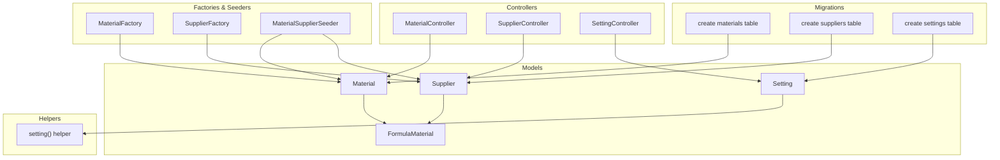
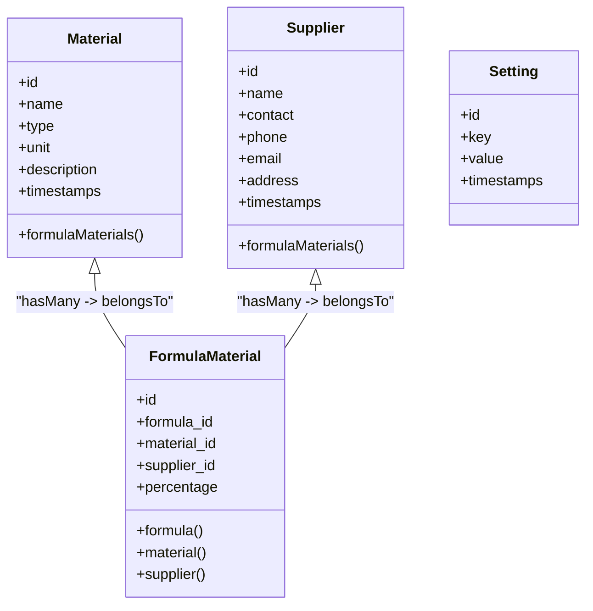
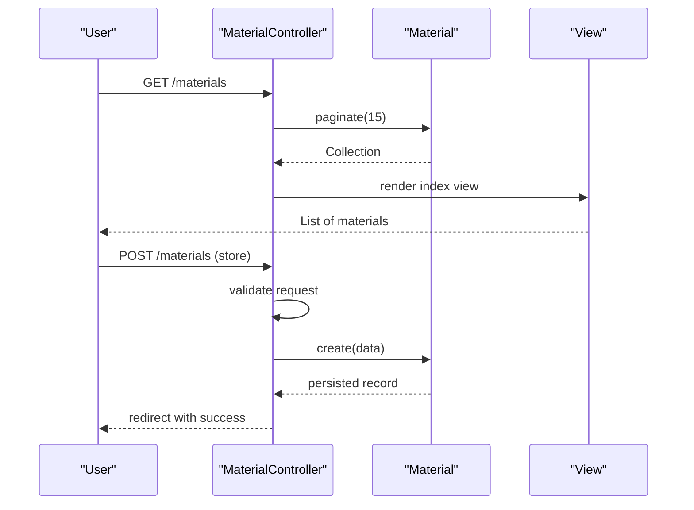
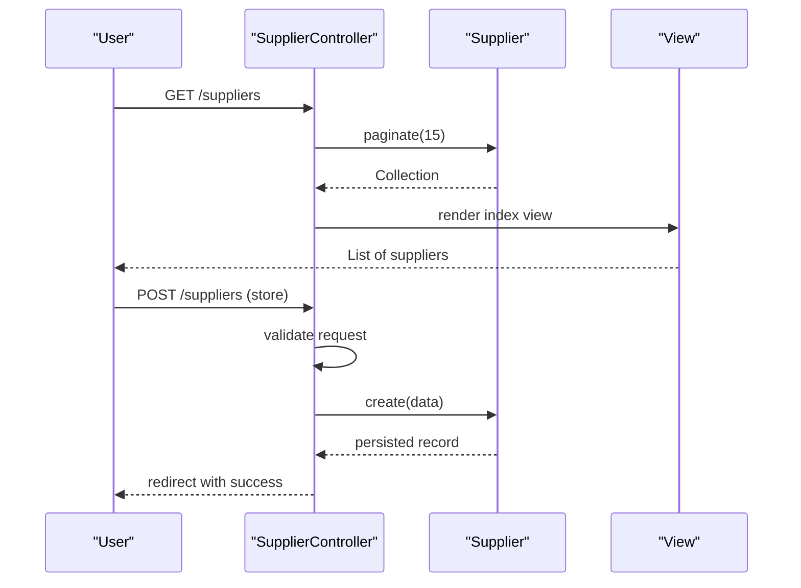
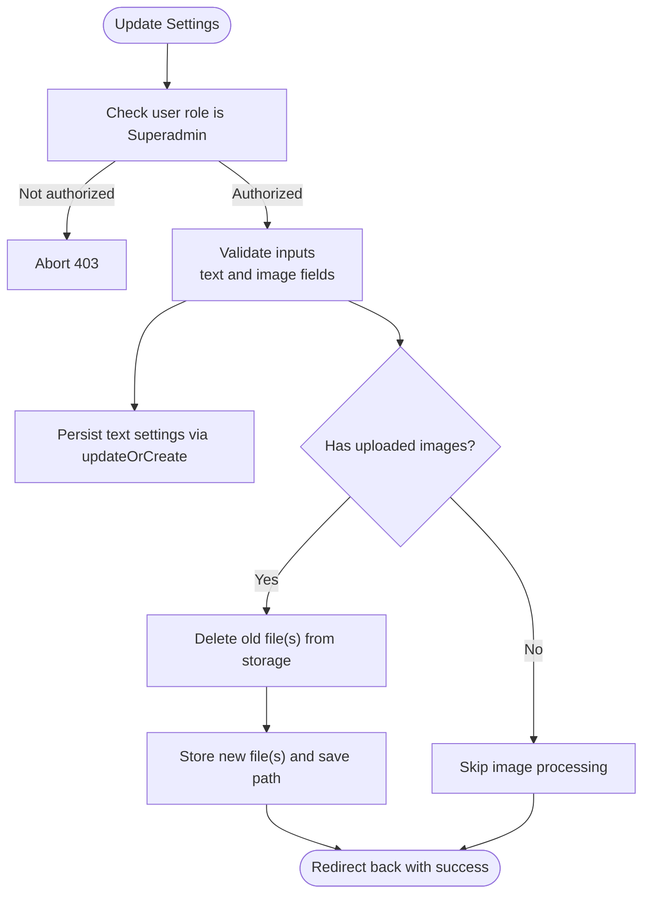
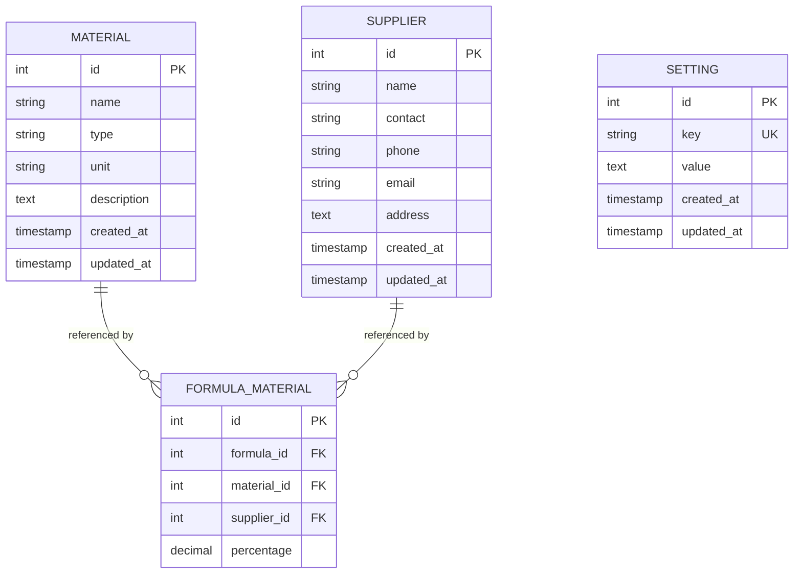
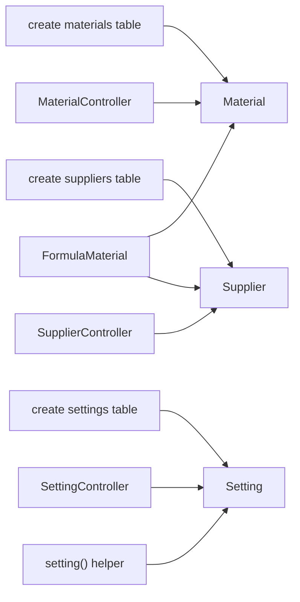

# Master Data Models

<cite>
**Referenced Files in This Document**
- [Material.php](file://app/Models/Material.php)
- [Supplier.php](file://app/Models/Supplier.php)
- [Setting.php](file://app/Models/Setting.php)
- [FormulaMaterial.php](file://app/Models/FormulaMaterial.php)
- [2026_07_01_092816_create_materials_table.php](file://database/migrations/2026_07_01_092816_create_materials_table.php)
- [2026_07_01_092825_create_suppliers_table.php](file://database/migrations/2026_07_01_092825_create_suppliers_table.php)
- [2026_07_02_000000_create_settings_table.php](file://database/migrations/2026_07_02_000000_create_settings_table.php)
- [MaterialController.php](file://app/Http/Controllers/MaterialController.php)
- [SupplierController.php](file://app/Http/Controllers/SupplierController.php)
- [SettingController.php](file://app/Http/Controllers/SettingController.php)
- [setting.php](file://app/Helpers/setting.php)
- [MaterialFactory.php](file://database/factories/MaterialFactory.php)
- [SupplierFactory.php](file://database/factories/SupplierFactory.php)
- [MaterialSupplierSeeder.php](file://database/seeders/MaterialSupplierSeeder.php)
</cite>

## Table of Contents
1. [Introduction](#introduction)
2. [Project Structure](#project-structure)
3. [Core Components](#core-components)
4. [Architecture Overview](#architecture-overview)
5. [Detailed Component Analysis](#detailed-component-analysis)
6. [Dependency Analysis](#dependency-analysis)
7. [Performance Considerations](#performance-considerations)
8. [Troubleshooting Guide](#troubleshooting-guide)
9. [Conclusion](#conclusion)
10. [Appendices](#appendices)

## Introduction
This document provides detailed data model documentation for the master data entities Material, Supplier, and Setting. It explains entity relationships, field definitions, data types, validation rules, business constraints, and usage patterns that support reference data management across the application. These models underpin lookup functionality and are referenced by operational entities such as FormulaMaterial to maintain consistent and traceable reference data.

## Project Structure
The master data models reside in the Eloquent models layer with corresponding database migrations defining schema. Controllers implement CRUD operations and validation, while helpers provide global accessors for settings. Factories and seeders supply sample and initial data for development and testing.

**Diagram sources**
- [Material.php](file://app/Models/Material.php)
- [Supplier.php](file://app/Models/Supplier.php)
- [Setting.php](file://app/Models/Setting.php)
- [FormulaMaterial.php](file://app/Models/FormulaMaterial.php)
- [2026_07_01_092816_create_materials_table.php](file://database/migrations/2026_07_01_092816_create_materials_table.php)
- [2026_07_01_092825_create_suppliers_table.php](file://database/migrations/2026_07_01_092825_create_suppliers_table.php)
- [2026_07_02_000000_create_settings_table.php](file://database/migrations/2026_07_02_000000_create_settings_table.php)
- [MaterialController.php](file://app/Http/Controllers/MaterialController.php)
- [SupplierController.php](file://app/Http/Controllers/SupplierController.php)
- [SettingController.php](file://app/Http/Controllers/SettingController.php)
- [setting.php](file://app/Helpers/setting.php)
- [MaterialFactory.php](file://database/factories/MaterialFactory.php)
- [SupplierFactory.php](file://database/factories/SupplierFactory.php)
- [MaterialSupplierSeeder.php](file://database/seeders/MaterialSupplierSeeder.php)

**Section sources**
- [Material.php](file://app/Models/Material.php)
- [Supplier.php](file://app/Models/Supplier.php)
- [Setting.php](file://app/Models/Setting.php)
- [FormulaMaterial.php](file://app/Models/FormulaMaterial.php)
- [2026_07_01_092816_create_materials_table.php](file://database/migrations/2026_07_01_092816_create_materials_table.php)
- [2026_07_01_092825_create_suppliers_table.php](file://database/migrations/2026_07_01_092825_create_suppliers_table.php)
- [2026_07_02_000000_create_settings_table.php](file://database/migrations/2026_07_02_000000_create_settings_table.php)
- [MaterialController.php](file://app/Http/Controllers/MaterialController.php)
- [SupplierController.php](file://app/Http/Controllers/SupplierController.php)
- [SettingController.php](file://app/Http/Controllers/SettingController.php)
- [setting.php](file://app/Helpers/setting.php)
- [MaterialFactory.php](file://database/factories/MaterialFactory.php)
- [SupplierFactory.php](file://database/factories/SupplierFactory.php)
- [MaterialSupplierSeeder.php](file://database/seeders/MaterialSupplierSeeder.php)

## Core Components
This section documents the three master data entities: Material, Supplier, and Setting. For each, we describe fields, data types, constraints, relationships, validation rules, and usage patterns.

### Material
- Purpose: Reference catalog of raw materials used in formulations.
- Database table: materials
- Fields and types:
  - id: integer (primary key)
  - name: string, required, unique at application level via controller validation
  - type: string, optional; descriptive category (e.g., Extract, Liquid, Powder)
  - unit: string, default 'kg'; measurement unit (e.g., kg, liter, gram)
  - description: text, optional
  - timestamps: created_at, updated_at
- Relationships:
  - One-to-many to FormulaMaterial (material_id foreign key)
- Validation rules (controller):
  - name: required, string, max 150, unique among materials
  - type: nullable, string, max 50
  - unit: required, string, max 20
  - description: nullable, string
- Business constraints:
  - Name uniqueness enforced at controller level; consider adding a database-level unique constraint for robustness.
  - Unit should be standardized to supported units; consider an enum or lookup table if needed.
- Usage patterns:
  - Referenced by FormulaMaterial to associate materials with formulas.
  - Used in dropdowns and lookups across formula creation/editing.

**Section sources**
- [Material.php](file://app/Models/Material.php)
- [2026_07_01_092816_create_materials_table.php](file://database/migrations/2026_07_01_092816_create_materials_table.php)
- [MaterialController.php](file://app/Http/Controllers/MaterialController.php)
- [FormulaMaterial.php](file://app/Models/FormulaMaterial.php)

### Supplier
- Purpose: Reference catalog of suppliers providing materials.
- Database table: suppliers
- Fields and types:
  - id: integer (primary key)
  - name: string, required, unique at application level via controller validation
  - contact: string, optional; person responsible
  - phone: string, optional; contact number
  - email: string, optional; validated as email format
  - address: text, optional
  - timestamps: created_at, updated_at
- Relationships:
  - One-to-many to FormulaMaterial (supplier_id foreign key)
- Validation rules (controller):
  - name: required, string, max 150, unique among suppliers
  - contact: nullable, string, max 100
  - phone: nullable, string, max 30
  - email: nullable, valid email format, max 100
  - address: nullable, string
- Business constraints:
  - Name uniqueness enforced at controller level; consider adding a database-level unique constraint for robustness.
  - Email format validation ensures consistency.
- Usage patterns:
  - Referenced by FormulaMaterial to link supplier information to material usage in formulas.
  - Used in supplier selection UI components.

**Section sources**
- [Supplier.php](file://app/Models/Supplier.php)
- [2026_07_01_092825_create_suppliers_table.php](file://database/migrations/2026_07_01_092825_create_suppliers_table.php)
- [SupplierController.php](file://app/Http/Controllers/SupplierController.php)
- [FormulaMaterial.php](file://app/Models/FormulaMaterial.php)

### Setting
- Purpose: Key-value store for application configuration and identity settings.
- Database table: settings
- Fields and types:
  - id: integer (primary key)
  - key: string, unique; setting identifier (e.g., app_name, company_name, app_logo)
  - value: text, nullable; setting value (string or file path)
  - timestamps: created_at, updated_at
- Relationships:
  - No direct Eloquent relationships; accessed globally via helper function.
- Access pattern:
  - Global helper setting(key, default) retrieves values by key, returning default when missing.
- Controller behavior:
  - Superadmin-only access to update settings.
  - Text settings persisted directly; image settings stored on disk and paths saved in value.
- Business constraints:
  - Keys must be unique; enforced at database level.
  - File uploads validated for type and size; old files replaced upon update.

**Section sources**
- [Setting.php](file://app/Models/Setting.php)
- [2026_07_02_000000_create_settings_table.php](file://database/migrations/2026_07_02_000000_create_settings_table.php)
- [SettingController.php](file://app/Http/Controllers/SettingController.php)
- [setting.php](file://app/Helpers/setting.php)

## Architecture Overview
The master data models integrate into the broader system through Eloquent relationships and controllers. Material and Supplier act as reference tables consumed by FormulaMaterial, enabling consistent association of materials and suppliers within formulas. Settings provide centralized configuration accessible throughout the application via a helper.

**Diagram sources**
- [Material.php](file://app/Models/Material.php)
- [Supplier.php](file://app/Models/Supplier.php)
- [Setting.php](file://app/Models/Setting.php)
- [FormulaMaterial.php](file://app/Models/FormulaMaterial.php)

## Detailed Component Analysis

### Material Model Analysis
- Implementation highlights:
  - Fillable fields define mass assignment attributes.
  - Activity logging configured to track changes to name, type, and unit only, dirty tracking enabled.
  - Relationship to FormulaMaterial supports one-to-many linkage.
- Data flow:
  - Controllers validate input and persist via Eloquent create/update.
  - Views render paginated lists and forms for CRUD operations.
- Constraints and validation:
  - Unique name enforced in controller; consider DB-level unique index for safety.
  - Unit defaults to 'kg' at schema level; ensure UI reflects allowed units.
- Usage patterns:
  - Lookups in formula creation/editing screens.
  - Displayed in reports and audit logs due to activity logging.

**Diagram sources**
- [MaterialController.php](file://app/Http/Controllers/MaterialController.php)
- [Material.php](file://app/Models/Material.php)

**Section sources**
- [Material.php](file://app/Models/Material.php)
- [MaterialController.php](file://app/Http/Controllers/MaterialController.php)

### Supplier Model Analysis
- Implementation highlights:
  - Fillable fields define mass assignment attributes.
  - Activity logging tracks name, contact, phone, and email changes with dirty tracking.
  - Relationship to FormulaMaterial supports one-to-many linkage.
- Data flow:
  - Controllers validate input and persist via Eloquent create/update.
  - Views render paginated lists and forms for CRUD operations.
- Constraints and validation:
  - Unique name enforced in controller; consider DB-level unique index for safety.
  - Email validated for format; phone length constrained.
- Usage patterns:
  - Lookups in formula creation/editing screens.
  - Displayed in supplier management UI.

**Diagram sources**
- [SupplierController.php](file://app/Http/Controllers/SupplierController.php)
- [Supplier.php](file://app/Models/Supplier.php)

**Section sources**
- [Supplier.php](file://app/Models/Supplier.php)
- [SupplierController.php](file://app/Http/Controllers/SupplierController.php)

### Setting Model Analysis
- Implementation highlights:
  - Key-value storage with unique keys.
  - Helper function provides global access with fallback defaults.
  - Controller enforces role-based access and handles file uploads securely.
- Data flow:
  - Update operation persists text settings directly and stores images on disk, saving paths in value.
  - Helper reads settings by key across the application.
- Constraints and validation:
  - Unique key enforced at database level.
  - Image validations include MIME types and maximum sizes.
- Usage patterns:
  - Centralized configuration retrieval via setting('key', default).
  - Identity settings like app_name, company_name, logos, and signature paths.

**Diagram sources**
- [SettingController.php](file://app/Http/Controllers/SettingController.php)
- [setting.php](file://app/Helpers/setting.php)
- [Setting.php](file://app/Models/Setting.php)

**Section sources**
- [Setting.php](file://app/Models/Setting.php)
- [SettingController.php](file://app/Http/Controllers/SettingController.php)
- [setting.php](file://app/Helpers/setting.php)

### Conceptual Overview
Master data entities serve as foundational references for operational processes. Material and Supplier are linked through FormulaMaterial to maintain referential integrity and enable rich reporting. Settings centralize application configuration, ensuring consistent behavior and branding across modules.

[No sources needed since this diagram shows conceptual workflow, not actual code structure]

## Dependency Analysis
Master data models depend on migrations for schema definition and are consumed by controllers and related models. The Setting model is accessed via a helper, decoupling direct dependencies.

**Diagram sources**
- [2026_07_01_092816_create_materials_table.php](file://database/migrations/2026_07_01_092816_create_materials_table.php)
- [2026_07_01_092825_create_suppliers_table.php](file://database/migrations/2026_07_01_092825_create_suppliers_table.php)
- [2026_07_02_000000_create_settings_table.php](file://database/migrations/2026_07_02_000000_create_settings_table.php)
- [Material.php](file://app/Models/Material.php)
- [Supplier.php](file://app/Models/Supplier.php)
- [Setting.php](file://app/Models/Setting.php)
- [MaterialController.php](file://app/Http/Controllers/MaterialController.php)
- [SupplierController.php](file://app/Http/Controllers/SupplierController.php)
- [SettingController.php](file://app/Http/Controllers/SettingController.php)
- [FormulaMaterial.php](file://app/Models/FormulaMaterial.php)
- [setting.php](file://app/Helpers/setting.php)

**Section sources**
- [2026_07_01_092816_create_materials_table.php](file://database/migrations/2026_07_01_092816_create_materials_table.php)
- [2026_07_01_092825_create_suppliers_table.php](file://database/migrations/2026_07_01_092825_create_suppliers_table.php)
- [2026_07_02_000000_create_settings_table.php](file://database/migrations/2026_07_02_000000_create_settings_table.php)
- [Material.php](file://app/Models/Material.php)
- [Supplier.php](file://app/Models/Supplier.php)
- [Setting.php](file://app/Models/Setting.php)
- [MaterialController.php](file://app/Http/Controllers/MaterialController.php)
- [SupplierController.php](file://app/Http/Controllers/SupplierController.php)
- [SettingController.php](file://app/Http/Controllers/SettingController.php)
- [FormulaMaterial.php](file://app/Models/FormulaMaterial.php)
- [setting.php](file://app/Helpers/setting.php)

## Performance Considerations
- Pagination: Controllers paginate listings to reduce memory footprint and improve response times.
- Indexes: Consider adding database indexes on frequently queried columns (e.g., materials.name, suppliers.name) to speed up lookups.
- Settings caching: Implement caching for frequently accessed settings to avoid repeated database queries.
- File storage: Ensure efficient deletion of old files during updates to prevent storage bloat.

[No sources needed since this section provides general guidance]

## Troubleshooting Guide
- Duplicate names: If creating duplicate Material or Supplier names fails, verify controller validation messages and consider adding database-level unique constraints to catch conflicts early.
- Missing settings: When a setting key is absent, the helper returns the provided default; ensure callers pass sensible defaults.
- Role restrictions: Updating settings requires Superadmin role; unauthorized users will receive a 403 error. Verify user roles before attempting updates.
- File upload issues: Confirm storage disk configuration and permissions; ensure old files are deleted before storing new ones to avoid orphaned files.

**Section sources**
- [MaterialController.php](file://app/Http/Controllers/MaterialController.php)
- [SupplierController.php](file://app/Http/Controllers/SupplierController.php)
- [SettingController.php](file://app/Http/Controllers/SettingController.php)
- [setting.php](file://app/Helpers/setting.php)

## Conclusion
The Material, Supplier, and Setting models form the backbone of reference data management in the application. They enforce validation and constraints at both controller and database levels, support relationships with operational entities, and provide centralized configuration access. Adhering to the documented usage patterns and constraints ensures consistency, reliability, and maintainability of master data across the system.

[No sources needed since this section summarizes without analyzing specific files]

## Appendices

### Data Validation Rules Summary
- Material:
  - name: required, string, max 150, unique
  - type: nullable, string, max 50
  - unit: required, string, max 20
  - description: nullable, string
- Supplier:
  - name: required, string, max 150, unique
  - contact: nullable, string, max 100
  - phone: nullable, string, max 30
  - email: nullable, email, max 100
  - address: nullable, string
- Setting:
  - key: unique at database level
  - value: text, nullable
  - Images: validated by MIME type and size limits

**Section sources**
- [MaterialController.php](file://app/Http/Controllers/MaterialController.php)
- [SupplierController.php](file://app/Http/Controllers/SupplierController.php)
- [SettingController.php](file://app/Http/Controllers/SettingController.php)
- [2026_07_02_000000_create_settings_table.php](file://database/migrations/2026_07_02_000000_create_settings_table.php)

### Factories and Seeders
- Factories generate realistic sample data for development and testing.
- Seeders populate initial master data to bootstrap environments quickly.

**Section sources**
- [MaterialFactory.php](file://database/factories/MaterialFactory.php)
- [SupplierFactory.php](file://database/factories/SupplierFactory.php)
- [MaterialSupplierSeeder.php](file://database/seeders/MaterialSupplierSeeder.php)