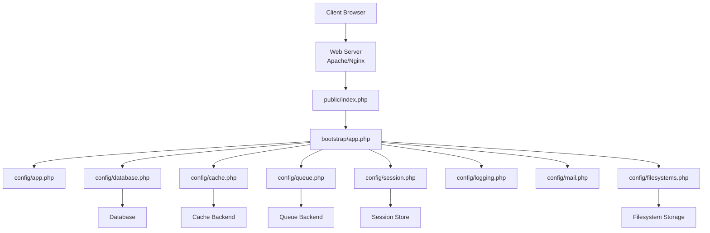
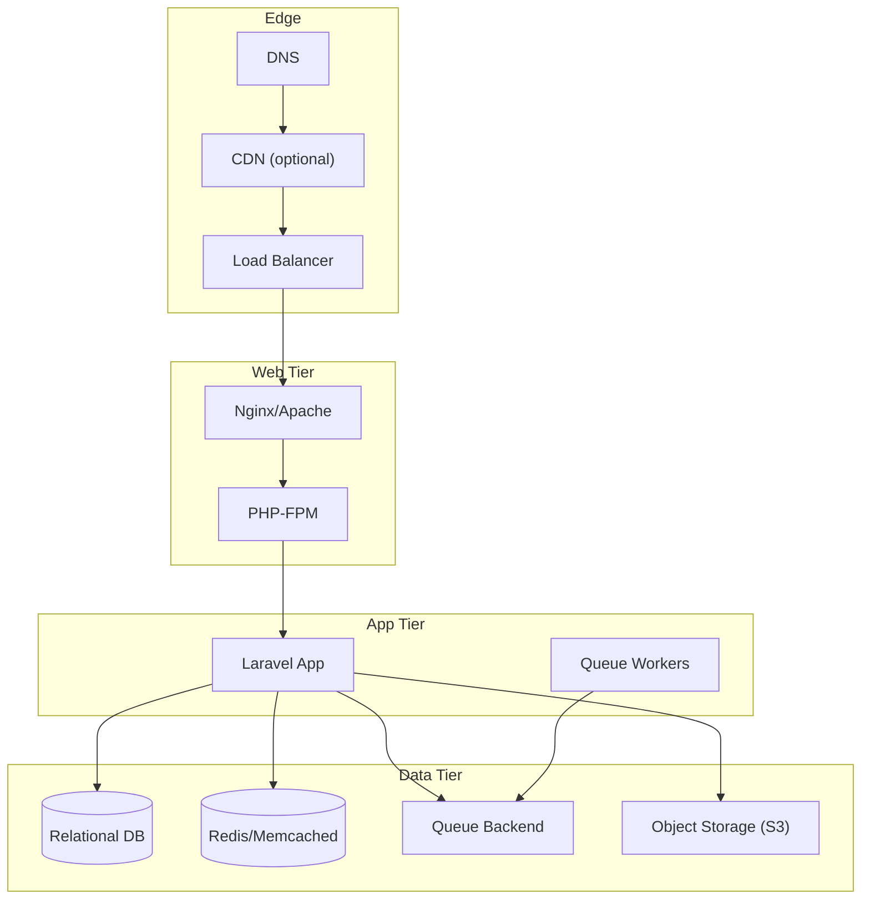
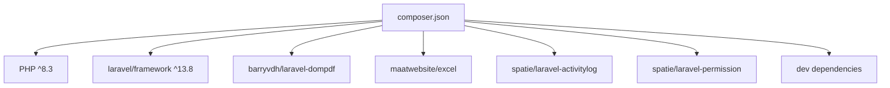
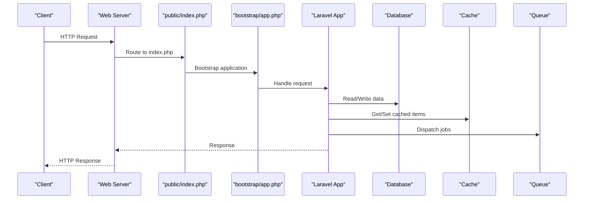

# Deployment & Configuration

<cite>
**Referenced Files in This Document**
- [composer.json](file://composer.json)
- [bootstrap/app.php](file://bootstrap/app.php)
- [public/index.php](file://public/index.php)
- [public/.htaccess](file://public/.htaccess)
- [config/app.php](file://config/app.php)
- [config/database.php](file://config/database.php)
- [config/cache.php](file://config/cache.php)
- [config/queue.php](file://config/queue.php)
- [config/session.php](file://config/session.php)
- [config/logging.php](file://config/logging.php)
- [config/mail.php](file://config/mail.php)
- [config/filesystems.php](file://config/filesystems.php)
- [.env.example](file://.env.example)
</cite>

## Table of Contents
1. Introduction
2. Project Structure
3. Core Components
4. Architecture Overview
5. Detailed Component Analysis
6. Dependency Analysis
7. Performance Considerations
8. Troubleshooting Guide
9. Conclusion
10. Appendices

## Introduction
This document provides comprehensive deployment and configuration guidance for a Laravel application, focusing on production setup, environment configuration, performance optimization, web server integration (Apache/Nginx), PHP-FPM tuning, database optimization, caching strategies, queue workers, monitoring, SSL, backups, disaster recovery, scaling, load balancing, and cloud deployment patterns. It references the actual configuration files present in the repository to ensure accuracy and traceability.

## Project Structure
The application follows standard Laravel conventions with key runtime entry points and configuration files that drive production behavior:
- Application bootstrap and routing are defined in the bootstrap layer.
- The public directory contains the front controller and Apache rewrite rules.
- Environment-specific settings are loaded from .env and referenced by config files.
- Storage, cache, sessions, queues, logging, mail, and filesystems are configured via dedicated config files.

**Diagram sources**
- [public/index.php:1-21](file://public/index.php#L1-L21)
- [bootstrap/app.php:1-26](file://bootstrap/app.php#L1-L26)
- [config/app.php:1-127](file://config/app.php#L1-L127)
- [config/database.php:1-185](file://config/database.php#L1-L185)
- [config/cache.php:1-137](file://config/cache.php#L1-L137)
- [config/queue.php:1-130](file://config/queue.php#L1-L130)
- [config/session.php:1-234](file://config/session.php#L1-L234)
- [config/logging.php:1-133](file://config/logging.php#L1-L133)
- [config/mail.php:1-119](file://config/mail.php#L1-L119)
- [config/filesystems.php:1-81](file://config/filesystems.php#L1-L81)

**Section sources**
- [public/index.php:1-21](file://public/index.php#L1-L21)
- [bootstrap/app.php:1-26](file://bootstrap/app.php#L1-L26)
- [config/app.php:1-127](file://config/app.php#L1-L127)

## Core Components
- Runtime entry point: The front controller initializes the application and handles requests.
- Application configuration: Environment, URL, timezone, locale, encryption key, maintenance mode.
- Database configuration: Multiple drivers supported; Redis connections included for cache/queue.
- Caching: Multiple stores including database, file, storage, memcached, redis, dynamodb, octane, failover.
- Queues: Default backend is database; supports redis, beanstalkd, sqs, background, deferred, failover.
- Sessions: Default driver is database; supports file, cookie, database, memcached, redis, dynamodb, array.
- Logging: Channels include single, daily, slack, papertrail, stderr, syslog, errorlog, null, stack.
- Mail: Supports smtp, ses, postmark, resend, sendmail, log, failover, roundrobin.
- Filesystems: Local, S3 disks; symbolic link for public storage.

Key operational implications:
- Production should set APP_ENV=production, APP_DEBUG=false, and configure secure APP_KEY.
- Use persistent backends for cache, session, and queue in production (e.g., Redis or database).
- Configure appropriate logging channels and levels for observability.
- Ensure storage permissions and symbolic links are correctly set.

**Section sources**
- [public/index.php:1-21](file://public/index.php#L1-L21)
- [config/app.php:1-127](file://config/app.php#L1-L127)
- [config/database.php:1-185](file://config/database.php#L1-L185)
- [config/cache.php:1-137](file://config/cache.php#L1-L137)
- [config/queue.php:1-130](file://config/queue.php#L1-L130)
- [config/session.php:1-234](file://config/session.php#L1-L234)
- [config/logging.php:1-133](file://config/logging.php#L1-L133)
- [config/mail.php:1-119](file://config/mail.php#L1-L119)
- [config/filesystems.php:1-81](file://config/filesystems.php#L1-L81)

## Architecture Overview
Production architecture typically includes:
- Web servers (Nginx/Apache) terminating TLS and proxying to PHP-FPM.
- PHP-FPM processes executing the Laravel front controller.
- Persistent data stores: relational database, cache (Redis/Memcached), queue backend (Redis/SQS/Beanstalkd), object storage (S3).
- Background workers processing queued jobs.
- Centralized logging and monitoring integrations.

[No sources needed since this diagram shows conceptual workflow, not actual code structure]

## Detailed Component Analysis

### Web Server Configuration (Apache/Nginx)
- Apache:
  - Uses .htaccess to route all non-file/directory requests to index.php.
  - Ensures Authorization and XSRF headers are forwarded to PHP.
  - Redirects trailing slashes appropriately.
- Nginx:
  - Point the document root to the public directory.
  - Enable PHP-FPM fastcgi_pass to index.php.
  - Implement similar rewrite logic as .htaccess.
  - Disable access to hidden files and sensitive paths.

Operational notes:
- Ensure mod_rewrite is enabled for Apache.
- For Nginx, use try_files to forward requests to index.php.
- Serve static assets directly and bypass PHP for improved performance.

**Section sources**
- [public/.htaccess:1-26](file://public/.htaccess#L1-L26)
- [public/index.php:1-21](file://public/index.php#L1-L21)

### PHP-FPM Settings
Recommended production considerations:
- Set process manager to pm = ondemand or pm = dynamic based on traffic patterns.
- Tune pm.max_children, pm.start_servers, pm.min_spare_servers, pm.max_spare_servers.
- Adjust request_terminate_timeout and request_slowlog_timeout.
- Enable opcache and tune memory limits.
- Ensure open_basedir and upload_max_filesize/post_max_size align with application needs.

[No sources needed since this section provides general guidance]

### Environment Configuration
Core environment variables to configure for production:
- Application identity and security: APP_NAME, APP_ENV, APP_KEY, APP_URL, APP_DEBUG, APP_LOCALE, APP_FALLBACK_LOCALE, APP_FAKER_LOCALE, APP_MAINTENANCE_DRIVER, APP_MAINTENANCE_STORE.
- Logging: LOG_CHANNEL, LOG_STACK, LOG_LEVEL, LOG_DEPRECATIONS_CHANNEL, LOG_SLACK_WEBHOOK_URL, LOG_PAPERTRAIL_HANDLER, PAPERTRAIL_URL, PAPERTRAIL_PORT.
- Database: DB_CONNECTION, DB_HOST, DB_PORT, DB_DATABASE, DB_USERNAME, DB_PASSWORD, DB_CHARSET, DB_COLLATION, MYSQL_ATTR_SSL_CA.
- Cache: CACHE_STORE, CACHE_PREFIX, REDIS_* variables for Redis-backed cache.
- Queue: QUEUE_CONNECTION, DB_QUEUE_* or REDIS_QUEUE_* depending on backend.
- Session: SESSION_DRIVER, SESSION_LIFETIME, SESSION_ENCRYPT, SESSION_PATH, SESSION_DOMAIN, SESSION_SECURE_COOKIE, SESSION_HTTP_ONLY, SESSION_SAME_SITE, SESSION_PARTITIONED_COOKIE.
- Mail: MAIL_MAILER, SMTP/SES/Postmark credentials and endpoints.
- Filesystem: FILESYSTEM_DISK, AWS_* for S3.

Security best practices:
- Never commit .env to version control.
- Generate a strong APP_KEY and rotate previous keys if necessary.
- Use HTTPS-only cookies and secure session settings.

**Section sources**
- [.env.example:1-66](file://.env.example#L1-L66)
- [config/app.php:1-127](file://config/app.php#L1-L127)
- [config/logging.php:1-133](file://config/logging.php#L1-L133)
- [config/database.php:1-185](file://config/database.php#L1-L185)
- [config/cache.php:1-137](file://config/cache.php#L1-L137)
- [config/queue.php:1-130](file://config/queue.php#L1-L130)
- [config/session.php:1-234](file://config/session.php#L1-L234)
- [config/mail.php:1-119](file://config/mail.php#L1-L119)
- [config/filesystems.php:1-81](file://config/filesystems.php#L1-L81)

### Database Optimization
- Choose an appropriate driver (mysql/mariadb/pgsql/sqlsrv) and connection parameters.
- Enable strict mode and proper charset/collation.
- Use SSL for database connections when possible (MySQL/MariaDB options available).
- Optimize indexes and queries at the schema level.
- Configure connection pooling where applicable (via RDS Proxy, PgBouncer, etc.).
- Monitor slow queries and adjust timeouts accordingly.

**Section sources**
- [config/database.php:1-185](file://config/database.php#L1-L185)

### Caching Strategies
- Select a persistent store (redis, memcached, database, storage).
- Use a consistent prefix to avoid collisions across applications.
- Consider failover stores for resilience.
- Clear caches during deployments and warm up critical caches.

**Section sources**
- [config/cache.php:1-137](file://config/cache.php#L1-L137)

### Queue Worker Setup
- Default backend is database; consider Redis or SQS for higher throughput.
- Configure retry_after and failed job handling.
- Run multiple workers per CPU core and monitor queue depth.
- Use after_commit semantics where transactional consistency is required.

**Section sources**
- [config/queue.php:1-130](file://config/queue.php#L1-L130)

### Monitoring Integration
- Centralize logs using daily rotation, syslog, or external services (Slack, Papertrail).
- Integrate health checks via /up endpoint exposed by the application bootstrap.
- Use structured logging and correlation IDs for distributed tracing.

**Section sources**
- [config/logging.php:1-133](file://config/logging.php#L1-L133)
- [bootstrap/app.php:1-26](file://bootstrap/app.php#L1-L26)

### Practical Deployment Steps
- Install dependencies and build assets using provided scripts.
- Generate application key and run migrations.
- Create storage symbolic link for public assets.
- Configure web server and PHP-FPM.
- Start queue workers and set up process supervision.
- Harden environment variables and restrict access to sensitive directories.

**Section sources**
- [composer.json:39-74](file://composer.json#L39-L74)
- [config/filesystems.php:1-81](file://config/filesystems.php#L1-L81)

### SSL Certificate Configuration
- Terminate TLS at the load balancer or web server.
- Ensure APP_URL uses https and SESSION_SECURE_COOKIE is enabled.
- Enforce HSTS and redirect HTTP to HTTPS.

[No sources needed since this section provides general guidance]

### Backup Strategies and Disaster Recovery
- Schedule regular database dumps and object storage snapshots.
- Back up application code and configuration separately from data.
- Test restore procedures periodically.
- Maintain offsite backups and define RPO/RTO targets.

[No sources needed since this section provides general guidance]

### Scaling Considerations and Load Balancing
- Scale horizontally by adding more app instances behind a load balancer.
- Use shared stateless backends for cache, session, and queue.
- Employ auto-scaling policies based on CPU/memory or queue depth.
- Separate read-heavy workloads with read replicas where supported.

[No sources needed since this section provides general guidance]

### Cloud Deployment Patterns
- Containerize the application and orchestrate with Kubernetes or ECS.
- Use managed databases, cache, and queue services.
- Leverage secrets management for sensitive configuration.
- Implement CI/CD pipelines for automated builds and rollouts.

[No sources needed since this section provides general guidance]

## Dependency Analysis
Runtime dependencies and their roles:
- PHP 8.3+ and Laravel framework.
- PDF generation and Excel export libraries.
- Activity logging and role/permission middleware.
- Development tools and testing frameworks.

**Diagram sources**
- [composer.json:1-96](file://composer.json#L1-L96)

**Section sources**
- [composer.json:1-96](file://composer.json#L1-L96)

## Performance Considerations
- Enable opcache and tune memory usage.
- Use persistent cache/session/queue backends.
- Minimize database round-trips and leverage indexing.
- Serve static assets via CDN or web server.
- Optimize queue worker concurrency and retry policies.
- Reduce logging verbosity in production and use efficient channels.

[No sources needed since this section provides general guidance]

## Troubleshooting Guide
Common issues and resolutions:
- Maintenance mode: Check presence of maintenance flag and clear it if needed.
- Permissions: Ensure storage and bootstrap/cache directories are writable.
- Symbolic link: Verify storage link exists for public assets.
- Queue failures: Inspect failed jobs table and reprocess or delete as appropriate.
- Logging: Confirm channel configuration and disk space for log rotation.
- Health check: Validate /up endpoint availability.

**Section sources**
- [public/index.php:1-21](file://public/index.php#L1-L21)
- [config/logging.php:1-133](file://config/logging.php#L1-L133)
- [config/queue.php:1-130](file://config/queue.php#L1-L130)
- [config/filesystems.php:1-81](file://config/filesystems.php#L1-L81)
- [bootstrap/app.php:1-26](file://bootstrap/app.php#L1-L26)

## Conclusion
By aligning environment variables, web server configurations, PHP-FPM tuning, database optimization, caching, queuing, and monitoring with production best practices, the application can achieve high reliability, scalability, and performance. Follow the referenced configuration files to ensure accurate and maintainable deployments across environments.

## Appendices

### Request Flow Sequence

**Diagram sources**
- [public/index.php:1-21](file://public/index.php#L1-L21)
- [bootstrap/app.php:1-26](file://bootstrap/app.php#L1-L26)
- [config/database.php:1-185](file://config/database.php#L1-L185)
- [config/cache.php:1-137](file://config/cache.php#L1-L137)
- [config/queue.php:1-130](file://config/queue.php#L1-L130)