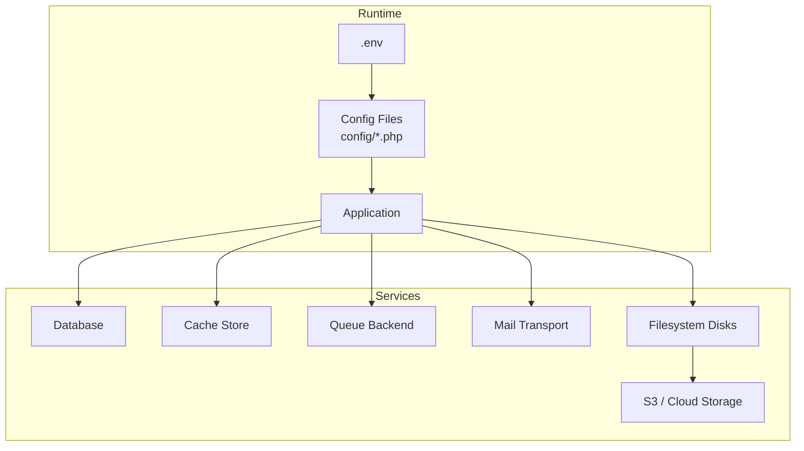
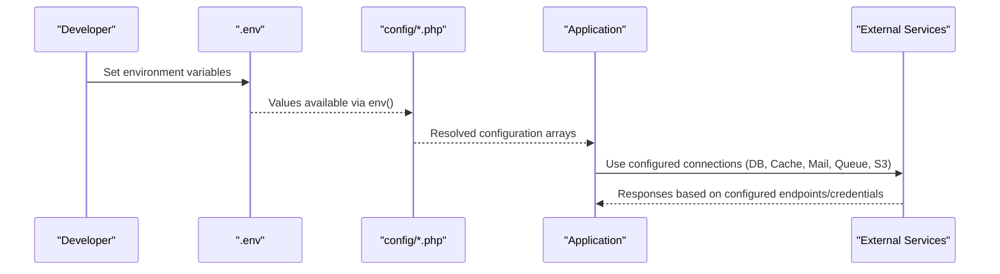
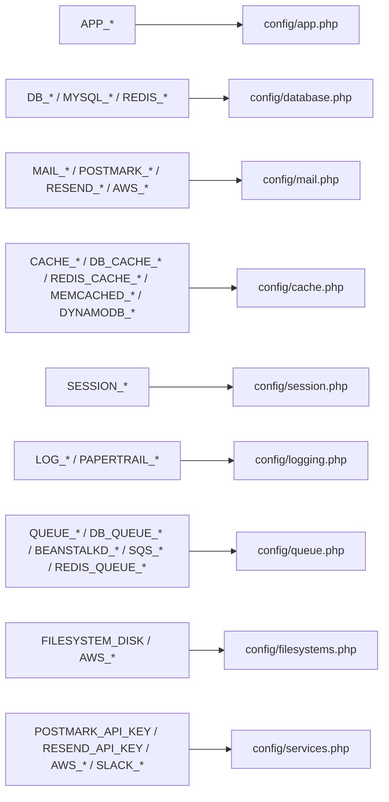

# Environment Configuration

<cite>
**Referenced Files in This Document**
- [config/app.php](file://config/app.php)
- [config/database.php](file://config/database.php)
- [config/mail.php](file://config/mail.php)
- [config/cache.php](file://config/cache.php)
- [config/session.php](file://config/session.php)
- [config/logging.php](file://config/logging.php)
- [config/queue.php](file://config/queue.php)
- [config/filesystems.php](file://config/filesystems.php)
- [config/services.php](file://config/services.php)
- [phpunit.xml](file://phpunit.xml)
</cite>

## Table of Contents
1. [Introduction](#introduction)
2. [Project Structure](#project-structure)
3. [Core Components](#core-components)
4. [Architecture Overview](#architecture-overview)
5. [Detailed Component Analysis](#detailed-component-analysis)
6. [Dependency Analysis](#dependency-analysis)
7. [Performance Considerations](#performance-considerations)
8. [Troubleshooting Guide](#troubleshooting-guide)
9. [Conclusion](#conclusion)
10. [Appendices](#appendices)

## Introduction
This document explains how to configure the application environment using .env variables and configuration files. It covers:
- .env file setup and environment detection
- Critical environment variables for app, database, mail, cache, sessions, logging, queues, filesystems, and third-party services
- Secure secret management and APP_KEY generation
- Configuration caching strategies
- Example configurations for development, staging, and production with security best practices

## Project Structure
Environment-driven settings are loaded from .env into PHP configuration files under config/. The framework reads these values at runtime to determine behavior such as debug mode, URL, encryption key, database connections, mail transport, cache store, session storage, logging channels, queue backend, and cloud service credentials.

[No sources needed since this diagram shows conceptual workflow, not actual code structure]

## Core Components
- Application core: name, environment, debug, URL, timezone, locale, encryption key, maintenance mode
- Database: default connection and per-driver options (SQLite, MySQL/MariaDB, PostgreSQL, SQL Server), Redis client and connections
- Mail: default mailer and transports (SMTP, SES, Postmark, Resend, Sendmail, Log, Array, Failover, Roundrobin)
- Cache: default store and drivers (array, database, file, storage, memcached, redis, dynamodb, octane, failover)
- Sessions: driver, lifetime, encryption, cookie attributes, serialization
- Logging: default channel and channels (single, daily, slack, papertrail, stderr, syslog, errorlog, null)
- Queues: default connection and backends (sync, database, beanstalkd, sqs, redis, deferred, background, failover)
- Filesystems: default disk and disks (local, public, s3)
- Services: API keys for Postmark, Resend, AWS SES, Slack notifications

Key environment variables are read directly from .env by each config file via env() calls.

**Section sources**
- [config/app.php:15-126](file://config/app.php#L15-L126)
- [config/database.php:20-182](file://config/database.php#L20-L182)
- [config/mail.php:17-118](file://config/mail.php#L17-L118)
- [config/cache.php:17-136](file://config/cache.php#L17-L136)
- [config/session.php:21-233](file://config/session.php#L21-L233)
- [config/logging.php:21-132](file://config/logging.php#L21-L132)
- [config/queue.php:16-129](file://config/queue.php#L16-L129)
- [config/filesystems.php:16-80](file://config/filesystems.php#L16-L80)
- [config/services.php:17-38](file://config/services.php#L17-L38)

## Architecture Overview
The application resolves environment-specific behavior through a layered approach:
- .env provides raw values
- config/*.php maps env() to typed defaults and structured arrays
- Runtime components (database, cache, mail, queue, filesystems) consume config values

[No sources needed since this diagram shows conceptual workflow, not actual code structure]

## Detailed Component Analysis

### Application Settings (APP_*)
- APP_NAME: Displayed in UI and emails
- APP_ENV: Determines environment (development, staging, production)
- APP_DEBUG: Enables detailed error pages; must be false in production
- APP_URL: Root URL used by Artisan and URL generators
- APP_LOCALE / APP_FALLBACK_LOCALE / APP_FAKER_LOCALE: Localization and test data locales
- APP_KEY: Encryption key for cookies, sessions, and encrypted payloads; must be set before use
- APP_PREVIOUS_KEYS: Comma-separated list of previous keys for rotation without invalidating existing tokens
- APP_MAINTENANCE_DRIVER / APP_MAINTENANCE_STORE: Control maintenance mode persistence

Security notes:
- Never commit APP_KEY or secrets to version control
- Rotate APP_KEY carefully using APP_PREVIOUS_KEYS to avoid breaking existing encrypted data

**Section sources**
- [config/app.php:15-126](file://config/app.php#L15-L126)

### Database Connections (DB_*, MYSQL_*, REDIS_*)
- DB_CONNECTION: Default connection (sqlite, mysql, mariadb, pgsql, sqlsrv)
- DB_URL: Optional unified DSN-style URL for any supported driver
- Per-driver fields: host, port, database, username, password, charset, collation, prefix, strict, SSL options
- Redis client and connections: client, cluster, prefix, persistent, default and cache connections including host, port, username, password, database, retry/backoff parameters

Best practices:
- Prefer DB_URL where possible for concise configuration
- Enable SSL/TLS for databases when available
- Separate Redis connections for default and cache to isolate workloads

**Section sources**
- [config/database.php:20-182](file://config/database.php#L20-L182)

### Mail Configuration (MAIL_*, POSTMARK_*, RESEND_*, AWS_*)
- MAIL_MAILER: Default mailer (smtp, ses, postmark, resend, sendmail, log, array, failover, roundrobin)
- SMTP: scheme, url, host, port, username, password, timeout, local_domain
- SES/Postmark/Resend: transport-specific keys and optional client settings
- From address and name derived from MAIL_FROM_ADDRESS and MAIL_FROM_NAME (or APP_NAME)

Operational tips:
- Use log or array mailers in development
- Use failover or roundrobin for resilience in production
- Ensure MAIL_FROM_ADDRESS is verified with providers like SES or Postmark

**Section sources**
- [config/mail.php:17-118](file://config/mail.php#L17-L118)
- [config/services.php:17-38](file://config/services.php#L17-L38)

### Cache Configuration (CACHE_*, DB_CACHE_*, REDIS_CACHE_*, MEMCACHED_*, DYNAMODB_*)
- CACHE_STORE: Default store (array, database, file, storage, memcached, redis, dynamodb, octane, failover)
- Database store: DB_CACHE_CONNECTION, DB_CACHE_TABLE, lock connection/table
- File store: path under storage/framework/cache/data
- Storage store: disk and path
- Memcached: host, port, auth
- Redis: connection names for cache and locks
- DynamoDB: AWS keys, region, table, endpoint
- Key prefixing via CACHE_PREFIX and APP_NAME

Recommendations:
- Use Redis or Memcached in production for performance
- Prefix caches per application to avoid collisions
- Keep serializable_classes disabled unless required

**Section sources**
- [config/cache.php:17-136](file://config/cache.php#L17-L136)

### Session Configuration (SESSION_*)
- SESSION_DRIVER: file, cookie, database, memcached, redis, dynamodb, array
- SESSION_LIFETIME, SESSION_EXPIRE_ON_CLOSE
- SESSION_ENCRYPT: encrypt session payload
- Connection/table for database-backed sessions
- Cookie attributes: name, path, domain, secure, http_only, same_site, partitioned
- Serialization strategy: json (default) vs php (not recommended due to gadget chain risks)

Security guidance:
- Use secure and http_only cookies in production
- Prefer database or Redis for distributed deployments
- Avoid php serialization unless absolutely necessary

**Section sources**
- [config/session.php:21-233](file://config/session.php#L21-L233)

### Logging Configuration (LOG_*, PAPERTRAIL_*)
- LOG_CHANNEL: default channel (stack, single, daily, slack, papertrail, stderr, syslog, errorlog, null)
- Stack composition via LOG_STACK
- Level and retention controls (e.g., LOG_LEVEL, LOG_DAILY_DAYS)
- Slack webhook and identity
- Papertrail TLS connection string built from PAPERTRAIL_URL and PAPERTRAIL_PORT

Production advice:
- Centralize logs with daily rotation or external systems (Slack, Papertrail, syslog)
- Reduce verbosity in production (e.g., warning/error levels)

**Section sources**
- [config/logging.php:21-132](file://config/logging.php#L21-L132)

### Queue Configuration (QUEUE_*, DB_QUEUE_*, BEANSTALKD_*, SQS_*, REDIS_QUEUE_*)
- QUEUE_CONNECTION: sync, database, beanstalkd, sqs, redis, deferred, background, failover
- Database queue: connection, table, queue name, retry_after, after_commit
- Beanstalkd: host, queue, retry_after, block_for
- SQS: AWS keys, prefix/suffix, queue, region, after_commit
- Redis: connection, queue, retry_after, block_for, after_commit
- Failed jobs: driver, database, table

Operational notes:
- Use sync only in development
- For multi-process workers, tune retry_after and timeouts
- Persist failed jobs for observability and retries

**Section sources**
- [config/queue.php:16-129](file://config/queue.php#L16-L129)

### Filesystem Configuration (FILESYSTEM_DISK, AWS_*)
- FILESYSTEM_DISK: default disk (local, public, s3)
- Local/public roots and visibility
- S3 disk: key, secret, region, bucket, url, endpoint, path style flag

Guidance:
- Use S3 for scalable object storage in production
- Ensure storage links exist for public assets

**Section sources**
- [config/filesystems.php:16-80](file://config/filesystems.php#L16-L80)

### Third-Party Services (POSTMARK_API_KEY, RESEND_API_KEY, AWS_*, SLACK_*)
- Postmark API key
- Resend API key
- AWS SES access key, secret, region
- Slack bot token and default channel

Ensure these are provided via .env or platform secret managers and never committed to source control.

**Section sources**
- [config/services.php:17-38](file://config/services.php#L17-L38)

## Dependency Analysis
Environment variables flow from .env into multiple config modules. The following diagram highlights key dependencies between environment variables and their consumers.

**Diagram sources**
- [config/app.php:15-126](file://config/app.php#L15-L126)
- [config/database.php:20-182](file://config/database.php#L20-L182)
- [config/mail.php:17-118](file://config/mail.php#L17-L118)
- [config/cache.php:17-136](file://config/cache.php#L17-L136)
- [config/session.php:21-233](file://config/session.php#L21-L233)
- [config/logging.php:21-132](file://config/logging.php#L21-L132)
- [config/queue.php:16-129](file://config/queue.php#L16-L129)
- [config/filesystems.php:16-80](file://config/filesystems.php#L16-L80)
- [config/services.php:17-38](file://config/services.php#L17-L38)

**Section sources**
- [config/app.php:15-126](file://config/app.php#L15-L126)
- [config/database.php:20-182](file://config/database.php#L20-L182)
- [config/mail.php:17-118](file://config/mail.php#L17-L118)
- [config/cache.php:17-136](file://config/cache.php#L17-L136)
- [config/session.php:21-233](file://config/session.php#L21-L233)
- [config/logging.php:21-132](file://config/logging.php#L21-L132)
- [config/queue.php:16-129](file://config/queue.php#L16-L129)
- [config/filesystems.php:16-80](file://config/filesystems.php#L16-L80)
- [config/services.php:17-38](file://config/services.php#L17-L38)

## Performance Considerations
- Choose high-performance cache stores (Redis/Memcached) and separate cache/connection pools for isolation
- Use database-backed sessions and queues for horizontal scaling
- Configure appropriate retry/backoff for Redis and queue consumers
- Rotate logs and limit verbosity in production
- Prefer DB_URL for concise and consistent database configuration across environments

[No sources needed since this section provides general guidance]

## Troubleshooting Guide
Common issues and checks:
- Missing APP_KEY: Generate a new key and ensure it is set in .env; do not commit secrets
- Debug enabled in production: Verify APP_DEBUG=false and APP_ENV=production
- Database connectivity: Validate DB_CONNECTION, DB_URL or host/port/database/username/password; check SSL options if required
- Mail delivery failures: Confirm MAIL_MAILER and transport credentials; verify sender address is allowed/verified
- Cache errors: Ensure selected CACHE_STORE is reachable and prefixed appropriately
- Session loss across processes: Use database or Redis session driver and correct connection settings
- Queue processing stalls: Tune retry_after, worker concurrency, and monitor failed jobs
- Logging not captured: Check LOG_CHANNEL and destination availability (files, Slack, Papertrail)

**Section sources**
- [config/app.php:28-42](file://config/app.php#L28-L42)
- [config/database.php:20-116](file://config/database.php#L20-L116)
- [config/mail.php:17-118](file://config/mail.php#L17-L118)
- [config/cache.php:17-136](file://config/cache.php#L17-L136)
- [config/session.php:21-233](file://config/session.php#L21-L233)
- [config/logging.php:21-132](file://config/logging.php#L21-L132)
- [config/queue.php:16-129](file://config/queue.php#L16-L129)

## Conclusion
A robust environment configuration hinges on:
- Correctly setting critical variables in .env
- Using secure defaults and disabling debug in production
- Selecting appropriate backends for cache, sessions, queues, and storage
- Managing secrets safely and rotating keys when necessary
- Applying environment-specific tuning for performance and reliability

[No sources needed since this section summarizes without analyzing specific files]

## Appendices

### .env Setup and Environment Detection
- Create a .env file at the project root with all required variables
- Environment detection is driven by APP_ENV; the framework uses this value to tailor behavior
- Tests override certain variables via phpunit.xml for isolated runs

Example overrides in tests:
- APP_ENV=testing
- CACHE_STORE=array
- DB_CONNECTION=sqlite with :memory:
- MAIL_MAILER=array
- QUEUE_CONNECTION=sync
- SESSION_DRIVER=array

**Section sources**
- [phpunit.xml:20-35](file://phpunit.xml#L20-L35)

### APP_KEY Generation and Rotation
- Generate a new key using the framework’s key generation command
- After updating APP_KEY, optionally add the old key to APP_PREVIOUS_KEYS to maintain decryption of existing data
- Ensure APP_KEY is present and unique per environment

**Section sources**
- [config/app.php:98-106](file://config/app.php#L98-L106)

### Security Best Practices
- Never commit .env or secrets to version control
- Use platform secret managers or deployment pipelines to inject secrets
- Disable debug and enable HTTPS-only cookies in production
- Restrict logging levels and rotate logs regularly
- Use strong passwords and least-privilege credentials for databases and services

[No sources needed since this section provides general guidance]

### Example Configurations

Development
- APP_ENV=development
- APP_DEBUG=true
- APP_URL=http://localhost:8000
- DB_CONNECTION=sqlite (or mysql/mariadb with local credentials)
- CACHE_STORE=array
- SESSION_DRIVER=file or database
- MAIL_MAILER=log or array
- QUEUE_CONNECTION=sync
- FILESYSTEM_DISK=local

Staging
- APP_ENV=staging
- APP_DEBUG=false
- APP_URL=https://staging.example.com
- DB_CONNECTION=mysql or mariadb with staging credentials
- CACHE_STORE=redis
- SESSION_DRIVER=database or redis
- MAIL_MAILER=smtp or ses/postmark/resend
- QUEUE_CONNECTION=redis or database
- FILESYSTEM_DISK=s3

Production
- APP_ENV=production
- APP_DEBUG=false
- APP_URL=https://app.example.com
- DB_CONNECTION=mysql or mariadb with hardened credentials and SSL
- CACHE_STORE=redis or memcached
- SESSION_DRIVER=database or redis with secure cookies
- MAIL_MAILER=failover or roundrobin with verified providers
- QUEUE_CONNECTION=redis or sqs with tuned retry_after
- FILESYSTEM_DISK=s3
- LOG_CHANNEL=daily or stack with centralized sinks

[No sources needed since this section provides example patterns]