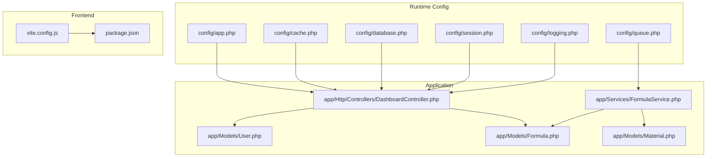
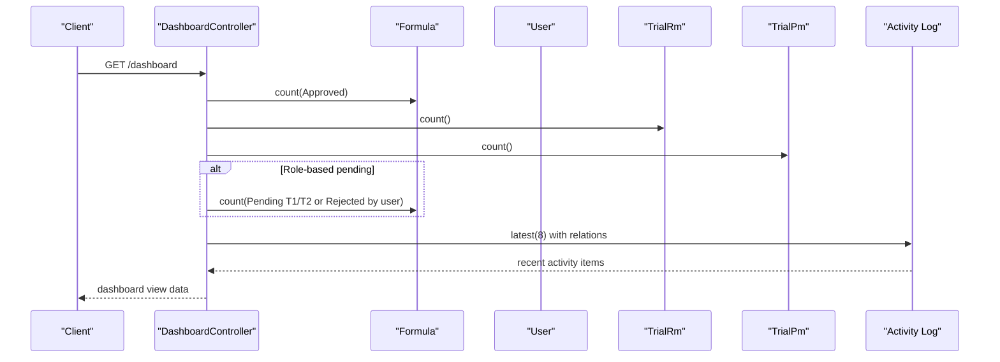
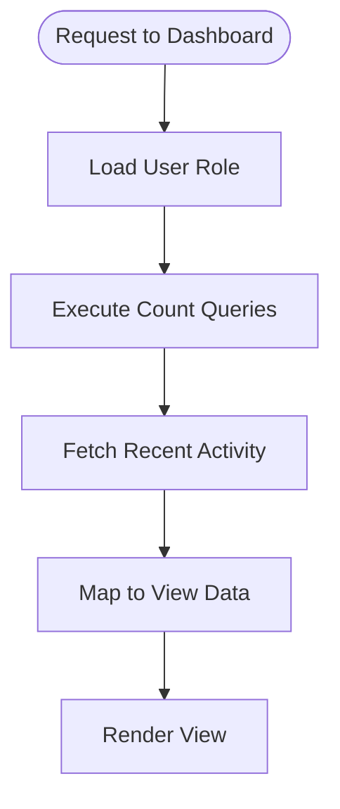
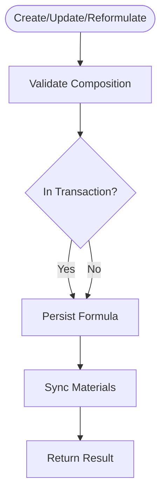
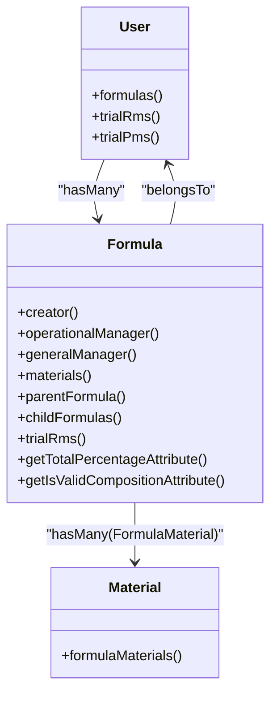
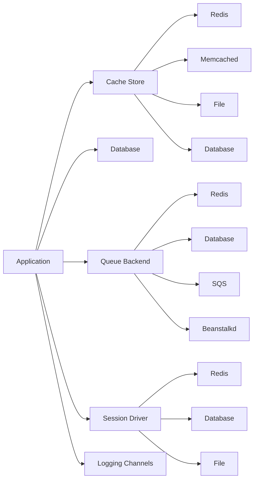

# Performance Optimization

<cite>
**Referenced Files in This Document**
- [config/app.php](file://config/app.php)
- [config/cache.php](file://config/cache.php)
- [config/database.php](file://config/database.php)
- [config/queue.php](file://config/queue.php)
- [config/session.php](file://config/session.php)
- [config/logging.php](file://config/logging.php)
- [vite.config.js](file://vite.config.js)
- [package.json](file://package.json)
- [app/Http/Controllers/DashboardController.php](file://app/Http/Controllers/DashboardController.php)
- [app/Services/FormulaService.php](file://app/Services/FormulaService.php)
- [app/Models/User.php](file://app/Models/User.php)
- [app/Models/Formula.php](file://app/Models/Formula.php)
- [app/Models/Material.php](file://app/Models/Material.php)
</cite>

## Table of Contents
1. [Introduction](#introduction)
2. [Project Structure](#project-structure)
3. [Core Components](#core-components)
4. [Architecture Overview](#architecture-overview)
5. [Detailed Component Analysis](#detailed-component-analysis)
6. [Dependency Analysis](#dependency-analysis)
7. [Performance Considerations](#performance-considerations)
8. [Troubleshooting Guide](#troubleshooting-guide)
9. [Conclusion](#conclusion)
10. [Appendices](#appendices)

## Introduction
This document provides a comprehensive performance optimization guide for the R&D Management System built on Laravel. It covers application tuning, database and Eloquent optimizations, caching strategies (Redis/Memcached), queue worker configuration, frontend asset pipeline with Vite, image optimization, CDN integration, monitoring setup, profiling tools, and performance testing methodologies tailored to this codebase.

## Project Structure
The project follows standard Laravel conventions:
- Configuration files under config/ control runtime behavior for app, cache, database, queue, session, and logging.
- Application logic resides in app/, including Controllers, Models, Services, and Policies.
- Frontend assets are compiled via Vite using resources/css/app.css and resources/js/app.js.
- Database migrations and seeders define schema and sample data.

**Diagram sources**
- [config/app.php:1-127](file://config/app.php#L1-L127)
- [config/cache.php:1-137](file://config/cache.php#L1-L137)
- [config/database.php:1-185](file://config/database.php#L1-L185)
- [config/queue.php:1-130](file://config/queue.php#L1-L130)
- [config/session.php:1-234](file://config/session.php#L1-L234)
- [config/logging.php:1-133](file://config/logging.php#L1-L133)
- [vite.config.js:1-12](file://vite.config.js#L1-L12)
- [package.json:1-24](file://package.json#L1-L24)
- [app/Http/Controllers/DashboardController.php:1-149](file://app/Http/Controllers/DashboardController.php#L1-L149)
- [app/Services/FormulaService.php:1-228](file://app/Services/FormulaService.php#L1-L228)
- [app/Models/User.php:1-50](file://app/Models/User.php#L1-L50)
- [app/Models/Formula.php:1-89](file://app/Models/Formula.php#L1-L89)
- [app/Models/Material.php:1-33](file://app/Models/Material.php#L1-L33)

**Section sources**
- [config/app.php:1-127](file://config/app.php#L1-L127)
- [config/cache.php:1-137](file://config/cache.php#L1-L137)
- [config/database.php:1-185](file://config/database.php#L1-L185)
- [config/queue.php:1-130](file://config/queue.php#L1-L130)
- [config/session.php:1-234](file://config/session.php#L1-L234)
- [config/logging.php:1-133](file://config/logging.php#L1-L133)
- [vite.config.js:1-12](file://vite.config.js#L1-L12)
- [package.json:1-24](file://package.json#L1-L24)

## Core Components
- Application runtime settings: environment, debug mode, timezone, locale, maintenance driver.
- Cache subsystem: default store, multiple stores (database, file, memcached, redis, failover), key prefixing.
- Database subsystem: default connection, MySQL/MariaDB/PostgreSQL/SQLSRV/SQLite connections, Redis client options.
- Queue subsystem: default backend (database), Redis/SQS/Beanstalkd support, job batching and failed jobs handling.
- Session subsystem: driver selection (database by default), lifetime, cookie attributes, serialization strategy.
- Logging subsystem: channels (stack, single, daily, slack, papertrail, stderr, syslog, errorlog, null).
- Frontend build: Vite plugin with inputs for CSS and JS; dev/build scripts.

Key performance implications:
- Debug mode disabled in production reduces overhead.
- Choosing fast cache backends (Redis/Memcached) improves read-heavy workloads.
- Proper DB connection tuning and indexing reduce query latency.
- Queues offload heavy tasks; Redis-backed queues provide low-latency processing.
- JSON session serialization is secure and efficient.
- Centralized logging enables observability without impacting performance when configured correctly.
- Vite builds produce optimized assets for production.

**Section sources**
- [config/app.php:1-127](file://config/app.php#L1-L127)
- [config/cache.php:1-137](file://config/cache.php#L1-L137)
- [config/database.php:1-185](file://config/database.php#L1-L185)
- [config/queue.php:1-130](file://config/queue.php#L1-L130)
- [config/session.php:1-234](file://config/session.php#L1-L234)
- [config/logging.php:1-133](file://config/logging.php#L1-L133)
- [vite.config.js:1-12](file://vite.config.js#L1-L12)
- [package.json:1-24](file://package.json#L1-L24)

## Architecture Overview
High-level request flow emphasizing performance-critical paths:
- DashboardController performs multiple counts and activity queries per request.
- FormulaService orchestrates formula lifecycle operations with transactions and material synchronization.
- Models encapsulate relationships and computed attributes used across controllers/services.

**Diagram sources**
- [app/Http/Controllers/DashboardController.php:14-103](file://app/Http/Controllers/DashboardController.php#L14-L103)
- [app/Models/Formula.php:1-89](file://app/Models/Formula.php#L1-L89)
- [app/Models/User.php:1-50](file://app/Models/User.php#L1-L50)

## Detailed Component Analysis

### Dashboard Query Optimization
Observations:
- Multiple aggregate queries per request (counts by status).
- Activity log retrieval with eager loading and mapping.
- Role-based branching affects which counts are executed.

Recommendations:
- Cache aggregated counts keyed by role and time window.
- Use database indexes on approval_status and created_by columns.
- Limit activity log joins and select only needed fields.
- Consider denormalization or summary tables for high-frequency dashboards.

**Diagram sources**
- [app/Http/Controllers/DashboardController.php:14-103](file://app/Http/Controllers/DashboardController.php#L14-L103)

**Section sources**
- [app/Http/Controllers/DashboardController.php:14-103](file://app/Http/Controllers/DashboardController.php#L14-L103)

### Formula Service Workflows
Observations:
- Uses database transactions for create/update/reformulate.
- Validates composition totals and enforces business rules.
- Synchronizes materials by deleting and recreating entries.

Recommendations:
- Batch insert materials instead of individual creates where possible.
- Avoid unnecessary fresh() calls if not required by caller.
- Add indexes on frequently filtered columns (e.g., parent_formula_id, approval_status).

**Diagram sources**
- [app/Services/FormulaService.php:35-72](file://app/Services/FormulaService.php#L35-L72)
- [app/Services/FormulaService.php:155-190](file://app/Services/FormulaService.php#L155-L190)

**Section sources**
- [app/Services/FormulaService.php:1-228](file://app/Services/FormulaService.php#L1-L228)

### Eloquent Models and Relationships
- User model defines hasMany relationships to formulas and trials.
- Formula model includes relationships to users and materials, plus computed attributes for total percentage and validity.
- Material model defines relationship to formula materials.

Optimization tips:
- Use with() to eager load relationships in list views to avoid N+1 queries.
- Select only required columns for large datasets.
- Keep casts minimal and necessary.

**Diagram sources**
- [app/Models/User.php:34-48](file://app/Models/User.php#L34-L48)
- [app/Models/Formula.php:38-87](file://app/Models/Formula.php#L38-L87)
- [app/Models/Material.php:27-31](file://app/Models/Material.php#L27-L31)

**Section sources**
- [app/Models/User.php:1-50](file://app/Models/User.php#L1-L50)
- [app/Models/Formula.php:1-89](file://app/Models/Formula.php#L1-L89)
- [app/Models/Material.php:1-33](file://app/Models/Material.php#L1-L33)

## Dependency Analysis
Configuration-driven dependencies influence runtime performance:
- Default cache store can be switched to Redis/Memcached for faster reads.
- Default queue backend is database; switching to Redis reduces latency.
- Session storage defaults to database; consider Redis for distributed sessions.
- Logging channels allow centralized collection and rotation.

**Diagram sources**
- [config/cache.php:18-106](file://config/cache.php#L18-L106)
- [config/queue.php:16-92](file://config/queue.php#L16-L92)
- [config/session.php:21-104](file://config/session.php#L21-L104)
- [config/database.php:146-182](file://config/database.php#L146-L182)

**Section sources**
- [config/cache.php:18-106](file://config/cache.php#L18-L106)
- [config/queue.php:16-92](file://config/queue.php#L16-L92)
- [config/session.php:21-104](file://config/session.php#L21-L104)
- [config/database.php:146-182](file://config/database.php#L146-L182)

## Performance Considerations

### Application Tuning
- Disable debug mode in production to reduce overhead.
- Set appropriate timezone and locale to avoid conversion costs.
- Configure maintenance mode driver for multi-machine deployments.

**Section sources**
- [config/app.php:29-42](file://config/app.php#L29-L42)
- [config/app.php:68-85](file://config/app.php#L68-L85)
- [config/app.php:121-124](file://config/app.php#L121-L124)

### Caching Strategies (Redis/Memcached)
- Switch default cache store to Redis or Memcached for high-throughput environments.
- Use separate Redis connections for cache and default operations to isolate workloads.
- Enable key prefixing to avoid collisions across applications.
- Consider failover stores for resilience.

**Section sources**
- [config/cache.php:18-106](file://config/cache.php#L18-L106)
- [config/cache.php:121-121](file://config/cache.php#L121-L121)
- [config/database.php:146-182](file://config/database.php#L146-L182)

### Database Optimization
- Ensure proper indexing on frequently queried columns (approval_status, created_by, parent_formula_id).
- Use specific selects and limit results in list views.
- Prefer raw SQL or query builder for complex aggregations when Eloquent becomes too heavy.
- Tune connection options (charset, collation, SSL) for your DB engine.

**Section sources**
- [config/database.php:47-85](file://config/database.php#L47-L85)
- [config/database.php:87-100](file://config/database.php#L87-L100)
- [config/database.php:102-115](file://config/database.php#L102-L115)

### Eloquent Model Optimization
- Eager load relationships to prevent N+1 queries.
- Use casts judiciously; avoid expensive transformations in accessors unless cached.
- Keep fillable lists minimal to reduce mass assignment overhead.

**Section sources**
- [app/Models/User.php:26-32](file://app/Models/User.php#L26-L32)
- [app/Models/Formula.php:27-29](file://app/Models/Formula.php#L27-L29)
- [app/Models/Formula.php:78-87](file://app/Models/Formula.php#L78-L87)

### Queue Worker Configuration
- Choose Redis-backed queues for lower latency and better throughput.
- Configure retry_after and block_for based on job durations.
- Use job batching for long-running workflows and monitor failed jobs.

**Section sources**
- [config/queue.php:16-92](file://config/queue.php#L16-L92)
- [config/queue.php:105-108](file://config/queue.php#L105-L108)
- [config/queue.php:123-127](file://config/queue.php#L123-L127)

### Session Optimization
- Use Redis or Memcached for session storage in distributed setups.
- Adjust session lifetime and cookie attributes for security and performance.
- Keep session payloads small; prefer storing references and fetching details on demand.

**Section sources**
- [config/session.php:21-35](file://config/session.php#L21-L35)
- [config/session.php:130-133](file://config/session.php#L130-L133)
- [config/session.php:231-231](file://config/session.php#L231-L231)

### Frontend Asset Pipeline (Vite)
- Use production build to generate optimized assets.
- Leverage browser caching via versioned filenames produced by Vite.
- Consider integrating CDN for static assets to reduce origin load.

**Section sources**
- [vite.config.js:4-11](file://vite.config.js#L4-L11)
- [package.json:5-8](file://package.json#L5-L8)

### Image Optimization and CDN Integration
- Pre-optimize images (WebP/AVIF) and serve responsive sizes.
- Offload images to CDN; configure cache headers for long TTLs.
- Lazy-load images and use modern formats to reduce bandwidth.

[No sources needed since this section provides general guidance]

### Monitoring Setup and Profiling Tools
- Centralize logs using stack/daily/slack/papertrail channels.
- Integrate APM tools (e.g., Laravel Telescope, New Relic, Sentry) for request tracing and error tracking.
- Monitor queue metrics (processing times, failures) and cache hit ratios.

**Section sources**
- [config/logging.php:53-130](file://config/logging.php#L53-L130)

### Performance Testing Methodologies
- Load testing with tools like k6 or Artillery to simulate concurrent users.
- Benchmark critical endpoints (dashboard, approvals) before and after optimizations.
- Measure database query execution times and identify slow queries.
- Validate cache effectiveness by comparing hit rates pre/post changes.

[No sources needed since this section provides general guidance]

## Troubleshooting Guide
Common issues and resolutions:
- Slow dashboard loads: add indexes, cache aggregates, reduce activity log joins.
- High DB contention: switch to Redis-backed cache and sessions; tune connection pools.
- Queue bottlenecks: move to Redis backend, adjust workers and retry policies.
- Excessive logging: set appropriate log levels and rotate logs daily.

Actionable checks:
- Verify CACHE_STORE and REDIS_CACHE_CONNECTION configurations.
- Confirm QUEUE_CONNECTION and REDIS_QUEUE settings.
- Review SESSION_DRIVER and related Redis/file paths.
- Inspect LOG_CHANNEL and LOG_LEVEL for noise reduction.

**Section sources**
- [config/cache.php:18-106](file://config/cache.php#L18-L106)
- [config/queue.php:16-92](file://config/queue.php#L16-L92)
- [config/session.php:21-104](file://config/session.php#L21-L104)
- [config/logging.php:53-130](file://config/logging.php#L53-L130)

## Conclusion
By aligning configuration choices with workload characteristics—fast caches, robust queues, tuned databases, and optimized frontends—the R&D Management System can achieve significant performance gains. Focus on reducing N+1 queries, leveraging caching strategically, and centralizing observability to maintain stability at scale.

[No sources needed since this section summarizes without analyzing specific files]

## Appendices

### Quick Configuration Checklist
- Production: disable debug, set APP_ENV=production, configure APP_URL.
- Cache: set CACHE_STORE=redis or memcached; ensure Redis/Memcached connectivity.
- Database: choose mysql/mariadb/pgsql/sqlsrv; enable strict mode and proper charset/collation.
- Queue: set QUEUE_CONNECTION=redis; configure retry_after and failed jobs table.
- Session: set SESSION_DRIVER=redis or memcached; adjust lifetime and cookie settings.
- Logging: set LOG_CHANNEL=daily or stack; configure Slack/Papertrail as needed.
- Frontend: run npm run build for production assets; integrate CDN for static delivery.

**Section sources**
- [config/app.php:29-55](file://config/app.php#L29-L55)
- [config/cache.php:18-106](file://config/cache.php#L18-L106)
- [config/database.php:47-115](file://config/database.php#L47-L115)
- [config/queue.php:16-92](file://config/queue.php#L16-L92)
- [config/session.php:21-104](file://config/session.php#L21-L104)
- [config/logging.php:53-130](file://config/logging.php#L53-L130)
- [package.json:5-8](file://package.json#L5-L8)