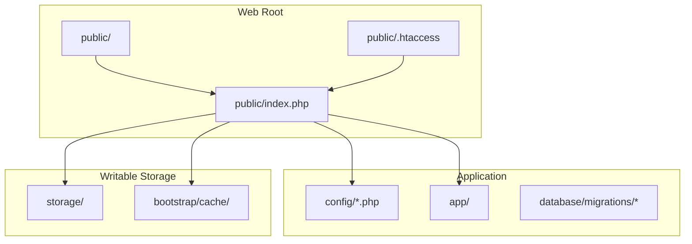
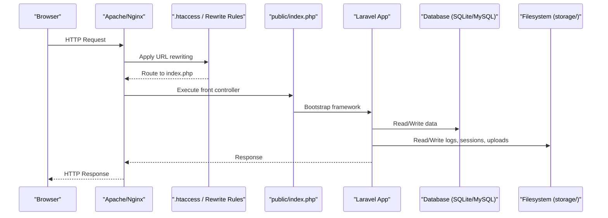

# Server Requirements & Setup

<cite>
**Referenced Files in This Document**
- [composer.json](file://composer.json)
- [config/app.php](file://config/app.php)
- [config/database.php](file://config/database.php)
- [config/filesystems.php](file://config/filesystems.php)
- [config/session.php](file://config/session.php)
- [config/cache.php](file://config/cache.php)
- [config/queue.php](file://config/queue.php)
- [config/logging.php](file://config/logging.php)
- [public/.htaccess](file://public/.htaccess)
</cite>

## Table of Contents
1. Introduction
2. Project Structure
3. Core Components
4. Architecture Overview
5. Detailed Component Analysis
6. Dependency Analysis
7. Performance Considerations
8. Troubleshooting Guide
9. Conclusion

## Introduction
This document specifies the server requirements and setup procedures for the R&D Management System. It covers PHP version and extensions, memory limits, file permissions, web server configuration (Apache and Nginx), database options (MySQL and SQLite), storage directory permissions, system-level dependencies, and step-by-step installation guidance for shared hosting, VPS, and cloud platforms.

## Project Structure
The application is a Laravel-based project with standard directories for application code, configuration, public assets, storage, and database migrations. The web entry point is under the public directory, and writable directories are located under storage and bootstrap/cache.

**Diagram sources**
- [public/.htaccess:1-26](file://public/.htaccess#L1-L26)
- [config/app.php:1-127](file://config/app.php#L1-L127)
- [config/database.php:1-185](file://config/database.php#L1-L185)
- [config/filesystems.php:1-81](file://config/filesystems.php#L1-L81)
- [config/session.php:1-234](file://config/session.php#L1-L234)
- [config/cache.php:1-137](file://config/cache.php#L1-L137)
- [config/queue.php:1-130](file://config/queue.php#L1-L130)
- [config/logging.php:1-133](file://config/logging.php#L1-L133)

**Section sources**
- [public/.htaccess:1-26](file://public/.htaccess#L1-L26)
- [config/app.php:1-127](file://config/app.php#L1-L127)
- [config/database.php:1-185](file://config/database.php#L1-L185)
- [config/filesystems.php:1-81](file://config/filesystems.php#L1-L81)
- [config/session.php:1-234](file://config/session.php#L1-L234)
- [config/cache.php:1-137](file://config/cache.php#L1-L137)
- [config/queue.php:1-130](file://config/queue.php#L1-L130)
- [config/logging.php:1-133](file://config/logging.php#L1-L133)

## Core Components
- Web server routing to front controller via .htaccess rules.
- Application runtime configured through environment-driven settings.
- Database connections for SQLite and MySQL/MariaDB.
- Filesystem disks for local storage and optional S3.
- Session and cache backends configurable via environment variables.
- Queue backend defaults to database.
- Logging channels including single/daily files and stderr/syslog.

Key implications for deployment:
- Ensure mod_rewrite is enabled for Apache or equivalent rewrite rules for Nginx.
- Provide correct database credentials and ensure required PDO drivers are available.
- Make storage and bootstrap/cache writable by the web server user.
- Configure session and cache stores appropriately for production.

**Section sources**
- [public/.htaccess:1-26](file://public/.htaccess#L1-L26)
- [config/app.php:1-127](file://config/app.php#L1-L127)
- [config/database.php:1-185](file://config/database.php#L1-L185)
- [config/filesystems.php:1-81](file://config/filesystems.php#L1-L81)
- [config/session.php:1-234](file://config/session.php#L1-L234)
- [config/cache.php:1-137](file://config/cache.php#L1-L137)
- [config/queue.php:1-130](file://config/queue.php#L1-L130)
- [config/logging.php:1-133](file://config/logging.php#L1-L133)

## Architecture Overview
High-level request flow from browser to application and data layer.

**Diagram sources**
- [public/.htaccess:1-26](file://public/.htaccess#L1-L26)
- [config/database.php:1-185](file://config/database.php#L1-L185)
- [config/filesystems.php:1-81](file://config/filesystems.php#L1-L81)
- [config/session.php:1-234](file://config/session.php#L1-L234)
- [config/logging.php:1-133](file://config/logging.php#L1-L133)

## Detailed Component Analysis

### PHP Runtime Requirements
- Minimum PHP version: 8.3+
- Recommended platform target: 8.3.x
- Required PHP extensions (based on configuration checks and common framework needs):
  - Core: openssl, pdo, mbstring, tokenizer, xml, ctype, json, curl, fileinfo, zip
  - Database: pdo_sqlite (for SQLite), pdo_mysql (for MySQL/MariaDB)
  - Optional but recommended: bcmath, gmp, intl, sodium, pcntl (for queue workers), redis (if using Redis)
- Memory limit:
  - Set php.ini memory_limit to at least 256M; increase if processing large exports or PDFs.
- Timezone and locale:
  - Default timezone is UTC; set APP_TIMEZONE accordingly if needed.
- Environment variables:
  - APP_NAME, APP_ENV, APP_DEBUG, APP_URL, APP_KEY must be configured.

**Section sources**
- [composer.json:1-96](file://composer.json#L1-L96)
- [config/app.php:1-127](file://config/app.php#L1-L127)
- [config/database.php:1-185](file://config/database.php#L1-L185)

### Web Server Configuration

#### Apache
- Enable modules:
  - mod_rewrite
  - mod_negotiation (optional, used to disable MultiViews and Indexes)
- Document root:
  - Point to the project’s public directory.
- Directory options:
  - AllowOverride All so that .htaccess is honored.
- Security headers (recommended):
  - X-Frame-Options: DENY or SAMEORIGIN
  - X-Content-Type-Options: nosniff
  - X-XSS-Protection: 1; mode=block
  - Referrer-Policy: strict-origin-when-cross-origin
  - Content-Security-Policy: configure per application needs
- SSL:
  - Use HTTPS with valid certificates; set SESSION_SECURE_COOKIE=true and APP_URL=https://...

**Section sources**
- [public/.htaccess:1-26](file://public/.htaccess#L1-L26)

#### Nginx
- Document root:
  - Point to the project’s public directory.
- Try files and fallback:
  - If the requested URI is not a file or directory, rewrite to index.php.
- FastCGI:
  - Pass PHP requests to your PHP-FPM socket or upstream.
- Security headers (recommended):
  - Add the same headers listed for Apache.
- SSL:
  - Terminate TLS at Nginx; set secure cookies and APP_URL accordingly.

[No sources needed since this section provides general configuration guidance]

### Database Requirements

#### SQLite
- Driver: sqlite
- Database file path: database/database.sqlite (created during post-create-project command)
- Permissions:
  - Writable by the web server user for the database file and its parent directory.
- Foreign keys:
  - Enabled by default when supported.

**Section sources**
- [config/database.php:1-185](file://config/database.php#L1-L185)
- [composer.json:1-96](file://composer.json#L1-L96)

#### MySQL / MariaDB
- Driver: mysql or mariadb
- Host/port/database/username/password configured via environment variables.
- Character set/collation: utf8mb4/utf8mb4_unicode_ci
- SSL CA option available via MYSQL_ATTR_SSL_CA when pdo_mysql is loaded.
- Required extension: pdo_mysql

**Section sources**
- [config/database.php:1-185](file://config/database.php#L1-L185)

### Filesystem and Storage Permissions
- Default disk: local
- Public disk root: storage/app/public
- Private disk root: storage/app/private
- Symbolic link:
  - public/storage -> storage/app/public (create via Artisan command)
- Writable directories:
  - storage/framework/{cache,data,sessions,views}
  - storage/logs
  - bootstrap/cache
- Cloud storage:
  - S3 disk configured with AWS credentials and bucket settings.

**Section sources**
- [config/filesystems.php:1-81](file://config/filesystems.php#L1-L81)

### Sessions, Cache, Queues, and Logging
- Sessions:
  - Default driver: database
  - Table: sessions
  - Cookie security flags configurable (secure, http_only, same_site).
- Cache:
  - Default store: database
  - Alternative stores: file, storage, memcached, redis, dynamodb, octane, failover.
- Queues:
  - Default connection: database
  - Failed jobs: database-uuids
- Logging:
  - Default channel: stack
  - Single/daily file logging to storage/logs
  - Additional channels: slack, papertrail, stderr, syslog, errorlog, null

**Section sources**
- [config/session.php:1-234](file://config/session.php#L1-L234)
- [config/cache.php:1-137](file://config/cache.php#L1-L137)
- [config/queue.php:1-130](file://config/queue.php#L1-L130)
- [config/logging.php:1-133](file://config/logging.php#L1-L133)

## Dependency Analysis
Core runtime and package dependencies determine required PHP extensions and capabilities.

```mermaid
graph TB
C["composer.json"]
P["PHP >= 8.3"]
E1["ext-pdo"]
E2["ext-mbstring"]
E3["ext-openssl"]
E4["ext-curl"]
E5["ext-fileinfo"]
E6["ext-zip"]
E7["ext-tokenizer"]
E8["ext-xml"]
E9["ext-json"]
E10["ext-pdo_sqlite"]
E11["ext-pdo_mysql"]
O1["Optional: ext-bcmath"]
O2["Optional: ext-gmp"]
O3["Optional: ext-intl"]
O4["Optional: ext-sodium"]
O5["Optional: ext-pcntl"]
O6["Optional: ext-redis"]
C --> P
C --> E1
C --> E2
C --> E3
C --> E4
C --> E5
C --> E6
C --> E7
C --> E8
C --> E9
C --> E10
C --> E11
C --> O1
C --> O2
C --> O3
C --> O4
C --> O5
C --> O6
```

**Diagram sources**
- [composer.json:1-96](file://composer.json#L1-L96)
- [config/database.php:1-185](file://config/database.php#L1-L185)

**Section sources**
- [composer.json:1-96](file://composer.json#L1-L96)
- [config/database.php:1-185](file://config/database.php#L1-L185)

## Performance Considerations
- Increase PHP memory_limit for heavy operations (e.g., Excel exports, PDF generation).
- Use database-backed sessions and cache in production for scalability.
- Prefer Redis or Memcached for cache and queues where possible.
- Enable OPcache and tune opcache settings for better performance.
- Rotate logs daily and consider centralized logging (syslog/Papertrail).
- Keep storage/logs and bootstrap/cache writable but restrict access via filesystem permissions.

[No sources needed since this section provides general guidance]

## Troubleshooting Guide
Common issues and resolutions:
- 404 on routes:
  - Verify mod_rewrite is enabled (Apache) or rewrite rules are present (Nginx).
  - Ensure document root points to public and AllowOverride is set correctly.
- Permission denied errors:
  - Confirm storage and bootstrap/cache directories are writable by the web server user.
  - For SQLite, ensure the database file and parent directory are writable.
- Database connection failures:
  - Check DB_CONNECTION, DB_HOST, DB_PORT, DB_DATABASE, DB_USERNAME, DB_PASSWORD.
  - Ensure pdo_sqlite or pdo_mysql extensions are enabled.
- Session not persisting:
  - For database sessions, ensure the sessions table exists and is accessible.
  - For file sessions, verify storage/framework/sessions is writable.
- Cache not working:
  - For file cache, ensure storage/framework/cache/data is writable.
  - For Redis/Memcached, verify connectivity and credentials.
- Queue worker not running:
  - Start a queue worker process and ensure QUEUE_CONNECTION matches your backend.
- Logs not written:
  - Ensure storage/logs is writable and LOG_CHANNEL is configured.

**Section sources**
- [public/.htaccess:1-26](file://public/.htaccess#L1-L26)
- [config/database.php:1-185](file://config/database.php#L1-L185)
- [config/session.php:1-234](file://config/session.php#L1-L234)
- [config/cache.php:1-137](file://config/cache.php#L1-L137)
- [config/queue.php:1-130](file://config/queue.php#L1-L130)
- [config/logging.php:1-133](file://config/logging.php#L1-L133)

## Conclusion
By meeting the PHP and extension requirements, configuring the web server to route requests to the public front controller, setting up a supported database, ensuring proper storage permissions, and tuning sessions/cache/queues/logging, the R&D Management System can be reliably deployed across shared hosting, VPS, and cloud environments.