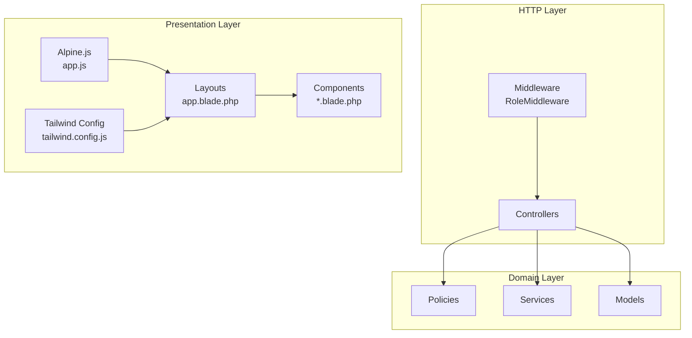
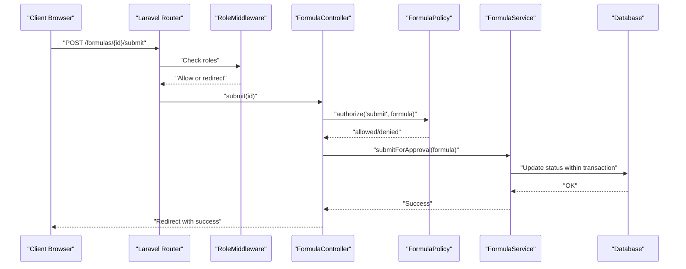
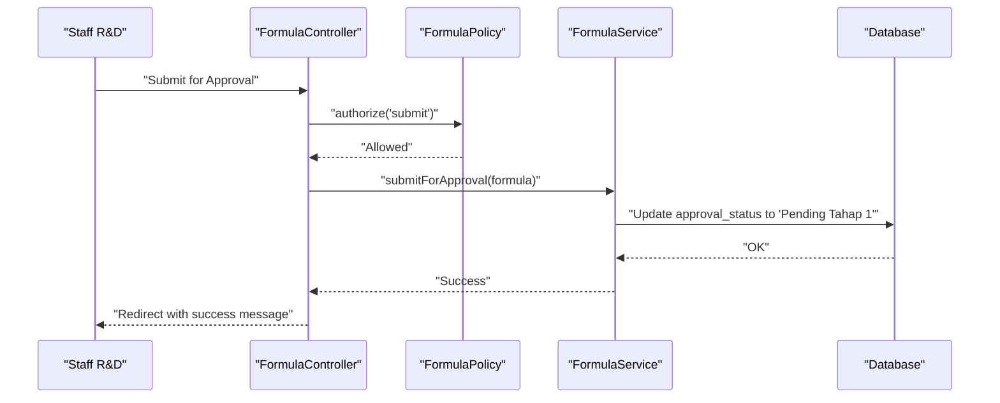
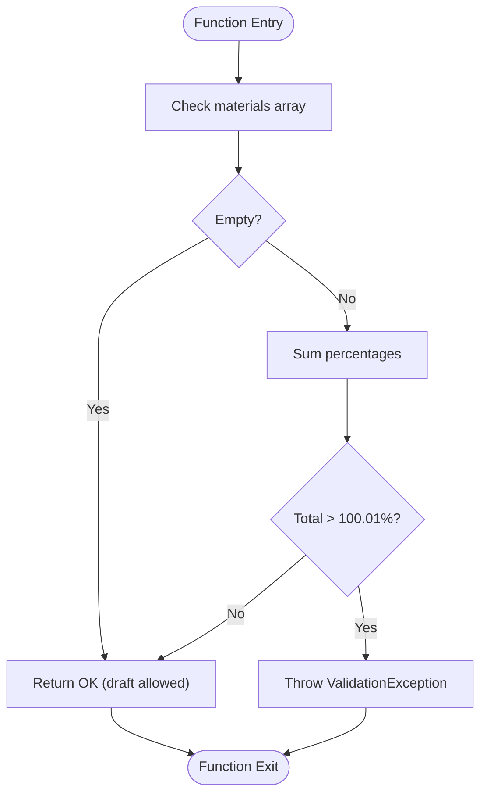
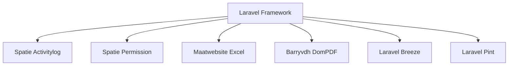

# Coding Standards & Conventions

<cite>
**Referenced Files in This Document**
- [composer.json](file://composer.json)
- [.editorconfig](file://.editorconfig)
- [rules.md](file://rules.md)
- [app.blade.php](file://resources/views/layouts/app.blade.php)
- [application-logo.blade.php](file://resources/views/components/application-logo.blade.php)
- [app.js](file://resources/js/app.js)
- [tailwind.config.js](file://tailwind.config.js)
- [Controller.php](file://app/Http/Controllers/Controller.php)
- [FormulaController.php](file://app/Http/Controllers/FormulaController.php)
- [RoleMiddleware.php](file://app/Http/Middleware/RoleMiddleware.php)
- [User.php](file://app/Models/User.php)
- [Formula.php](file://app/Models/Formula.php)
- [TrialRm.php](file://app/Models/TrialRm.php)
- [FormulaPolicy.php](file://app/Policies/FormulaPolicy.php)
- [FormulaService.php](file://app/Services/FormulaService.php)
</cite>

## Table of Contents
1. Introduction
2. Project Structure
3. Core Components
4. Architecture Overview
5. Detailed Component Analysis
6. Dependency Analysis
7. Performance Considerations
8. Troubleshooting Guide
9. Conclusion

## Introduction
This document defines the coding standards and conventions for the R&D Management System across PHP, Blade templates, JavaScript, and CSS. It codifies Laravel-specific patterns (controllers, models, services, policies), Blade organization and component development, Tailwind usage, formatting rules, naming conventions, file organization, and architectural patterns such as MVC separation and service-oriented design. Concrete examples are referenced from the actual codebase to demonstrate business rule validation, RBAC implementation, and audit trail logging.

## Project Structure
The application follows a standard Laravel 13 structure with clear separation of concerns:
- Controllers under app/Http/Controllers handle HTTP requests and delegate business logic to Services.
- Models under app/Models encapsulate domain data, relationships, and activity logging.
- Policies under app/Policies enforce authorization per resource.
- Services under app/Services implement business workflows and validations.
- Views under resources/views are organized by feature modules; shared UI is in components and layouts.
- Frontend assets use Vite with Alpine.js and Tailwind CSS.

**Diagram sources**
- [FormulaController.php](file://app/Http/Controllers/FormulaController.php)
- [RoleMiddleware.php](file://app/Http/Middleware/RoleMiddleware.php)
- [FormulaPolicy.php](file://app/Policies/FormulaPolicy.php)
- [FormulaService.php](file://app/Services/FormulaService.php)
- [Formula.php](file://app/Models/Formula.php)
- [app.blade.php](file://resources/views/layouts/app.blade.php)
- [application-logo.blade.php](file://resources/views/components/application-logo.blade.php)
- [app.js](file://resources/js/app.js)
- [tailwind.config.js](file://tailwind.config.js)

**Section sources**
- [composer.json](file://composer.json)
- [.editorconfig](file://.editorconfig)
- [app.blade.php](file://resources/views/layouts/app.blade.php)
- [application-logo.blade.php](file://resources/views/components/application-logo.blade.php)
- [app.js](file://resources/js/app.js)
- [tailwind.config.js](file://tailwind.config.js)

## Core Components
- Controller pattern: Thin controllers that authorize via Gates/Policies, validate input, and delegate to Services. See FormulaController methods for create, store, update, submit, and reformulate flows.
- Service layer: Encapsulates business rules, state transitions, and transactions. See FormulaService for composition validation, approval gates, and versioning.
- Model patterns: Eloquent models with relationships, casts, and activity logging. See Formula and TrialRm for LogsActivity usage and relationship definitions.
- Authorization: Policy-based access control aligned with roles and permissions. See FormulaPolicy and RoleMiddleware.
- Frontend: Blade layout with Alpine.js interactivity and Tailwind utility classes. See app.blade.php and tailwind.config.js.

**Section sources**
- [FormulaController.php](file://app/Http/Controllers/FormulaController.php)
- [FormulaService.php](file://app/Services/FormulaService.php)
- [Formula.php](file://app/Models/Formula.php)
- [TrialRm.php](file://app/Models/TrialRm.php)
- [FormulaPolicy.php](file://app/Policies/FormulaPolicy.php)
- [RoleMiddleware.php](file://app/Http/Middleware/RoleMiddleware.php)
- [app.blade.php](file://resources/views/layouts/app.blade.php)
- [tailwind.config.js](file://tailwind.config.js)

## Architecture Overview
The system implements an MVC + Service Layer architecture with policy-driven authorization and middleware-based role checks. Business rules are enforced in Services and Policies, while Controllers orchestrate requests and responses. The presentation layer uses Blade with Alpine.js and Tailwind CSS.

**Diagram sources**
- [FormulaController.php](file://app/Http/Controllers/FormulaController.php)
- [FormulaPolicy.php](file://app/Policies/FormulaPolicy.php)
- [FormulaService.php](file://app/Services/FormulaService.php)
- [RoleMiddleware.php](file://app/Http/Middleware/RoleMiddleware.php)

## Detailed Component Analysis

### PHP Coding Standards
- PSR-4 autoloading and namespaces: App\*, Database\Factories\*, Database\Seeders\*, Tests\.
- PHP version: ^8.3; platform pinned to 8.3.26 for consistency.
- Formatting: EditorConfig enforces UTF-8, LF line endings, 4-space indentation, trailing whitespace trimming, final newline insertion.
- Naming:
  - Classes: PascalCase (e.g., FormulaController, FormulaService).
  - Methods: camelCase (e.g., submitForApproval, approveTahap1).
  - Properties: camelCase; fillable arrays use snake_case field names matching database columns.
  - Files: Match class names exactly (e.g., FormulaService.php).
- Validation:
  - Use Request validation in Controllers for basic constraints.
  - Enforce business rules in Services using ValidationException for structured errors.
- Transactions:
  - Wrap multi-step writes in DB::transaction to ensure atomicity.
- Activity Logging:
  - Use Spatie Activitylog with LogOptions defaults and logOnlyDirty on key fields.

**Section sources**
- [composer.json](file://composer.json)
- [.editorconfig](file://.editorconfig)
- [FormulaController.php](file://app/Http/Controllers/FormulaController.php)
- [FormulaService.php](file://app/Services/FormulaService.php)
- [Formula.php](file://app/Models/Formula.php)
- [TrialRm.php](file://app/Models/TrialRm.php)

### Blade Template Organization
- Layouts:
  - Central layout at resources/views/layouts/app.blade.php provides sidebar navigation, flash messages, and slot injection.
  - Use @can/@role directives to conditionally render menus based on permissions and roles.
- Components:
  - Reusable UI elements under resources/views/components/*.blade.php (e.g., application-logo.blade.php).
  - Prefer small, focused components with $attributes passthrough for flexibility.
- Styling:
  - Tailwind classes applied directly in Blade; custom theme defined in tailwind.config.js (colors, fonts, shadows, animations).
- Interactivity:
  - Alpine.js initialized in resources/js/app.js; x-data/x-show used for lightweight UI behavior.

**Section sources**
- [app.blade.php](file://resources/views/layouts/app.blade.php)
- [application-logo.blade.php](file://resources/views/components/application-logo.blade.php)
- [app.js](file://resources/js/app.js)
- [tailwind.config.js](file://tailwind.config.js)

### JavaScript Conventions
- Minimal bootstrap: Import Alpine and start it globally in resources/js/app.js.
- Keep DOM manipulation minimal; prefer Alpine directives for reactivity.
- Avoid heavy client-side logic; rely on server-side validation and policies.

**Section sources**
- [app.js](file://resources/js/app.js)

### CSS and Tailwind Guidelines
- Theme customization:
  - Extend default theme with brand colors, fonts, shadows, gradients, and animations in tailwind.config.js.
- Utility-first approach:
  - Apply Tailwind classes directly in Blade; avoid custom CSS unless necessary.
- Consistency:
  - Use semantic color tokens (primary, secondary, accent, surface, ink) consistently across views.

**Section sources**
- [tailwind.config.js](file://tailwind.config.js)
- [app.blade.php](file://resources/views/layouts/app.blade.php)

### Controller Structure and Patterns
- Constructor injection for Services (e.g., FormulaService).
- Gate authorization before action execution.
- Validate input with Request rules; catch ValidationException from Services and return with errors.
- Redirect with success messages after successful operations.

**Section sources**
- [FormulaController.php](file://app/Http/Controllers/FormulaController.php)
- [Controller.php](file://app/Http/Controllers/Controller.php)

### Model Relationships and Audit Trail
- Relationships:
  - User hasMany formulas, trialRms, trialPms via created_by.
  - Formula belongsTo creator, operationalManager, generalManager; hasMany materials, childFormulas; belongsTo parentFormula; hasMany trialRms.
  - TrialRm belongsTo formula; hasMany verifications; belongsTo approvers similarly.
- Audit trail:
  - Use LogsActivity trait with LogOptions to track only dirty changes on critical fields.

**Section sources**
- [User.php](file://app/Models/User.php)
- [Formula.php](file://app/Models/Formula.php)
- [TrialRm.php](file://app/Models/TrialRm.php)

### Service Layer Implementation
- Composition validation:
  - Ensure total percentage does not exceed 100% with floating-point tolerance.
- State machine enforcement:
  - Submit requires Draft/Rejected and valid composition; moves to Pending Tahap 1.
  - Approve Tahap 1 requires Pending Tahap 1; moves to Pending Tahap 2 and records approver.
  - Approve Tahap 2 requires Pending Tahap 2; marks Approved with timestamp and approver.
  - Reject allowed from pending states; stores rejection notes.
  - Reformulation clones approved formula into a new version with incremented version number and copies materials.
- Transactions:
  - Create and update wrap DB operations in transactions for consistency.

**Section sources**
- [FormulaService.php](file://app/Services/FormulaService.php)

### Policy-Based Authorization
- Resource-level policies:
  - viewAny/view for listing/detail access.
  - create for creation.
  - edit/update restricted to creator when status is Draft/Rejected.
  - submit restricted to creator and appropriate status.
  - reformulate allowed when formula is Approved and user has create permission.
  - delete restricted to creator and Draft status.
- Middleware:
  - RoleMiddleware checks authenticated users and allows access if any specified role matches; otherwise redirects with error.

**Section sources**
- [FormulaPolicy.php](file://app/Policies/FormulaPolicy.php)
- [RoleMiddleware.php](file://app/Http/Middleware/RoleMiddleware.php)

### Business Rules Validation Examples
- Composition must sum to 100% before submission; enforced in Service and reflected in model helper attributes.
- Approval gate hierarchy:
  - Step 1 (Operational Manager) required before Step 2 (General Manager).
  - Rejection routes back to Staff R&D for revision.
- Auto-generation:
  - Formula codes follow FRM-YYYYMM-XXX format; versions increment for reformulations.

**Section sources**
- [FormulaService.php](file://app/Services/FormulaService.php)
- [Formula.php](file://app/Models/Formula.php)
- [rules.md](file://rules.md)

### RBAC Implementation Examples
- Roles and permissions integrated via Spatie Permission traits and helpers.
- Sidebar visibility controlled by @can and @role directives in Blade.
- RoleMiddleware protects routes requiring specific roles.

**Section sources**
- [User.php](file://app/Models/User.php)
- [app.blade.php](file://resources/views/layouts/app.blade.php)
- [RoleMiddleware.php](file://app/Http/Middleware/RoleMiddleware.php)

### Audit Trail Logging Examples
- Activity logs capture changes to key fields like code, name, version, approval_status, sample_identity, decision.
- Only dirty changes are recorded to reduce noise.

**Section sources**
- [Formula.php](file://app/Models/Formula.php)
- [TrialRm.php](file://app/Models/TrialRm.php)

#### Sequence Diagram: Formula Submission Flow

**Diagram sources**
- [FormulaController.php](file://app/Http/Controllers/FormulaController.php)
- [FormulaPolicy.php](file://app/Policies/FormulaPolicy.php)
- [FormulaService.php](file://app/Services/FormulaService.php)

#### Flowchart: Composition Validation Logic

**Diagram sources**
- [FormulaService.php](file://app/Services/FormulaService.php)

## Dependency Analysis
External packages and their roles:
- Laravel Framework: Core framework providing routing, ORM, validation, container, etc.
- Spatie Laravel Activitylog: Audit trail logging.
- Spatie Laravel Permission: Role and permission management.
- Maatwebsite Excel: Export/import capabilities.
- Barryvdh DomPDF: PDF generation.
- Laravel Breeze: Starter scaffolding.
- Laravel Pint: Code formatting tool.

**Diagram sources**
- [composer.json](file://composer.json)

**Section sources**
- [composer.json](file://composer.json)

## Performance Considerations
- Use eager loading for related data in list/show actions to minimize N+1 queries (e.g., load materials, suppliers, creators).
- Keep Services focused and transactional to reduce partial writes and lock contention.
- Prefer pagination for large datasets and filter queries efficiently.
- Minimize frontend payload by leveraging Tailwind’s utility-first approach and avoiding unnecessary custom CSS.

[No sources needed since this section provides general guidance]

## Troubleshooting Guide
- Validation Errors:
  - Services throw ValidationException with structured keys; Controllers catch and return withInput().
  - Blade displays errors via session and $errors bag.
- Authorization Failures:
  - Policies deny access; Controllers receive exceptions or false results; use Gate::authorize to centralize checks.
  - RoleMiddleware redirects unauthorized users to dashboard with error messages.
- Audit Trail Gaps:
  - Ensure LogOptions are configured to logOnlyDirty and include relevant fields.
  - Verify that state transitions occur within logged contexts.

**Section sources**
- [FormulaController.php](file://app/Http/Controllers/FormulaController.php)
- [FormulaService.php](file://app/Services/FormulaService.php)
- [FormulaPolicy.php](file://app/Policies/FormulaPolicy.php)
- [RoleMiddleware.php](file://app/Http/Middleware/RoleMiddleware.php)
- [Formula.php](file://app/Models/Formula.php)
- [TrialRm.php](file://app/Models/TrialRm.php)

## Conclusion
This document establishes consistent coding standards and conventions for the R&D Management System. By adhering to these guidelines—thin controllers, robust services, policy-driven authorization, clear model relationships, and disciplined Blade/Tailwind usage—the team can maintain high code quality, security, and performance while supporting complex business workflows such as approvals, versioning, and auditability.