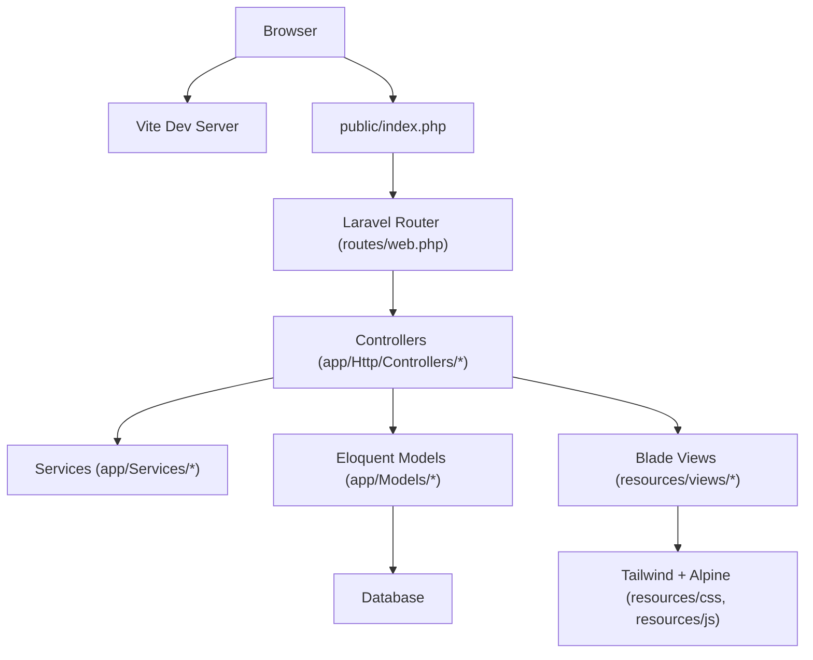
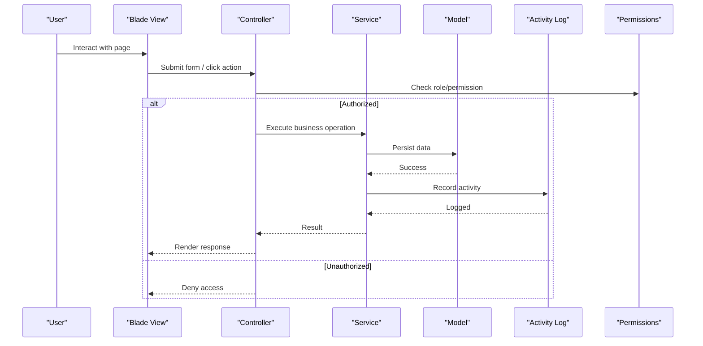
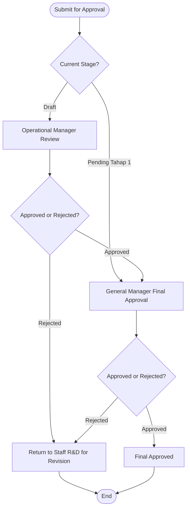
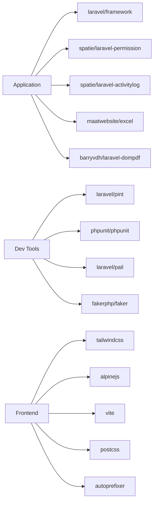

# Developer Guidelines

<cite>
**Referenced Files in This Document**
- [README.md](file://README.md)
- [rules.md](file://rules.md)
- [uiux.md](file://uiux.md)
- [composer.json](file://composer.json)
- [package.json](file://package.json)
- [.editorconfig](file://.editorconfig)
- [tailwind.config.js](file://tailwind.config.js)
- [vite.config.js](file://vite.config.js)
- [postcss.config.js](file://postcss.config.js)
- [app.blade.php](file://resources/views/layouts/app.blade.php)
- [app.js](file://resources/js/app.js)
- [app.css](file://resources/css/app.css)
- [DashboardController.php](file://app/Http/Controllers/DashboardController.php)
- [User.php](file://app/Models/User.php)
</cite>

## Table of Contents
1. Introduction
2. Project Structure
3. Core Components
4. Architecture Overview
5. Detailed Component Analysis
6. Dependency Analysis
7. Performance Considerations
8. Troubleshooting Guide
9. Conclusion
10. Appendices

## Introduction
This document provides comprehensive developer guidelines for the R&D Management System built with Laravel, Blade, Tailwind CSS, and Alpine.js. It covers code style conventions, development workflow, contribution guidelines, best practices, UI/UX design principles, accessibility requirements, troubleshooting, debugging techniques, performance profiling, environment setup, tooling recommendations, and productivity tips. The goal is to ensure consistent, high-quality development aligned with Laravel conventions and project-specific standards.

## Project Structure
The repository follows a standard Laravel 13 structure:
- app/: Controllers, Models, Services, Policies, Middleware, Requests, View Components
- resources/views/: Blade templates organized by feature modules and shared components
- resources/css & resources/js: Frontend assets compiled via Vite
- config/: Application configuration files
- database/: Migrations, seeders, factories
- routes/: Web and console routes
- tests/: Feature and Unit tests
- public/: Entry point and static assets
- storage/: Framework cache, sessions, logs, uploads

[No sources needed since this diagram shows conceptual workflow, not actual code structure]

**Section sources**
- [README.md:1-59](file://README.md#L1-L59)

## Core Components
Key application components include:
- Controllers: Handle HTTP requests and orchestrate business logic
- Models: Represent domain entities and relationships
- Services: Encapsulate complex business rules and workflows
- Policies: Enforce authorization rules per role
- Blade Layouts and Components: Reusable UI building blocks
- Middleware: Cross-cutting concerns like role-based access control
- Requests: Form validation and request handling
- View Components: Custom Blade components for consistent UI

Development workflow highlights:
- Use Composer scripts for setup, development server, queue listener, logging, and testing
- Use Vite for asset compilation and hot reload
- Use Tailwind CSS classes and custom theme tokens defined in configuration
- Use Alpine.js for lightweight interactivity in Blade views

**Section sources**
- [composer.json:39-74](file://composer.json#L39-L74)
- [package.json:5-23](file://package.json#L5-L23)
- [tailwind.config.js:12-64](file://tailwind.config.js#L12-L64)
- [vite.config.js:4-11](file://vite.config.js#L4-L11)
- [app.blade.php:22-23](file://resources/views/layouts/app.blade.php#L22-L23)
- [app.js:3-7](file://resources/js/app.js#L3-L7)

## Architecture Overview
The system implements a layered architecture:
- Presentation Layer: Blade templates with Tailwind CSS and Alpine.js
- Application Layer: Controllers orchestrating services and models
- Domain Layer: Eloquent models and policies enforcing business rules
- Infrastructure Layer: Database, activity log, permissions, queues

**Diagram sources**
- [DashboardController.php:14-103](file://app/Http/Controllers/DashboardController.php#L14-L103)
- [User.php:16-49](file://app/Models/User.php#L16-L49)

**Section sources**
- [DashboardController.php:14-103](file://app/Http/Controllers/DashboardController.php#L14-L103)
- [User.php:16-49](file://app/Models/User.php#L16-L49)

## Detailed Component Analysis

### PHP Code Style Conventions
- PSR-12 compliant formatting enforced by Laravel Pint
- Use attributes for fillable and hidden fields on models
- Prefer type hints and return types where applicable
- Keep controllers thin; delegate complex logic to services
- Validate input using Form Request classes
- Centralize authorization in Policies
- Use Eloquent relationships and casts consistently

Best practices:
- Avoid direct DB queries when Eloquent can express them
- Use transactions for multi-step operations
- Log important state changes via activity log
- Keep error messages user-friendly and localized

**Section sources**
- [composer.json:17-26](file://composer.json#L17-L26)
- [User.php:14-32](file://app/Models/User.php#L14-L32)

### Blade Template Standards
- Organize views by feature folders under resources/views
- Use layout inheritance with a base layout for common chrome
- Implement reusable Blade components for buttons, badges, tables, forms
- Apply role-aware rendering using @can and @role directives
- Display flash messages and validation errors consistently

Accessibility:
- Ensure all inputs have explicit labels
- Provide meaningful aria-labels for icons and actions
- Use semantic HTML elements

**Section sources**
- [app.blade.php:89-181](file://resources/views/layouts/app.blade.php#L89-L181)
- [app.blade.php:296-351](file://resources/views/layouts/app.blade.php#L296-L351)

### JavaScript and Alpine.js Patterns
- Initialize Alpine globally and start it in the entry file
- Use x-data for local component state and x-show/x-transition for interactions
- Keep logic minimal; prefer server-side validation for security
- Use event delegation and avoid inline handlers when possible

Performance:
- Minimize heavy computations in Alpine
- Debounce search/filter inputs if needed
- Leverage Vite HMR for fast feedback

**Section sources**
- [app.js:3-7](file://resources/js/app.js#L3-L7)

### CSS and Tailwind Conventions
- Define design tokens (colors, fonts, shadows, animations) in tailwind.config.js
- Use @layer to organize base, components, and utilities
- Create reusable component classes for cards, buttons, forms, tables
- Maintain consistent spacing and typography scales

Accessibility:
- Ensure sufficient color contrast
- Provide text alternatives for status indicators

**Section sources**
- [tailwind.config.js:12-64](file://tailwind.config.js#L12-L64)
- [app.css:8-318](file://resources/css/app.css#L8-L318)

### Business Rules and Validation
- Enforce RBAC roles and approval gates at backend layers
- Validate critical business constraints (e.g., composition totals, unique codes)
- Auto-generate identifiers following specified formats
- Track all significant changes in activity log

State machine transitions must be validated and audited.

**Section sources**
- [rules.md:1-117](file://rules.md#L1-L117)

### UI/UX Design Principles
- Clarity over decoration; emphasize readability of technical data
- Consistent status indicators across modules
- Role-aware UI elements
- Traceability through visible timelines and audit trails

Design tokens:
- Herbal palette with primary green, secondary brown, accent gold
- Typography: Poppins for headings, Inter for body/data
- Icons: Heroicons outline/solid

Responsiveness:
- Mobile-first breakpoints
- Tables adapt to stacked cards on small screens
- Forms stack columns on mobile

Accessibility:
- WCAG AA contrast compliance
- Explicit labels for all form fields
- Status badges include text for color-blind users

**Section sources**
- [uiux.md:1-184](file://uiux.md#L1-L184)

### Approval Center Workflow

**Diagram sources**
- [rules.md:49-64](file://rules.md#L49-L64)

**Section sources**
- [rules.md:49-64](file://rules.md#L49-L64)

## Dependency Analysis
External dependencies and tooling:
- Laravel framework and ecosystem packages
- Spatie permission and activity log
- Maatwebsite Excel and barryvdh dompdf for reporting
- Development tools: Pint, PHPUnit, Pail, Faker
- Frontend: Tailwind CSS, Alpine.js, Vite, PostCSS, Autoprefixer

**Diagram sources**
- [composer.json:8-26](file://composer.json#L8-L26)
- [package.json:9-22](file://package.json#L9-L22)

**Section sources**
- [composer.json:8-26](file://composer.json#L8-L26)
- [package.json:9-22](file://package.json#L9-L22)

## Performance Considerations
- Use eager loading to prevent N+1 queries in controllers and services
- Cache frequently accessed settings and reference data
- Offload heavy tasks to queues where appropriate
- Optimize Blade rendering by minimizing complex logic in views
- Use Vite build for production to minify and bundle assets
- Profile slow endpoints using Laravel Telescope or similar tools

[No sources needed since this section provides general guidance]

## Troubleshooting Guide
Common issues and resolutions:
- Asset compilation failures: Verify Vite dev server and rebuild assets
- Permission denied errors: Ensure storage and bootstrap/cache directories are writable
- Route not found: Confirm route definitions and controller methods exist
- Validation errors: Inspect Form Request classes and client-side validation
- Queue jobs failing: Check queue worker logs and job exceptions
- Activity log missing entries: Ensure events are logged during state transitions

Debugging techniques:
- Use Laravel Pail for real-time log streaming
- Enable detailed error pages in local development
- Add structured logging around critical operations
- Use browser DevTools Network tab to inspect API responses

Profiling tools:
- Laravel Profiler or Telescope for request timing and SQL queries
- Browser Performance tab for frontend bottlenecks
- Tailwind Purge analysis to reduce CSS size in production

**Section sources**
- [composer.json:48-55](file://composer.json#L48-L55)

## Conclusion
Adhering to these guidelines ensures a consistent, maintainable, and accessible application aligned with Laravel best practices and project-specific standards. By following the coding conventions, workflow, and UI/UX principles outlined here, teams can deliver robust features efficiently while maintaining quality and traceability.

[No sources needed since this section summarizes without analyzing specific files]

## Appendices

### Environment Setup and Tooling
- Install dependencies using Composer scripts
- Configure .env from example and generate application key
- Run migrations and seed demo data
- Start development server, queue listener, logs, and Vite concurrently
- Build assets for production

Productivity tips:
- Use IDE integrations for Laravel and Blade
- Enable auto-formatting with Pint on save
- Use TDD with PHPUnit for new features
- Adopt component-driven development with Blade components

**Section sources**
- [composer.json:40-74](file://composer.json#L40-L74)
- [package.json:5-8](file://package.json#L5-L8)

### Coding Standards Reference
- EditorConfig enforces indentation, line endings, and whitespace trimming
- Tailwind configuration centralizes design tokens and plugins
- PostCSS pipeline applies Tailwind and autoprefixing
- Vite config defines entry points and refresh behavior

**Section sources**
- [.editorconfig:1-19](file://.editorconfig#L1-L19)
- [tailwind.config.js:1-64](file://tailwind.config.js#L1-L64)
- [postcss.config.js:1-7](file://postcss.config.js#L1-L7)
- [vite.config.js:1-12](file://vite.config.js#L1-L12)

### Contribution Guidelines
- Follow Laravel contribution documentation for framework-level contributions
- For this project, adhere to established patterns and review process
- Write clear commit messages and descriptive PR descriptions
- Include tests for new features and bug fixes
- Ensure UI/UX consistency and accessibility compliance

**Section sources**
- [README.md:44-50](file://README.md#L44-L50)