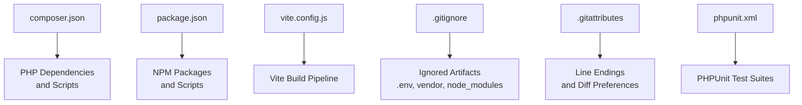
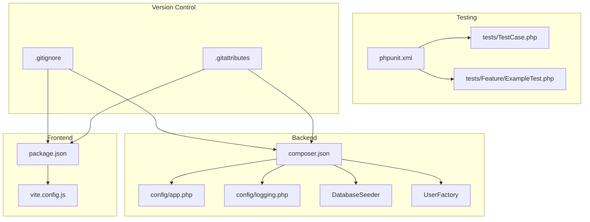
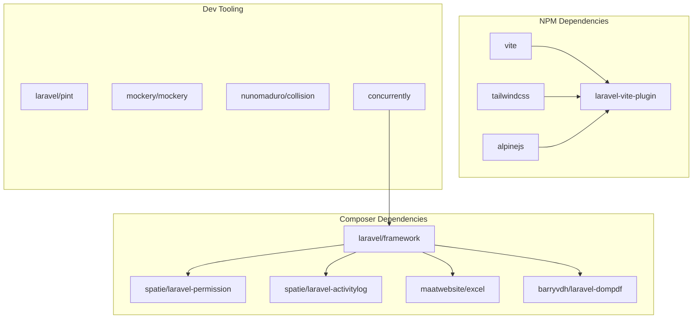

# Development Workflow & Git Practices

<cite>
**Referenced Files in This Document**
- [composer.json](file://composer.json)
- [package.json](file://package.json)
- [vite.config.js](file://vite.config.js)
- [.npmrc](file://.npmrc)
- [.gitignore](file://.gitignore)
- [.gitattributes](file://.gitattributes)
- [phpunit.xml](file://phpunit.xml)
- [config/app.php](file://config/app.php)
- [config/logging.php](file://config/logging.php)
- [database\seeders\DatabaseSeeder.php](file://database/seeders/DatabaseSeeder.php)
- [database\factories\UserFactory.php](file://database/factories/UserFactory.php)
- [tests\TestCase.php](file://tests/TestCase.php)
- [tests\Feature\ExampleTest.php](file://tests/Feature/ExampleTest.php)
</cite>

## Table of Contents
1. Introduction
2. Project Structure
3. Core Components
4. Architecture Overview
5. Detailed Component Analysis
6. Dependency Analysis
7. Performance Considerations
8. Troubleshooting Guide
9. Conclusion

## Introduction
This document defines the development workflow and Git practices for the R&D Management System, a Laravel-based application. It covers branching strategy, commit message conventions, pull request process, code review guidelines, environment setup (Composer and NPM), database migrations and seeders, testing workflows with PHPUnit, deployment procedures, continuous integration considerations, debugging techniques, logging practices, and performance profiling tools available in the Laravel ecosystem.

## Project Structure
The repository follows standard Laravel conventions:
- PHP dependencies and scripts are defined in composer.json.
- Frontend assets and build tooling are managed via package.json and Vite configuration.
- Testing is configured through phpunit.xml with dedicated test suites.
- Environment-sensitive files are excluded from version control using .gitignore.
- Cross-platform line endings and diff preferences are set in .gitattributes.

**Diagram sources**
- [composer.json:1-96](file://composer.json#L1-L96)
- [package.json:1-24](file://package.json#L1-L24)
- [vite.config.js:1-12](file://vite.config.js#L1-L12)
- [.gitignore:1-28](file://.gitignore#L1-L28)
- [.gitattributes:1-11](file://.gitattributes#L1-L11)
- [phpunit.xml:1-37](file://phpunit.xml#L1-L37)

**Section sources**
- [composer.json:1-96](file://composer.json#L1-L96)
- [package.json:1-24](file://package.json#L1-L24)
- [vite.config.js:1-12](file://vite.config.js#L1-L12)
- [.gitignore:1-28](file://.gitignore#L1-L28)
- [.gitattributes:1-11](file://.gitattributes#L1-L11)
- [phpunit.xml:1-37](file://phpunit.xml#L1-L37)

## Core Components
- Composer scripts orchestrate setup, development server, queue listener, logs streaming, asset building, and tests.
- NPM scripts provide local development and production builds via Vite.
- PHPUnit configuration sets up isolated testing environments with SQLite in-memory database and array-backed services.
- Logging configuration supports multiple channels including daily rotation and stderr output.
- Database seeding provides initial roles, users, materials, suppliers, and demo data.
- Factories generate realistic test data for models like User.

Key responsibilities:
- Setup and bootstrap: install dependencies, generate keys, run migrations, build assets.
- Local development: concurrently run web server, queue worker, log streamer, and Vite dev server.
- Testing: clear config cache and execute unit and feature tests.
- Asset pipeline: compile CSS/JS with Tailwind and Alpine.js.

**Section sources**
- [composer.json:39-74](file://composer.json#L39-L74)
- [package.json:5-8](file://package.json#L5-L8)
- [phpunit.xml:7-35](file://phpunit.xml#L7-L35)
- [config/logging.php:53-130](file://config/logging.php#L53-L130)
- [database\seeders\DatabaseSeeder.php:12-33](file://database/seeders/DatabaseSeeder.php#L12-L33)
- [database\factories\UserFactory.php:25-44](file://database/factories/UserFactory.php#L25-L44)

## Architecture Overview
The development workflow integrates backend and frontend tooling around Laravel’s ecosystem. The following diagram maps core components involved in setup, development, testing, and deployment.

**Diagram sources**
- [composer.json:1-96](file://composer.json#L1-L96)
- [config/app.php:1-127](file://config/app.php#L1-L127)
- [config/logging.php:1-133](file://config/logging.php#L1-L133)
- [database\seeders\DatabaseSeeder.php:1-35](file://database/seeders/DatabaseSeeder.php#L1-L35)
- [database\factories\UserFactory.php:1-46](file://database/factories/UserFactory.php#L1-L46)
- [package.json:1-24](file://package.json#L1-L24)
- [vite.config.js:1-12](file://vite.config.js#L1-L12)
- [phpunit.xml:1-37](file://phpunit.xml#L1-L37)
- [tests\TestCase.php:1-11](file://tests/TestCase.php#L1-L11)
- [tests\Feature\ExampleTest.php:1-20](file://tests/Feature/ExampleTest.php#L1-L20)
- [.gitignore:1-28](file://.gitignore#L1-L28)
- [.gitattributes:1-11](file://.gitattributes#L1-L11)

## Detailed Component Analysis

### Branching Strategy
- Use feature branches named by type and short description, e.g., feature/trial-rm-approval-gate or fix/formula-percentage-validation.
- Keep main/master as the protected branch representing deployable state.
- Create release branches for versioned releases (e.g., release/v1.2.0).
- Hotfix branches should be created directly from main for urgent fixes (e.g., hotfix/security-patch).

Rationale:
- Aligns with conventional commits and simplifies automated changelogs.
- Reduces merge conflicts by isolating work.

### Commit Message Conventions
- Follow Conventional Commits format: type(scope): subject
  - Types: feat, fix, chore, docs, style, refactor, perf, test, build, ci, revert
  - Scope examples: auth, formulas, trial-rm, trial-pm, approval-center, settings
- Include imperative mood and concise descriptions.
- Reference issue numbers when applicable.

Examples:
- feat(trial-rm): add approval gate validation
- fix(formulas): enforce composition total equals 100%
- chore(deps): update laravel/framework to ^13.8

### Pull Request Process
- Ensure all tests pass locally before opening a PR.
- Link related issues and describe changes, rationale, and impact.
- Require at least one reviewer for non-trivial changes.
- Squash merges recommended for feature branches; preserve history for critical modules if needed.

### Code Review Guidelines
- Verify business rules are enforced in backend layers (Form Requests, Policies, Services).
- Check RBAC alignment with role permissions and approval gates.
- Validate that audit trails capture important status transitions.
- Confirm no sensitive data leaks in logs or responses.
- Ensure consistent formatting and adherence to project standards.

### Development Environment Setup
- Install PHP dependencies and scaffold environment:
  - Run the Composer setup script to install packages, copy .env.example to .env, generate application key, run migrations, install NPM packages, and build assets.
- Start the development environment:
  - Use the Composer dev script to concurrently run the web server, queue listener, log streamer, and Vite dev server.
- Frontend build:
  - Use npm scripts to build assets for production or run the Vite dev server for live reload.

Environment notes:
- .env is ignored by version control; ensure it exists locally.
- Node and NPM versions must satisfy package requirements.

**Section sources**
- [composer.json:39-74](file://composer.json#L39-L74)
- [package.json:5-8](file://package.json#L5-L8)
- [.gitignore:1-28](file://.gitignore#L1-L28)

### Database Migrations and Seeders
- Migrations define schema evolution; run them during setup and after pulling changes.
- Seeders initialize roles, permissions, users, materials, suppliers, and demo data.
- Use the provided seeder to populate sample accounts and credentials for quick onboarding.

Operational steps:
- After setup, run the full seeder to create default users and demo content.
- For testing, use an in-memory SQLite database configured by PHPUnit.

**Section sources**
- [composer.json:39-74](file://composer.json#L39-L74)
- [database\seeders\DatabaseSeeder.php:12-33](file://database/seeders/DatabaseSeeder.php#L12-L33)
- [phpunit.xml:20-35](file://phpunit.xml#L20-L35)

### Testing Workflow
- PHPUnit configuration defines Unit and Feature test suites and source include paths.
- Tests run against an in-memory SQLite database with array-backed cache/session/mail/queue for speed and isolation.
- Base test class extends Laravel’s base TestCase; feature tests assert HTTP responses and flows.

Strategies:
- Unit tests: validate pure logic and service methods.
- Feature tests: simulate user interactions across controllers, policies, and services.
- Data management: use factories to generate realistic model instances; leverage seeders for baseline data.

Execution:
- Clear config cache and run tests via Composer test script.
- Isolate tests per suite and avoid shared mutable state.

**Section sources**
- [phpunit.xml:1-37](file://phpunit.xml#L1-L37)
- [tests\TestCase.php:1-11](file://tests/TestCase.php#L1-L11)
- [tests\Feature\ExampleTest.php:1-20](file://tests/Feature/ExampleTest.php#L1-L20)
- [database\factories\UserFactory.php:1-46](file://database/factories/UserFactory.php#L1-L46)

### Deployment Procedures
- Prepare environment variables for production (APP_ENV, APP_DEBUG, APP_URL, database credentials, mail settings).
- Install dependencies without dev packages and optimize autoload.
- Compile assets for production using Vite.
- Run migrations and seeders as required by your deployment strategy.
- Configure logging channel appropriate for production (e.g., daily rotation or centralized logging).

Considerations:
- Disable debug mode in production.
- Ensure storage and public directories have correct permissions.
- Use environment-specific configurations and secrets management.

**Section sources**
- [config/app.php:16-127](file://config/app.php#L16-L127)
- [config/logging.php:53-130](file://config/logging.php#L53-L130)
- [composer.json:39-74](file://composer.json#L39-L74)

### Continuous Integration Considerations
- Cache Composer and NPM dependencies between runs to speed up CI.
- Run linting and static analysis prior to tests.
- Execute both Unit and Feature tests in parallel where possible.
- Upload artifacts such as coverage reports and logs for diagnostics.
- Use matrix builds to verify compatibility across PHP versions if needed.

[No sources needed since this section provides general guidance]

### Debugging Techniques
- Enable debug mode locally to view detailed error pages and stack traces.
- Stream logs in real-time using the integrated log viewer during development.
- Inspect requests/responses and database queries via browser developer tools and framework debugging utilities.

**Section sources**
- [config/app.php:28-42](file://config/app.php#L28-L42)
- [composer.json:48-51](file://composer.json#L48-L51)

### Logging Practices
- Default logging uses a stack channel; configure single/daily channels based on environment.
- Rotate logs daily to manage disk usage.
- Route critical errors to external services (e.g., Slack) for immediate awareness.
- Avoid logging sensitive information; sanitize payloads and messages.

**Section sources**
- [config/logging.php:21-130](file://config/logging.php#L21-L130)

### Performance Profiling Tools
- Use Laravel Telescope for request/response profiling, query inspection, and memory usage insights in development.
- Leverage built-in profiling hooks and third-party integrations to monitor performance bottlenecks.
- Profile asset builds and runtime performance using browser DevTools and server-side metrics.

[No sources needed since this section provides general guidance]

## Dependency Analysis
The project relies on Laravel framework packages for backend functionality and Vite/Tailwind/Alpine for frontend. Composer and NPM scripts coordinate installation and builds. Version control ignores generated artifacts to keep repositories lean.

**Diagram sources**
- [composer.json:8-26](file://composer.json#L8-L26)
- [package.json:9-22](file://package.json#L9-L22)

**Section sources**
- [composer.json:8-26](file://composer.json#L8-L26)
- [package.json:9-22](file://package.json#L9-L22)

## Performance Considerations
- Optimize autoloading and enable OPcache in production.
- Minimize NPM rebuilds by leveraging Vite’s incremental compilation.
- Use queues for long-running tasks and background jobs.
- Monitor database query performance and apply indexing strategies.
- Profile asset pipelines and reduce bundle sizes where possible.

[No sources needed since this section provides general guidance]

## Troubleshooting Guide
Common issues and resolutions:
- Missing .env: Ensure .env exists and contains required variables; do not commit it.
- Permission errors: Verify storage and bootstrap/cache directories are writable.
- Asset build failures: Confirm Node/NPM versions meet requirements and clear caches.
- Test failures: Reset database state and ensure factories/seeders are correctly configured.
- Logging problems: Check channel configuration and file permissions for log rotation.

**Section sources**
- [.gitignore:1-28](file://.gitignore#L1-L28)
- [config/logging.php:53-130](file://config/logging.php#L53-L130)
- [phpunit.xml:20-35](file://phpunit.xml#L20-L35)

## Conclusion
Adopting the outlined branching strategy, commit conventions, and PR processes ensures collaborative clarity and maintainability. Robust environment setup, disciplined testing, and thoughtful logging/profiling practices contribute to reliable deployments and efficient troubleshooting. Following these guidelines will streamline development and improve overall system quality.