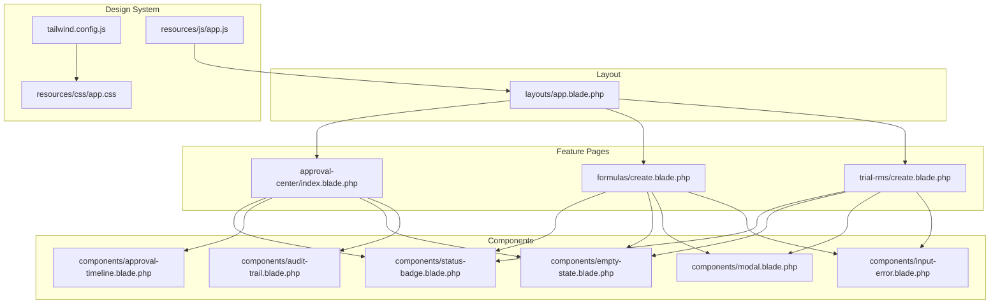
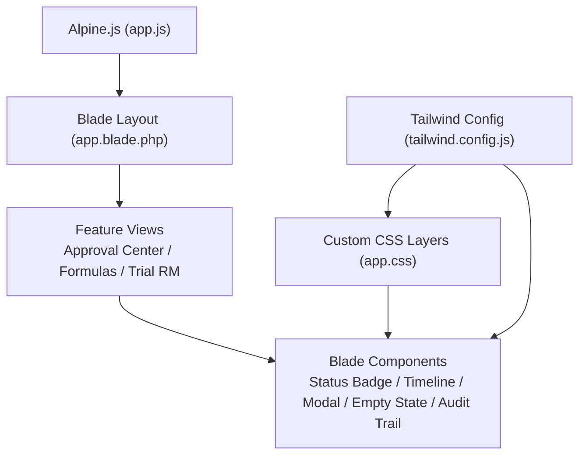
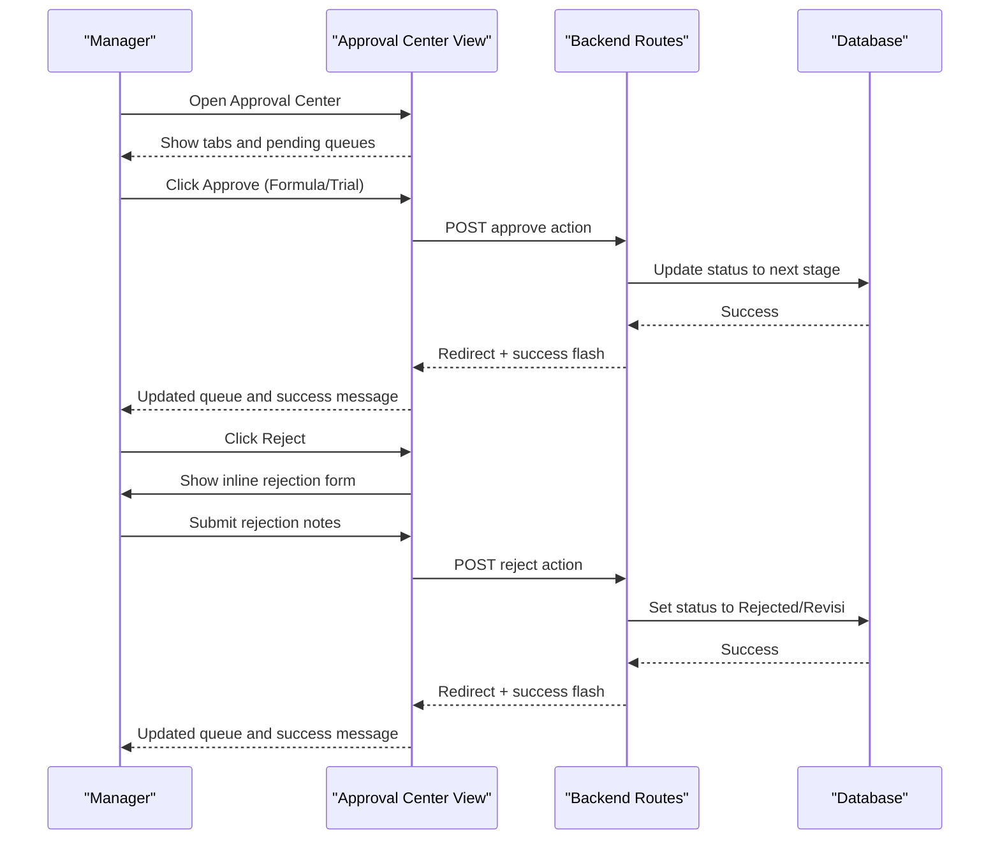
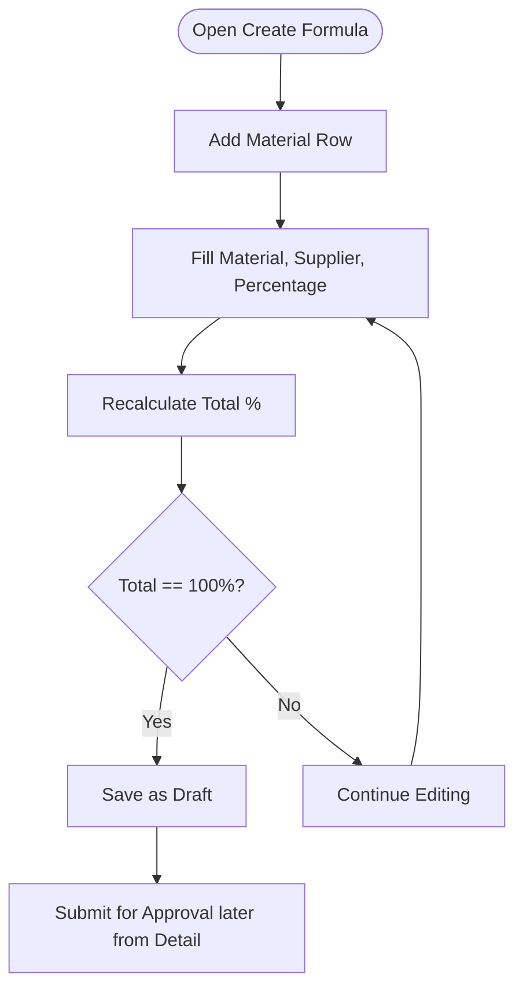
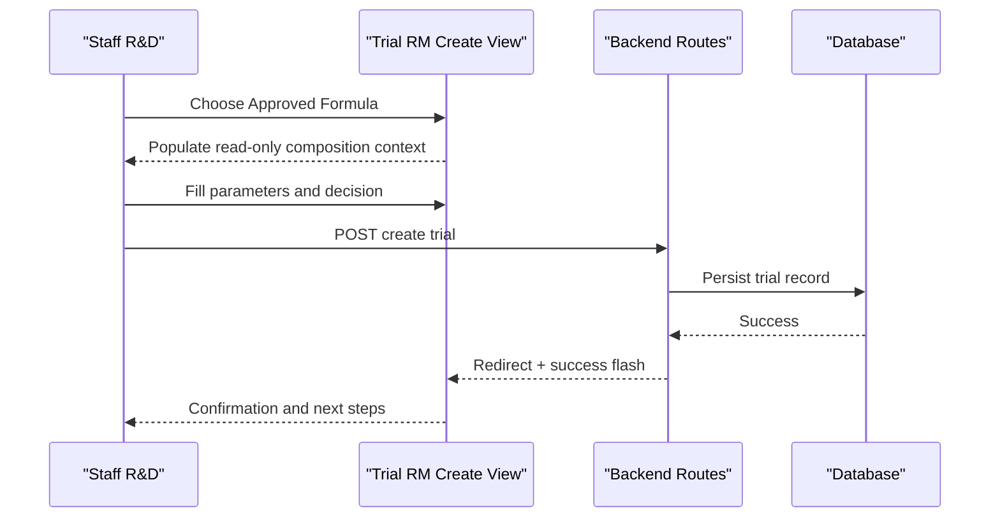
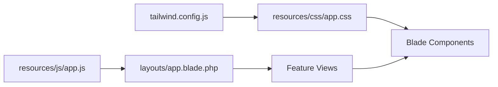

# UI/UX Design Guidelines

<cite>
**Referenced Files in This Document**
- [app.css](file://resources/css/app.css)
- [tailwind.config.js](file://tailwind.config.js)
- [app.js](file://resources/js/app.js)
- [uiux.md](file://uiux.md)
- [rules.md](file://rules.md)
- [status-badge.blade.php](file://resources/views/components/status-badge.blade.php)
- [approval-timeline.blade.php](file://resources/views/components/approval-timeline.blade.php)
- [empty-state.blade.php](file://resources/views/components/empty-state.blade.php)
- [modal.blade.php](file://resources/views/components/modal.blade.php)
- [input-error.blade.php](file://resources/views/components/input-error.blade.php)
- [audit-trail.blade.php](file://resources/views/components/audit-trail.blade.php)
- [app.blade.php](file://resources/views/layouts/app.blade.php)
- [approval-center/index.blade.php](file://resources/views/approval-center/index.blade.php)
- [formulas/create.blade.php](file://resources/views/formulas/create.blade.php)
- [trial-rms/create.blade.php](file://resources/views/trial-rms/create.blade.php)
</cite>

## Table of Contents
1. Introduction
2. Project Structure
3. Core Components
4. Architecture Overview
5. Detailed Component Analysis
6. Dependency Analysis
7. Performance Considerations
8. Troubleshooting Guide
9. Conclusion
10. Appendices

## Introduction
This document defines the UI/UX design guidelines for the R&D Management System, built with Laravel Blade, Tailwind CSS, and Alpine.js. It consolidates the established design principles, design tokens, component architecture, responsive patterns, accessibility requirements, and user experience flows—especially for complex approval workflows. The guidelines also cover form design, data visualization, notification systems, mobile responsiveness, and implementation details for the design system (colors, typography, spacing).

## Project Structure
The UI is organized around:
- Global layout and navigation via a Blade layout
- Reusable Blade components for status badges, timelines, modals, empty states, and audit trails
- Feature pages that compose these components
- A shared design system defined in Tailwind configuration and custom CSS layers

**Diagram sources**
- [app.blade.php:1-362](file://resources/views/layouts/app.blade.php#L1-L362)
- [status-badge.blade.php:1-45](file://resources/views/components/status-badge.blade.php#L1-L45)
- [approval-timeline.blade.php:1-109](file://resources/views/components/approval-timeline.blade.php#L1-L109)
- [empty-state.blade.php:1-39](file://resources/views/components/empty-state.blade.php#L1-L39)
- [modal.blade.php:1-79](file://resources/views/components/modal.blade.php#L1-L79)
- [audit-trail.blade.php:1-46](file://resources/views/components/audit-trail.blade.php#L1-L46)
- [input-error.blade.php:1-10](file://resources/views/components/input-error.blade.php#L1-L10)
- [approval-center/index.blade.php:1-234](file://resources/views/approval-center/index.blade.php#L1-L234)
- [formulas/create.blade.php:1-289](file://resources/views/formulas/create.blade.php#L1-L289)
- [trial-rms/create.blade.php:1-199](file://resources/views/trial-rms/create.blade.php#L1-L199)
- [tailwind.config.js:1-65](file://tailwind.config.js#L1-L65)
- [app.css:1-319](file://resources/css/app.css#L1-L319)
- [app.js:1-8](file://resources/js/app.js#L1-L8)

**Section sources**
- [app.blade.php:1-362](file://resources/views/layouts/app.blade.php#L1-L362)
- [tailwind.config.js:1-65](file://tailwind.config.js#L1-L65)
- [app.css:1-319](file://resources/css/app.css#L1-L319)
- [app.js:1-8](file://resources/js/app.js#L1-L8)

## Core Components
Reusable UI primitives ensure consistency across modules:
- Status Badge: Semantic color mapping for all statuses with dot indicators and size variants.
- Approval Timeline: Visual stepper showing completed/current/pending steps with optional notes and timestamps.
- Empty State: Contextual illustration and messaging when lists are empty.
- Modal: Accessible modal with focus management and keyboard support.
- Audit Trail: Vertical timeline of activity events with change highlights.
- Input Error: Standardized error list rendering.

Guidelines:
- Always use semantic status values to drive badge colors consistently.
- Use the approval timeline on detail pages to communicate workflow progress.
- Provide actionable empty states with clear next steps.
- Ensure modals trap focus and close on Escape or backdrop click.
- Surface validation errors near fields and at the top of forms.

**Section sources**
- [status-badge.blade.php:1-45](file://resources/views/components/status-badge.blade.php#L1-L45)
- [approval-timeline.blade.php:1-109](file://resources/views/components/approval-timeline.blade.php#L1-L109)
- [empty-state.blade.php:1-39](file://resources/views/components/empty-state.blade.php#L1-L39)
- [modal.blade.php:1-79](file://resources/views/components/modal.blade.php#L1-L79)
- [audit-trail.blade.php:1-46](file://resources/views/components/audit-trail.blade.php#L1-L46)
- [input-error.blade.php:1-10](file://resources/views/components/input-error.blade.php#L1-L10)

## Architecture Overview
The UI architecture follows a layered approach:
- Layout layer: global shell, sidebar, header, flash messages, and Alpine state for mobile sidebar.
- Component layer: small, composable Blade components styled with Tailwind utilities and custom classes.
- Page layer: feature views composing components and integrating Alpine.js behaviors.
- Design system: Tailwind theme extensions and custom CSS layers defining tokens, animations, and reusable styles.

**Diagram sources**
- [app.js:1-8](file://resources/js/app.js#L1-L8)
- [app.blade.php:1-362](file://resources/views/layouts/app.blade.php#L1-L362)
- [approval-center/index.blade.php:1-234](file://resources/views/approval-center/index.blade.php#L1-L234)
- [formulas/create.blade.php:1-289](file://resources/views/formulas/create.blade.php#L1-L289)
- [trial-rms/create.blade.php:1-199](file://resources/views/trial-rms/create.blade.php#L1-L199)
- [status-badge.blade.php:1-45](file://resources/views/components/status-badge.blade.php#L1-L45)
- [approval-timeline.blade.php:1-109](file://resources/views/components/approval-timeline.blade.php#L1-L109)
- [modal.blade.php:1-79](file://resources/views/components/modal.blade.php#L1-L79)
- [empty-state.blade.php:1-39](file://resources/views/components/empty-state.blade.php#L1-L39)
- [audit-trail.blade.php:1-46](file://resources/views/components/audit-trail.blade.php#L1-L46)
- [tailwind.config.js:1-65](file://tailwind.config.js#L1-L65)
- [app.css:1-319](file://resources/css/app.css#L1-L319)

## Detailed Component Analysis

### Design System Tokens and Conventions
- Typography
  - Headings: Poppins; Body/Data: Inter.
  - Base sizes: text-sm for dense tables, text-base for forms.
- Color Palette
  - Primary greens, secondary earth tones, accent gold, surface cream, ink text.
  - Semantic status colors mapped consistently across modules.
- Shadows and Gradients
  - Card shadows and hover elevations; subtle herbal gradients for branding.
- Animations
  - Fade-in, slide-in, pulse-dot for micro-interactions.
- Custom Utilities
  - Sidebar gradient, glass effect, subtle pattern backgrounds.

Implementation references:
- Tailwind theme extension and plugins
- Custom CSS layers for base, components, and utilities

**Section sources**
- [tailwind.config.js:1-65](file://tailwind.config.js#L1-L65)
- [app.css:1-319](file://resources/css/app.css#L1-L319)
- [uiux.md:1-184](file://uiux.md#L1-L184)

### Navigation and Layout
- Sticky header with backdrop blur and role-aware notifications.
- Responsive sidebar with Alpine-driven open/close state and overlay.
- User dropdown with profile and logout actions.
- Flash messages with auto-dismiss and dismiss buttons.

Accessibility:
- Proper aria-labels for icons and toggles.
- Focus management for overlays.

**Section sources**
- [app.blade.php:1-362](file://resources/views/layouts/app.blade.php#L1-L362)

### Status Badge Component
- Maps normalized status keys to labels and semantic classes.
- Includes dot indicator and size variants.
- Ensures color-blind friendliness by pairing color with text.

Usage guidance:
- Normalize status strings before passing to the component.
- Use consistent sizes across contexts (table cells vs headers).

**Section sources**
- [status-badge.blade.php:1-45](file://resources/views/components/status-badge.blade.php#L1-L45)

### Approval Timeline Component
- Renders vertical stepper with completed/current/pending states.
- Shows user, date, and optional notes for completed steps.
- Supports current step highlighting and pending hints.

Integration points:
- Detail pages should render the timeline after fetching approval steps from backend.
- Keep step data structure consistent with component expectations.

**Section sources**
- [approval-timeline.blade.php:1-109](file://resources/views/components/approval-timeline.blade.php#L1-L109)

### Empty State Component
- Provides contextual iconography and messaging for empty datasets.
- Accepts an action slot for primary calls-to-action.

Best practices:
- Pair with search/filter controls to guide users toward creating content.

**Section sources**
- [empty-state.blade.php:1-39](file://resources/views/components/empty-state.blade.php#L1-L39)

### Modal Component
- Accessible modal with focus trapping, Escape key handling, and backdrop dismissal.
- Configurable max-width and controlled visibility via Alpine state.

Recommendations:
- Use for confirmations (e.g., rejection reasons) and inline editing.
- Ensure long content scrolls within the modal body.

**Section sources**
- [modal.blade.php:1-79](file://resources/views/components/modal.blade.php#L1-L79)

### Audit Trail Component
- Displays chronological activities with event-specific dots and change summaries.
- Highlights important attributes like approval_status, decision, development_stage, version.

Guidelines:
- Render only relevant changes to avoid clutter.
- Keep timestamps human-readable.

**Section sources**
- [audit-trail.blade.php:1-46](file://resources/views/components/audit-trail.blade.php#L1-L46)

### Input Error Component
- Renders validation messages as a list.
- Integrate with server-side validation feedback and client-side checks.

**Section sources**
- [input-error.blade.php:1-10](file://resources/views/components/input-error.blade.php#L1-L10)

### Approval Center Workflow
- Role-aware queues for formulas and trial records.
- Inline rejection forms with required notes and collapse behavior.
- Tabbed interface for different entity types.

User experience flow:
- Manager reviews items, approves to advance workflow, or rejects with mandatory notes.
- Success/error flashes provide immediate feedback.

**Diagram sources**
- [approval-center/index.blade.php:1-234](file://resources/views/approval-center/index.blade.php#L1-L234)
- [app.blade.php:296-351](file://resources/views/layouts/app.blade.php#L296-L351)

**Section sources**
- [approval-center/index.blade.php:1-234](file://resources/views/approval-center/index.blade.php#L1-L234)
- [app.blade.php:296-351](file://resources/views/layouts/app.blade.php#L296-L351)

### Formula Creation Flow (Live Validation)
- Dynamic rows for materials with live percentage calculation.
- Progress bar and textual feedback indicate validity.
- Rules panel clarifies constraints and next steps.

**Diagram sources**
- [formulas/create.blade.php:1-289](file://resources/views/formulas/create.blade.php#L1-L289)

**Section sources**
- [formulas/create.blade.php:1-289](file://resources/views/formulas/create.blade.php#L1-L289)

### Trial RM Creation Flow
- Select approved formula reference and fill process steps.
- Parameter verification table with target vs actual and status.
- Decision selection influences downstream workflow.

**Diagram sources**
- [trial-rms/create.blade.php:1-199](file://resources/views/trial-rms/create.blade.php#L1-L199)
- [app.blade.php:296-351](file://resources/views/layouts/app.blade.php#L296-L351)

**Section sources**
- [trial-rms/create.blade.php:1-199](file://resources/views/trial-rms/create.blade.php#L1-L199)
- [app.blade.php:296-351](file://resources/views/layouts/app.blade.php#L296-L351)

## Dependency Analysis
- Alpine.js initialization drives interactivity across layouts and feature pages.
- Tailwind theme extends fonts, colors, shadows, gradients, and animations used throughout components.
- Custom CSS layers define reusable component classes and utilities consumed by Blade templates.

**Diagram sources**
- [app.js:1-8](file://resources/js/app.js#L1-L8)
- [tailwind.config.js:1-65](file://tailwind.config.js#L1-L65)
- [app.css:1-319](file://resources/css/app.css#L1-L319)
- [app.blade.php:1-362](file://resources/views/layouts/app.blade.php#L1-L362)

**Section sources**
- [app.js:1-8](file://resources/js/app.js#L1-L8)
- [tailwind.config.js:1-65](file://tailwind.config.js#L1-L65)
- [app.css:1-319](file://resources/css/app.css#L1-L319)
- [app.blade.php:1-362](file://resources/views/layouts/app.blade.php#L1-L362)

## Performance Considerations
- Prefer Tailwind utility classes over heavy custom CSS where possible.
- Use Alpine.js sparingly for lightweight reactivity; avoid excessive watchers.
- Defer non-critical assets and leverage preconnect for fonts.
- Minimize DOM thrashing in dynamic tables by keeping row counts reasonable and using efficient updates.
- Use lazy loading for images and large lists if added in future iterations.

[No sources needed since this section provides general guidance]

## Troubleshooting Guide
Common issues and resolutions:
- Missing Alpine behavior
  - Ensure Alpine is initialized globally and loaded before page scripts.
- Flash messages not appearing
  - Verify session keys and layout rendering of flash blocks.
- Validation errors not shown
  - Confirm server returns proper error bags and views include error containers.
- Modal focus not trapped
  - Check modal component’s focus management and ensure no disabled elements interfere.
- Status badge incorrect color
  - Normalize status strings to expected keys before rendering.

**Section sources**
- [app.js:1-8](file://resources/js/app.js#L1-L8)
- [app.blade.php:296-351](file://resources/views/layouts/app.blade.php#L296-L351)
- [input-error.blade.php:1-10](file://resources/views/components/input-error.blade.php#L1-L10)
- [modal.blade.php:1-79](file://resources/views/components/modal.blade.php#L1-L79)
- [status-badge.blade.php:1-45](file://resources/views/components/status-badge.blade.php#L1-L45)

## Conclusion
These guidelines unify the visual language, interaction patterns, and component architecture across the R&D Management System. By adhering to the design tokens, component contracts, and accessibility standards outlined here, teams can deliver consistent, accessible, and high-quality user experiences—particularly for complex approval workflows and data-heavy interfaces.

[No sources needed since this section summarizes without analyzing specific files]

## Appendices

### Accessibility Requirements
- Color contrast meets WCAG AA for primary against surface.
- All form fields have explicit labels.
- Status indicators combine color with text for color-blind friendliness.
- Keyboard navigation and focus management for overlays and modals.

**Section sources**
- [uiux.md:174-184](file://uiux.md#L174-L184)
- [modal.blade.php:1-79](file://resources/views/components/modal.blade.php#L1-L79)
- [app.blade.php:240-294](file://resources/views/layouts/app.blade.php#L240-L294)

### Business Rules Impact on UI
- Approval gates enforce sequential approvals; UI must disable advanced actions until prerequisites are met.
- Formula total percentage must be exactly 100% for submission; UI shows live validation and prevents invalid submissions.
- Reformulation triggers versioning; UI should reflect version changes and lock older versions appropriately.

**Section sources**
- [rules.md:1-117](file://rules.md#L1-L117)

### Responsive Patterns
- Breakpoints: sm for mobile, lg for desktop admin.
- Tables stack into cards on mobile; multi-column grids collapse to single column.
- Sidebar becomes a slide-over drawer on small screens.

**Section sources**
- [uiux.md:174-179](file://uiux.md#L174-L179)
- [app.blade.php:40-235](file://resources/views/layouts/app.blade.php#L40-L235)