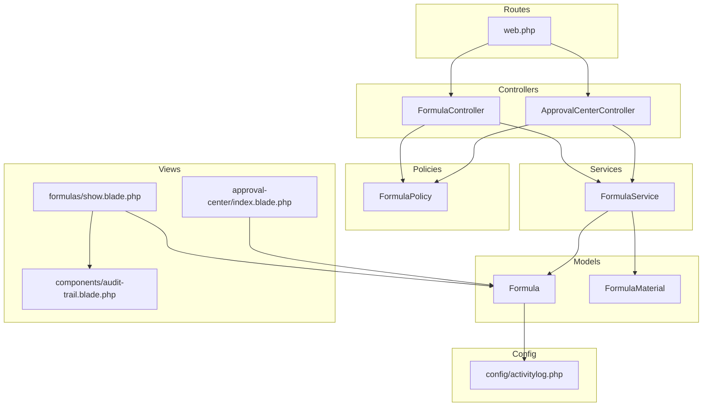
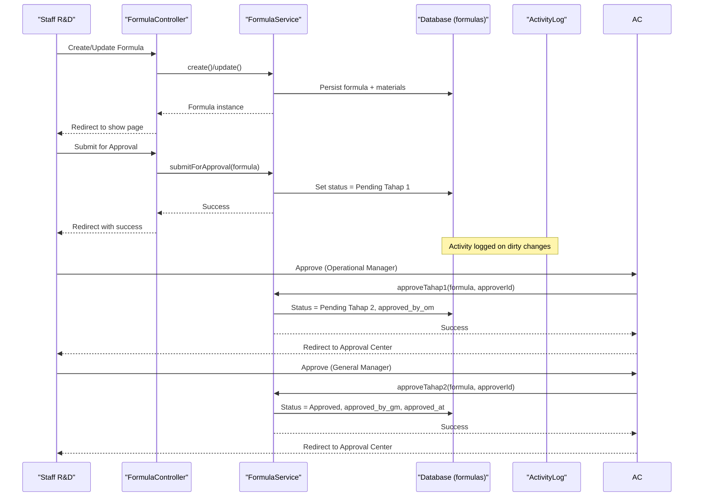
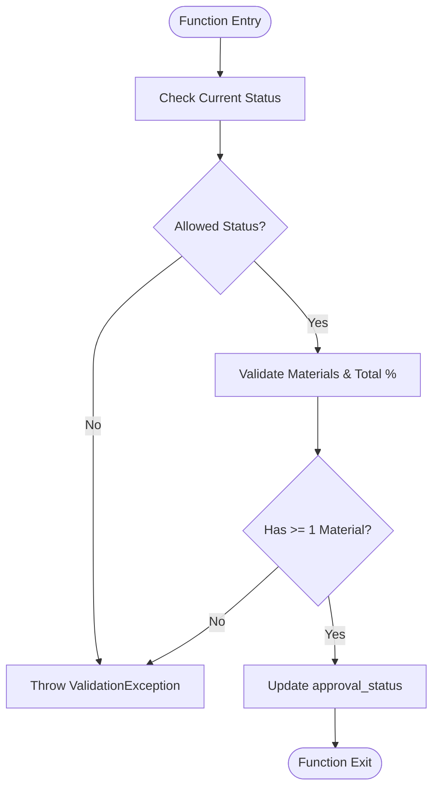
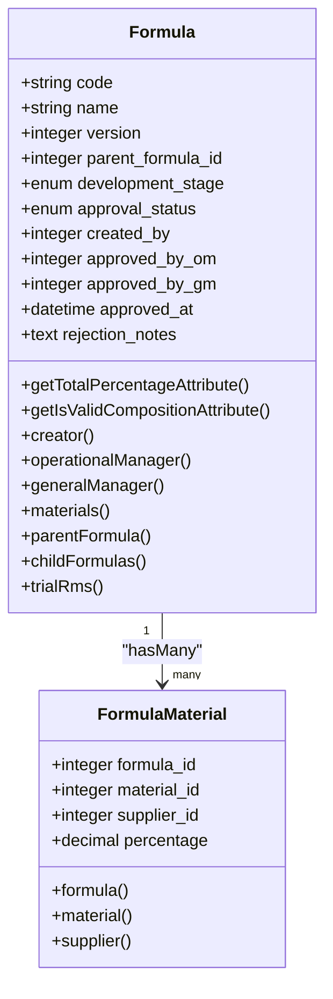
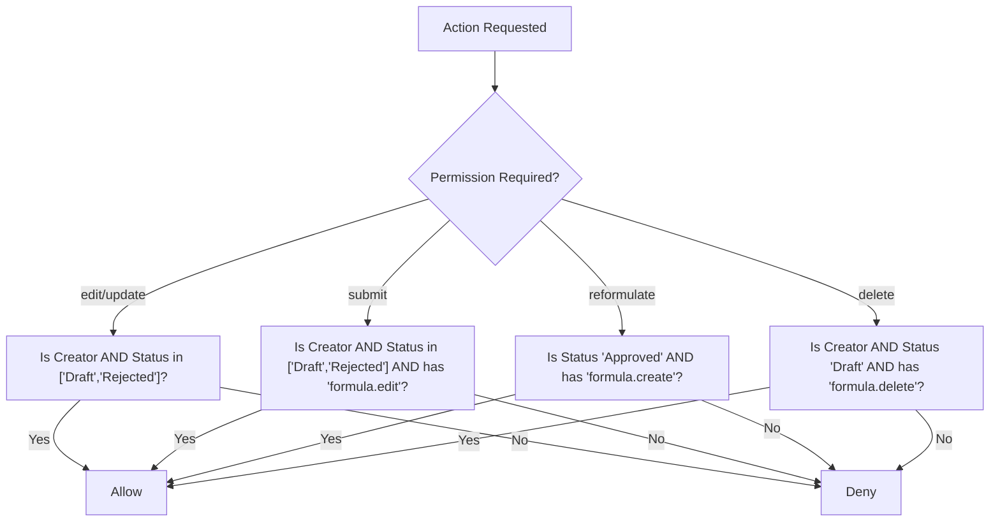
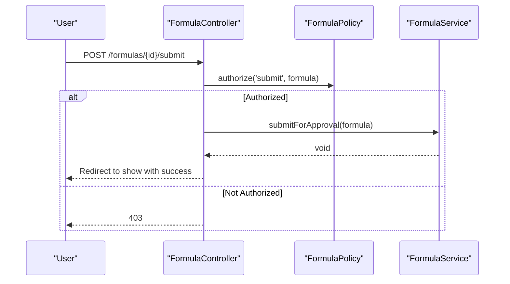
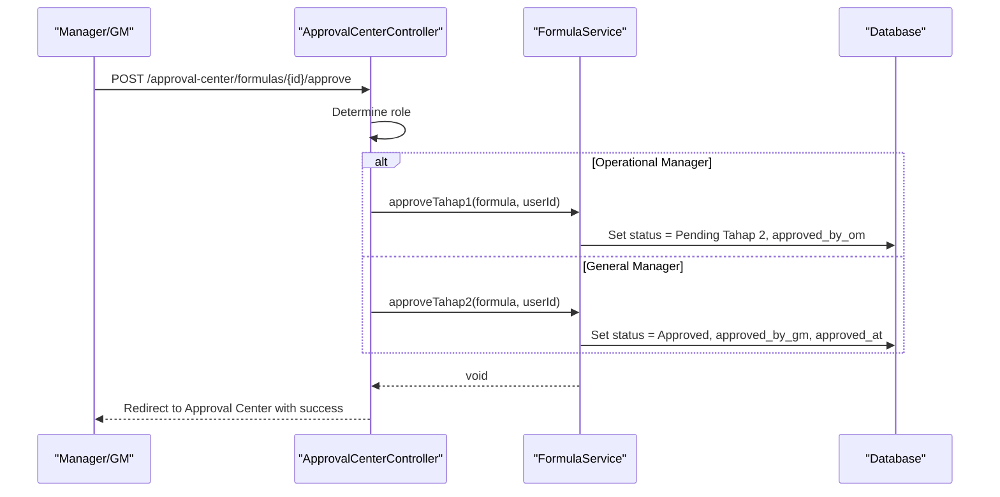
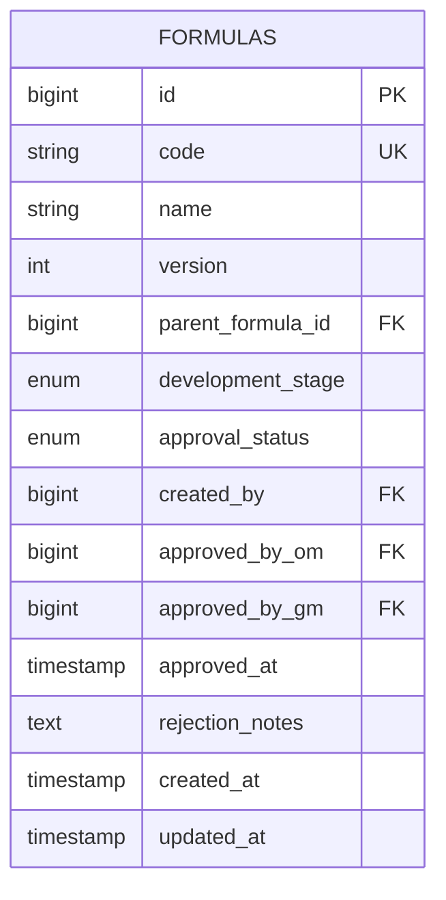
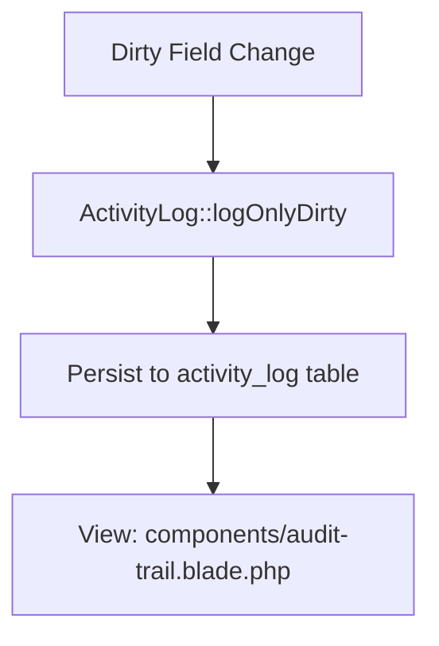
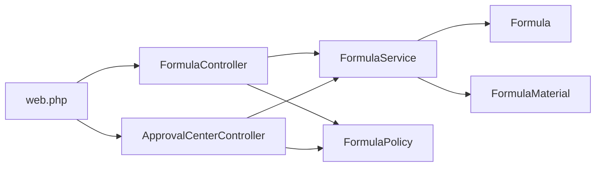

# Approval Workflow Integration

<cite>
**Referenced Files in This Document**
- [FormulaService.php](file://app/Services/FormulaService.php)
- [Formula.php](file://app/Models/Formula.php)
- [FormulaMaterial.php](file://app/Models/FormulaMaterial.php)
- [FormulaPolicy.php](file://app/Policies/FormulaPolicy.php)
- [FormulaController.php](file://app/Http/Controllers/FormulaController.php)
- [ApprovalCenterController.php](file://app/Http/Controllers/ApprovalCenterController.php)
- [web.php](file://routes/web.php)
- [2026_07_01_092832_create_formulas_table.php](file://database/migrations/2026_07_01_092832_create_formulas_table.php)
- [index.blade.php (Approval Center)](file://resources/views/approval-center/index.blade.php)
- [show.blade.php (Formula Detail)](file://resources/views/formulas/show.blade.php)
- [audit-trail.blade.php](file://resources/views/components/audit-trail.blade.php)
- [activitylog.php](file://config/activitylog.php)
</cite>

## Table of Contents
1. [Introduction](#introduction)
2. [Project Structure](#project-structure)
3. [Core Components](#core-components)
4. [Architecture Overview](#architecture-overview)
5. [Detailed Component Analysis](#detailed-component-analysis)
6. [Dependency Analysis](#dependency-analysis)
7. [Performance Considerations](#performance-considerations)
8. [Troubleshooting Guide](#troubleshooting-guide)
9. [Conclusion](#conclusion)
10. [Appendices](#appendices)

## Introduction
This document explains the formula approval workflow integration across creation, submission, and multi-stage approvals by Operational Manager and General Manager. It covers status transitions, policy-based authorization, rejection handling with notes, audit trail logging, and practical examples for submitting formulas, processing approvals/rejections, and tracking approval history.

## Project Structure
The approval workflow spans controllers, services, models, policies, routes, views, and activity logging configuration:
- Controllers orchestrate user actions and delegate to service methods.
- Service enforces business rules and performs state transitions.
- Model defines fields, relationships, and activity logging options.
- Policy gates access based on roles and permissions.
- Routes expose endpoints for submit, approve, reject, and reformulate.
- Views render approval queues, timelines, and audit trails.
- Activity log configures Spatie’s activity logger.

**Diagram sources**
- [FormulaController.php:1-201](file://app/Http/Controllers/FormulaController.php#L1-L201)
- [ApprovalCenterController.php:1-151](file://app/Http/Controllers/ApprovalCenterController.php#L1-L151)
- [FormulaService.php:1-228](file://app/Services/FormulaService.php#L1-L228)
- [Formula.php:1-89](file://app/Models/Formula.php#L1-L89)
- [FormulaMaterial.php:1-36](file://app/Models/FormulaMaterial.php#L1-L36)
- [FormulaPolicy.php:1-86](file://app/Policies/FormulaPolicy.php#L1-L86)
- [web.php:1-94](file://routes/web.php#L1-L94)
- [index.blade.php (Approval Center):1-234](file://resources/views/approval-center/index.blade.php#L1-L234)
- [show.blade.php (Formula Detail):1-340](file://resources/views/formulas/show.blade.php#L1-L340)
- [audit-trail.blade.php:1-46](file://resources/views/components/audit-trail.blade.php#L1-L46)
- [activitylog.php:1-53](file://config/activitylog.php#L1-L53)

**Section sources**
- [FormulaController.php:1-201](file://app/Http/Controllers/FormulaController.php#L1-L201)
- [ApprovalCenterController.php:1-151](file://app/Http/Controllers/ApprovalCenterController.php#L1-L151)
- [FormulaService.php:1-228](file://app/Services/FormulaService.php#L1-L228)
- [Formula.php:1-89](file://app/Models/Formula.php#L1-L89)
- [FormulaMaterial.php:1-36](file://app/Models/FormulaMaterial.php#L1-L36)
- [FormulaPolicy.php:1-86](file://app/Policies/FormulaPolicy.php#L1-L86)
- [web.php:1-94](file://routes/web.php#L1-L94)
- [index.blade.php (Approval Center):1-234](file://resources/views/approval-center/index.blade.php#L1-L234)
- [show.blade.php (Formula Detail):1-340](file://resources/views/formulas/show.blade.php#L1-L340)
- [audit-trail.blade.php:1-46](file://resources/views/components/audit-trail.blade.php#L1-L46)
- [activitylog.php:1-53](file://config/activitylog.php#L1-L53)

## Core Components
- FormulaService: Implements create/update, submitForApproval, approveTahap1, approveTahap2, reject, and reformulate. Enforces composition validation and material synchronization.
- Formula model: Defines fillable fields, timestamps, relations (creator, approvers, materials, parent/child), computed total percentage and validity, and activity logging options.
- FormulaPolicy: Gates edit, submit, reformulate, delete based on ownership and current status; requires permission checks via can().
- FormulaController: Exposes CRUD and custom actions (submit, reformulate). Uses Gate::authorize() before calling service methods.
- ApprovalCenterController: Central queue for managers. Determines role-based stage and calls appropriate service method for approve/reject.
- Routes: Define resource routes and custom POST endpoints for submit, approve, reject, and reformulate with middleware for permissions.
- Views: Approval Center lists pending items per role; Formula detail shows timeline, rejection notes, versioning, and audit trail.

**Section sources**
- [FormulaService.php:1-228](file://app/Services/FormulaService.php#L1-L228)
- [Formula.php:1-89](file://app/Models/Formula.php#L1-L89)
- [FormulaPolicy.php:1-86](file://app/Policies/FormulaPolicy.php#L1-L86)
- [FormulaController.php:1-201](file://app/Http/Controllers/FormulaController.php#L1-L201)
- [ApprovalCenterController.php:1-151](file://app/Http/Controllers/ApprovalCenterController.php#L1-L151)
- [web.php:1-94](file://routes/web.php#L1-L94)
- [index.blade.php (Approval Center):1-234](file://resources/views/approval-center/index.blade.php#L1-L234)
- [show.blade.php (Formula Detail):1-340](file://resources/views/formulas/show.blade.php#L1-L340)

## Architecture Overview
End-to-end flow from creation to final approval:

**Diagram sources**
- [FormulaController.php:168-181](file://app/Http/Controllers/FormulaController.php#L168-L181)
- [ApprovalCenterController.php:66-85](file://app/Http/Controllers/ApprovalCenterController.php#L66-L85)
- [FormulaService.php:77-133](file://app/Services/FormulaService.php#L77-L133)
- [Formula.php:31-36](file://app/Models/Formula.php#L31-L36)

## Detailed Component Analysis

### FormulaService: Approval Methods and Business Rules
Key responsibilities:
- Composition validation ensures total percentage does not exceed tolerance.
- Submission validates prerequisites (status, composition, at least one material).
- Stage approvals enforce current status and record approver IDs/timestamps.
- Rejection sets status to Rejected and persists rejection notes.
- Reformulation creates a new version copying materials from an Approved formula.

**Diagram sources**
- [FormulaService.php:77-98](file://app/Services/FormulaService.php#L77-L98)

**Section sources**
- [FormulaService.php:1-228](file://app/Services/FormulaService.php#L1-L228)

### Formula Model: Fields, Relations, and Audit Logging
Important aspects:
- Fillable fields include code, name, version, parent_formula_id, development_stage, approval_status, created_by, approved_by_om, approved_by_gm, approved_at, rejection_notes.
- Computed attributes calculate total_percentage and is_valid_composition.
- Activity logging configured to track only dirty changes for selected fields.

**Diagram sources**
- [Formula.php:1-89](file://app/Models/Formula.php#L1-L89)
- [FormulaMaterial.php:1-36](file://app/Models/FormulaMaterial.php#L1-L36)

**Section sources**
- [Formula.php:1-89](file://app/Models/Formula.php#L1-L89)
- [FormulaMaterial.php:1-36](file://app/Models/FormulaMaterial.php#L1-L36)

### FormulaPolicy: Authorization Rules
- viewAny/view: require formula.view permission.
- edit/update: allow only creator when status is Draft or Rejected and user has formula.edit.
- submit: allow only creator when status is Draft or Rejected and user has formula.edit.
- reformulate: allow any user with formula.create if formula is Approved.
- delete: allow only creator when status is Draft and user has formula.delete.

**Diagram sources**
- [FormulaPolicy.php:1-86](file://app/Policies/FormulaPolicy.php#L1-L86)

**Section sources**
- [FormulaPolicy.php:1-86](file://app/Policies/FormulaPolicy.php#L1-L86)

### FormulaController: Submission and Reformulation
- submit(Formula): Authorizes via Gate('submit'), calls service.submitForApproval, handles exceptions, redirects with success.
- reformulate(Formula): Authorizes via Gate('reformulate'), calls service.reformulate, redirects to edit of new version.

**Diagram sources**
- [FormulaController.php:168-181](file://app/Http/Controllers/FormulaController.php#L168-L181)
- [FormulaPolicy.php:60-65](file://app/Policies/FormulaPolicy.php#L60-L65)
- [FormulaService.php:77-98](file://app/Services/FormulaService.php#L77-L98)

**Section sources**
- [FormulaController.php:168-199](file://app/Http/Controllers/FormulaController.php#L168-L199)

### ApprovalCenterController: Multi-Stage Approvals and Rejections
- index(): Filters pending items by role (Operational Manager sees Tahap 1; General Manager sees Tahap 2).
- approveFormula(): Role-based dispatch to service.approveTahap1 or approveTahap2.
- rejectFormula(): Validates rejection_notes and calls service.reject.

**Diagram sources**
- [ApprovalCenterController.php:66-85](file://app/Http/Controllers/ApprovalCenterController.php#L66-L85)
- [FormulaService.php:103-133](file://app/Services/FormulaService.php#L103-L133)

**Section sources**
- [ApprovalCenterController.php:1-151](file://app/Http/Controllers/ApprovalCenterController.php#L1-L151)

### Database Schema: Approval Fields and Versioning
- approval_status enum includes Draft, Pending Tahap 1, Pending Tahap 2, Approved, Rejected.
- Tracking fields: created_by, approved_by_om, approved_by_gm, approved_at, rejection_notes.
- Versioning: version integer and parent_formula_id for reformulation lineage.

**Diagram sources**
- [2026_07_01_092832_create_formulas_table.php:12-28](file://database/migrations/2026_07_01_092832_create_formulas_table.php#L12-L28)

**Section sources**
- [2026_07_01_092832_create_formulas_table.php:12-28](file://database/migrations/2026_07_01_092832_create_formulas_table.php#L12-L28)

### Activity Logging and Audit Trail
- Formula model uses LogsActivity trait and configures LogOptions to log only dirty changes for specific fields.
- Config enables/disables logging and sets retention days.
- View component renders timeline with event descriptions, causer, and changed attributes.

**Diagram sources**
- [Formula.php:31-36](file://app/Models/Formula.php#L31-L36)
- [activitylog.php:1-53](file://config/activitylog.php#L1-L53)
- [audit-trail.blade.php:1-46](file://resources/views/components/audit-trail.blade.php#L1-L46)

**Section sources**
- [Formula.php:31-36](file://app/Models/Formula.php#L31-L36)
- [activitylog.php:1-53](file://config/activitylog.php#L1-L53)
- [audit-trail.blade.php:1-46](file://resources/views/components/audit-trail.blade.php#L1-L46)

## Dependency Analysis
- Controller-to-service coupling: FormulaController and ApprovalCenterController depend on FormulaService for all state-changing operations.
- Policy enforcement: Both controllers use Gate::authorize() to enforce FormulaPolicy rules prior to invoking service methods.
- Model dependencies: Formula depends on User (creator/approvers), FormulaMaterial, TrialRm; FormulaMaterial depends on Material and Supplier.
- Route bindings: web.php maps HTTP endpoints to controller methods and applies middleware for permissions.

**Diagram sources**
- [FormulaController.php:1-201](file://app/Http/Controllers/FormulaController.php#L1-L201)
- [ApprovalCenterController.php:1-151](file://app/Http/Controllers/ApprovalCenterController.php#L1-L151)
- [FormulaService.php:1-228](file://app/Services/FormulaService.php#L1-L228)
- [Formula.php:1-89](file://app/Models/Formula.php#L1-L89)
- [FormulaMaterial.php:1-36](file://app/Models/FormulaMaterial.php#L1-L36)
- [FormulaPolicy.php:1-86](file://app/Policies/FormulaPolicy.php#L1-L86)
- [web.php:1-94](file://routes/web.php#L1-L94)

**Section sources**
- [FormulaController.php:1-201](file://app/Http/Controllers/FormulaController.php#L1-L201)
- [ApprovalCenterController.php:1-151](file://app/Http/Controllers/ApprovalCenterController.php#L1-L151)
- [FormulaService.php:1-228](file://app/Services/FormulaService.php#L1-L228)
- [Formula.php:1-89](file://app/Models/Formula.php#L1-L89)
- [FormulaMaterial.php:1-36](file://app/Models/FormulaMaterial.php#L1-L36)
- [FormulaPolicy.php:1-86](file://app/Policies/FormulaPolicy.php#L1-L86)
- [web.php:1-94](file://routes/web.php#L1-L94)

## Performance Considerations
- Batch updates: Service methods update single records; consider batching if bulk approvals are introduced.
- Eager loading: Show page loads related data (materials, creators, approvers, activities); ensure indexes on foreign keys and frequently filtered columns (approval_status, development_stage).
- Activity log volume: Only dirty changes are logged; monitor growth and retention settings.

[No sources needed since this section provides general guidance]

## Troubleshooting Guide
Common issues and resolutions:
- Cannot submit: Ensure status is Draft or Rejected, composition totals exactly 100%, and at least one material exists.
- Unauthorized submit/edit: Verify user is creator and has required permissions; check policy conditions.
- Approval fails due to wrong stage: Confirm current approval_status matches expected stage for the approver role.
- Rejection notes missing: Reject endpoint requires rejection_notes; validate input before submission.
- Audit trail empty: Confirm activity logging is enabled and dirty changes occur on tracked fields.

**Section sources**
- [FormulaService.php:77-150](file://app/Services/FormulaService.php#L77-L150)
- [FormulaPolicy.php:38-84](file://app/Policies/FormulaPolicy.php#L38-L84)
- [ApprovalCenterController.php:90-105](file://app/Http/Controllers/ApprovalCenterController.php#L90-L105)
- [activitylog.php:1-53](file://config/activitylog.php#L1-L53)

## Conclusion
The formula approval workflow integrates robust policy-based authorization, clear status transitions, and comprehensive audit logging. The design separates concerns between controllers, services, and models, ensuring maintainability and clarity. Managers can efficiently process approvals through a centralized queue, while staff can track progress and history via detailed views.

[No sources needed since this section summarizes without analyzing specific files]

## Appendices

### Examples

- Submitting a formula for approval:
  - Navigate to the formula detail page and click “Submit for Approval.” The controller authorizes via policy, then service transitions status to Pending Tahap 1 after validating composition and materials.
  - References:
    - [FormulaController.php:168-181](file://app/Http/Controllers/FormulaController.php#L168-L181)
    - [FormulaService.php:77-98](file://app/Services/FormulaService.php#L77-L98)
    - [FormulaPolicy.php:60-65](file://app/Policies/FormulaPolicy.php#L60-L65)

- Processing approvals:
  - Operational Manager approves in Approval Center, transitioning to Pending Tahap 2 and recording approver ID.
  - General Manager approves final stage, setting status to Approved and recording timestamp.
  - References:
    - [ApprovalCenterController.php:66-85](file://app/Http/Controllers/ApprovalCenterController.php#L66-L85)
    - [FormulaService.php:103-133](file://app/Services/FormulaService.php#L103-L133)

- Handling rejections:
  - Manager clicks “Reject,” fills required notes, and submits. Service sets status to Rejected and stores notes.
  - References:
    - [ApprovalCenterController.php:90-105](file://app/Http/Controllers/ApprovalCenterController.php#L90-L105)
    - [FormulaService.php:138-150](file://app/Services/FormulaService.php#L138-L150)

- Tracking approval history:
  - Formula detail page displays approval timeline and audit trail component showing events, actors, and changed fields.
  - References:
    - [show.blade.php (Formula Detail):259-336](file://resources/views/formulas/show.blade.php#L259-L336)
    - [audit-trail.blade.php:1-46](file://resources/views/components/audit-trail.blade.php#L1-L46)
    - [Formula.php:31-36](file://app/Models/Formula.php#L31-L36)