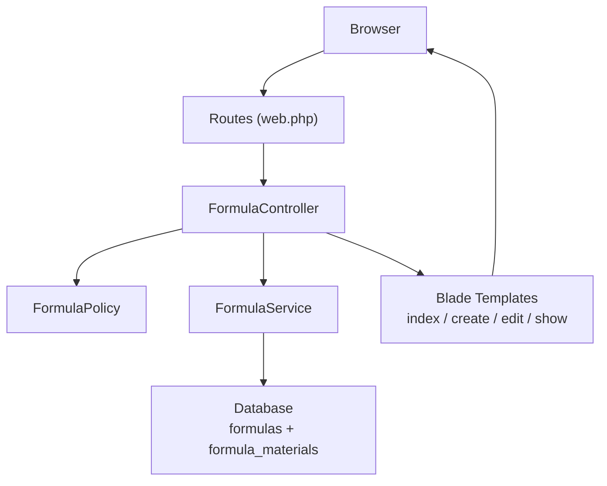
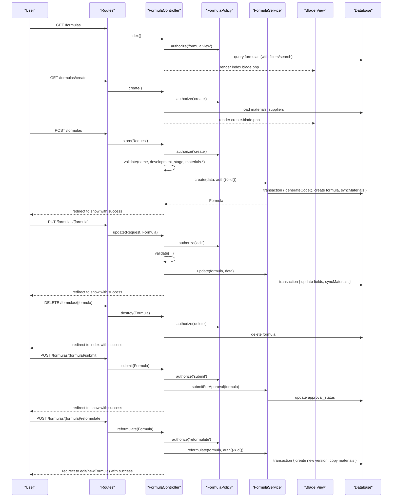
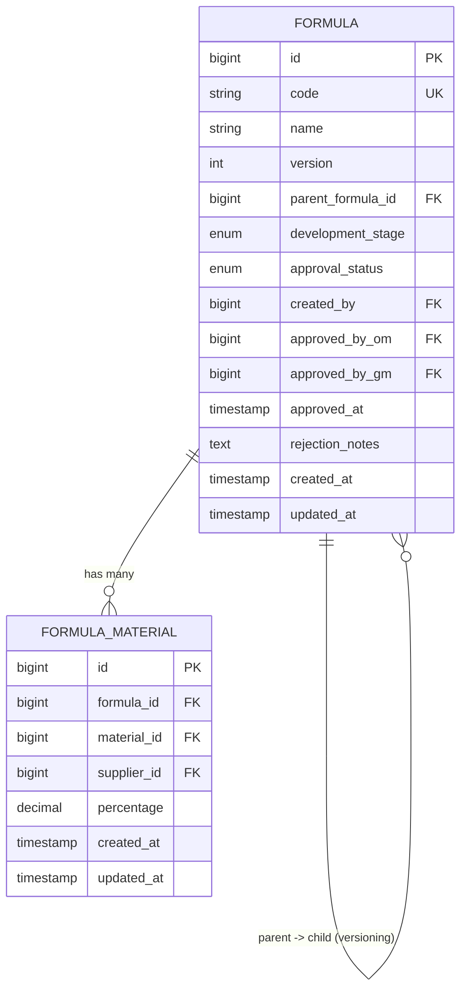
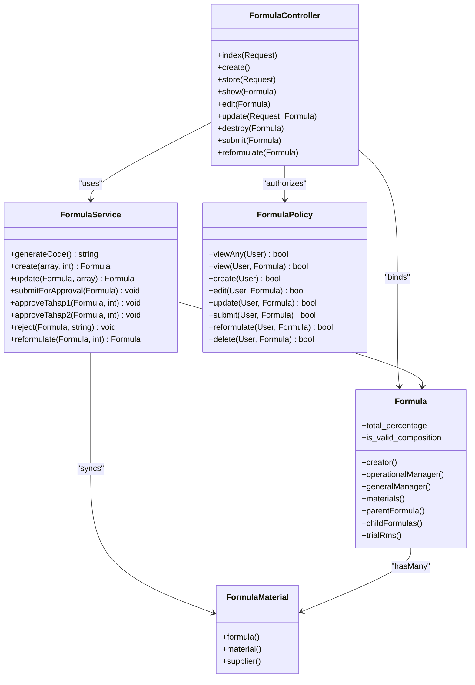

# Formula CRUD Operations

<cite>
**Referenced Files in This Document**
- [FormulaController.php](file://app/Http/Controllers/FormulaController.php)
- [FormulaService.php](file://app/Services/Formulaservice.php)
- [Formula.php](file://app/Models/Formula.php)
- [FormulaMaterial.php](file://app/Models/FormulaMaterial.php)
- [FormulaPolicy.php](file://app/Policies/FormulaPolicy.php)
- [web.php](file://routes/web.php)
- [index.blade.php](file://resources/views/formulas/index.blade.php)
- [create.blade.php](file://resources/views/formulas/create.blade.php)
- [edit.blade.php](file://resources/views/formulas/edit.blade.php)
- [show.blade.php](file://resources/views/formulas/show.blade.php)
- [2026_07_01_092832_create_formulas_table.php](file://database/migrations/2026_07_01_092832_create_formulas_table.php)
- [2026_07_01_092840_create_formula_materials_table.php](file://database/migrations/2026_07_01_092840_create_formula_materials_table.php)
</cite>

## Table of Contents
1. [Introduction](#introduction)
2. [Project Structure](#project-structure)
3. [Core Components](#core-components)
4. [Architecture Overview](#architecture-overview)
5. [Detailed Component Analysis](#detailed-component-analysis)
6. [Dependency Analysis](#dependency-analysis)
7. [Performance Considerations](#performance-considerations)
8. [Troubleshooting Guide](#troubleshooting-guide)
9. [Conclusion](#conclusion)

## Introduction
This document explains the complete CRUD operations for Formulas, including create, read, update, and delete flows, form handling, validation rules, data persistence, controller methods, request validation, Blade template interactions, and user feedback mechanisms. It also covers custom actions such as submitting a formula for approval and creating a new version via reformulation.

## Project Structure
The Formula feature follows a layered architecture:
- Routes define HTTP endpoints and apply authorization middleware.
- Controller methods handle requests, enforce policies, validate input, and delegate business logic to a service.
- Service encapsulates domain logic (code generation, composition validation, transactions, state transitions).
- Models represent entities and relationships; Eloquent helpers compute derived values like total percentage.
- Blade templates render lists, forms, and detail pages with Alpine.js-driven dynamic material rows and live percentage calculation.

**Diagram sources**
- [web.php:33-40](file://routes/web.php#L33-L40)
- [FormulaController.php:13-200](file://app/Http/Controllers/FormulaController.php#L13-L200)
- [FormulaService.php:10-227](file://app/Services/Formulaservice.php#L10-L227)
- [Formula.php:9-88](file://app/Models/Formula.php#L9-L88)
- [FormulaMaterial.php:7-35](file://app/Models/FormulaMaterial.php#L7-L35)
- [index.blade.php:1-156](file://resources/views/formulas/index.blade.php#L1-L156)
- [create.blade.php:1-289](file://resources/views/formulas/create.blade.php#L1-L289)
- [edit.blade.php:1-253](file://resources/views/formulas/edit.blade.php#L1-L253)
- [show.blade.php:1-340](file://resources/views/formulas/show.blade.php#L1-L340)

**Section sources**
- [web.php:33-40](file://routes/web.php#L33-L40)
- [FormulaController.php:13-200](file://app/Http/Controllers/FormulaController.php#L13-L200)
- [FormulaService.php:10-227](file://app/Services/Formulaservice.php#L10-L227)
- [Formula.php:9-88](file://app/Models/Formula.php#L9-L88)
- [FormulaMaterial.php:7-35](file://app/Models/FormulaMaterial.php#L7-L35)
- [index.blade.php:1-156](file://resources/views/formulas/index.blade.php#L1-L156)
- [create.blade.php:1-289](file://resources/views/formulas/create.blade.php#L1-L289)
- [edit.blade.php:1-253](file://resources/views/formulas/edit.blade.php#L1-L253)
- [show.blade.php:1-340](file://resources/views/formulas/show.blade.php#L1-L340)

## Core Components
- FormulaController: Entry point for all Formula-related HTTP operations. Enforces policy checks, validates requests, delegates to FormulaService, and returns views or redirects with flash messages.
- FormulaService: Encapsulates business rules: code generation, composition validation, transactional create/update, submission for approval, and reformulation.
- Formula Model: Defines fillable fields, casts, activity logging, and relationships (creator, managers, materials, parent/child versions, trials). Provides computed attributes for total percentage and validity.
- FormulaMaterial Model: Represents the many-to-many pivot between formulas and materials with an optional supplier and percentage.
- FormulaPolicy: Authorization rules controlling who can view, create, edit, submit, reformulate, and delete based on roles and formula status.
- Blade Templates: Provide UI for listing, creating, editing, and viewing formulas, including dynamic material rows and live percentage calculations.

**Section sources**
- [FormulaController.php:13-200](file://app/Http/Controllers/FormulaController.php#L13-L200)
- [FormulaService.php:10-227](file://app/Services/Formulaservice.php#L10-L227)
- [Formula.php:9-88](file://app/Models/Formula.php#L9-L88)
- [FormulaMaterial.php:7-35](file://app/Models/FormulaMaterial.php#L7-L35)
- [FormulaPolicy.php:8-85](file://app/Policies/FormulaPolicy.php#L8-L85)
- [index.blade.php:1-156](file://resources/views/formulas/index.blade.php#L1-L156)
- [create.blade.php:1-289](file://resources/views/formulas/create.blade.php#L1-L289)
- [edit.blade.php:1-253](file://resources/views/formulas/edit.blade.php#L1-L253)
- [show.blade.php:1-340](file://resources/views/formulas/show.blade.php#L1-L340)

## Architecture Overview
The system uses Laravel resource routing with additional custom actions for approval workflows. The controller authorizes actions via policies, validates inputs, and delegates to the service which performs database operations within transactions.

**Diagram sources**
- [web.php:33-40](file://routes/web.php#L33-L40)
- [FormulaController.php:20-200](file://app/Http/Controllers/FormulaController.php#L20-L200)
- [FormulaService.php:35-190](file://app/Services/Formulaservice.php#L35-L190)
- [Formula.php:39-88](file://app/Models/Formula.php#L39-L88)
- [FormulaMaterial.php:21-34](file://app/Models/FormulaMaterial.php#L21-L34)

## Detailed Component Analysis

### Data Model and Relationships
The core entities are Formula and FormulaMaterial. Formula tracks metadata, versioning, and approval workflow. FormulaMaterial stores each line item with material, optional supplier, and percentage.

**Diagram sources**
- [2026_07_01_092832_create_formulas_table.php:14-28](file://database/migrations/2026_07_01_092832_create_formulas_table.php#L14-L28)
- [2026_07_01_092840_create_formula_materials_table.php:14-21](file://database/migrations/2026_07_01_092840_create_formula_materials_table.php#L14-L21)
- [Formula.php:13-25](file://app/Models/Formula.php#L13-L25)
- [FormulaMaterial.php:9-18](file://app/Models/FormulaMaterial.php#L9-L18)

**Section sources**
- [Formula.php:9-88](file://app/Models/Formula.php#L9-L88)
- [FormulaMaterial.php:7-35](file://app/Models/FormulaMaterial.php#L7-L35)
- [2026_07_01_092832_create_formulas_table.php:14-28](file://database/migrations/2026_07_01_092832_create_formulas_table.php#L14-L28)
- [2026_07_01_092840_create_formula_materials_table.php:14-21](file://database/migrations/2026_07_01_092840_create_formula_materials_table.php#L14-L21)

### Controller Methods and Request Validation
- index(Request): Lists formulas with search by code/name, filter by status and stage, paginates results, and provides summary counts for badges.
- create(): Authorizes creation, loads materials, suppliers, and stages, renders create form.
- store(Request): Authorizes creation, validates required fields and nested materials array, calls service to persist, handles ValidationException, redirects with success.
- show(Formula): Loads detailed relations (materials with material/supplier, creator, managers, parent/child, trials, activities), renders show page.
- edit(Formula): Authorizes edit, loads existing materials, renders edit form.
- update(Request, Formula): Authorizes edit, validates input, updates via service, handles exceptions, redirects with success.
- destroy(Formula): Authorizes delete, deletes formula, redirects with success.
- submit(Formula): Authorizes submit, delegates to service to transition status, handles exceptions, redirects with success.
- reformulate(Formula): Authorizes reformulation, creates a new version copying materials, redirects to edit with success.

Validation rules applied in controller:
- name: required, string, max 255
- development_stage: required, one of Draf, Pra-Trial, Optimalisasi, Final
- materials: array
- materials.*.material_id: required, exists:materials,id
- materials.*.supplier_id: nullable, exists:suppliers,id
- materials.*.percentage: required, numeric, min 0.01, max 100

Error handling:
- ValidationException caught and returned back with errors and old input.
- Flash success messages used for user feedback after successful operations.

**Section sources**
- [FormulaController.php:20-200](file://app/Http/Controllers/FormulaController.php#L20-L200)

### Service Logic and Business Rules
Key responsibilities:
- Code generation: FRM-YYYYMM-XXX format with sequential numbering per month.
- Create: Validates composition totals, creates formula with Draft status, syncs materials.
- Update: Validates composition totals, updates name and stage, syncs materials.
- Submit for Approval: Ensures status is Draft or Rejected, composition equals 100%, at least one material present, then sets Pending Tahap 1.
- Approve Tahap 1/Tahap 2 and Reject: State transitions with approver tracking and timestamps.
- Reformulate: Creates a new version from an Approved formula, copies materials as starting point.
- Composition validation: Allows empty materials for drafts but enforces not exceeding 100% with floating-point tolerance.

Data persistence:
- Uses database transactions for create/update/reformulate to ensure consistency.
- Deletes existing materials before re-inserting to avoid duplicates.

**Section sources**
- [FormulaService.php:15-227](file://app/Services/Formulaservice.php#L15-L227)

### Policies and Authorization
Authorization rules:
- viewAny/view: Require formula.view permission.
- create: Require formula.create permission.
- edit/update: Require formula.edit permission and only if the current user is the creator and the formula is Draft or Rejected.
- submit: Only creator with formula.edit permission and formula in Draft or Rejected.
- reformulate: Any user with formula.create permission when formula is Approved.
- delete: Only creator with formula.delete permission and formula is Draft.

These policies are enforced in controller methods using Gate::authorize.

**Section sources**
- [FormulaPolicy.php:8-85](file://app/Policies/FormulaPolicy.php#L8-L85)
- [FormulaController.php:58-163](file://app/Http/Controllers/FormulaController.php#L58-L163)

### Blade Templates and User Interaction
- index.blade.php: Displays list with filter tabs (All, Draft, Pending, Approved), search box, pagination, and quick actions (View/Edit) where authorized. Shows total percentage progress bar and status badge.
- create.blade.php: Form with basic info and dynamic material rows managed by Alpine.js. Live percentage counter updates as users add/remove rows. Error bag displayed at top. Sidebar shows auto-generated code hint and validation rules.
- edit.blade.php: Pre-populated form with existing materials loaded into Alpine initial state. Same dynamic row management and percentage calculation. Delete action available only if authorized and formula is Draft.
- show.blade.php: Detail view with header showing code, status, version, and actions (Edit, Submit for Approval, Reformulate). Displays composition table sorted by percentage, related trial RM entries, approval timeline, rejection notes, child versions, and audit trail.

Form handling details:
- CSRF protection included in forms.
- Edit form uses method spoofing (PUT/DELETE) for update/destroy routes.
- Alpine.js functions manage rows and recalculate totals client-side.

User feedback:
- Success flash messages shown on show page.
- Validation errors rendered inline next to fields and aggregated at top of forms.

**Section sources**
- [index.blade.php:1-156](file://resources/views/formulas/index.blade.php#L1-L156)
- [create.blade.php:1-289](file://resources/views/formulas/create.blade.php#L1-L289)
- [edit.blade.php:1-253](file://resources/views/formulas/edit.blade.php#L1-L253)
- [show.blade.php:1-340](file://resources/views/formulas/show.blade.php#L1-L340)

### Practical Examples

#### Creating a New Formula
- Navigate to Create page via route link or button.
- Fill product name and development stage.
- Add material rows: select material, optional supplier, enter percentage.
- Observe live total percentage; adjust until valid.
- Submit form; server validates and persists via service; redirect to detail with success message.

Relevant paths:
- Route: POST /formulas
- Controller: store(Request)
- Service: create(array $data, int $createdBy)
- View: create.blade.php

**Section sources**
- [web.php:33-40](file://routes/web.php#L33-L40)
- [FormulaController.php:72-94](file://app/Http/Controllers/FormulaController.php#L72-L94)
- [FormulaService.php:35-53](file://app/Services/Formulaservice.php#L35-L53)
- [create.blade.php:37-263](file://resources/views/formulas/create.blade.php#L37-L263)

#### Editing an Existing Formula
- From list or detail page, click Edit if authorized.
- Modify name, stage, and material rows.
- Save changes; server validates and updates via service; redirect to detail with success.

Relevant paths:
- Route: PUT /formulas/{formula}
- Controller: update(Request, Formula)
- Service: update(Formula $formula, array $data)
- View: edit.blade.php

**Section sources**
- [web.php:33-40](file://routes/web.php#L33-L40)
- [FormulaController.php:127-149](file://app/Http/Controllers/FormulaController.php#L127-L149)
- [FormulaService.php:58-72](file://app/Services/Formulaservice.php#L58-L72)
- [edit.blade.php:51-225](file://resources/views/formulas/edit.blade.php#L51-L225)

#### Viewing Formula Details
- Click a formula row or “View” action to open detail page.
- Inspect composition, status, approvals, related trials, and audit trail.
- Actions available depend on authorization and current status.

Relevant paths:
- Route: GET /formulas/{formula}
- Controller: show(Formula)
- View: show.blade.php

**Section sources**
- [web.php:33-40](file://routes/web.php#L33-L40)
- [FormulaController.php:99-106](file://app/Http/Controllers/FormulaController.php#L99-L106)
- [show.blade.php:1-340](file://resources/views/formulas/show.blade.php#L1-L340)

#### Managing Formula Listings
- Use filter tabs to narrow by status.
- Search by code or name.
- Pagination controls navigate through results.

Relevant paths:
- Route: GET /formulas
- Controller: index(Request)
- View: index.blade.php

**Section sources**
- [web.php:33-40](file://routes/web.php#L33-L40)
- [FormulaController.php:20-53](file://app/Http/Controllers/FormulaController.php#L20-L53)
- [index.blade.php:1-156](file://resources/views/formulas/index.blade.php#L1-L156)

#### Deleting a Formula
- On edit page, click “Delete Formula” if authorized and formula is Draft.
- Confirm deletion; server deletes record and redirects to list with success.

Relevant paths:
- Route: DELETE /formulas/{formula}
- Controller: destroy(Formula)
- View: edit.blade.php

**Section sources**
- [web.php:33-40](file://routes/web.php#L33-L40)
- [FormulaController.php:154-163](file://app/Http/Controllers/FormulaController.php#L154-L163)
- [edit.blade.php:210-221](file://resources/views/formulas/edit.blade.php#L210-L221)

#### Submitting for Approval
- From detail page, click “Submit for Approval” if authorized and composition is valid.
- Server transitions status to Pending Tahap 1.

Relevant paths:
- Route: POST /formulas/{formula}/submit
- Controller: submit(Formula)
- Service: submitForApproval(Formula)
- View: show.blade.php

**Section sources**
- [web.php:35-37](file://routes/web.php#L35-L37)
- [FormulaController.php:168-181](file://app/Http/Controllers/FormulaController.php#L168-L181)
- [FormulaService.php:77-98](file://app/Services/Formulaservice.php#L77-L98)
- [show.blade.php:48-68](file://resources/views/formulas/show.blade.php#L48-L68)

#### Reformulating (Creating a New Version)
- From detail page, click “Reformulasi” if authorized and formula is Approved.
- Server creates a new version with copied materials and redirects to edit.

Relevant paths:
- Route: POST /formulas/{formula}/reformulate
- Controller: reformulate(Formula)
- Service: reformulate(Formula, int $createdBy)
- View: show.blade.php

**Section sources**
- [web.php:38-40](file://routes/web.php#L38-L40)
- [FormulaController.php:186-199](file://app/Http/Controllers/FormulaController.php#L186-L199)
- [FormulaService.php:155-190](file://app/Services/Formulaservice.php#L155-L190)
- [show.blade.php:70-79](file://resources/views/formulas/show.blade.php#L70-L79)

## Dependency Analysis
The following diagram maps key dependencies among controllers, services, models, and views.

**Diagram sources**
- [FormulaController.php:13-200](file://app/Http/Controllers/FormulaController.php#L13-L200)
- [FormulaService.php:10-227](file://app/Services/Formulaservice.php#L10-L227)
- [Formula.php:9-88](file://app/Models/Formula.php#L9-L88)
- [FormulaMaterial.php:7-35](file://app/Models/FormulaMaterial.php#L7-L35)
- [FormulaPolicy.php:8-85](file://app/Policies/FormulaPolicy.php#L8-L85)

**Section sources**
- [FormulaController.php:13-200](file://app/Http/Controllers/FormulaController.php#L13-L200)
- [FormulaService.php:10-227](file://app/Services/Formulaservice.php#L10-L227)
- [Formula.php:9-88](file://app/Models/Formula.php#L9-L88)
- [FormulaMaterial.php:7-35](file://app/Models/FormulaMaterial.php#L7-L35)
- [FormulaPolicy.php:8-85](file://app/Policies/FormulaPolicy.php#L8-L85)

## Performance Considerations
- Index queries use eager loading for creator and filtering by status/stage; consider adding database indexes on frequently filtered columns (approval_status, development_stage, code, name) to improve performance.
- Show action loads multiple relations; ensure only necessary relations are requested for large datasets.
- Material synchronization deletes and reinserts all rows; for high-volume compositions, consider batch inserts or diff-based updates.
- Floating-point tolerance in composition validation avoids precision issues; keep tolerance consistent across client and server.

[No sources needed since this section provides general guidance]

## Troubleshooting Guide
Common issues and resolutions:
- Validation errors on submit: Check that name and development_stage are provided, materials array contains valid IDs, and percentages sum to 100%. Errors are returned to the form with old input preserved.
- Cannot submit for approval: Ensure formula status is Draft or Rejected, composition equals 100%, and at least one material exists.
- Cannot edit or delete: Verify authorization rules—only the creator can edit/delete, and only when status allows (Draft or Rejected for edit; Draft for delete).
- Redirect loops or missing success messages: Confirm routes are correctly registered and controller methods return proper redirects with flash messages.

**Section sources**
- [FormulaController.php:72-149](file://app/Http/Controllers/FormulaController.php#L72-L149)
- [FormulaService.php:77-98](file://app/Services/Formulaservice.php#L77-L98)
- [FormulaPolicy.php:38-84](file://app/Policies/FormulaPolicy.php#L38-L84)
- [create.blade.php:20-35](file://resources/views/formulas/create.blade.php#L20-L35)
- [edit.blade.php:26-39](file://resources/views/formulas/edit.blade.php#L26-L39)
- [show.blade.php:12-25](file://resources/views/formulas/show.blade.php#L12-L25)

## Conclusion
The Formula CRUD implementation follows a clean separation of concerns with robust validation, authorization, and business logic encapsulated in a service layer. Blade templates provide intuitive interfaces with real-time feedback, while policies ensure secure access control. Custom actions support the approval workflow and versioning through reformulation, enabling traceability and iterative improvements.