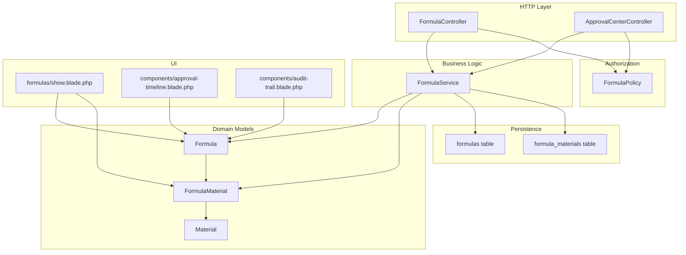
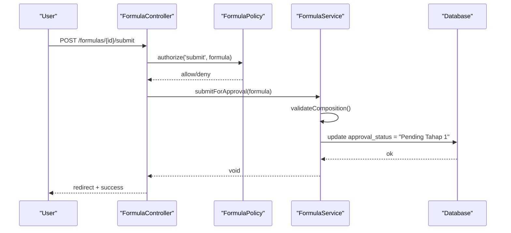
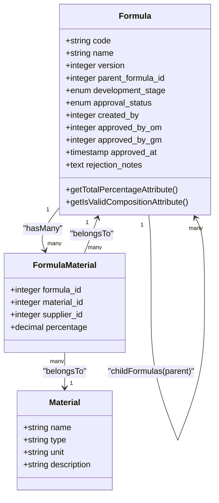
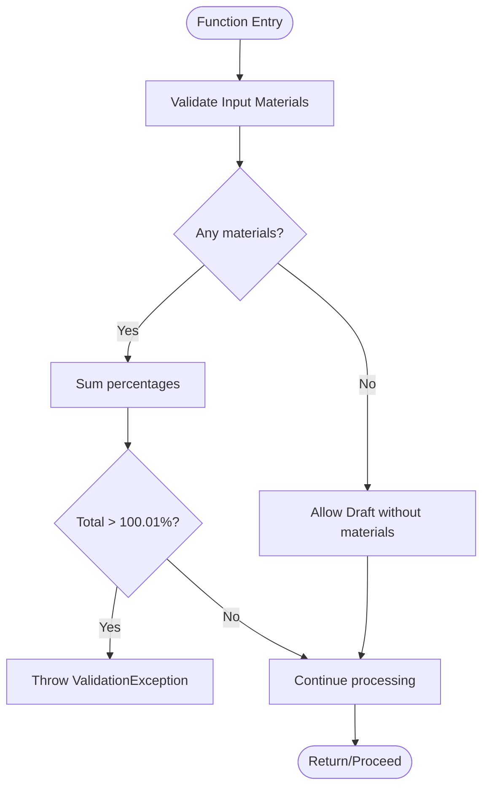
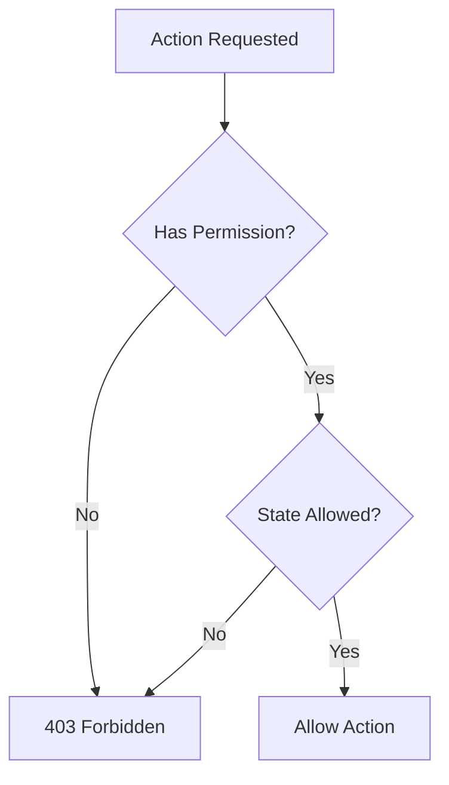
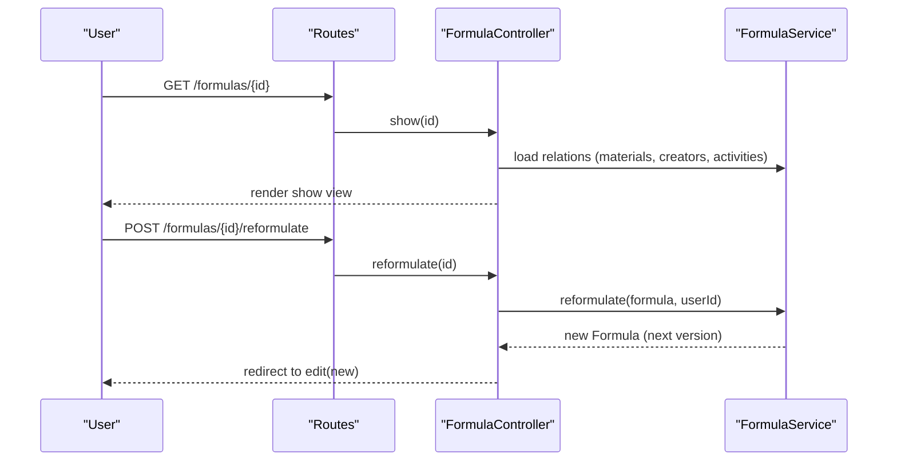
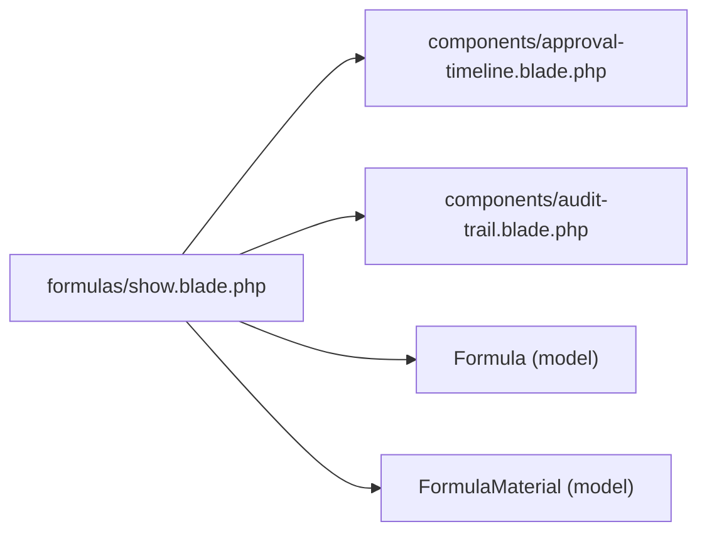
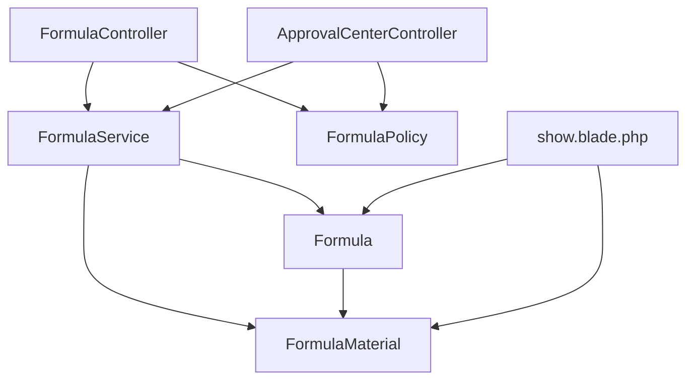

# Formula Management

<cite>
**Referenced Files in This Document**
- [Formula.php](file://app/Models/Formula.php)
- [FormulaMaterial.php](file://app/Models/FormulaMaterial.php)
- [Material.php](file://app/Models/Material.php)
- [FormulaService.php](file://app/Services/FormulaService.php)
- [FormulaController.php](file://app/Http/Controllers/FormulaController.php)
- [ApprovalCenterController.php](file://app/Http/Controllers/ApprovalCenterController.php)
- [FormulaPolicy.php](file://app/Policies/FormulaPolicy.php)
- [web.php](file://routes/web.php)
- [2026_07_01_092832_create_formulas_table.php](file://database/migrations/2026_07_01_092832_create_formulas_table.php)
- [2026_07_01_092840_create_formula_materials_table.php](file://database/migrations/2026_07_01_092840_create_formula_materials_table.php)
- [show.blade.php](file://resources/views/formulas/show.blade.php)
- [approval-timeline.blade.php](file://resources/views/components/approval-timeline.blade.php)
- [audit-trail.blade.php](file://resources/views/components/audit-trail.blade.php)
- [FormulaTest.php](file://tests/Feature/FormulaTest.php)
</cite>

## Table of Contents
1. [Introduction](#introduction)
2. [Project Structure](#project-structure)
3. [Core Components](#core-components)
4. [Architecture Overview](#architecture-overview)
5. [Detailed Component Analysis](#detailed-component-analysis)
6. [Dependency Analysis](#dependency-analysis)
7. [Performance Considerations](#performance-considerations)
8. [Troubleshooting Guide](#troubleshooting-guide)
9. [Conclusion](#conclusion)
10. [Appendices](#appendices)

## Introduction
This document explains the Formula Management module end-to-end: how formulas are created, versioned, composed of materials, validated, submitted for approval, and tracked through an audit trail. It covers the parent-child versioning model, material composition management, business logic in the service layer, and integration with the Approval Center workflow. Practical examples illustrate creating formulas, managing materials, handling reformulations, and tracking changes.

## Project Structure
The Formula Management feature spans models, services, controllers, policies, routes, views, migrations, and tests. The key responsibilities are:
- Models define entities and relationships (formula, formula-material, material).
- Service encapsulates business rules (composition validation, approval transitions, reformulation).
- Controllers handle HTTP requests and delegate to the service.
- Policies enforce authorization per action and state.
- Routes expose endpoints and map to controller actions.
- Views render details, timelines, and audit trails.
- Migrations define schema and constraints.
- Tests validate core behaviors.



**Diagram sources**
- [FormulaController.php](file://app/Http/Controllers/FormulaController.php)
- [ApprovalCenterController.php](file://app/Http/Controllers/ApprovalCenterController.php)
- [FormulaService.php](file://app/Services/FormulaService.php)
- [Formula.php](file://app/Models/Formula.php)
- [FormulaMaterial.php](file://app/Models/FormulaMaterial.php)
- [Material.php](file://app/Models/Material.php)
- [FormulaPolicy.php](file://app/Policies/FormulaPolicy.php)
- [2026_07_01_092832_create_formulas_table.php](file://database/migrations/2026_07_01_092832_create_formulas_table.php)
- [2026_07_01_092840_create_formula_materials_table.php](file://database/migrations/2026_07_01_092840_create_formula_materials_table.php)
- [show.blade.php](file://resources/views/formulas/show.blade.php)
- [approval-timeline.blade.php](file://resources/views/components/approval-timeline.blade.php)
- [audit-trail.blade.php](file://resources/views/components/audit-trail.blade.php)

**Section sources**
- [web.php](file://routes/web.php)
- [FormulaController.php](file://app/Http/Controllers/FormulaController.php)
- [ApprovalCenterController.php](file://app/Http/Controllers/ApprovalCenterController.php)
- [FormulaService.php](file://app/Services/FormulaService.php)
- [Formula.php](file://app/Models/Formula.php)
- [FormulaMaterial.php](file://app/Models/FormulaMaterial.php)
- [Material.php](file://app/Models/Material.php)
- [FormulaPolicy.php](file://app/Policies/FormulaPolicy.php)
- [2026_07_01_092832_create_formulas_table.php](file://database/migrations/2026_07_01_092832_create_formulas_table.php)
- [2026_07_01_092840_create_formula_materials_table.php](file://database/migrations/2026_07_01_092840_create_formula_materials_table.php)
- [show.blade.php](file://resources/views/formulas/show.blade.php)
- [approval-timeline.blade.php](file://resources/views/components/approval-timeline.blade.php)
- [audit-trail.blade.php](file://resources/views/components/audit-trail.blade.php)

## Core Components
- Formula model: stores code, name, version, parent link, development stage, approval status, approver references, timestamps, and rejection notes. Provides helpers to compute total percentage and validity.
- FormulaMaterial model: links a formula to a material and supplier with a percentage share.
- Material model: master data for raw materials.
- FormulaService: centralizes creation, update, submission, approvals, rejection, and reformulation; enforces composition validation and synchronization of materials.
- FormulaController: orchestrates request/response, gates access via policy, and delegates to service.
- ApprovalCenterController: exposes approval/rejection endpoints for managers and delegates to service.
- FormulaPolicy: defines who can view, edit, submit, reformulate, or delete based on roles and formula state.

Key behaviors:
- Auto-generated unique code per month sequence.
- Composition must not exceed 100% at save/update; must be exactly 100% before submission.
- Two-stage approval: Pending Tahap 1 → Pending Tahap 2 → Approved.
- Rejection returns to Draft with notes.
- Reformulation clones materials from approved version into a new child version.

**Section sources**
- [Formula.php](file://app/Models/Formula.php)
- [FormulaMaterial.php](file://app/Models/FormulaMaterial.php)
- [Material.php](file://app/Models/Material.php)
- [FormulaService.php](file://app/Services/FormulaService.php)
- [FormulaController.php](file://app/Http/Controllers/FormulaController.php)
- [ApprovalCenterController.php](file://app/Http/Controllers/ApprovalCenterController.php)
- [FormulaPolicy.php](file://app/Policies/FormulaPolicy.php)

## Architecture Overview
The module follows a layered architecture:
- HTTP controllers receive requests, authorize via policies, and call service methods.
- Service implements domain logic, validates inputs, updates models, and persists changes within transactions.
- Models define relationships and computed attributes.
- UI components visualize approval timeline and audit trail.



**Diagram sources**
- [FormulaController.php](file://app/Http/Controllers/FormulaController.php)
- [FormulaPolicy.php](file://app/Policies/FormulaPolicy.php)
- [FormulaService.php](file://app/Services/FormulaService.php)
- [2026_07_01_092832_create_formulas_table.php](file://database/migrations/2026_07_01_092832_create_formulas_table.php)

## Detailed Component Analysis

### Data Model and Relationships
- Formula has many FormulaMaterials; each FormulaMaterial belongs to a Material and Supplier.
- Parent-child versioning is modeled by parent_formula_id referencing another Formula.
- Computed attributes calculate total percentage and validity.



**Diagram sources**
- [Formula.php](file://app/Models/Formula.php)
- [FormulaMaterial.php](file://app/Models/FormulaMaterial.php)
- [Material.php](file://app/Models/Material.php)
- [2026_07_01_092832_create_formulas_table.php](file://database/migrations/2026_07_01_092832_create_formulas_table.php)
- [2026_07_01_092840_create_formula_materials_table.php](file://database/migrations/2026_07_01_092840_create_formula_materials_table.php)

**Section sources**
- [Formula.php](file://app/Models/Formula.php)
- [FormulaMaterial.php](file://app/Models/FormulaMaterial.php)
- [Material.php](file://app/Models/Material.php)
- [2026_07_01_092832_create_formulas_table.php](file://database/migrations/2026_07_01_092832_create_formulas_table.php)
- [2026_07_01_092840_create_formula_materials_table.php](file://database/migrations/2026_07_01_092840_create_formula_materials_table.php)

### Business Logic: FormulaService
Responsibilities:
- Code generation with monthly sequence.
- Create and Update with transactional safety and material sync.
- Submission checks: allowed states, composition equals 100%, at least one material.
- Two-stage approvals: OM then GM, recording approvers and timestamps.
- Rejection: sets status and notes.
- Reformulation: creates next version, copies materials, preserves parent link.



**Diagram sources**
- [FormulaService.php](file://app/Services/FormulaService.php)

**Section sources**
- [FormulaService.php](file://app/Services/FormulaService.php)

### Approval Workflow Integration
- Staff submits formula when valid (exactly 100%).
- Operational Manager approves Stage 1 → moves to Stage 2.
- General Manager approves Stage 2 → final Approved with timestamp.
- Either manager can reject, returning to Draft with notes.

```mermaid
stateDiagram-v2
[*] --> Draft
Draft --> "Pending Tahap 1" : "Submit (100% & ≥1 material)"
"Pending Tahap 1" --> "Pending Tahap 2" : "OM Approve"
"Pending Tahap 2" --> Approved : "GM Approve"
"Pending Tahap 1" --> Rejected : "Reject"
"Pending Tahap 2" --> Rejected : "Reject"
Rejected --> Draft : "Edit & Resubmit"
```

**Diagram sources**
- [FormulaService.php](file://app/Services/FormulaService.php)
- [ApprovalCenterController.php](file://app/Http/Controllers/ApprovalCenterController.php)
- [2026_07_01_092832_create_formulas_table.php](file://database/migrations/2026_07_01_092832_create_formulas_table.php)

**Section sources**
- [FormulaService.php](file://app/Services/FormulaService.php)
- [ApprovalCenterController.php](file://app/Http/Controllers/ApprovalCenterController.php)

### Authorization and Policies
- View any/list/detail: permission-based.
- Edit: only creator and only if Draft or Rejected.
- Submit: only creator and only if Draft or Rejected.
- Reformulate: anyone with create permission but only from Approved formulas.
- Delete: only creator and only if Draft.



**Diagram sources**
- [FormulaPolicy.php](file://app/Policies/FormulaPolicy.php)

**Section sources**
- [FormulaPolicy.php](file://app/Policies/FormulaPolicy.php)

### Controller Actions and Routes
- Resource routes for CRUD plus custom submit and reformulate actions.
- Gates ensure correct user permissions before invoking service methods.
- Redirects with success messages and error handling via ValidationException.



**Diagram sources**
- [web.php](file://routes/web.php)
- [FormulaController.php](file://app/Http/Controllers/FormulaController.php)
- [FormulaService.php](file://app/Services/FormulaService.php)

**Section sources**
- [web.php](file://routes/web.php)
- [FormulaController.php](file://app/Http/Controllers/FormulaController.php)

### UI: Detail Page, Timeline, and Audit Trail
- Detail page shows metadata, composition table with totals, related trials, and actions gated by policies.
- Approval timeline component visualizes current step and completed steps with users and dates.
- Audit trail component renders activity log entries with changed fields.



**Diagram sources**
- [show.blade.php](file://resources/views/formulas/show.blade.php)
- [approval-timeline.blade.php](file://resources/views/components/approval-timeline.blade.php)
- [audit-trail.blade.php](file://resources/views/components/audit-trail.blade.php)
- [Formula.php](file://app/Models/Formula.php)
- [FormulaMaterial.php](file://app/Models/FormulaMaterial.php)

**Section sources**
- [show.blade.php](file://resources/views/formulas/show.blade.php)
- [approval-timeline.blade.php](file://resources/views/components/approval-timeline.blade.php)
- [audit-trail.blade.php](file://resources/views/components/audit-trail.blade.php)

## Dependency Analysis
- Controllers depend on services and policies.
- Services depend on models and database transactions.
- Models depend on Eloquent relationships and activity logging traits.
- Views depend on models and Blade components.



**Diagram sources**
- [FormulaController.php](file://app/Http/Controllers/FormulaController.php)
- [ApprovalCenterController.php](file://app/Http/Controllers/ApprovalCenterController.php)
- [FormulaService.php](file://app/Services/FormulaService.php)
- [Formula.php](file://app/Models/Formula.php)
- [FormulaMaterial.php](file://app/Models/FormulaMaterial.php)
- [FormulaPolicy.php](file://app/Policies/FormulaPolicy.php)
- [show.blade.php](file://resources/views/formulas/show.blade.php)

**Section sources**
- [FormulaController.php](file://app/Http/Controllers/FormulaController.php)
- [ApprovalCenterController.php](file://app/Http/Controllers/ApprovalCenterController.php)
- [FormulaService.php](file://app/Services/FormulaService.php)
- [Formula.php](file://app/Models/Formula.php)
- [FormulaMaterial.php](file://app/Models/FormulaMaterial.php)
- [FormulaPolicy.php](file://app/Policies/FormulaPolicy.php)
- [show.blade.php](file://resources/views/formulas/show.blade.php)

## Performance Considerations
- Use eager loading for relationships in list/detail views to avoid N+1 queries.
- Keep material sync operations minimal; the service deletes and recreates entries, which is acceptable for typical formula sizes.
- Avoid heavy computations in loops; leverage collection aggregations already used in the service.
- Consider indexing frequently filtered columns such as approval_status and code for faster listing/search.

[No sources needed since this section provides general guidance]

## Troubleshooting Guide
Common issues and resolutions:
- Cannot submit because composition is not 100%: adjust material percentages so the sum equals exactly 100%.
- Cannot submit because no materials: add at least one material entry.
- Cannot edit after submission: only Draft or Rejected formulas can be edited by their creator.
- Cannot reformulate unless Approved: ensure the formula is Approved before creating a new version.
- Approval errors: verify the current status matches the expected stage for the approver role.

Validation and error paths are handled via ValidationException thrown by the service and caught by controllers to return back with errors.

**Section sources**
- [FormulaService.php](file://app/Services/FormulaService.php)
- [FormulaController.php](file://app/Http/Controllers/FormulaController.php)
- [ApprovalCenterController.php](file://app/Http/Controllers/ApprovalCenterController.php)

## Conclusion
The Formula Management module provides a robust lifecycle for formula creation, versioning, composition validation, and multi-stage approval. The service layer centralizes business rules, while policies enforce strict state-based authorization. The UI surfaces clear status indicators, timelines, and audit trails to support transparency and traceability.

[No sources needed since this section summarizes without analyzing specific files]

## Appendices

### Practical Examples

- Creating a formula draft:
  - Navigate to create form, enter name, select development stage, add materials with percentages (total may be less than 100%), and save.
  - Result: new formula with auto-generated code, version 1, status Draft.

- Managing materials:
  - Edit the formula to add/remove materials and adjust percentages.
  - System allows drafts without materials; submission requires at least one material.

- Handling reformulations:
  - From an Approved formula, click “Reformulasi” to create a new version.
  - New version inherits materials and increments version number; it starts as Draft.

- Tracking changes:
  - View the detail page to see approval timeline and audit trail entries.
  - Changes to key fields (status, stage, version) are recorded with actor and timestamp.

- Approval workflow:
  - Staff submits when composition equals 100%.
  - Operational Manager approves Stage 1; General Manager approves Stage 2.
  - Either manager can reject; rejected formulas return to Draft with notes.

**Section sources**
- [FormulaController.php](file://app/Http/Controllers/FormulaController.php)
- [FormulaService.php](file://app/Services/FormulaService.php)
- [show.blade.php](file://resources/views/formulas/show.blade.php)
- [approval-timeline.blade.php](file://resources/views/components/approval-timeline.blade.php)
- [audit-trail.blade.php](file://resources/views/components/audit-trail.blade.php)
- [FormulaTest.php](file://tests/Feature/FormulaTest.php)