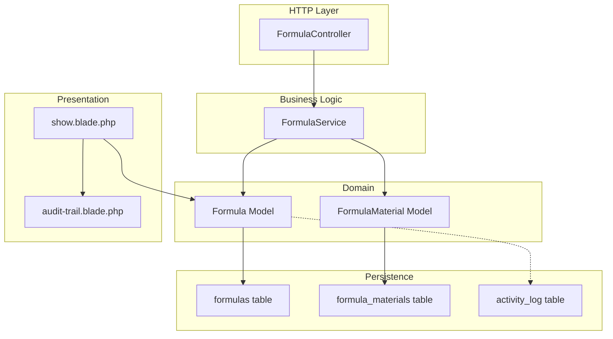
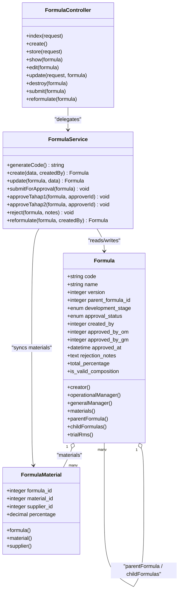
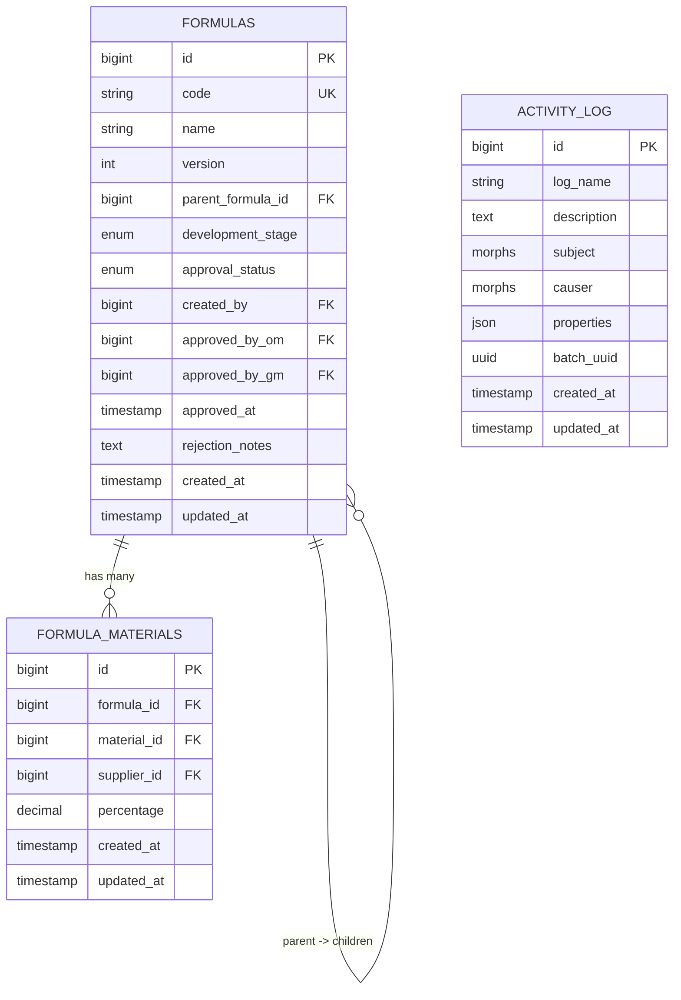
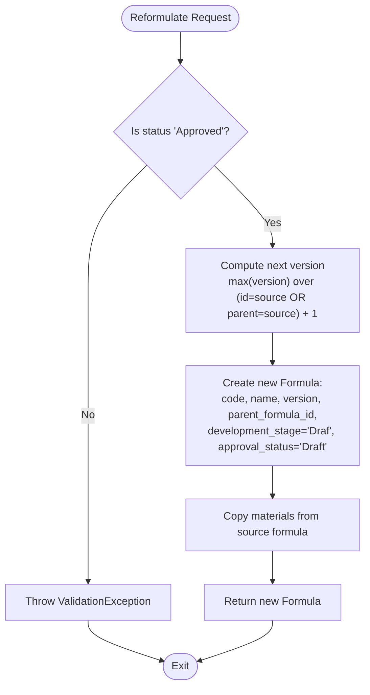
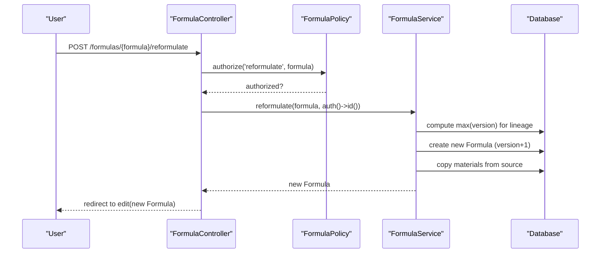
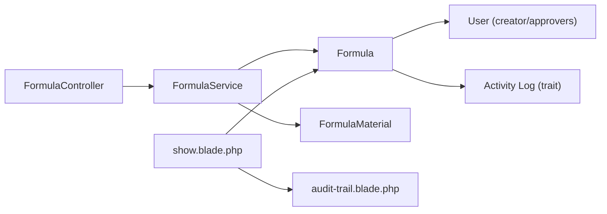

# Formula Versioning System

<cite>
**Referenced Files in This Document**
- [Formula.php](file://app/Models/Formula.php)
- [FormulaMaterial.php](file://app/Models/FormulaMaterial.php)
- [FormulaService.php](file://app/Services/FormulaService.php)
- [FormulaController.php](file://app/Http/Controllers/FormulaController.php)
- [create_formulas_table.php](file://database/migrations/2026_07_01_092832_create_formulas_table.php)
- [create_formula_materials_table.php](file://database/migrations/2026_07_01_092840_create_formula_materials_table.php)
- [show.blade.php](file://resources/views/formulas/show.blade.php)
- [audit-trail.blade.php](file://resources/views/components/audit-trail.blade.php)
- [web.php](file://routes/web.php)
- [activitylog.php](file://config/activitylog.php)
- [create_activity_log_table.php](file://database/migrations/2026_07_01_092416_create_activity_log_table.php)
- [add_batch_uuid_column_to_activity_log_table.php](file://database/migrations/2026_07_01_092418_add_batch_uuid_column_to_activity_log_table.php)
- [FormulaTest.php](file://tests/Feature/FormulasTest.php)
</cite>

## Table of Contents
1. [Introduction](#introduction)
2. [Project Structure](#project-structure)
3. [Core Components](#core-components)
4. [Architecture Overview](#architecture-overview)
5. [Detailed Component Analysis](#detailed-component-analysis)
6. [Dependency Analysis](#dependency-analysis)
7. [Performance Considerations](#performance-considerations)
8. [Troubleshooting Guide](#troubleshooting-guide)
9. [Conclusion](#conclusion)
10. [Appendices](#appendices)

## Introduction
This document explains the formula versioning system that tracks revisions and reformulations of formulas. It covers:
- Parent-child relationships for lineage tracking
- Version number management across reformulations
- Inheritance behavior when creating new versions
- Historical tracking via activity logs
- Database schema relationships and Eloquent model relationships
- Business logic for maintaining formula lineage
- Practical examples for creating reformulations, navigating history, and understanding version hierarchies

## Project Structure
The versioning feature spans models, services, controllers, views, migrations, configuration, and tests. The key files are:
- Models: Formula, FormulaMaterial
- Service: FormulaService (business logic for versioning)
- Controller: FormulaController (HTTP endpoints)
- Views: show.blade.php (UI for lineage and audit trail)
- Migrations: formulas, formula_materials, activity log tables
- Configuration: activitylog.php
- Tests: Feature test demonstrating reformulation behavior

**Diagram sources**
- [Formula.php:1-89](file://app/Models/Formula.php#L1-L89)
- [FormulaMaterial.php:1-36](file://app/Models/FormulaMaterial.php#L1-L36)
- [FormulaService.php:1-228](file://app/Services/FormulaService.php#L1-L228)
- [FormulaController.php:1-201](file://app/Http/Controllers/FormulaController.php#L1-L201)
- [create_formulas_table.php:1-39](file://database/migrations/2026_07_01_092832_create_formulas_table.php#L1-L39)
- [create_formula_materials_table.php:1-32](file://database/migrations/2026_07_01_092840_create_formula_materials_table.php#L1-L32)
- [create_activity_log_table.php:1-27](file://database/migrations/2026_07_01_092416_create_activity_log_table.php#L1-L27)
- [show.blade.php:1-340](file://resources/views/formulas/show.blade.php#L1-L340)
- [audit-trail.blade.php:1-46](file://resources/views/components/audit-trail.blade.php#L1-L46)

**Section sources**
- [Formula.php:1-89](file://app/Models/Formula.php#L1-L89)
- [FormulaMaterial.php:1-36](file://app/Models/FormulaMaterial.php#L1-L36)
- [FormulaService.php:1-228](file://app/Services/FormulaService.php#L1-L228)
- [FormulaController.php:1-201](file://app/Http/Controllers/FormulaController.php#L1-L201)
- [create_formulas_table.php:1-39](file://database/migrations/2026_07_01_092832_create_formulas_table.php#L1-L39)
- [create_formula_materials_table.php:1-32](file://database/migrations/2026_07_01_092840_create_formula_materials_table.php#L1-L32)
- [show.blade.php:1-340](file://resources/views/formulas/show.blade.php#L1-L340)
- [audit-trail.blade.php:1-46](file://resources/views/components/audit-trail.blade.php#L1-L46)
- [activitylog.php:1-52](file://config/activitylog.php#L1-L52)
- [create_activity_log_table.php:1-27](file://database/migrations/2026_07_01_092416_create_activity_log_table.php#L1-L27)
- [add_batch_uuid_column_to_activity_log_table.php:1-22](file://database/migrations/2026_07_01_092418_add_batch_uuid_column_to_activity_log_table.php#L1-L22)

## Core Components
- Formula model defines parent-child relationships and helper attributes for composition validation.
- FormulaService encapsulates business rules for creation, updates, approval workflow, and reformulation with version increment.
- FormulaController exposes HTTP endpoints and delegates to FormulaService.
- Views render lineage (parent link, child list) and audit trail.
- Activity logging records changes to key fields for historical tracking.

Key responsibilities:
- Version numbering and lineage: managed by FormulaService.reformulate
- Composition validation: enforced before submission and during material sync
- Audit trail: Spatie Activity Log configured on Formula model

**Section sources**
- [Formula.php:1-89](file://app/Models/Formula.php#L1-L89)
- [FormulaService.php:1-228](file://app/Services/FormulaService.php#L1-L228)
- [FormulaController.php:1-201](file://app/Http/Controllers/FormulaController.php#L1-L201)
- [show.blade.php:1-340](file://resources/views/formulas/show.blade.php#L1-L340)
- [audit-trail.blade.php:1-46](file://resources/views/components/audit-trail.blade.php#L1-L46)
- [activitylog.php:1-52](file://config/activitylog.php#L1-L52)

## Architecture Overview
The versioning architecture is a self-referential model with a service layer enforcing business rules and an activity log providing immutable history.

**Diagram sources**
- [Formula.php:1-89](file://app/Models/Formula.php#L1-L89)
- [FormulaMaterial.php:1-36](file://app/Models/FormulaMaterial.php#L1-L36)
- [FormulaService.php:1-228](file://app/Services/FormulaService.php#L1-L228)
- [FormulaController.php:1-201](file://app/Http/Controllers/FormulaController.php#L1-L201)

## Detailed Component Analysis

### Database Schema Relationships
- formulas:
  - Self-referencing foreign key parent_formula_id enables parent-child lineage.
  - version integer stores sequential version numbers per lineage branch.
  - approval_status and development_stage drive workflow and UI states.
- formula_materials:
  - Links each formula to its materials and suppliers with percentages.
- activity_log:
  - Records events and property changes for audit trails.

**Diagram sources**
- [create_formulas_table.php:1-39](file://database/migrations/2026_07_01_092832_create_formulas_table.php#L1-L39)
- [create_formula_materials_table.php:1-32](file://database/migrations/2026_07_01_092840_create_formula_materials_table.php#L1-L32)
- [create_activity_log_table.php:1-27](file://database/migrations/2026_07_01_092416_create_activity_log_table.php#L1-L27)
- [add_batch_uuid_column_to_activity_log_table.php:1-22](file://database/migrations/2026_07_01_092418_add_batch_uuid_column_to_activity_log_table.php#L1-L22)

**Section sources**
- [create_formulas_table.php:1-39](file://database/migrations/2026_07_01_092832_create_formulas_table.php#L1-L39)
- [create_formula_materials_table.php:1-32](file://database/migrations/2026_07_01_092840_create_formula_materials_table.php#L1-L32)
- [create_activity_log_table.php:1-27](file://database/migrations/2026_07_01_092416_create_activity_log_table.php#L1-L27)
- [add_batch_uuid_column_to_activity_log_table.php:1-22](file://database/migrations/2026_07_01_092418_add_batch_uuid_column_to_activity_log_table.php#L1-L22)

### Eloquent Model Relationships
- Formula.parentFormula(): belongsTo(self) via parent_formula_id
- Formula.childFormulas(): hasMany(self) via parent_formula_id
- Formula.materials(): hasMany(FormulaMaterial)
- Formula.creator(), operationalManager(), generalManager(): belongsTo(User)
- Formula.total_percentage: computed sum of materials.percentage
- Formula.is_valid_composition: true if total_percentage equals 100

These relationships enable navigation up and down the version tree and presentation of lineage in the UI.

**Section sources**
- [Formula.php:1-89](file://app/Models/Formula.php#L1-L89)

### Business Logic for Versioning and Lineage
- New formula creation:
  - Code generated as FRM-YYYYMM-XXX
  - Initial version set to 1
  - Materials synced after creation
- Update:
  - Only allowed in Draft or Rejected states
  - Validates composition totals
- Submission and approvals:
  - Draft/Rejected → Pending Tahap 1
  - Pending Tahap 1 → Pending Tahap 2 (OM)
  - Pending Tahap 2 → Approved (GM), sets approved_at
- Reformulation:
  - Allowed only from Approved formulas
  - Computes next version by scanning current formula and all descendants for max(version) + 1
  - Sets parent_formula_id to either the original parent or the current formula’s id
  - Copies materials from the source formula as starting point
  - Starts new version in Draft state

**Diagram sources**
- [FormulaService.php:155-190](file://app/Services/FormulaService.php#L155-L190)

**Section sources**
- [FormulaService.php:1-228](file://app/Services/FormulaService.php#L1-L228)

### API and Control Flow
- Routes:
  - Resource routes for CRUD
  - POST /formulas/{formula}/submit
  - POST /formulas/{formula}/reformulate
- Controller actions:
  - submit(): validates policy and calls service.submitForApproval()
  - reformulate(): validates policy and calls service.reformulate()
- Policy constraints:
  - edit/update: creator only, Draft/Rejected
  - submit: creator only, Draft/Rejected
  - reformulate: any user with create permission, only from Approved

**Diagram sources**
- [web.php:33-41](file://routes/web.php#L33-L41)
- [FormulaController.php:186-199](file://app/Http/Controllers/FormulaController.php#L186-L199)
- [FormulaService.php:155-190](file://app/Services/FormulaService.php#L155-L190)

**Section sources**
- [web.php:33-41](file://routes/web.php#L33-L41)
- [FormulaController.php:1-201](file://app/Http/Controllers/FormulaController.php#L1-L201)

### UI Presentation of Versioning and History
- Show page displays:
  - Current version badge
  - Link to parent formula (if exists)
  - List of child formulas (reformulations)
  - Approval timeline
  - Audit trail component showing recent changes
- Audit trail component highlights changes to key fields like approval_status, development_stage, and version.

**Section sources**
- [show.blade.php:1-340](file://resources/views/formulas/show.blade.php#L1-L340)
- [audit-trail.blade.php:1-46](file://resources/views/components/audit-trail.blade.php#L1-L46)

## Dependency Analysis
- Controller depends on Service for business logic and policies for authorization.
- Service depends on Formula and FormulaMaterial models and uses transactions for consistency.
- Formula model depends on User relations and activity logging trait.
- Views depend on loaded relationships (parentFormula, childFormulas, activities).

**Diagram sources**
- [FormulaController.php:1-201](file://app/Http/Controllers/FormulaController.php#L1-L201)
- [FormulaService.php:1-228](file://app/Services/FormulaService.php#L1-L228)
- [Formula.php:1-89](file://app/Models/Formula.php#L1-L89)
- [FormulaMaterial.php:1-36](file://app/Models/FormulaMaterial.php#L1-L36)
- [show.blade.php:1-340](file://resources/views/formulas/show.blade.php#L1-L340)
- [audit-trail.blade.php:1-46](file://resources/views/components/audit-trail.blade.php#L1-L46)

**Section sources**
- [FormulaController.php:1-201](file://app/Http/Controllers/FormulaController.php#L1-L201)
- [FormulaService.php:1-228](file://app/Services/FormulaService.php#L1-L228)
- [Formula.php:1-89](file://app/Models/Formula.php#L1-L89)
- [FormulaMaterial.php:1-36](file://app/Models/FormulaMaterial.php#L1-L36)
- [show.blade.php:1-340](file://resources/views/formulas/show.blade.php#L1-L340)
- [audit-trail.blade.php:1-46](file://resources/views/components/audit-trail.blade.php#L1-L46)

## Performance Considerations
- Version computation scans both the current formula and its descendants; consider indexing parent_formula_id and version for large trees.
- Material sync deletes and recreates rows; batching could improve performance for large compositions.
- Activity log writes occur on key field changes; ensure appropriate retention settings and indexes on frequently queried fields.

[No sources needed since this section provides general guidance]

## Troubleshooting Guide
Common issues and resolutions:
- Cannot submit for approval:
  - Ensure approval_status is Draft or Rejected
  - Validate total composition equals 100%
  - Ensure at least one material exists
- Cannot reformulate:
  - Source formula must be Approved
  - Verify permissions allow create action
- Audit trail not visible:
  - Confirm activity logging is enabled and migrations applied
  - Check that Formula model uses LogsActivity and configures LogOptions

Operational checks:
- Verify database foreign keys: parent_formula_id references formulas.id
- Confirm activity_log table exists and is writable
- Review policy gates for edit/submit/reformulate

**Section sources**
- [FormulaService.php:77-150](file://app/Services/FormulaService.php#L77-L150)
- [FormulaService.php:155-190](file://app/Services/FormulaService.php#L155-L190)
- [activitylog.php:1-52](file://config/activitylog.php#L1-L52)
- [create_activity_log_table.php:1-27](file://database/migrations/2026_07_01_092416_create_activity_log_table.php#L1-L27)

## Conclusion
The formula versioning system implements a robust parent-child lineage model with clear version increments and comprehensive audit trails. Business rules enforce integrity through composition validation and approval workflows. The UI provides intuitive navigation between versions and visibility into change history.

[No sources needed since this section summarizes without analyzing specific files]

## Appendices

### Examples and Usage Scenarios
- Creating a reformulation:
  - From an Approved formula, trigger reformulation to generate a new version (Vn+1)
  - New formula inherits name and materials, starts in Draft, and links to parent
- Navigating formula history:
  - Use parent link to go back to the source version
  - Use child list to explore subsequent reformulations
- Understanding version hierarchies:
  - Each branch maintains its own version sequence based on max(version) within the subtree

Validation reference:
- Feature test demonstrates successful reformulation producing a new version with correct lineage and copied materials.

**Section sources**
- [show.blade.php:141-149](file://resources/views/formulas/show.blade.php#L141-L149)
- [show.blade.php:307-326](file://resources/views/formulas/show.blade.php#L307-L326)
- [FormulaTest.php:167-196](file://tests/Feature/FormulasTest.php#L167-L196)