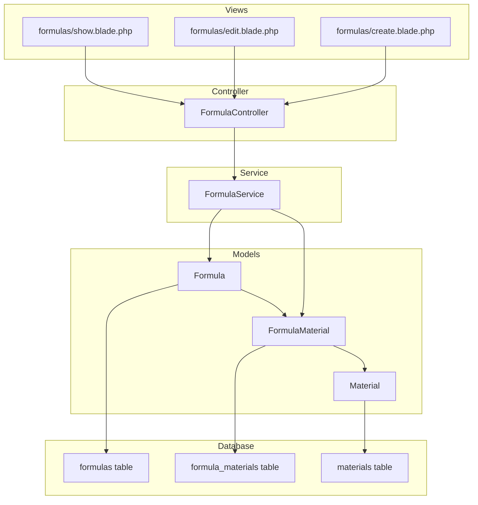
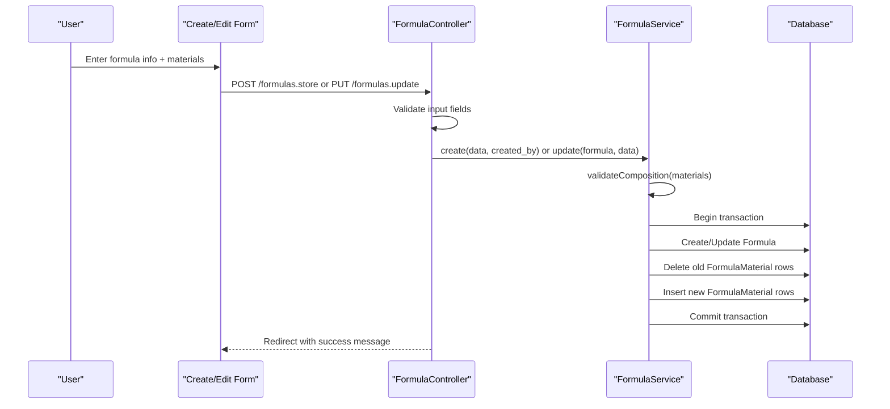
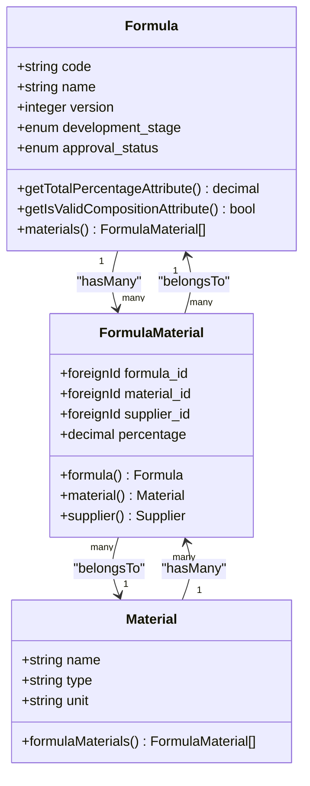
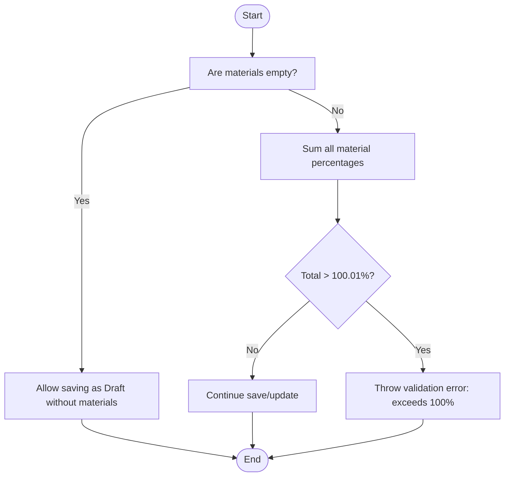
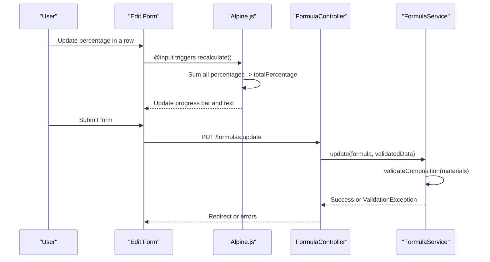
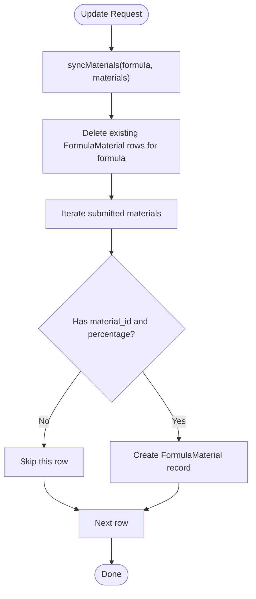
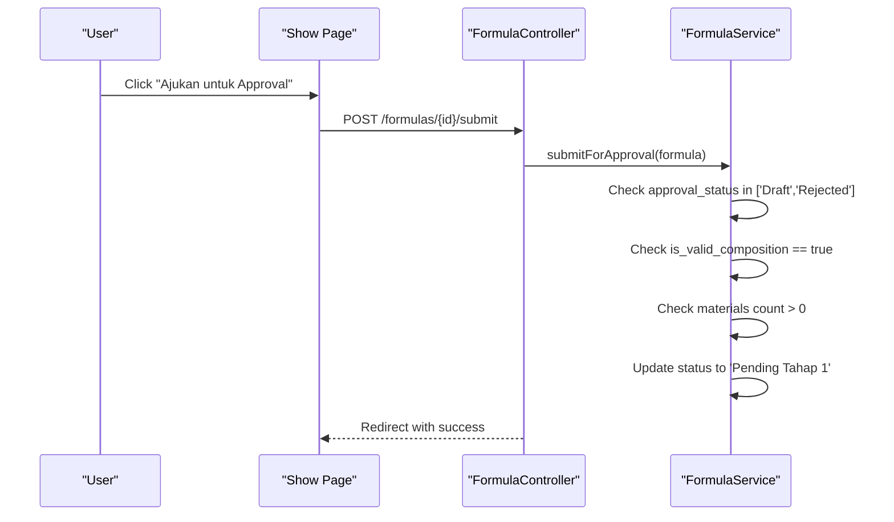
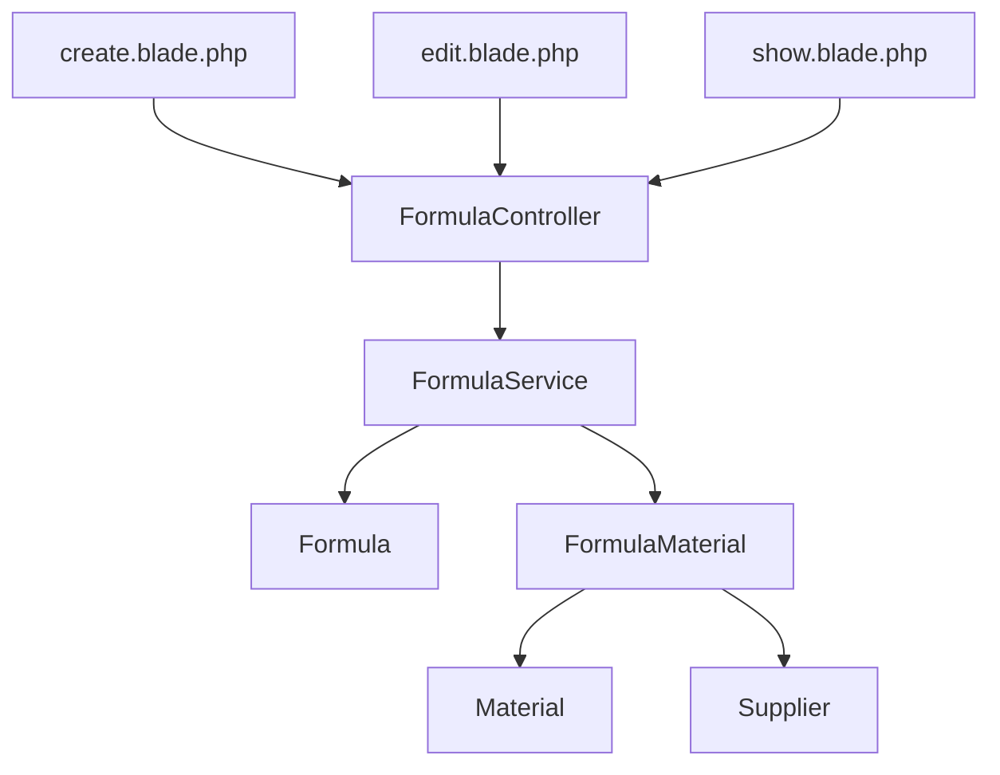

# Material Composition Management

<cite>
**Referenced Files in This Document**
- [Formula.php](file://app/Models/Formula.php)
- [FormulaMaterial.php](file://app/Models/FormulaMaterial.php)
- [Material.php](file://app/Models/Material.php)
- [FormulaService.php](file://app/Services/Formulaservice.php)
- [FormulaController.php](file://app/Http/Controllers/FormulaController.php)
- [create.blade.php](file://resources/views/formulas/create.blade.php)
- [edit.blade.php](file://resources/views/formulas/edit.blade.php)
- [show.blade.php](file://resources/views/formulas/show.blade.php)
- [2026_07_01_092832_create_formulas_table.php](file://database/migrations/2026_07_01_092832_create_formulas_table.php)
- [2026_07_01_092840_create_formula_materials_table.php](file://database/migrations/2026_07_01_092840_create_formula_materials_table.php)
- [2026_07_01_092816_create_materials_table.php](file://database/migrations/2026_07_01_092816_create_materials_table.php)
- [web.php](file://routes/web.php)
</cite>

## Table of Contents
1. [Introduction](#introduction)
2. [Project Structure](#project-structure)
3. [Core Components](#core-components)
4. [Architecture Overview](#architecture-overview)
5. [Detailed Component Analysis](#detailed-component-analysis)
6. [Dependency Analysis](#dependency-analysis)
7. [Performance Considerations](#performance-considerations)
8. [Troubleshooting Guide](#troubleshooting-guide)
9. [Conclusion](#conclusion)

## Introduction
This document explains how materials are managed within formulas, focusing on the FormulaMaterial model that links materials to formulas, percentage calculations, and composition validation. It covers material selection, quantity calculations, and automatic total percentage validation ensuring compositions sum to 100%. Practical examples illustrate adding materials, updating quantities, handling material changes, and validating composition integrity.

## Project Structure
The material composition feature spans models, services, controllers, views, and database migrations:
- Models define relationships and computed attributes for totals and validity.
- Service encapsulates business rules for creating, updating, submitting, and reformulating formulas with composition validation.
- Controller handles HTTP requests, authorization, and delegates to the service.
- Views provide interactive UI for selecting materials, entering percentages, and live feedback on totals.
- Migrations define schema constraints for formula and formula-material records.

**Diagram sources**
- [Formula.php:1-89](file://app/Models/Formula.php#L1-L89)
- [FormulaMaterial.php:1-36](file://app/Models/FormulaMaterial.php#L1-L36)
- [Material.php:1-33](file://app/Models/Material.php#L1-L33)
- [FormulaService.php:1-228](file://app/Services/Formulaservice.php#L1-L228)
- [FormulaController.php:1-201](file://app/Http/Controllers/FormulaController.php#L1-L201)
- [create.blade.php:1-289](file://resources/views/formulas/create.blade.php#L1-L289)
- [edit.blade.php:1-253](file://resources/views/formulas/edit.blade.php#L1-L253)
- [show.blade.php:1-340](file://resources/views/formulas/show.blade.php#L1-L340)
- [2026_07_01_092832_create_formulas_table.php:1-39](file://database/migrations/2026_07_01_092832_create_formulas_table.php#L1-L39)
- [2026_07_01_092840_create_formula_materials_table.php:1-32](file://database/migrations/2026_07_01_092840_create_formula_materials_table.php#L1-L32)
- [2026_07_01_092816_create_materials_table.php:1-32](file://database/migrations/2026_07_01_092816_create_materials_table.php#L1-L32)

**Section sources**
- [Formula.php:1-89](file://app/Models/Formula.php#L1-L89)
- [FormulaMaterial.php:1-36](file://app/Models/FormulaMaterial.php#L1-L36)
- [Material.php:1-33](file://app/Models/Material.php#L1-L33)
- [FormulaService.php:1-228](file://app/Services/Formulaservice.php#L1-L228)
- [FormulaController.php:1-201](file://app/Http/Controllers/FormulaController.php#L1-L201)
- [create.blade.php:1-289](file://resources/views/formulas/create.blade.php#L1-L289)
- [edit.blade.php:1-253](file://resources/views/formulas/edit.blade.php#L1-L253)
- [show.blade.php:1-340](file://resources/views/formulas/show.blade.php#L1-L340)
- [2026_07_01_092832_create_formulas_table.php:1-39](file://database/migrations/2026_07_01_092832_create_formulas_table.php#L1-L39)
- [2026_07_01_092840_create_formula_materials_table.php:1-32](file://database/migrations/2026_07_01_092840_create_formula_materials_table.php#L1-L32)
- [2026_07_01_092816_create_materials_table.php:1-32](file://database/migrations/2026_07_01_092816_create_materials_table.php#L1-L32)

## Core Components
- Formula model defines a hasMany relationship to FormulaMaterial and provides computed attributes for total percentage and validity.
- FormulaMaterial is the pivot linking a Formula to a Material (and optionally a Supplier), storing the percentage contribution.
- Material represents raw materials available for selection in formulas.
- FormulaService enforces composition validation and synchronization of materials during create/update/reformulate operations.
- FormulaController orchestrates request flow, validates inputs, and delegates to FormulaService.
- Views implement dynamic rows for material selection and live percentage calculation, plus submission controls gated by composition validity.

Key responsibilities:
- Linking materials to formulas via FormulaMaterial.
- Calculating total percentage across all materials.
- Validating composition before submission or approval.
- Synchronizing material entries atomically within transactions.

**Section sources**
- [Formula.php:54-87](file://app/Models/Formula.php#L54-L87)
- [FormulaMaterial.php:9-34](file://app/Models/FormulaMaterial.php#L9-L34)
- [Material.php:27-31](file://app/Models/Material.php#L27-L31)
- [FormulaService.php:35-72](file://app/Services/Formulaservice.php#L35-L72)
- [FormulaController.php:72-149](file://app/Http/Controllers/FormulaController.php#L72-L149)

## Architecture Overview
The system follows a layered architecture:
- Controllers handle HTTP requests and authorization.
- Services encapsulate business logic including composition validation and persistence.
- Models manage data relationships and computed attributes.
- Views provide user interaction and real-time feedback.

**Diagram sources**
- [FormulaController.php:72-149](file://app/Http/Controllers/FormulaController.php#L72-L149)
- [FormulaService.php:35-72](file://app/Services/Formulaservice.php#L35-L72)
- [2026_07_01_092832_create_formulas_table.php:14-28](file://database/migrations/2026_07_01_092832_create_formulas_table.php#L14-L28)
- [2026_07_01_092840_create_formula_materials_table.php:14-21](file://database/migrations/2026_07_01_092840_create_formula_materials_table.php#L14-L21)

## Detailed Component Analysis

### Data Model Relationships
- Formula has many FormulaMaterial entries.
- FormulaMaterial belongs to Formula, Material, and optional Supplier.
- Material has many FormulaMaterial entries.

**Diagram sources**
- [Formula.php:54-87](file://app/Models/Formula.php#L54-L87)
- [FormulaMaterial.php:20-34](file://app/Models/FormulaMaterial.php#L20-L34)
- [Material.php:27-31](file://app/Models/Material.php#L27-L31)

**Section sources**
- [Formula.php:54-87](file://app/Models/Formula.php#L54-L87)
- [FormulaMaterial.php:20-34](file://app/Models/FormulaMaterial.php#L20-L34)
- [Material.php:27-31](file://app/Models/Material.php#L27-L31)

### Percentage Calculation and Validation
- Total percentage is computed by summing all FormulaMaterial.percentage values for a given Formula.
- Validity is true when total equals exactly 100.
- During create/update, the service validates that the submitted materials do not exceed 100% (with small floating-point tolerance).
- Submission requires at least one material and a valid composition (total = 100%).

**Diagram sources**
- [FormulaService.php:195-209](file://app/Services/Formulaservice.php#L195-L209)
- [Formula.php:77-87](file://app/Models/Formula.php#L77-L87)

**Section sources**
- [FormulaService.php:195-209](file://app/Services/Formulaservice.php#L195-L209)
- [Formula.php:77-87](file://app/Models/Formula.php#L77-L87)

### Material Selection Process
- The create and edit forms present dropdowns for materials and suppliers, with dynamic rows for multiple entries.
- Each row includes a percentage field; users can add/remove rows.
- Live JavaScript recalculates the total percentage and shows visual feedback (valid if 100%, otherwise indicates remaining needed).

Practical example steps:
- Open the create form.
- Click “Tambah Material” to add a row.
- Select a material from the dropdown.
- Optionally select a supplier.
- Enter a percentage value.
- Repeat for additional materials until the total reaches 100%.
- Save as Draft or submit for approval once valid.

**Section sources**
- [create.blade.php:108-191](file://resources/views/formulas/create.blade.php#L108-L191)
- [edit.blade.php:110-175](file://resources/views/formulas/edit.blade.php#L110-L175)

### Quantity Calculations and Automatic Total Validation
- Frontend calculates total percentage client-side using Alpine.js to sum all row percentages.
- Backend validates composition server-side to prevent exceeding 100% and ensures consistency.
- The show view displays current total and validity status, disabling submission if invalid.

**Diagram sources**
- [edit.blade.php:228-252](file://resources/views/formulas/edit.blade.php#L228-L252)
- [FormulaController.php:127-149](file://app/Http/Controllers/FormulaController.php#L127-L149)
- [FormulaService.php:58-72](file://app/Services/Formulaservice.php#L58-L72)

**Section sources**
- [edit.blade.php:228-252](file://resources/views/formulas/edit.blade.php#L228-L252)
- [FormulaController.php:127-149](file://app/Http/Controllers/FormulaController.php#L127-L149)
- [FormulaService.php:58-72](file://app/Services/Formulaservice.php#L58-L72)

### Handling Material Changes
- When updating a formula, the service deletes existing FormulaMaterial rows and inserts new ones based on the submitted array.
- Rows missing material_id or percentage are skipped.
- Supplier association is optional; null is allowed if not provided.

**Diagram sources**
- [FormulaService.php:211-226](file://app/Services/Formulaservice.php#L211-L226)

**Section sources**
- [FormulaService.php:211-226](file://app/Services/Formulaservice.php#L211-L226)

### Composition Integrity and Submission Rules
- Before submitting for approval, the service checks:
  - Approval status must be Draft or Rejected.
  - Composition must be valid (total = 100%).
  - At least one material must exist.
- If any condition fails, a validation exception is thrown with descriptive messages.

**Diagram sources**
- [FormulaController.php:168-181](file://app/Http/Controllers/FormulaController.php#L168-L181)
- [FormulaService.php:77-98](file://app/Services/Formulaservice.php#L77-L98)
- [show.blade.php:48-68](file://resources/views/formulas/show.blade.php#L48-L68)

**Section sources**
- [FormulaController.php:168-181](file://app/Http/Controllers/FormulaController.php#L168-L181)
- [FormulaService.php:77-98](file://app/Services/Formulaservice.php#L77-L98)
- [show.blade.php:48-68](file://resources/views/formulas/show.blade.php#L48-L68)

### Practical Examples

- Adding materials to a new formula:
  - Navigate to create form.
  - Add rows, select materials, enter percentages.
  - Ensure total reaches 100% before submission.
  - Save as Draft or submit for approval.

- Updating quantities in an existing formula:
  - Edit the formula.
  - Adjust percentages in rows.
  - Recalculate total; ensure it equals 100%.
  - Save changes.

- Handling material changes:
  - Remove rows by clicking delete icon.
  - Add new rows as needed.
  - On save, backend syncs materials atomically.

- Validating composition integrity:
  - Show page displays total and validity badge.
  - Submission button disabled if total != 100%.
  - Server-side validation prevents overages.

**Section sources**
- [create.blade.php:108-191](file://resources/views/formulas/create.blade.php#L108-L191)
- [edit.blade.php:110-175](file://resources/views/formulas/edit.blade.php#L110-L175)
- [show.blade.php:153-219](file://resources/views/formulas/show.blade.php#L153-L219)
- [FormulaService.php:195-209](file://app/Services/Formulaservice.php#L195-L209)

## Dependency Analysis
- FormulaController depends on FormulaService for business logic.
- FormulaService depends on Formula and FormulaMaterial models and uses database transactions.
- FormulaMaterial depends on Formula, Material, and Supplier models.
- Views depend on controller routes and pass material/supplier lists to forms.

**Diagram sources**
- [FormulaController.php:1-201](file://app/Http/Controllers/FormulaController.php#L1-L201)
- [FormulaService.php:1-228](file://app/Services/Formulaservice.php#L1-L228)
- [Formula.php:1-89](file://app/Models/Formula.php#L1-L89)
- [FormulaMaterial.php:1-36](file://app/Models/FormulaMaterial.php#L1-L36)
- [Material.php:1-33](file://app/Models/Material.php#L1-L33)
- [create.blade.php:1-289](file://resources/views/formulas/create.blade.php#L1-L289)
- [edit.blade.php:1-253](file://resources/views/formulas/edit.blade.php#L1-L253)
- [show.blade.php:1-340](file://resources/views/formulas/show.blade.php#L1-L340)

**Section sources**
- [web.php:34-40](file://routes/web.php#L34-L40)
- [FormulaController.php:1-201](file://app/Http/Controllers/FormulaController.php#L1-L201)
- [FormulaService.php:1-228](file://app/Services/Formulaservice.php#L1-L228)

## Performance Considerations
- Use eager loading for related data in show actions to reduce N+1 queries.
- Keep material synchronization within a single transaction to avoid partial writes.
- Avoid excessive client-side recalculations by debouncing input events if the number of rows grows large.
- Database-level decimal precision for percentage ensures accurate storage and summation.

[No sources needed since this section provides general guidance]

## Troubleshooting Guide
Common issues and resolutions:
- Total exceeds 100%:
  - Client-side indicator turns red; adjust percentages to reach exactly 100%.
  - Server-side validation throws an error if total > 100.01%.
- Submission disabled:
  - Show page disables the submit button if composition is invalid; fix percentages first.
- Missing materials:
  - Submission requires at least one material; add a material row.
- Floating-point rounding:
  - Small tolerances allow up to 100.01%; aim for exact 100% to avoid edge cases.

**Section sources**
- [FormulaService.php:77-98](file://app/Services/Formulaservice.php#L77-L98)
- [FormulaService.php:195-209](file://app/Services/Formulaservice.php#L195-L209)
- [show.blade.php:48-68](file://resources/views/formulas/show.blade.php#L48-L68)

## Conclusion
Material composition management in formulas relies on clear model relationships, robust service-layer validation, and intuitive UI feedback. The FormulaMaterial model links materials to formulas with percentage contributions, while the Formula model computes totals and validity. The service enforces composition rules and synchronizes materials atomically. Together, these components ensure accurate, consistent, and user-friendly composition management.