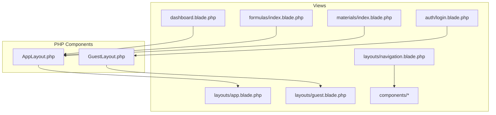
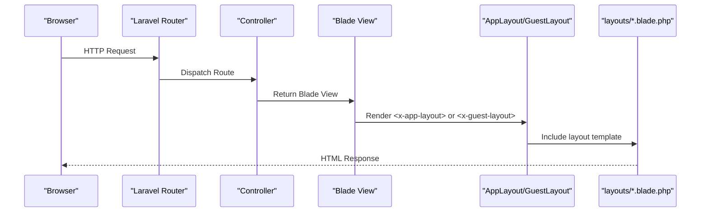
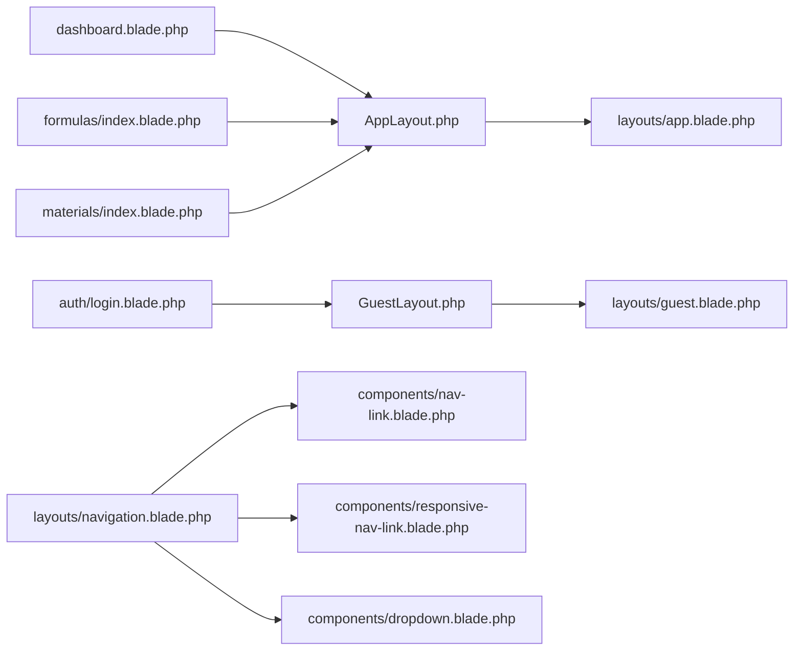

# Blade Templates & Layouts

<cite>
**Referenced Files in This Document**
- [app.blade.php](file://resources/views/layouts/app.blade.php)
- [guest.blade.php](file://resources/views/layouts/guest.blade.php)
- [navigation.blade.php](file://resources/views/layouts/navigation.blade.php)
- [AppLayout.php](file://app/View/Components/AppLayout.php)
- [GuestLayout.php](file://app/View/Components/GuestLayout.php)
- [dashboard.blade.php](file://resources/views/dashboard.blade.php)
- [login.blade.php](file://resources/views/auth/login.blade.php)
- [formulas/index.blade.php](file://resources/views/formulas/index.blade.php)
- [materials/index.blade.php](file://resources/views/materials/index.blade.php)
- [nav-link.blade.php](file://resources/views/components/nav-link.blade.php)
- [responsive-nav-link.blade.php](file://resources/views/components/responsive-nav-link.blade.php)
- [dropdown.blade.php](file://resources/views/components/dropdown.blade.php)
- [status-badge.blade.php](file://resources/views/components/status-badge.blade.php)
</cite>

## Table of Contents
1. Introduction
2. Project Structure
3. Core Components
4. Architecture Overview
5. Detailed Component Analysis
6. Dependency Analysis
7. Performance Considerations
8. Troubleshooting Guide
9. Conclusion

## Introduction
This document explains the Blade templating system and layout architecture used across the application. It focuses on:
- The main application layout with sidebar navigation, header components, and responsive design patterns
- Template composition using Blade View Components for layouts
- The guest layout for authentication pages
- Navigation component implementation
- Practical examples for creating new layouts, extending templates, and implementing dynamic content sections
- Blade syntax conventions including conditional rendering and loops
- Integration with Laravel’s routing system via route helpers

The project uses modern Blade View Components to encapsulate layout behavior and reusable UI elements, combined with Tailwind CSS and Alpine.js for interactivity and responsiveness.

## Project Structure
Blade templates are organized under resources/views. Layouts live in resources/views/layouts, while feature-specific views are grouped by domain (auth, formulas, materials, etc.). Reusable UI pieces are implemented as Blade View Components under resources/views/components.



**Diagram sources**
- [app.blade.php](file://resources/views/layouts/app.blade.php)
- [guest.blade.php](file://resources/views/layouts/guest.blade.php)
- [navigation.blade.php](file://resources/views/layouts/navigation.blade.php)
- [AppLayout.php](file://app/View/Components/AppLayout.php)
- [GuestLayout.php](file://app/View/Components/GuestLayout.php)
- [dashboard.blade.php](file://resources/views/dashboard.blade.php)
- [login.blade.php](file://resources/views/auth/login.blade.php)
- [formulas/index.blade.php](file://resources/views/formulas/index.blade.php)
- [materials/index.blade.php](file://resources/views/materials/index.blade.php)

**Section sources**
- [app.blade.php](file://resources/views/layouts/app.blade.php)
- [guest.blade.php](file://resources/views/layouts/guest.blade.php)
- [navigation.blade.php](file://resources/views/layouts/navigation.blade.php)
- [AppLayout.php](file://app/View/Components/AppLayout.php)
- [GuestLayout.php](file://app/View/Components/GuestLayout.php)
- [dashboard.blade.php](file://resources/views/dashboard.blade.php)
- [login.blade.php](file://resources/views/auth/login.blade.php)
- [formulas/index.blade.php](file://resources/views/formulas/index.blade.php)
- [materials/index.blade.php](file://resources/views/materials/index.blade.php)

## Core Components
- AppLayout component renders the authenticated shell (sidebar, top bar, flash messages, and page content).
- GuestLayout component renders a split-screen layout for unauthenticated pages such as login.
- Navigation component provides both desktop and mobile navigation with role-based visibility.
- Supporting UI components include nav-link, responsive-nav-link, dropdown, and status-badge.

Key responsibilities:
- AppLayout: global chrome, responsive sidebar, notification badge, user menu, flash/error display, and slot injection for page content.
- GuestLayout: branding panel and form container for auth flows.
- Navigation: consistent top-level links with active states and responsive toggling.
- UI components: small, composable building blocks for buttons, badges, and menus.

**Section sources**
- [AppLayout.php](file://app/View/Components/AppLayout.php)
- [GuestLayout.php](file://app/View/Components/GuestLayout.php)
- [app.blade.php](file://resources/views/layouts/app.blade.php)
- [guest.blade.php](file://resources/views/layouts/guest.blade.php)
- [navigation.blade.php](file://resources/views/layouts/navigation.blade.php)
- [nav-link.blade.php](file://resources/views/components/nav-link.blade.php)
- [responsive-nav-link.blade.php](file://resources/views/components/responsive-nav-link.blade.php)
- [dropdown.blade.php](file://resources/views/components/dropdown.blade.php)
- [status-badge.blade.php](file://resources/views/components/status-badge.blade.php)

## Architecture Overview
The application uses Blade View Components to compose layouts and pages. Pages wrap their content inside <x-app-layout> or <x-guest-layout>. The layout components render shared chrome and inject page content into a default slot.



**Diagram sources**
- [AppLayout.php](file://app/View/Components/AppLayout.php)
- [GuestLayout.php](file://app/View/Components/GuestLayout.php)
- [app.blade.php](file://resources/views/layouts/app.blade.php)
- [guest.blade.php](file://resources/views/layouts/guest.blade.php)

## Detailed Component Analysis

### Main Application Layout (app.blade.php)
Responsibilities:
- Provides a full-page shell with a fixed sidebar and sticky header
- Implements responsive behavior using Alpine.js state for sidebar toggle
- Displays dynamic title and favicon based on settings
- Loads assets via Vite
- Renders flash success/error messages and validation errors
- Injects page content via $slot and optional $header slot

Sidebar:
- Logo area with configurable logo and company name
- Navigation links with role-based visibility using @can/@role/@hasanyrole
- Active link detection via request()->routeIs()
- User info section with dropdown for profile and logout

Header:
- Mobile hamburger button to open sidebar
- Optional breadcrumb/title area from $header slot
- Notification bell with badge when applicable
- Compact user avatar and role label

Responsive design patterns:
- Sidebar is fixed off-canvas on mobile and static on desktop
- Overlay appears behind sidebar on mobile
- Header is sticky and collapses gracefully

Flash messages and errors:
- Auto-dismissing success and error alerts with Alpine.js transitions
- Validation errors rendered as a list

Integration points:
- Uses route() helper for all links
- Uses Auth facade for current user data
- Uses setting() helper for app-wide configuration

Practical usage example:
- Wrap any page view with <x-app-layout> and provide a header slot if needed. See dashboard and formulas index.

**Section sources**
- [app.blade.php](file://resources/views/layouts/app.blade.php)
- [dashboard.blade.php](file://resources/views/dashboard.blade.php)
- [formulas/index.blade.php](file://resources/views/formulas/index.blade.php)

### Guest Layout (guest.blade.php)
Responsibilities:
- Full-screen split layout for unauthenticated routes
- Left decorative panel with branding and feature highlights
- Right card container that renders the page content via $slot
- Mobile-friendly with hidden decorative panel on small screens

Usage example:
- Wrap auth forms with <x-guest-layout>. See login view.

**Section sources**
- [guest.blade.php](file://resources/views/layouts/guest.blade.php)
- [login.blade.php](file://resources/views/auth/login.blade.php)

### Navigation Component (navigation.blade.php)
Responsibilities:
- Top navigation bar with logo and primary links
- Role-based visibility for modules and admin features
- Responsive menu with Alpine.js toggle
- User dropdown with profile and logout actions
- Notification indicator placeholder

Active states:
- Uses request()->routeIs() to highlight current section

Role checks:
- Uses @can, @role, and @hasanyrole to control visibility

**Section sources**
- [navigation.blade.php](file://resources/views/layouts/navigation.blade.php)
- [nav-link.blade.php](file://resources/views/components/nav-link.blade.php)
- [responsive-nav-link.blade.php](file://resources/views/components/responsive-nav-link.blade.php)
- [dropdown.blade.php](file://resources/views/components/dropdown.blade.php)

### Blade View Components for Layouts
- AppLayout component maps to layouts/app.blade.php
- GuestLayout component maps to layouts/guest.blade.php

These classes centralize layout selection and can be extended to pass additional data or middleware logic if needed.

```mermaid
classDiagram
class AppLayout {
+render() View
}
class GuestLayout {
+render() View
}
AppLayout --> "renders" : "layouts/app.blade.php"
GuestLayout --> "renders" : "layouts/guest.blade.php"
```

**Diagram sources**
- [AppLayout.php](file://app/View/Components/AppLayout.php)
- [GuestLayout.php](file://app/View/Components/GuestLayout.php)
- [app.blade.php](file://resources/views/layouts/app.blade.php)
- [guest.blade.php](file://resources/views/layouts/guest.blade.php)

**Section sources**
- [AppLayout.php](file://app/View/Components/AppLayout.php)
- [GuestLayout.php](file://app/View/Components/GuestLayout.php)

### Page Composition Examples
- Dashboard page demonstrates providing a header slot and rich content within <x-app-layout>.
- Formulas index shows breadcrumbs, filters, tables, pagination, and empty states.
- Materials index illustrates tabs, CRUD actions, and flash messages.

These examples illustrate how to:
- Provide a header via <x-slot name="header">
- Use route() helpers consistently
- Apply role-based controls around actions
- Render lists and paginated results

**Section sources**
- [dashboard.blade.php](file://resources/views/dashboard.blade.php)
- [formulas/index.blade.php](file://resources/views/formulas/index.blade.php)
- [materials/index.blade.php](file://resources/views/materials/index.blade.php)

### UI Components
- nav-link and responsive-nav-link: styled anchor links with active state handling
- dropdown: reusable dropdown wrapper with trigger and content slots
- status-badge: displays contextual labels and colors for workflow statuses

These components promote consistency and reduce duplication across views.

**Section sources**
- [nav-link.blade.php](file://resources/views/components/nav-link.blade.php)
- [responsive-nav-link.blade.php](file://resources/views/components/responsive-nav-link.blade.php)
- [dropdown.blade.php](file://resources/views/components/dropdown.blade.php)
- [status-badge.blade.php](file://resources/views/components/status-badge.blade.php)

## Dependency Analysis
High-level relationships between layout components and views:



**Diagram sources**
- [AppLayout.php](file://app/View/Components/AppLayout.php)
- [GuestLayout.php](file://app/View/Components/GuestLayout.php)
- [app.blade.php](file://resources/views/layouts/app.blade.php)
- [guest.blade.php](file://resources/views/layouts/guest.blade.php)
- [dashboard.blade.php](file://resources/views/dashboard.blade.php)
- [formulas/index.blade.php](file://resources/views/formulas/index.blade.php)
- [materials/index.blade.php](file://resources/views/materials/index.blade.php)
- [login.blade.php](file://resources/views/auth/login.blade.php)
- [navigation.blade.php](file://resources/views/layouts/navigation.blade.php)
- [nav-link.blade.php](file://resources/views/components/nav-link.blade.php)
- [responsive-nav-link.blade.php](file://resources/views/components/responsive-nav-link.blade.php)
- [dropdown.blade.php](file://resources/views/components/dropdown.blade.php)

**Section sources**
- [AppLayout.php](file://app/View/Components/AppLayout.php)
- [GuestLayout.php](file://app/View/Components/GuestLayout.php)
- [app.blade.php](file://resources/views/layouts/app.blade.php)
- [guest.blade.php](file://resources/views/layouts/guest.blade.php)
- [dashboard.blade.php](file://resources/views/dashboard.blade.php)
- [formulas/index.blade.php](file://resources/views/formulas/index.blade.php)
- [materials/index.blade.php](file://resources/views/materials/index.blade.php)
- [login.blade.php](file://resources/views/auth/login.blade.php)
- [navigation.blade.php](file://resources/views/layouts/navigation.blade.php)
- [nav-link.blade.php](file://resources/views/components/nav-link.blade.php)
- [responsive-nav-link.blade.php](file://resources/views/components/responsive-nav-link.blade.php)
- [dropdown.blade.php](file://resources/views/components/dropdown.blade.php)

## Performance Considerations
- Prefer View Components for layout boundaries to keep templates modular and cacheable.
- Minimize heavy DOM operations; leverage Alpine.js sparingly for simple interactions like toggles and overlays.
- Keep sidebar navigation concise and avoid excessive nested conditionals; consider extracting complex logic into helper functions or services.
- Use route() helpers consistently to avoid hard-coded URLs and enable centralized URL generation.
- Ensure images and favicons are optimized and served via asset() to benefit from caching.

[No sources needed since this section provides general guidance]

## Troubleshooting Guide
Common issues and resolutions:
- Sidebar not opening/closing on mobile: verify Alpine.js x-data and event bindings exist in the layout and that no JavaScript errors block execution.
- Links not highlighting as active: ensure route names match those defined in routes and use request()->routeIs() with correct patterns.
- Missing permissions in navigation: confirm policies and roles are correctly assigned and that @can/@role directives reference the right abilities.
- Flash messages not appearing: check controller redirects set session('success') or session('error') and ensure the layout renders them.
- Errors not displayed: validate that $errors is available and the layout includes an error list block.

**Section sources**
- [app.blade.php](file://resources/views/layouts/app.blade.php)
- [navigation.blade.php](file://resources/views/layouts/navigation.blade.php)

## Conclusion
The application’s Blade architecture centers on two layout components—AppLayout and GuestLayout—that provide consistent chrome and responsive behavior. Views compose these layouts and reuse small UI components for consistency. Role-based visibility, route helpers, and Alpine.js-driven interactions create a cohesive and maintainable user interface. Following the patterns outlined here will help you extend layouts, add new pages, and implement dynamic content efficiently.