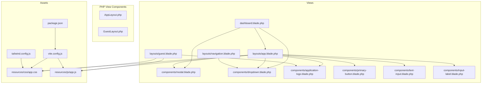
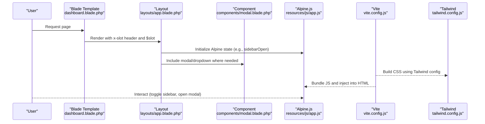
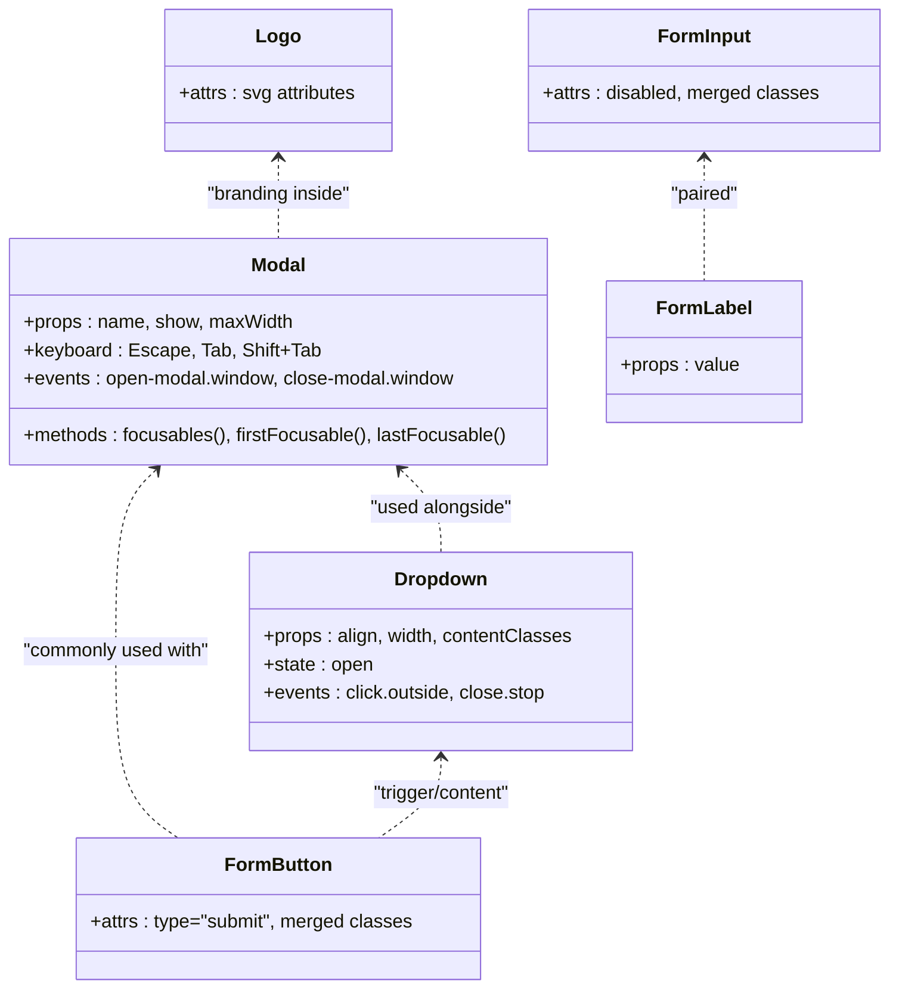
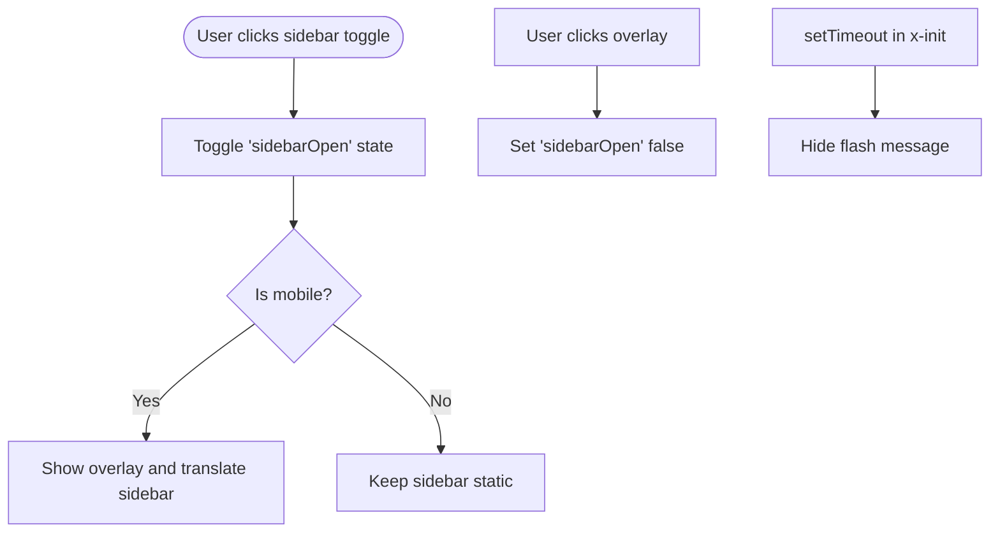
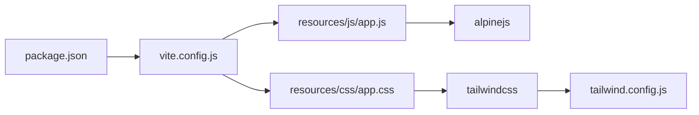

# Frontend Architecture

<cite>
**Referenced Files in This Document**
- [app.blade.php](file://resources/views/layouts/app.blade.php)
- [guest.blade.php](file://resources/views/layouts/guest.blade.php)
- [navigation.blade.php](file://resources/views/layouts/navigation.blade.php)
- [dashboard.blade.php](file://resources/views/dashboard.blade.php)
- [modal.blade.php](file://resources/views/components/modal.blade.php)
- [dropdown.blade.php](file://resources/views/components/dropdown.blade.php)
- [application-logo.blade.php](file://resources/views/components/application-logo.blade.php)
- [primary-button.blade.php](file://resources/views/components/primary-button.blade.php)
- [text-input.blade.php](file://resources/views/components/text-input.blade.php)
- [input-label.blade.php](file://resources/views/components/input-label.blade.php)
- [AppLayout.php](file://app/View/Components/AppLayout.php)
- [GuestLayout.php](file://app/View/Components/GuestLayout.php)
- [app.css](file://resources/css/app.css)
- [app.js](file://resources/js/app.js)
- [vite.config.js](file://vite.config.js)
- [tailwind.config.js](file://tailwind.config.js)
- [package.json](file://package.json)
</cite>

## Table of Contents
1. [Introduction](#introduction)
2. [Project Structure](#project-structure)
3. [Core Components](#core-components)
4. [Architecture Overview](#architecture-overview)
5. [Detailed Component Analysis](#detailed-component-analysis)
6. [Dependency Analysis](#dependency-analysis)
7. [Performance Considerations](#performance-considerations)
8. [Troubleshooting Guide](#troubleshooting-guide)
9. [Conclusion](#conclusion)
10. [Appendices](#appendices)

## Introduction
This document explains the frontend architecture and UI components for the application. It covers Blade templating structure, layout inheritance, reusable component development, styling with Tailwind CSS, interactivity via Alpine.js, asset compilation with Vite, responsive design patterns, accessibility considerations, naming conventions, styling guidelines, and performance optimization techniques. Practical examples are provided to guide creating custom components, extending layouts, and implementing interactive features.

## Project Structure
The frontend is organized around:
- Blade views under resources/views with a clear separation between layouts, shared components, and feature pages.
- PHP View Components under app/View/Components for server-side component classes that render Blade templates.
- Assets (CSS/JS) compiled by Vite and styled with Tailwind CSS.

**Diagram sources**
- [app.blade.php:1-362](file://resources/views/layouts/app.blade.php#L1-L362)
- [guest.blade.php:1-88](file://resources/views/layouts/guest.blade.php#L1-L88)
- [navigation.blade.php:1-202](file://resources/views/layouts/navigation.blade.php#L1-L202)
- [dashboard.blade.php:1-374](file://resources/views/dashboard.blade.php#L1-L374)
- [modal.blade.php:1-79](file://resources/views/components/modal.blade.php#L1-L79)
- [dropdown.blade.php:1-36](file://resources/views/components/dropdown.blade.php#L1-L36)
- [application-logo.blade.php:1-4](file://resources/views/components/application-logo.blade.php#L1-L4)
- [primary-button.blade.php:1-4](file://resources/views/components/primary-button.blade.php#L1-L4)
- [text-input.blade.php:1-4](file://resources/views/components/text-input.blade.php#L1-L4)
- [input-label.blade.php:1-6](file://resources/views/components/input-label.blade.php#L1-L6)
- [app.css:1-319](file://resources/css/app.css#L1-L319)
- [app.js:1-8](file://resources/js/app.js#L1-L8)
- [vite.config.js:1-12](file://vite.config.js#L1-L12)
- [tailwind.config.js:1-65](file://tailwind.config.js#L1-L65)
- [package.json:1-24](file://package.json#L1-L24)

**Section sources**
- [app.blade.php:1-362](file://resources/views/layouts/app.blade.php#L1-L362)
- [guest.blade.php:1-88](file://resources/views/layouts/guest.blade.php#L1-L88)
- [navigation.blade.php:1-202](file://resources/views/layouts/navigation.blade.php#L1-L202)
- [dashboard.blade.php:1-374](file://resources/views/dashboard.blade.php#L1-L374)
- [app.css:1-319](file://resources/css/app.css#L1-L319)
- [app.js:1-8](file://resources/js/app.js#L1-L8)
- [vite.config.js:1-12](file://vite.config.js#L1-L12)
- [tailwind.config.js:1-65](file://tailwind.config.js#L1-L65)
- [package.json:1-24](file://package.json#L1-L24)

## Core Components
- Layouts:
  - App layout provides authenticated shell with sidebar, top bar, flash messages, and main content slot.
  - Guest layout provides a split-screen login-style page without navigation chrome.
- Shared UI components:
  - Modal with focus management and keyboard accessibility.
  - Dropdown with click-outside handling and transitions.
  - Form primitives (button, input, label).
  - Application logo SVG component.
- Interactivity:
  - Alpine.js initialized globally and used throughout layouts and components for stateful UI (sidebar toggle, dropdowns, modals, flash auto-dismiss).

Key responsibilities:
- Layouts encapsulate global structure and common interactions.
- Components encapsulate reusable UI behavior and markup.
- CSS layering uses Tailwind base/components/utilities plus custom @layer definitions.
- JS entry initializes Alpine and exposes it on window.

**Section sources**
- [app.blade.php:24-362](file://resources/views/layouts/app.blade.php#L24-L362)
- [guest.blade.php:14-88](file://resources/views/layouts/guest.blade.php#L14-L88)
- [modal.blade.php:1-79](file://resources/views/components/modal.blade.php#L1-L79)
- [dropdown.blade.php:1-36](file://resources/views/components/dropdown.blade.php#L1-L36)
- [application-logo.blade.php:1-4](file://resources/views/components/application-logo.blade.php#L1-L4)
- [primary-button.blade.php:1-4](file://resources/views/components/primary-button.blade.php#L1-L4)
- [text-input.blade.php:1-4](file://resources/views/components/text-input.blade.php#L1-L4)
- [input-label.blade.php:1-6](file://resources/views/components/input-label.blade.php#L1-L6)
- [app.js:1-8](file://resources/js/app.js#L1-L8)

## Architecture Overview
The frontend follows a layered approach:
- Blade templates compose layouts and components.
- Tailwind CSS provides utility-first styling with custom theme tokens and component classes.
- Alpine.js adds lightweight reactivity for UI behaviors.
- Vite compiles assets and integrates with Laravel for hot refresh.

**Diagram sources**
- [dashboard.blade.php:1-374](file://resources/views/dashboard.blade.php#L1-L374)
- [app.blade.php:1-362](file://resources/views/layouts/app.blade.php#L1-L362)
- [modal.blade.php:1-79](file://resources/views/components/modal.blade.php#L1-L79)
- [app.js:1-8](file://resources/js/app.js#L1-L8)
- [vite.config.js:1-12](file://vite.config.js#L1-L12)
- [tailwind.config.js:1-65](file://tailwind.config.js#L1-L65)

## Detailed Component Analysis

### Layout System and Inheritance
- App layout:
  - Provides global meta tags, favicon, and asset injection via Vite.
  - Implements an Alpine-controlled sidebar overlay and slide-in/out transitions.
  - Renders a sticky top bar with breadcrumb/header slot and notification/user controls.
  - Displays flash success/error messages with auto-dismiss timers.
  - Wraps page content in a scrollable main area.
- Guest layout:
  - Full-screen split layout with decorative left panel and centered form card.
  - Uses Vite for assets and includes a simple footer.

Practical example: Extending the app layout
- Use the layout tag in a view and provide a header slot; place page content in the default slot.

**Section sources**
- [app.blade.php:1-362](file://resources/views/layouts/app.blade.php#L1-L362)
- [guest.blade.php:1-88](file://resources/views/layouts/guest.blade.php#L1-L88)
- [dashboard.blade.php:1-374](file://resources/views/dashboard.blade.php#L1-L374)

### Reusable UI Components
- Modal:
  - Accepts props for name, show state, and maxWidth.
  - Manages focus trapping, Escape key, and click-outside to close.
  - Animates entrance/exit and prevents body scrolling when open.
- Dropdown:
  - Configurable alignment and width.
  - Click-outside closes the menu; supports transition animations.
- Form primitives:
  - Button, input, and label components accept attributes and merge default classes.
- Logo:
  - SVG component that accepts arbitrary attributes for sizing and styling.

**Diagram sources**
- [modal.blade.php:1-79](file://resources/views/components/modal.blade.php#L1-L79)
- [dropdown.blade.php:1-36](file://resources/views/components/dropdown.blade.php#L1-L36)
- [primary-button.blade.php:1-4](file://resources/views/components/primary-button.blade.php#L1-L4)
- [text-input.blade.php:1-4](file://resources/views/components/text-input.blade.php#L1-L4)
- [input-label.blade.php:1-6](file://resources/views/components/input-label.blade.php#L1-L6)
- [application-logo.blade.php:1-4](file://resources/views/components/application-logo.blade.php#L1-L4)

**Section sources**
- [modal.blade.php:1-79](file://resources/views/components/modal.blade.php#L1-L79)
- [dropdown.blade.php:1-36](file://resources/views/components/dropdown.blade.php#L1-L36)
- [primary-button.blade.php:1-4](file://resources/views/components/primary-button.blade.php#L1-L4)
- [text-input.blade.php:1-4](file://resources/views/components/text-input.blade.php#L1-L4)
- [input-label.blade.php:1-6](file://resources/views/components/input-label.blade.php#L1-L6)
- [application-logo.blade.php:1-4](file://resources/views/components/application-logo.blade.php#L1-L4)

### Interactive Elements with Alpine.js
- Sidebar toggle:
  - State variable controls visibility and transforms; overlay dismisses on click.
- Flash messages:
  - Auto-dismiss after a timeout with fade-out transitions.
- User dropdown:
  - Local state toggles open/close; click-away handler ensures closure.
- Navigation:
  - Mobile menu toggled via Alpine state.

**Diagram sources**
- [app.blade.php:24-362](file://resources/views/layouts/app.blade.php#L24-L362)
- [navigation.blade.php:1-202](file://resources/views/layouts/navigation.blade.php#L1-L202)
- [app.js:1-8](file://resources/js/app.js#L1-L8)

**Section sources**
- [app.blade.php:24-362](file://resources/views/layouts/app.blade.php#L24-L362)
- [navigation.blade.php:1-202](file://resources/views/layouts/navigation.blade.php#L1-L202)
- [app.js:1-8](file://resources/js/app.js#L1-L8)

### Styling Approach with Tailwind CSS
- Theme customization:
  - Custom fonts (sans and heading), color palette (primary, secondary, accent, surface, ink), shadows, gradients, and animations.
- Layered CSS:
  - Base layer sets global defaults and scrollbar styles.
  - Components layer defines reusable classes for cards, buttons, forms, tables, badges, alerts, stepper, tabs, avatars, and more.
  - Utilities layer adds small helpers like glass effect and pattern backgrounds.
- Integration:
  - Tailwind directives imported in the main CSS file.
  - Content paths configured to scan Blade views.

Practical example: Creating a new component style
- Add a new class under @layer components in the CSS file and use it across Blade templates.

**Section sources**
- [app.css:1-319](file://resources/css/app.css#L1-L319)
- [tailwind.config.js:1-65](file://tailwind.config.js#L1-L65)

### Asset Compilation Pipeline with Vite
- Entry points:
  - CSS and JS entries defined in Vite configuration.
- Development:
  - Hot module replacement enabled for fast feedback.
- Production:
  - Build script compiles and optimizes assets.

Practical example: Adding a new asset
- Register a new entry in Vite config and include it in Blade via the asset helper.

**Section sources**
- [vite.config.js:1-12](file://vite.config.js#L1-L12)
- [package.json:1-24](file://package.json#L1-L24)

### Responsive Design Patterns
- Breakpoints:
  - Mobile-first utilities control visibility and layout shifts (hidden/sm:flex, lg:static, etc.).
- Navigation:
  - Desktop horizontal nav collapses to a hamburger menu on small screens.
- Sidebar:
  - Fixed off-canvas on mobile; static on larger screens.
- Cards and grids:
  - Grid columns adapt from 2 to 4 based on viewport size.

**Section sources**
- [app.blade.php:40-362](file://resources/views/layouts/app.blade.php#L40-L362)
- [navigation.blade.php:1-202](file://resources/views/layouts/navigation.blade.php#L1-L202)
- [dashboard.blade.php:60-172](file://resources/views/dashboard.blade.php#L60-L172)

### Accessibility Considerations
- Keyboard navigation:
  - Modal traps focus and handles Escape to close.
  - Tab order within modal is managed.
- ARIA labels:
  - Buttons have descriptive aria-labels for screen readers.
- Color contrast and focus states:
  - Focus rings applied via Tailwind utilities.
- Semantic structure:
  - Proper use of header, main, aside, nav, and button elements.

**Section sources**
- [modal.blade.php:1-79](file://resources/views/components/modal.blade.php#L1-L79)
- [app.blade.php:240-294](file://resources/views/layouts/app.blade.php#L240-L294)

### Practical Examples

#### Create a Custom Component
Steps:
- Create a Blade file under resources/views/components/<name>.blade.php.
- Use @props to define parameters and $slot for content.
- Apply Tailwind classes and optional Alpine directives for interactivity.
- Reference the component in views using the kebab-case tag.

Example references:
- See modal and dropdown implementations for props, slots, and event handling.

**Section sources**
- [modal.blade.php:1-79](file://resources/views/components/modal.blade.php#L1-L79)
- [dropdown.blade.php:1-36](file://resources/views/components/dropdown.blade.php#L1-L36)

#### Extend a Layout
Steps:
- Wrap your page with the appropriate layout tag.
- Provide named slots (e.g., header) and place page content in the default slot.

Example reference:
- Dashboard extends the app layout and supplies a header slot.

**Section sources**
- [dashboard.blade.php:1-374](file://resources/views/dashboard.blade.php#L1-L374)
- [app.blade.php:257-260](file://resources/views/layouts/app.blade.php#L257-L260)

#### Implement an Interactive Feature
Steps:
- Initialize Alpine state at the root of the component or layout.
- Bind visibility and transitions with x-show and x-transition.
- Handle events like click, keydown, and click-outside.

Example references:
- Sidebar toggle and flash auto-dismiss in the app layout.
- Dropdown open/close logic.

**Section sources**
- [app.blade.php:24-362](file://resources/views/layouts/app.blade.php#L24-L362)
- [dropdown.blade.php:1-36](file://resources/views/components/dropdown.blade.php#L1-L36)

### Naming Conventions and Guidelines
- Blade components:
  - File names use kebab-case (e.g., text-input.blade.php).
  - Tags referenced as kebab-case (e.g., <x-text-input>).
- Tailwind classes:
  - Prefer utility-first composition; add only necessary custom classes in @layer components.
- Alpine state:
  - Use concise camelCase variables (e.g., sidebarOpen, open).
- Slots:
  - Use descriptive slot names (e.g., header, trigger, content).

[No sources needed since this section summarizes conventions]

## Dependency Analysis
Frontend dependencies and their roles:
- Alpine.js: Lightweight reactivity for UI state and DOM manipulation.
- Tailwind CSS: Utility-first styling with custom theme extensions.
- Vite: Asset bundler and dev server integrated with Laravel.
- PostCSS/Autoprefixer: Used by Tailwind pipeline.

**Diagram sources**
- [package.json:1-24](file://package.json#L1-L24)
- [vite.config.js:1-12](file://vite.config.js#L1-L12)
- [app.js:1-8](file://resources/js/app.js#L1-L8)
- [app.css:1-319](file://resources/css/app.css#L1-L319)
- [tailwind.config.js:1-65](file://tailwind.config.js#L1-L65)

**Section sources**
- [package.json:1-24](file://package.json#L1-L24)
- [vite.config.js:1-12](file://vite.config.js#L1-L12)
- [tailwind.config.js:1-65](file://tailwind.config.js#L1-L65)

## Performance Considerations
- Asset optimization:
  - Use Vite build for production to minify and tree-shake assets.
- CSS efficiency:
  - Rely on Tailwind’s purging to remove unused utilities; keep custom classes minimal.
- Interactivity:
  - Avoid heavy Alpine logic in deeply nested components; prefer local state and event delegation.
- Fonts:
  - Preconnect to font providers and limit weight variants to reduce load time.
- Images and icons:
  - Prefer inline SVGs for small icons; lazy-load large images if added later.

[No sources needed since this section provides general guidance]

## Troubleshooting Guide
Common issues and resolutions:
- Alpine not initializing:
  - Ensure the JS entry imports and starts Alpine and that the layout includes the bundled script.
- Styles not applying:
  - Verify Tailwind content paths include Blade views and that the CSS file imports Tailwind directives.
- Hot reload not working:
  - Confirm Vite plugin is configured and running; check browser console for connection errors.
- Modal focus not trapped:
  - Ensure the modal has focusable elements and that Escape/click-outside handlers are present.

**Section sources**
- [app.js:1-8](file://resources/js/app.js#L1-L8)
- [app.css:1-319](file://resources/css/app.css#L1-L319)
- [tailwind.config.js:1-65](file://tailwind.config.js#L1-L65)
- [modal.blade.php:1-79](file://resources/views/components/modal.blade.php#L1-L79)

## Conclusion
The frontend architecture combines Blade templating, Tailwind CSS, Alpine.js, and Vite to deliver a modern, maintainable, and accessible user interface. Layouts provide consistent structure, components promote reusability, and Tailwind’s utility-first approach enables rapid styling with a cohesive theme. Alpine.js adds lightweight interactivity without complexity. Following the naming conventions, styling guidelines, and performance tips outlined here will help scale the frontend effectively.

## Appendices

### Quick Reference: Key Paths
- Layouts:
  - [app.blade.php:1-362](file://resources/views/layouts/app.blade.php#L1-L362)
  - [guest.blade.php:1-88](file://resources/views/layouts/guest.blade.php#L1-L88)
- Components:
  - [modal.blade.php:1-79](file://resources/views/components/modal.blade.php#L1-L79)
  - [dropdown.blade.php:1-36](file://resources/views/components/dropdown.blade.php#L1-L36)
  - [application-logo.blade.php:1-4](file://resources/views/components/application-logo.blade.php#L1-L4)
  - [primary-button.blade.php:1-4](file://resources/views/components/primary-button.blade.php#L1-L4)
  - [text-input.blade.php:1-4](file://resources/views/components/text-input.blade.php#L1-L4)
  - [input-label.blade.php:1-6](file://resources/views/components/input-label.blade.php#L1-L6)
- Assets:
  - [app.css:1-319](file://resources/css/app.css#L1-L319)
  - [app.js:1-8](file://resources/js/app.js#L1-L8)
  - [vite.config.js:1-12](file://vite.config.js#L1-L12)
  - [tailwind.config.js:1-65](file://tailwind.config.js#L1-L65)
  - [package.json:1-24](file://package.json#L1-L24)