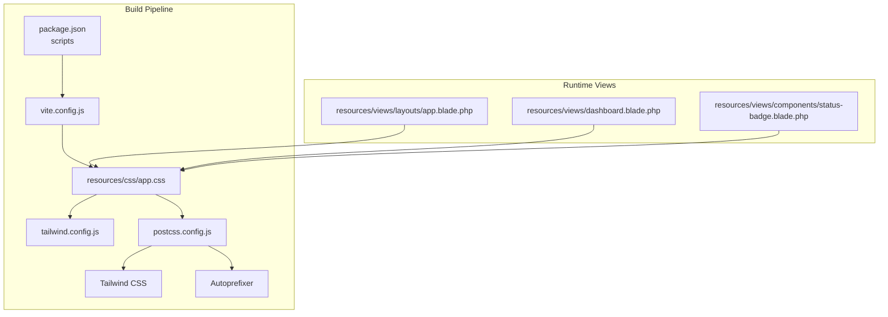
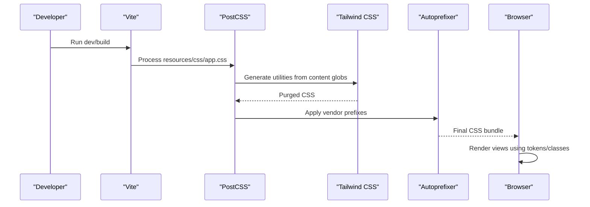
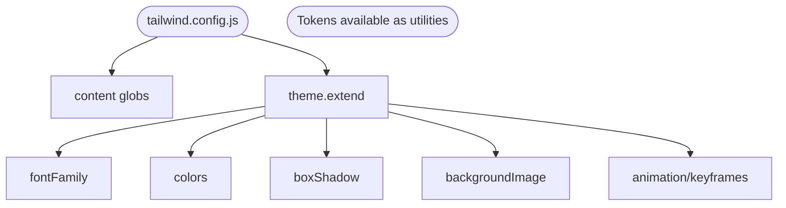
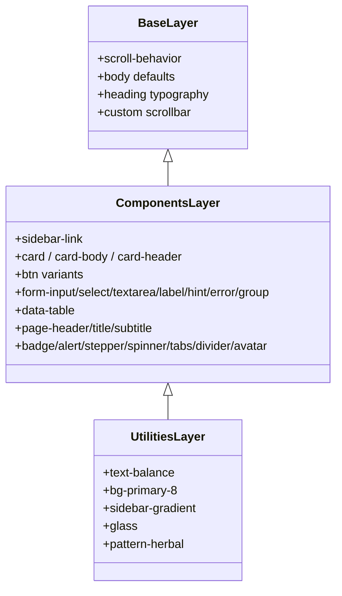
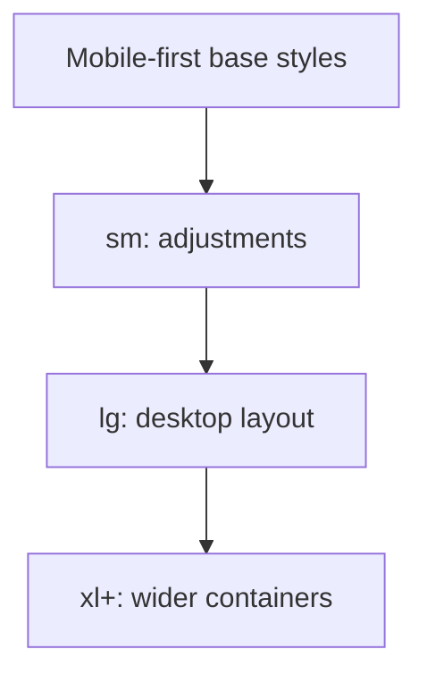
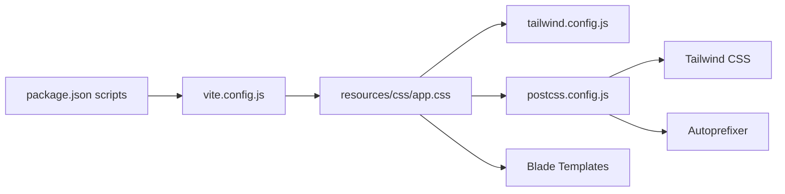

# Styling & Design System

<cite>
**Referenced Files in This Document**
- [tailwind.config.js](file://tailwind.config.js)
- [app.css](file://resources/css/app.css)
- [postcss.config.js](file://postcss.config.js)
- [vite.config.js](file://vite.config.js)
- [package.json](file://package.json)
- [app.blade.php](file://resources/views/layouts/app.blade.php)
- [dashboard.blade.php](file://resources/views/dashboard.blade.php)
- [status-badge.blade.php](file://resources/views/components/status-badge.blade.php)
</cite>

## Table of Contents
1. [Introduction](#introduction)
2. [Project Structure](#project-structure)
3. [Core Components](#core-components)
4. [Architecture Overview](#architecture-overview)
5. [Detailed Component Analysis](#detailed-component-analysis)
6. [Dependency Analysis](#dependency-analysis)
7. [Performance Considerations](#performance-considerations)
8. [Troubleshooting Guide](#troubleshooting-guide)
9. [Conclusion](#conclusion)

## Introduction
This document explains the styling architecture built on Tailwind CSS with custom design tokens, organized via a layered CSS approach and compiled through Vite and PostCSS. It covers configuration, custom color palette, typography system, spacing utilities, component-level classes, responsive patterns, cross-browser considerations, and performance optimization including purging and asset compilation.

## Project Structure
The styling stack is centered around:
- Tailwind configuration for theme extensions (colors, fonts, shadows, gradients, animations)
- A single CSS entry file using Tailwind layers to organize base styles, reusable components, and small utility helpers
- PostCSS pipeline with Tailwind and Autoprefixer
- Vite as the build tool that compiles assets and integrates with Laravel

**Diagram sources**
- [package.json:5-8](file://package.json#L5-L8)
- [vite.config.js:4-10](file://vite.config.js#L4-L10)
- [app.css:1-5](file://resources/css/app.css#L1-L5)
- [tailwind.config.js:1-10](file://tailwind.config.js#L1-L10)
- [postcss.config.js:1-6](file://postcss.config.js#L1-L6)
- [app.blade.php:22](file://resources/views/layouts/app.blade.php#L22)
- [dashboard.blade.php:1](file://resources/views/dashboard.blade.php#L1)
- [status-badge.blade.php:1](file://resources/views/components/status-badge.blade.php#L1)

**Section sources**
- [package.json:5-8](file://package.json#L5-L8)
- [vite.config.js:4-10](file://vite.config.js#L4-L10)
- [app.css:1-5](file://resources/css/app.css#L1-L5)
- [tailwind.config.js:1-10](file://tailwind.config.js#L1-L10)
- [postcss.config.js:1-6](file://postcss.config.js#L1-L6)
- [app.blade.php:22](file://resources/views/layouts/app.blade.php#L22)

## Core Components
- Theme tokens and extensions are defined in the Tailwind config:
  - Custom colors: primary, secondary, accent, surface, ink
  - Typography: Inter for body text, Poppins for headings
  - Shadows: card, card-hover, sidebar
  - Gradients: herbal-themed linear gradients
  - Animations and keyframes: fade-in, slide-in, pulse-dot
- Layered CSS organization in app.css:
  - Base layer: global resets, typography defaults, custom scrollbar
  - Components layer: reusable UI primitives (sidebar links, cards, buttons, forms, tables, badges, alerts, stepper, tabs, dividers, avatars)
  - Utilities layer: small helper classes (text-balance, glass effect, subtle pattern)
- Build and runtime integration:
  - Vite compiles resources/css/app.css and resources/js/app.js
  - PostCSS runs Tailwind and Autoprefixer
  - Blade layouts import the compiled CSS via Vite

Practical usage examples across views:
- Responsive grids and layout shifts using Tailwind breakpoints
- Consistent use of design tokens (e.g., bg-primary, text-ink, font-heading)
- Reusable component classes (card, btn-primary, badge, etc.)

**Section sources**
- [tailwind.config.js:12-61](file://tailwind.config.js#L12-L61)
- [app.css:8-35](file://resources/css/app.css#L8-L35)
- [app.css:38-292](file://resources/css/app.css#L38-L292)
- [app.css:294-318](file://resources/css/app.css#L294-L318)
- [vite.config.js:4-10](file://vite.config.js#L4-L10)
- [postcss.config.js:1-6](file://postcss.config.js#L1-L6)
- [app.blade.php:22](file://resources/views/layouts/app.blade.php#L22)
- [dashboard.blade.php:9-11](file://resources/views/dashboard.blade.php#L9-L11)

## Architecture Overview
The styling architecture follows a clear separation of concerns:
- Configuration-driven tokens (Tailwind config)
- Layered CSS (base → components → utilities)
- Build-time processing (Vite + PostCSS + Tailwind + Autoprefixer)
- View composition (Blade templates compose Tailwind classes and component classes)

**Diagram sources**
- [vite.config.js:4-10](file://vite.config.js#L4-L10)
- [postcss.config.js:1-6](file://postcss.config.js#L1-L6)
- [tailwind.config.js:5-10](file://tailwind.config.js#L5-L10)
- [app.css:1-5](file://resources/css/app.css#L1-L5)

## Detailed Component Analysis

### Tailwind Configuration and Tokens
- Content scanning paths ensure only used classes are included in production builds.
- Theme extensions define:
  - Fonts: sans (Inter), heading (Poppins)
  - Colors: semantic palette (primary, secondary, accent, surface, ink)
  - Shadows: card-focused elevation tokens
  - Background images: herbal gradients
  - Animations: fade-in, slide-in, pulse-dot with keyframes

**Diagram sources**
- [tailwind.config.js:5-10](file://tailwind.config.js#L5-L10)
- [tailwind.config.js:12-61](file://tailwind.config.js#L12-L61)

**Section sources**
- [tailwind.config.js:5-10](file://tailwind.config.js#L5-L10)
- [tailwind.config.js:12-61](file://tailwind.config.js#L12-L61)

### CSS Layers and Component Classes
- Base layer sets global behavior:
  - Smooth scrolling
  - Body defaults using design tokens (font-sans, text-ink, bg-surface)
  - Heading typography via font-heading
  - Custom scrollbar styling
- Components layer provides cohesive UI building blocks:
  - Sidebar navigation links with active states
  - Cards with hover elevation
  - Buttons (primary, secondary, outline, ghost, danger, accent; sizes sm/lg)
  - Form inputs, selects, textareas, labels, hints, errors, groups
  - Data tables with header/body styles and hover effects
  - Page headers, badges, alerts, approval stepper, flash messages, spinner, tabs, dividers, avatars
- Utilities layer adds small helpers:
  - Text balance
  - Semi-transparent background token
  - Sidebar gradient
  - Glass effect
  - Subtle SVG pattern overlay

**Diagram sources**
- [app.css:8-35](file://resources/css/app.css#L8-L35)
- [app.css:38-292](file://resources/css/app.css#L38-L292)
- [app.css:294-318](file://resources/css/app.css#L294-L318)

**Section sources**
- [app.css:8-35](file://resources/css/app.css#L8-L35)
- [app.css:38-292](file://resources/css/app.css#L38-L292)
- [app.css:294-318](file://resources/css/app.css#L294-L318)

### Responsive Design Patterns and Mobile-First Approach
- The application uses Tailwind’s responsive prefixes to adapt layouts:
  - Grids switch from single-column on mobile to multi-column on larger screens
  - Sidebars collapse into overlays on small viewports
  - Top bar shows a hamburger toggle on mobile and a compact user area on desktop
- Examples:
  - Dashboard grid: two columns on small screens, four on large
  - Approval center: stacked on mobile, side-by-side on large screens
  - Modal widths scale up at sm breakpoint

[No sources needed since this diagram shows conceptual workflow, not actual code structure]

**Section sources**
- [app.blade.php:44-46](file://resources/views/layouts/app.blade.php#L44-L46)
- [app.blade.php:241-253](file://resources/views/layouts/app.blade.php#L241-L253)
- [dashboard.blade.php:59-60](file://resources/views/dashboard.blade.php#L59-L60)
- [dashboard.blade.php:173-176](file://resources/views/dashboard.blade.php#L173-L176)

### Cross-Browser Compatibility Considerations
- Autoprefixer ensures vendor prefixes are applied during build.
- Custom scrollbar styles target WebKit browsers; consider fallbacks if broader support is required.
- Backdrop blur and glass effects rely on modern CSS; degrade gracefully where unsupported.

**Section sources**
- [postcss.config.js:1-6](file://postcss.config.js#L1-L6)
- [app.css:22-34](file://resources/css/app.css#L22-L34)
- [app.css:310-312](file://resources/css/app.css#L310-L312)

### Practical Implementation Examples
- Consistent styling with design tokens:
  - Use bg-primary, text-ink, font-heading, shadow-card, animate-fade-in
- Creating custom components with Tailwind classes:
  - Compose button variants by extending a base .btn class
  - Wrap table rows and cells with data-table classes for consistent look
  - Use badge and status-badge components for uniform status indicators
- Maintaining design consistency:
  - Centralize tokens in tailwind.config.js
  - Keep component classes in the components layer
  - Prefer utility composition over ad-hoc inline styles

**Section sources**
- [tailwind.config.js:18-31](file://tailwind.config.js#L18-L31)
- [app.css:82-119](file://resources/css/app.css#L82-L119)
- [app.css:166-188](file://resources/css/app.css#L166-L188)
- [status-badge.blade.php:1-45](file://resources/views/components/status-badge.blade.php#L1-L45)

## Dependency Analysis
The styling dependencies flow from package scripts through Vite and PostCSS to Tailwind and Autoprefixer. Blade templates consume the compiled output.

**Diagram sources**
- [package.json:5-8](file://package.json#L5-L8)
- [vite.config.js:4-10](file://vite.config.js#L4-L10)
- [app.css:1-5](file://resources/css/app.css#L1-L5)
- [tailwind.config.js:1-10](file://tailwind.config.js#L1-L10)
- [postcss.config.js:1-6](file://postcss.config.js#L1-L6)

**Section sources**
- [package.json:5-8](file://package.json#L5-L8)
- [vite.config.js:4-10](file://vite.config.js#L4-L10)
- [app.css:1-5](file://resources/css/app.css#L1-L5)
- [tailwind.config.js:1-10](file://tailwind.config.js#L1-L10)
- [postcss.config.js:1-6](file://postcss.config.js#L1-L6)

## Performance Considerations
- CSS Purging:
  - Tailwind scans Blade files under resources/views/** and pagination views to include only used utilities.
  - Ensure all template paths are covered by content globs so no classes are dropped unintentionally.
- Asset Compilation:
  - Vite compiles resources/css/app.css and resources/js/app.js.
  - Use npm run dev for development with hot refresh; npm run build for production.
- Optimization Tips:
  - Keep component classes centralized to avoid duplication.
  - Prefer design tokens over hard-coded values.
  - Minimize heavy animations; reuse animation utilities.
  - Avoid excessive backdrop-blur or complex gradients on low-end devices.

**Section sources**
- [tailwind.config.js:5-10](file://tailwind.config.js#L5-L10)
- [vite.config.js:4-10](file://vite.config.js#L4-L10)
- [package.json:5-8](file://package.json#L5-L8)

## Troubleshooting Guide
- Styles not appearing:
  - Verify Vite is running and serving resources/css/app.css.
  - Confirm content globs include all relevant Blade files.
- Missing Tailwind classes:
  - Check that class names match those generated by Tailwind; verify spelling and variant usage.
- Autoprefixer issues:
  - Ensure postcss.config.js includes autoprefixer and Tailwind plugins.
- Custom scrollbar not visible:
  - WebKit-only selectors may not apply on non-Chromium browsers; add fallbacks if necessary.
- Animation not playing:
  - Confirm animation names and keyframes exist in tailwind.config.js and are referenced correctly.

**Section sources**
- [tailwind.config.js:5-10](file://tailwind.config.js#L5-L10)
- [postcss.config.js:1-6](file://postcss.config.js#L1-L6)
- [app.css:22-34](file://resources/css/app.css#L22-L34)
- [app.css:41-58](file://resources/css/app.css#L41-L58)

## Conclusion
The styling system leverages Tailwind CSS with a well-scoped configuration and layered CSS to deliver a consistent, maintainable design system. Tokens centralize brand identity, component classes encapsulate reusable UI, and the build pipeline ensures efficient delivery. Following the patterns outlined here will help teams implement consistent styling, create robust components, and keep performance optimized across devices and browsers.