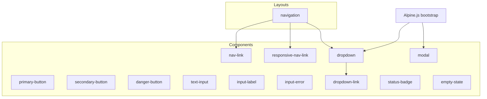
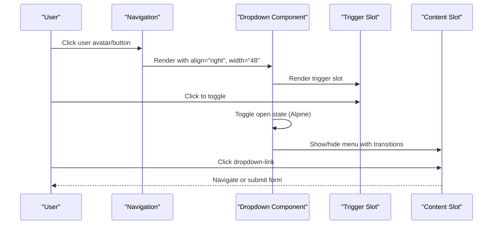
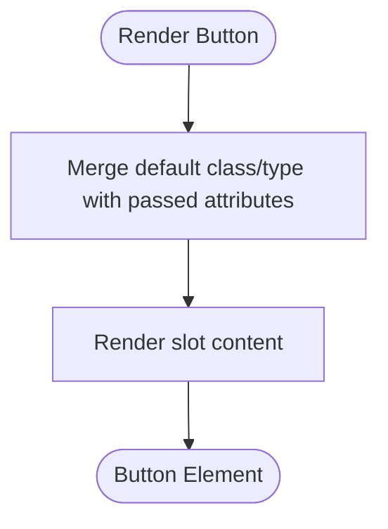
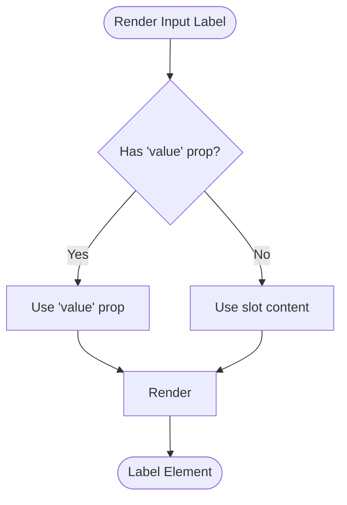
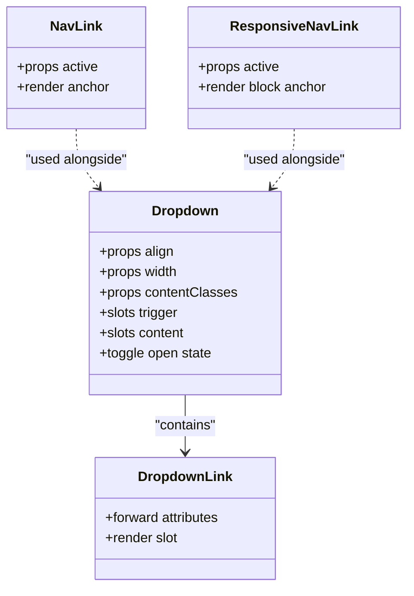
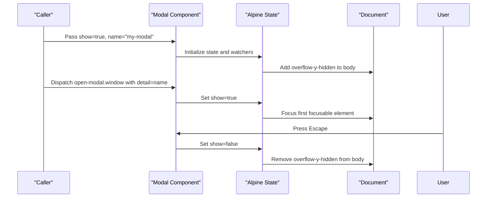
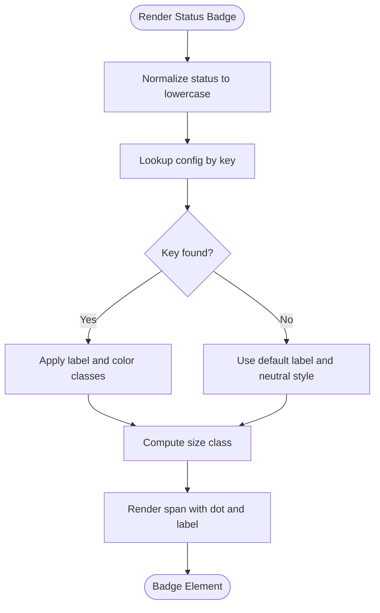
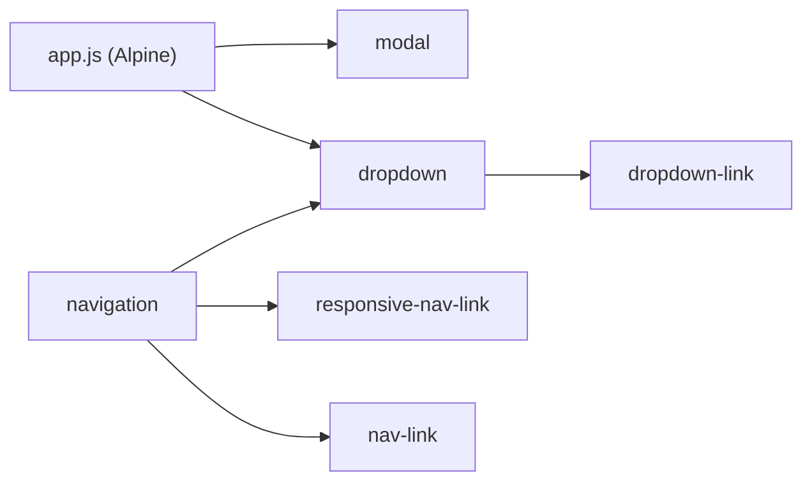

# UI Components System

<cite>
**Referenced Files in This Document**
- [primary-button.blade.php](file://resources/views/components/primary-button.blade.php)
- [secondary-button.blade.php](file://resources/views/components/secondary-button.blade.php)
- [danger-button.blade.php](file://resources/views/components/danger-button.blade.php)
- [text-input.blade.php](file://resources/views/components/text-input.blade.php)
- [input-label.blade.php](file://resources/views/components/input-label.blade.php)
- [input-error.blade.php](file://resources/views/components/input-error.blade.php)
- [nav-link.blade.php](file://resources/views/components/nav-link.blade.php)
- [responsive-nav-link.blade.php](file://resources/views/components/responsive-nav-link.blade.php)
- [dropdown.blade.php](file://resources/views/components/dropdown.blade.php)
- [dropdown-link.blade.php](file://resources/views/components/dropdown-link.blade.php)
- [modal.blade.php](file://resources/views/components/modal.blade.php)
- [status-badge.blade.php](file://resources/views/components/status-badge.blade.php)
- [empty-state.blade.php](file://resources/views/components/empty-state.blade.php)
- [navigation.blade.php](file://resources/views/layouts/navigation.blade.php)
- [app.js](file://resources/js/app.js)
</cite>

## Table of Contents
1. [Introduction](#introduction)
2. [Project Structure](#project-structure)
3. [Core Components](#core-components)
4. [Architecture Overview](#architecture-overview)
5. [Detailed Component Analysis](#detailed-component-analysis)
6. [Dependency Analysis](#dependency-analysis)
7. [Performance Considerations](#performance-considerations)
8. [Troubleshooting Guide](#troubleshooting-guide)
9. [Conclusion](#conclusion)
10. [Appendices](#appendices)

## Introduction
This document describes the reusable Blade component system used across the application. It covers buttons, form elements, navigation elements, and specialized components such as modal, status badge, and empty state. The documentation explains how to create custom components, pass props, use slots, handle events with Alpine.js, compose components together, and apply consistent styling. It also outlines naming conventions, accessibility considerations, and responsive design patterns used throughout the library.

## Project Structure
The UI components are organized under resources/views/components and consumed via the x- prefix (for example, x-primary-button). Layouts and pages compose these primitives into higher-level interfaces. Alpine.js is bootstrapped globally for interactivity.

**Diagram sources**
- [navigation.blade.php:1-202](file://resources/views/layouts/navigation.blade.php#L1-L202)
- [dropdown.blade.php:1-36](file://resources/views/components/dropdown.blade.php#L1-L36)
- [dropdown-link.blade.php:1-2](file://resources/views/components/dropdown-link.blade.php#L1-L2)
- [nav-link.blade.php:1-12](file://resources/views/components/nav-link.blade.php#L1-L12)
- [responsive-nav-link.blade.php:1-12](file://resources/views/components/responsive-nav-link.blade.php#L1-L12)
- [modal.blade.php:1-79](file://resources/views/components/modal.blade.php#L1-L79)
- [app.js:1-8](file://resources/js/app.js#L1-L8)

**Section sources**
- [navigation.blade.php:1-202](file://resources/views/layouts/navigation.blade.php#L1-L202)
- [app.js:1-8](file://resources/js/app.js#L1-L8)

## Core Components
This section summarizes each component’s purpose, props, slot usage, and behavior.

- Buttons
  - primary-button: Submit-style button with default type submit; accepts all attributes and renders slot content.
  - secondary-button: Neutral action button with default type button; accepts all attributes and renders slot content.
  - danger-button: Destructive action button with default type submit; accepts all attributes and renders slot content.

- Form Elements
  - text-input: Accepts a disabled prop and forwards all other attributes; applies focus styles.
  - input-label: Accepts value prop or slot content; renders a label element.
  - input-error: Accepts messages prop (array or string); renders an unordered list of errors when present.

- Navigation
  - nav-link: Accepts active boolean; toggles active/inactive styles; renders anchor with slot content.
  - responsive-nav-link: Mobile-friendly variant with block layout and left border indicator; accepts active boolean.
  - dropdown: Accepts align, width, and contentClasses props; uses Alpine.js to toggle visibility; exposes trigger and content named slots.
  - dropdown-link: Styled link item for dropdown menus; forwards attributes and renders slot content.

- Specialized Components
  - modal: Accepts name, show, and maxWidth props; manages focus trap, keyboard handling, and overlay transitions using Alpine.js; exposes default slot for content.
  - status-badge: Accepts status and size props; maps statuses to labels and color classes; renders a small dot indicator based on status category.
  - empty-state: Accepts title, description, icon, and optional action slot; renders a centered illustration and message area.

**Section sources**
- [primary-button.blade.php:1-4](file://resources/views/components/primary-button.blade.php#L1-L4)
- [secondary-button.blade.php:1-4](file://resources/views/components/secondary-button.blade.php#L1-L4)
- [danger-button.blade.php:1-4](file://resources/views/components/danger-button.blade.php#L1-L4)
- [text-input.blade.php:1-4](file://resources/views/components/text-input.blade.php#L1-L4)
- [input-label.blade.php:1-6](file://resources/views/components/input-label.blade.php#L1-L6)
- [input-error.blade.php:1-10](file://resources/views/components/input-error.blade.php#L1-L10)
- [nav-link.blade.php:1-12](file://resources/views/components/nav-link.blade.php#L1-L12)
- [responsive-nav-link.blade.php:1-12](file://resources/views/components/responsive-nav-link.blade.php#L1-L12)
- [dropdown.blade.php:1-36](file://resources/views/components/dropdown.blade.php#L1-L36)
- [dropdown-link.blade.php:1-2](file://resources/views/components/dropdown-link.blade.php#L1-L2)
- [modal.blade.php:1-79](file://resources/views/components/modal.blade.php#L1-L79)
- [status-badge.blade.php:1-45](file://resources/views/components/status-badge.blade.php#L1-L45)
- [empty-state.blade.php:1-39](file://resources/views/components/empty-state.blade.php#L1-L39)

## Architecture Overview
The component system follows a layered approach:
- Primitive components provide base UI building blocks (buttons, inputs, badges).
- Composite components combine primitives and add behavior (dropdown, modal).
- Layouts orchestrate composition and integrate global interactivity via Alpine.js.

**Diagram sources**
- [navigation.blade.php:77-116](file://resources/views/layouts/navigation.blade.php#L77-L116)
- [dropdown.blade.php:1-36](file://resources/views/components/dropdown.blade.php#L1-L36)
- [dropdown-link.blade.php:1-2](file://resources/views/components/dropdown-link.blade.php#L1-L2)

## Detailed Component Analysis

### Button Components
Buttons encapsulate common styles and default behaviors while remaining flexible through attribute forwarding and slot content.

- primary-button
  - Props: none (uses $attributes->merge)
  - Default type: submit
  - Slot: button label/content
  - Use cases: Primary actions, form submissions

- secondary-button
  - Props: none (uses $attributes->merge)
  - Default type: button
  - Slot: button label/content
  - Use cases: Secondary actions, cancel, reset

- danger-button
  - Props: none (uses $attributes->merge)
  - Default type: submit
  - Slot: button label/content
  - Use cases: Destructive actions like delete

**Diagram sources**
- [primary-button.blade.php:1-4](file://resources/views/components/primary-button.blade.php#L1-L4)
- [secondary-button.blade.php:1-4](file://resources/views/components/secondary-button.blade.php#L1-L4)
- [danger-button.blade.php:1-4](file://resources/views/components/danger-button.blade.php#L1-L4)

**Section sources**
- [primary-button.blade.php:1-4](file://resources/views/components/primary-button.blade.php#L1-L4)
- [secondary-button.blade.php:1-4](file://resources/views/components/secondary-button.blade.php#L1-L4)
- [danger-button.blade.php:1-4](file://resources/views/components/danger-button.blade.php#L1-L4)

### Form Components
Form components standardize appearance and behavior for inputs and validation feedback.

- text-input
  - Props: disabled (boolean)
  - Behavior: Applies disabled state and focus ring styles; forwards all attributes
  - Accessibility: Ensure associated label via id/name pairing at usage site

- input-label
  - Props: value (string), supports slot fallback
  - Behavior: Renders label with consistent typography
  - Accessibility: For best results, set matching for/id on input and label

- input-error
  - Props: messages (array or string)
  - Behavior: Renders error list only when messages exist
  - Integration: Typically used after form field rendering to display validation errors

**Diagram sources**
- [input-label.blade.php:1-6](file://resources/views/components/input-label.blade.php#L1-L6)

**Section sources**
- [text-input.blade.php:1-4](file://resources/views/components/text-input.blade.php#L1-L4)
- [input-label.blade.php:1-6](file://resources/views/components/input-label.blade.php#L1-L6)
- [input-error.blade.php:1-10](file://resources/views/components/input-error.blade.php#L1-L10)

### Navigation Components
Navigation components provide both desktop and mobile-friendly links and menus.

- nav-link
  - Props: active (boolean)
  - Behavior: Toggles active/inactive styles; renders anchor with slot content

- responsive-nav-link
  - Props: active (boolean)
  - Behavior: Full-width block link with left border indicator for mobile

- dropdown
  - Props: align, width, contentClasses
  - Slots: trigger, content
  - Behavior: Uses Alpine.js to toggle visibility; handles click-outside and close events; applies transition classes

- dropdown-link
  - Props: none (uses $attributes->merge)
  - Behavior: Styled link item for dropdown content

**Diagram sources**
- [dropdown.blade.php:1-36](file://resources/views/components/dropdown.blade.php#L1-L36)
- [dropdown-link.blade.php:1-2](file://resources/views/components/dropdown-link.blade.php#L1-L2)
- [nav-link.blade.php:1-12](file://resources/views/components/nav-link.blade.php#L1-L12)
- [responsive-nav-link.blade.php:1-12](file://resources/views/components/responsive-nav-link.blade.php#L1-L12)

**Section sources**
- [nav-link.blade.php:1-12](file://resources/views/components/nav-link.blade.php#L1-L12)
- [responsive-nav-link.blade.php:1-12](file://resources/views/components/responsive-nav-link.blade.php#L1-L12)
- [dropdown.blade.php:1-36](file://resources/views/components/dropdown.blade.php#L1-L36)
- [dropdown-link.blade.php:1-2](file://resources/views/components/dropdown-link.blade.php#L1-L2)

### Modal Component
Modal provides accessible dialog behavior with focus management and keyboard support.

- Props: name, show (boolean), maxWidth (sm/md/lg/xl/2xl)
- Behavior:
  - Controls visibility via show prop and window events (open-modal/close-modal)
  - Focus trap within modal content
  - Escape key closes modal
  - Body scroll lock while open
  - Transitions for overlay and panel

**Diagram sources**
- [modal.blade.php:1-79](file://resources/views/components/modal.blade.php#L1-L79)

**Section sources**
- [modal.blade.php:1-79](file://resources/views/components/modal.blade.php#L1-L79)

### Status Badge Component
Status badge visualizes entity states with semantic colors and optional sizes.

- Props: status (string), size (default/sm/lg)
- Behavior: Maps normalized status keys to labels and color classes; renders a colored dot indicator based on status category

**Diagram sources**
- [status-badge.blade.php:1-45](file://resources/views/components/status-badge.blade.php#L1-L45)

**Section sources**
- [status-badge.blade.php:1-45](file://resources/views/components/status-badge.blade.php#L1-L45)

### Empty State Component
Empty state presents a friendly placeholder when no data is available.

- Props: title, description, icon (formula/trial/approval/search/default)
- Slots: action (optional)
- Behavior: Renders icon circle, heading, description, and optional action area

**Section sources**
- [empty-state.blade.php:1-39](file://resources/views/components/empty-state.blade.php#L1-L39)

## Dependency Analysis
Inter-component relationships and external dependencies:

- Alpine.js integration
  - Bootstrapped globally in app.js
  - Used by dropdown and modal for state and event handling

- Composition patterns
  - navigation uses nav-link, responsive-nav-link, and dropdown
  - dropdown composes dropdown-link
  - Forms typically compose input-label, text-input, and input-error

**Diagram sources**
- [app.js:1-8](file://resources/js/app.js#L1-L8)
- [navigation.blade.php:1-202](file://resources/views/layouts/navigation.blade.php#L1-L202)
- [dropdown.blade.php:1-36](file://resources/views/components/dropdown.blade.php#L1-L36)
- [dropdown-link.blade.php:1-2](file://resources/views/components/dropdown-link.blade.php#L1-L2)

**Section sources**
- [app.js:1-8](file://resources/js/app.js#L1-L8)
- [navigation.blade.php:1-202](file://resources/views/layouts/navigation.blade.php#L1-L202)

## Performance Considerations
- Attribute merging: All components use $attributes->merge to avoid redundant class duplication and keep markup minimal.
- Conditional rendering: Components like input-error render lists only when messages exist, reducing unnecessary DOM nodes.
- Lightweight interactivity: Alpine.js is used sparingly for local state (dropdown, modal), avoiding heavy frameworks.
- Transition classes: Tailwind transition utilities provide smooth animations without extra JavaScript overhead.

[No sources needed since this section provides general guidance]

## Troubleshooting Guide
- Dropdown not opening/closing
  - Ensure Alpine.js is initialized globally
  - Verify trigger slot contains a clickable element
  - Check that no parent overlays intercept clicks

- Modal focus issues
  - Confirm focusable attribute is used if you need auto-focus on open
  - Ensure escape key handler is not overridden elsewhere
  - Validate that focusable elements inside modal are not disabled

- Form validation display
  - Make sure input-error receives messages array or string
  - Pair input-label with text-input using matching id/name for accessibility

- Status badge incorrect label
  - Normalize status values to match known keys
  - Provide fallback label when unknown status is passed

**Section sources**
- [dropdown.blade.php:1-36](file://resources/views/components/dropdown.blade.php#L1-L36)
- [modal.blade.php:1-79](file://resources/views/components/modal.blade.php#L1-L79)
- [input-error.blade.php:1-10](file://resources/views/components/input-error.blade.php#L1-L10)
- [status-badge.blade.php:1-45](file://resources/views/components/status-badge.blade.php#L1-L45)
- [app.js:1-8](file://resources/js/app.js#L1-L8)

## Conclusion
The Blade component system provides a cohesive, accessible, and responsive UI foundation. By leveraging props, slots, and Alpine.js, it balances simplicity with powerful composition. Consistent naming, attribute forwarding, and Tailwind-based styling ensure maintainability and scalability across the application.

[No sources needed since this section summarizes without analyzing specific files]

## Appendices

### Component Creation Patterns
- Define props with @props and defaults where appropriate
- Forward attributes using $attributes->merge to allow customization
- Use $slot for content injection and named slots for structured composition
- Keep logic minimal; prefer Tailwind utility classes for styling

### Props Passing Examples
- Boolean flags: active, disabled, show
- Enumerated options: align, width, maxWidth, size
- Data payloads: messages, status, title, description

### Slot Usage Examples
- Default slot: button labels, modal content
- Named slots: dropdown trigger and content, empty-state action

### Event Handling with Alpine.js
- Toggle visibility: x-data with reactive properties
- Keyboard interactions: x-on:keydown.escape
- Global events: x-on:open-modal.window, x-on:close-modal.window
- Click-outside: @click.outside to dismiss menus

### Practical Examples
- Create a custom confirm button by composing a button with a modal trigger
- Build a searchable table header using input-label, text-input, and input-error
- Compose a settings page using dropdown, dropdown-link, and status-badge

### Naming Conventions
- kebab-case filenames for Blade components (e.g., primary-button.blade.php)
- x- prefix in templates (e.g., x-primary-button)
- Props in camelCase when referenced in Blade expressions

### Accessibility Considerations
- Use proper label/input associations
- Ensure focus management in modals
- Provide aria attributes where necessary (e.g., aria-label on icons)
- Maintain sufficient color contrast for status badges

### Responsive Design Patterns
- Use responsive prefixes (sm:, md:, lg:) for spacing and layout
- Prefer flexbox and grid utilities for adaptable layouts
- Hide/show elements based on viewport size for mobile-first design

[No sources needed since this section provides general guidance]