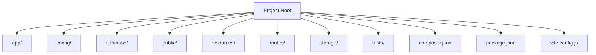
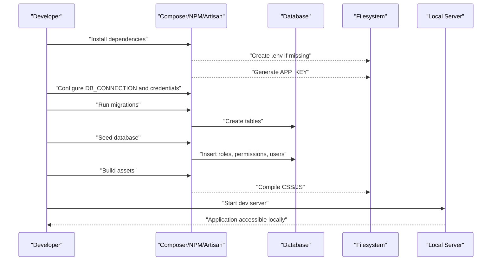
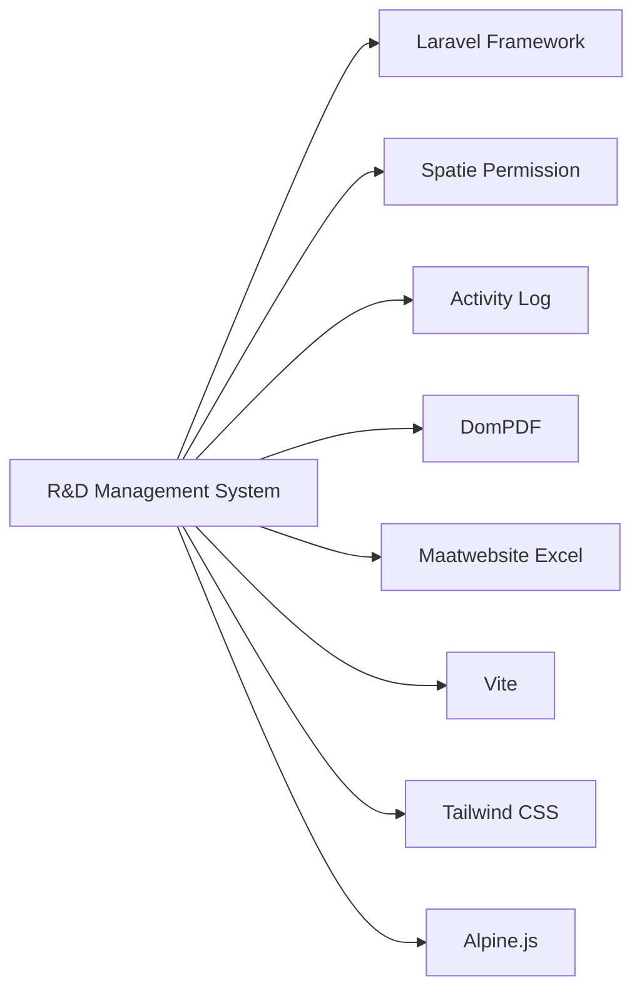

# Getting Started

<cite>
**Referenced Files in This Document**
- [composer.json](file://composer.json)
- [package.json](file://package.json)
- [config/database.php](file://config/database.php)
- [config/app.php](file://config/app.php)
- [config/session.php](file://config/session.php)
- [config/queue.php](file://config/queue.php)
- [config/mail.php](file://config/mail.php)
- [vite.config.js](file://vite.config.js)
- [database/migrations/0001_01_01_000000_create_users_table.php](file://database/migrations/0001_01_01_000000_create_users_table.php)
- [database/migrations/2026_07_01_092410_create_permission_tables.php](file://database/migrations/2026_07_01_092410_create_permission_tables.php)
- [database/seeders/DatabaseSeeder.php](file://database/seeders/DatabaseSeeder.php)
- [database/seeders/UserSeeder.php](file://database/seeders/UserSeeder.php)
- [database/seeders/RolePermissionSeeder.php](file://database/seeders/RolePermissionSeeder.php)
</cite>

## Table of Contents
1. Introduction
2. Project Structure
3. Core Components
4. Architecture Overview
5. Detailed Component Analysis
6. Dependency Analysis
7. Performance Considerations
8. Troubleshooting Guide
9. Conclusion

## Introduction
This guide walks you through setting up the R&D Management System from scratch to a running local application. It covers environment requirements, installation steps, database configuration, first-time initialization (migrations and seeders), and how to run the app for development and production. You will also find troubleshooting tips for common setup issues.

## Project Structure
The project is a Laravel 13 application with:
- PHP backend using Composer-managed dependencies
- Frontend assets managed by Vite and Node.js
- Database migrations and seeders for schema and initial data
- Configuration files for database, sessions, queues, mail, and application settings

[No sources needed since this diagram shows conceptual structure]

## Core Components
- Application runtime: Laravel framework with PHP 8.3+
- Asset pipeline: Vite + Tailwind + Alpine.js via npm scripts
- Database: SQLite (default) or MySQL/MariaDB/PostgreSQL/SQL Server
- Sessions: Database-backed by default
- Queues: Database-backed by default
- Mail: Log driver by default; SMTP available
- Permissions and roles: Spatie Permission package

Key configuration points:
- App name, URL, debug mode, timezone, locale, encryption key
- Database connection selection and per-driver options
- Session driver and cookie behavior
- Queue connection and failed job storage
- Mailer transport and global sender address

**Section sources**
- [config/app.php:16-106](file://config/app.php#L16-L106)
- [config/database.php:20-116](file://config/database.php#L20-L116)
- [config/session.php:21-231](file://config/session.php#L21-L231)
- [config/queue.php:16-127](file://config/queue.php#L16-L127)
- [config/mail.php:17-116](file://config/mail.php#L17-L116)

## Architecture Overview
High-level flow for first-time setup:
- Install PHP and Node.js
- Clone repository and install dependencies
- Configure environment variables (database, app settings)
- Generate application key
- Run database migrations
- Seed demo data and roles
- Build frontend assets
- Start the development server

[No sources needed since this diagram shows conceptual workflow]

## Detailed Component Analysis

### Installation Requirements
- PHP 8.3+ with extensions: PDO, pdo_sqlite (for SQLite), pdo_mysql (for MySQL), mbstring, openssl, tokenizer, xml, ctype, json
- Composer
- Node.js (current LTS recommended)
- SQLite (optional, used when DB_CONNECTION=sqlite)
- MySQL/MariaDB (optional, used when DB_CONNECTION=mysql|mariadb)
- PostgreSQL or SQL Server (optional, supported by config)

Notes:
- The project requires PHP ^8.3 and targets Laravel 13.
- Frontend tooling uses Vite and Tailwind.

**Section sources**
- [composer.json:8-16](file://composer.json#L8-L16)
- [package.json:9-22](file://package.json#L9-L22)

### Step-by-Step Setup (Development)
1. Clone the repository into your web root or preferred directory.
2. Install PHP dependencies:
   - composer install
3. Copy environment file if it does not exist:
   - If .env is missing, create it from .env.example (if present) or create a new .env with required keys.
4. Generate the application key:
   - php artisan key:generate
5. Configure the database:
   - For SQLite: set DB_CONNECTION=sqlite and ensure the database file exists at database/database.sqlite.
   - For MySQL/MariaDB: set DB_CONNECTION=mysql or mariadb, then configure host, port, database, username, password.
6. Run database migrations:
   - php artisan migrate --force
7. Seed the database with roles, permissions, and sample users:
   - php artisan db:seed
8. Build frontend assets:
   - npm install
   - npm run build
9. Start the development server:
   - php artisan serve
10. Open http://localhost:8000 in your browser.

Optional development conveniences:
- Use the provided Composer script to run server, queue worker, logs tailer, and Vite concurrently:
  - composer run dev

**Section sources**
- [composer.json:40-51](file://composer.json#L40-L51)
- [config/database.php:20-65](file://config/database.php#L20-L65)
- [database/migrations/0001_01_01_000000_create_users_table.php:14-37](file://database/migrations/0001_01_01_000000_create_users_table.php#L14-L37)
- [database/seeders/DatabaseSeeder.php:14-33](file://database/seeders/DatabaseSeeder.php#L14-L33)

### Environment Variables Reference
Core variables you may need to set in .env:
- APP_NAME: Application display name
- APP_ENV: Environment (local, production)
- APP_DEBUG: Enable detailed error pages during development
- APP_URL: Base URL of the application
- APP_LOCALE / APP_FALLBACK_LOCALE: Default and fallback locales
- APP_TIMEZONE: Timezone for date/time functions
- APP_KEY: Encryption key (generated automatically)
- DB_CONNECTION: sqlite | mysql | mariadb | pgsql | sqlsrv
- DB_*: Driver-specific connection parameters (host, port, database, username, password, charset, collation)
- SESSION_DRIVER: file | cookie | database | redis | array
- QUEUE_CONNECTION: sync | database | redis | beanstalkd | sqs
- MAIL_MAILER: log | smtp | sendmail | ses | postmark | resend | array | failover | roundrobin
- MAIL_*: SMTP or other mailer settings (host, port, username, password, scheme, url)

Examples:
- SQLite (development):
  - DB_CONNECTION=sqlite
  - Ensure database/database.sqlite exists
- MySQL (development):
  - DB_CONNECTION=mysql
  - DB_HOST=127.0.0.1
  - DB_PORT=3306
  - DB_DATABASE=rnd_management
  - DB_USERNAME=root
  - DB_PASSWORD=your_password
- Production considerations:
  - APP_ENV=production
  - APP_DEBUG=false
  - APP_URL=https://your-domain.com
  - SESSION_SECURE_COOKIE=true
  - SESSION_HTTP_ONLY=true
  - SESSION_SAME_SITE=lax|strict|none (as appropriate)
  - QUEUE_CONNECTION=database or a scalable backend like Redis/SQS
  - MAIL_MAILER=smtp or another production-ready transport

**Section sources**
- [config/app.php:16-106](file://config/app.php#L16-L106)
- [config/database.php:20-116](file://config/database.php#L20-L116)
- [config/session.php:21-231](file://config/session.php#L21-L231)
- [config/queue.php:16-127](file://config/queue.php#L16-L127)
- [config/mail.php:17-116](file://config/mail.php#L17-L116)

### Database Configuration Options
Supported drivers and defaults:
- sqlite: Uses database/database.sqlite by default
- mysql/mariadb: Host, port, database, username, password, charset/collation
- pgsql: Host, port, database, username, password, sslmode
- sqlsrv: Host, port, database, username, password

Session storage:
- Default driver is database, requiring the sessions table created by migrations.

Queue storage:
- Default driver is database, requiring jobs and related tables.

**Section sources**
- [config/database.php:33-116](file://config/database.php#L33-L116)
- [config/session.php:21-90](file://config/session.php#L21-L90)
- [config/queue.php:16-45](file://config/queue.php#L16-L45)

### First-Time Initialization
Migrations:
- Create core tables including users, password reset tokens, and sessions.
- Permission system tables are created by the permission migration.

Seeding:
- Roles and permissions are seeded.
- Sample users are created with predefined emails and passwords.

After seeding, use the printed credentials to log in.

**Section sources**
- [database/migrations/0001_01_01_000000_create_users_table.php:14-37](file://database/migrations/0001_01_01_000000_create_users_table.php#L14-L37)
- [database/migrations/2026_07_01_092410_create_permission_tables.php:26-115](file://database/migrations/2026_07_01_092410_create_permission_tables.php#L26-L115)
- [database/seeders/DatabaseSeeder.php:14-33](file://database/seeders/DatabaseSeeder.php#L14-L33)
- [database/seeders/UserSeeder.php:17-71](file://database/seeders/UserSeeder.php#L17-L71)
- [database/seeders/RolePermissionSeeder.php:16-110](file://database/seeders/RolePermissionSeeder.php#L16-L110)

### Running the Application

Development
- Start the built-in server:
  - php artisan serve
- Optional: run queue worker, logs, and Vite concurrently:
  - composer run dev

Production
- Set APP_ENV=production and APP_DEBUG=false
- Generate APP_KEY and secure secrets
- Configure database, session, queue, and mail appropriately
- Build assets:
  - npm install && npm run build
- Optimize configuration and routes (typical production commands):
  - php artisan config:cache
  - php artisan route:cache
  - php artisan view:cache
- Serve via a proper web server (e.g., Nginx/Apache) pointing to public/
- Run queue workers as a background service if using database/Redis queues

Frontend asset pipeline:
- Development watch:
  - npm run dev
- Production build:
  - npm run build

**Section sources**
- [composer.json:40-51](file://composer.json#L40-L51)
- [package.json:5-8](file://package.json#L5-L8)
- [vite.config.js:4-10](file://vite.config.js#L4-L10)

## Dependency Analysis
Runtime and development dependencies include:
- Framework and tools: Laravel 13, Tinker
- PDF generation: dompdf
- Excel import/export: maatwebsite/excel
- Activity logging: spatie/laravel-activitylog
- Roles and permissions: spatie/laravel-permission
- Frontend: Vite, Tailwind, Alpine.js

**Diagram sources**
- [composer.json:8-16](file://composer.json#L8-L16)
- [package.json:9-22](file://package.json#L9-L22)

**Section sources**
- [composer.json:8-26](file://composer.json#L8-L26)
- [package.json:9-22](file://package.json#L9-L22)

## Performance Considerations
- Use database-backed sessions and queues in multi-process deployments.
- Cache configuration, routes, and views in production.
- Prefer a robust queue backend (Redis/SQS) for higher throughput.
- Keep APP_DEBUG disabled in production.
- Ensure proper database indexes and connection pooling for high concurrency.

[No sources needed since this section provides general guidance]

## Troubleshooting Guide
Common issues and resolutions:
- Missing .env or APP_KEY:
  - Ensure .env exists and APP_KEY is generated.
- Database connection errors:
  - Verify DB_CONNECTION and credentials.
  - For SQLite, confirm database/database.sqlite exists and is writable.
  - For MySQL, ensure the database exists and user has privileges.
- Migrations fail due to long index keys (MySQL):
  - Follow the migration’s suggestion to clear config cache and re-run migrations.
- Permission tables not found:
  - Ensure permission migrations have been executed.
- Session not persisting:
  - Confirm SESSION_DRIVER=database and that the sessions table exists.
- Queue jobs not processing:
  - Ensure QUEUE_CONNECTION matches your backend and workers are running.
- Assets not loading:
  - Run npm install and npm run build; verify Vite is running in development.

**Section sources**
- [database/migrations/2026_07_01_092410_create_permission_tables.php:20-21](file://database/migrations/2026_07_01_092410_create_permission_tables.php#L20-L21)
- [config/session.php:21-90](file://config/session.php#L21-L90)
- [config/queue.php:16-45](file://config/queue.php#L16-L45)
- [vite.config.js:4-10](file://vite.config.js#L4-L10)

## Conclusion
You now have all the information needed to install, configure, initialize, and run the R&D Management System locally and in production. Start with SQLite for quick local setup, then switch to MySQL or another supported database as needed. Use the provided seeders to quickly explore features with sample users and roles.