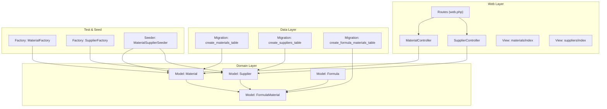
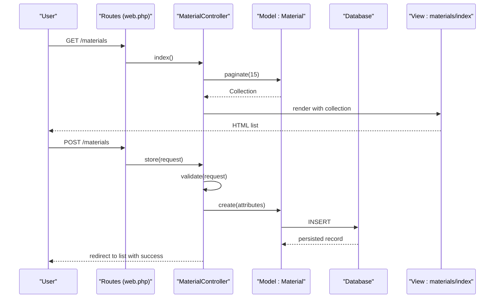
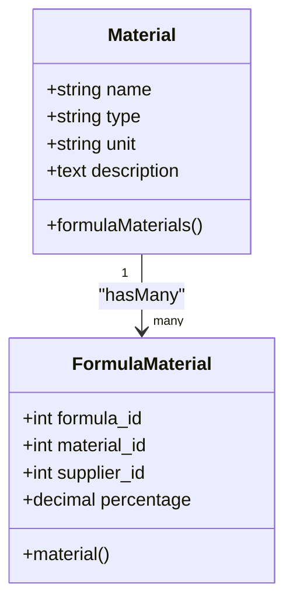
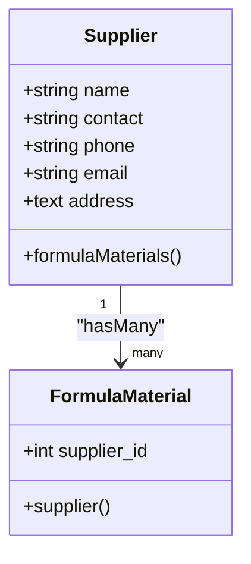
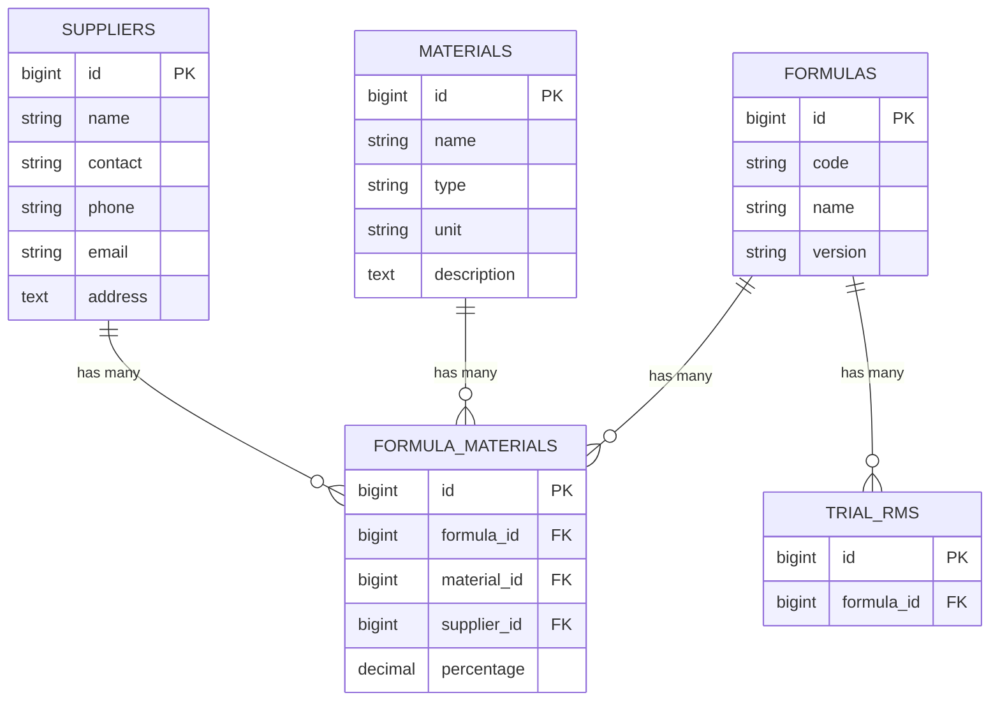
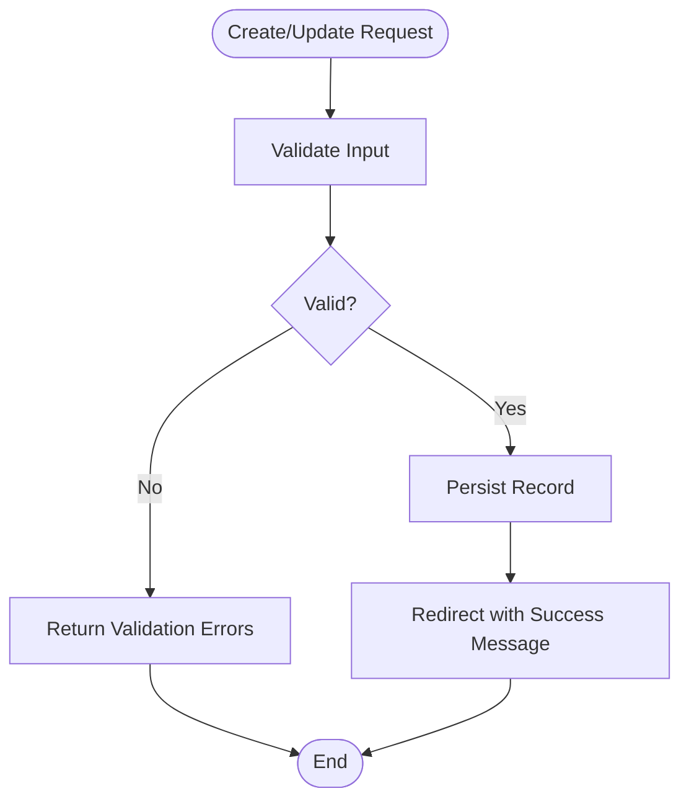
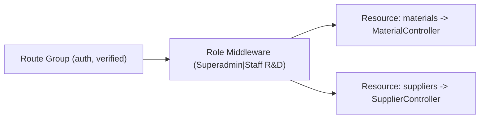

# Master Data Management

<cite>
**Referenced Files in This Document**
- [Material.php](file://app/Models/Material.php)
- [Supplier.php](file://app/Models/Supplier.php)
- [FormulaMaterial.php](file://app/Models/FormulaMaterial.php)
- [Formula.php](file://app/Models/Formula.php)
- [MaterialController.php](file://app/Http/Controllers/MaterialController.php)
- [SupplierController.php](file://app/Http/Controllers/SupplierController.php)
- [2026_07_01_092816_create_materials_table.php](file://database/migrations/2026_07_01_092816_create_materials_table.php)
- [2026_07_01_092825_create_suppliers_table.php](file://database/migrations/2026_07_01_092825_create_suppliers_table.php)
- [2026_07_01_092840_create_formula_materials_table.php](file://database/migrations/2026_07_01_092840_create_formula_materials_table.php)
- [web.php](file://routes/web.php)
- [index.blade.php (materials)](file://resources/views/materials/index.blade.php)
- [index.blade.php (suppliers)](file://resources/views/suppliers/index.blade.php)
- [MaterialFactory.php](file://database/factories/MaterialFactory.php)
- [SupplierFactory.php](file://database/factories/SupplierFactory.php)
- [MaterialSupplierSeeder.php](file://database/seeders/MaterialSupplierSeeder.php)
</cite>

## Table of Contents
1. Introduction
2. Project Structure
3. Core Components
4. Architecture Overview
5. Detailed Component Analysis
6. Dependency Analysis
7. Performance Considerations
8. Troubleshooting Guide
9. Conclusion
10. Appendices

## Introduction
This document explains the Master Data Management system for materials and suppliers, focusing on complete CRUD operations, data validation rules, relationships with formulas and trials, and best practices for maintaining data integrity. It also covers test data generation using factories and seeders, and outlines how master data integrates across modules such as formulas and trials.

## Project Structure
The master data feature is implemented following a standard MVC pattern:
- Models define entities and relationships
- Controllers handle HTTP requests and validation
- Migrations define database schema and constraints
- Views render lists and forms
- Factories and seeders provide test and demo data
- Routes register endpoints and enforce access control

**Diagram sources**
- [web.php:88-91](file://routes/web.php#L88-L91)
- [MaterialController.php:1-78](file://app/Http/Controllers/MaterialController.php#L1-L78)
- [SupplierController.php:1-82](file://app/Http/Controllers/SupplierController.php#L1-L82)
- [Material.php:1-33](file://app/Models/Material.php#L1-L33)
- [Supplier.php:1-34](file://app/Models/Supplier.php#L1-L34)
- [FormulaMaterial.php:1-36](file://app/Models/FormulaMaterial.php#L1-L36)
- [Formula.php:1-89](file://app/Models/Formula.php#L1-L89)
- [2026_07_01_092816_create_materials_table.php:1-32](file://database/migrations/2026_07_01_092816_create_materials_table.php#L1-L32)
- [2026_07_01_092825_create_suppliers_table.php:1-33](file://database/migrations/2026_07_01_092825_create_suppliers_table.php#L1-L33)
- [2026_07_01_092840_create_formula_materials_table.php:1-32](file://database/migrations/2026_07_01_092840_create_formula_materials_table.php#L1-L32)
- [MaterialFactory.php:1-43](file://database/factories/MaterialFactory.php#L1-L43)
- [SupplierFactory.php:1-37](file://database/factories/SupplierFactory.php#L1-L37)
- [MaterialSupplierSeeder.php:1-83](file://database/seeders/MaterialSupplierSeeder.php#L1-L83)

**Section sources**
- [web.php:88-91](file://routes/web.php#L88-L91)
- [MaterialController.php:1-78](file://app/Http/Controllers/MaterialController.php#L1-L78)
- [SupplierController.php:1-82](file://app/Http/Controllers/SupplierController.php#L1-L82)
- [Material.php:1-33](file://app/Models/Material.php#L1-L33)
- [Supplier.php:1-34](file://app/Models/Supplier.php#L1-L34)
- [FormulaMaterial.php:1-36](file://app/Models/FormulaMaterial.php#L1-L36)
- [Formula.php:1-89](file://app/Models/Formula.php#L1-L89)
- [2026_07_01_092816_create_materials_table.php:1-32](file://database/migrations/2026_07_01_092816_create_materials_table.php#L1-L32)
- [2026_07_01_092825_create_suppliers_table.php:1-33](file://database/migrations/2026_07_01_092825_create_suppliers_table.php#L1-L33)
- [2026_07_01_092840_create_formula_materials_table.php:1-32](file://database/migrations/2026_07_01_092840_create_formula_materials_table.php#L1-L32)
- [MaterialFactory.php:1-43](file://database/factories/MaterialFactory.php#L1-L43)
- [SupplierFactory.php:1-37](file://database/factories/SupplierFactory.php#L1-L37)
- [MaterialSupplierSeeder.php:1-83](file://database/seeders/MaterialSupplierSeeder.php#L1-L83)

## Core Components
- Material model: defines attributes, activity logging, and relationship to formula materials.
- Supplier model: defines attributes, activity logging, and relationship to formula materials.
- FormulaMaterial model: joins formulas, materials, and suppliers; stores percentage composition.
- MaterialController and SupplierController: implement full CRUD with validation and redirects.
- Database migrations: define tables, default values, and foreign key constraints.
- Views: list pages with pagination and action links.
- Factories and seeders: generate realistic test data and initial records.

Key responsibilities:
- Enforce uniqueness and format validation at controller level.
- Maintain referential integrity via foreign keys.
- Provide audit trails through activity logging.
- Offer UI for listing, creating, editing, and deleting master records.

**Section sources**
- [Material.php:1-33](file://app/Models/Material.php#L1-L33)
- [Supplier.php:1-34](file://app/Models/Supplier.php#L1-L34)
- [FormulaMaterial.php:1-36](file://app/Models/FormulaMaterial.php#L1-L36)
- [MaterialController.php:1-78](file://app/Http/Controllers/MaterialController.php#L1-L78)
- [SupplierController.php:1-82](file://app/Http/Controllers/SupplierController.php#L1-L82)
- [2026_07_01_092816_create_materials_table.php:1-32](file://database/migrations/2026_07_01_092816_create_materials_table.php#L1-L32)
- [2026_07_01_092825_create_suppliers_table.php:1-33](file://database/migrations/2026_07_01_092825_create_suppliers_table.php#L1-L33)
- [2026_07_01_092840_create_formula_materials_table.php:1-32](file://database/migrations/2026_07_01_092840_create_formula_materials_table.php#L1-L32)
- [index.blade.php (materials):1-93](file://resources/views/materials/index.blade.php#L1-L93)
- [index.blade.php (suppliers):1-89](file://resources/views/suppliers/index.blade.php#L1-L89)
- [MaterialFactory.php:1-43](file://database/factories/MaterialFactory.php#L1-L43)
- [SupplierFactory.php:1-37](file://database/factories/SupplierFactory.php#L1-L37)
- [MaterialSupplierSeeder.php:1-83](file://database/seeders/MaterialSupplierSeeder.php#L1-L83)

## Architecture Overview
Master data flows from controllers into models and persists via migrations. The UI renders paginated lists and actions. Formulas reference materials and suppliers through the join table.

**Diagram sources**
- [web.php:88-91](file://routes/web.php#L88-L91)
- [MaterialController.php:10-40](file://app/Http/Controllers/MaterialController.php#L10-L40)
- [Material.php:1-33](file://app/Models/Material.php#L1-L33)
- [index.blade.php (materials):1-93](file://resources/views/materials/index.blade.php#L1-L93)

## Detailed Component Analysis

### Materials Module
- Model: Material
  - Attributes: name, type, unit, description
  - Activity logging enabled for selected fields
  - Relationship: hasMany FormulaMaterial
- Controller: MaterialController
  - List: paginates materials
  - Create/Update: validates required fields and uniqueness
  - Delete: removes material and redirects
- Migration: materials table
  - Columns: id, name, type (nullable), unit (default 'kg'), description (nullable), timestamps
- View: materials/index
  - Displays paginated table with edit/delete actions
  - Shows success flash messages

**Diagram sources**
- [Material.php:1-33](file://app/Models/Material.php#L1-L33)
- [FormulaMaterial.php:1-36](file://app/Models/FormulaMaterial.php#L1-L36)

**Section sources**
- [Material.php:1-33](file://app/Models/Material.php#L1-L33)
- [MaterialController.php:1-78](file://app/Http/Controllers/MaterialController.php#L1-L78)
- [2026_07_01_092816_create_materials_table.php:1-32](file://database/migrations/2026_07_01_092816_create_materials_table.php#L1-L32)
- [index.blade.php (materials):1-93](file://resources/views/materials/index.blade.php#L1-L93)

### Suppliers Module
- Model: Supplier
  - Attributes: name, contact, phone, email, address
  - Activity logging enabled for selected fields
  - Relationship: hasMany FormulaMaterial
- Controller: SupplierController
  - List: paginates suppliers
  - Create/Update: validates required fields, email format, and uniqueness
  - Delete: removes supplier and redirects
- Migration: suppliers table
  - Columns: id, name, contact (nullable), phone (nullable), email (nullable), address (nullable), timestamps
- View: suppliers/index
  - Displays paginated table with edit/delete actions
  - Shows success flash messages

**Diagram sources**
- [Supplier.php:1-34](file://app/Models/Supplier.php#L1-L34)
- [FormulaMaterial.php:1-36](file://app/Models/FormulaMaterial.php#L1-L36)

**Section sources**
- [Supplier.php:1-34](file://app/Models/Supplier.php#L1-L34)
- [SupplierController.php:1-82](file://app/Http/Controllers/SupplierController.php#L1-L82)
- [2026_07_01_092825_create_suppliers_table.php:1-33](file://database/migrations/2026_07_01_092825_create_suppliers_table.php#L1-L33)
- [index.blade.php (suppliers):1-89](file://resources/views/suppliers/index.blade.php#L1-L89)

### Relationships with Formulas and Trials
- FormulaMaterial links formulas to materials and suppliers and stores percentage composition.
- Formula aggregates total percentage and validity helpers based on its materials.
- Trials reference formulas, enabling traceability from trial results back to master data.

**Diagram sources**
- [2026_07_01_092840_create_formula_materials_table.php:1-32](file://database/migrations/2026_07_01_092840_create_formula_materials_table.php#L1-L32)
- [FormulaMaterial.php:1-36](file://app/Models/FormulaMaterial.php#L1-L36)
- [Formula.php:1-89](file://app/Models/Formula.php#L1-L89)

**Section sources**
- [FormulaMaterial.php:1-36](file://app/Models/FormulaMaterial.php#L1-L36)
- [Formula.php:1-89](file://app/Models/Formula.php#L1-L89)
- [2026_07_01_092840_create_formula_materials_table.php:1-32](file://database/migrations/2026_07_01_092840_create_formula_materials_table.php#L1-L32)

### Validation Rules and Data Integrity Constraints
- Material validation:
  - name: required, string, max length, unique
  - type: optional, string, max length
  - unit: required, string, max length
  - description: optional, string
- Supplier validation:
  - name: required, string, max length, unique
  - contact: optional, string, max length
  - phone: optional, string, max length
  - email: optional, valid email format, max length
  - address: optional, string
- Database constraints:
  - Foreign keys from formula_materials to materials, suppliers, and formulas with cascade delete
  - Default unit value for materials
  - Decimal precision for percentage

**Diagram sources**
- [MaterialController.php:21-40](file://app/Http/Controllers/MaterialController.php#L21-L40)
- [SupplierController.php:21-42](file://app/Http/Controllers/SupplierController.php#L21-L42)
- [2026_07_01_092840_create_formula_materials_table.php:14-21](file://database/migrations/2026_07_01_092840_create_formula_materials_table.php#L14-L21)

**Section sources**
- [MaterialController.php:21-66](file://app/Http/Controllers/MaterialController.php#L21-L66)
- [SupplierController.php:21-70](file://app/Http/Controllers/SupplierController.php#L21-L70)
- [2026_07_01_092816_create_materials_table.php:14-21](file://database/migrations/2026_07_01_092816_create_materials_table.php#L14-L21)
- [2026_07_01_092825_create_suppliers_table.php:14-22](file://database/migrations/2026_07_01_092825_create_suppliers_table.php#L14-L22)
- [2026_07_01_092840_create_formula_materials_table.php:14-21](file://database/migrations/2026_07_01_092840_create_formula_materials_table.php#L14-L21)

### Import/Export Capabilities
- Current implementation does not include import/export features for materials or suppliers.
- Recommended approach:
  - Add CSV/Excel upload endpoints in controllers
  - Use row-level validation and batch inserts
  - Provide export endpoints that stream large datasets
  - Introduce job queues for heavy operations
  - Track import/export logs for auditability

[No sources needed since this section provides general guidance]

### Factory Pattern Usage for Test Data Generation
- MaterialFactory generates realistic herbal materials with varied types and units.
- SupplierFactory generates plausible supplier profiles with contact details.
- MaterialSupplierSeeder seeds initial production-like master data.

Best practices:
- Keep factory definitions aligned with model fillable fields
- Use deterministic sets where domain requires controlled values
- Combine factories with seeders for consistent environments
- Avoid over-reliance on randomness in critical business scenarios

**Section sources**
- [MaterialFactory.php:1-43](file://database/factories/MaterialFactory.php#L1-L43)
- [SupplierFactory.php:1-37](file://database/factories/SupplierFactory.php#L1-L37)
- [MaterialSupplierSeeder.php:1-83](file://database/seeders/MaterialSupplierSeeder.php#L1-L83)

### Practical Examples
- Managing materials:
  - Create a new material via the form; ensure unique name and valid unit
  - Edit existing material; verify no duplicate names
  - Delete a material; confirm it is not referenced by active formulas
- Organizing suppliers:
  - Add supplier with accurate contact and email
  - Update supplier information when contacts change
  - Remove inactive suppliers after verifying no references
- Maintaining consistency:
  - When linking materials and suppliers in formulas, ensure both exist
  - Monitor total percentage per formula to maintain 100% composition
  - Use activity logs to track changes to master data

[No sources needed since this section doesn't analyze specific files]

## Dependency Analysis
Access control and routing:
- Materials and suppliers routes are protected by roles: Superadmin or Staff R&D
- Resourceful routes map to controllers implementing CRUD

**Diagram sources**
- [web.php:88-91](file://routes/web.php#L88-L91)

**Section sources**
- [web.php:88-91](file://routes/web.php#L88-L91)

## Performance Considerations
- Pagination is used for listing materials and suppliers to reduce payload size
- Eloquent relationships should be eager-loaded when displaying related data in other modules to avoid N+1 queries
- Consider adding indexes on frequently filtered columns (e.g., name) if datasets grow significantly
- For future import/export, use chunked processing and background jobs

[No sources needed since this section provides general guidance]

## Troubleshooting Guide
Common issues and resolutions:
- Duplicate name errors during create/update:
  - Ensure uniqueness constraints are respected; adjust names accordingly
- Email validation failures:
  - Verify email format meets expected patterns
- Foreign key constraint violations when deleting:
  - Check for references in formula_materials before deletion
- Missing success messages:
  - Confirm session handling and route redirections are correct

Operational checks:
- Verify migration status and foreign key constraints
- Review activity logs for recent changes to master data
- Inspect role assignments for users accessing master data routes

**Section sources**
- [MaterialController.php:21-76](file://app/Http/Controllers/MaterialController.php#L21-L76)
- [SupplierController.php:21-81](file://app/Http/Controllers/SupplierController.php#L21-L81)
- [2026_07_01_092840_create_formula_materials_table.php:14-21](file://database/migrations/2026_07_01_092840_create_formula_materials_table.php#L14-L21)

## Conclusion
The Master Data Management system provides robust CRUD capabilities for materials and suppliers with clear validation rules, referential integrity, and integration points for formulas and trials. Factories and seeders support testing and onboarding. Following the recommended best practices ensures data consistency, performance, and maintainability as the application scales.

[No sources needed since this section summarizes without analyzing specific files]

## Appendices

### API Endpoints Summary
- Materials
  - GET /materials: list paginated materials
  - GET /materials/create: show create form
  - POST /materials: create material with validation
  - GET /materials/{id}/edit: show edit form
  - PATCH/PUT /materials/{id}: update material with validation
  - DELETE /materials/{id}: delete material
- Suppliers
  - GET /suppliers: list paginated suppliers
  - GET /suppliers/create: show create form
  - POST /suppliers: create supplier with validation
  - GET /suppliers/{id}/edit: show edit form
  - PATCH/PUT /suppliers/{id}: update supplier with validation
  - DELETE /suppliers/{id}: delete supplier

Access control:
- Protected by authentication and role middleware (Superadmin or Staff R&D)

**Section sources**
- [web.php:88-91](file://routes/web.php#L88-L91)
- [MaterialController.php:1-78](file://app/Http/Controllers/MaterialController.php#L1-L78)
- [SupplierController.php:1-82](file://app/Http/Controllers/SupplierController.php#L1-L82)