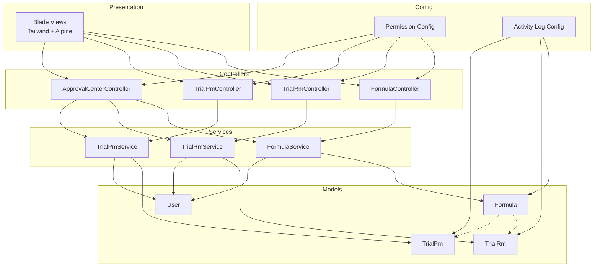
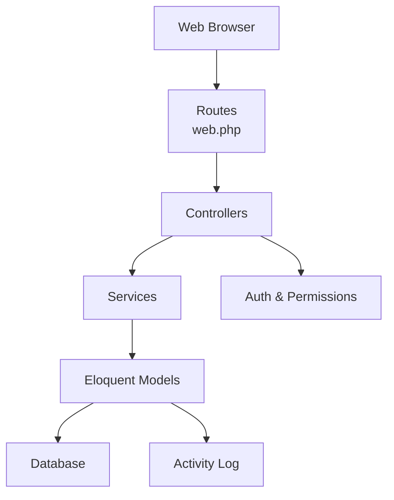
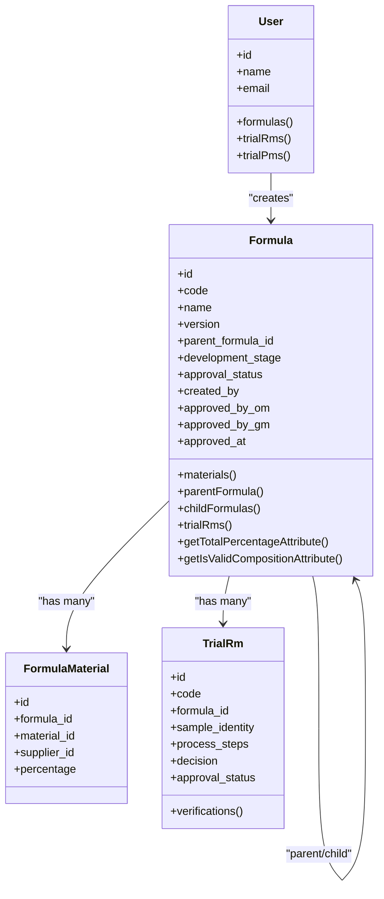
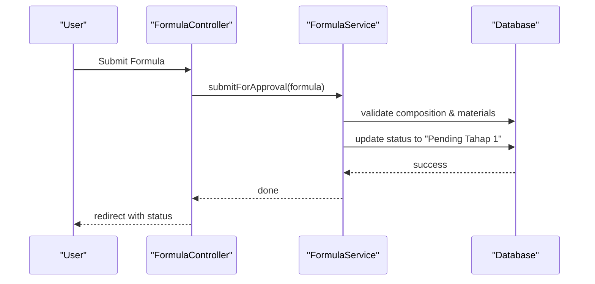
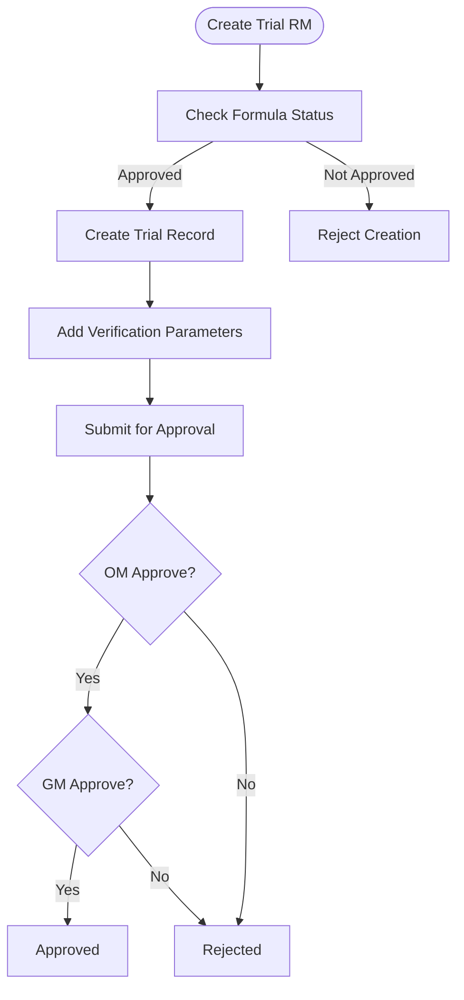
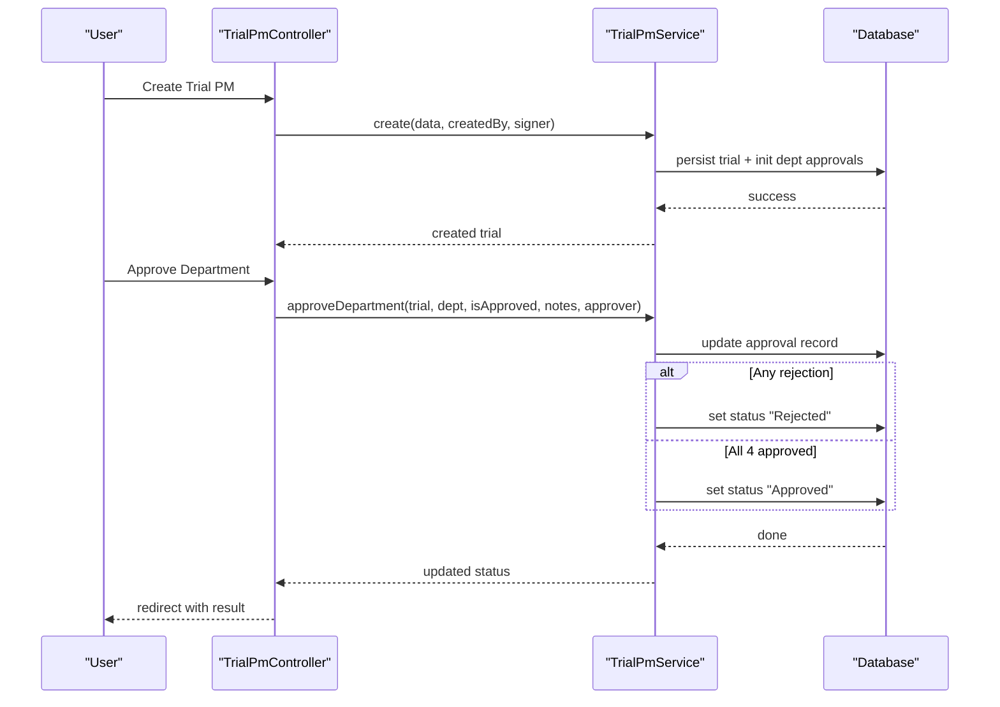
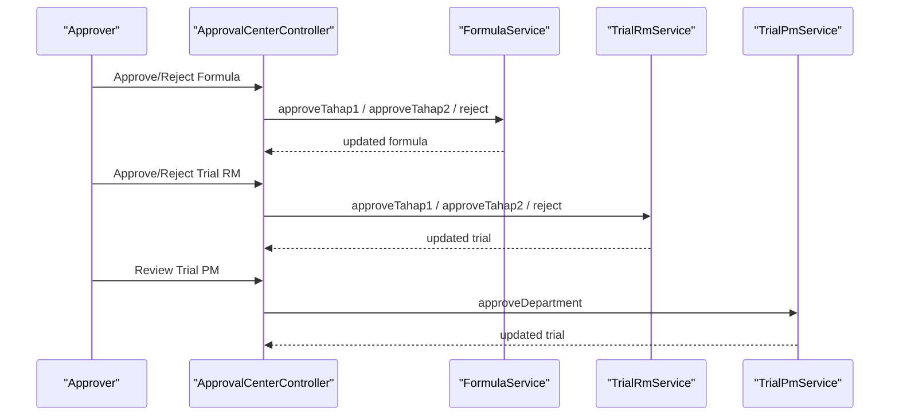
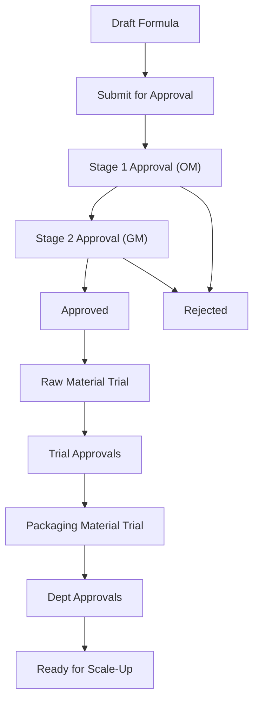
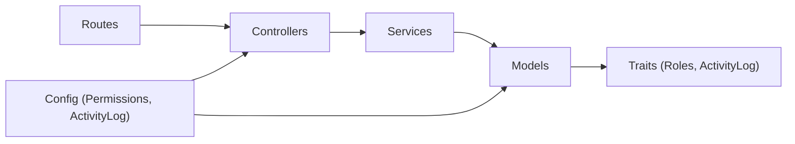

# Project Overview

<cite>
**Referenced Files in This Document**
- [README.md](file://README.md)
- [composer.json](file://composer.json)
- [package.json](file://package.json)
- [prd.md](file://prd.md)
- [routes/web.php](file://routes/web.php)
- [app/Models/User.php](file://app/Models/User.php)
- [app/Models/Formula.php](file://app/Models/Formula.php)
- [app/Models/TrialRm.php](file://app/Models/TrialRm.php)
- [app/Models/TrialPm.php](file://app/Models/TrialPm.php)
- [app/Services/FormulationService.php](file://app/Services/FormulationService.php)
- [app/Services/TrialRmService.php](file://app/Services/TrialRmService.php)
- [app/Services/TrialPmService.php](file://app/Services/TrialPmService.php)
- [config/activitylog.php](file://config/activitylog.php)
- [config/permission.php](file://config/permission.php)
- [database/migrations/2026_07_01_092832_create_formulas_table.php](file://database/migrations/2026_07_01_092832_create_formulas_table.php)
</cite>

## Table of Contents
1. Introduction
2. Project Structure
3. Core Components
4. Architecture Overview
5. Detailed Component Analysis
6. Dependency Analysis
7. Performance Considerations
8. Troubleshooting Guide
9. Conclusion

## Introduction
This document provides a comprehensive overview of the R&D Management System designed for PT Herbatech Innopharma Industry. The system digitizes and automates pharmaceutical research and development workflows, focusing on:
- Raw material formula management with versioning and composition validation
- Raw material trial execution and verification
- Packaging material trials with multi-department approvals
- Multi-level approval workflows (Staff R&D → Operational Manager → General Manager)
- Audit trail compliance for traceability and accountability

Target audience includes:
- R&D Staff: initiate drafts, execute trials, record observations
- Operational Managers: technical evaluation and first-stage approvals
- General Managers: final approvals and strategic decisions
- Superadmins: user and system configuration management

Key business value propositions:
- Improved efficiency and accuracy across formulation and trial processes
- End-to-end traceability via structured audit trails
- Controlled change management through formula versioning
- Cross-functional collaboration with departmental approvals for packaging trials
- Compliance-ready documentation and records

Pharmaceutical industry context addressed:
- Strict control over formulations and changes
- Robust approval gates to ensure quality and safety
- Traceable records for regulatory readiness
- Standardized trial documentation and decision-making

[No sources needed since this section summarizes without analyzing specific files]

## Project Structure
The application follows Laravel’s MVC architecture with clear separation of concerns:
- Controllers handle HTTP requests and orchestrate services
- Services encapsulate business logic and workflow rules
- Models represent domain entities and relationships
- Views render Blade templates with Tailwind CSS and Alpine.js interactivity
- Routes define endpoints and middleware for authorization
- Configurations manage permissions and activity logging

**Diagram sources**
- [routes/web.php:1-94](file://routes/web.php#L1-L94)
- [app/Services/FormulationService.php:1-228](file://app/Services/FormulationService.php#L1-L228)
- [app/Services/TrialRmService.php:1-202](file://app/Services/TrialRmService.php#L1-L202)
- [app/Services/TrialPmService.php:1-204](file://app/Services/TrialPmService.php#L1-L204)
- [app/Models/User.php:1-50](file://app/Models/User.php#L1-L50)
- [app/Models/Formula.php:1-89](file://app/Models/Formula.php#L1-L89)
- [app/Models/TrialRm.php:1-64](file://app/Models/TrialRm.php#L1-L64)
- [app/Models/TrialPm.php:1-82](file://app/Models/TrialPm.php#L1-L82)
- [config/permission.php:1-220](file://config/permission.php#L1-L220)
- [config/activitylog.php:1-53](file://config/activitylog.php#L1-L53)

**Section sources**
- [routes/web.php:1-94](file://routes/web.php#L1-L94)
- [composer.json:1-96](file://composer.json#L1-L96)
- [package.json:1-24](file://package.json#L1-L24)

## Core Components
- Formula Management
  - Versioned formulas with parent-child relationships for reformulation
  - Composition validation ensuring total percentage equals 100%
  - Approval workflow states: Draft → Pending Tahap 1 → Pending Tahap 2 → Approved or Rejected
- Raw Material Trials
  - Trial records linked to approved formulas
  - Verification parameters with target vs actual values
  - Two-stage approvals mirroring formula workflow
- Packaging Material Trials
  - Multi-department approvals (R&D, QC, Production, Engineering)
  - Digital signature paraf metadata for execution records
  - Automatic status transitions when all departments approve
- User and Roles
  - Role-based access control for routes and actions
  - Users associated as creators and approvers
- Audit Trail
  - Activity logging for key fields and state changes
  - Configurable retention and table settings

**Section sources**
- [app/Models/Formula.php:1-89](file://app/Models/Formula.php#L1-L89)
- [app/Models/TrialRm.php:1-64](file://app/Models/TrialRm.php#L1-L64)
- [app/Models/TrialPm.php:1-82](file://app/Models/TrialPm.php#L1-L82)
- [app/Models/User.php:1-50](file://app/Models/User.php#L1-L50)
- [config/activitylog.php:1-53](file://config/activitylog.php#L1-L53)
- [config/permission.php:1-220](file://config/permission.php#L1-L220)

## Architecture Overview
High-level architecture aligns with Laravel MVC:
- Presentation layer uses Blade views styled with Tailwind CSS and enhanced by Alpine.js
- Routing defines protected endpoints with role and permission checks
- Controllers delegate to service classes that enforce business rules
- Eloquent models capture domain data and relationships
- Configuration manages RBAC and audit logging

Technology stack summary:
- PHP 8.3+
- Laravel framework
- Tailwind CSS
- Alpine.js
- Spatie Permission for RBAC
- Spatie Activitylog for audit trails

**Diagram sources**
- [routes/web.php:1-94](file://routes/web.php#L1-L94)
- [config/permission.php:1-220](file://config/permission.php#L1-L220)
- [config/activitylog.php:1-53](file://config/activitylog.php#L1-L53)

**Section sources**
- [composer.json:1-96](file://composer.json#L1-L96)
- [package.json:1-24](file://package.json#L1-L24)
- [README.md:1-59](file://README.md#L1-L59)

## Detailed Component Analysis

### Formula Management
- Purpose: Central module for recording and developing raw material formulas
- Key behaviors:
  - Auto-generate unique codes per month sequence
  - Validate composition totals before submission
  - Enforce approval gates and allow reformulation into new versions
  - Maintain parent-child links for version history

**Diagram sources**
- [app/Models/User.php:1-50](file://app/Models/User.php#L1-L50)
- [app/Models/Formula.php:1-89](file://app/Models/Formula.php#L1-L89)
- [app/Models/TrialRm.php:1-64](file://app/Models/TrialRm.php#L1-L64)
- [database/migrations/2026_07_01_092832_create_formulas_table.php:1-39](file://database/migrations/2026_07_01_092832_create_formulas_table.php#L1-L39)

**Section sources**
- [app/Services/FormulationService.php:1-228](file://app/Services/FormulationService.php#L1-L228)
- [app/Models/Formula.php:1-89](file://app/Models/Formula.php#L1-L89)
- [database/migrations/2026_07_01_092832_create_formulas_table.php:1-39](file://database/migrations/2026_07_01_092832_create_formulas_table.php#L1-L39)

#### Formula Submission Flow

**Diagram sources**
- [routes/web.php:33-40](file://routes/web.php#L33-L40)
- [app/Services/FormulationService.php:77-98](file://app/Services/FormulationService.php#L77-L98)

### Raw Material Trials
- Purpose: Execute and verify trials against approved formulas
- Key behaviors:
  - Generate unique trial codes with suffix increments for repeated trials
  - Require at least one verification parameter before submission
  - Two-stage approvals mirroring formula workflow

**Diagram sources**
- [app/Services/TrialRmService.php:55-81](file://app/Services/TrialRmService.php#L55-L81)
- [app/Services/TrialRmService.php:110-125](file://app/Services/TrialRmService.php#L110-L125)
- [app/Services/TrialRmService.php:130-142](file://app/Services/TrialRmService.php#L130-L142)
- [app/Services/TrialRmService.php:147-160](file://app/Services/TrialRmService.php#L147-L160)

**Section sources**
- [app/Services/TrialRmService.php:1-202](file://app/Services/TrialRmService.php#L1-L202)
- [app/Models/TrialRm.php:1-64](file://app/Models/TrialRm.php#L1-L64)

### Packaging Material Trials
- Purpose: Evaluate packaging materials with cross-department approvals
- Key behaviors:
  - Initialize four department approvals upon creation
  - Capture digital signature metadata when paraf is signed
  - Auto-approve when all departments approve; reject if any department rejects

**Diagram sources**
- [app/Services/TrialPmService.php:36-73](file://app/Services/TrialPmService.php#L36-L73)
- [app/Services/TrialPmService.php:161-202](file://app/Services/TrialPmService.php#L161-L202)

**Section sources**
- [app/Services/TrialPmService.php:1-204](file://app/Services/TrialPmService.php#L1-L204)
- [app/Models/TrialPm.php:1-82](file://app/Models/TrialPm.php#L1-L82)

### Approval Center
- Purpose: Centralized hub for evaluators and approvers to review and act on pending items
- Key behaviors:
  - Access controlled by permissions
  - Actions include approve/reject for formulas and trials
  - Updates statuses and captures approver information

**Diagram sources**
- [routes/web.php:64-79](file://routes/web.php#L64-L79)
- [app/Services/FormulationService.php:103-150](file://app/Services/FormulationService.php#L103-L150)
- [app/Services/TrialRmService.php:130-177](file://app/Services/TrialRmService.php#L130-L177)
- [app/Services/TrialPmService.php:161-202](file://app/Services/TrialPmService.php#L161-L202)

**Section sources**
- [routes/web.php:64-79](file://routes/web.php#L64-L79)

### Conceptual Overview
Conceptual workflow for R&D lifecycle:
- Draft formulation → submit for evaluation → two-stage approvals → approved or rejected
- Approved formula enables trial execution → verification → approvals
- Packaging trials require multi-department consensus before proceeding

[No sources needed since this diagram shows conceptual workflow, not actual code structure]

## Dependency Analysis
Component dependencies and relationships:
- Controllers depend on services for business logic
- Services depend on models for persistence and relationships
- Models use traits for roles and activity logging
- Routes apply middleware for authentication, verification, roles, and permissions
- Configurations provide RBAC and audit logging behavior

**Diagram sources**
- [routes/web.php:1-94](file://routes/web.php#L1-L94)
- [config/permission.php:1-220](file://config/permission.php#L1-L220)
- [config/activitylog.php:1-53](file://config/activitylog.php#L1-L53)

**Section sources**
- [routes/web.php:1-94](file://routes/web.php#L1-L94)
- [config/permission.php:1-220](file://config/permission.php#L1-L220)
- [config/activitylog.php:1-53](file://config/activitylog.php#L1-L53)

## Performance Considerations
- Use database transactions in services to ensure consistency during multi-table updates
- Avoid N+1 queries by eager loading related data in controllers where necessary
- Cache frequently accessed reference data (e.g., materials, suppliers) using Laravel cache
- Optimize activity log retention settings to balance compliance and storage costs
- Minimize heavy computations in views; precompute derived attributes in models or services

[No sources needed since this section provides general guidance]

## Troubleshooting Guide
Common issues and resolutions:
- Validation errors during submission
  - Ensure composition totals are within acceptable tolerance
  - Verify required materials and verification parameters are present
- Approval state mismatches
  - Confirm current status allows the requested action
  - Check approver IDs and timestamps are correctly recorded
- Permission denied
  - Verify user roles and assigned permissions
  - Inspect route middleware and policy checks
- Audit trail gaps
  - Confirm activity logging is enabled and configured
  - Validate model log options and dirty field tracking

**Section sources**
- [app/Services/FormulationService.php:77-98](file://app/Services/FormulationService.php#L77-L98)
- [app/Services/TrialRmService.php:110-125](file://app/Services/TrialRmService.php#L110-L125)
- [config/activitylog.php:1-53](file://config/activitylog.php#L1-L53)
- [config/permission.php:1-220](file://config/permission.php#L1-L220)

## Conclusion
The R&D Management System delivers a robust, compliant platform tailored for pharmaceutical research and development at PT Herbatech Innopharma Industry. By enforcing strict workflows, maintaining detailed audit trails, and enabling cross-functional collaboration, it enhances operational efficiency and regulatory readiness. The Laravel-based architecture ensures maintainability, scalability, and a modern user experience.

[No sources needed since this section summarizes without analyzing specific files]