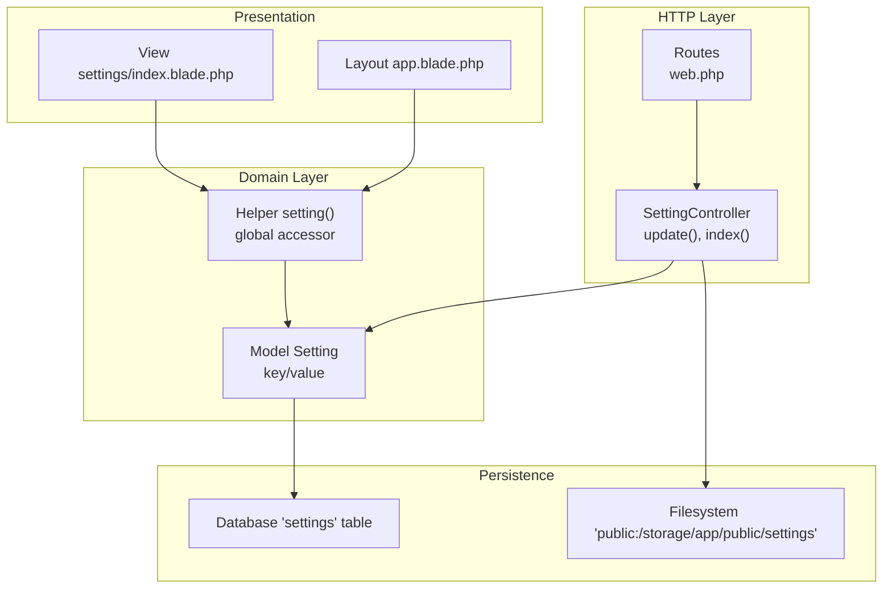
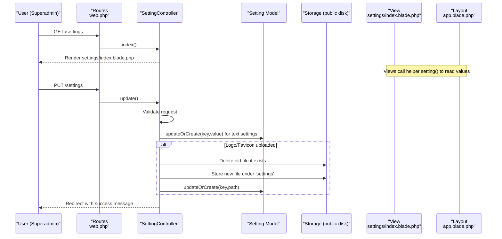
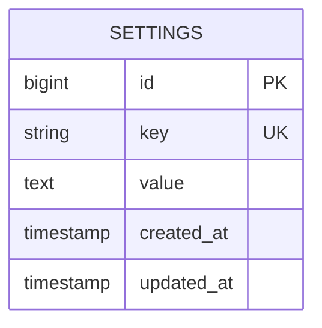
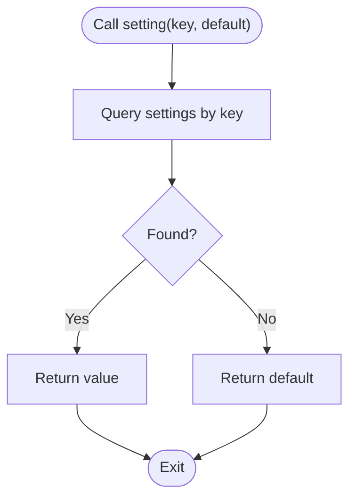
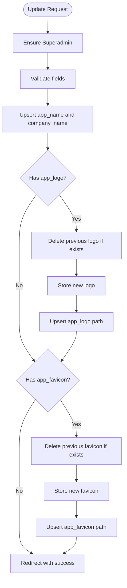
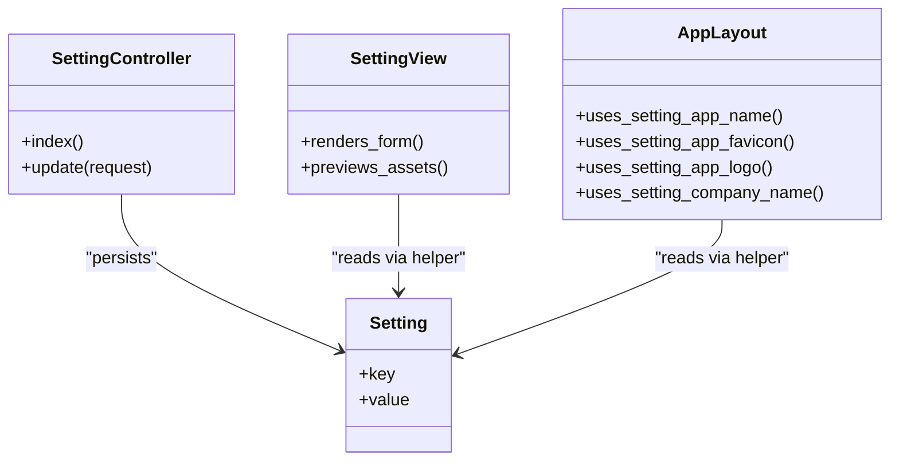
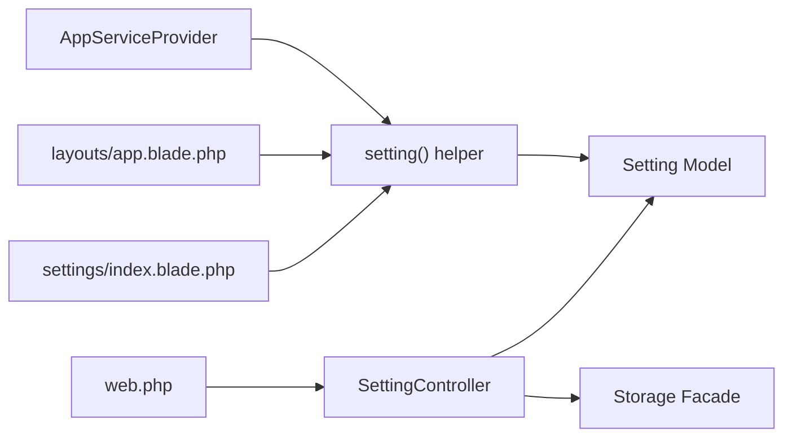

# System Settings

<cite>
**Referenced Files in This Document**
- [Setting.php](file://app/Models/Setting.php)
- [SettingController.php](file://app/Http/Controllers/SettingController.php)
- [index.blade.php](file://resources/views/settings/index.blade.php)
- [2026_07_02_000000_create_settings_table.php](file://database/migrations/2026_07_02_000000_create_settings_table.php)
- [setting.php](file://app/Helpers/setting.php)
- [web.php](file://routes/web.php)
- [AppServiceProvider.php](file://app/Providers/AppServiceProvider.php)
- [app.blade.php](file://resources/views/layouts/app.blade.php)
- [SuperadminSystemTest.php](file://tests/Feature/SuperadminSystemTest.php)
</cite>

## Table of Contents
1. [Introduction](#introduction)
2. [Project Structure](#project-structure)
3. [Core Components](#core-components)
4. [Architecture Overview](#architecture-overview)
5. [Detailed Component Analysis](#detailed-component-analysis)
6. [Dependency Analysis](#dependency-analysis)
7. [Performance Considerations](#performance-considerations)
8. [Troubleshooting Guide](#troubleshooting-guide)
9. [Conclusion](#conclusion)
10. [Appendices](#appendices)

## Introduction
This document explains the System Settings module, which provides an interface for configuring application identity and branding (application name, company name, logo, favicon). It covers the data model, persistence strategy, access control, validation rules, usage across views, and guidance for extending settings with new keys.

## Project Structure
The System Settings feature is implemented as a small set of components:
- A database migration to store key-value settings
- An Eloquent model for settings
- A helper function to read settings globally
- A controller to handle authorization, validation, and updates
- A Blade view for editing settings
- Routes protected by role middleware
- Layout templates that consume settings to render UI branding

**Diagram sources**
- [web.php:84-86](file://routes/web.php#L84-L86)
- [SettingController.php:10-58](file://app/Http/Controllers/SettingController.php#L10-L58)
- [Setting.php:7-10](file://app/Models/Setting.php#L7-L10)
- [setting.php:3-12](file://app/Helpers/setting.php#L3-L12)
- [index.blade.php:39-116](file://resources/views/settings/index.blade.php#L39-L116)
- [app.blade.php:7-19](file://resources/views/layouts/app.blade.php#L7-L19)
- [2026_07_02_000000_create_settings_table.php:14-19](file://database/migrations/2026_07_02_000000_create_settings_table.php#L14-L19)

**Section sources**
- [web.php:84-86](file://routes/web.php#L84-L86)
- [SettingController.php:10-58](file://app/Http/Controllers/SettingController.php#L10-L58)
- [Setting.php:7-10](file://app/Models/Setting.php#L7-L10)
- [setting.php:3-12](file://app/Helpers/setting.php#L3-L12)
- [index.blade.php:39-116](file://resources/views/settings/index.blade.php#L39-L116)
- [app.blade.php:7-19](file://resources/views/layouts/app.blade.php#L7-L19)
- [2026_07_02_000000_create_settings_table.php:14-19](file://database/migrations/2026_07_02_000000_create_settings_table.php#L14-L19)

## Core Components
- Data Model: A simple key-value configuration entity stored in the settings table.
- Helper Accessor: A global helper function to retrieve settings anywhere in the application.
- Controller: Authorizes Superadmin users, validates inputs, persists text settings, and manages uploaded assets.
- View: Presents editable fields and previews for current assets.
- Routes: Expose GET and PUT endpoints protected by role middleware.
- Layout Integration: The main layout consumes settings to render page title, favicon, sidebar logo, and header text.

Key responsibilities:
- Authorization: Only Superadmin can access or update settings.
- Validation: Enforces required strings and image constraints.
- Persistence: Text values are stored in the database; images are stored on the filesystem and paths saved in the database.
- Consumption: Views use the helper to display dynamic branding.

**Section sources**
- [Setting.php:7-10](file://app/Models/Setting.php#L7-L10)
- [setting.php:3-12](file://app/Helpers/setting.php#L3-L12)
- [SettingController.php:10-58](file://app/Http/Controllers/SettingController.php#L10-L58)
- [index.blade.php:39-116](file://resources/views/settings/index.blade.php#L39-L116)
- [web.php:84-86](file://routes/web.php#L84-L86)
- [app.blade.php:7-19](file://resources/views/layouts/app.blade.php#L7-L19)

## Architecture Overview
The System Settings flow spans HTTP requests, authorization checks, validation, storage, and rendering.

**Diagram sources**
- [web.php:84-86](file://routes/web.php#L84-L86)
- [SettingController.php:20-58](file://app/Http/Controllers/SettingController.php#L20-L58)
- [Setting.php:7-10](file://app/Models/Setting.php#L7-L10)
- [index.blade.php:39-116](file://resources/views/settings/index.blade.php#L39-L116)
- [app.blade.php:7-19](file://resources/views/layouts/app.blade.php#L7-L19)

## Detailed Component Analysis

### Data Model and Storage
- Database schema: A single table with id, unique key, nullable value, and timestamps.
- Eloquent model: Uses fillable for key and value.
- File storage: Uploaded images are stored on the public disk under a dedicated directory; only the path is persisted in the database.

**Diagram sources**
- [2026_07_02_000000_create_settings_table.php:14-19](file://database/migrations/2026_07_02_000000_create_settings_table.php#L14-L19)

**Section sources**
- [2026_07_02_000000_create_settings_table.php:14-19](file://database/migrations/2026_07_02_000000_create_settings_table.php#L14-L19)
- [Setting.php:7-10](file://app/Models/Setting.php#L7-L10)

### Global Settings Accessor
A global helper function reads a setting by key and returns a default when not found. It is autoloaded via the service provider so it is available everywhere.

**Diagram sources**
- [setting.php:3-12](file://app/Helpers/setting.php#L3-L12)
- [AppServiceProvider.php:24-25](file://app/Providers/AppServiceProvider.php#L24-L25)

**Section sources**
- [setting.php:3-12](file://app/Helpers/setting.php#L3-L12)
- [AppServiceProvider.php:24-25](file://app/Providers/AppServiceProvider.php#L24-L25)

### Controller Logic and Validation
- Authorization: Both index and update enforce Superadmin role.
- Validation:
  - app_name: required, string, max length
  - company_name: required, string, max length
  - app_logo: optional, must be an image, allowed types, size limit
  - app_favicon: optional, must be an image, allowed types including ICO, size limit
- Persistence:
  - Text settings are upserted using key-based records.
  - For uploads, existing files are deleted before storing new ones; then the new path is saved.

**Diagram sources**
- [SettingController.php:20-58](file://app/Http/Controllers/SettingController.php#L20-L58)

**Section sources**
- [SettingController.php:10-58](file://app/Http/Controllers/SettingController.php#L10-L58)

### User Interface and Branding Usage
- Settings form: Displays current values and previews for logo and favicon.
- Layout integration:
  - Page title uses app_name with a fallback.
  - Favicon link uses app_favicon with a fallback SVG icon.
  - Sidebar shows app_logo and displays app_name and company_name.

**Diagram sources**
- [SettingController.php:10-58](file://app/Http/Controllers/SettingController.php#L10-L58)
- [index.blade.php:39-116](file://resources/views/settings/index.blade.php#L39-L116)
- [app.blade.php:7-19](file://resources/views/layouts/app.blade.php#L7-L19)

**Section sources**
- [index.blade.php:39-116](file://resources/views/settings/index.blade.php#L39-L116)
- [app.blade.php:7-19](file://resources/views/layouts/app.blade.php#L7-L19)

### Configuration Categories and Keys
Current supported settings:
- Identity and branding:
  - app_name: Application name displayed in browser tab and sidebar header
  - company_name: Company/Institution name shown in sidebar header
  - app_logo: Path to the sidebar logo image
  - app_favicon: Path to the browser favicon image

These keys are validated and persisted through the controller and consumed via the helper in views.

**Section sources**
- [SettingController.php:26-55](file://app/Http/Controllers/SettingController.php#L26-L55)
- [index.blade.php:47-107](file://resources/views/settings/index.blade.php#L47-L107)
- [app.blade.php:7-19](file://resources/views/layouts/app.blade.php#L7-L19)

### Security Considerations
- Role-based access: Both listing and updating settings require the Superadmin role.
- Input validation: String lengths and image type/size constraints protect against malformed input.
- File handling: Existing files are deleted before saving new uploads to avoid orphaned assets.
- Asset exposure: Paths are served from the public disk; ensure only trusted users can upload files.

**Section sources**
- [web.php:84-86](file://routes/web.php#L84-L86)
- [SettingController.php:10-58](file://app/Http/Controllers/SettingController.php#L10-L58)

## Dependency Analysis
- Routes depend on the controller and role middleware.
- Controller depends on the Setting model and Storage facade.
- Views depend on the global helper to read settings.
- Service provider ensures the helper is available globally.

**Diagram sources**
- [web.php:84-86](file://routes/web.php#L84-L86)
- [SettingController.php:10-58](file://app/Http/Controllers/SettingController.php#L10-L58)
- [setting.php:3-12](file://app/Helpers/setting.php#L3-L12)
- [AppServiceProvider.php:24-25](file://app/Providers/AppServiceProvider.php#L24-L25)
- [index.blade.php:39-116](file://resources/views/settings/index.blade.php#L39-L116)
- [app.blade.php:7-19](file://resources/views/layouts/app.blade.php#L7-L19)

**Section sources**
- [web.php:84-86](file://routes/web.php#L84-L86)
- [SettingController.php:10-58](file://app/Http/Controllers/SettingController.php#L10-L58)
- [setting.php:3-12](file://app/Helpers/setting.php#L3-L12)
- [AppServiceProvider.php:24-25](file://app/Providers/AppServiceProvider.php#L24-L25)

## Performance Considerations
- Each call to the helper performs a database query per key. If many settings are used frequently, consider caching them at boot time or implementing a lightweight cache layer around the helper.
- Image uploads should remain within the defined size limits to prevent large payloads and slow responses.
- Deleting old files before storing new ones avoids disk bloat but adds I/O; batch cleanup jobs may be useful if many changes occur.

[No sources needed since this section provides general guidance]

## Troubleshooting Guide
- 403 Forbidden on settings pages: Ensure the authenticated user has the Superadmin role.
- Images not appearing: Verify the public symlink exists and the path returned by the helper points to a valid file.
- Validation errors: Check field sizes and MIME types; ensure uploads match allowed formats and limits.
- Missing defaults: The helper returns provided defaults when keys are absent; confirm defaults in views.

**Section sources**
- [web.php:84-86](file://routes/web.php#L84-L86)
- [SettingController.php:26-55](file://app/Http/Controllers/SettingController.php#L26-L55)
- [setting.php:3-12](file://app/Helpers/setting.php#L3-L12)
- [index.blade.php:47-107](file://resources/views/settings/index.blade.php#L47-L107)
- [app.blade.php:7-19](file://resources/views/layouts/app.blade.php#L7-L19)

## Conclusion
The System Settings module provides a secure, extensible mechanism for managing application identity and branding. It uses a simple key-value store, robust validation, and clear separation between database and filesystem storage. The global helper makes reading settings straightforward across the application. Extending the module involves adding new keys, updating validation and persistence logic, and consuming the helper in relevant views.

[No sources needed since this section summarizes without analyzing specific files]

## Appendices

### Practical Examples

- Add a new text setting:
  - Define a new key and add validation in the controller’s update method.
  - Persist the value using the same upsert pattern.
  - Display the value in views using the helper with a sensible default.

- Update an existing setting:
  - Submit the updated value via the settings form or programmatically.
  - The controller will upsert the record by key.

- Access settings in controllers and views:
  - Use the global helper to fetch values by key.
  - Provide defaults to ensure graceful degradation when keys are missing.

- Backup considerations:
  - Back up both the database (for key-value pairs) and the public storage directory (for uploaded assets).
  - Ensure consistent snapshots to keep paths aligned with actual files.

**Section sources**
- [SettingController.php:26-55](file://app/Http/Controllers/SettingController.php#L26-L55)
- [setting.php:3-12](file://app/Helpers/setting.php#L3-L12)
- [index.blade.php:47-107](file://resources/views/settings/index.blade.php#L47-L107)
- [app.blade.php:7-19](file://resources/views/layouts/app.blade.php#L7-L19)

### Tests and Expected Behavior
- Superadmin can access and update settings.
- Non-Superadmin users receive a 403 response.
- After update, the helper returns the newly saved values.

**Section sources**
- [SuperadminSystemTest.php:36-58](file://tests/Feature/SuperadminSystemTest.php#L36-L58)