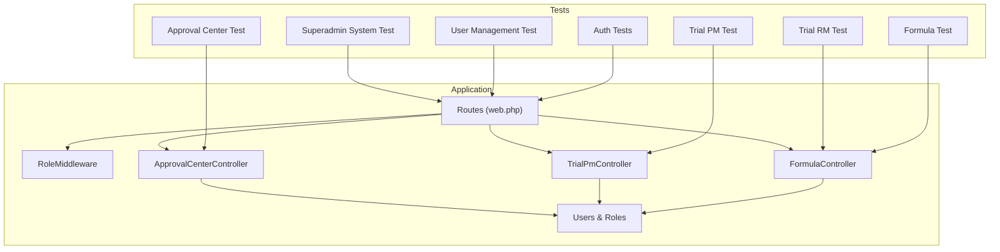
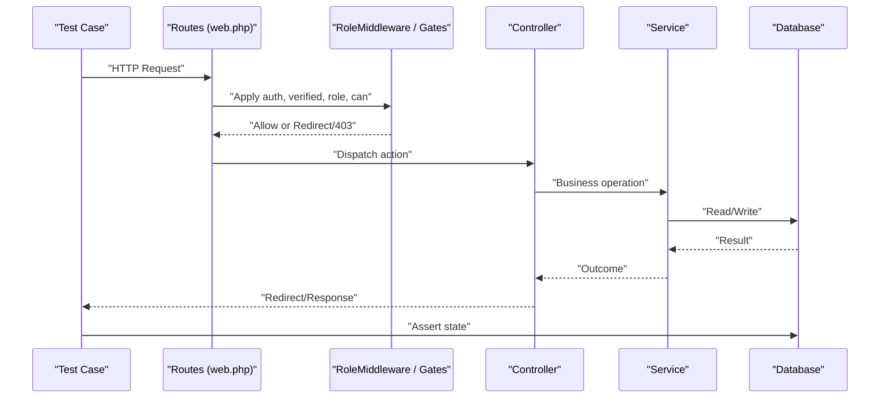
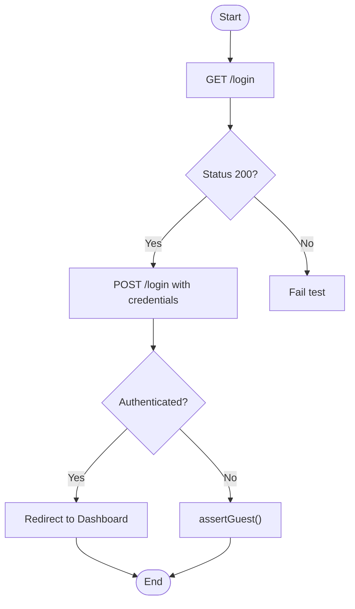
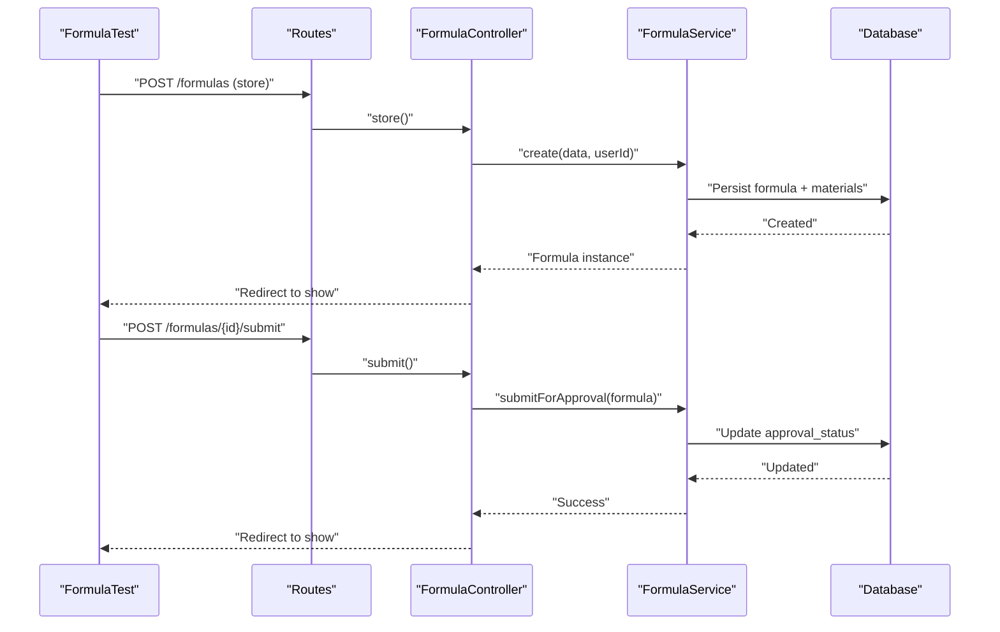
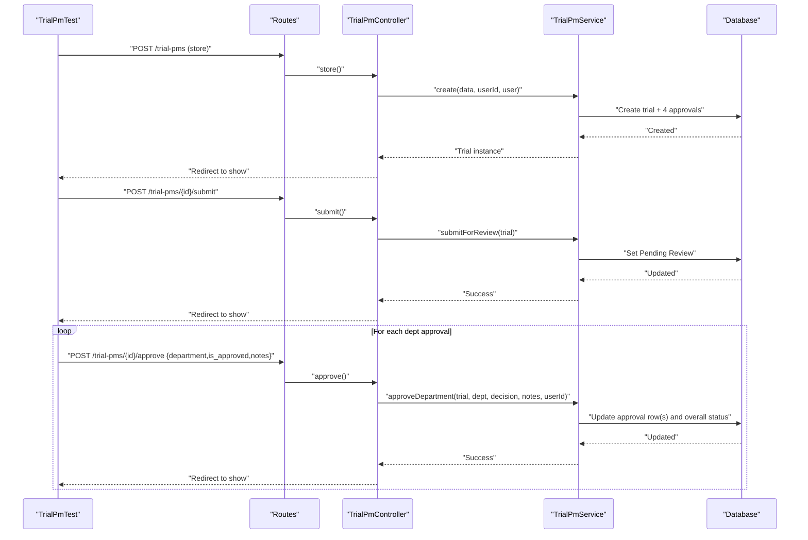
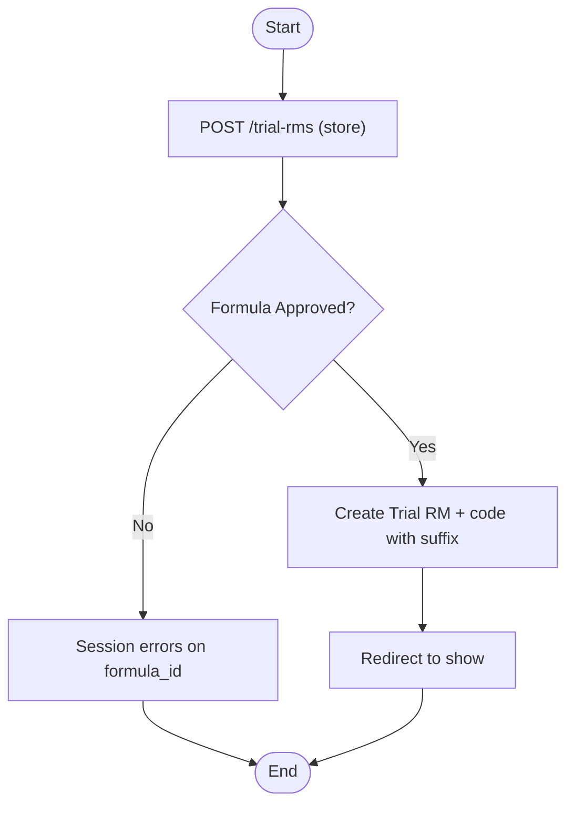
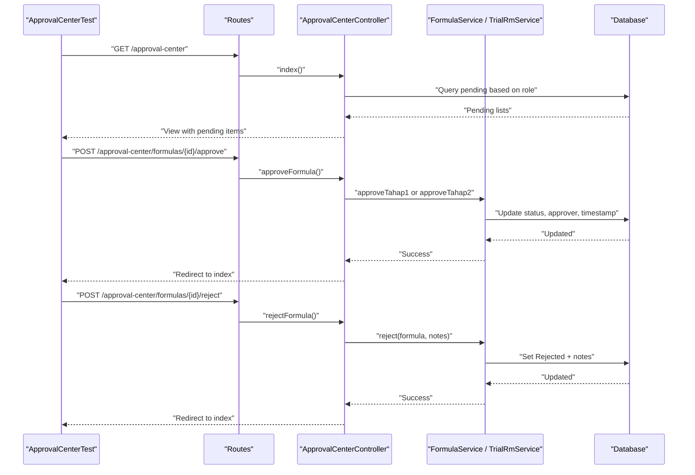
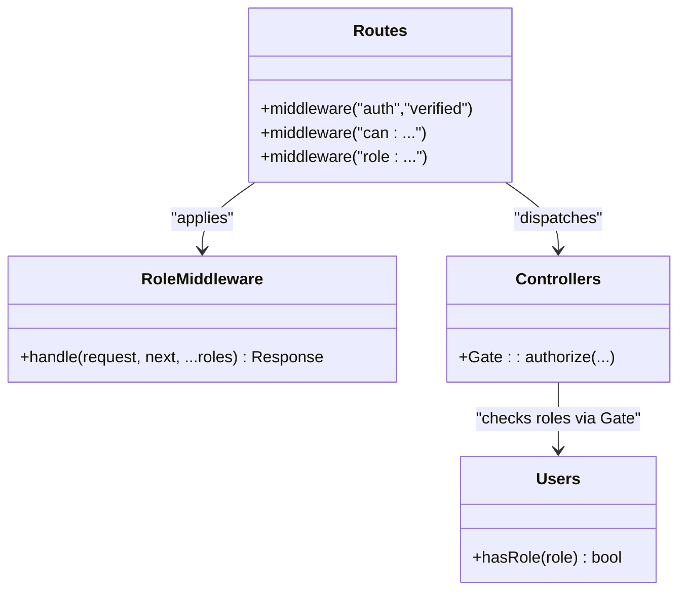
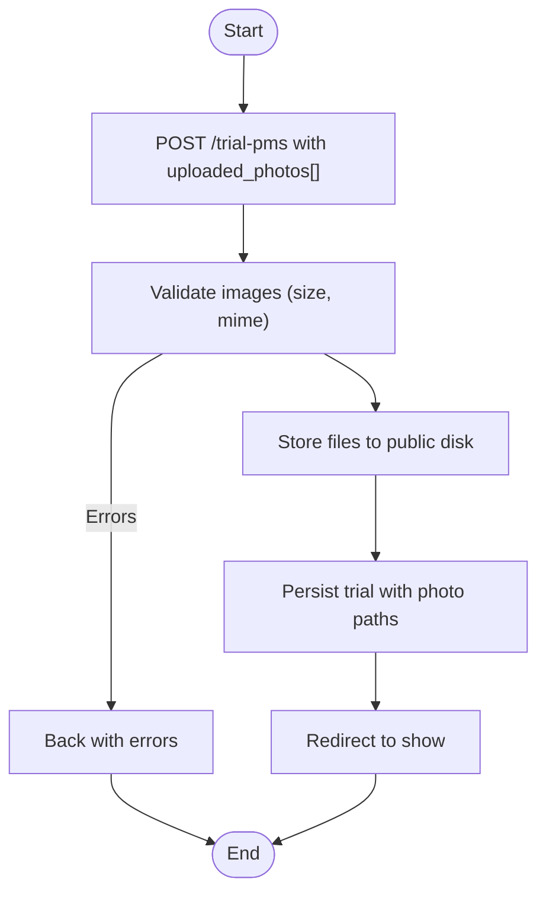
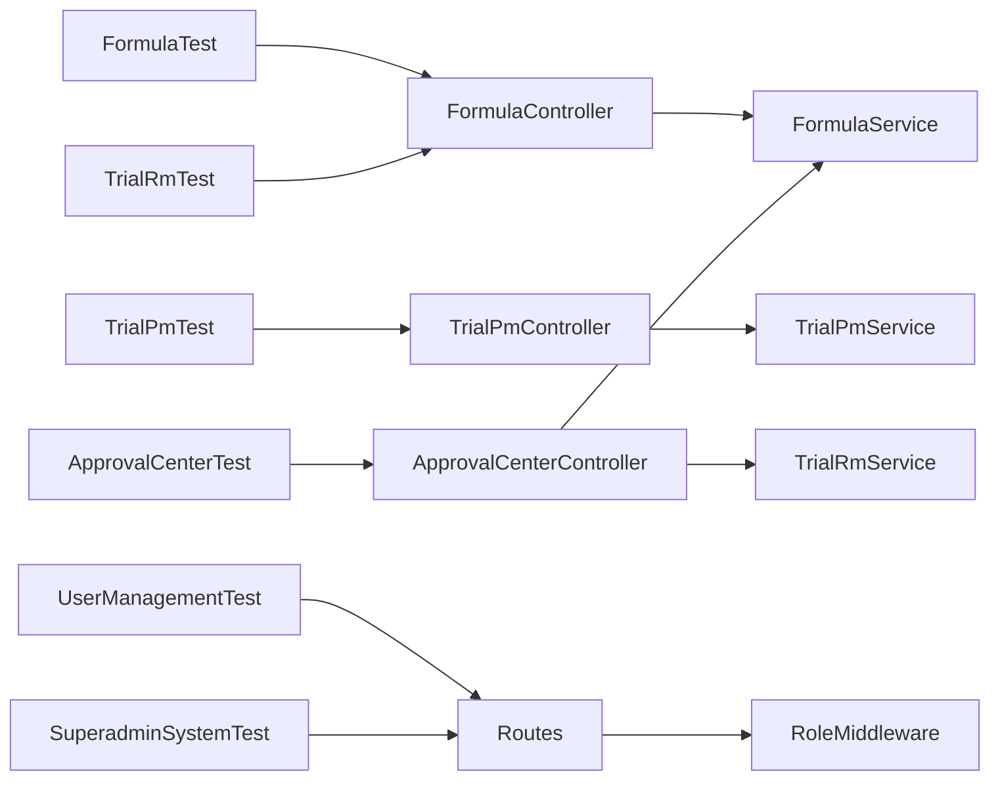

# Feature Testing

<cite>
**Referenced Files in This Document**
- [AuthenticationTest.php](file://tests/Feature/Auth/AuthenticationTest.php)
- [FormulaTest.php](file://tests/Feature/FormulaTest.php)
- [TrialPmTest.php](file://tests/Feature/TrialPmTest.php)
- [TrialRmTest.php](file://tests/Feature/TrialRmTest.php)
- [ApprovalCenterTest.php](file://tests/Feature/ApprovalCenterTest.php)
- [UserManagementTest.php](file://tests/Feature/UserManagementTest.php)
- [SuperadminSystemTest.php](file://tests/Feature/SuperadminSystemTest.php)
- [RoleMiddleware.php](file://app/Http/Middleware/RoleMiddleware.php)
- [web.php](file://routes/web.php)
- [auth.php](file://config/auth.php)
- [FormulaController.php](file://app/Http/Controllers/FormulaController.php)
- [TrialPmController.php](file://app/Http/Controllers/TrialPmController.php)
- [ApprovalCenterController.php](file://app/Http/Controllers/ApprovalCenterController.php)
- [UserFactory.php](file://database/factories/UserFactory.php)
</cite>

## Table of Contents
1. Introduction
2. Project Structure
3. Core Components
4. Architecture Overview
5. Detailed Component Analysis
6. Dependency Analysis
7. Performance Considerations
8. Troubleshooting Guide
9. Conclusion

## Introduction
This document provides comprehensive feature testing guidance for end-to-end user workflows in the application. It focuses on:
- Authentication flows and session handling
- Formula creation, submission, and reformulation
- Trial management (RM and PM), including multi-department approvals
- Approval center operations with role-based access control
- Controller testing using HTTP requests, response assertions, and status code verification
- Middleware functionality and route protection
- Complex business scenarios such as multi-step approvals, file uploads, and form submissions
- API endpoint testing strategies, database state verification, and best practices

The goal is to help you design robust tests that validate complete user journeys across roles and states while ensuring reliability and maintainability.

## Project Structure
The test suite is organized under tests/Feature by domain areas:
- Auth: authentication and logout flows
- FormulaTest: formula lifecycle and validation
- TrialPmTest: packaging material trial workflow and department approvals
- TrialRmTest: raw material trial workflow tied to approved formulas
- ApprovalCenterTest: two-stage approval process for formulas and trials
- UserManagementTest and SuperadminSystemTest: RBAC and data master CRUD

Key application components involved in these flows include controllers, middleware, routes, configuration, and factories.

**Diagram sources**
- [web.php:23-91](file://routes/web.php#L23-L91)
- [RoleMiddleware.php:16-33](file://app/Http/Middleware/RoleMiddleware.php#L16-L33)
- [FormulaController.php:72-94](file://app/Http/Controllers/FormulaController.php#L72-L94)
- [TrialPmController.php:55-109](file://app/Http/Controllers/TrialPmController.php#L55-L109)
- [ApprovalCenterController.php:23-61](file://app/Http/Controllers/ApprovalCenterController.php#L23-L61)

**Section sources**
- [web.php:23-91](file://routes/web.php#L23-L91)
- [RoleMiddleware.php:16-33](file://app/Http/Middleware/RoleMiddleware.php#L16-L33)

## Core Components
- Authentication and Session Guard
  - Uses session guard and Eloquent provider configured in auth config.
  - Tests assert login, logout, and guest state transitions.
- Role-Based Access Control
  - Route-level protection via can gates and role middleware.
  - Tests verify 403 responses for unauthorized roles and success for authorized roles.
- Controllers and Services
  - Controllers orchestrate validation, authorization, and service calls.
  - Services encapsulate complex business logic (e.g., approvals, versioning).
- Factories and Database Refresh
  - Tests use factories to create users and related entities.
  - RefreshDatabase ensures isolation between tests.

**Section sources**
- [auth.php:40-74](file://config/auth.php#L40-L74)
- [AuthenticationTest.php:20-53](file://tests/Feature/Auth/AuthenticationTest.php#L20-L53)
- [UserFactory.php:25-34](file://database/factories/UserFactory.php#L25-L34)
- [FormulaController.php:72-94](file://app/Http/Controllers/FormulaController.php#L72-L94)
- [TrialPmController.php:55-109](file://app/Http/Controllers/TrialPmController.php#L55-L109)
- [ApprovalCenterController.php:23-61](file://app/Http/Controllers/ApprovalCenterController.php#L23-L61)

## Architecture Overview
End-to-end feature tests simulate real HTTP requests through the routing layer, which applies middleware and gates before invoking controller actions. Business rules are delegated to services, and outcomes are asserted against both HTTP responses and database state.

**Diagram sources**
- [web.php:23-91](file://routes/web.php#L23-L91)
- [RoleMiddleware.php:16-33](file://app/Http/Middleware/RoleMiddleware.php#L16-L33)
- [FormulaController.php:72-94](file://app/Http/Controllers/FormulaController.php#L72-L94)
- [TrialPmController.php:55-109](file://app/Http/Controllers/TrialPmController.php#L55-L109)
- [ApprovalCenterController.php:23-61](file://app/Http/Controllers/ApprovalCenterController.php#L23-L61)

## Detailed Component Analysis

### Authentication Flows
- Login screen rendering and successful login redirect to dashboard.
- Invalid password prevents authentication; user remains a guest.
- Logout clears session and redirects appropriately.
- Assertions cover status codes, redirects, and authenticated/guest state.

**Diagram sources**
- [AuthenticationTest.php:13-53](file://tests/Feature/Auth/AuthenticationTest.php#L13-L53)
- [auth.php:40-74](file://config/auth.php#L40-L74)

**Section sources**
- [AuthenticationTest.php:13-53](file://tests/Feature/Auth/AuthenticationTest.php#L13-L53)
- [auth.php:40-74](file://config/auth.php#L40-L74)

### Formula Creation and Submission Workflow
- Staff creates a formula draft with materials and percentages.
- Validation enforces percentage bounds and composition totals.
- Submitting a formula with exactly 100% advances status to first pending stage.
- Managers cannot edit drafts; only creators or authorized roles can.
- Reformulation duplicates an approved formula into a new version linked to the parent.

**Diagram sources**
- [FormulaTest.php:58-149](file://tests/Feature/FormulaTest.php#L58-L149)
- [FormulaController.php:72-94](file://app/Http/Controllers/FormulaController.php#L72-L94)
- [FormulaController.php:168-181](file://app/Http/Controllers/FormulaController.php#L168-L181)

**Section sources**
- [FormulaTest.php:58-195](file://tests/Feature/FormulaTest.php#L58-L195)
- [FormulaController.php:72-94](file://app/Http/Controllers/FormulaController.php#L72-L94)
- [FormulaController.php:168-181](file://app/Http/Controllers/FormulaController.php#L168-L181)

### Trial PM Multi-Department Approval Process
- Staff creates a Trial PM; system initializes four department approvals (RD, QC, Production, Engineering).
- Submitting moves status to Pending Review.
- Approvals from all departments auto-promote to Approved; any rejection sets Rejected with notes.
- Tests assert counts, statuses, timestamps, and rejection notes.

**Diagram sources**
- [TrialPmTest.php:33-148](file://tests/Feature/TrialPmTest.php#L33-L148)
- [TrialPmController.php:55-109](file://app/Http/Controllers/TrialPmController.php#L55-L109)
- [TrialPmController.php:221-265](file://app/Http/Controllers/TrialPmController.php#L221-L265)

**Section sources**
- [TrialPmTest.php:33-148](file://tests/Feature/TrialPmTest.php#L33-L148)
- [TrialPmController.php:55-109](file://app/Http/Controllers/TrialPmController.php#L55-L109)
- [TrialPmController.php:221-265](file://app/Http/Controllers/TrialPmController.php#L221-L265)

### Trial RM Linked to Approved Formulas
- Staff can create a Trial RM only for approved formulas.
- Repeated trials for the same formula increment suffix letters in codes.
- Managers cannot edit Trial RM entries.

**Diagram sources**
- [TrialRmTest.php:56-121](file://tests/Feature/TrialRmTest.php#L56-L121)

**Section sources**
- [TrialRmTest.php:56-136](file://tests/Feature/TrialRmTest.php#L56-L136)

### Approval Center Operations (Two-Stage)
- Operational Manager sees items in Tahap 1; General Manager sees Tahap 2.
- Approving at Tahap 1 promotes to Tahap 2; approving at Tahap 2 finalizes as Approved.
- Rejections set status to Rejected with notes.
- Unauthorized staff receive 403.

**Diagram sources**
- [ApprovalCenterTest.php:79-155](file://tests/Feature/ApprovalCenterTest.php#L79-L155)
- [ApprovalCenterController.php:23-61](file://app/Http/Controllers/ApprovalCenterController.php#L23-L61)
- [ApprovalCenterController.php:66-105](file://app/Http/Controllers/ApprovalCenterController.php#L66-L105)

**Section sources**
- [ApprovalCenterTest.php:79-163](file://tests/Feature/ApprovalCenterTest.php#L79-L163)
- [ApprovalCenterController.php:23-61](file://app/Http/Controllers/ApprovalCenterController.php#L23-L61)
- [ApprovalCenterController.php:66-105](file://app/Http/Controllers/ApprovalCenterController.php#L66-L105)

### Role-Based Access Control and Middleware
- Route groups enforce auth and verified checks.
- Gate-based permissions protect resources and custom actions.
- Role middleware restricts admin-only pages and data masters.
- Tests assert 403 for unauthorized roles and 200/redirects for authorized roles.

**Diagram sources**
- [RoleMiddleware.php:16-33](file://app/Http/Middleware/RoleMiddleware.php#L16-L33)
- [web.php:23-91](file://routes/web.php#L23-L91)
- [FormulaController.php:72-94](file://app/Http/Controllers/FormulaController.php#L72-L94)

**Section sources**
- [RoleMiddleware.php:16-33](file://app/Http/Middleware/RoleMiddleware.php#L16-L33)
- [web.php:23-91](file://routes/web.php#L23-L91)
- [UserManagementTest.php:32-43](file://tests/Feature/UserManagementTest.php#L32-L43)
- [SuperadminSystemTest.php:36-46](file://tests/Feature/SuperadminSystemTest.php#L36-L46)

### File Uploads and Form Submissions
- Trial PM supports multiple photo uploads stored under a public disk.
- Tests should assert upload validation rules and storage behavior when needed.
- Form submissions include arrays (specifications, executions, discussion rows) validated per element.

**Diagram sources**
- [TrialPmController.php:55-109](file://app/Http/Controllers/TrialPmController.php#L55-L109)

**Section sources**
- [TrialPmController.php:55-109](file://app/Http/Controllers/TrialPmController.php#L55-L109)

## Dependency Analysis
- Tests depend on:
  - Factories to generate users and entities.
  - Seeders to initialize roles and permissions.
  - Controllers and services for business logic.
  - Routes and middleware for request processing.
  - Database for state verification.

**Diagram sources**
- [FormulaTest.php:14-56](file://tests/Feature/FormulaTest.php#L14-L56)
- [TrialPmTest.php:11-31](file://tests/Feature/TrialPmTest.php#L11-L31)
- [TrialRmTest.php:13-54](file://tests/Feature/TrialRmTest.php#L13-L54)
- [ApprovalCenterTest.php:11-77](file://tests/Feature/ApprovalCenterTest.php#L11-L77)
- [UserManagementTest.php:10-30](file://tests/Feature/UserManagementTest.php#L10-L30)
- [SuperadminSystemTest.php:11-31](file://tests/Feature/SuperadminSystemTest.php#L11-L31)
- [web.php:23-91](file://routes/web.php#L23-L91)
- [RoleMiddleware.php:16-33](file://app/Http/Middleware/RoleMiddleware.php#L16-L33)

**Section sources**
- [FormulaTest.php:14-56](file://tests/Feature/FormulaTest.php#L14-L56)
- [TrialPmTest.php:11-31](file://tests/Feature/TrialPmTest.php#L11-L31)
- [TrialRmTest.php:13-54](file://tests/Feature/TrialRmTest.php#L13-L54)
- [ApprovalCenterTest.php:11-77](file://tests/Feature/ApprovalCenterTest.php#L11-L77)
- [UserManagementTest.php:10-30](file://tests/Feature/UserManagementTest.php#L10-L30)
- [SuperadminSystemTest.php:11-31](file://tests/Feature/SuperadminSystemTest.php#L11-L31)
- [web.php:23-91](file://routes/web.php#L23-L91)
- [RoleMiddleware.php:16-33](file://app/Http/Middleware/RoleMiddleware.php#L16-L33)

## Performance Considerations
- Use RefreshDatabase sparingly; group related assertions within a single test method to reduce setup overhead.
- Prefer factories and seeders to minimize manual record creation.
- Avoid heavy file uploads in unit-like tests; if necessary, mock filesystem interactions or limit to small fixtures.
- Keep database queries minimal in tests; rely on model relationships and eager loading where appropriate.
- Run tests in parallel cautiously; ensure transactional isolation and avoid shared mutable state.

## Troubleshooting Guide
Common issues and resolutions:
- 403 Forbidden on protected routes
  - Ensure roles and permissions are seeded before tests.
  - Verify actingAs assigns correct roles and that routes apply proper middleware/gates.
- Session not persisting across requests
  - Confirm session guard configuration and that tests run with the web stack.
- Validation errors not appearing
  - Check that controllers return back()->withErrors() and tests assert session errors correctly.
- File upload failures
  - Ensure storage disk is configured and accessible during tests; assert file existence or path persistence.
- Approval status not updating
  - Validate that services update the correct fields and timestamps; assert fresh model state after actions.

**Section sources**
- [RoleMiddleware.php:16-33](file://app/Http/Middleware/RoleMiddleware.php#L16-L33)
- [auth.php:40-74](file://config/auth.php#L40-L74)
- [FormulaController.php:72-94](file://app/Http/Controllers/FormulaController.php#L72-L94)
- [TrialPmController.php:55-109](file://app/Http/Controllers/TrialPmController.php#L55-L109)
- [ApprovalCenterController.php:66-105](file://app/Http/Controllers/ApprovalCenterController.php#L66-L105)

## Conclusion
The feature tests comprehensively validate end-to-end user journeys across authentication, formula lifecycle, trial management, and approval workflows. By combining HTTP request simulation, middleware and gate enforcement, and database state assertions, the suite ensures correctness, security, and maintainability. Follow the patterns demonstrated here to extend coverage to additional features and complex scenarios confidently.