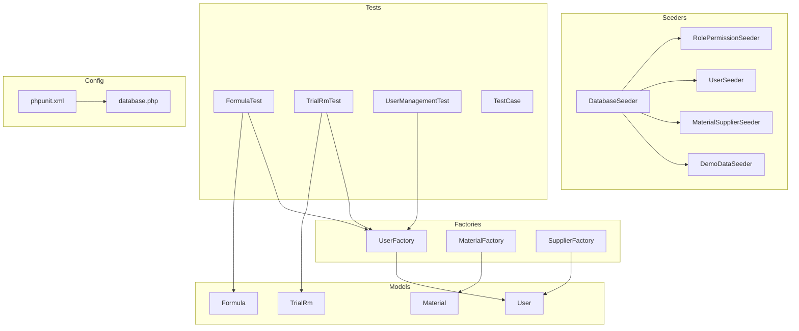
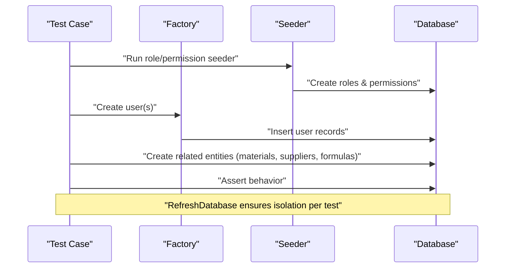
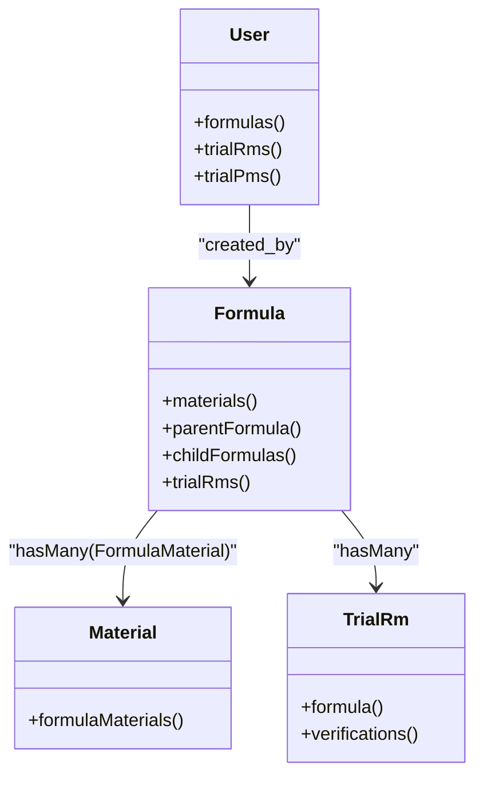
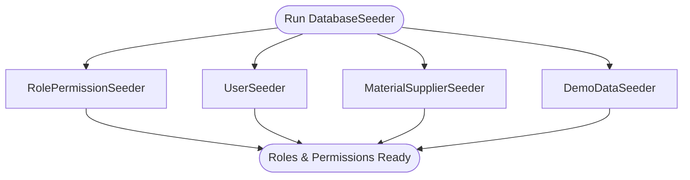
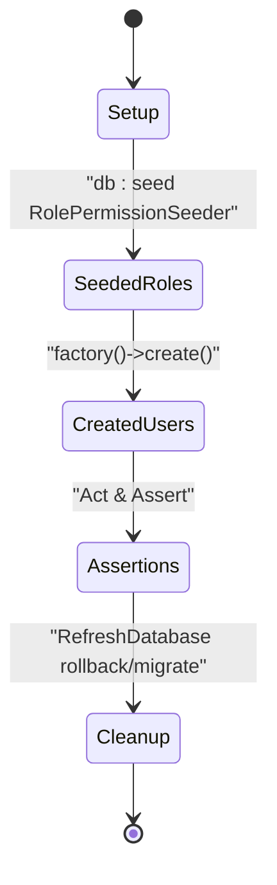
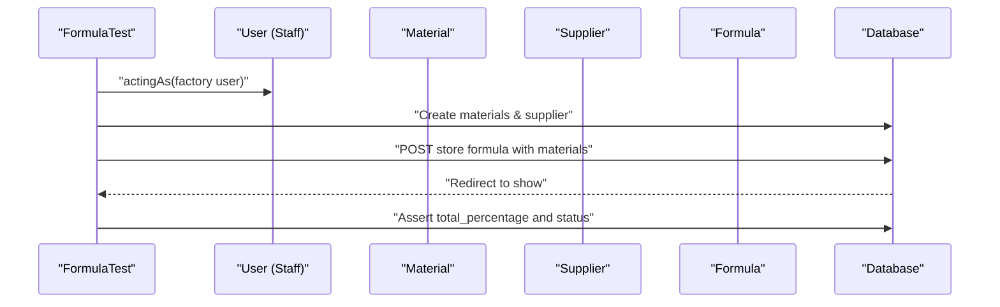
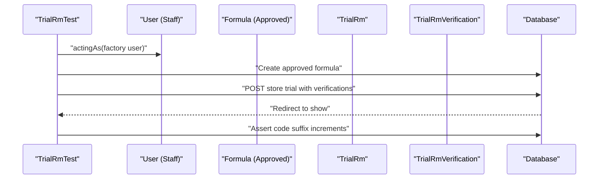
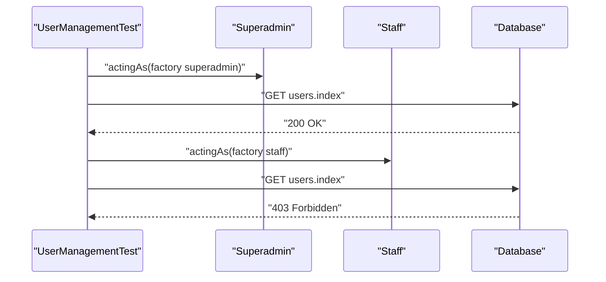
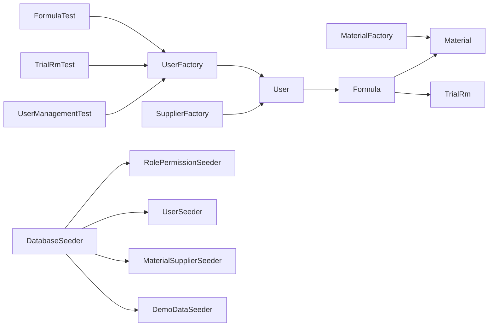

# Test Data Management

<cite>
**Referenced Files in This Document**
- [UserFactory.php](file://database/factories/UserFactory.php)
- [MaterialFactory.php](file://database/factories/MaterialFactory.php)
- [SupplierFactory.php](file://database/factories/SupplierFactory.php)
- [DatabaseSeeder.php](file://database/seeders/DatabaseSeeder.php)
- [RolePermissionSeeder.php](file://database/seeders/RolePermissionSeeder.php)
- [UserSeeder.php](file://database/seeders/UserSeeder.php)
- [MaterialSupplierSeeder.php](file://database/seeders/MaterialSupplierSeeder.php)
- [DemoDataSeeder.php](file://database/seeders/DemoDataSeeder.php)
- [phpunit.xml](file://phpunit.xml)
- [database.php](file://config/database.php)
- [TestCase.php](file://tests/TestCase.php)
- [FormulaTest.php](file://tests/Feature/FormulaTest.php)
- [TrialRmTest.php](file://tests/Feature/TrialRmTest.php)
- [UserManagementTest.php](file://tests/Feature/UserManagementTest.php)
- [User.php](file://app/Models/User.php)
- [Formula.php](file://app/Models/Formula.php)
- [Material.php](file://app/Models/Material.php)
- [TrialRm.php](file://app/Models/TrialRm.php)
</cite>

## Table of Contents
1. Introduction
2. Project Structure
3. Core Components
4. Architecture Overview
5. Detailed Component Analysis
6. Dependency Analysis
7. Performance Considerations
8. Troubleshooting Guide
9. Conclusion

## Introduction
This document explains how to manage test data effectively in the project, focusing on:
- Creating and using factories for Model instances
- Building relationships and generating bulk data
- Implementing seeders for consistent environments and test-specific setup
- Ensuring database isolation with transactions and in-memory databases
- Optimizing performance for large datasets and memory management during tests

The guidance is grounded in the existing codebase, including factories, seeders, models, and feature tests.

## Project Structure
The repository follows a standard Laravel structure with dedicated directories for factories, seeders, migrations, and tests. The testing configuration uses an in-memory SQLite database by default, ensuring fast and isolated test runs.

**Diagram sources**
- [UserFactory.php:1-46](file://database/factories/UserFactory.php#L1-L46)
- [MaterialFactory.php:1-43](file://database/factories/MaterialFactory.php#L1-L43)
- [SupplierFactory.php:1-37](file://database/factories/SupplierFactory.php#L1-L37)
- [DatabaseSeeder.php:1-35](file://database/seeders/DatabaseSeeder.php#L1-L35)
- [RolePermissionSeeder.php:1-112](file://database/seeders/RolePermissionSeeder.php#L1-L112)
- [UserSeeder.php:1-74](file://database/seeders/UserSeeder.php#L1-L74)
- [MaterialSupplierSeeder.php:1-83](file://database/seeders/MaterialSupplierSeeder.php#L1-L83)
- [DemoDataSeeder.php:1-360](file://database/seeders/DemoDataSeeder.php#L1-L360)
- [FormulaTest.php:1-197](file://tests/Feature/FormulaTest.php#L1-L197)
- [TrialRmTest.php:1-138](file://tests/Feature/TrialRmTest.php#L1-L138)
- [UserManagementTest.php:1-88](file://tests/Feature/UserManagementTest.php#L1-L88)
- [TestCase.php:1-11](file://tests/TestCase.php#L1-L11)
- [phpunit.xml:1-37](file://phpunit.xml#L1-L37)
- [database.php:1-185](file://config/database.php#L1-L185)
- [User.php:1-50](file://app/Models/User.php#L1-L50)
- [Formula.php:1-89](file://app/Models/Formula.php#L1-L89)
- [Material.php:1-33](file://app/Models/Material.php#L1-L33)
- [TrialRm.php:1-64](file://app/Models/TrialRm.php#L1-L64)

**Section sources**
- [phpunit.xml:20-35](file://phpunit.xml#L20-L35)
- [database.php:33-45](file://config/database.php#L33-L45)

## Core Components
- Factories: Provide deterministic and flexible ways to create model instances for tests.
- Seeders: Establish baseline data (roles, permissions, users, materials, suppliers) and rich demo scenarios.
- Tests: Use RefreshDatabase and factories to isolate state per test and build complex relationships.

Key implementation patterns:
- UserFactory defines defaults and states for creating users quickly.
- MaterialFactory and SupplierFactory provide realistic master data for formulas and trials.
- DatabaseSeeder orchestrates RolePermissionSeeder, UserSeeder, MaterialSupplierSeeder, and DemoDataSeeder.
- Feature tests use RefreshDatabase to wrap each test in a transaction or in-memory database lifecycle.

**Section sources**
- [UserFactory.php:1-46](file://database/factories/UserFactory.php#L1-L46)
- [MaterialFactory.php:1-43](file://database/factories/MaterialFactory.php#L1-L43)
- [SupplierFactory.php:1-37](file://database/factories/SupplierFactory.php#L1-L37)
- [DatabaseSeeder.php:1-35](file://database/seeders/DatabaseSeeder.php#L1-L35)
- [RolePermissionSeeder.php:1-112](file://database/seeders/RolePermissionSeeder.php#L1-L112)
- [UserSeeder.php:1-74](file://database/seeders/UserSeeder.php#L1-L74)
- [MaterialSupplierSeeder.php:1-83](file://database/seeders/MaterialSupplierSeeder.php#L1-L83)
- [DemoDataSeeder.php:1-360](file://database/seeders/DemoDataSeeder.php#L1-L360)
- [FormulaTest.php:1-197](file://tests/Feature/FormulaTest.php#L1-L197)
- [TrialRmTest.php:1-138](file://tests/Feature/TrialRmTest.php#L1-L138)
- [UserManagementTest.php:1-88](file://tests/Feature/UserManagementTest.php#L1-L88)

## Architecture Overview
The test data pipeline combines factories and seeders to support both minimal and comprehensive test scenarios.

**Diagram sources**
- [FormulaTest.php:24-56](file://tests/Feature/FormulaTest.php#L24-L56)
- [TrialRmTest.php:22-54](file://tests/Feature/TrialRmTest.php#L22-L54)
- [UserManagementTest.php:17-30](file://tests/Feature/UserManagementTest.php#L17-L30)
- [RolePermissionSeeder.php:1-112](file://database/seeders/RolePermissionSeeder.php#L1-L112)
- [UserFactory.php:1-46](file://database/factories/UserFactory.php#L1-L46)

## Detailed Component Analysis

### Factories: Users, Materials, Suppliers
- UserFactory:
  - Provides default attributes and a convenient unverified state.
  - Uses shared password hashing to avoid repeated work.
- MaterialFactory:
  - Generates realistic herbal material entries with type and unit.
- SupplierFactory:
  - Produces supplier profiles suitable for formula composition.

Usage patterns in tests:
- Create users via factory and assign roles for authorization checks.
- Combine with direct creation for domain-specific entities when needed.

**Diagram sources**
- [User.php:34-48](file://app/Models/User.php#L34-L48)
- [Formula.php:54-75](file://app/Models/Formula.php#L54-L75)
- [Material.php:27-31](file://app/Models/Material.php#L27-L31)
- [TrialRm.php:39-62](file://app/Models/TrialRm.php#L39-L62)

**Section sources**
- [UserFactory.php:1-46](file://database/factories/UserFactory.php#L1-L46)
- [MaterialFactory.php:1-43](file://database/factories/MaterialFactory.php#L1-L43)
- [SupplierFactory.php:1-37](file://database/factories/SupplierFactory.php#L1-L37)
- [User.php:1-50](file://app/Models/User.php#L1-L50)
- [Formula.php:1-89](file://app/Models/Formula.php#L1-L89)
- [Material.php:1-33](file://app/Models/Material.php#L1-L33)
- [TrialRm.php:1-64](file://app/Models/TrialRm.php#L1-L64)

### Seeders: Roles, Permissions, Users, Master Data, Demo Scenarios
- RolePermissionSeeder:
  - Creates permissions and roles, then assigns granular permissions to roles.
- UserSeeder:
  - Creates representative users and assigns roles.
- MaterialSupplierSeeder:
  - Seeds core materials and suppliers used across features.
- DemoDataSeeder:
  - Builds complex, realistic scenarios:
    - Formulas with multiple materials and suppliers
    - Trials with verifications
    - Packaging trials with multi-department approvals

**Diagram sources**
- [DatabaseSeeder.php:12-20](file://database/seeders/DatabaseSeeder.php#L12-L20)
- [RolePermissionSeeder.php:1-112](file://database/seeders/RolePermissionSeeder.php#L1-L112)
- [UserSeeder.php:1-74](file://database/seeders/UserSeeder.php#L1-L74)
- [MaterialSupplierSeeder.php:1-83](file://database/seeders/MaterialSupplierSeeder.php#L1-L83)
- [DemoDataSeeder.php:1-360](file://database/seeders/DemoDataSeeder.php#L1-L360)

**Section sources**
- [DatabaseSeeder.php:1-35](file://database/seeders/DatabaseSeeder.php#L1-L35)
- [RolePermissionSeeder.php:1-112](file://database/seeders/RolePermissionSeeder.php#L1-L112)
- [UserSeeder.php:1-74](file://database/seeders/UserSeeder.php#L1-L74)
- [MaterialSupplierSeeder.php:1-83](file://database/seeders/MaterialSupplierSeeder.php#L1-L83)
- [DemoDataSeeder.php:1-360](file://database/seeders/DemoDataSeeder.php#L1-L360)

### Test Isolation Strategies
- In-memory database:
  - phpunit.xml configures SQLite in-memory for speed and isolation.
- RefreshDatabase trait:
  - Wraps each test in a transaction or re-applies migrations to ensure clean state.
- Minimal seeding per test:
  - Tests call only the necessary seeders (e.g., roles and permissions) before creating specific data.

**Diagram sources**
- [phpunit.xml:20-35](file://phpunit.xml#L20-L35)
- [FormulaTest.php:14-30](file://tests/Feature/FormulaTest.php#L14-L30)
- [TrialRmTest.php:13-30](file://tests/Feature/TrialRmTest.php#L13-L30)
- [UserManagementTest.php:10-25](file://tests/Feature/UserManagementTest.php#L10-L25)

**Section sources**
- [phpunit.xml:20-35](file://phpunit.xml#L20-L35)
- [TestCase.php:1-11](file://tests/TestCase.php#L1-L11)
- [FormulaTest.php:14-30](file://tests/Feature/FormulaTest.php#L14-L30)
- [TrialRmTest.php:13-30](file://tests/Feature/TrialRmTest.php#L13-L30)
- [UserManagementTest.php:10-25](file://tests/Feature/UserManagementTest.php#L10-L25)

### Practical Examples: Complex Relationships

#### Formulas with Materials and Suppliers
- Build a formula with multiple materials and associated suppliers.
- Validate percentage totals and approval workflow transitions.

**Diagram sources**
- [FormulaTest.php:58-81](file://tests/Feature/FormulaTest.php#L58-L81)
- [Formula.php:77-87](file://app/Models/Formula.php#L77-L87)

**Section sources**
- [FormulaTest.php:58-149](file://tests/Feature/FormulaTest.php#L58-L149)
- [Formula.php:77-87](file://app/Models/Formula.php#L77-L87)

#### Trials with Verifications
- Create a trial linked to an approved formula and attach verification rows.
- Ensure suffix incrementing for repeated trials under the same formula.

**Diagram sources**
- [TrialRmTest.php:56-82](file://tests/Feature/TrialRmTest.php#L56-L82)
- [TrialRm.php:39-62](file://app/Models/TrialRm.php#L39-L62)

**Section sources**
- [TrialRmTest.php:56-121](file://tests/Feature/TrialRmTest.php#L56-L121)
- [TrialRm.php:39-62](file://app/Models/TrialRm.php#L39-L62)

#### Users with Roles
- Assign roles to users created via factories and assert access control.
- Demonstrate role-based authorization for user management endpoints.

**Diagram sources**
- [UserManagementTest.php:32-43](file://tests/Feature/UserManagementTest.php#L32-L43)

**Section sources**
- [UserManagementTest.php:32-79](file://tests/Feature/UserManagementTest.php#L32-L79)

## Dependency Analysis
Relationships among key components:

**Diagram sources**
- [UserFactory.php:1-46](file://database/factories/UserFactory.php#L1-L46)
- [MaterialFactory.php:1-43](file://database/factories/MaterialFactory.php#L1-L43)
- [SupplierFactory.php:1-37](file://database/factories/SupplierFactory.php#L1-L37)
- [DatabaseSeeder.php:12-20](file://database/seeders/DatabaseSeeder.php#L12-L20)
- [RolePermissionSeeder.php:1-112](file://database/seeders/RolePermissionSeeder.php#L1-L112)
- [UserSeeder.php:1-74](file://database/seeders/UserSeeder.php#L1-L74)
- [MaterialSupplierSeeder.php:1-83](file://database/seeders/MaterialSupplierSeeder.php#L1-L83)
- [DemoDataSeeder.php:1-360](file://database/seeders/DemoDataSeeder.php#L1-L360)
- [FormulaTest.php:1-197](file://tests/Feature/FormulaTest.php#L1-L197)
- [TrialRmTest.php:1-138](file://tests/Feature/TrialRmTest.php#L1-L138)
- [UserManagementTest.php:1-88](file://tests/Feature/UserManagementTest.php#L1-L88)
- [User.php:34-48](file://app/Models/User.php#L34-L48)
- [Formula.php:54-75](file://app/Models/Formula.php#L54-L75)
- [TrialRm.php:39-62](file://app/Models/TrialRm.php#L39-L62)

**Section sources**
- [User.php:34-48](file://app/Models/User.php#L34-L48)
- [Formula.php:54-75](file://app/Models/Formula.php#L54-L75)
- [TrialRm.php:39-62](file://app/Models/TrialRm.php#L39-L62)

## Performance Considerations
- Prefer in-memory SQLite for tests to minimize I/O overhead.
- Use RefreshDatabase to keep tests isolated without manual cleanup.
- Seed only what you need per test; avoid running full demo seeds in unit tests.
- For large datasets:
  - Use factories with bulk creation where appropriate.
  - Avoid eager loading unnecessary relations in assertions.
  - Keep test data minimal and focused on the behavior under test.

[No sources needed since this section provides general guidance]

## Troubleshooting Guide
Common issues and resolutions:
- Missing roles/permissions in tests:
  - Ensure RolePermissionSeeder is run before creating users that rely on roles.
- Unexpected 403 responses:
  - Verify the acting user has the required role assigned.
- Slow tests due to heavy seeding:
  - Replace full demo seeds with targeted factory calls in tests.
- Database state leakage:
  - Confirm RefreshDatabase is enabled and no global seeders are bypassing it.

**Section sources**
- [FormulaTest.php:24-56](file://tests/Feature/FormulaTest.php#L24-L56)
- [TrialRmTest.php:22-54](file://tests/Feature/TrialRmTest.php#L22-L54)
- [UserManagementTest.php:17-30](file://tests/Feature/UserManagementTest.php#L17-L30)

## Conclusion
By combining factories, targeted seeders, and robust isolation strategies, the test suite can reliably validate complex workflows such as formula composition, trial verifications, and role-based access control. Keeping test data minimal, leveraging in-memory databases, and using RefreshDatabase ensures fast, stable, and maintainable tests.

[No sources needed since this section summarizes without analyzing specific files]