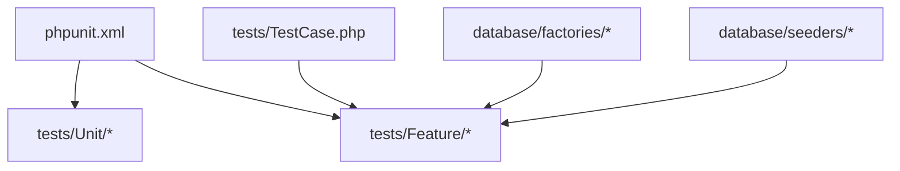
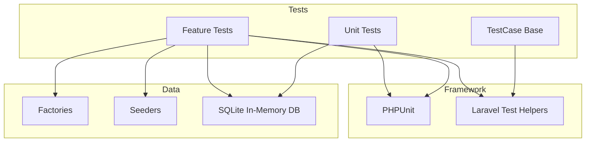
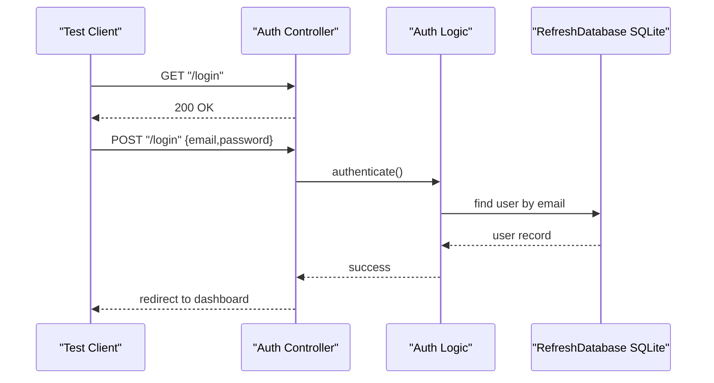
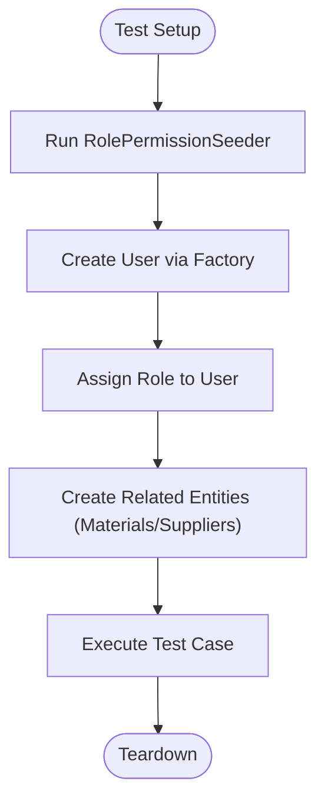
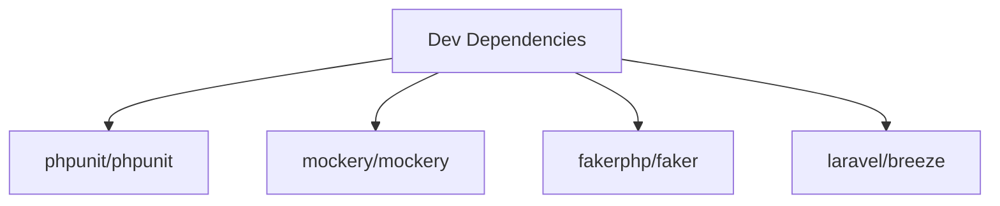

# Testing Strategy

<cite>
**Referenced Files in This Document**
- [phpunit.xml](file://phpunit.xml)
- [composer.json](file://composer.json)
- [tests/TestCase.php](file://tests/TestCase.php)
- [tests/Feature/ExampleTest.php](file://tests/Feature/ExampleTest.php)
- [tests/Unit/ExampleTest.php](file://tests/Unit/ExampleTest.php)
- [tests/Feature/Auth/AuthenticationTest.php](file://tests/Feature/Auth/AuthenticationTest.php)
- [tests/Feature/FormulasTest.php](file://tests/Feature/FormulasTest.php)
- [tests/Feature/TrialPmTest.php](file://tests/Feature/TrialPmTest.php)
- [tests/Feature/TrialRmTest.php](file://tests/Feature/TrialRmTest.php)
- [database/factories/UserFactory.php](file://database/factories/UserFactory.php)
- [database/seeders/DatabaseSeeder.php](file://database/seeders/DatabaseSeeder.php)
</cite>

## Table of Contents
1. Introduction
2. Project Structure
3. Core Components
4. Architecture Overview
5. Detailed Component Analysis
6. Dependency Analysis
7. Performance Considerations
8. Troubleshooting Guide
9. Conclusion

## Introduction
This document defines the testing strategy for the application, covering unit tests for models and services, feature tests for user workflows, and integration patterns for external dependencies. It explains test data management with factories and seeders, test database configuration, mocking strategies, CI setup, coverage requirements, debugging techniques, performance considerations, and isolation strategies. The guidance is grounded in the existing codebase and test suite structure.

## Project Structure
The project uses PHPUnit with Laravel’s testing utilities. Tests are organized into Unit and Feature suites. Factories and seeders provide deterministic test data. The base TestCase extends Laravel’s foundation test case to enable HTTP client assertions, authentication helpers, and database refresh capabilities.

**Diagram sources**
- [phpunit.xml:7-14](file://phpunit.xml#L7-L14)
- [tests/TestCase.php:7-10](file://tests/TestCase.php#L7-L10)
- [database/factories/UserFactory.php:13-34](file://database/factories/UserFactory.php#L13-L34)
- [database/seeders/DatabaseSeeder.php:14-19](file://database/seeders/DatabaseSeeder.php#L14-L19)

**Section sources**
- [phpunit.xml:1-37](file://phpunit.xml#L1-L37)
- [composer.json:17-26](file://composer.json#L17-L26)
- [tests/TestCase.php:1-11](file://tests/TestCase.php#L1-L11)

## Core Components
- Test suites: Unit and Feature defined in phpunit.xml.
- Base test class: Extends Laravel’s foundation test case for HTTP and auth helpers.
- Factories: UserFactory provides consistent user creation with a default password.
- Seeders: DatabaseSeeder orchestrates role, permission, and demo data seeding.
- Example tests: Basic examples demonstrate HTTP assertions and simple unit checks.

Key implementation references:
- Suite definitions and environment overrides for testing (SQLite in-memory DB).
- Use of RefreshDatabase trait in feature tests to isolate state per test.
- Factory usage for creating authenticated users and related entities.
- Seeding roles and permissions before workflow tests that rely on authorization.

**Section sources**
- [phpunit.xml:7-14](file://phpunit.xml#L7-L14)
- [phpunit.xml:20-35](file://phpunit.xml#L20-L35)
- [tests/TestCase.php:5-10](file://tests/TestCase.php#L5-L10)
- [database/factories/UserFactory.php:25-34](file://database/factories/UserFactory.php#L25-L34)
- [database/seeders/DatabaseSeeder.php:14-19](file://database/seeders/DatabaseSeeder.php#L14-L19)
- [tests/Feature/ExampleTest.php:13-18](file://tests/Feature/ExampleTest.php#L13-L18)
- [tests/Unit/ExampleTest.php:12-15](file://tests/Unit/ExampleTest.php#L12-L15)

## Architecture Overview
The testing architecture centers around PHPUnit and Laravel’s testing stack:
- phpunit.xml configures suites, source inclusion, and testing environment variables.
- Feature tests exercise controllers and business logic via HTTP requests and model assertions.
- Unit tests validate pure logic without framework overhead.
- Factories and seeders supply stable, repeatable data.
- RefreshDatabase ensures each test runs against a clean schema and dataset.

[No sources needed since this diagram shows conceptual workflow, not actual code structure]

## Detailed Component Analysis

### Unit Testing Approach
- Purpose: Validate isolated business logic and utility functions without I/O.
- Pattern: Extend PHPUnit’s base TestCase; assert expected outcomes directly.
- Example reference: Simple boolean assertion demonstrates the pattern.

Best practices:
- Keep tests fast and deterministic.
- Avoid network or disk I/O.
- Prefer explicit assertions over implicit behavior.

**Section sources**
- [tests/Unit/ExampleTest.php:12-15](file://tests/Unit/ExampleTest.php#L12-L15)

### Feature Testing for User Workflows
- Purpose: Validate end-to-end flows through controllers, middleware, policies, and services.
- Patterns observed:
  - Use RefreshDatabase to reset schema and data between tests.
  - Authenticate users using actingAs and factory-created records.
  - Assert HTTP responses, redirects, session errors, and persisted state.
  - Seed roles and permissions prior to authorization-dependent tests.

Examples:
- Authentication flow: login screen rendering, successful login, invalid password handling, logout redirection.
- Formula workflow: create draft formula, validation rules for percentages, submit only when total equals 100%, versioning on reformulation, policy enforcement.
- Trial PM workflow: create trial, initialize department approvals, auto-promote to approved when all approve, auto-reject on any rejection.
- Trial RM workflow: create trials for approved formulas only, suffix incrementing for repeated trials, policy enforcement.

**Diagram sources**
- [tests/Feature/Auth/AuthenticationTest.php:13-31](file://tests/Feature/Auth/AuthenticationTest.php#L13-L31)
- [phpunit.xml:26-27](file://phpunit.xml#L26-L27)

**Section sources**
- [tests/Feature/Auth/AuthenticationTest.php:1-55](file://tests/Feature/Auth/AuthenticationTest.php#L1-L55)
- [tests/Feature/FormulasTest.php:24-56](file://tests/Feature/FormulasTest.php#L24-L56)
- [tests/Feature/FormulasTest.php:58-99](file://tests/Feature/FormulasTest.php#L58-L99)
- [tests/Feature/FormulasTest.php:101-149](file://tests/Feature/FormulasTest.php#L101-L149)
- [tests/Feature/FormulasTest.php:167-195](file://tests/Feature/FormulasTest.php#L167-L195)
- [tests/Feature/TrialPmTest.php:18-59](file://tests/Feature/TrialPmTest.php#L18-L59)
- [tests/Feature/TrialPmTest.php:61-110](file://tests/Feature/TrialPmTest.php#L61-L110)
- [tests/Feature/TrialPmTest.php:112-148](file://tests/Feature/TrialPmTest.php#L112-L148)
- [tests/Feature/TrialRmTest.php:22-82](file://tests/Feature/TrialRmTest.php#L22-L82)
- [tests/Feature/TrialRmTest.php:84-121](file://tests/Feature/TrialRmTest.php#L84-L121)
- [tests/Feature/TrialRmTest.php:123-136](file://tests/Feature/TrialRmTest.php#L123-L136)

### Integration Testing for External Dependencies
- Current approach: Use SQLite in-memory database and array mailer/cache/session drivers to avoid real external systems during tests.
- Recommendations:
  - For external APIs, use Mockery to stub HTTP clients or service classes.
  - For file storage, use the local filesystem driver pointing to a temporary directory or mock Storage facade.
  - For queues, keep sync connection in tests to ensure synchronous execution.

Configuration references:
- Testing environment sets DB_CONNECTION to sqlite and DB_DATABASE to :memory:.
- Mail, cache, queue, session drivers set to array/sync for speed and isolation.

**Section sources**
- [phpunit.xml:20-35](file://phpunit.xml#L20-L35)

### Test Data Management: Factories and Seeders
- Factories:
  - UserFactory creates users with a default hashed password and verified email; supports unverified state.
- Seeders:
  - DatabaseSeeder calls RolePermissionSeeder, UserSeeder, MaterialSupplierSeeder, DemoDataSeeder to bootstrap roles, users, materials, suppliers, and sample data.
- Usage in tests:
  - Feature tests call db:seed with RolePermissionSeeder before running authorization-dependent scenarios.
  - Users are created via factory and assigned roles to simulate different actors.

**Diagram sources**
- [tests/Feature/FormulasTest.php:24-56](file://tests/Feature/FormulasTest.php#L24-L56)
- [database/factories/UserFactory.php:25-34](file://database/factories/UserFactory.php#L25-L34)
- [database/seeders/DatabaseSeeder.php:14-19](file://database/seeders/DatabaseSeeder.php#L14-L19)

**Section sources**
- [database/factories/UserFactory.php:13-44](file://database/factories/UserFactory.php#L13-L44)
- [database/seeders/DatabaseSeeder.php:12-33](file://database/seeders/DatabaseSeeder.php#L12-L33)
- [tests/Feature/FormulasTest.php:24-56](file://tests/Feature/FormulasTest.php#L24-L56)
- [tests/Feature/TrialPmTest.php:18-31](file://tests/Feature/TrialPmTest.php#L18-L31)
- [tests/Feature/TrialRmTest.php:22-54](file://tests/Feature/TrialRmTest.php#L22-L54)

### Mocking Strategies
- Available tooling: Mockery is included in dev dependencies.
- Recommended patterns:
  - Use Mockery to replace external services (e.g., PDF generation, Excel export, third-party APIs).
  - Bind mocks in setUp or within individual tests using app()->instance() or dependency injection.
  - Verify method calls and return values to ensure correct interactions.
- Note: No current tests explicitly use Mockery; add targeted unit tests for services that depend on external libraries.

**Section sources**
- [composer.json:17-26](file://composer.json#L17-L26)

### Writing Tests for Controllers, Services, and Business Logic
- Controllers:
  - Use HTTP client methods (get/post) and assert status codes, redirects, and session errors.
  - Example references: authentication endpoints, formula submission, trial PM approvals.
- Services:
  - Instantiate services directly in unit tests; pass mocked dependencies where necessary.
  - Assert side effects via database queries or event dispatches if applicable.
- Business Logic:
  - Focus on domain rules such as percentage totals, approval transitions, and version increments.
  - Example references: formula composition validation, trial PM multi-department approval flow, trial RM suffix incrementing.

**Section sources**
- [tests/Feature/Auth/AuthenticationTest.php:20-53](file://tests/Feature/Auth/AuthenticationTest.php#L20-L53)
- [tests/Feature/FormulasTest.php:58-99](file://tests/Feature/FormulasTest.php#L58-L99)
- [tests/Feature/TrialPmTest.php:61-110](file://tests/Feature/TrialPmTest.php#L61-L110)
- [tests/Feature/TrialRmTest.php:97-121](file://tests/Feature/TrialRmTest.php#L97-L121)

### Continuous Integration Setup
- Composer script:
  - test clears config and runs artisan test.
- Recommendation:
  - Add a CI job that installs dependencies, runs migrations (if needed), and executes the test suite.
  - Cache vendor and node modules to speed up builds.
  - Fail the pipeline on non-zero exit codes from the test command.

**Section sources**
- [composer.json:52-55](file://composer.json#L52-L55)

### Test Coverage Requirements
- Source include:
  - phpunit.xml includes app directory for coverage reporting.
- Recommendation:
  - Configure coverage thresholds in CI to enforce minimum coverage levels.
  - Generate HTML reports and upload artifacts for review.

**Section sources**
- [phpunit.xml:15-19](file://phpunit.xml#L15-L19)

### Debugging Techniques for Failing Tests
- Assertions:
  - Use response dumps and session inspection to understand failures.
- Logging:
  - Enable detailed logs locally; consider logging key decision points in services.
- Isolation:
  - Ensure RefreshDatabase is used to prevent cross-test pollution.
- Reproduction:
  - Extract failing scenario into a minimal test case with explicit setup steps.

[No sources needed since this section provides general guidance]

### Performance Testing Considerations
- Use SQLite in-memory database for fast iteration.
- Keep feature tests focused on critical paths; avoid heavy data generation.
- For load/performance testing, use dedicated tools outside PHPUnit (e.g., k6, Artillery) against a staging environment.

**Section sources**
- [phpunit.xml:26-27](file://phpunit.xml#L26-L27)

### Test Data Isolation Strategies
- RefreshDatabase:
  - Ensures schema refresh and transactional rollback per test.
- Factories:
  - Provide deterministic defaults and variations (e.g., unverified emails).
- Seeders:
  - Centralize baseline data like roles and permissions; call selectively in tests.

**Section sources**
- [tests/Feature/Auth/AuthenticationTest.php:11](file://tests/Feature/Auth/AuthenticationTest.php#L11)
- [database/factories/UserFactory.php:39-44](file://database/factories/UserFactory.php#L39-L44)
- [tests/Feature/FormulasTest.php:24-56](file://tests/Feature/FormulasTest.php#L24-L56)

## Dependency Analysis
Testing-related dependencies:
- PHPUnit for assertions and test runner.
- Mockery for mocking external dependencies.
- Faker for generating realistic data in factories.
- Laravel Breeze scaffolding includes example tests demonstrating auth flows.

**Diagram sources**
- [composer.json:17-26](file://composer.json#L17-L26)

**Section sources**
- [composer.json:17-26](file://composer.json#L17-L26)

## Performance Considerations
- Prefer unit tests for pure logic to minimize overhead.
- Limit database operations in feature tests; use factories efficiently.
- Avoid unnecessary seeds; run only required seeders per test.
- Keep external integrations mocked to reduce latency.

[No sources needed since this section provides general guidance]

## Troubleshooting Guide
Common issues and resolutions:
- Authorization failures:
  - Ensure roles and permissions are seeded before tests that rely on them.
- Validation errors:
  - Inspect session error bags and request payloads in failing tests.
- State leakage:
  - Confirm RefreshDatabase is active; verify no manual persistence outside transactions.
- Slow tests:
  - Replace heavy seeders with targeted factory calls; use SQLite in-memory.

**Section sources**
- [tests/Feature/FormulasTest.php:24-56](file://tests/Feature/FormulasTest.php#L24-L56)
- [tests/Feature/TrialPmTest.php:18-31](file://tests/Feature/TrialPmTest.php#L18-L31)
- [tests/Feature/TrialRmTest.php:22-54](file://tests/Feature/TrialRmTest.php#L22-L54)

## Conclusion
The project’s testing strategy leverages PHPUnit and Laravel’s testing utilities to validate both unit logic and end-to-end workflows. Factories and seeders provide robust test data, while RefreshDatabase ensures isolation. With Mockery available, external dependencies can be effectively stubbed. Adopting the recommended practices—focused feature tests, efficient data setup, clear assertions, and CI integration—will improve reliability and maintainability.