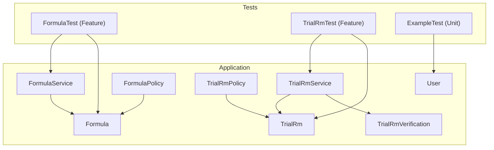
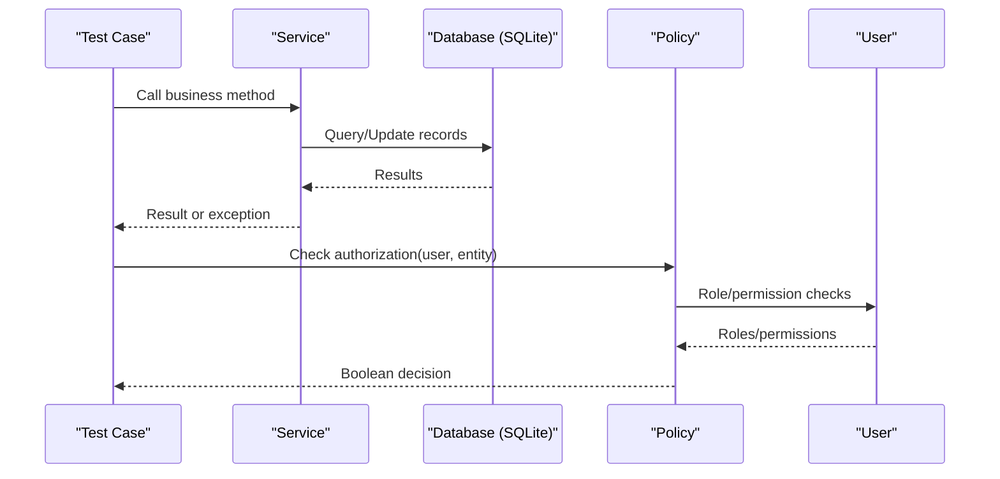
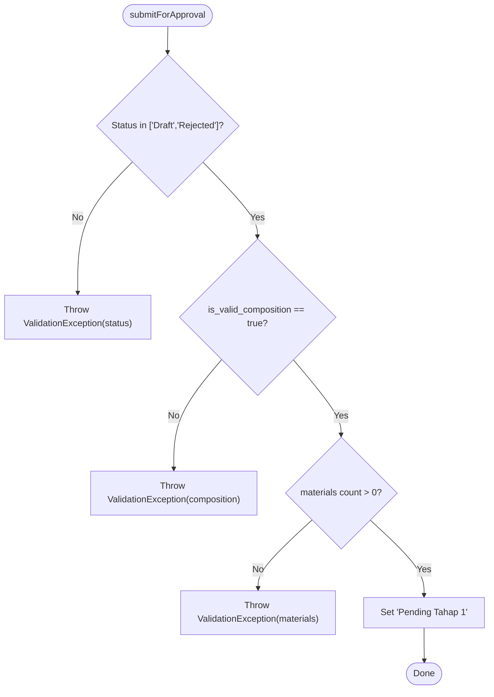
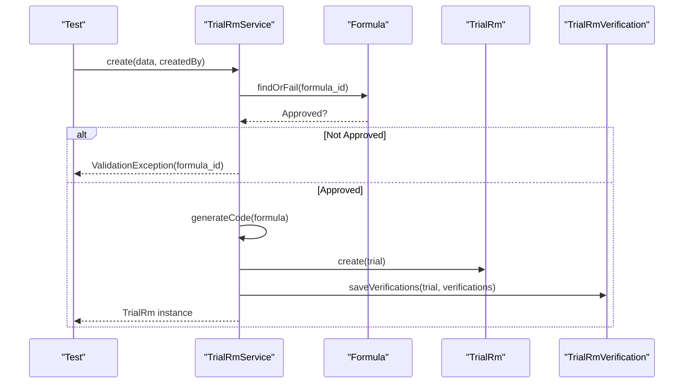
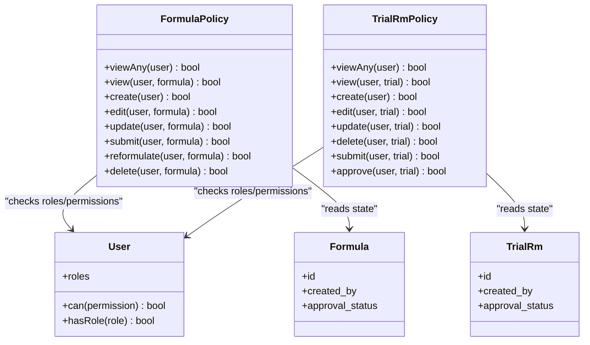
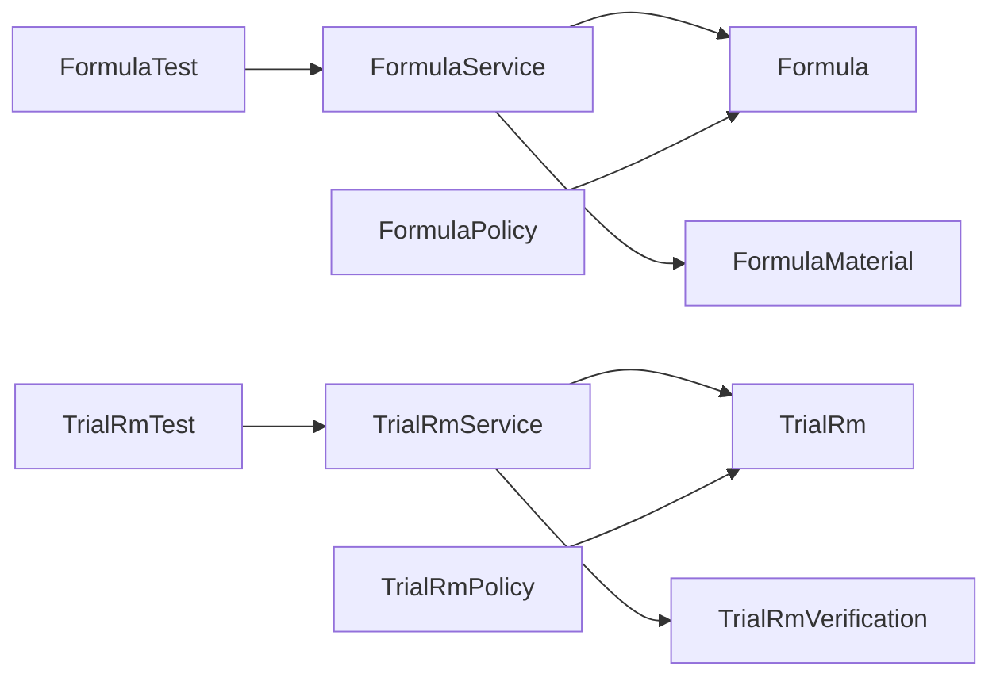

# Unit Testing

<cite>
**Referenced Files in This Document**
- [FormulaService.php](file://app/Services/FormulaService.php)
- [TrialRmService.php](file://app/Services/TrialRmService.php)
- [FormulaPolicy.php](file://app/Policies/FormulaPolicy.php)
- [TrialRmPolicy.php](file://app/Policies/TrialRmPolicy.php)
- [Formula.php](file://app/Models/Formula.php)
- [TrialRm.php](file://app/Models/TrialRm.php)
- [TrialRmVerification.php](file://app/Models/TrialRmVerification.php)
- [User.php](file://app/Models/User.php)
- [FormulaTest.php](file://tests/Feature/FormulaTest.php)
- [TrialRmTest.php](file://tests/Feature/TrialRmTest.php)
- [ExampleTest.php](file://tests/Unit/ExampleTest.php)
- [TestCase.php](file://tests/TestCase.php)
- [phpunit.xml](file://phpunit.xml)
- [database.php](file://config/database.php)
</cite>

## Table of Contents
1. [Introduction](#introduction)
2. [Project Structure](#project-structure)
3. [Core Components](#core-components)
4. [Architecture Overview](#architecture-overview)
5. [Detailed Component Analysis](#detailed-component-analysis)
6. [Dependency Analysis](#dependency-analysis)
7. [Performance Considerations](#performance-considerations)
8. [Troubleshooting Guide](#troubleshooting-guide)
9. [Conclusion](#conclusion)

## Introduction
This document explains how to write effective unit tests for the R&D management application, focusing on isolating individual components: Eloquent models, service classes, and policy authorization logic. It provides best practices for validating business rules, transforming data, and asserting method behavior. Practical guidance is included for testing FormulaService calculations, TrialRmService workflows, and user policies using Laravel’s testing framework with an in-memory SQLite database.

## Project Structure
The repository follows a standard Laravel layout:
- Business logic resides in app/Services and app/Policies.
- Data models are defined under app/Models.
- Feature tests cover HTTP flows and integration points under tests/Feature.
- A minimal unit test skeleton exists under tests/Unit.
- phpunit.xml configures the testing environment, including an in-memory SQLite database.

[No sources needed since this diagram shows conceptual structure]

## Core Components
- FormulaService: Encapsulates formula creation, updates, approval workflow, reformulation, and composition validation.
- TrialRmService: Manages trial record lifecycle, code generation, verification persistence, and approval workflow.
- Policies: Enforce authorization rules based on roles, permissions, ownership, and entity state.
- Models: Define attributes, casts, relationships, and computed helpers used by services and policies.

Key testing targets:
- Service methods that perform transactions, validations, and state transitions.
- Policy methods that gate access based on roles and permissions.
- Model attributes and relationships used by services and policies.

**Section sources**
- [FormulaService.php:10-227](file://app/Services/FormulaService.php#L10-L227)
- [TrialRmService.php:11-201](file://app/Services/TrialRmService.php#L11-L201)
- [FormulaPolicy.php:8-85](file://app/Policies/FormulaPolicy.php#L8-L85)
- [TrialRmPolicy.php:8-63](file://app/Policies/TrialRmPolicy.php#L8-L63)
- [Formula.php:9-88](file://app/Models/Formula.php#L9-L88)
- [TrialRm.php:9-63](file://app/Models/TrialRm.php#L9-L63)
- [TrialRmVerification.php:7-23](file://app/Models/TrialRmVerification.php#L7-L23)
- [User.php:16-49](file://app/Models/User.php#L16-L49)

## Architecture Overview
The system uses services to orchestrate business processes, policies to enforce authorization, and models to represent domain entities. Tests exercise these layers either via HTTP endpoints (feature tests) or direct service/policy calls (unit tests).

[No sources needed since this diagram shows conceptual flow]

## Detailed Component Analysis

### Testing FormulaService Calculations and Workflows
Focus areas:
- Code generation uniqueness and format.
- Composition validation and tolerance handling.
- State transitions for submit/approve/reject/reformulate.
- Transactional integrity when creating/updating materials.

Recommended approach:
- Use RefreshDatabase to ensure migrations run against in-memory SQLite before each test.
- Seed roles and permissions once per test class setup if required by feature-level assertions.
- For pure service logic, instantiate FormulaService directly and assert outcomes without going through controllers.

Key scenarios to cover:
- Create formula with valid materials; assert code prefix, versioning, and initial status.
- Reject submission when total percentage is not within tolerance; assert ValidationException messages.
- Submit for approval only when composition equals 100% and at least one material exists.
- Approve stages require correct current status; assert state changes and approver fields.
- Rejection requires pending statuses; assert rejection notes persisted.
- Reformulation creates a new version with copied materials and resets status to Draft.

**Diagram sources**
- [FormulaService.php:77-98](file://app/Services/FormulaService.php#L77-L98)

Best practices:
- Assert both side effects (database state) and exceptions thrown.
- Use specific assertion helpers for strings, numbers, and redirects where applicable.
- Keep tests deterministic by seeding consistent fixtures and avoiding time-dependent randomness.

**Section sources**
- [FormulaService.php:15-30](file://app/Services/FormulaService.php#L15-L30)
- [FormulaService.php:35-53](file://app/Services/FormulaService.php#L35-L53)
- [FormulaService.php:58-72](file://app/Services/FormulaService.php#L58-L72)
- [FormulaService.php:77-98](file://app/Services/FormulaService.php#L77-L98)
- [FormulaService.php:103-115](file://app/Services/FormulaService.php#L103-L115)
- [FormulaService.php:120-133](file://app/Services/FormulaService.php#L120-L133)
- [FormulaService.php:138-150](file://app/Services/FormulaService.php#L138-L150)
- [FormulaService.php:155-190](file://app/Services/FormulaService.php#L155-L190)
- [FormulaService.php:195-209](file://app/Services/FormulaService.php#L195-L209)
- [FormulaService.php:211-226](file://app/Services/FormulaService.php#L211-L226)
- [Formula.php:78-87](file://app/Models/Formula.php#L78-L87)

### Testing TrialRmService Workflows
Focus areas:
- Code generation with suffix incrementing for repeated trials of the same formula.
- Creation/update constraints tied to formula approval status and trial draft state.
- Verification persistence and minimum requirements before submission.
- Approval stage transitions and rejection handling.

Recommended approach:
- Use RefreshDatabase and seed roles/permissions as needed.
- Prepare an approved formula fixture to allow trial creation.
- Validate code generation edge cases (first trial vs subsequent trials).

Key scenarios to cover:
- Create trial for approved formula; assert code format and initial status.
- Prevent trial creation for non-approved formulas; assert session errors.
- Increment suffix letter for repeated trials of the same formula.
- Submit for approval only when verifications exist; assert state change.
- Approve/reject transitions validate current status and persist approver info.

**Diagram sources**
- [TrialRmService.php:55-81](file://app/Services/TrialRmService.php#L55-L81)
- [TrialRmService.php:17-50](file://app/Services/TrialRmService.php#L17-L50)
- [TrialRmService.php:182-200](file://app/Services/TrialRmService.php#L182-L200)

**Section sources**
- [TrialRmService.php:17-50](file://app/Services/TrialRmService.php#L17-L50)
- [TrialRmService.php:55-81](file://app/Services/TrialRmService.php#L55-L81)
- [TrialRmService.php:86-105](file://app/Services/TrialRmService.php#L86-L105)
- [TrialRmService.php:110-125](file://app/Services/TrialRmService.php#L110-L125)
- [TrialRmService.php:130-142](file://app/Services/TrialRmService.php#L130-L142)
- [TrialRmService.php:147-160](file://app/Services/TrialRmService.php#L147-L160)
- [TrialRmService.php:165-177](file://app/Services/TrialRmService.php#L165-L177)
- [TrialRmService.php:182-200](file://app/Services/TrialRmService.php#L182-L200)

### Testing Policy Authorization Logic
Focus areas:
- Permission-based access control using can() checks.
- Ownership checks (created_by) combined with entity state (approval_status).
- Role-based approvals for multi-stage workflows.

Recommended approach:
- Instantiate users with appropriate roles and permissions.
- Build entities with controlled states (Draft, Pending, Approved, Rejected).
- Assert policy decisions for viewAny, view, create, edit, update, delete, submit, approve.

**Diagram sources**
- [FormulaPolicy.php:8-85](file://app/Policies/FormulaPolicy.php#L8-L85)
- [TrialRmPolicy.php:8-63](file://app/Policies/TrialRmPolicy.php#L8-L63)
- [User.php:16-49](file://app/Models/User.php#L16-L49)
- [Formula.php:9-88](file://app/Models/Formula.php#L9-L88)
- [TrialRm.php:9-63](file://app/Models/TrialRm.php#L9-L63)

Best practices:
- Separate permission-only gates from ownership/state gates in tests.
- Cover negative paths (forbidden) explicitly.
- Use role assignment helpers to simulate different actors.

**Section sources**
- [FormulaPolicy.php:13-84](file://app/Policies/FormulaPolicy.php#L13-L84)
- [TrialRmPolicy.php:10-62](file://app/Policies/TrialRmPolicy.php#L10-L62)

### Testing Eloquent Models
Focus areas:
- Fillable attributes and casts.
- Relationships used by services and policies.
- Computed attributes (e.g., totals and validity flags).

Recommended approach:
- Create model instances using factories or direct creation.
- Assert relationship counts and loaded relations.
- Verify computed attributes reflect underlying data accurately.

**Section sources**
- [Formula.php:13-87](file://app/Models/Formula.php#L13-L87)
- [TrialRm.php:13-62](file://app/Models/TrialRm.php#L13-L62)
- [TrialRmVerification.php:9-22](file://app/Models/TrialRmVerification.php#L9-L22)
- [User.php:26-48](file://app/Models/User.php#L26-L48)

### Best Practices for Business Logic Validation, Data Transformation, and Assertions
- Isolate service logic: call service methods directly in unit tests to avoid controller overhead.
- Validate inputs: assert ValidationException messages for invalid compositions or missing prerequisites.
- Assert database state: use RefreshDatabase and query models after operations to confirm side effects.
- Use descriptive test names: follow “test_<actor>_can_<action>_when_<condition>” pattern.
- Prefer explicit assertions: assert exact values, string prefixes/suffixes, and redirects where relevant.
- Keep tests fast: prefer in-memory SQLite and minimal fixtures.

**Section sources**
- [FormulaTest.php:58-81](file://tests/Feature/FormulaTest.php#L58-L81)
- [FormulaTest.php:83-99](file://tests/Feature/FormulaTest.php#L83-L99)
- [FormulaTest.php:101-121](file://tests/Feature/FormulaTest.php#L101-L121)
- [FormulaTest.php:123-149](file://tests/Feature/FormulaTest.php#L123-L149)
- [FormulaTest.php:151-165](file://tests/Feature/FormulaTest.php#L151-L165)
- [FormulaTest.php:167-195](file://tests/Feature/FormulaTest.php#L167-L195)
- [TrialRmTest.php:56-82](file://tests/Feature/TrialRmTest.php#L56-L82)
- [TrialRmTest.php:84-95](file://tests/Feature/TrialRmTest.php#L84-L95)
- [TrialRmTest.php:97-121](file://tests/Feature/TrialRmTest.php#L97-L121)
- [TrialRmTest.php:123-136](file://tests/Feature/TrialRmTest.php#L123-L136)

### Mocking Strategies for External Dependencies
- When services depend on external APIs or heavy I/O, inject interfaces and provide mocks/stubs in tests.
- Use Laravel’s built-in mocking utilities or PHPUnit/Mockery to stub responses and verify interactions.
- Avoid mocking Eloquent unless necessary; prefer real database interactions with RefreshDatabase for accuracy.

[No sources needed since this section provides general guidance]

### Database Interactions Using In-Memory SQLite
- phpunit.xml sets DB_CONNECTION to sqlite and DB_DATABASE to :memory:.
- RefreshDatabase trait ensures migrations run before each test and cleans up afterward.
- This configuration enables fast, isolated tests without external database dependencies.

**Section sources**
- [phpunit.xml:20-35](file://phpunit.xml#L20-L35)
- [database.php:20-45](file://config/database.php#L20-L45)

### Testing Edge Cases
- Floating-point tolerance: ensure composition validation allows small deviations near 100%.
- Empty collections: handle empty materials or verifications gracefully.
- State boundaries: test transitions from all possible previous states to prevent regressions.
- Concurrency assumptions: while not simulated in unit tests, design services to be idempotent where feasible.

**Section sources**
- [FormulaService.php:195-209](file://app/Services/FormulaService.php#L195-L209)
- [TrialRmService.php:110-125](file://app/Services/TrialRmService.php#L110-L125)

### Test Organization Patterns and Naming Conventions
- Place unit tests under tests/Unit and feature tests under tests/Feature.
- Name test classes after the component under test (e.g., FormulaServiceTest, TrialRmPolicyTest).
- Use descriptive method names that communicate actor, action, and condition.
- Group related tests into logical suites and keep setUp minimal and focused.

**Section sources**
- [ExampleTest.php:7-16](file://tests/Unit/ExampleTest.php#L7-L16)
- [TestCase.php:7-10](file://tests/TestCase.php#L7-L10)

### Assertion Techniques Specific to Laravel’s Testing Framework
- HTTP responses: assertRedirect, assertSessionHasErrors, assertStatus.
- Database: assertDatabaseCount, assertModelExists, fresh() to reload models.
- Exceptions: expectException(ValidationException::class) or catch and assert messages.
- Time-sensitive assertions: use now() consistently and assert prefixes/suffixes rather than exact timestamps.

**Section sources**
- [FormulaTest.php:72-81](file://tests/Feature/FormulaTest.php#L72-L81)
- [FormulaTest.php:97-99](file://tests/Feature/FormulaTest.php#L97-L99)
- [TrialRmTest.php:73-82](file://tests/Feature/TrialRmTest.php#L73-L82)
- [TrialRmTest.php:93-95](file://tests/Feature/TrialRmTest.php#L93-L95)

## Dependency Analysis
The following diagram maps key dependencies between services, models, and policies exercised by tests.

**Diagram sources**
- [FormulaService.php:10-227](file://app/Services/FormulaService.php#L10-L227)
- [TrialRmService.php:11-201](file://app/Services/TrialRmService.php#L11-L201)
- [FormulaPolicy.php:8-85](file://app/Policies/FormulaPolicy.php#L8-L85)
- [TrialRmPolicy.php:8-63](file://app/Policies/TrialRmPolicy.php#L8-L63)
- [Formula.php:9-88](file://app/Models/Formula.php#L9-L88)
- [TrialRm.php:9-63](file://app/Models/TrialRm.php#L9-L63)
- [TrialRmVerification.php:7-23](file://app/Models/TrialRmVerification.php#L7-L23)
- [FormulaTest.php:14-196](file://tests/Feature/FormulaTest.php#L14-L196)
- [TrialRmTest.php:13-137](file://tests/Feature/TrialRmTest.php#L13-L137)

**Section sources**
- [FormulaService.php:10-227](file://app/Services/FormulaService.php#L10-L227)
- [TrialRmService.php:11-201](file://app/Services/TrialRmService.php#L11-L201)
- [FormulaPolicy.php:8-85](file://app/Policies/FormulaPolicy.php#L8-L85)
- [TrialRmPolicy.php:8-63](file://app/Policies/TrialRmPolicy.php#L8-L63)
- [Formula.php:9-88](file://app/Models/Formula.php#L9-L88)
- [TrialRm.php:9-63](file://app/Models/TrialRm.php#L9-L63)
- [TrialRmVerification.php:7-23](file://app/Models/TrialRmVerification.php#L7-L23)
- [FormulaTest.php:14-196](file://tests/Feature/FormulaTest.php#L14-L196)
- [TrialRmTest.php:13-137](file://tests/Feature/TrialRmTest.php#L13-L137)

## Performance Considerations
- Prefer unit tests over feature tests for pure logic to reduce overhead.
- Use in-memory SQLite and RefreshDatabase to keep tests fast and isolated.
- Minimize factory usage and seed only what is necessary for each test.
- Avoid heavy I/O; mock external services when they are not central to the tested behavior.

[No sources needed since this section provides general guidance]

## Troubleshooting Guide
Common issues and resolutions:
- Missing migrations: Ensure RefreshDatabase is used so migrations run automatically.
- Permission/role failures: Confirm roles and permissions are seeded before tests requiring them.
- Time-related assertions: Use flexible assertions (prefix/suffix) instead of exact timestamps.
- Floating-point comparisons: Account for tolerance near 100% when asserting composition totals.

**Section sources**
- [phpunit.xml:20-35](file://phpunit.xml#L20-L35)
- [FormulaTest.php:72-81](file://tests/Feature/FormulaTest.php#L72-L81)
- [FormulaTest.php:97-99](file://tests/Feature/FormulaTest.php#L97-L99)
- [TrialRmTest.php:73-82](file://tests/Feature/TrialRmTest.php#L73-L82)
- [TrialRmTest.php:93-95](file://tests/Feature/TrialRmTest.php#L93-L95)

## Conclusion
By structuring tests around clear responsibilities—services for business logic, policies for authorization, and models for data representation—you can achieve high confidence in correctness and maintainability. Leverage Laravel’s testing tools, in-memory SQLite, and targeted assertions to validate edge cases and complex workflows efficiently.