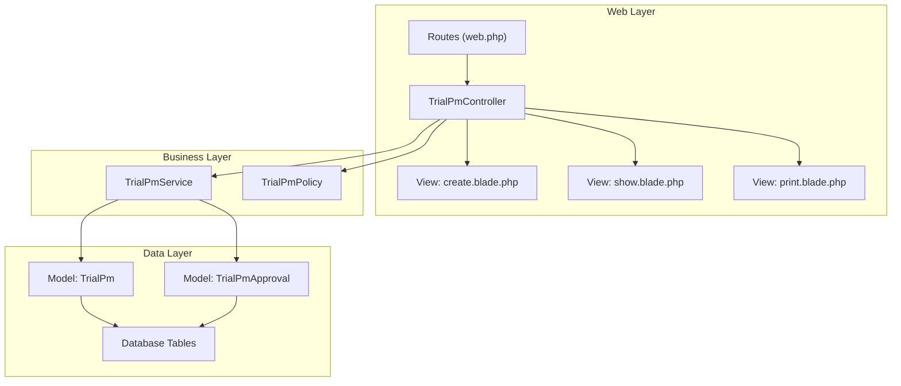
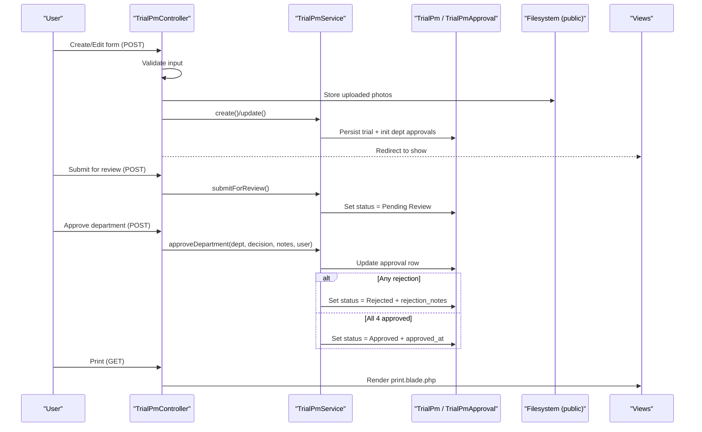
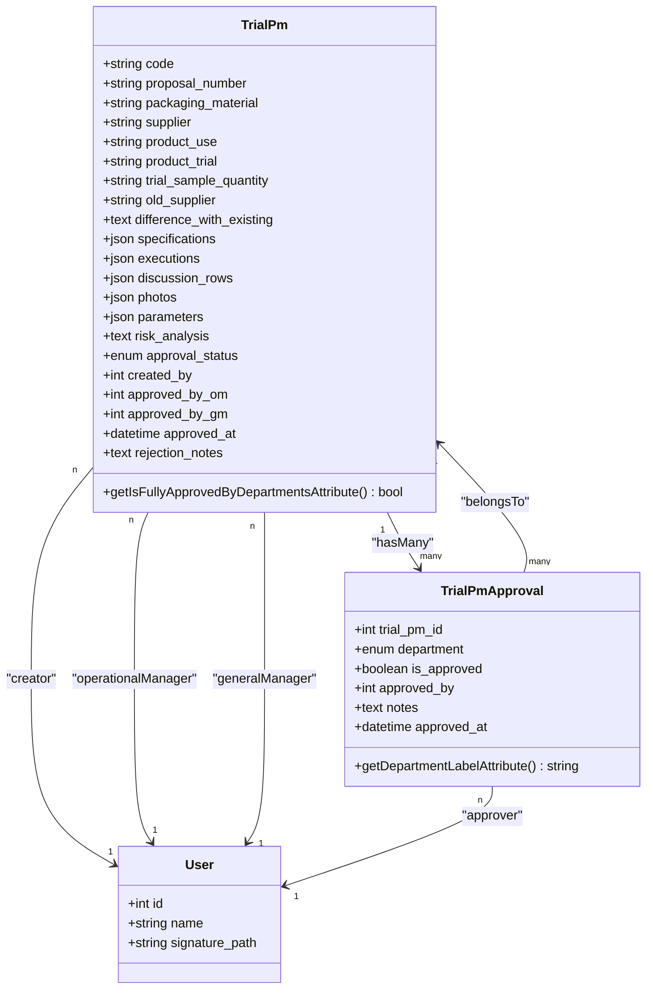
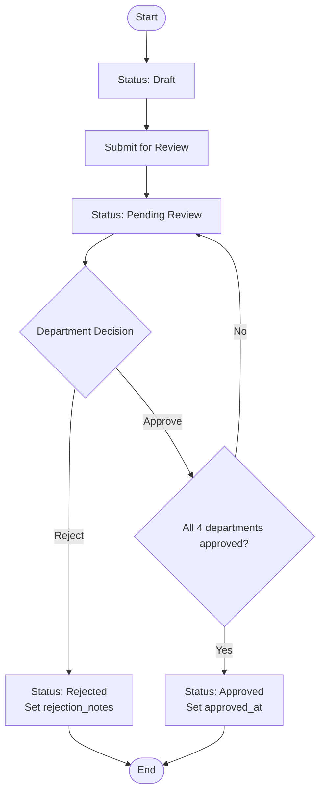
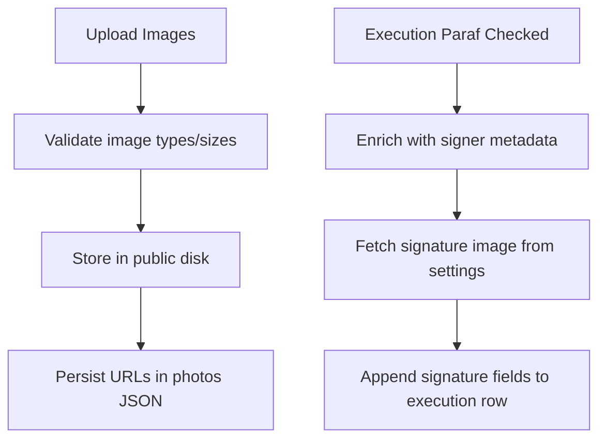
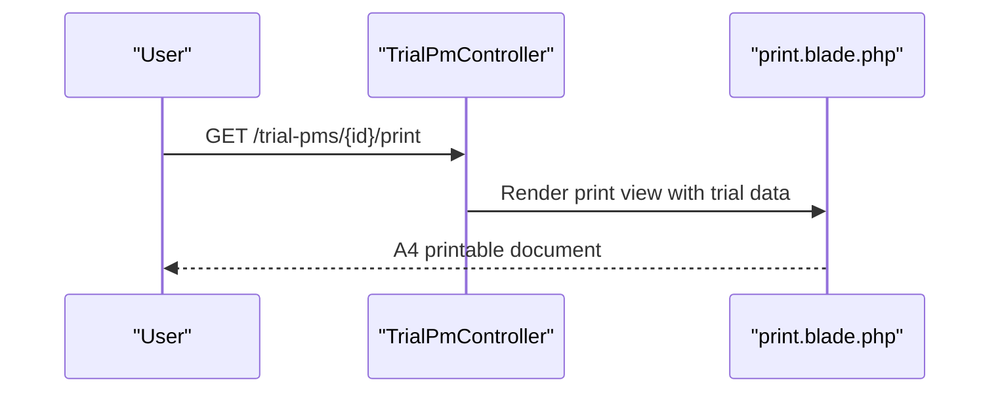
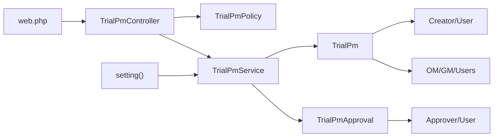

# Packaging Material Trials

<cite>
**Referenced Files in This Document**
- [TrialPm.php](file://app/Models/TrialPm.php)
- [TrialPmApproval.php](file://app/Models/TrialPmApproval.php)
- [TrialPmController.php](file://app/Http/Controllers/TrialPmController.php)
- [TrialPmService.php](file://app/Services/TrialPmService.php)
- [TrialPmPolicy.php](file://app/Policies/TrialPmPolicy.php)
- [2026_07_01_092905_create_trial_pms_table.php](file://database/migrations/2026_07_01_092905_create_trial_pms_table.php)
- [2026_07_01_092919_create_trial_pm_approvals_table.php](file://database/migrations/2026_07_01_092919_create_trial_pm_approvals_table.php)
- [2026_07_02_042035_update_trial_pms_table_for_new_specification_and_executions.php](file://database/migrations/2026_07_02_042035_update_trial_pms_table_for_new_specification_and_executions.php)
- [2026_07_02_044109_add_signature_path_to_users_table.php](file://database/migrations/2026_07_02_044109_add_signature_path_to_users_table.php)
- [web.php](file://routes/web.php)
- [create.blade.php](file://resources/views/trial-pms/create.blade.php)
- [show.blade.php](file://resources/views/trial-pms/show.blade.php)
- [print.blade.php](file://resources/views/trial-pms/print.blade.php)
- [setting.php](file://app/Helpers/setting.php)
</cite>

## Table of Contents
1. Introduction
2. Project Structure
3. Core Components
4. Architecture Overview
5. Detailed Component Analysis
6. Dependency Analysis
7. Performance Considerations
8. Troubleshooting Guide
9. Conclusion

## Introduction
This document explains the Packaging Material (PM) Trial Management system end-to-end: data model, multi-department approval workflow, photo and document handling, print-ready reporting, and compliance-oriented auditability. It is designed for both technical and non-technical readers to understand how packaging trials are created, reviewed, approved or rejected, and printed as official forms.

## Project Structure
The PM trial feature follows a standard MVC pattern with service-layer orchestration and policy-based authorization:
- Models define the data schema and relationships.
- Service encapsulates business rules (status transitions, approvals).
- Controller handles HTTP requests, validation, and delegates to services.
- Views provide interactive UI and a dedicated print layout.
- Routes wire endpoints and enforce permissions.

**Diagram sources**
- [web.php:50-62](file://routes/web.php#L50-L62)
- [TrialPmController.php:11-266](file://app/Http/Controllers/TrialPmController.php#L11-L266)
- [TrialPmService.php:11-211](file://app/Services/TrialPmService.php#L11-L211)
- [TrialPmPolicy.php:8-56](file://app/Policies/TrialPmPolicy.php#L8-L56)
- [TrialPm.php:9-81](file://app/Models/TrialPm.php#L9-L81)
- [TrialPmApproval.php:7-49](file://app/Models/TrialPmApproval.php#L7-L49)

**Section sources**
- [web.php:50-62](file://routes/web.php#L50-L62)
- [TrialPmController.php:11-266](file://app/Http/Controllers/TrialPmController.php#L11-L266)
- [TrialPmService.php:11-211](file://app/Services/TrialPmService.php#L11-L211)
- [TrialPmPolicy.php:8-56](file://app/Policies/TrialPmPolicy.php#L8-L56)
- [TrialPm.php:9-81](file://app/Models/TrialPm.php#L9-L81)
- [TrialPmApproval.php:7-49](file://app/Models/TrialPmApproval.php#L7-L49)

## Core Components
- Data models:
  - TrialPm: core trial record with status, metadata, JSON arrays for specifications/executions/discussions/photos, and approval timestamps.
  - TrialPmApproval: per-department decision records with approver identity and notes.
- Business logic:
  - TrialPmService: code generation, creation/update, submission, and departmental approval with automatic final status resolution.
- Authorization:
  - TrialPmPolicy: enforces who can view, edit, submit, approve, and delete based on roles and current status.
- Controllers and views:
  - TrialPmController: orchestrates CRUD, file uploads, submission, approvals, and printing.
  - Views: create/edit forms, detail page with inline approvals, and a print-only layout.

Key responsibilities:
- Status lifecycle: Draft → Pending Review → Approved or Rejected.
- Multi-department approvals: RD, QC, Production, Engineering; any rejection immediately sets Rejected; all four approvals set Approved.
- Photo/document storage: images stored under public disk path and persisted as URLs in JSON.
- Print output: A4-formatted report with fixed headers/footers and signature rendering.

**Section sources**
- [TrialPm.php:9-81](file://app/Models/TrialPm.php#L9-L81)
- [TrialPmApproval.php:7-49](file://app/Models/TrialPmApproval.php#L7-L49)
- [TrialPmService.php:11-211](file://app/Services/TrialPmService.php#L11-L211)
- [TrialPmPolicy.php:8-56](file://app/Policies/TrialPmPolicy.php#L8-L56)
- [TrialPmController.php:11-266](file://app/Http/Controllers/TrialPmController.php#L11-L266)
- [create.blade.php:1-349](file://resources/views/trial-pms/create.blade.php#L1-L349)
- [show.blade.php:1-611](file://resources/views/trial-pms/show.blade.php#L1-L611)
- [print.blade.php:1-697](file://resources/views/trial-pms/print.blade.php#L1-L697)

## Architecture Overview
The PM trial flow spans controllers, services, models, and views with strict authorization checks and transactional updates.

**Diagram sources**
- [TrialPmController.php:55-266](file://app/Http/Controllers/TrialPmController.php#L55-L266)
- [TrialPmService.php:36-211](file://app/Services/TrialPmService.php#L36-L211)
- [TrialPm.php:9-81](file://app/Models/TrialPm.php#L9-L81)
- [TrialPmApproval.php:7-49](file://app/Models/TrialPmApproval.php#L7-L49)
- [print.blade.php:1-697](file://resources/views/trial-pms/print.blade.php#L1-L697)

## Detailed Component Analysis

### Data Model and Relationships

**Diagram sources**
- [TrialPm.php:9-81](file://app/Models/TrialPm.php#L9-L81)
- [TrialPmApproval.php:7-49](file://app/Models/TrialPmApproval.php#L7-L49)
- [2026_07_02_044109_add_signature_path_to_users_table.php:12-28](file://database/migrations/2026_07_02_044109_add_signature_path_to_users_table.php#L12-L28)

**Section sources**
- [TrialPm.php:9-81](file://app/Models/TrialPm.php#L9-L81)
- [TrialPmApproval.php:7-49](file://app/Models/TrialPmApproval.php#L7-L49)
- [2026_07_01_092905_create_trial_pms_table.php:12-38](file://database/migrations/2026_07_01_092905_create_trial_pms_table.php#L12-L38)
- [2026_07_01_092919_create_trial_pm_approvals_table.php:12-36](file://database/migrations/2026_07_01_092919_create_trial_pm_approvals_table.php#L12-L36)
- [2026_07_02_042035_update_trial_pms_table_for_new_specification_and_executions.php:12-92](file://database/migrations/2026_07_02_042035_update_trial_pms_table_for_new_specification_and_executions.php#L12-L92)
- [2026_07_02_044109_add_signature_path_to_users_table.php:12-28](file://database/migrations/2026_07_02_044109_add_signature_path_to_users_table.php#L12-L28)

### Approval Workflow and Status Management

**Diagram sources**
- [TrialPmService.php:154-211](file://app/Services/TrialPmService.php#L154-L211)
- [TrialPm.php:74-81](file://app/Models/TrialPm.php#L74-L81)

**Section sources**
- [TrialPmService.php:154-211](file://app/Services/TrialPmService.php#L154-L211)
- [TrialPm.php:74-81](file://app/Models/TrialPm.php#L74-L81)

### File Storage and Digital Signatures
- Photos:
  - Uploaded via create/edit forms, validated as images, stored under the public filesystem, and saved as URL paths in the photos JSON array.
- Execution paraf (signatures):
  - When checkboxes for paraf_prod/eng/qc are checked, the system enriches execution rows with signed_by, signed_at, signed_name, and signature image path from settings.
- User signatures:
  - Users may have a signature_path used in print views and approval comments.

**Diagram sources**
- [TrialPmController.php:90-108](file://app/Http/Controllers/TrialPmController.php#L90-L108)
- [TrialPmController.php:183-197](file://app/Http/Controllers/TrialPmController.php#L183-L197)
- [TrialPmService.php:114-149](file://app/Services/TrialPmService.php#L114-L149)
- [setting.php:3-12](file://app/Helpers/setting.php#L3-L12)

**Section sources**
- [TrialPmController.php:90-108](file://app/Http/Controllers/TrialPmController.php#L90-L108)
- [TrialPmController.php:183-197](file://app/Http/Controllers/TrialPmController.php#L183-L197)
- [TrialPmService.php:114-149](file://app/Services/TrialPmService.php#L114-L149)
- [setting.php:3-12](file://app/Helpers/setting.php#L3-L12)

### Print Functionality
- Dedicated print route renders an A4-formatted document with fixed header/footer, sectioned content, tables, and signature blocks.
- The show page provides a modal preview that loads the print view in an iframe for immediate print or PDF export via browser.

**Diagram sources**
- [TrialPmController.php:126-133](file://app/Http/Controllers/TrialPmController.php#L126-L133)
- [print.blade.php:1-697](file://resources/views/trial-pms/print.blade.php#L1-L697)
- [show.blade.php:69-76](file://resources/views/trial-pms/show.blade.php#L69-L76)

**Section sources**
- [TrialPmController.php:126-133](file://app/Http/Controllers/TrialPmController.php#L126-L133)
- [print.blade.php:1-697](file://resources/views/trial-pms/print.blade.php#L1-L697)
- [show.blade.php:69-76](file://resources/views/trial-pms/show.blade.php#L69-L76)

### Practical Examples

- Creating a PM trial:
  - Fill Section A (packaging material, supplier, product use/trial, sample quantity), Section B (specifications), Section C (executions table), Section D (discussion rows), and optionally upload photos. Save as Draft.
  - Reference: [create.blade.php:46-349](file://resources/views/trial-pms/create.blade.php#L46-L349)

- Uploading photos and documents:
  - Use the “Upload Photos” area; multiple files accepted; stored under public disk and referenced by URL.
  - Reference: [TrialPmController.php:90-108](file://app/Http/Controllers/TrialPmController.php#L90-L108)

- Managing departmental approvals:
  - After submitting for review, authorized users select “Input Penilaian” for their department, choose “Can be used” or “Cannot be used,” add notes, and save.
  - If any department rejects, status becomes Rejected with rejection notes. If all four approve, status becomes Approved with timestamp.
  - References:
    - [show.blade.php:430-477](file://resources/views/trial-pms/show.blade.php#L430-L477)
    - [TrialPmController.php:239-266](file://app/Http/Controllers/TrialPmController.php#L239-L266)
    - [TrialPmService.php:168-211](file://app/Services/TrialPmService.php#L168-L211)

- Generating printable trial reports:
  - From the detail page, open the print preview modal or navigate directly to the print route to render the official form.
  - References:
    - [show.blade.php:69-76](file://resources/views/trial-pms/show.blade.php#L69-L76)
    - [TrialPmController.php:126-133](file://app/Http/Controllers/TrialPmController.php#L126-L133)
    - [print.blade.php:1-697](file://resources/views/trial-pms/print.blade.php#L1-L697)

**Section sources**
- [create.blade.php:46-349](file://resources/views/trial-pms/create.blade.php#L46-L349)
- [TrialPmController.php:90-108](file://app/Http/Controllers/TrialPmController.php#L90-L108)
- [show.blade.php:430-477](file://resources/views/trial-pms/show.blade.php#L430-L477)
- [TrialPmController.php:239-266](file://app/Http/Controllers/TrialPmController.php#L239-L266)
- [TrialPmService.php:168-211](file://app/Services/TrialPmService.php#L168-L211)
- [print.blade.php:1-697](file://resources/views/trial-pms/print.blade.php#L1-L697)

## Dependency Analysis
- Routing and authorization:
  - Routes register resource endpoints plus custom submit/approve/print actions guarded by policies.
- Controller-service coupling:
  - Controller validates and delegates to service; service performs transactions and state transitions.
- Model relationships:
  - TrialPm has many TrialPmApproval; approvals reference users; trial references creator and managers.
- External helpers:
  - setting() helper reads configuration values (e.g., signature images) from the database.

**Diagram sources**
- [web.php:50-62](file://routes/web.php#L50-L62)
- [TrialPmController.php:11-266](file://app/Http/Controllers/TrialPmController.php#L11-L266)
- [TrialPmPolicy.php:8-56](file://app/Policies/TrialPmPolicy.php#L8-L56)
- [TrialPmService.php:11-211](file://app/Services/TrialPmService.php#L11-L211)
- [TrialPm.php:54-81](file://app/Models/TrialPm.php#L54-L81)
- [TrialPmApproval.php:24-49](file://app/Models/TrialPmApproval.php#L24-L49)
- [setting.php:3-12](file://app/Helpers/setting.php#L3-L12)

**Section sources**
- [web.php:50-62](file://routes/web.php#L50-L62)
- [TrialPmController.php:11-266](file://app/Http/Controllers/TrialPmController.php#L11-L266)
- [TrialPmPolicy.php:8-56](file://app/Policies/TrialPmPolicy.php#L8-L56)
- [TrialPmService.php:11-211](file://app/Services/TrialPmService.php#L11-L211)
- [TrialPm.php:54-81](file://app/Models/TrialPm.php#L54-L81)
- [TrialPmApproval.php:24-49](file://app/Models/TrialPmApproval.php#L24-L49)
- [setting.php:3-12](file://app/Helpers/setting.php#L3-L12)

## Performance Considerations
- Eager loading:
  - Detail and list pages load related entities (creator, approvals, approvers) to avoid N+1 queries.
- Transactions:
  - Creation and approval operations wrap changes in DB transactions to ensure consistency.
- Validation at controller level:
  - Reduces unnecessary processing by rejecting invalid inputs early.
- Image handling:
  - Keep uploaded images reasonably sized; server-side validation enforces type and size limits.

[No sources needed since this section provides general guidance]

## Troubleshooting Guide
- Cannot edit after submission:
  - Only Draft trials can be edited; once submitted, edits are blocked until rework is allowed by process.
- Approval not updating status:
  - Ensure the trial is in Pending Review; only then can departments approve/reject.
  - Rejection immediately sets Rejected; all four approvals required for Approved.
- Missing signature images:
  - Verify settings contain valid signature paths and that user signature_path is configured.
- Print layout issues:
  - Use the print route directly if the modal preview does not render correctly; confirm browser print settings allow background graphics.

**Section sources**
- [TrialPmService.php:78-107](file://app/Services/TrialPmService.php#L78-L107)
- [TrialPmService.php:154-211](file://app/Services/TrialPmService.php#L154-L211)
- [TrialPmController.php:126-133](file://app/Http/Controllers/TrialPmController.php#L126-L133)
- [setting.php:3-12](file://app/Helpers/setting.php#L3-L12)

## Conclusion
The PM Trial Management system provides a robust, auditable workflow for evaluating packaging materials across multiple departments. It combines structured forms, secure file handling, clear status transitions, and compliant print outputs. Policies and transactions safeguard data integrity, while the print layout ensures official documentation readiness.