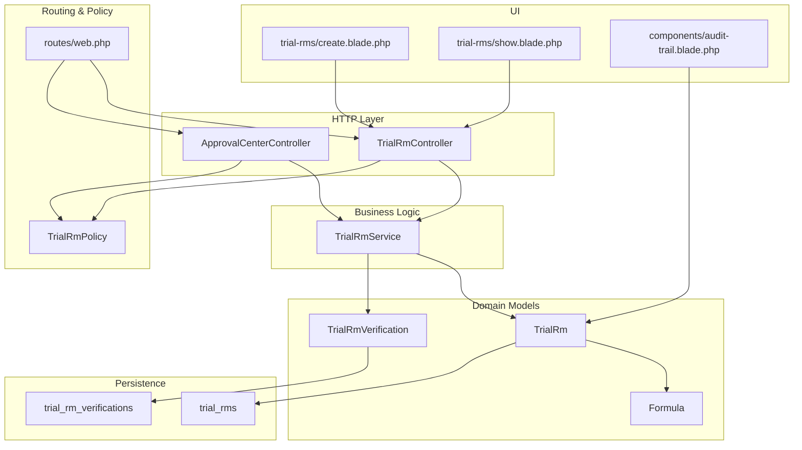
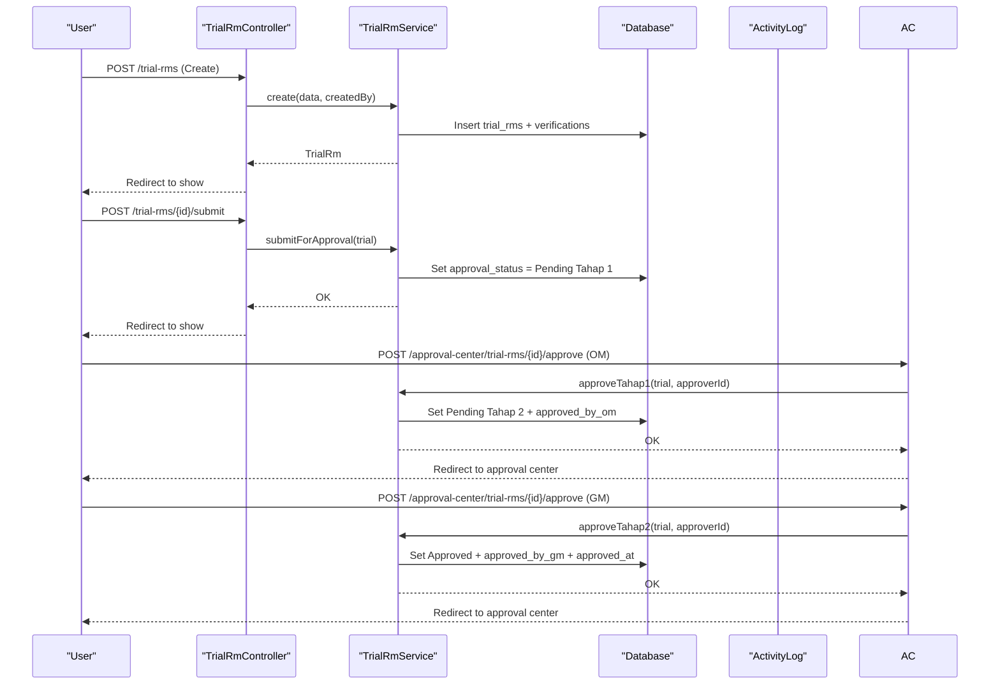
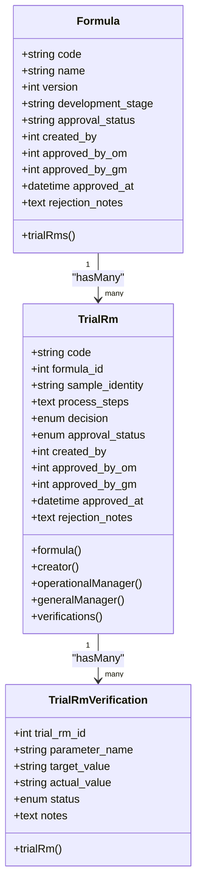
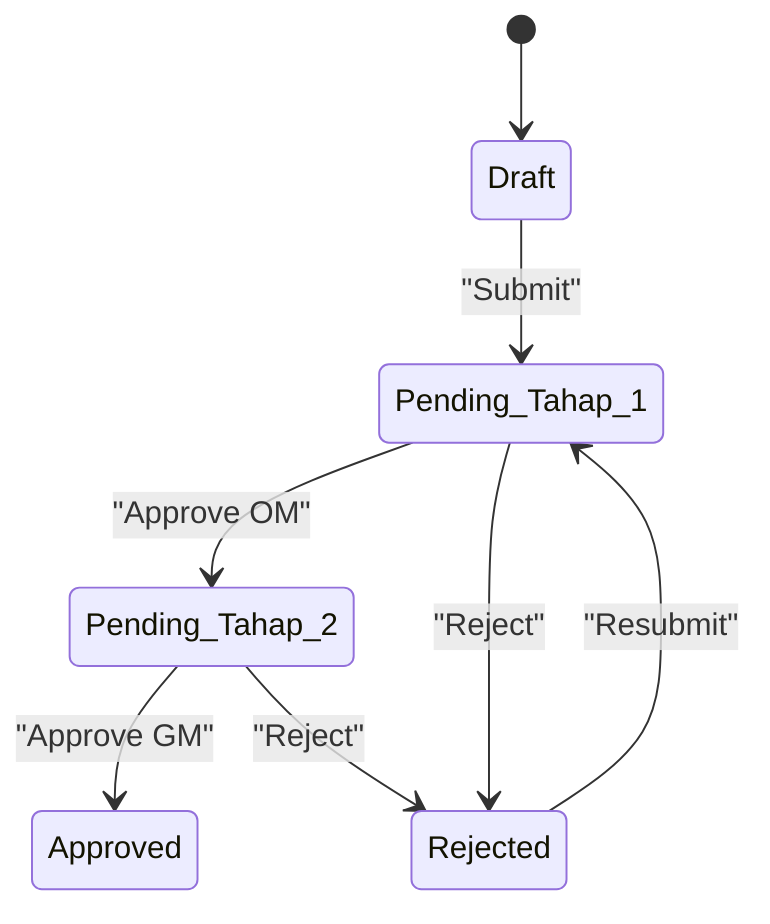
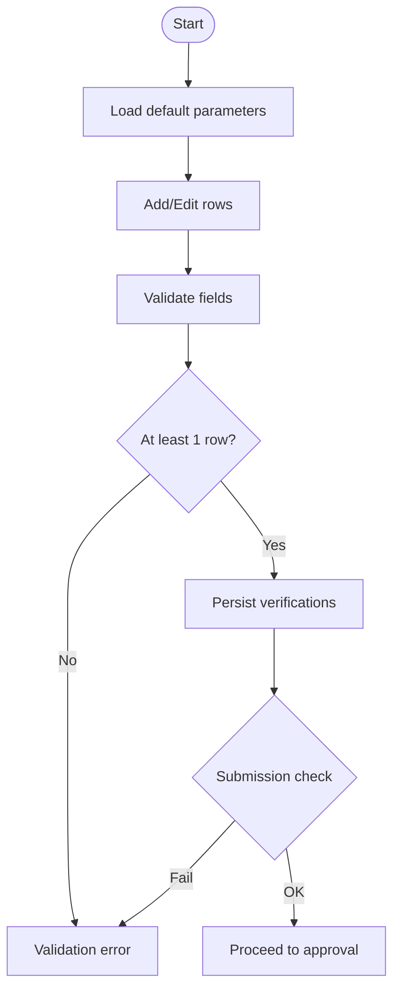
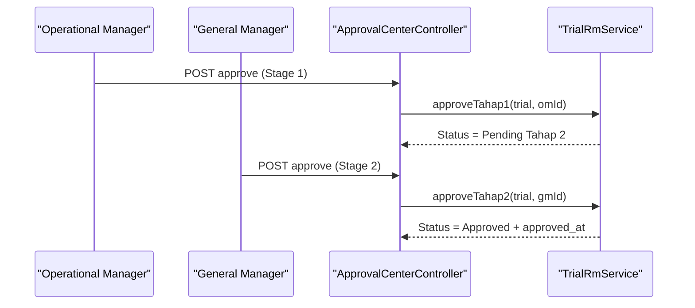
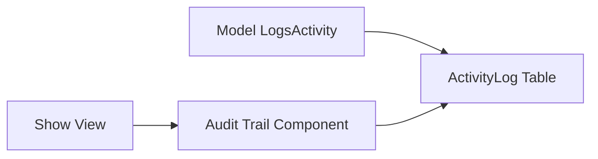
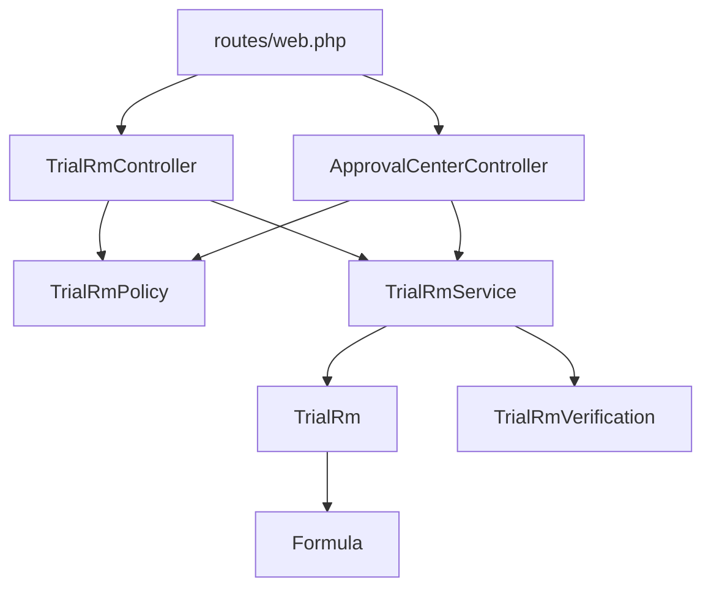

# Raw Material Trials

<cite>
**Referenced Files in This Document**
- [TrialRm.php](file://app/Models/TrialRm.php)
- [TrialRmVerification.php](file://app/Models/TrialRmVerification.php)
- [Formula.php](file://app/Models/Formula.php)
- [TrialRmController.php](file://app/Http/Controllers/TrialRmController.php)
- [ApprovalCenterController.php](file://app/Http/Controllers/ApprovalCenterController.php)
- [TrialRmService.php](file://app/Services/TrialRmService.php)
- [TrialRmPolicy.php](file://app/Policies/TrialRmPolicy.php)
- [web.php](file://routes/web.php)
- [2026_07_01_092849_create_trial_rms_table.php](file://database/migrations/2026_07_01_092849_create_trial_rms_table.php)
- [2026_07_01_092857_create_trial_rm_verifications_table.php](file://database/migrations/2026_07_01_092857_create_trial_rm_verifications_table.php)
- [create.blade.php](file://resources/views/trial-rms/create.blade.php)
- [show.blade.php](file://resources/views/trial-rms/show.blade.php)
- [audit-trail.blade.php](file://resources/views/components/audit-trail.blade.php)
- [activitylog.php](file://config/activitylog.php)
- [ApprovalCenterTest.php](file://tests/Feature/ApprovalCenterTest.php)
</cite>

## Table of Contents
1. Introduction
2. Project Structure
3. Core Components
4. Architecture Overview
5. Detailed Component Analysis
6. Dependency Analysis
7. Performance Considerations
8. Troubleshooting Guide
9. Conclusion
10. Appendices

## Introduction
This document explains the Raw Material (RM) Trial Management system end-to-end: data models, lifecycle from creation to final approval, parameter verification workflows, decision recording, relationships with formulas, sample identity tracking, process steps documentation, multi-level approvals (Operational Manager → General Manager), and audit trail integration. It also provides practical examples for creating trials, managing verifications, handling approvals/rejections, and generating reports.

## Project Structure
The RM trial feature follows a layered architecture:
- Controllers handle HTTP requests and delegate business logic to services.
- Services enforce validation rules, state transitions, and persistence.
- Models define entities, relationships, and activity logging.
- Views render forms and detail pages including approval timelines and audit trails.
- Routes wire controllers to endpoints and apply authorization policies.

**Diagram sources**
- [TrialRmController.php](file://app/Http/Controllers/TrialRmController.php)
- [ApprovalCenterController.php](file://app/Http/Controllers/ApprovalCenterController.php)
- [TrialRmService.php](file://app/Services/TrialRmService.php)
- [TrialRm.php](file://app/Models/TrialRm.php)
- [TrialRmVerification.php](file://app/Models/TrialRmVerification.php)
- [Formula.php](file://app/Models/Formula.php)
- [2026_07_01_092849_create_trial_rms_table.php](file://database/migrations/2026_07_01_092849_create_trial_rms_table.php)
- [2026_07_01_092857_create_trial_rm_verifications_table.php](file://database/migrations/2026_07_01_092857_create_trial_rm_verifications_table.php)
- [create.blade.php](file://resources/views/trial-rms/create.blade.php)
- [show.blade.php](file://resources/views/trial-rms/show.blade.php)
- [audit-trail.blade.php](file://resources/views/components/audit-trail.blade.php)
- [web.php](file://routes/web.php)
- [TrialRmPolicy.php](file://app/Policies/TrialRmPolicy.php)

**Section sources**
- [web.php](file://routes/web.php)
- [TrialRmController.php](file://app/Http/Controllers/TrialRmController.php)
- [ApprovalCenterController.php](file://app/Http/Controllers/ApprovalCenterController.php)
- [TrialRmService.php](file://app/Services/TrialRmService.php)
- [TrialRm.php](file://app/Models/TrialRm.php)
- [TrialRmVerification.php](file://app/Models/TrialRmVerification.php)
- [Formula.php](file://app/Models/Formula.php)
- [create.blade.php](file://resources/views/trial-rms/create.blade.php)
- [show.blade.php](file://resources/views/trial-rms/show.blade.php)
- [audit-trail.blade.php](file://resources/views/components/audit-trail.blade.php)

## Core Components
- TrialRm model: Represents an RM trial record, links to Formula, creator, approvers, and verifications; integrates activity logging.
- TrialRmVerification model: Stores per-parameter test results against target specifications.
- Formula model: Approved formula referenced by trials; supports versioning and materials.
- TrialRmController: CRUD, submission for approval, and view loading with eager-loaded relations.
- ApprovalCenterController: Centralized approval actions for both formulas and trials across roles.
- TrialRmService: Encapsulates code generation, create/update, submission, approvals, rejections, and verification persistence.
- TrialRmPolicy: Authorization rules for viewing, editing, deleting, submitting, and approving based on roles and status.
- Database migrations: Define schema for trials and verifications.
- Views: Create form with dynamic parameters; show page with timeline, decisions, and audit trail.

**Section sources**
- [TrialRm.php](file://app/Models/TrialRm.php)
- [TrialRmVerification.php](file://app/Models/TrialRmVerification.php)
- [Formula.php](file://app/Models/Formula.php)
- [TrialRmController.php](file://app/Http/Controllers/TrialRmController.php)
- [ApprovalCenterController.php](file://app/Http/Controllers/ApprovalCenterController.php)
- [TrialRmService.php](file://app/Services/TrialRmService.php)
- [TrialRmPolicy.php](file://app/Policies/TrialRmPolicy.php)
- [2026_07_01_092849_create_trial_rms_table.php](file://database/migrations/2026_07_01_092849_create_trial_rms_table.php)
- [2026_07_01_092857_create_trial_rm_verifications_table.php](file://database/migrations/2026_07_01_092857_create_trial_rm_verifications_table.php)
- [create.blade.php](file://resources/views/trial-rms/create.blade.php)
- [show.blade.php](file://resources/views/trial-rms/show.blade.php)

## Architecture Overview
The RM trial workflow is driven by controller actions that validate input, then delegate to service methods enforcing business rules and state transitions. Approvals are role-gated and recorded with timestamps and user references. Audit events are captured via Spatie Activitylog.

**Diagram sources**
- [TrialRmController.php](file://app/Http/Controllers/TrialRmController.php)
- [ApprovalCenterController.php](file://app/Http/Controllers/ApprovalCenterController.php)
- [TrialRmService.php](file://app/Services/TrialRmService.php)
- [2026_07_01_092849_create_trial_rms_table.php](file://database/migrations/2026_07_01_092849_create_trial_rms_table.php)

## Detailed Component Analysis

### Data Model and Relationships

**Diagram sources**
- [Formula.php](file://app/Models/Formula.php)
- [TrialRm.php](file://app/Models/TrialRm.php)
- [TrialRmVerification.php](file://app/Models/TrialRmVerification.php)
- [2026_07_01_092849_create_trial_rms_table.php](file://database/migrations/2026_07_01_092849_create_trial_rms_table.php)
- [2026_07_01_092857_create_trial_rm_verifications_table.php](file://database/migrations/2026_07_01_092857_create_trial_rm_verifications_table.php)

**Section sources**
- [Formula.php](file://app/Models/Formula.php)
- [TrialRm.php](file://app/Models/TrialRm.php)
- [TrialRmVerification.php](file://app/Models/TrialRmVerification.php)
- [2026_07_01_092849_create_trial_rms_table.php](file://database/migrations/2026_07_01_092849_create_trial_rms_table.php)
- [2026_07_01_092857_create_trial_rm_verifications_table.php](file://database/migrations/2026_07_01_092857_create_trial_rm_verifications_table.php)

### Trial Lifecycle and State Machine
States: Draft → Pending Tahap 1 → Pending Tahap 2 → Approved or Rejected. Rejected can be resubmitted back to Pending Tahap 1.

**Diagram sources**
- [TrialRmService.php](file://app/Services/TrialRmService.php)
- [2026_07_01_092849_create_trial_rms_table.php](file://database/migrations/2026_07_01_092849_create_trial_rms_table.php)

**Section sources**
- [TrialRmService.php](file://app/Services/TrialRmService.php)

### Parameter Verification Workflow
- Default parameters are provided in the UI for convenience.
- Each parameter includes target specification, actual result, status (Pass/Fail/Warning), and optional notes.
- At least one verification must exist before submission.

**Diagram sources**
- [TrialRmController.php](file://app/Http/Controllers/TrialRmController.php)
- [TrialRmService.php](file://app/Services/TrialRmService.php)
- [create.blade.php](file://resources/views/trial-rms/create.blade.php)

**Section sources**
- [TrialRmController.php](file://app/Http/Controllers/TrialRmController.php)
- [TrialRmService.php](file://app/Services/TrialRmService.php)
- [create.blade.php](file://resources/views/trial-rms/create.blade.php)

### Decision Recording Mechanism
- Decision field captures Lulus or Reformulasi at any time during drafting.
- The show view renders visual badges reflecting current decision and approval status.

**Section sources**
- [TrialRm.php](file://app/Models/TrialRm.php)
- [show.blade.php](file://resources/views/trial-rms/show.blade.php)

### Relationship Between Trials and Formulas
- Only Approved formulas can be used to create trials.
- Trial records link to a specific formula, enabling traceability from raw material testing back to the product formulation.

**Section sources**
- [TrialRmController.php](file://app/Http/Controllers/TrialRmController.php)
- [TrialRmService.php](file://app/Services/TrialRmService.php)
- [Formula.php](file://app/Models/Formula.php)

### Sample Identity Tracking and Process Steps Documentation
- sample_identity captures batch/sample identifiers.
- process_steps documents methodology and execution details.

**Section sources**
- [TrialRm.php](file://app/Models/TrialRm.php)
- [create.blade.php](file://resources/views/trial-rms/create.blade.php)
- [show.blade.php](file://resources/views/trial-rms/show.blade.php)

### Multi-Level Approval Processes
- Operational Manager approves Stage 1, promoting to Stage 2.
- General Manager approves Stage 2, finalizing as Approved with timestamp.
- Either stage can reject, returning to Rejected with notes; creator can resubmit.

**Diagram sources**
- [ApprovalCenterController.php](file://app/Http/Controllers/ApprovalCenterController.php)
- [TrialRmService.php](file://app/Services/TrialRmService.php)

**Section sources**
- [ApprovalCenterController.php](file://app/Http/Controllers/ApprovalCenterController.php)
- [TrialRmService.php](file://app/Services/TrialRmService.php)
- [TrialRmPolicy.php](file://app/Policies/TrialRmPolicy.php)

### Verification System: Field Specifications and Validation Rules
- Fields: parameter_name, target_value, actual_value, status, notes.
- Validation:
  - parameter_name required string max length.
  - target_value required string max length.
  - actual_value optional string max length.
  - status required enum Pass/Fail/Warning.
  - notes optional string max length.
- Submission requires at least one verification entry.

**Section sources**
- [TrialRmController.php](file://app/Http/Controllers/TrialRmController.php)
- [TrialRmService.php](file://app/Services/TrialRmService.php)
- [2026_07_01_092857_create_trial_rm_verifications_table.php](file://database/migrations/2026_07_01_092857_create_trial_rm_verifications_table.php)

### Practical Examples

- Creating an RM trial:
  - Navigate to create page, select an Approved formula, fill sample identity and process steps, add verification parameters, optionally set initial decision, and save.
  - See: [create.blade.php](file://resources/views/trial-rms/create.blade.php)

- Managing verifications:
  - Add/remove parameter rows, set target and actual values, choose status, and add notes.
  - See: [create.blade.php](file://resources/views/trial-rms/create.blade.php)

- Submitting for approval:
  - From the show page, click “Submit for approval” if draft or rejected and verifications exist.
  - See: [show.blade.php](file://resources/views/trial-rms/show.blade.php), [TrialRmController.php](file://app/Http/Controllers/TrialRmController.php)

- Approving/rejecting:
  - Operational Manager approves Stage 1; General Manager approves Stage 2. Either can reject with notes.
  - See: [ApprovalCenterController.php](file://app/Http/Controllers/ApprovalCenterController.php), [TrialRmService.php](file://app/Services/TrialRmService.php)

- Generating reports:
  - Use the index listing with search and filters to export or review trials.
  - See: [TrialRmController.php](file://app/Http/Controllers/TrialRmController.php)

**Section sources**
- [create.blade.php](file://resources/views/trial-rms/create.blade.php)
- [show.blade.php](file://resources/views/trial-rms/show.blade.php)
- [TrialRmController.php](file://app/Http/Controllers/TrialRmController.php)
- [ApprovalCenterController.php](file://app/Http/Controllers/ApprovalCenterController.php)
- [TrialRmService.php](file://app/Services/TrialRmService.php)

### Audit Trail Integration and Compliance
- Activity logging enabled via configuration; models log only dirty changes for key fields.
- Show page renders audit trail component displaying actor, description, and changed attributes.
- Supports compliance requirements by retaining who did what and when.

**Diagram sources**
- [TrialRm.php](file://app/Models/TrialRm.php)
- [audit-trail.blade.php](file://resources/views/components/audit-trail.blade.php)
- [activitylog.php](file://config/activitylog.php)

**Section sources**
- [TrialRm.php](file://app/Models/TrialRm.php)
- [audit-trail.blade.php](file://resources/views/components/audit-trail.blade.php)
- [activitylog.php](file://config/activitylog.php)

## Dependency Analysis

**Diagram sources**
- [web.php](file://routes/web.php)
- [TrialRmController.php](file://app/Http/Controllers/TrialRmController.php)
- [ApprovalCenterController.php](file://app/Http/Controllers/ApprovalCenterController.php)
- [TrialRmPolicy.php](file://app/Policies/TrialRmPolicy.php)
- [TrialRmService.php](file://app/Services/TrialRmService.php)
- [TrialRm.php](file://app/Models/TrialRm.php)
- [TrialRmVerification.php](file://app/Models/TrialRmVerification.php)
- [Formula.php](file://app/Models/Formula.php)

**Section sources**
- [web.php](file://routes/web.php)
- [TrialRmController.php](file://app/Http/Controllers/TrialRmController.php)
- [ApprovalCenterController.php](file://app/Http/Controllers/ApprovalCenterController.php)
- [TrialRmPolicy.php](file://app/Policies/TrialRmPolicy.php)
- [TrialRmService.php](file://app/Services/TrialRmService.php)
- [TrialRm.php](file://app/Models/TrialRm.php)
- [TrialRmVerification.php](file://app/Models/TrialRmVerification.php)
- [Formula.php](file://app/Models/Formula.php)

## Performance Considerations
- Eager load related data in show action to avoid N+1 queries.
- Keep pagination on list views for large datasets.
- Avoid heavy computations in request path; keep service methods focused and transactional where needed.

[No sources needed since this section provides general guidance]

## Troubleshooting Guide
Common issues and resolutions:
- Cannot edit after submission: Only Draft or Rejected trials can be edited by the creator.
- Cannot submit without verifications: Ensure at least one verification row exists.
- Approval errors: Check current approval_status matches expected stage for the approver’s role.
- Access denied: Verify user has required permissions and roles.

Relevant validations and checks:
- Controller validation rules for inputs.
- Service state checks for submission/approval/rejection.
- Policy authorizations for operations.

**Section sources**
- [TrialRmController.php](file://app/Http/Controllers/TrialRmController.php)
- [TrialRmService.php](file://app/Services/TrialRmService.php)
- [TrialRmPolicy.php](file://app/Policies/TrialRmPolicy.php)
- [ApprovalCenterTest.php](file://tests/Feature/ApprovalCenterTest.php)

## Conclusion
The RM Trial Management system provides a robust, auditable workflow for testing raw materials against approved formulations. It enforces strict validation, supports multi-stage approvals, and maintains clear traceability through sample identity, process steps, and parameter verifications. The design separates concerns cleanly between controllers, services, models, and views, facilitating maintainability and compliance.

[No sources needed since this section summarizes without analyzing specific files]

## Appendices

### API Endpoints Summary
- GET /trial-rms — List trials with search and filters.
- GET /trial-rms/create — Create form.
- POST /trial-rms — Create trial.
- GET /trial-rms/{id} — Show trial details.
- GET /trial-rms/{id}/edit — Edit form.
- PATCH /trial-rms/{id} — Update trial.
- DELETE /trial-rms/{id} — Delete trial.
- POST /trial-rms/{id}/submit — Submit for approval.
- GET /approval-center — Approval queue.
- POST /approval-center/trial-rms/{id}/approve — Approve trial.
- POST /approval-center/trial-rms/{id}/reject — Reject trial.

**Section sources**
- [web.php](file://routes/web.php)
- [TrialRmController.php](file://app/Http/Controllers/TrialRmController.php)
- [ApprovalCenterController.php](file://app/Http/Controllers/ApprovalCenterController.php)