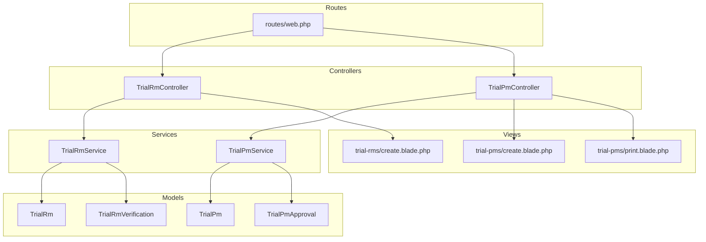
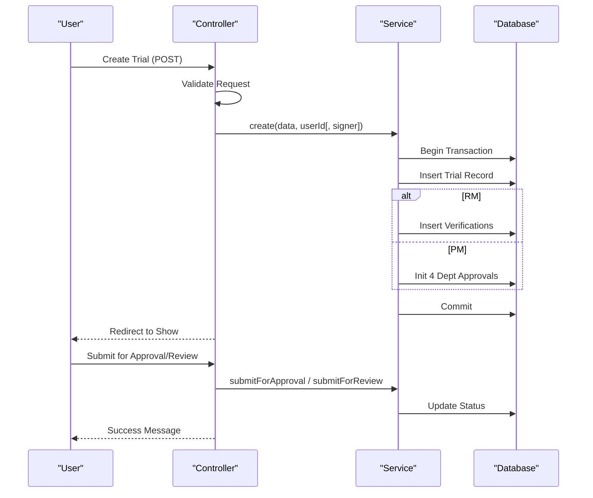
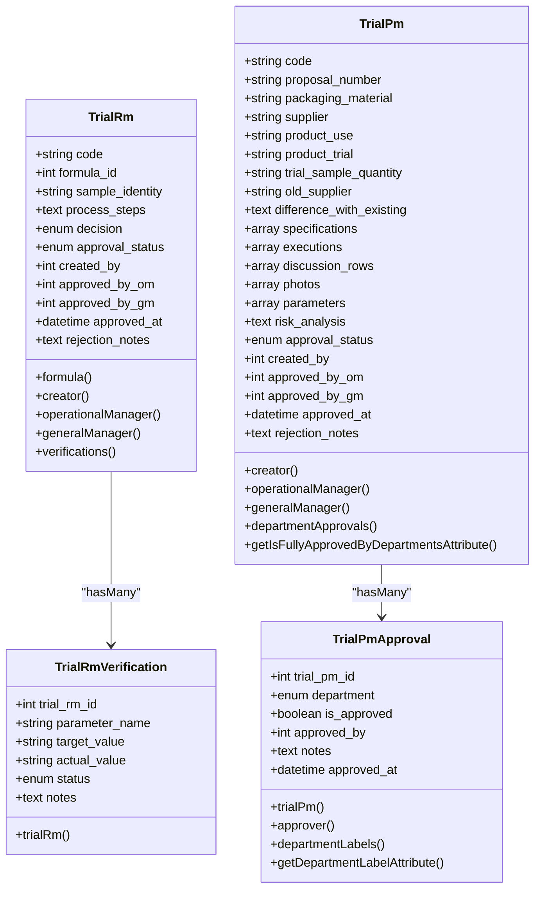
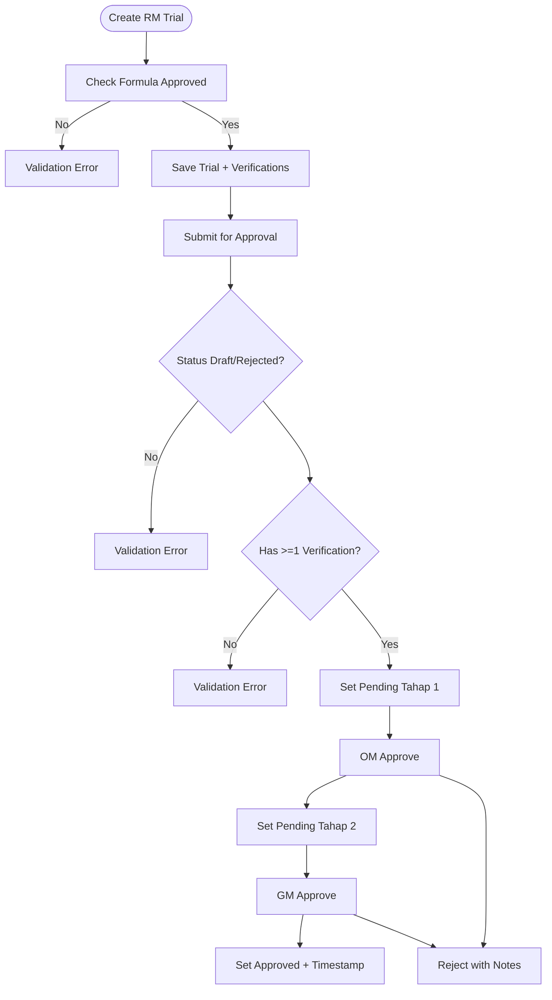
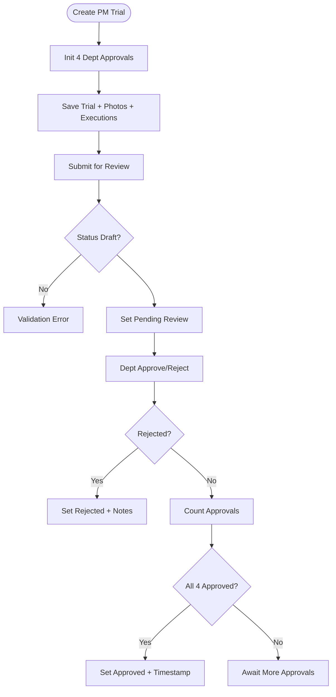
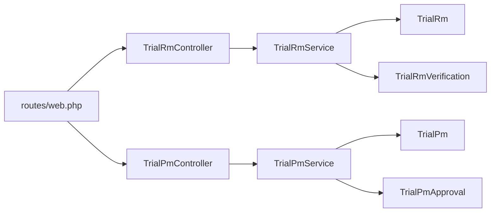

# Trial Management

<cite>
**Referenced Files in This Document**
- [TrialRm.php](file://app/Models/TrialRm.php)
- [TrialPm.php](file://app/Models/TrialPm.php)
- [TrialRmVerification.php](file://app/Models/TrialRmVerification.php)
- [TrialPmApproval.php](file://app/Models/TrialPmApproval.php)
- [TrialRmService.php](file://app/Services/TrialRmService.php)
- [TrialPmService.php](file://app/Services/TrialPmService.php)
- [TrialRmController.php](file://app/Http/Controllers/TrialRmController.php)
- [TrialPmController.php](file://app/Http/Controllers/TrialPmController.php)
- [web.php](file://routes/web.php)
- [2026_07_01_092849_create_trial_rms_table.php](file://database/migrations/2026_07_01_092849_create_trial_rms_table.php)
- [2026_07_01_092857_create_trial_rm_verifications_table.php](file://database/migrations/2026_07_01_092857_create_trial_rm_verifications_table.php)
- [2026_07_01_092905_create_trial_pms_table.php](file://database/migrations/2026_07_01_092905_create_trial_pms_table.php)
- [2026_07_01_092919_create_trial_pm_approvals_table.php](file://database/migrations/2026_07_01_092919_create_trial_pm_approvals_table.php)
- [create.blade.php (RM)](file://resources/views/trial-rms/create.blade.php)
- [create.blade.php (PM)](file://resources/views/trial-pms/create.blade.php)
- [print.blade.php (PM)](file://resources/views/trial-pms/print.blade.php)
</cite>

## Table of Contents
1. Introduction
2. Project Structure
3. Core Components
4. Architecture Overview
5. Detailed Component Analysis
6. Dependency Analysis
7. Performance Considerations
8. Troubleshooting Guide
9. Conclusion

## Introduction
This document explains the Trial Management system for both Raw Material (RM) and Packaging Material (PM) trials. It covers trial creation workflows, parameter verification systems, decision recording mechanisms, departmental approval processes, data models, business rules, service layer implementations, controller logic, view templates, file uploads, print functionality, and audit trail integration. The goal is to provide a comprehensive guide for developers and users to understand how RM and PM trials differ and how they are implemented end-to-end.

## Project Structure
The Trial Management feature spans Models, Services, Controllers, Routes, Views, and Database Migrations:
- Models define entities and relationships for RM and PM trials, verifications, and approvals.
- Services encapsulate business logic including code generation, validation, state transitions, and multi-department approvals.
- Controllers handle HTTP requests, authorization via Gates, request validation, and orchestrate services.
- Routes register endpoints with role-based middleware and Gate policies.
- Blade views implement user interfaces for creating, editing, showing, and printing PM trials.
- Migrations define database schemas for trials, verifications, and approvals.

**Diagram sources**
- [TrialRmController.php](file://app/Http/Controllers/TrialRmController.php)
- [TrialPmController.php](file://app/Http/Controllers/TrialPmController.php)
- [TrialRmService.php](file://app/Services/TrialRmService.php)
- [TrialPmService.php](file://app/Services/TrialPmService.php)
- [TrialRm.php](file://app/Models/TrialRm.php)
- [TrialRmVerification.php](file://app/Models/TrialRmVerification.php)
- [TrialPm.php](file://app/Models/TrialPm.php)
- [TrialPmApproval.php](file://app/Models/TrialPmApproval.php)
- [create.blade.php (RM)](file://resources/views/trial-rms/create.blade.php)
- [create.blade.php (PM)](file://resources/views/trial-pms/create.blade.php)
- [print.blade.php (PM)](file://resources/views/trial-pms/print.blade.php)
- [web.php](file://routes/web.php)

**Section sources**
- [web.php](file://routes/web.php)

## Core Components
- RM Trials: Track raw material testing against formulas, include parameter verifications, and follow a two-stage approval process (Operational Manager then General Manager).
- PM Trials: Track packaging material trials across four departments (R&D, QC, Production, Engineering), support dynamic execution records, digital paraf signatures, photo attachments, and a dedicated print form.

Key responsibilities:
- Service layer enforces business rules, state transitions, and cross-entity operations.
- Controllers validate input, enforce permissions, and delegate to services.
- Models define relationships, casts, and activity logging.
- Views provide interactive forms and printable outputs.

**Section sources**
- [TrialRmService.php](file://app/Services/TrialRmService.php)
- [TrialPmService.php](file://app/Services/TrialPmService.php)
- [TrialRmController.php](file://app/Http/Controllers/TrialRmController.php)
- [TrialPmController.php](file://app/Http/Controllers/TrialPmController.php)
- [TrialRm.php](file://app/Models/TrialRm.php)
- [TrialPm.php](file://app/Models/TrialPm.php)
- [TrialRmVerification.php](file://app/Models/TrialRmVerification.php)
- [TrialPmApproval.php](file://app/Models/TrialPmApproval.php)

## Architecture Overview
End-to-end flows for RM and PM trials:

**Diagram sources**
- [TrialRmController.php](file://app/Http/Controllers/TrialRmController.php)
- [TrialPmController.php](file://app/Http/Controllers/TrialPmController.php)
- [TrialRmService.php](file://app/Services/TrialRmService.php)
- [TrialPmService.php](file://app/Services/TrialPmService.php)

## Detailed Component Analysis

### Data Models and Relationships
- RM Trial Model:
  - Fields include code, formula_id, sample_identity, process_steps, decision, approval_status, created_by, approved_by_om, approved_by_gm, approved_at, rejection_notes.
  - Activity log configured to track changes to key fields.
  - Relationships: belongsTo Formula, User (creator, OM, GM); hasMany verifications.
- RM Verification Model:
  - Fields include trial_rm_id, parameter_name, target_value, actual_value, status, notes.
  - Relationship: belongsTo TrialRm.
- PM Trial Model:
  - Fields include code, proposal_number, packaging_material, supplier, product_use, product_trial, trial_sample_quantity, old_supplier, difference_with_existing, specifications, executions, discussion_rows, photos, parameters, risk_analysis, approval_status, created_by, approved_by_om, approved_by_gm, approved_at, rejection_notes.
  - Casts arrays for specifications, executions, discussion_rows, photos, parameters; datetime for approved_at.
  - Activity log tracks code, packaging_material, approval_status.
  - Relationships: belongsTo User (creator, OM, GM); hasMany departmentApprovals.
  - Helper attribute checks if all four departments approved.
- PM Approval Model:
  - Fields include trial_pm_id, department, is_approved, approved_by, notes, approved_at.
  - Department labels helper and attribute mapping.
  - Relationships: belongsTo TrialPm, belongsTo User (approver).

**Diagram sources**
- [TrialRm.php](file://app/Models/TrialRm.php)
- [TrialRmVerification.php](file://app/Models/TrialRmVerification.php)
- [TrialPm.php](file://app/Models/TrialPm.php)
- [TrialPmApproval.php](file://app/Models/TrialPmApproval.php)

**Section sources**
- [TrialRm.php](file://app/Models/TrialRm.php)
- [TrialRmVerification.php](file://app/Models/TrialRmVerification.php)
- [TrialPm.php](file://app/Models/TrialPm.php)
- [TrialPmApproval.php](file://app/Models/TrialPmApproval.php)

### Business Rules and State Transitions

#### RM Trial Workflow
- Creation:
  - Requires an Approved Formula.
  - Auto-generates code with suffix incrementing per formula reuse.
  - Saves verifications array.
- Submission:
  - Only Draft or Rejected can be submitted.
  - Requires at least one verification parameter.
  - Moves to Pending Tahap 1.
- Approval Stage 1 (Operational Manager):
  - Validates current status Pending Tahap 1.
  - Updates to Pending Tahap 2 and sets approver.
- Approval Stage 2 (General Manager):
  - Validates current status Pending Tahap 2.
  - Sets Approved, approver, and timestamp.
- Rejection:
  - Allowed from Pending stages; stores rejection notes.

**Diagram sources**
- [TrialRmService.php](file://app/Services/TrialRmService.php)

**Section sources**
- [TrialRmService.php](file://app/Services/TrialRmService.php)

#### PM Trial Workflow
- Creation:
  - Initializes four department approvals (RD, QC, Production, Engineering).
  - Supports dynamic execution rows with optional digital paraf metadata.
  - Handles photo uploads and persists paths.
- Submission:
  - Only Draft can be submitted.
  - Moves to Pending Review.
- Department Approval:
  - Any department can approve/reject while Pending Review.
  - If any department rejects, trial becomes Rejected immediately.
  - If all four departments approve, trial becomes Approved automatically.

**Diagram sources**
- [TrialPmService.php](file://app/Services/TrialPmService.php)

**Section sources**
- [TrialPmService.php](file://app/Services/TrialPmService.php)

### Controller Logic and Authorization
- RM Controller:
  - Index: lists trials with search and decision filters.
  - Create/Store: validates inputs, delegates to service, redirects to show.
  - Show: loads related data including activities for audit trail.
  - Edit/Update: validates and updates only Draft trials.
  - Destroy: deletes with permission check.
  - Submit: transitions to Pending Tahap 1 after validations.
- PM Controller:
  - Index: lists trials with search and status filters.
  - Create/Store: validates complex nested arrays, handles photo uploads, delegates to service.
  - Show: loads creator, department approvals, and activities.
  - Print: dedicated print view with loaded relations.
  - Edit/Update: validates and updates Draft trials, appends new photos.
  - Destroy: deletes with permission check.
  - Submit: transitions to Pending Review.
  - Approve: records department approval/rejection and updates status accordingly.

Authorization:
- All actions protected by Gates defined in policies (e.g., viewAny, create, edit, delete, submit, approve).

**Section sources**
- [TrialRmController.php](file://app/Http/Controllers/TrialRmController.php)
- [TrialPmController.php](file://app/Http/Controllers/TrialPmController.php)

### View Templates and User Workflows
- RM Create View:
  - Dynamic parameter verification rows with default standard parameters.
  - Decision selection (Lulus or Reformulasi).
  - Client-side row management using Alpine.js-like x-data.
- PM Create View:
  - Sectioned form matching official layout: A (Packaging Data), B (Specifications), C (Execution & Results), D (Discussion/Evaluation).
  - Dynamic tables for specifications, executions, and discussions.
  - Digital paraf checkboxes with signature display fallback.
  - Photo upload with multiple files and size/format constraints.
- PM Print View:
  - Multi-page print layout with fixed header/footer.
  - Tables for sections A–D, conclusion table per department, signature blocks.
  - Signature images or names rendered based on stored metadata.

**Section sources**
- [create.blade.php (RM)](file://resources/views/trial-rms/create.blade.php)
- [create.blade.php (PM)](file://resources/views/trial-pms/create.blade.php)
- [print.blade.php (PM)](file://resources/views/trial-pms/print.blade.php)

### File Upload Capabilities
- PM Trials:
  - Accepts multiple image files (JPEG, PNG, JPG, GIF) up to 5MB each.
  - Stores files under public disk path and persists relative URLs in the photos array.
  - On update, appends new photos to existing ones.
- RM Trials:
  - No direct photo/document upload in the analyzed controllers/services.

**Section sources**
- [TrialPmController.php](file://app/Http/Controllers/TrialPmController.php)

### Print Functionality
- PM Trials:
  - Dedicated print route renders a formal multi-page form aligned with company standards.
  - Includes headers/footers, sectioned content, department conclusions, and signature areas.
  - Uses CSS for print optimization and page breaks.

**Section sources**
- [TrialPmController.php](file://app/Http/Controllers/TrialPmController.php)
- [print.blade.php (PM)](file://resources/views/trial-pms/print.blade.php)

### Audit Trail Integration
- Both RM and PM models integrate Spatie Activity Log:
  - RM logs changes to code, sample_identity, decision, approval_status.
  - PM logs changes to code, packaging_material, approval_status.
- Controllers load activities when showing details, enabling visibility into who changed what and when.

**Section sources**
- [TrialRm.php](file://app/Models/TrialRm.php)
- [TrialPm.php](file://app/Models/TrialPm.php)
- [TrialRmController.php](file://app/Http/Controllers/TrialRmController.php)
- [TrialPmController.php](file://app/Http/Controllers/TrialPmController.php)

## Dependency Analysis
- Controllers depend on Services for business logic and Models for persistence.
- Services depend on Models and use transactions for consistency.
- Routes bind controllers with middleware and Gate policies.
- Views depend on Models for rendering and Blade components for UI.

**Diagram sources**
- [web.php](file://routes/web.php)
- [TrialRmController.php](file://app/Http/Controllers/TrialRmController.php)
- [TrialPmController.php](file://app/Http/Controllers/TrialPmController.php)
- [TrialRmService.php](file://app/Services/TrialRmService.php)
- [TrialPmService.php](file://app/Services/TrialPmService.php)
- [TrialRm.php](file://app/Models/TrialRm.php)
- [TrialRmVerification.php](file://app/Models/TrialRmVerification.php)
- [TrialPm.php](file://app/Models/TrialPm.php)
- [TrialPmApproval.php](file://app/Models/TrialPmApproval.php)

**Section sources**
- [web.php](file://routes/web.php)

## Performance Considerations
- Use eager loading for related data in list/show pages to reduce N+1 queries.
- Keep validation minimal and server-side robust; avoid heavy client-side processing for large datasets.
- For PM print view, consider lazy-loading images or limiting attachment sizes to improve rendering speed.
- Ensure database indexes on frequently filtered columns (e.g., approval_status, code) to optimize searches.

[No sources needed since this section provides general guidance]

## Troubleshooting Guide
Common issues and resolutions:
- Validation errors during submission:
  - RM: Missing verifications or invalid statuses will block submission.
  - PM: Invalid nested arrays or missing required fields will prevent save.
- State transition errors:
  - Attempting to submit non-Draft trials or approve outside Pending states will throw validation exceptions.
- File upload failures:
  - Ensure storage disk configuration allows writing to public path and that file types/sizes comply with validation rules.
- Permission denied:
  - Verify user roles and Gate policies allow the requested action.

**Section sources**
- [TrialRmService.php](file://app/Services/TrialRmService.php)
- [TrialPmService.php](file://app/Services/TrialPmService.php)
- [TrialRmController.php](file://app/Http/Controllers/TrialRmController.php)
- [TrialPmController.php](file://app/Http/Controllers/TrialPmController.php)

## Conclusion
The Trial Management system provides structured workflows for RM and PM trials with clear separation of concerns:
- RM focuses on parameter verification and two-stage managerial approvals tied to formulas.
- PM emphasizes multi-department collaboration, detailed execution records, digital paraf signatures, photo attachments, and a formal print form.
Both leverage robust validation, transactional integrity, and audit trails to ensure traceability and compliance.

[No sources needed since this section summarizes without analyzing specific files]