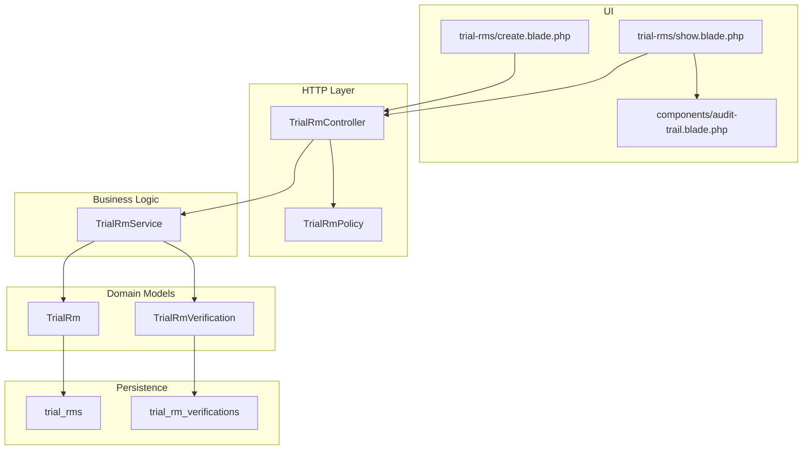
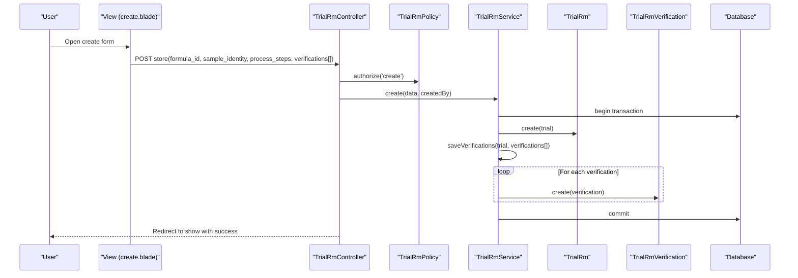
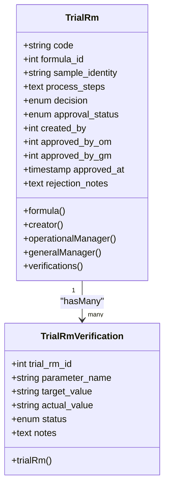
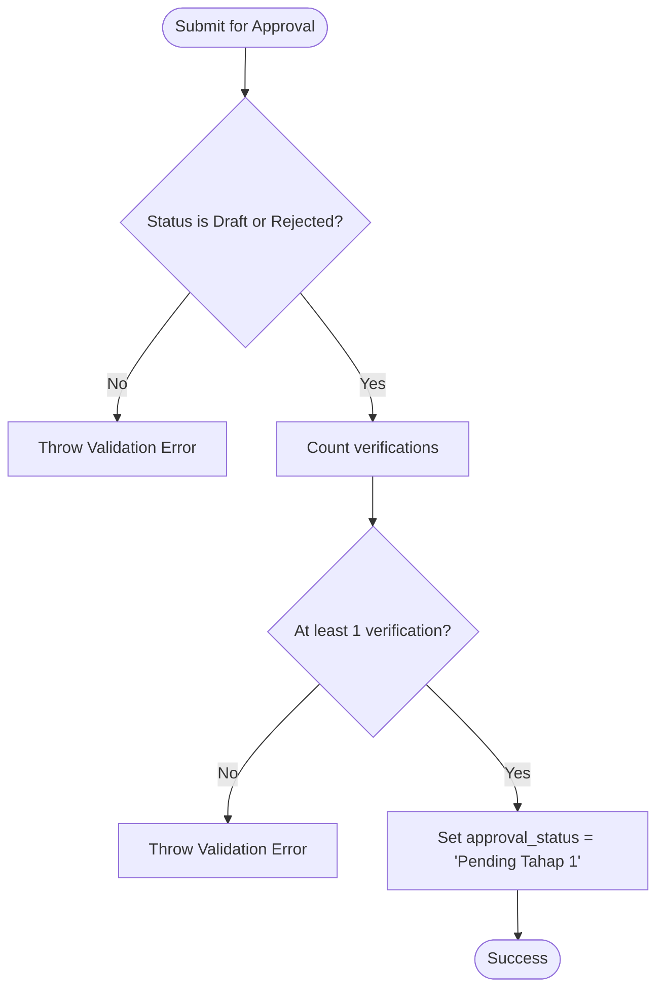
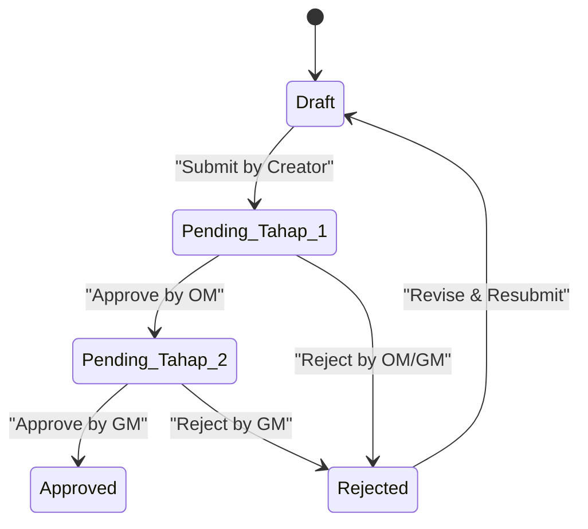
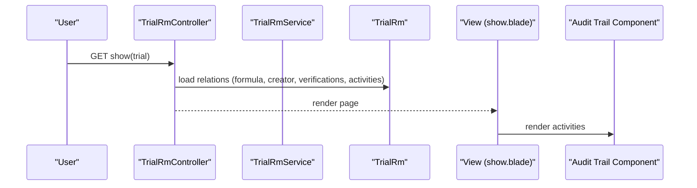
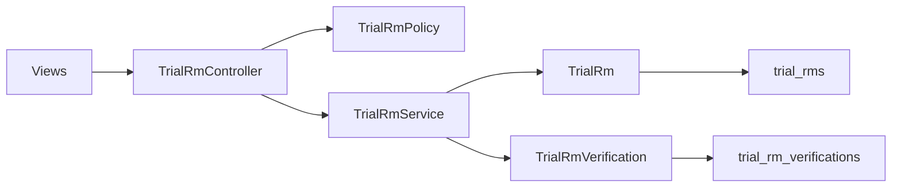

# Trial Verification System

<cite>
**Referenced Files in This Document**
- [TrialRm.php](file://app/Models/TrialRm.php)
- [TrialRmVerification.php](file://app/Models/TrialRmVerification.php)
- [TrialRmService.php](file://app/Services/TrialRmService.php)
- [TrialRmController.php](file://app/Http/Controllers/TrialRmController.php)
- [TrialRmPolicy.php](file://app/Policies/TrialRmPolicy.php)
- [2026_07_01_092849_create_trial_rms_table.php](file://database/migrations/2026_07_01_092849_create_trial_rms_table.php)
- [2026_07_01_092857_create_trial_rm_verifications_table.php](file://database/migrations/2026_07_01_092857_create_trial_rm_verifications_table.php)
- [create.blade.php](file://resources/views/trial-rms/create.blade.php)
- [show.blade.php](file://resources/views/trial-rms/show.blade.php)
- [audit-trail.blade.php](file://resources/views/components/audit-trail.blade.php)
- [rules.md](file://rules.md)
</cite>

## Table of Contents
1. Introduction
2. Project Structure
3. Core Components
4. Architecture Overview
5. Detailed Component Analysis
6. Dependency Analysis
7. Performance Considerations
8. Troubleshooting Guide
9. Conclusion

## Introduction
This document explains the Trial Verification System for raw material (RM) trials. It covers the verification data model, validation rules, and business logic for parameter checking; the end-to-end workflow including who can perform verifications, required parameters, pass/fail criteria, and escalation procedures; integration with trial management, status updates, and audit trail generation; practical examples for creating verifications, handling failures, managing re-verifications, and generating reports; as well as data integrity constraints, error handling, and compliance considerations for pharmaceutical testing.

## Project Structure
The Trial Verification System is implemented as a Laravel application with:
- Models representing trials and their verifications
- A service layer encapsulating business rules and state transitions
- A controller enforcing authorization and request validation
- Policies defining RBAC permissions
- Database migrations defining schema and constraints
- Views providing UI for creation, editing, display, and audit trails

**Diagram sources**
- [TrialRmController.php:1-189](file://app/Http/Controllers/TrialRmController.php#L1-L189)
- [TrialRmPolicy.php:1-64](file://app/Policies/TrialRmPolicy.php#L1-L64)
- [TrialRmService.php:1-202](file://app/Services/TrialRmService.php#L1-L202)
- [TrialRm.php:1-64](file://app/Models/TrialRm.php#L1-L64)
- [TrialRmVerification.php:1-24](file://app/Models/TrialRmVerification.php#L1-L24)
- [2026_07_01_092849_create_trial_rms_table.php:1-39](file://database/migrations/2026_07_01_092849_create_trial_rms_table.php#L1-L39)
- [2026_07_01_092857_create_trial_rm_verifications_table.php:1-34](file://database/migrations/2026_07_01_092857_create_trial_rm_verifications_table.php#L1-L34)
- [create.blade.php:1-199](file://resources/views/trial-rms/create.blade.php#L1-L199)
- [show.blade.php:1-244](file://resources/views/trial-rms/show.blade.php#L1-L244)
- [audit-trail.blade.php:1-46](file://resources/views/components/audit-trail.blade.php#L1-L46)

**Section sources**
- [TrialRmController.php:1-189](file://app/Http/Controllers/TrialRmController.php#L1-L189)
- [TrialRmService.php:1-202](file://app/Services/TrialRmService.php#L1-L202)
- [TrialRm.php:1-64](file://app/Models/TrialRm.php#L1-L64)
- [TrialRmVerification.php:1-24](file://app/Models/TrialRmVerification.php#L1-L24)
- [2026_07_01_092849_create_trial_rms_table.php:1-39](file://database/migrations/2026_07_01_092849_create_trial_rms_table.php#L1-L39)
- [2026_07_01_092857_create_trial_rm_verifications_table.php:1-34](file://database/migrations/2026_07_01_092857_create_trial_rm_verifications_table.php#L1-L34)
- [create.blade.php:1-199](file://resources/views/trial-rms/create.blade.php#L1-L199)
- [show.blade.php:1-244](file://resources/views/trial-rms/show.blade.php#L1-L244)
- [audit-trail.blade.php:1-46](file://resources/views/components/audit-trail.blade.php#L1-L46)

## Core Components
- Data Model
  - TrialRm: Represents a raw material trial record with code, formula linkage, sample identity, process steps, decision, approval lifecycle fields, and timestamps.
  - TrialRmVerification: Represents individual parameter checks linked to a trial, capturing parameter name, target specification, actual result, outcome status, and notes.
- Service Layer
  - TrialRmService: Encapsulates business rules for creating/updating trials, submitting for approval, multi-stage approvals, rejection, and saving verifications.
- Controller Layer
  - TrialRmController: Handles HTTP requests, enforces authorization via policies, validates inputs, and delegates to the service.
- Policy Layer
  - TrialRmPolicy: Defines RBAC permissions for viewing, creating, editing, deleting, submitting, and approving trials based on roles and current status.
- Persistence
  - Migrations define tables and constraints ensuring referential integrity and enumerated states.
- UI
  - Create/Edit views allow dynamic addition of verification parameters.
  - Show view renders verification results, approval timeline, and audit trail.

**Section sources**
- [TrialRm.php:1-64](file://app/Models/TrialRm.php#L1-L64)
- [TrialRmVerification.php:1-24](file://app/Models/TrialRmVerification.php#L1-L24)
- [TrialRmService.php:1-202](file://app/Services/TrialRmService.php#L1-L202)
- [TrialRmController.php:1-189](file://app/Http/Controllers/TrialRmController.php#L1-L189)
- [TrialRmPolicy.php:1-64](file://app/Policies/TrialRmPolicy.php#L1-L64)
- [2026_07_01_092849_create_trial_rms_table.php:1-39](file://database/migrations/2026_07_01_092849_create_trial_rms_table.php#L1-L39)
- [2026_07_01_092857_create_trial_rm_verifications_table.php:1-34](file://database/migrations/2026_07_01_092857_create_trial_rm_verifications_table.php#L1-L34)
- [create.blade.php:1-199](file://resources/views/trial-rms/create.blade.php#L1-L199)
- [show.blade.php:1-244](file://resources/views/trial-rms/show.blade.php#L1-L244)

## Architecture Overview
The system follows a layered architecture:
- UI triggers actions through controllers
- Controllers enforce authorization and validate input
- Services implement business logic and orchestrate persistence
- Models represent domain entities and relationships
- Migrations ensure database integrity and constraints

**Diagram sources**
- [TrialRmController.php:71-97](file://app/Http/Controllers/TrialRmController.php#L71-L97)
- [TrialRmPolicy.php:20-23](file://app/Policies/TrialRmPolicy.php#L20-L23)
- [TrialRmService.php:55-81](file://app/Services/TrialRmService.php#L55-L81)
- [TrialRm.php:59-62](file://app/Models/TrialRm.php#L59-L62)
- [TrialRmVerification.php:19-22](file://app/Models/TrialRmVerification.php#L19-L22)

## Detailed Component Analysis

### Verification Data Model
- TrialRm
  - Key attributes include unique code, formula reference, sample identity, process steps, decision, approval_status, approver references, approved timestamp, and rejection notes.
  - Relationships: belongsTo Formula, belongsTo User (creator), belongsTo User (OM approver), belongsTo User (GM approver), hasMany TrialRmVerification.
  - Activity logging enabled for key fields to support audit trails.
- TrialRmVerification
  - Attributes: trial_rm_id, parameter_name, target_value, actual_value, status (Pass/Fail/Warning), notes.
  - Relationship: belongsTo TrialRm.

**Diagram sources**
- [TrialRm.php:13-62](file://app/Models/TrialRm.php#L13-L62)
- [TrialRmVerification.php:9-22](file://app/Models/TrialRmVerification.php#L9-L22)

**Section sources**
- [TrialRm.php:1-64](file://app/Models/TrialRm.php#L1-L64)
- [TrialRmVerification.php:1-24](file://app/Models/TrialRmVerification.php#L1-L24)

### Validation Rules and Business Logic
- Request-level validation (controller):
  - Required fields: formula_id, sample_identity, process_steps.
  - Verifications array items require parameter_name, target_value, status; actual_value and notes are optional.
  - Status must be one of Pass, Fail, Warning.
- Service-level business rules:
  - Creation requires an Approved formula; otherwise throws validation errors.
  - Update allowed only when trial is Draft.
  - Submission requires at least one verification; sets status to Pending Tahap 1.
  - Approval stages:
    - Tahap 1: Operational Manager approves, moves to Pending Tahap 2.
    - Tahap 2: General Manager approves, marks Approved with timestamp.
  - Rejection: Allowed from either pending stage; records rejection notes.
  - Verification persistence: Deletes existing verifications and recreates them from submitted data; skips empty parameter entries.

**Diagram sources**
- [TrialRmService.php:110-125](file://app/Services/TrialRmService.php#L110-L125)

**Section sources**
- [TrialRmController.php:75-86](file://app/Http/Controllers/TrialRmController.php#L75-L86)
- [TrialRmController.php:134-144](file://app/Http/Controllers/TrialRmController.php#L134-L144)
- [TrialRmService.php:55-81](file://app/Services/TrialRmService.php#L55-L81)
- [TrialRmService.php:86-105](file://app/Services/TrialRmService.php#L86-L105)
- [TrialRmService.php:110-125](file://app/Services/TrialRmService.php#L110-L125)
- [TrialRmService.php:130-142](file://app/Services/TrialRmService.php#L130-L142)
- [TrialRmService.php:147-160](file://app/Services/TrialRmService.php#L147-L160)
- [TrialRmService.php:165-177](file://app/Services/TrialRmService.php#L165-L177)
- [TrialRmService.php:182-200](file://app/Services/TrialRmService.php#L182-L200)

### Workflow: Who Can Perform Verifications and Approvals
- Roles and permissions:
  - Staff R&D: Create, edit (Draft/Rejected), delete (Draft), submit for approval.
  - Operational Manager: Approve Tahap 1.
  - General Manager: Approve Tahap 2 (final).
- Workflow states:
  - Draft → Pending Tahap 1 → Pending Tahap 2 → Approved
  - Any pending stage can be Rejected with notes.
- Escalation:
  - If rejected, creator can revise and resubmit.
  - Decision field indicates Lulus or Reformulasi; reformulation may trigger new formula versioning per business rules.

**Diagram sources**
- [TrialRmPolicy.php:44-62](file://app/Policies/TrialRmPolicy.php#L44-L62)
- [TrialRmService.php:110-177](file://app/Services/TrialRmService.php#L110-L177)

**Section sources**
- [TrialRmPolicy.php:1-64](file://app/Policies/TrialRmPolicy.php#L1-L64)
- [TrialRmService.php:110-177](file://app/Services/TrialRmService.php#L110-L177)
- [rules.md:29-36](file://rules.md#L29-L36)

### Integration with Trial Management and Status Updates
- The controller loads related data (formula, creator, verifications, activities) for display.
- Approval timeline component visualizes current step and approvers.
- Audit trail displays activity log entries with user attribution and change details.

**Diagram sources**
- [TrialRmController.php:102-109](file://app/Http/Controllers/TrialRmController.php#L102-L109)
- [show.blade.php:102-109](file://resources/views/trial-rms/show.blade.php#L102-L109)
- [audit-trail.blade.php:1-46](file://resources/views/components/audit-trail.blade.php#L1-L46)

**Section sources**
- [TrialRmController.php:102-109](file://app/Http/Controllers/TrialRmController.php#L102-L109)
- [show.blade.php:184-240](file://resources/views/trial-rms/show.blade.php#L184-L240)
- [audit-trail.blade.php:1-46](file://resources/views/components/audit-trail.blade.php#L1-L46)

### Practical Examples

- Creating verifications
  - Use the create view to add multiple parameter rows with parameter_name, target_value, actual_value (optional), status, and notes (optional).
  - Submitting creates a trial and persists all verifications atomically within a transaction.
  - Reference: [create.blade.php:95-125](file://resources/views/trial-rms/create.blade.php#L95-L125), [TrialRmService.php:55-81](file://app/Services/TrialRmService.php#L55-L81)

- Handling validation failures
  - Missing required fields or invalid statuses return errors back to the form with preserved input.
  - Service-level validations (e.g., formula must be Approved, at least one verification before submission) throw structured validation exceptions caught by the controller.
  - Reference: [TrialRmController.php:75-92](file://app/Http/Controllers/TrialRmController.php#L75-L92), [TrialRmService.php:55-81](file://app/Services/TrialRmService.php#L55-L81)

- Managing re-verifications
  - When rejected, creator can edit the draft, update verifications, and resubmit.
  - Updating deletes previous verifications and saves new ones.
  - Reference: [TrialRmService.php:86-105](file://app/Services/TrialRmService.php#L86-L105), [TrialRmService.php:182-200](file://app/Services/TrialRmService.php#L182-L200)

- Generating verification reports
  - The show view lists all verifications with target vs actual values and status badges.
  - Audit trail shows changes over time for compliance review.
  - Reference: [show.blade.php:66-108](file://resources/views/trial-rms/show.blade.php#L66-L108), [audit-trail.blade.php:1-46](file://resources/views/components/audit-trail.blade.php#L1-L46)

**Section sources**
- [create.blade.php:95-125](file://resources/views/trial-rms/create.blade.php#L95-L125)
- [TrialRmController.php:75-92](file://app/Http/Controllers/TrialRmController.php#L75-L92)
- [TrialRmService.php:55-81](file://app/Services/TrialRmService.php#L55-L81)
- [TrialRmService.php:86-105](file://app/Services/TrialRmService.php#L86-L105)
- [TrialRmService.php:182-200](file://app/Services/TrialRmService.php#L182-L200)
- [show.blade.php:66-108](file://resources/views/trial-rms/show.blade.php#L66-L108)
- [audit-trail.blade.php:1-46](file://resources/views/components/audit-trail.blade.php#L1-L46)

### Compliance Requirements for Pharmaceutical Testing
- Parameter tracking: Each verification captures target specifications and actual results with status and notes for traceability.
- Approval governance: Two-stage approval ensures oversight by operational and general management.
- Auditability: Activity logging records key attribute changes and user actions.
- Referential integrity: Foreign keys link trials to formulas and users, preventing orphaned records.
- Business rules alignment: Follows documented rules for RM trials, including linking to approved formulas and suffix-based iteration.

**Section sources**
- [2026_07_01_092849_create_trial_rms_table.php:14-28](file://database/migrations/2026_07_01_092849_create_trial_rms_table.php#L14-L28)
- [2026_07_01_092857_create_trial_rm_verifications_table.php:14-23](file://database/migrations/2026_07_01_092857_create_trial_rm_verifications_table.php#L14-L23)
- [TrialRm.php:31-36](file://app/Models/TrialRm.php#L31-L36)
- [rules.md:29-36](file://rules.md#L29-L36)

## Dependency Analysis
Key dependencies and relationships:
- Controller depends on Policy for authorization and Service for business logic.
- Service depends on Models for persistence and uses transactions for consistency.
- Models define relationships to other entities (Formula, User) and to verifications.
- Views depend on models and components for rendering.

**Diagram sources**
- [TrialRmController.php:1-189](file://app/Http/Controllers/TrialRmController.php#L1-L189)
- [TrialRmPolicy.php:1-64](file://app/Policies/TrialRmPolicy.php#L1-L64)
- [TrialRmService.php:1-202](file://app/Services/TrialRmService.php#L1-L202)
- [TrialRm.php:1-64](file://app/Models/TrialRm.php#L1-L64)
- [TrialRmVerification.php:1-24](file://app/Models/TrialRmVerification.php#L1-L24)

**Section sources**
- [TrialRmController.php:1-189](file://app/Http/Controllers/TrialRmController.php#L1-L189)
- [TrialRmService.php:1-202](file://app/Services/TrialRmService.php#L1-L202)
- [TrialRm.php:1-64](file://app/Models/TrialRm.php#L1-L64)
- [TrialRmVerification.php:1-24](file://app/Models/TrialRmVerification.php#L1-L24)

## Performance Considerations
- Use eager loading for related data in list/detail views to reduce N+1 queries.
- Keep verification arrays small and avoid excessive DOM operations in the UI.
- Leverage database indexes where appropriate (e.g., foreign keys already defined).
- Batch operations where possible; the service currently deletes and recreates verifications per update—consider diffing if performance becomes critical.

[No sources needed since this section provides general guidance]

## Troubleshooting Guide
Common issues and resolutions:
- Cannot submit because no verifications exist: Ensure at least one verification row is present with a valid parameter_name and status.
- Cannot edit after submission: Only Draft or Rejected trials can be edited by the creator; wait for rejection or escalate.
- Approval errors: Verify current approval_status matches expected stage for the approver role.
- Validation errors on create/update: Check required fields and allowed enum values for status.

Operational pointers:
- Review audit trail for recent changes and causer attribution.
- Inspect rejection notes to understand reasons for denial.

**Section sources**
- [TrialRmService.php:110-125](file://app/Services/TrialRmService.php#L110-L125)
- [TrialRmService.php:130-142](file://app/Services/TrialRmService.php#L130-L142)
- [TrialRmService.php:147-160](file://app/Services/TrialRmService.php#L147-L160)
- [TrialRmService.php:165-177](file://app/Services/TrialRmService.php#L165-L177)
- [show.blade.php:222-230](file://resources/views/trial-rms/show.blade.php#L222-L230)
- [audit-trail.blade.php:1-46](file://resources/views/components/audit-trail.blade.php#L1-L46)

## Conclusion
The Trial Verification System provides a robust framework for validating raw material trial parameters, enforcing multi-stage approvals, and maintaining comprehensive audit trails. Its layered design separates concerns across UI, controller, service, and model layers, while database constraints ensure data integrity. The system supports practical workflows for creating verifications, handling failures, managing re-verifications, and producing readable reports suitable for pharmaceutical compliance.

[No sources needed since this section summarizes without analyzing specific files]