# User Management

<cite>
**Referenced Files in This Document**
- [UserController.php](file://app/Http/Controllers/UserController.php)
- [User.php](file://app/Models/User.php)
- [RoleMiddleware.php](file://app/Http/Middleware/RoleMiddleware.php)
- [web.php](file://routes/web.php)
- [permission.php](file://config/permission.php)
- [2026_07_01_092410_create_permission_tables.php](file://database/migrations/2026_07_01_092410_create_permission_tables.php)
- [0001_01_01_000000_create_users_table.php](file://database/migrations/0001_01_01_000000_create_users_table.php)
- [2026_07_02_044109_add_signature_path_to_users_table.php](file://database/migrations/2026_07_02_044109_add_signature_path_to_users_table.php)
- [RolePermissionSeeder.php](file://database/seeders/RolePermissionSeeder.php)
- [UserSeeder.php](file://database/seeders/UserSeeder.php)
- [ProfileController.php](file://app/Http/Controllers/ProfileController.php)
- [index.blade.php (users)](file://resources/views/users/index.blade.php)
- [create.blade.php (users)](file://resources/views/users/create.blade.php)
- [edit.blade.php (users)](file://resources/views/users/edit.blade.php)
</cite>

## Table of Contents
1. Introduction
2. Project Structure
3. Core Components
4. Architecture Overview
5. Detailed Component Analysis
6. Dependency Analysis
7. Performance Considerations
8. Troubleshooting Guide
9. Conclusion

## Introduction
This document explains the User Management system, including user administration, role assignment and management, permission configuration, and the user lifecycle from creation to deactivation. It also documents integration with the role-based access control (RBAC) system, how users inherit permissions via roles, and provides practical examples for creating users, assigning roles, managing profiles, and performing bulk operations. Finally, it covers the seeder system used for initial setup of roles, permissions, and sample users.

## Project Structure
The User Management feature is implemented using a standard Laravel MVC pattern:
- Controllers handle HTTP requests for listing, creating, editing, and deleting users.
- Views provide the admin interface for user management and profile updates.
- Middleware enforces role-based access at the route level.
- Models integrate with the RBAC package to manage roles and permissions.
- Migrations define database tables for users and RBAC structures.
- Seeders initialize roles, permissions, and sample users.

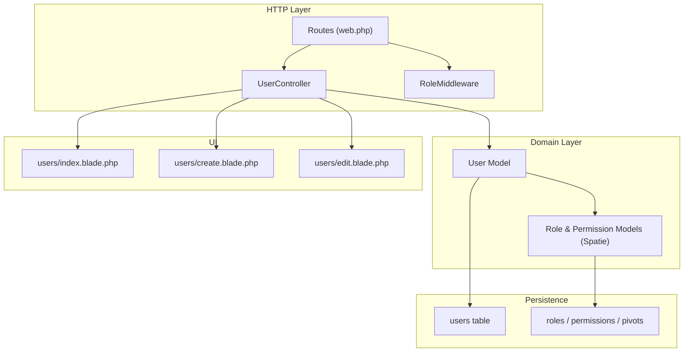

**Diagram sources**
- [web.php:81-86](file://routes/web.php#L81-L86)
- [UserController.php:13-120](file://app/Http/Controllers/UserController.php#L13-L120)
- [RoleMiddleware.php:16-33](file://app/Http/Middleware/RoleMiddleware.php#L16-L33)
- [User.php:16-49](file://app/Models/User.php#L16-L49)
- [index.blade.php (users):1-96](file://resources/views/users/index.blade.php#L1-L96)
- [create.blade.php (users):1-68](file://resources/views/users/create.blade.php#L1-L68)
- [edit.blade.php (users):1-76](file://resources/views/users/edit.blade.php#L1-L76)
- [2026_07_01_092410_create_permission_tables.php:12-120](file://database/migrations/2026_07_01_092410_create_permission_tables.php#L12-L120)
- [0001_01_01_000000_create_users_table.php:12-38](file://database/migrations/0001_01_01_000000_create_users_table.php#L12-L38)

**Section sources**
- [web.php:81-91](file://routes/web.php#L81-L91)
- [UserController.php:13-120](file://app/Http/Controllers/UserController.php#L13-L120)
- [RoleMiddleware.php:16-33](file://app/Http/Middleware/RoleMiddleware.php#L16-L33)
- [User.php:16-49](file://app/Models/User.php#L16-L49)
- [index.blade.php (users):1-96](file://resources/views/users/index.blade.php#L1-L96)
- [create.blade.php (users):1-68](file://resources/views/users/create.blade.php#L1-L68)
- [edit.blade.php (users):1-76](file://resources/views/users/edit.blade.php#L1-L76)
- [2026_07_01_092410_create_permission_tables.php:12-120](file://database/migrations/2026_07_01_092410_create_permission_tables.php#L12-L120)
- [0001_01_01_000000_create_users_table.php:12-38](file://database/migrations/0001_01_01_000000_create_users_table.php#L12-L38)

## Core Components
- User Administration Interface
  - List users with pagination and role badges.
  - Create new users with name, email, password, and role assignment.
  - Edit existing users to update profile fields, reset password, and change role.
  - Delete users with protection against self-deletion.
- Role Assignment and Management
  - Roles are assigned or changed through the edit form; only Superadmin can perform these actions.
  - The controller uses syncRoles to ensure the user has exactly one role as enforced by the UI.
- Permission Configuration Tools
  - Permissions are defined and seeded via the RolePermissionSeeder.
  - Routes use middleware to enforce permissions on features like formulas, trials, and approval center.
- User Lifecycle
  - Creation: validated input, hashed password, immediate email verification flag, role assignment.
  - Profile Management: personal profile updates and optional signature upload handled by ProfileController.
  - Deactivation: administrative deletion via UserController; self-deletion blocked.
- RBAC Integration
  - User model integrates HasRoles trait.
  - Route-level checks via role middleware and policy-like permission checks on routes.
  - Users inherit permissions from their assigned roles.

**Section sources**
- [UserController.php:13-120](file://app/Http/Controllers/UserController.php#L13-L120)
- [RolePermissionSeeder.php:14-110](file://database/seeders/RolePermissionSeeder.php#L14-L110)
- [web.php:23-91](file://routes/web.php#L23-L91)
- [User.php:16-49](file://app/Models/User.php#L16-L49)
- [ProfileController.php:17-70](file://app/Http/Controllers/ProfileController.php#L17-L70)

## Architecture Overview
The system combines route-level authorization with Spatie’s RBAC to control access. Administrators interact with the User Management views, which call controller methods that validate inputs, persist changes, and assign roles. Permissions are configured centrally in seeders and enforced on routes.

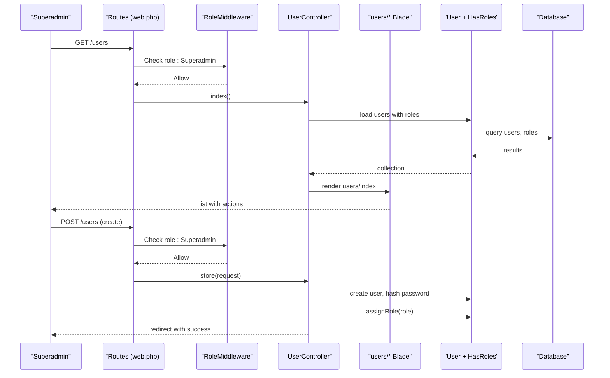

**Diagram sources**
- [web.php:81-86](file://routes/web.php#L81-L86)
- [RoleMiddleware.php:16-33](file://app/Http/Middleware/RoleMiddleware.php#L16-L33)
- [UserController.php:13-59](file://app/Http/Controllers/UserController.php#L13-L59)
- [User.php:16-49](file://app/Models/User.php#L16-L49)
- [index.blade.php (users):1-96](file://resources/views/users/index.blade.php#L1-L96)

## Detailed Component Analysis

### User Controller
Responsibilities:
- Enforce Superadmin-only access for all user management endpoints.
- Validate inputs for create/update flows.
- Persist user data and manage roles.
- Prevent self-deletion.

Key behaviors:
- Listing: loads users with roles and paginates.
- Creating: validates required fields, hashes password, sets email verified, assigns role.
- Updating: allows optional password reset; ensures unique email per user; syncs role to a single value.
- Deleting: protects current user from deletion; returns success/error messages.

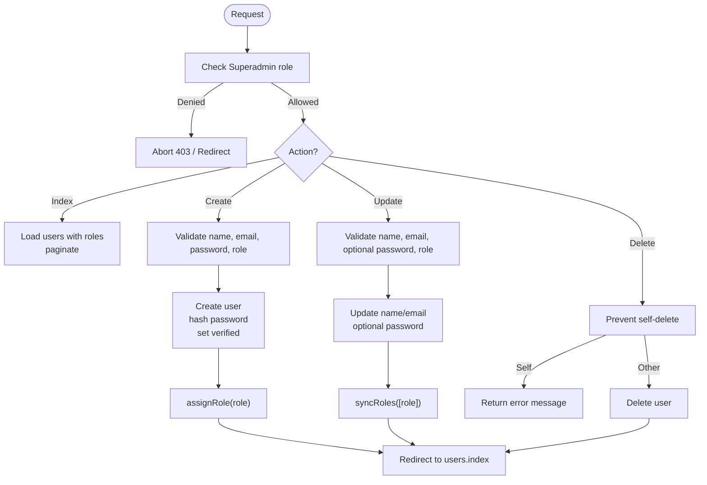

**Diagram sources**
- [UserController.php:13-120](file://app/Http/Controllers/UserController.php#L13-L120)

**Section sources**
- [UserController.php:13-120](file://app/Http/Controllers/UserController.php#L13-L120)

### User Model and RBAC Integration
- Integrates HasRoles trait to support role assignment and checking.
- Casts password and datetime fields appropriately.
- Provides relationships to domain entities (formulas, trials).

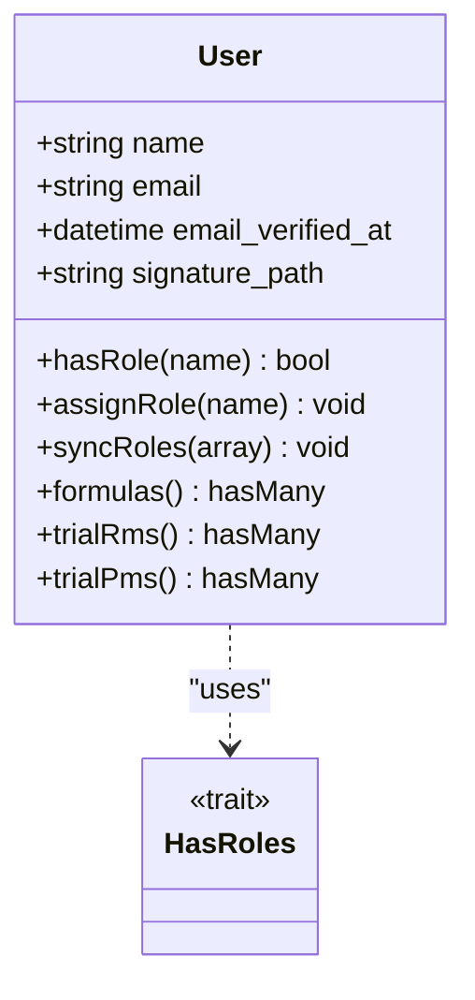

**Diagram sources**
- [User.php:16-49](file://app/Models/User.php#L16-L49)

**Section sources**
- [User.php:16-49](file://app/Models/User.php#L16-L49)

### Role Middleware
- Ensures unauthenticated users are redirected to login.
- Allows access if the user has any of the specified roles.
- Otherwise redirects to dashboard with an error message.

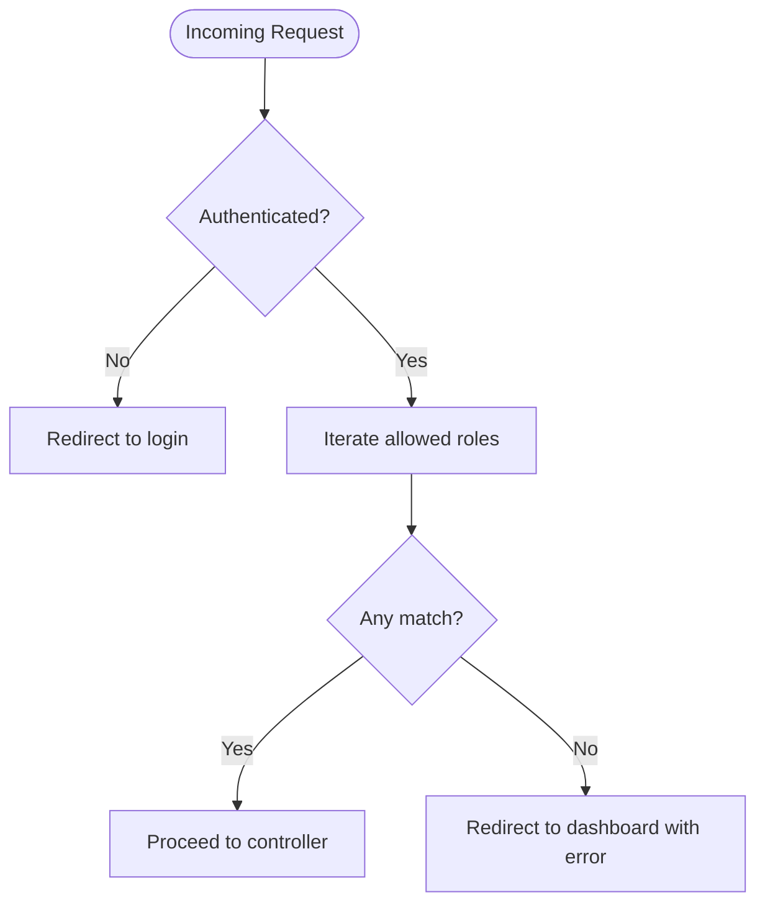

**Diagram sources**
- [RoleMiddleware.php:16-33](file://app/Http/Middleware/RoleMiddleware.php#L16-L33)

**Section sources**
- [RoleMiddleware.php:16-33](file://app/Http/Middleware/RoleMiddleware.php#L16-L33)

### Routes and Authorization
- User Management routes are grouped under auth and verified middleware and protected by role:Superadmin.
- Other features use permission-based middleware (can:...) to restrict access based on roles’ permissions.

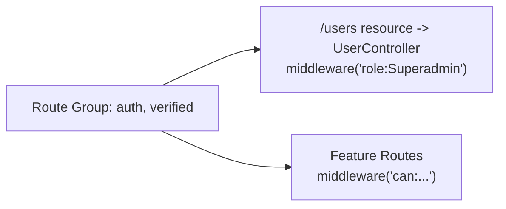

**Diagram sources**
- [web.php:23-91](file://routes/web.php#L23-L91)

**Section sources**
- [web.php:23-91](file://routes/web.php#L23-L91)

### User Administration Views
- Index: lists users with role badges, shows creation link, and delete action (excluding self).
- Create: collects name, email, role, and password confirmation.
- Edit: allows updating name, email, resetting password, and changing role.

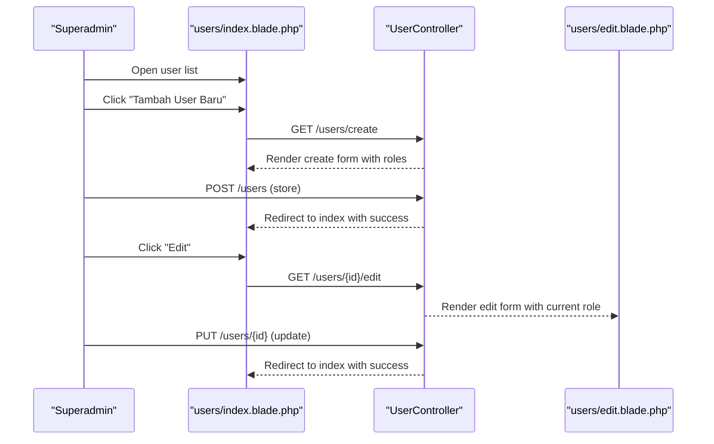

**Diagram sources**
- [index.blade.php (users):1-96](file://resources/views/users/index.blade.php#L1-L96)
- [create.blade.php (users):1-68](file://resources/views/users/create.blade.php#L1-L68)
- [edit.blade.php (users):1-76](file://resources/views/users/edit.blade.php#L1-L76)
- [UserController.php:24-101](file://app/Http/Controllers/UserController.php#L24-L101)

**Section sources**
- [index.blade.php (users):1-96](file://resources/views/users/index.blade.php#L1-L96)
- [create.blade.php (users):1-68](file://resources/views/users/create.blade.php#L1-L68)
- [edit.blade.php (users):1-76](file://resources/views/users/edit.blade.php#L1-L76)
- [UserController.php:24-101](file://app/Http/Controllers/UserController.php#L24-L101)

### Profile Management
- Users can update personal information and optionally upload a signature image.
- Email changes clear the verified timestamp to re-verify.
- Account deletion requires password confirmation and logs out the user.

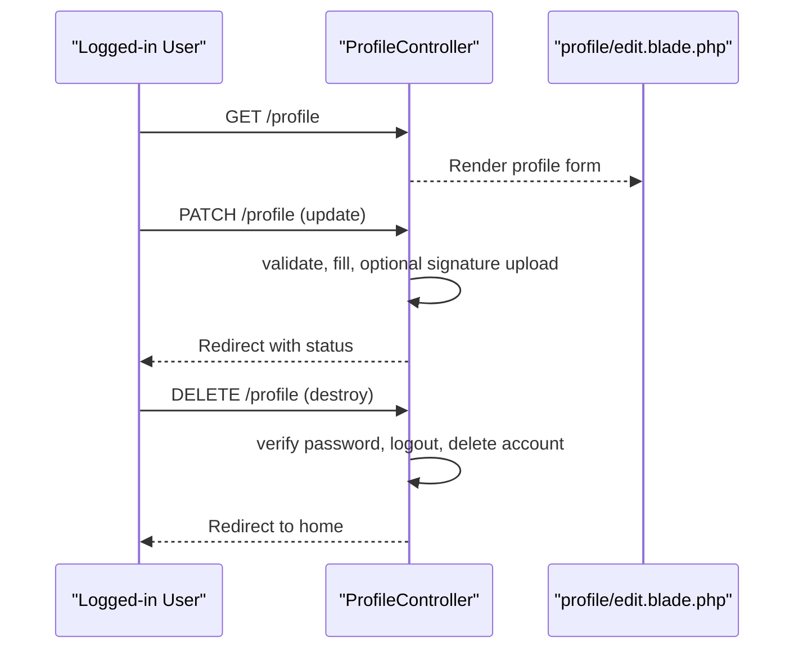

**Diagram sources**
- [ProfileController.php:17-70](file://app/Http/Controllers/ProfileController.php#L17-L70)
- [edit.blade.php (profile):1-30](file://resources/views/profile/edit.blade.php#L1-L30)

**Section sources**
- [ProfileController.php:17-70](file://app/Http/Controllers/ProfileController.php#L17-L70)
- [edit.blade.php (profile):1-30](file://resources/views/profile/edit.blade.php#L1-L30)

### Seeder System for Initial Setup
- RolePermissionSeeder:
  - Resets cached permissions.
  - Creates permissions for Formulation, Trial RM, Trial PM, and Approval Center.
  - Creates roles: Staff R&D, Operational Manager, General Manager.
  - Assigns specific permissions to each role.
- UserSeeder:
  - Creates sample users and assigns them to roles.
  - Outputs credentials for convenience during development.

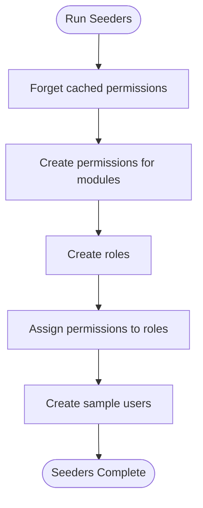

**Diagram sources**
- [RolePermissionSeeder.php:14-110](file://database/seeders/RolePermissionSeeder.php#L14-L110)
- [UserSeeder.php:14-72](file://database/seeders/UserSeeder.php#L14-L72)

**Section sources**
- [RolePermissionSeeder.php:14-110](file://database/seeders/RolePermissionSeeder.php#L14-L110)
- [UserSeeder.php:14-72](file://database/seeders/UserSeeder.php#L14-L72)

### Database Schema for Users and RBAC
- Users table includes identity fields and timestamps; additional signature_path added later.
- RBAC tables include roles, permissions, and pivot tables linking models to roles and roles to permissions.

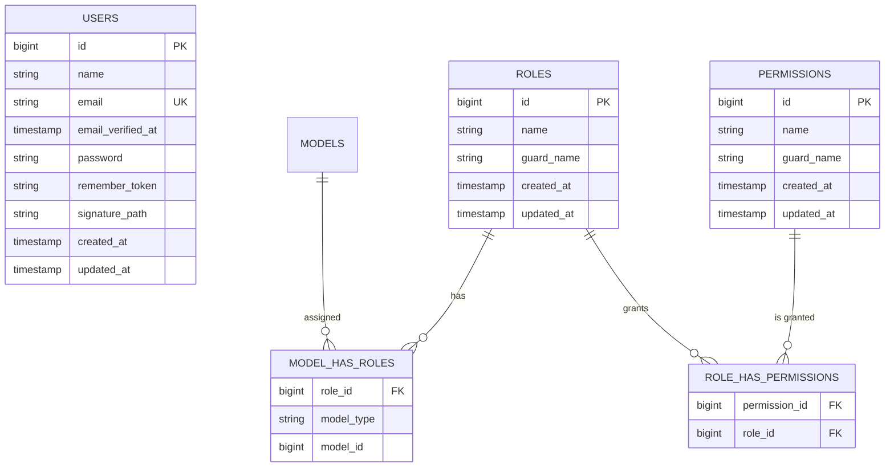

**Diagram sources**
- [0001_01_01_000000_create_users_table.php:12-38](file://database/migrations/0001_01_01_000000_create_users_table.php#L12-L38)
- [2026_07_02_044109_add_signature_path_to_users_table.php:12-27](file://database/migrations/2026_07_02_044109_add_signature_path_to_users_table.php#L12-L27)
- [2026_07_01_092410_create_permission_tables.php:26-115](file://database/migrations/2026_07_01_092410_create_permission_tables.php#L26-L115)

**Section sources**
- [0001_01_01_000000_create_users_table.php:12-38](file://database/migrations/0001_01_01_000000_create_users_table.php#L12-L38)
- [2026_07_02_044109_add_signature_path_to_users_table.php:12-27](file://database/migrations/2026_07_02_044109_add_signature_path_to_users_table.php#L12-L27)
- [2026_07_01_092410_create_permission_tables.php:26-115](file://database/migrations/2026_07_01_092410_create_permission_tables.php#L26-L115)

## Dependency Analysis
- Controller dependencies:
  - Uses User model and Spatie Role model.
  - Validates requests and manages hashing and role assignment.
- Middleware dependency:
  - Relies on authentication state and user role checks.
- Route dependencies:
  - Applies role and permission middleware to protect endpoints.
- Seeder dependencies:
  - Uses Spatie models to create roles and permissions.
  - Uses User model to create sample users and assign roles.

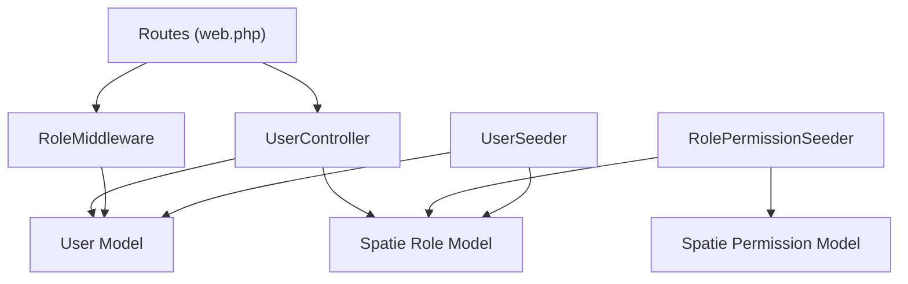

**Diagram sources**
- [UserController.php:1-120](file://app/Http/Controllers/UserController.php#L1-L120)
- [RoleMiddleware.php:16-33](file://app/Http/Middleware/RoleMiddleware.php#L16-L33)
- [web.php:81-91](file://routes/web.php#L81-L91)
- [RolePermissionSeeder.php:14-110](file://database/seeders/RolePermissionSeeder.php#L14-L110)
- [UserSeeder.php:14-72](file://database/seeders/UserSeeder.php#L14-L72)
- [User.php:16-49](file://app/Models/User.php#L16-L49)

**Section sources**
- [UserController.php:1-120](file://app/Http/Controllers/UserController.php#L1-L120)
- [RoleMiddleware.php:16-33](file://app/Http/Middleware/RoleMiddleware.php#L16-L33)
- [web.php:81-91](file://routes/web.php#L81-L91)
- [RolePermissionSeeder.php:14-110](file://database/seeders/RolePermissionSeeder.php#L14-L110)
- [UserSeeder.php:14-72](file://database/seeders/UserSeeder.php#L14-L72)
- [User.php:16-49](file://app/Models/User.php#L16-L49)

## Performance Considerations
- Permission caching:
  - The RBAC package caches permissions for performance; cache expiration and key are configurable.
- Pagination:
  - User listing uses pagination to reduce payload size and improve rendering speed.
- Minimal queries:
  - Loading users with roles uses eager loading to avoid N+1 queries.
- Optional password updates:
  - Only hashing when provided avoids unnecessary writes.

[No sources needed since this section provides general guidance]

## Troubleshooting Guide
Common issues and resolutions:
- Access denied to user management:
  - Ensure the logged-in user has the Superadmin role; otherwise, the controller will abort with 403.
- Cannot delete own account:
  - The controller prevents self-deletion; use another Superadmin account to remove your own.
- Role not applied immediately:
  - If using Octane or long-lived processes, ensure permission cache is cleared after seeding or role changes.
- Permission checks failing on routes:
  - Verify that roles have been seeded and that route middleware matches expected permission names.
- Profile signature upload errors:
  - Confirm file validation rules and storage disk configuration.

**Section sources**
- [UserController.php:103-119](file://app/Http/Controllers/UserController.php#L103-L119)
- [RolePermissionSeeder.php:14-20](file://database/seeders/RolePermissionSeeder.php#L14-L20)
- [permission.php:196-218](file://config/permission.php#L196-L218)
- [ProfileController.php:36-48](file://app/Http/Controllers/ProfileController.php#L36-L48)

## Conclusion
The User Management system provides a secure, role-based administration interface for creating, editing, and removing users while enforcing strict access controls. Roles and permissions are centrally managed via seeders and enforced at both route and controller levels. The design balances usability with security, supports profile management, and leverages caching for performance. For production environments, ensure proper seeding, cache configuration, and adherence to least-privilege principles when defining roles and permissions.