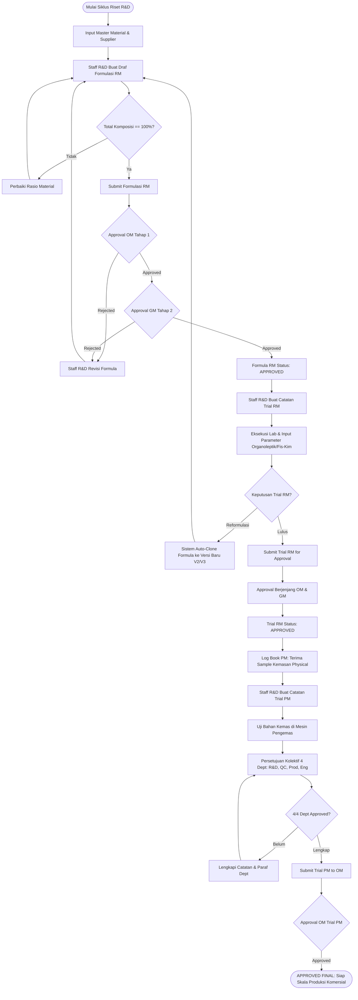
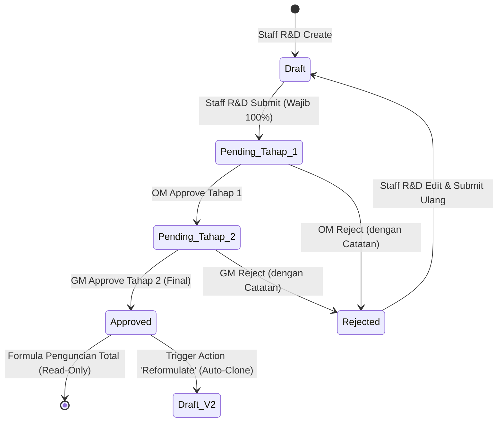
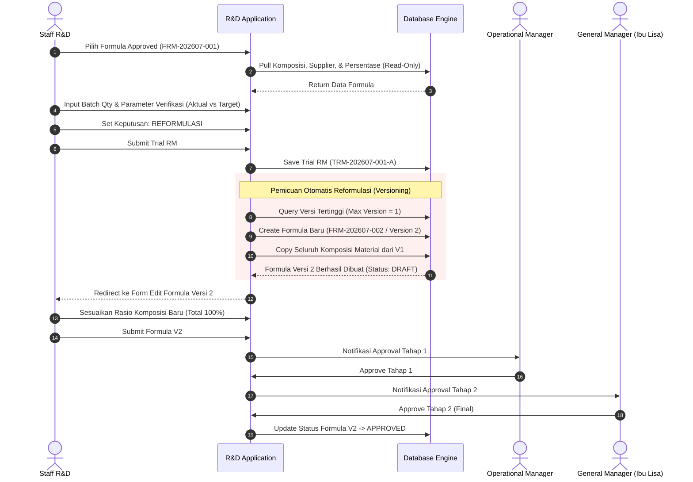
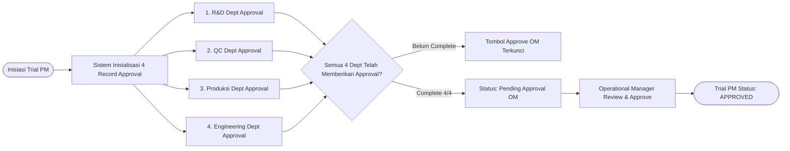
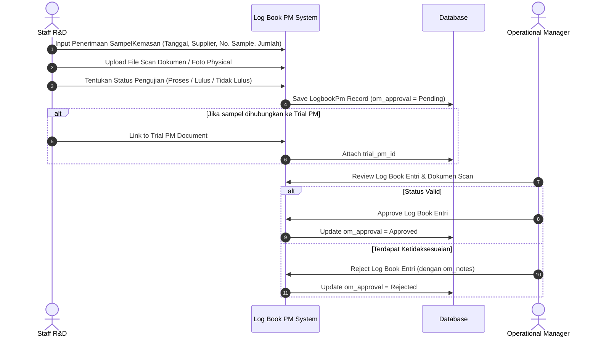

# Dokumentasi Alur Bisnis & Arsitektur Sistem Lengkap (Deep-Dive Business Workflow)
## R&D Management System — PT. Herbatech Innopharma Industry

Dokumen ini berisi penjelasan menyeluruh, mendalam, dan teknis mengenai alur bisnis (*business workflow*), siklus hidup 3 Pilar Utama R&D, arsitektur model data, matriks otorisasi pengguna (RBAC), alur persetujuan berjenjang (*Approval Gate*), diagram alir proses (*flowchart & sequence diagrams* Mermaid), mekanisme auto-clone versioning (reformulasi), modul Log Book PM, hingga pemetaan file kode program pada aplikasi **R&D Management System**.

---

## 📋 Daftar Isi
1. [Pendahuluan & Arsitektur Sistem R&D](#1-pendahuluan--arsitektur-sistem-rd)
2. [Struktur Peran & Matriks Otorisasi Pengguna (RBAC)](#2-struktur-peran--matriks-otorisasi-pengguna-rbac)
3. [Struktur Database & Model Data](#3-struktur-database--model-data)
4. [Kumpulan Diagram Flowchart & Sequence Diagram (Mermaid)](#4-kumpulan-diagram-flowchart--sequence-diagram-mermaid)
   - [A. Flowchart End-to-End Siklus Riset & Pengembangan Produk](#a-flowchart-end-to-end-siklus-riset--pengembangan-produk)
   - [B. Diagram Transisi Status Formulasi RM & Approval Gate](#b-diagram-transisi-status-formulasi-rm--approval-gate)
   - [C. Sequence Diagram Trial RM & Siklus Auto-Clone Reformulasi](#c-sequence-diagram-trial-rm--siklus-auto-clone-reformulasi)
   - [D. Flowchart Persetujuan Kolektif 4 Departemen Trial PM](#d-flowchart-persetujuan-kolektif-4-departemen-trial-pm)
   - [E. Sequence Diagram Log Book PM & Penerimaan Sampel Kemasan](#e-sequence-diagram-log-book-pm--penerimaan-sampel-kemasan)
5. [Rincian Tahapan Alur Bisnis End-to-End (Stage 1 - Stage 10)](#5-rincian-tahapan-alur-bisnis-end-to-end-stage-1---stage-10)
6. [Mekanisme Auto-Generate & Penomoran Dokumen](#6-mekanisme-auto-generate--penomoran-dokumen)
7. [Aturan Validasi & Business Rules Engine](#7-aturan-validasi--business-rules-engine)
8. [Mekanisme Reformulasi & Automatic Versioning Logic](#8-mekanisme-reformulasi--automatic-versioning-logic)
9. [Modul Log Book PM & Pengujian Bahan Kemas](#9-modul-log-book-pm--pengujian-bahan-kemas)
10. [Audit Trail & Traceability (Spatie Activitylog)](#10-audit-trail--traceability-spatie-activitylog)
11. [Manajemen Setting & Dynamic System Configuration](#11-manajemen-setting--dynamic-system-configuration)
12. [Katalog Pemetaan File Kode Program](#12-katalog-pemetaan-file-kode-program)
13. [Narasi Operasional Alur Bisnis (End-to-End Operational Narrative)](#13-narasi-operasional-alur-bisnis-end-to-end-operational-narrative)


---

## 1. Pendahuluan & Arsitektur Sistem R&D

Aplikasi **R&D Management System** PT. Herbatech Innopharma Industry dibangun menggunakan kerangka kerja modern berbasis web untuk mendigitalisasi, mengotomatisasi, serta mengontrol seluruh alur kerja formulasi dan pengujian produk herbal dari tahap prapembuatan resep hingga keputusan skala produksi komersial:

* **Backend Framework:** Laravel 11/12 (PHP 8.2+)
* **Frontend UI & Interaktivitas:** Blade Templates, Tailwind CSS, Alpine.js, TomSelect
* **Database:** MySQL / PostgreSQL
* **Authorization Engine:** Spatie Laravel-Permission (Role-Based Access Control)
* **Audit Trail Engine:** Spatie Laravel-Activitylog
* **PDF Generator:** Barryvdh DomPDF Facade (Print Views & Watermarking)

### 🏛️ 3 Pilar Utama Sistem:

```
┌─────────────────────────┐       ┌─────────────────────────┐       ┌─────────────────────────┐
│   1. Formulasi RM       │ ──►   │    2. Trial RM          │       │    3. Trial PM          │
│   (Raw Material)        │       │    (Raw Material)       │       │  (Packaging Material)   │
└─────────────────────────┘       └─────────────────────────┘       └─────────────────────────┘
  • Draf Resep & Komposisi          • Uji Pencampuran Sampel          • Uji Bahan Kemas di Mesin
  • Total Rasio Wajib 100%          • Organoleptik & Fis-Kim          • Verifikasi 4 Departemen
  • Auto-Clone Reformulasi          • Target vs Aktual                • Log Book PM & Cetak
```

1. **Formulasi Raw Material (RM):** Modul sentral perekaman resep bahan baku dasar produk herbal. Menangani komposisi rasio persentase (wajib tepat 100%), kalkulasi dosis & HPP bahan baku, penetapan supplier, serta penanganan reformulasi otomatis berbasis *versioning*.
2. **Catatan Trial Raw Material (RM):** Modul eksekusi uji coba laboratorium. Menarik data formula dari Pilar 1 secara otomatis untuk menguji kelaikan fisik, kimia, dan organoleptik (Warna, Rasa, Bau, pH, Viskositas, Berat Jenis).
3. **Catatan Trial Packaging Material (PM) & Log Book PM:** Modul pengujian bahan kemas pada mesin pengemas yang melibatkan persetujuan kolektif 4 departemen (R&D, QC, Produksi, Engineering). Dilengkapi modul **Log Book PM** untuk pencatatan fisik sampel kemasan yang diterima dari supplier.

---

## 2. Struktur Peran & Matriks Otorisasi Pengguna (RBAC)

Hak akses pengguna diatur secara ketat melalui Spatie Laravel-Permission dan Laravel Policies. Pengaturan ini menjamin pemisahan tugas (*Segregation of Duties*) antara pembuat formula, peninjau teknis, dan pengambil keputusan akhir.

### Deskripsi Peran Pengguna:

* **Staff R&D (Inisiator):** Pembuat dokumen (Formulasi RM, Trial RM, Trial PM, dan Log Book PM). Memiliki hak akses untuk membuat, mengedit draf (sebelum disetujui), serta mengajukan dokumen ke proses persetujuan.
* **Operational Manager (OM - Evaluator Teknis):** Penyetuju Tahap 1. Meninjau draf teknis Formulasi RM dan Trial RM, memberikan ulasan/catatan penolakan jika perlu revisi, serta menyetujui Trial PM & Log Book PM.
* **General Manager (GM / Ibu Lisa - Final Approver):** Penyetuju Tahap 2 (Final). Memiliki hak akses *read-only* penuh ke seluruh riwayat riset dan mengeksekusi persetujuan akhir menuju skala produksi komersial.
* **Superadmin:** Administrator sistem dengan akses penuh (*override*) ke seluruh modul, manajemen user, konfigurasi branding, dan Approval Center.

### Matriks Otorisasi Aksi per Peran:

| Aksi / Modul | Staff R&D | Operational Manager | General Manager | Superadmin |
| :--- | :---: | :---: | :---: | :---: |
| **Create Draf (Formula / Trial RM / Trial PM / Log Book PM)** | ✓ | ✗ | ✗ | ✓ |
| **Edit Draf (sebelum disetujui)** | ✓ | ✗ | ✗ | ✓ |
| **Submit for Approval** | ✓ | ✗ | ✗ | ✓ |
| **Approval Tahap 1 (OM - Formula & Trial RM)** | ✗ | ✓ | ✗ | ✓ |
| **Approval Tahap 2 (GM - Final Formula & Trial RM)** | ✗ | ✗ | ✓ | ✓ |
| **Approval Trial PM (OM)** | ✗ | ✓ | ✗ | ✓ |
| **Approval Log Book PM (OM)** | ✗ | ✓ | ✗ | ✓ |
| **Paraf Checklist 4 Dept (Trial PM)** | Dep. Related | Dep. Related | ✗ | ✓ |
| **Inisiasi Reformulasi (Auto-Clone)** | ✓ | ✗ | ✗ | ✓ |
| **Cetak Dokumen / Export PDF** | ✓ | ✓ | ✓ | ✓ |
| **Kelola Master Data Material & Supplier** | ✓ | ✗ | ✗ | ✓ |
| **Kelola User Management & System Settings** | ✗ | ✗ | ✗ | ✓ |

---

## 3. Struktur Database & Model Data

### Diagram Relasi Entitas Utama (ERD):

```
┌──────────────┐         ┌───────────┐         ┌─────────────────────┐
│   Supplier   │ 1 ──── N│ Material  │ 1 ──── N│   FormulaMaterial   │
└──────────────┘         └───────────┘         └─────────────────────┘
       │                                                  │ N
       │                                                  │
       │                                       ┌─────────────────────┐
       │                                       │       Formula       │
       │                                       └─────────────────────┘
       │                                                  │ 1
       │                                                  │
       │                                                  │ N
       │                                       ┌─────────────────────┐
       │ 1                                     │      TrialRm        │
       │                                       └─────────────────────┘
       │                                                  │ 1
       │                                                  │ N
       │                                       ┌─────────────────────┐
       │                                       │ TrialRmVerification │
       │                                       └─────────────────────┘
       │
       │ N               ┌───────────┐ 1     N ┌─────────────────────┐
       └───────────────► │ LogbookPm │ ───────►│       TrialPm       │
                         └───────────┘         └─────────────────────┘
                                                          │ 1
                                                          │ N
                                               ┌─────────────────────┐
                                               │   TrialPmApproval   │
                                               └─────────────────────┘
```

### Detail Model Data Utama:

#### 1. Model `Formula` ([app/Models/Formula.php](file:///c:/laragon/www/rnd-management/app/Models/Formula.php))
* **Fungsi:** Menyimpan header data resep dan formulasi produk raw material.
* **Field Kunci:** `code`, `name`, `formula_type`, `version`, `parent_formula_id`, `development_stage`, `preparation_method`, `approval_status` (`Draft`, `Pending Tahap 1`, `Pending Tahap 2`, `Approved`, `Rejected`), `created_by`, `approved_by_om`, `approved_by_gm`, `target_dose_a`, `target_dose_b`, `target_sachet`.
* **Relasi:** `belongsTo(User::class, 'created_by')`, `hasMany(FormulaMaterial::class)`, `belongsTo(Formula::class, 'parent_formula_id')`, `hasMany(TrialRm::class)`.

#### 2. Model `FormulaMaterial` ([app/Models/FormulaMaterial.php](file:///c:/laragon/www/rnd-management/app/Models/FormulaMaterial.php))
* **Fungsi:** Menyimpan rincian item bahan baku dalam suatu formula.
* **Field Kunci:** `formula_id`, `material_id`, `supplier_id`, `percentage`, `price_per_kg`, `price_per_gram`, `dose_2g`, `dose_05g`, `sachet_30`, `hpp_rm`.

#### 3. Model `TrialRm` ([app/Models/TrialRm.php](file:///c:/laragon/www/rnd-management/app/Models/TrialRm.php))
* **Fungsi:** Menyimpan catatan eksekusi pengujian laboratorium bahan baku.
* **Field Kunci:** `code`, `formula_id`, `sample_identity`, `trial_objective`, `batch_qty`, `process_steps`, `decision` (`Lulus`, `Reformulasi`), `approval_status`, `created_by`, `approved_by_om`, `approved_by_gm`.

#### 4. Model `TrialRmVerification` ([app/Models/TrialRmVerification.php](file:///c:/laragon/www/rnd-management/app/Models/TrialRmVerification.php))
* **Fungsi:** Parameter komparasi organoleptik & fisika-kimia.
* **Field Kunci:** `trial_rm_id`, `parameter_name`, `target_value`, `actual_value`, `status`.

#### 5. Model `TrialPm` ([app/Models/TrialPm.php](file:///c:/laragon/www/rnd-management/app/Models/TrialPm.php))
* **Fungsi:** Menyimpan catatan pengujian bahan kemas pada mesin pengemas.
* **Field Kunci:** `code`, `proposal_number`, `packaging_material`, `supplier`, `product_use` (array JSON), `product_trial` (array JSON), `specifications` (array JSON), `executions` (array JSON), `risk_analysis`, `approval_status`.

#### 6. Model `TrialPmApproval` ([app/Models/TrialPmApproval.php](file:///c:/laragon/www/rnd-management/app/Models/TrialPmApproval.php))
* **Fungsi:** Pencatatan persetujuan kolektif 4 departemen (R&D, QC, Produksi, Engineering).
* **Field Kunci:** `trial_pm_id`, `department`, `is_approved`, `notes`, `approved_by`, `approved_at`.

#### 7. Model `LogbookPm` ([app/Models/LogbookPm.php](file:///c:/laragon/www/rnd-management/app/Models/LogbookPm.php))
* **Fungsi:** Log book penerimaan dan verifikasi awal sampel bahan kemas dari supplier.
* **Field Kunci:** `tanggal_terima`, `supplier_id`, `nama_material`, `no_sample`, `jumlah_diterima`, `kondisi_fisik`, `trial_pm_id`, `status_pengujian` (`Proses`, `Lulus`, `Tidak Lulus`), `om_approval` (`Pending`, `Approved`, `Rejected`), `file_scan`.

---

## 4. Kumpulan Diagram Flowchart & Sequence Diagram (Mermaid)

### A. Flowchart End-to-End Siklus Riset & Pengembangan Produk



---

### B. Diagram Transisi Status Formulasi RM & Approval Gate



---

### C. Sequence Diagram Trial RM & Siklus Auto-Clone Reformulasi



---

### D. Flowchart Persetujuan Kolektif 4 Departemen Trial PM



---

### E. Sequence Diagram Log Book PM & Penerimaan Sampel Kemasan



---

## 5. Rincian Tahapan Alur Bisnis End-to-End (Stage 1 - Stage 10)

Siklus hidup riset produk herbal pada PT. Herbatech Innopharma Industry terbagi menjadi 10 tahapan berurutan (*Stage 1* sampai *Stage 10*):

### Stage 1: Pendaftaran Master Data Bahan Baku (Material) & Supplier
* **Pelaku:** Superadmin / Staff R&D.
* **Aktivitas:** Menginput data master bahan baku (nama material, kode bahan, tipe) dan data supplier resmi.
* **Fitur UI:** Menggunakan komponen **TomSelect** untuk mendukung *searchable dropdown* cepat dengan pengelompokan yang presisi.

### Stage 2: Inisiasi Draf Formulasi RM (Pilar 1)
* **Pelaku:** Staff R&D.
* **Aktivitas:** 
  1. Membuat draf formula baru. Sistem meng-generate kode otomatis `FRM-YYYYMM-XXX`.
  2. Mengisi nama produk, bentuk sediaan, aplikasi penggunaan, target dosis (Dosis 2g, Dosis 0.5g, Target Sachet 30), dan metode pembuatan.
  3. Memilih bahan baku dari master data dan memasukkan rasio persentase.
* **Validasi Bisnis:** Total persentase seluruh bahan baku wajib **tepat 100%** (dengan toleransi *floating point math* `100.01%`).

### Stage 3: Workflow Approval Gate Formulasi RM
* **Pelaku:** Staff R&D ➔ Operational Manager (OM) ➔ General Manager (GM).
* **Aktivitas:**
  1. Staff R&D menekan tombol *Submit for Approval*. Status berubah dari `Draft` menjadi `Pending Tahap 1`.
  2. OM meninjau kelaikan teknis di **Approval Center**. Jika sesuai, OM menyetujui Tahap 1 (`Pending Tahap 2`). Jika tidak sesuai, OM menolak (`Rejected`) beserta catatan revisi.
  3. GM (Ibu Lisa) melakukan peninjauan akhir. Jika disetujui, status berubah menjadi `Approved`.

### Stage 4: Eksekusi Catatan Trial RM (Pilar 2)
* **Pelaku:** Staff R&D.
* **Aktivitas:**
  1. Membuat Catatan Trial RM baru dengan memilih **Formula RM yang berstatus Approved**.
  2. Sistem menarik data komposisi, supplier, dan persentase secara **read-only** dari Formula RM terpilih.
  3. Sistem meng-generate kode trial `TRM-YYYYMM-XXX-A`.
  4. Staff R&D memasukkan identitas sampel, jumlah batch, langkah pencampuran, serta parameter komparasi organoleptik & fisika-kimia (Target vs Aktual).

### Stage 5: Decision Point Trial RM (Lulus vs Reformulasi)
* **Pelaku:** Staff R&D.
* **Aktivitas:** Menginput Keputusan Trial (*Trial Decision*):
  * **Lulus:** Dokumen diajukan ke Approval Gate OM & GM untuk disetujui secara resmi.
  * **Reformulasi:** Uji coba dinilai belum memenuhi standar. Memicu mekanisme *Auto-Clone*.

### Stage 6: Mekanisme Auto-Clone & Versioning Reformulasi
* **Pelaku:** System Automation.
* **Aktivitas:**
  1. Saat keputusan trial = `Reformulasi`, `FormulaService::reformulate()` otomatis menduplikasi (*clone*) resep Formula RM asal.
  2. Sistem menetapkan `version` baru (`Version 2`, `Version 3`, dst.) dan menyambungkan `parent_formula_id`.
  3. Formulasi baru berstatus `Draft` dan dibuka kembali untuk modifikasi rasio oleh Staff R&D.

### Stage 7: Penerimaan Sampel Kemasan di Log Book PM
* **Pelaku:** Staff R&D ➔ Operational Manager.
* **Aktivitas:**
  1. Merekam sampel bahan kemas yang diterima dari supplier ke dalam **Log Book PM**.
  2. Mengisi nomor sampel, jumlah diterima, kelengkapan dokumen, kondisi fisik, dan mengunggah berkas scan/foto.
  3. OM meninjau dan memberikan persetujuan (`Approved`).

### Stage 8: Inisiasi & Pengujian Trial PM (Pilar 3)
* **Pelaku:** Staff R&D & Tim Lintas Departemen.
* **Aktivitas:**
  1. Menginisiasi Trial PM dengan kode `TPM-YYYYMM-XXX` atau berdasarkan nomor proposal.
  2. Mengisi spesifikasi fisik bahan kemas, parameter pelaksanaan mesin (kecepatan, suhu sealing, tekanan), serta analisis risiko cacat kemasan.

### Stage 9: Persetujuan Kolektif 4 Departemen & Final Approval OM
* **Pelaku:** Perwakilan R&D, QC, Produksi, Engineering ➔ Operational Manager.
* **Aktivitas:**
  1. Masing-masing dari 4 departemen memeriksa trial di mesin pengemas dan menginput persetujuan (*checkbox & notes*) pada `TrialPmApproval`.
  2. Setelah persetujuan 4 departemen lengkap (4/4), status berubah menjadi `Pending Approval`.
  3. OM mengeksekusi persetujuan final (`Approved`).

### Stage 10: Print & Archiving Dokumen Resmi
* **Pelaku:** Seluruh Pengguna Terotorisasi.
* **Aktivitas:** Mengunduh atau mencetak dokumen resmi (Formula, Trial RM, Trial PM, Log Book PM) yang telah dilengkapi header dynamic branding perusahaan, slot paraf digital, dan penataan halaman presisi.

---

## 6. Mekanisme Auto-Generate & Penomoran Dokumen

Seluruh entitas utama menggunakan skema penomoran otomatis yang konsisten, unik, dan *traceable*:

| Entitas | Format Kode | Contoh Kode | Aturan Increment & Logika |
| :--- | :--- | :--- | :--- |
| **Formulasi RM** | `FRM-YYYYMM-XXX` | `FRM-202607-001` | Tahun & Bulan aktif + 3 digit sequence per bulan. |
| **Versi Reformulasi** | `FRM-YYYYMM-XXX-V{n}` | `FRM-202607-001-V2` | Dihasilkan otomatis saat action reformulate. |
| **Trial RM** | `TRM-YYYYMM-XXX-{A,B...}` | `TRM-202607-001-A` | Sequence per bulan + Suffix huruf (A, B, C...) yang naik jika formula yang sama ditrial ulang. |
| **Trial PM** | `TPM-YYYYMM-XXX` atau `[Proposal]-XX` | `TPM-202607-001` | Berdasarkan nomor proposal PM atau sequence bulanan. |
| **Log Book PM** | `LPM-YYYYMM-XXX` | `LPM-202607-001` | Registrasi fisik sampel kemasan per bulan. |

---

## 7. Aturan Validasi & Business Rules Engine

Sistem menerapkan validasi berlapis (*Multi-Layer Validation*) di tingkat UI (Alpine.js / JavaScript), Form Request, Service Layer, Policy, dan Database Transaction:

```
[UI / Alpine.js] ── (First Line Feedback) ──► [Form Request / Validation Rules]
                                                           │
[Database Transaction] ◄── [Laravel Policy (RBAC)] ◄───────┘ (Core Business Rules)
```

### Daftar Aturan Validasi Utama:

1. **R1 (Komposisi 100% Wajib):** Draf Formulasi RM tidak dapat di-submit jika total persentase komposisi material `≠ 100%`. Toleransi kalkulasi presisi *floating point* adalah maksimal `100.01%`.
2. **R2 (Locking State):** Setelah dokumen Formulasi RM, Trial RM, atau Trial PM berubah status dari `Draft` menjadi `Pending` atau `Approved`, seluruh field input pada form UI otomatis terkunci (`disabled`) untuk Staff R&D.
3. **R3 (Integrasi Read-Only Trial RM):** Form Trial RM wajib memilih Formula RM yang telah berstatus `Approved`. Setelah dipilih, rincian bahan baku dan supplier dikunci secara *read-only*.
4. **R4 (Validasi Kolektif 4 Dept PM):** Status Trial PM **tidak dapat** disetujui oleh Operational Manager sebelum ke-4 departemen (R&D, QC, Produksi, Engineering) menyelesaikan penilaian dan mencentang paraf persetujuan.
5. **R5 (Approval Gate Sequence):** Approval Tahap 2 (General Manager) tidak dapat dieksekusi selama Approval Tahap 1 (Operational Manager) belum diberikan.

---

## 8. Mekanisme Reformulasi & Automatic Versioning Logic

Saat hasil pengujian laboratorium pada Pilar 2 menunjukkan perlunya penyesuaian resep, sistem memfasilitasi iterasi tanpa menghilangkan riwayat riset sebelumnya:

```php
// Logika Reformulasi pada FormulaService.php
public function reformulate(Formula $formula, int $createdBy): Formula
{
    // 1. Validasi hanya formula Approved yang dapat direformulasi
    if ($formula->approval_status !== 'Approved') {
        throw ValidationException::withMessages(['status' => 'Hanya formula Approved yang dapat direformulasi.']);
    }

    // 2. Hitung versi berikutnya (V2, V3, dst)
    $newVersion = Formula::where('parent_formula_id', $formula->id)
            ->orWhere('id', $formula->id)
            ->max('version') + 1;

    // 3. Duplicate record Header & Array Material
    $newFormula = Formula::create([...]);
    foreach ($formula->materials as $mat) {
        FormulaMaterial::create([...]);
    }

    return $newFormula;
}
```

---

## 9. Modul Log Book PM & Pengujian Bahan Kemas

Modul **Log Book PM** menjembatani fisik sampel bahan kemas yang dikirim oleh vendor/supplier dengan dokumen pengujian mesin (Trial PM):

1. **Registrasi Samples:** Setiap sampel kemasan yang masuk dicatat tanggal terima, supplier, nama material, nomor sampel, dan jumlahnya.
2. **Dokumentasi Scan:** Mendukung unggah berkas scan sertifikat/dokumen pendukung (`file_scan`) dan foto fisik sampel (`lampiran_dokumentasi`).
3. **Preview Modal Inline:** Pengguna dapat meninjau dokumen scan dan pratinjau cetak secara langsung (*inline preview*) tanpa meninggalkan halaman menggunakan modal berbasis Alpine.js & iframe.
4. **Persetujuan Manager:** Operational Manager meninjau data fisik sampel dan memberikan status persetujuan (`om_approval`).

---

## 10. Audit Trail & Traceability (Spatie Activitylog)

Untuk memenuhi standar Good Manufacturing Practice (GMP) dan ketertelusuran riset (*traceability*), seluruh aktivitas perubahan data penting dicatat secara otomatis menggunakan **Spatie Activitylog**:

* **Entitas yang Dilog:** `Formula`, `TrialRm`, `TrialPm`, `LogbookPm`.
* **Atribut yang Ditracking:** Perubahan status persetujuan, kode dokumen, catatan penolakan (*rejection notes*), versi, dan user pelaksana.
* **Tampilan Feed:** Log aktivitas disajikan secara *real-time* pada widget **Activity Feed** di Dashboard Utama.

---

## 11. Manajemen Setting & Dynamic System Configuration

Sistem mendukung penyesuaian konfigurasi dinamis melalui modul **System Settings** (khusus Superadmin):

* **Dynamic Branding:** Pengaturan Nama Aplikasi, Logo Header Dashboard, Favicon Browser, dan Logo Khusus Layout Cetak (*Print Logo*).
* **Print Layout Polish:** Dukungan otomatis watermark `CONFIDENTIAL` pada dokumen draf, penataan margin cetak, dan penghapusan elemen non-esensial saat diprint/dieksport ke PDF.

---

## 12. Katalog Pemetaan File Kode Program

Berikut adalah direktori pemetaan file utama dalam repositori project `rnd-management`:

### 🏢 Models & Domain Logic
* [app/Models/Formula.php](file:///c:/laragon/www/rnd-management/app/Models/Formula.php) — Header Formulasi Raw Material.
* [app/Models/FormulaMaterial.php](file:///c:/laragon/www/rnd-management/app/Models/FormulaMaterial.php) — Detail Komposisi Material Formula.
* [app/Models/TrialRm.php](file:///c:/laragon/www/rnd-management/app/Models/TrialRm.php) — Header Catatan Trial Raw Material.
* [app/Models/TrialRmVerification.php](file:///c:/laragon/www/rnd-management/app/Models/TrialRmVerification.php) — Parameter Organoleptik & Fisika-Kimia.
* [app/Models/TrialPm.php](file:///c:/laragon/www/rnd-management/app/Models/TrialPm.php) — Header Catatan Trial Packaging Material.
* [app/Models/TrialPmApproval.php](file:///c:/laragon/www/rnd-management/app/Models/TrialPmApproval.php) — Checklists & Paraf 4 Departemen Trial PM.
* [app/Models/LogbookPm.php](file:///c:/laragon/www/rnd-management/app/Models/LogbookPm.php) — Registrasi & Log Book Penerimaan Bahan Kemas.

### ⚙️ Business Services Layer
* [app/Services/FormulaService.php](file:///c:/laragon/www/rnd-management/app/Services/FormulaService.php) — Logic Formulasi, Validasi 100%, Approval OM/GM, Reformulasi.
* [app/Services/TrialRmService.php](file:///c:/laragon/www/rnd-management/app/Services/TrialRmService.php) — Logic Trial RM, Target vs Aktual, Auto Code `TRM`.
* [app/Services/TrialPmService.php](file:///c:/laragon/www/rnd-management/app/Services/TrialPmService.php) — Logic Trial PM, Auto Code `TPM`, Inisialisasi 4 Dept Approval.

### 🎮 HTTP Controllers
* [app/Http/Controllers/FormulaController.php](file:///c:/laragon/www/rnd-management/app/Http/Controllers/FormulaController.php) — Controller Formulasi RM & Print View.
* [app/Http/Controllers/TrialRmController.php](file:///c:/laragon/www/rnd-management/app/Http/Controllers/TrialRmController.php) — Controller Trial RM.
* [app/Http/Controllers/TrialPmController.php](file:///c:/laragon/www/rnd-management/app/Http/Controllers/TrialPmController.php) — Controller Trial PM.
* [app/Http/Controllers/LogbookPmController.php](file:///c:/laragon/www/rnd-management/app/Http/Controllers/LogbookPmController.php) — Controller Log Book PM & Modal Print Preview.
* [app/Http/Controllers/ApprovalCenterController.php](file:///c:/laragon/www/rnd-management/app/Http/Controllers/ApprovalCenterController.php) — Pusat Approval Berjenjang (OM & GM).
* [app/Http/Controllers/DashboardController.php](file:///c:/laragon/www/rnd-management/app/Http/Controllers/DashboardController.php) — Real-time Dashboard, Stat Cards & Activity Feed.

### 🌐 Routing & Authorization
* [routes/web.php](file:///c:/laragon/www/rnd-management/routes/web.php) — Registrasi Route Web, Resource Routes & Middleware Spatie.
* [database/seeders/RoleAndPermissionSeeder.php](file:///c:/laragon/www/rnd-management/database/seeders/RoleAndPermissionSeeder.php) — Inisialisasi Role & Permission Spatie.

---

## 13. Narasi Operasional Alur Bisnis (End-to-End Operational Narrative)

Berikut adalah narasi lengkap alur operasional riset dan pengembangan produk baru di **PT. Herbatech Innopharma Industry**, digambarkan dari sudut pandang riil aktivitas harian di lapangan:

### 📖 Skenario Kasus Riset: Pengembangan Produk "Sirup Herbal Batuk Herbafit 60ml"

#### 🎬 Babak 1: Inisiasi Riset & Penyiapan Master Data Bahan Baku
Perjalanan produk baru dimulai saat Manajemen memberikan mandat pengembangan produk sirup herbal batuk. Tim **Staff R&D** terlebih dahulu masuk ke sistem untuk memastikan seluruh bahan baku dasar (seperti *Ekstrak Jahe Merah*, *Ekstrak Meniran*, *Madu Murni*, *Potassium Sorbate*) serta data vendor/supplier telah terdaftar di modul **Data Master Material & Supplier**. Pencarian dan pengisian material berlangsung cepat berkat bantuan komponen *searchable dropdown* TomSelect.

#### 🧪 Babak 2: Meracik Resep Pertama (Formulasi RM - Version 1)
Staff R&D membuka modul **Formulasi Raw Material (RM)** dan menekan tombol *Create New Formula*. Sistem secara otomatis menerbitkan Kode Formula unik **`FRM-202607-001`** dengan versi awal **V1**. 

Formulator memasukkan nama produk *"Sirup Herbal Batuk Herbafit 60ml"*, menetapkan bentuk sediaan sirup, target dosis A/B, serta metode ekstraksi dan homogenisasi. Selanjutnya, formulator menambahkan rincian bahan baku beserta rasio persentasenya. Saat formulator mencoba men-submit draf dengan total persentase 98.5%, sistem secara otomatis **memblokir** pengajuan dan menampilkan indikator peringatan bahwa *"Total komposisi harus tepat 100%"*. Setelah rasio disempurnakan hingga pas 100% (sistem menghitung HPP per sachet secara otomatis), formulator menekan tombol **Submit for Approval**. Status dokumen berubah menjadi **Pending Tahap 1**.

#### 🏛️ Babak 3: Menembus Approval Gate (Operational Manager & General Manager)
Notifikasi pengajuan masuk ke akun **Operational Manager (OM)**. OM membuka halaman **Approval Center**, meninjau kelaikan teknis racikan bahan baku `FRM-202607-001`, lalu memberikan **Approval Tahap 1**. Status dokumen otomatis naik menjadi **Pending Tahap 2**.

Selanjutnya, **General Manager (Ibu Lisa)** meninjau riwayat racikan dan menyetujui tahap akhir (**Approval Tahap 2**). Tepat saat GM menyetujui, status formula berubah menjadi **Approved**, dan seluruh form racikan dikunci secara permanen (*read-only*) untuk menjaga integritas resep baku.

#### 🔬 Babak 4: Eksekusi Uji Coba Laboratorium Pertama (Trial RM Batch A)
Setelah formula disetujui, Staff R&D beralih ke modul **Catatan Trial RM** untuk menguji fisik racikan di laboratorium. Formulator memilih `FRM-202607-001`, dan sistem secara otomatis menarik rincian bahan baku dan supplier ke form trial ber-kode otomatis **`TRM-202607-001-A`**.

Tim R&D melakukan pencampuran sampel batch 1 Liter. Hasil pengujian laboratorium menunjukkan organoleptik warna dan bau sudah baik, namun **pH terlalu asam (3.8 vs target 4.5 - 5.0)** dan **viskositas terlalu encer**. Pada kolom Keputusan Trial, formulator memilih **REFORMULASI**.

#### 🔄 Babak 5: Pemicuan Otomatis Reformulasi & Kelahiran Formula Version 2
Sistem secara cerdas mendeteksi keputusan *Reformulasi*. Tanpa perlu input manual dari nol, `FormulaService::reformulate()` langsung **menduplikasi (auto-clone)** Formula `FRM-202607-001` menjadi racikan baru berkode **`FRM-202607-002`** dengan tingkatan **Version 2 (V2)**.

Staff R&D membuka Formula V2 yang masih berstatus `Draft`, menyesuaikan konsentrasi pemanis dan penyeimbang pH hingga rasio kembali 100%, lalu mengajukannya kembali melalui Approval Gate (OM Tahap 1 ➔ GM Tahap 2) hingga Formula V2 resmi berstatus **Approved**.

#### 🧪 Babak 6: Pengujian Lab Kedua (Trial RM Batch B) & Kelulusan Formula
Staff R&D membuat Catatan Trial RM kedua berkode **`TRM-202607-001-B`** (suffix huruf `B` naik otomatis untuk formula yang ditrial ulang) dengan menarik Formula V2.

Pengujian laboratorium kali ini menunjukkan hasil sempurna: organoleptik sesuai target, rasa manis pas, pH stabil di angka 4.8, dan viskositas ideal. Formulator menetapkan keputusan **LULUS**. Dokumen Trial RM diajukan dan disetujui oleh OM & GM.

#### 📦 Babak 7: Kedatangan Bahan Kemas & Modul Log Book PM
Sementara uji cairan herbal selesai, tim vendor mengirimkan sampel bahan kemas berupa *Botol Kaca Cokelat 60ml* dan *Cap Aluminium Roll-On*. Staff R&D langsung merekam kedatangan fisik sampel di modul **Log Book PM** (kode **`LPM-202607-001`**).

Staff R&D menginput jumlah sampel diterima (50 pcs), memeriksa kondisi fisik, dan mengunggah berkas scan Certificate of Analysis (COA). Operational Manager meninjau unggahan scan secara *inline modal preview* dan memberikan status **Approved** pada Log Book PM.

#### ⚙️ Babak 8: Uji Coba Mesin Kemas (Trial PM) & Kolaborasi 4 Departemen
Setelah bahan kemas dinyatakan layak di Log Book PM, Staff R&D membuat dokumen **Catatan Trial PM** berkode **`TPM-202607-001`** untuk menguji ketahanan botol pada mesin pengemas otomatis.

Pengujian dilakukan secara langsung di area produksi dan melibatkan 4 departemen:
1. **R&D:** Memeriksa estetika visual, presisi etiket, dan stabilitas bahan kemas.
2. **QC:** Menguji kebocoran (*leakage test*) di ruang vakum.
3. **Produksi:** Menilai efisiensi kecepatan pengemasan (*speed*) per menit.
4. **Engineering:** Memeriksa settingan suhu sealing dan tekanan *capping* mesin.

Masing-masing perwakilan departemen menginput ulasan teknis dan membubuhkan **paraf persetujuan digital**. Selama salah satu departemen belum memberikan paraf, tombol persetujuan manager tetap terkunci (*disabled*).

#### 🏁 Babak 9: Approval Final OM & Handover Skala Produksi Komersial
Setelah ke-4 departemen membubuhkan paraf persetujuan (4/4 complete), status Trial PM berubah menjadi *Pending Approval OM*. Operational Manager melakukan *review* komprehensif dan mengeksekusi persetujuan final (**Approved**).

Dokumen Formulasi RM V2, Catatan Trial RM Batch B, Catatan Trial PM, serta Log Book PM dicetak secara resmi melalui fitur **Print Layout** (dilengkapi header logo perusahaan, paraf digital resmi, dan watermark `CONFIDENTIAL`). Seluruh dokumen riset kini tersimpan aman dan siap diserahterimakan ke Departemen Produksi Komersial untuk proses manufaktur skala besar.

