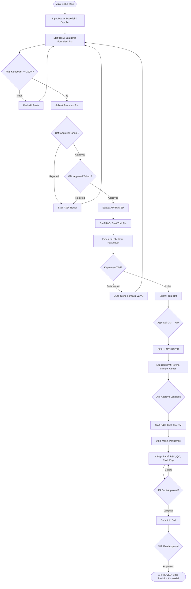
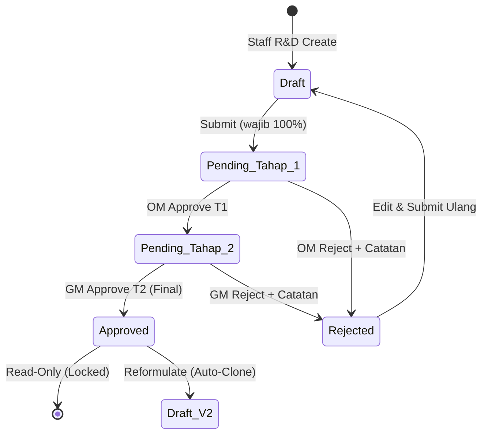
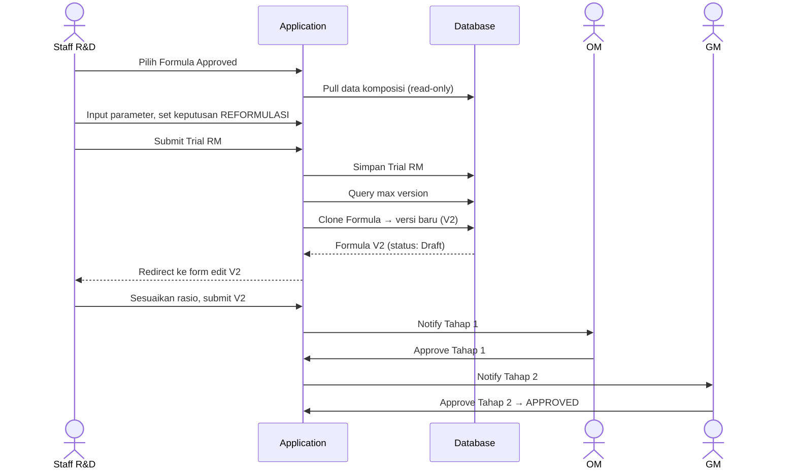

# R&D Management System

### PT. Herbatech Innopharma Industry

Platform web enterprise untuk mendigitalisasi, mengotomatisasi, dan mengontrol seluruh alur kerja formulasi serta pengujian produk herbal — dari konsep awal hingga keputusan skala produksi komersial.

---

## Daftar Isi

1. [Tentang Sistem](#tentang-sistem)
2. [Tech Stack](#tech-stack)
3. [Struktur Role & Hak Akses](#struktur-role--hak-akses)
4. [Matriks Otorisasi per Role](#matriks-otorisasi-per-role)
5. [3 Pilar Utama](#3-pilar-utama)
6. [Flow End-to-End Seluruh Sistem](#flow-end-to-end-seluruh-sistem)
7. [Flow Antar Role](#flow-antar-role)
8. [Approval Gate & Business Rules](#approval-gate--business-rules)
9. [Modul-modul Sistem](#modul-modul-sistem)
10. [Penomoran Dokumen Otomatis](#penomoran-dokumen-otomatis)
11. [Audit Trail & Traceability](#audit-trail--traceability)
12. [Instalasi & Menjalankan Sistem](#instalasi--menjalankan-sistem)

---

## Tentang Sistem

**R&D Management System** memetakan siklus hidup riset produk herbal PT. Herbatech Innopharma Industry ke dalam alur digital yang terstruktur:

```
Konsep Produk → Formulasi RM → Trial RM (Lab) → Trial PM (Kemas) → Approval Berjenjang → Produksi Komersial
```

Setiap dokumen melewati approval gate berlapis (Staff → OM → GM), memiliki audit trail lengkap, dan mendukung reformulasi otomatis berbasis versioning tanpa menghilangkan riwayat riset sebelumnya.

---

## Tech Stack

| Komponen | Teknologi |
|----------|-----------|
| **Backend** | Laravel 13, PHP 8.3+ |
| **Database** | MySQL |
| **Frontend** | Blade, Tailwind CSS, Alpine.js, TomSelect |
| **RBAC** | Spatie Laravel-Permission |
| **Audit Log** | Spatie Laravel-Activitylog |
| **PDF** | Barryvdh DomPDF |
| **Export** | Maatwebsite Excel |
| **Auth** | Laravel Breeze (session-based) |

**Struktur Monolith:** Seluruh route berada di `routes/web.php` — tidak ada `api.php`. Halaman utama (`/`) mengarah ke timeline dashboard.

---

## Struktur Role & Hak Akses

Sistem memiliki **5 role** yang diatur melalui Spatie Laravel-Permission dan Laravel Policies:

### 1. Superadmin
- **Fungsi:** Administrator sistem dengan akses penuh (*bypass* semua permission via `Gate::before`)
- **Tanggung Jawab:**
  - Manajemen user (create, edit, assign role)
  - System settings (branding: logo app, logo cetak, favicon, nama aplikasi)
  - Master data (Material, Supplier, Product Category, Product)
  - Maintenance mode toggle
  - Approval Center (lihat semua pending items)
  - Override approval jika diperlukan

### 2. Staff R&D
- **Fungsi:** Inisiator dokumen — pembuat seluruh dokumen teknis R&D
- **Tanggung Jawab:**
  - Input master data Material & Supplier
  - Buat, edit, submit Formulasi RM (draf)
  - Buat, edit, submit Trial RM
  - Buat, edit, submit Trial PM
  - Input Log Book PM (penerimaan sampel kemasan)
  - Inisiasi reformulasi (auto-clone formula)
  - Buat PRF, NPD Proposal, Preformulation Study, Sample Evaluation
  - Kelola Regulatory Dossier & Commercial Production documents
  - Cetak / export dokumen PDF

### 3. Staff Packdev
- **Fungsi:** Staff khusus packaging development — permission set identik dengan Staff R&D
- **Tanggung Jawab:** Sama dengan Staff R&D, fokus pada modul packaging

### 4. Operational Manager (OM)
- **Fungsi:** Evaluator teknis — penyetuju Tahap 1
- **Tanggung Jawab:**
  - Review & approve/reject **Tahap 1** Formulasi RM, Trial RM, Preformulation Study
  - Review & approve/reject **Trial PM** (final approval setelah 4/4 dept paraf)
  - Review & approve/reject **Log Book PM**
  - View-only akses ke seluruh modul riset lainnya
  - Akses Approval Center

### 5. General Manager (GM)
- **Fungsi:** Final approver — penyetuju Tahap 2 dan keputusan akhir
- **Tanggung Jawab:**
  - Review & approve/reject **Tahap 2** Formulasi RM, Trial RM, Preformulation Study
  - Review & approve/reject **Formula Approval Form** (Formula & Design) — GM-only
  - View-only akses penuh ke seluruh riwayat riset
  - Akses Approval Center

---

## Matriks Otorisasi per Role

| Aksi / Modul | Staff R&D | Staff Packdev | OM | GM | Superadmin |
|:---|:---:|:---:|:---:|:---:|:---:|
| **Create Draft (Formula/Trial RM/Trial PM/Log Book)** | ✓ | ✓ | ✗ | ✗ | ✓ |
| **Edit Draft (sebelum di-approve)** | ✓ | ✓ | ✗ | ✗ | ✓ |
| **Submit for Approval** | ✓ | ✓ | ✗ | ✗ | ✓ |
| **Approve Tahap 1 (Formula/Trial RM/Preformulation)** | ✗ | ✗ | ✓ | ✗ | ✓ |
| **Approve Tahap 2 (Formula/Trial RM/Preformulation)** | ✗ | ✗ | ✗ | ✓ | ✓ |
| **Approve Trial PM (Final)** | ✗ | ✗ | ✓ | ✗ | ✓ |
| **Approve Log Book PM** | ✗ | ✗ | ✓ | ✗ | ✓ |
| **Paraf 4 Departemen (Trial PM)** | Dept terkait | Dept terkait | ✗ | ✗ | ✓ |
| **Approve Formula Approval Form** | ✗ | ✗ | ✗ | ✓ | ✓ |
| **Inisiasi Reformulasi (Auto-Clone)** | ✓ | ✓ | ✗ | ✗ | ✓ |
| **Cetak / Export PDF** | ✓ | ✓ | ✓ | ✓ | ✓ |
| **Kelola Master Data (Material/Supplier)** | ✓ | ✓ | ✗ | ✗ | ✓ |
| **User Management** | ✗ | ✗ | ✗ | ✗ | ✓ |
| **System Settings** | ✗ | ✗ | ✗ | ✗ | ✓ |
| **Regulatory Dossier (CRUD)** | ✓ | ✓ | View | View | ✓ |
| **Commercial Production (CRUD)** | ✓ | ✓ | View | View | ✓ |
| **NIE Approval / QBD (CRUD)** | ✓ | ✓ | ✓ | ✓ | ✓ |
| **Technology Transfer / Stability Test (CRUD)** | ✓ | ✓ | View | View | ✓ |

> **Catatan:** `formula.delete` dan `trial_rm.delete` tidak di-grant ke Staff R&D — hanya Superadmin yang bisa menghapus dokumen (bypass). Ini memastikan integritas data riset.

---

## 3 Pilar Utama

```
┌─────────────────────┐     ┌─────────────────────┐     ┌─────────────────────┐
│   1. Formulasi RM   │ ──► │     2. Trial RM     │     │     3. Trial PM     │
│   (Raw Material)    │     │   (Raw Material)    │     │ (Packaging Material)│
└─────────────────────┘     └─────────────────────┘     └─────────────────────┘
  • Draf resep &            • Uji pencampuran          • Uji bahan kemas di
    komposisi                 sampel di lab              mesin pengemas
  • Total rasio wajib       • Organoleptik &           • Verifikasi 4
    tepat 100%                Fisika-Kimia                departemen
  • Auto-clone              • Target vs Aktual         • Log Book PM &
    reformulasi             • Keputusan: Lulus/          cetak dokumen
                              Reformulasi
```

### Pilar 1 — Formulasi RM
Modul sentral perekaman resep bahan baku. Menyimpan komposisi rasio persentase (wajib tepat 100%), kalkulasi dosis & HPP, penetapan supplier, serta penanganan reformulasi otomatis berbasis versioning.

**Kode dokumen:** `FRM-YYYYMM-XXX` (contoh: `FRM-202607-001`)
**Versi reformulasi:** `FRM-YYYYMM-XXX-V2`, `V3`, dst.

### Pilar 2 — Trial RM
Modul eksekusi uji coba laboratorium bahan baku. Menarik data formula dari Pilar 1 secara otomatis (read-only) untuk menguji kelaikan fisik, kimia, dan organoleptik: warna, rasa, bau, pH, viskositas, berat jenis.

**Kode dokumen:** `TRM-YYYYMM-XXX-A` (suffix A, B, C naik jika formula yang sama ditrial ulang)

### Pilar 3 — Trial PM & Log Book PM
Modul pengujian bahan kemas pada mesin pengemas. Melibatkan persetujuan kolektif 4 departemen (R&D, QC, Produksi, Engineering). Dilengkapi Log Book PM untuk pencatatan fisik sampel kemasan yang diterima dari supplier.

**Kode dokumen Trial PM:** `TPM-YYYYMM-XXX` atau berdasarkan nomor proposal
**Kode Log Book PM:** `LPM-YYYYMM-XXX`

---

## Flow End-to-End Seluruh Sistem

### Diagram Alur Utama (Core R&D Cycle)



### Diagram Transisi Status Formulasi RM



### Sequence: Reformulasi Auto-Clone



### Flow NPD (New Product Development)

Modul NPD merupakan ekspansi dari core R&D cycle:

```
┌─────────────────────────────────────────────────────────────────────┐
│                     NPD WORKFLOW OVERVIEW                          │
├─────────────────────────────────────────────────────────────────────┤
│                                                                     │
│  1. PRF (Product Request Form)                                      │
│     └─ Staff R&D buat request produk baru                          │
│        [tanpa approval workflow — kolom approval sudah dihapus]     │
│                                                                     │
│  2. NPD Proposal                                                    │
│     └─ Detail proposal: target COGS, harga jual, timeline, PIC    │
│        [project_status: Draft/On Track/In Progress/On Hold/...]    │
│                                                                     │
│  3. Preformulation Study                                            │
│     └─ QBD Analysis atau Study Preform                             │
│        [Approval: Staff → OM (T1) → GM (T2) → Approved/Rejected]  │
│                                                                     │
│  4. Sample Evaluation                                               │
│     └─ Sesi evaluasi internal/external + parameter sensori        │
│        (Rasa, Warna, Aroma, Tekstur, After Taste)                  │
│        [status: In Progress / Approved / Reform]                   │
│                                                                     │
│  5. Formula Approval Form (Formula & Design)                       │
│     └─ GM-only final approval dengan approval matrix               │
│        [tracker: Checked by GM → Approved Direktur Utama]         │
│                                                                     │
│  6. Modul Pendukung:                                                │
│     ├─ Technology Transfer                                         │
│     ├─ NIE Approval                                                │
│     ├─ QBD                                                         │
│     ├─ Stability Test                                              │
│     ├─ Packaging Development                                       │
│     └─ Regulatory Dossier (folder hierarki + dokumen + versi)     │
│                                                                     │
│  7. Commercial Production                                          │
│     └─ Folder + dokumen + export Excel/ZIP                         │
│                                                                     │
│  8. Production Scale-up                                             │
│                                                                     │
└─────────────────────────────────────────────────────────────────────┘
```

---

## Flow Antar Role

### Alur Approval Berjenjang (Formula / Trial RM / Preformulation)

```
┌──────────┐      ┌──────────────┐      ┌──────────────┐
│ Staff R&D│      │      OM      │      │      GM      │
│ (Creator)│      │ (Tahap 1)    │      │ (Tahap 2)    │
└────┬─────┘      └──────┬───────┘      └──────┬───────┘
     │                   │                     │
     │  1. Buat Draft    │                     │
     │──────────────────►│                     │
     │                   │                     │
     │  2. Submit        │                     │
     │  (wajib 100%)     │                     │
     │──────────────────►│                     │
     │                   │                     │
     │          3. Review teknis              │
     │          ┌────────┴────────┐            │
     │          │                 │            │
     │     Approve T1        Reject +         │
     │          │            catatan           │
     │          │                 │            │
     │          │    4. Staff revisi           │
     │          │    & submit ulang            │
     │          │◄────────────────────────────│
     │          │                            │
     │  5. Status: Pending Tahap 2           │
     │◄─────────│                            │
     │          │                            │
     │                   │  6. Review akhir   │
     │                   │  ┌─────────────────┘
     │                   │  │
     │                   │  Approve T2
     │                   │  └────► APPROVED
     │                   │
     │          Atau: Reject → kembali ke Staff R&D
     │
     │  7. Status APPROVED — form terkunci (read-only)
     │     Staff R&D tidak bisa edit lagi
     │     Bisa inisiasi Reformulasi → clone V2
```

### Alur Trial PM (4 Departemen + OM Final)

```
┌──────────┐  ┌──────────┐  ┌──────────┐  ┌──────────────┐  ┌──────────────┐
│ Staff R&D│  │R&D Dept  │  │ QC Dept  │  │Produksi Dept │  │Engineering   │
│(Inisiator│  │(Paraf)   │  │(Paraf)   │  │(Paraf)       │  │(Paraf)       │
└────┬─────┘  └────┬─────┘  └────┬─────┘  └──────┬───────┘  └──────┬───────┘
     │             │             │               │                 │
     │ Buat Trial PM             │               │                 │
     │────────────►│             │               │                 │
     │             │             │               │                 │
     │ Eksekusi uji di mesin pengemas            │                 │
     │────────────►│             │               │                 │
     │             │             │               │                 │
     │             │ Review &    │               │                 │
     │             │ Paraf ✓     │               │                 │
     │             │────────────►│ Review &      │                 │
     │             │             │ Paraf ✓       │                 │
     │             │             │──────────────►│ Review &        │
     │             │             │               │ Paraf ✓         │
     │             │             │               │────────────────►│ Review &
     │             │             │               │                 │ Paraf ✓
     │             │             │               │                 │
     │             │             │               │  4/4 Complete   │
     │             │             │               │                 │
     │             │             │    Status: Pending Approval OM  │
     │             │             │◄──────────────│◄────────────────│
     │             │             │               │                 │
     │                                          │                 │
     │                              ┌───────────┴──────────┐      │
     │                              │         OM           │      │
     │                              │   Final Approval     │      │
     │                              └───────────┬──────────┘      │
     │                                          │                 │
     │                                          │ APPROVED        │
     │◄─────────────────────────────────────────│                 │
     │  Status: APPROVED — siap produksi       │                 │
```

### Alur Log Book PM

```
Staff R&D                          OM
    │                               │
    │ 1. Catat penerimaan sampel    │
    │    (tanggal, supplier,        │
    │     no. sample, jumlah,       │
    │     kondisi fisik, dokumen)   │
    │                               │
    │ 2. Upload scan/foto           │
    │                               │
    │ 3. Set status pengujian       │
    │    (Proses/Lulus/Tidak Lulus) │
    │                               │
    │ 4. (Opsional) Link ke Trial PM│
    │                               │
    │──────────────────────────────►│
    │                               │
    │          5. OM review data    │
    │             + dokumen scan    │
    │                               │
    │          ┌────────────────────┤
    │          │                    │
    │     Valid               Ada ketidak-
    │     data                sesuaian
    │          │                    │
    │     Approve              Reject + notes
    │          │                    │
    │          ▼                    ▼
    │    om_approval=          om_approval=
    │    Approved              Rejected
```

### Alur Approval Center (Centralized Queue)

Approval Center menyatukan seluruh antrean approval per role:

| Role | Antrean yang Terlihat |
|------|----------------------|
| **OM** | Pending Tahap 1 (Formula, Trial RM, Preformulation) + Pending Approval (Trial PM) |
| **GM** | Pending Tahap 2 (Formula, Trial RM, Preformulation) + Formula Approval Forms |
| **Superadmin** | Semua pending items dari semua modul |

---

## Approval Gate & Business Rules

### Business Rules Engine

Sistem menerapkan validasi berlapis:

```
[UI / Alpine.js] ──► [Form Request / Validation]
                           │
[DB Transaction] ◄── [Laravel Policy (RBAC)] ◄──┘
```

### Daftar Aturan Utama

| Rule | Deskripsi | Enforcement |
|------|-----------|-------------|
| **R1** | Total komposisi formula wajib tepat 100% (toleransi 100.01%) | Service layer + UI validation |
| **R2** | Status Pending/Approved → seluruh field terkunci (read-only) | Blade disabled attributes |
| **R3** | Trial RM hanya bisa dari Formula berstatus APPROVED | Service + policy check |
| **R4** | Trial PM butuh 4/4 dept approval sebelum OM bisa approve | `getRequiredDepartmentsAttribute` + `hasParafChecked()` |
| **R5** | GM approve Tahap 2 tidak bisa sebelum OM approve Tahap 1 | Status machine di service layer |

### Status Enum Kunci

**Formula / Trial RM / Preformulation:**
```
Draft → Pending Tahap 1 → Pending Tahap 2 → Approved
                ↓                 ↓
            Rejected          Rejected
                ↓
            Draft (revisi & submit ulang)
```

**Trial PM:**
```
Draft → Pending Review → Pending Approval → Approved
                           ↑
                    4/4 dept paraf lengkap
```

**Log Book PM:**
```
om_approval: Pending → Approved / Rejected
status_pengujian: Pending → Proses → Lulus / Tidak Lulus
```

---

## Modul-modul Sistem

### Modul Inti (3 Pilar)

| Modul | Controller | Service | Model Utama |
|-------|-----------|---------|-------------|
| Formulasi RM | `FormulaController` | `FormulaService` | `Formula`, `FormulaMaterial` |
| Trial RM | `TrialRmController` | `TrialRmService` | `TrialRm`, `TrialRmVerification` |
| Trial PM | `TrialPmController` | `TrialPmService` | `TrialPm`, `TrialPmApproval` |
| Log Book PM | `LogbookPmController` | — | `LogbookPm` |

### Modul NPD

| Modul | Controller | Model |
|-------|-----------|-------|
| PRF | `PrfController` | `Prf`, `PrfDocument` |
| NPD Proposal | `NpdProposalController` | `NpdProposal`, `NpdProposalDocument` |
| Preformulation Study | `PreformulationStudyController` | `PreformulationStudy`, `PreformulationStudyDocument` |
| Sample Evaluation | `SampleEvaluationController` | `SampleEvaluation`, `SampleEvaluationSession`, `SampleEvaluationParameter` |
| Formula Approval Form | `FormulaApprovalController` / `ApprovalFormulaDesignController` | `FormulaApprovalForm`, `FormulaApprovalApprovalMatrix`, `FormulaApprovalRevision` |

### Modul Pendukung

| Modul | Controller | Fungsi |
|-------|-----------|--------|
| Technology Transfer | `TechnologyTransferController` | Title + attachments |
| NIE Approval | `NieApprovalController` | Title + attachments |
| QBD | `QbdController` | Title + attachments |
| Stability Test | `StabilityTestController` | Title + attachments |
| Packaging Development | *(model belum ada)* | Migration ada, belum terimplementasi |
| Regulatory Dossier | `RegulatoryDossierController` | Folder hierarki + dokumen + versi + audit + export |
| Commercial Production | `CommercialProductionController` | Folder hierarki + dokumen + versi + export |

### Modul Sistem

| Modul | Controller | Akses |
|-------|-----------|-------|
| User Management | `UserController` | Superadmin only |
| System Settings | `SettingController` | Superadmin only |
| Master Data | `MaterialController`, `SupplierController`, `ProductController`, `ProductCategoryController` | Staff R&D + Superadmin |
| Timeline Dashboard | `TimelineController` | Semua role (role-scoped data) |
| General (NPD Hub) | `GeneralController` | Semua role (redirect tabs) |
| Approval Center | `ApprovalCenterController` | OM, GM, Superadmin |

---

## Penomoran Dokumen Otomatis

Seluruh entitas menggunakan skema penomoran otomatis yang konsisten dan *traceable*:

| Entitas | Format | Contoh | Aturan |
|---------|--------|--------|--------|
| Formulasi RM | `FRM-YYYYMM-XXX` | `FRM-202607-001` | Tahun+Bulan aktif + sequence 3 digit |
| Versi Reformulasi | `FRM-YYYYMM-XXX-V{n}` | `FRM-202607-001-V2` | Auto-generated saat reformulate |
| Trial RM | `TRM-YYYYMM-XXX-{A,B...}` | `TRM-202607-001-A` | Sequence bulanan + suffix huruf |
| Trial PM | `TPM-YYYYMM-XXX` | `TPM-202607-001` | Sequence bulanan atau nomor proposal |
| Log Book PM | `LPM-YYYYMM-XXX` | `LPM-202607-001` | Registrasi fisik per bulan |
| PRF | `PRF-YYYYMM-XXX` | `PRF-202607-001` | Sequence bulanan |
| NPD Proposal | `NPD-YYYYMM-XXX` | `NPD-202607-001` | Sequence bulanan |
| Preformulation | `PRE-YYYYMM-XXX` | `PRE-202607-001` | Sequence bulanan |
| Sample Evaluation | `SEV-...` | `SEV-202607-001` | Unique ID |
| Formula Approval Form | `FA-{id padded}` | `FA-0001` | Berdasarkan primary key |

---

## Audit Trail & Traceability

Seluruh aktivitas perubahan data penting dicatat otomatis melalui **Spatie Laravel-Activitylog**:

### Entitas yang Dilog

- `Formula` (code, name, version, development_stage, approval_status)
- `TrialRm` (code, approval_status, decision)
- `TrialPm` (code, approval_status)
- `LogbookPm` (status_pengujian, om_approval)
- `FormulaApprovalForm` (approval_status, tracker_status)

### Informasi yang Tercatat

- Perubahan status persetujuan
- Perubahan kode dokumen
- Catatan penolakan (*rejection notes*)
- Versi dokumen
- User pelaksana (*causer*)
- Timestamp perubahan

### Tampilan

Log aktivitas ditampilkan real-time di:
- **Timeline Dashboard** — activity feed widget
- **Approval Center** — riwayat perubahan dokumen
- **Modul Regulatory/Commercial** — audit logs per folder/dokumen

---

## Instalasi & Menjalankan Sistem

### Prasyarat

- PHP 8.3+
- Composer
- MySQL (atau MariaDB)
- Node.js & npm (untuk build asset)

### Langkah Instalasi

```bash
# 1. Clone repository
git clone <repository-url>
cd rndmanagement

# 2. Install dependensi PHP
composer install

# 3. Install & build asset
npm install
npm run build

# 4. Setup environment
cp .env.example .env
php artisan key:generate

# 5. Konfigurasi database di .env
# DB_CONNECTION=mysql
# DB_HOST=127.0.0.1
# DB_PORT=3306  (atau 8889 untuk MAMP)
# DB_DATABASE=rndmanagement
# DB_USERNAME=root
# DB_PASSWORD=

# 6. Buat database
# CREATE DATABASE rndmanagement;

# 7. Migrasi & seed
php artisan migrate --seed

# 8. Jalankan server
php artisan serve
```

### Akun Default

Setelah `migrate --seed`, akun default tersedia (cek `DatabaseSeeder` / `UserSeeder` untuk kredensial pasti).

### Environment Variables Penting

| Variable | Deskripsi |
|----------|-----------|
| `DB_CONNECTION` | Driver database (mysql) |
| `DB_HOST` | Host database (127.0.0.1) |
| `DB_PORT` | Port database (3306 / 8889 MAMP) |
| `DB_DATABASE` | Nama database (rndmanagement) |
| `APP_URL` | URL aplikasi |
| `APP_ENV` | environment (local/production) |

---

## Struktur Directory

```
rndmanagement/
├── app/
│   ├── Controllers/          # 26+ business controllers
│   ├── Models/               # 44 Eloquent models
│   ├── Policies/             # 13 authorization policies
│   ├── Services/             # Business logic layer
│   ├── Middleware/            # Custom middleware
│   ├── Exports/              # Excel export classes
│   └── Helpers/              # Global helpers (setting())
├── database/
│   ├── migrations/           # 69 migration files
│   └── seeders/              # 13 seeder files
├── resources/views/          # 122 Blade templates
├── routes/
│   ├── web.php               # Main routes (494 lines)
│   └── auth.php              # Authentication routes
├── config/                   # Application configuration
├── doc/                      # Business documentation
├── tests/Feature/            # Feature tests
├── DOKUMENTASI_*.md          # Business workflow docs
└── README.md                 # This file
```

---

## Dokumentasi Terkait

| Dokumen | Isi |
|---------|-----|
| `DOKUMENTASI_ALUR_BISNIS.md` | Deep-dive business workflow, ERD, sequence diagrams |
| `DOKUMENTASI_PROJECT_RND.md` | Info project, tech stack, commit history |
| `DOKUMENTASI_DASHBOARD_RND.md` | Spesifikasi dashboard & fitur |

---

## License

Proprietary — PT. Herbatech Innopharma Industry.
